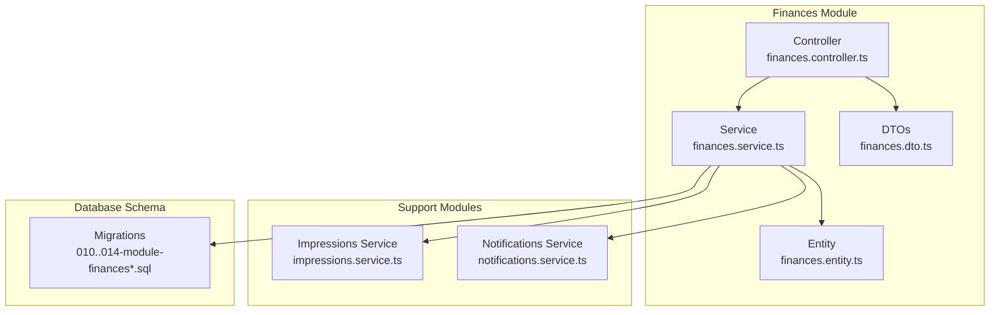
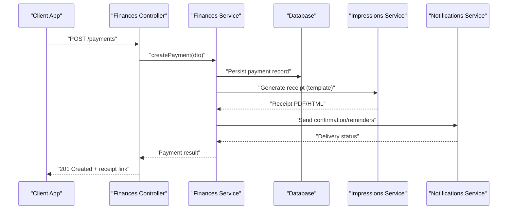
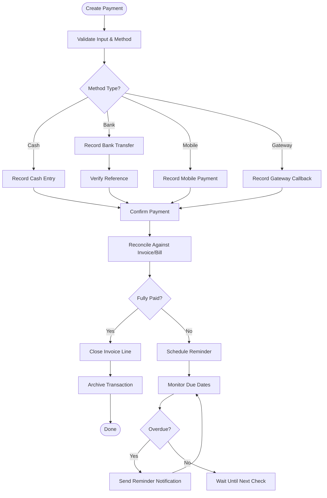
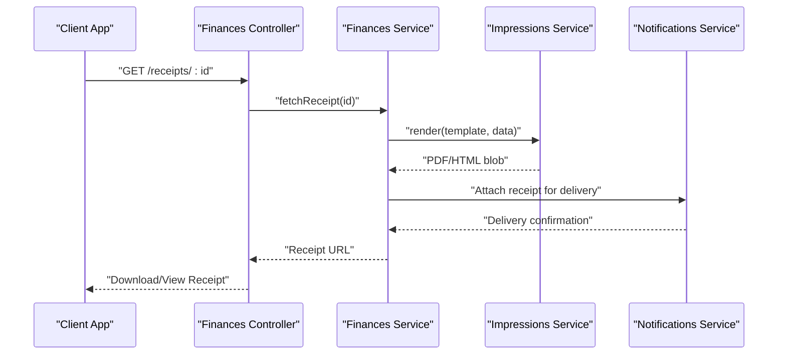
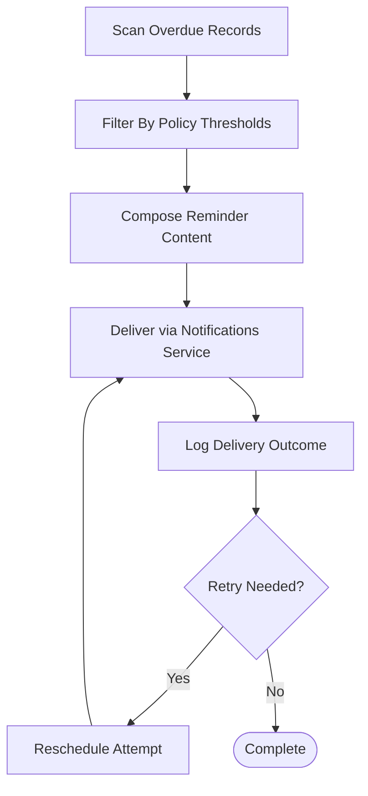
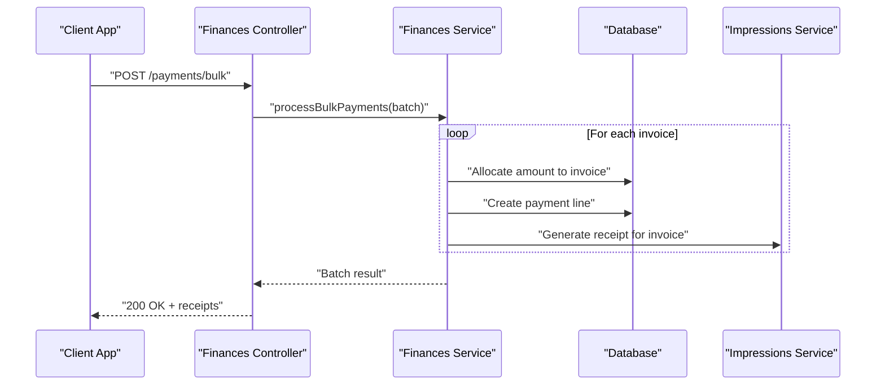
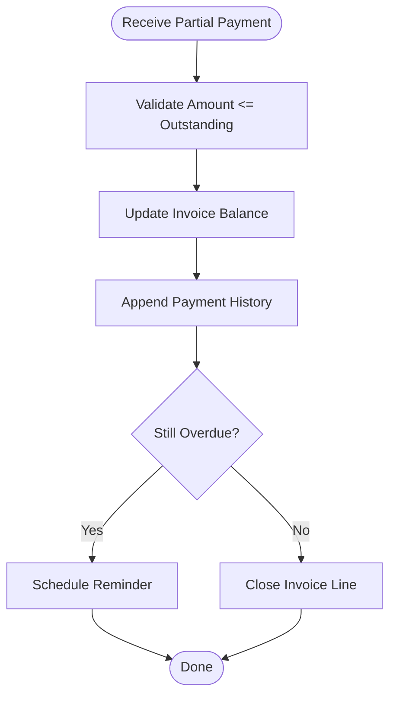
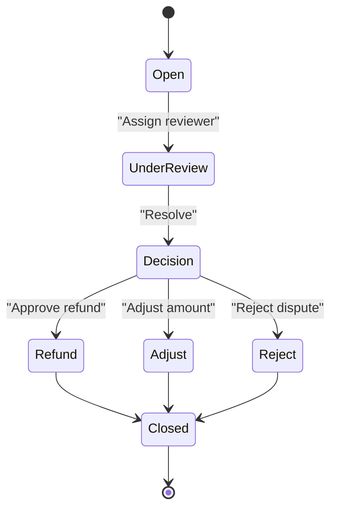
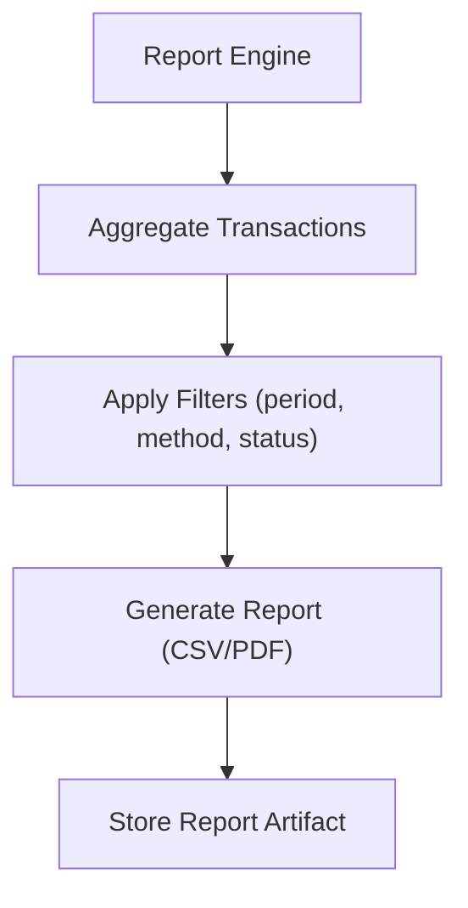
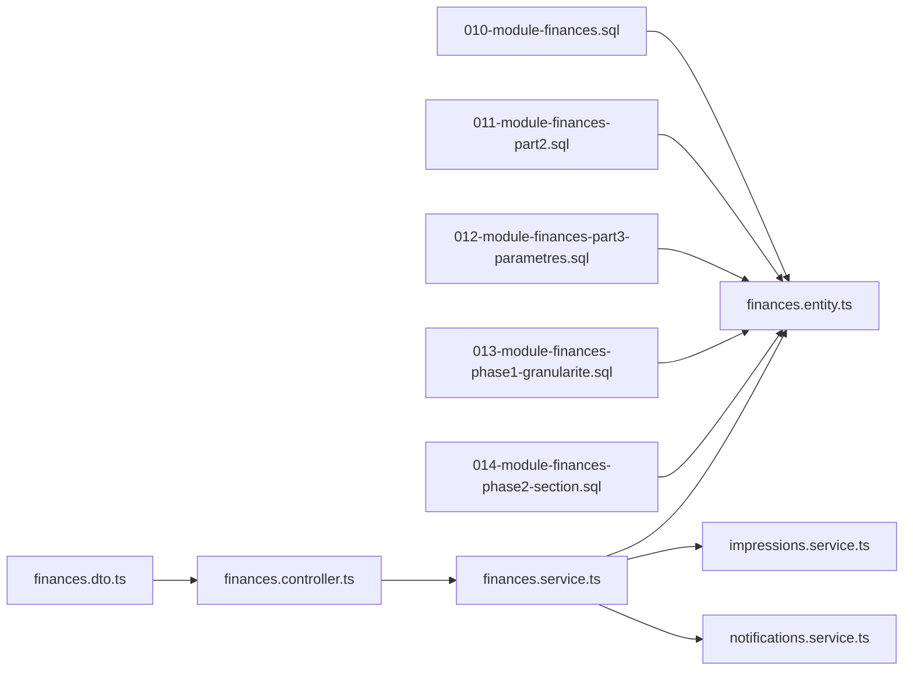

# Payment Processing

<cite>
**Referenced Files in This Document**
- [010-module-finances.sql](file://backend/database/migrations/010-module-finances.sql)
- [011-module-finances-part2.sql](file://backend/database/migrations/011-module-finances-part2.sql)
- [012-module-finances-part3-parametres.sql](file://backend/database/migrations/012-module-finances-part3-parametres.sql)
- [013-module-finances-phase1-granularite.sql](file://backend/database/migrations/013-module-finances-phase1-granularite.sql)
- [014-module-finances-phase2-section.sql](file://backend/database/migrations/014-module-finances-phase2-section.sql)
- [finances.service.ts](file://backend/src/modules/finances/services/finances.service.ts)
- [finances.controller.ts](file://backend/src/modules/finances/controllers/finances.controller.ts)
- [finances.dto.ts](file://backend/src/modules/finances/dto/finances.dto.ts)
- [finances.entity.ts](file://backend/src/modules/finances/entities/finances.entity.ts)
- [impressions.service.ts](file://backend/src/modules/impressions/services/impressions.service.ts)
- [notifications.service.ts](file://backend/src/modules/notifications/services/notifications.service.ts)
- [API-FINANCES.md](file://docs/API-FINANCES.md)
- [IMPLEMENTATION-COMPLETE-FINANCES.md](file://docs/implementations/IMPLEMENTATION-COMPLETE-FINANCES.md)
</cite>

## Table of Contents
1. [Introduction](#introduction)
2. [Project Structure](#project-structure)
3. [Core Components](#core-components)
4. [Architecture Overview](#architecture-overview)
5. [Detailed Component Analysis](#detailed-component-analysis)
6. [Dependency Analysis](#dependency-analysis)
7. [Performance Considerations](#performance-considerations)
8. [Troubleshooting Guide](#troubleshooting-guide)
9. [Conclusion](#conclusion)
10. [Appendices](#appendices)

## Introduction
This document describes eLISAschool’s payment processing system, covering multiple payment methods (cash, bank transfer, mobile payments, and online gateways), the end-to-end workflow from receipt generation to reconciliation, payment tracking and status management, automated reminders for overdue payments, customizable receipt templates with digital delivery, bulk and partial payments, dispute handling, reporting, security considerations, and compliance requirements. The content is grounded in the repository’s financial module migrations, services, controllers, DTOs, entities, and documentation artifacts.

## Project Structure
The payment processing functionality resides primarily within the finances module and integrates with printing and notifications modules. Database schema evolution is defined through a series of migrations that introduce core tables, parameters, granularity, and sections for financial operations.

**Diagram sources**
- [finances.controller.ts](file://backend/src/modules/finances/controllers/finances.controller.ts)
- [finances.service.ts](file://backend/src/modules/finances/services/finances.service.ts)
- [finances.entity.ts](file://backend/src/modules/finances/entities/finances.entity.ts)
- [finances.dto.ts](file://backend/src/modules/finances/dto/finances.dto.ts)
- [impressions.service.ts](file://backend/src/modules/impressions/services/impressions.service.ts)
- [notifications.service.ts](file://backend/src/modules/notifications/services/notifications.service.ts)
- [010-module-finances.sql](file://backend/database/migrations/010-module-finances.sql)
- [011-module-finances-part2.sql](file://backend/database/migrations/011-module-finances-part2.sql)
- [012-module-finances-part3-parametres.sql](file://backend/database/migrations/012-module-finances-part3-parametres.sql)
- [013-module-finances-phase1-granularite.sql](file://backend/database/migrations/013-module-finances-phase1-granularite.sql)
- [014-module-finances-phase2-section.sql](file://backend/database/migrations/014-module-finances-phase2-section.sql)

**Section sources**
- [010-module-finances.sql](file://backend/database/migrations/010-module-finances.sql)
- [011-module-finances-part2.sql](file://backend/database/migrations/011-module-finances-part2.sql)
- [012-module-finances-part3-parametres.sql](file://backend/database/migrations/012-module-finances-part3-parametres.sql)
- [013-module-finances-phase1-granularite.sql](file://backend/database/migrations/013-module-finances-phase1-granularite.sql)
- [014-module-finances-phase2-section.sql](file://backend/database/migrations/014-module-finances-phase2-section.sql)
- [finances.controller.ts](file://backend/src/modules/finances/controllers/finances.controller.ts)
- [finances.service.ts](file://backend/src/modules/finances/services/finances.service.ts)
- [finances.dto.ts](file://backend/src/modules/finances/dto/finances.dto.ts)
- [finances.entity.ts](file://backend/src/modules/finances/entities/finances.entity.ts)
- [impressions.service.ts](file://backend/src/modules/impressions/services/impressions.service.ts)
- [notifications.service.ts](file://backend/src/modules/notifications/services/notifications.service.ts)

## Core Components
- Controller: Exposes REST endpoints for payment operations such as recording payments, generating receipts, listing transactions, and managing statuses. It validates inputs via DTOs and delegates business logic to the service layer.
- Service: Implements core workflows including payment creation, partial payments, bulk payments, receipt generation, reminders scheduling, and reconciliation helpers. It interacts with entities, impressions, and notifications.
- Entity: Defines persistent data structures for payments, invoices/bills, payment methods, statuses, and related metadata.
- DTOs: Define request/response shapes for API contracts, ensuring consistent validation and type safety.
- Impressions Integration: Generates printable or downloadable receipts using configured templates.
- Notifications Integration: Sends reminders for overdue payments and confirms successful payments.

Key responsibilities:
- Payment lifecycle: create, update, reconcile, archive.
- Multi-method support: cash, bank transfer, mobile money, online gateway callbacks.
- Receipt engine: template-based generation and digital delivery (email/SMS).
- Reminders: scheduled checks for overdue balances and automated notifications.
- Reporting: summaries by period, method, student, and status.

**Section sources**
- [finances.controller.ts](file://backend/src/modules/finances/controllers/finances.controller.ts)
- [finances.service.ts](file://backend/src/modules/finances/services/finances.service.ts)
- [finances.dto.ts](file://backend/src/modules/finances/dto/finances.dto.ts)
- [finances.entity.ts](file://backend/src/modules/finances/entities/finances.entity.ts)
- [impressions.service.ts](file://backend/src/modules/impressions/services/impressions.service.ts)
- [notifications.service.ts](file://backend/src/modules/notifications/services/notifications.service.ts)

## Architecture Overview
The payment processing architecture follows a layered approach:
- Presentation/API Layer: Controller handles HTTP requests and responses.
- Business Logic Layer: Service orchestrates domain operations, enforces rules, and coordinates integrations.
- Persistence Layer: Entities mapped to database tables created by finance migrations.
- Integrations: Printing service for receipts; notification service for reminders and confirmations.

**Diagram sources**
- [finances.controller.ts](file://backend/src/modules/finances/controllers/finances.controller.ts)
- [finances.service.ts](file://backend/src/modules/finances/services/finances.service.ts)
- [impressions.service.ts](file://backend/src/modules/impressions/services/impressions.service.ts)
- [notifications.service.ts](file://backend/src/modules/notifications/services/notifications.service.ts)

## Detailed Component Analysis

### Payment Methods and Status Management
Supported methods include:
- Cash: recorded at point of collection with optional reference.
- Bank Transfer: requires verification steps and reference numbers.
- Mobile Payments: supports provider-specific references and callback handling.
- Online Gateways: webhook-driven updates with idempotency safeguards.

Statuses typically progress through:
- Pending -> Confirmed -> Reconciled -> Archived
- Exceptions: Disputed, Refunded, Cancelled

**Diagram sources**
- [finances.service.ts](file://backend/src/modules/finances/services/finances.service.ts)
- [finances.entity.ts](file://backend/src/modules/finances/entities/finances.entity.ts)
- [notifications.service.ts](file://backend/src/modules/notifications/services/notifications.service.ts)

**Section sources**
- [finances.service.ts](file://backend/src/modules/finances/services/finances.service.ts)
- [finances.entity.ts](file://backend/src/modules/finances/entities/finances.entity.ts)
- [notifications.service.ts](file://backend/src/modules/notifications/services/notifications.service.ts)

### Receipt Generation System
Receipts are generated using configurable templates and can be delivered digitally (e.g., email or SMS links). The process involves:
- Selecting a template based on institution settings.
- Rendering receipt content with payment details.
- Storing the generated artifact and returning a secure link.
- Optionally attaching to notifications for delivery.

**Diagram sources**
- [finances.controller.ts](file://backend/src/modules/finances/controllers/finances.controller.ts)
- [finances.service.ts](file://backend/src/modules/finances/services/finances.service.ts)
- [impressions.service.ts](file://backend/src/modules/impressions/services/impressions.service.ts)
- [notifications.service.ts](file://backend/src/modules/notifications/services/notifications.service.ts)

**Section sources**
- [finances.controller.ts](file://backend/src/modules/finances/controllers/finances.controller.ts)
- [finances.service.ts](file://backend/src/modules/finances/services/finances.service.ts)
- [impressions.service.ts](file://backend/src/modules/impressions/services/impressions.service.ts)
- [notifications.service.ts](file://backend/src/modules/notifications/services/notifications.service.ts)

### Automated Reminder System for Overdue Payments
Reminders are triggered by periodic checks against due dates and outstanding balances. The system:
- Scans unpaid or partially paid records.
- Applies policy thresholds (e.g., days past due).
- Sends notifications via configured channels.
- Logs reminder attempts and outcomes.

**Diagram sources**
- [finances.service.ts](file://backend/src/modules/finances/services/finances.service.ts)
- [notifications.service.ts](file://backend/src/modules/notifications/services/notifications.service.ts)

**Section sources**
- [finances.service.ts](file://backend/src/modules/finances/services/finances.service.ts)
- [notifications.service.ts](file://backend/src/modules/notifications/services/notifications.service.ts)

### Bulk Payments Processing
Bulk payments allow aggregating multiple invoices into a single transaction batch. The workflow:
- Accepts a list of invoice IDs and total amount.
- Distributes amounts across invoices respecting priorities and constraints.
- Creates individual payment lines and updates balances.
- Generates consolidated receipts per invoice.

**Diagram sources**
- [finances.controller.ts](file://backend/src/modules/finances/controllers/finances.controller.ts)
- [finances.service.ts](file://backend/src/modules/finances/services/finances.service.ts)
- [impressions.service.ts](file://backend/src/modules/impressions/services/impressions.service.ts)

**Section sources**
- [finances.controller.ts](file://backend/src/modules/finances/controllers/finances.controller.ts)
- [finances.service.ts](file://backend/src/modules/finances/services/finances.service.ts)
- [impressions.service.ts](file://backend/src/modules/impressions/services/impressions.service.ts)

### Partial Payments Handling
Partial payments reduce outstanding balances without closing invoice lines immediately. The system:
- Validates partial amount against remaining balance.
- Updates payment history and running totals.
- Maintains audit trail for each allocation.
- Triggers reminders if still overdue after partial payment.

**Diagram sources**
- [finances.service.ts](file://backend/src/modules/finances/services/finances.service.ts)
- [finances.entity.ts](file://backend/src/modules/finances/entities/finances.entity.ts)

**Section sources**
- [finances.service.ts](file://backend/src/modules/finances/services/finances.service.ts)
- [finances.entity.ts](file://backend/src/modules/finances/entities/finances.entity.ts)

### Payment Disputes Management
Dispute handling includes:
- Recording disputes linked to specific payments/invoices.
- Assigning reviewers and tracking resolution steps.
- Updating statuses upon decisions (refund, adjust, reject).
- Auditing all changes for compliance.

**Diagram sources**
- [finances.service.ts](file://backend/src/modules/finances/services/finances.service.ts)
- [finances.entity.ts](file://backend/src/modules/finances/entities/finances.entity.ts)

**Section sources**
- [finances.service.ts](file://backend/src/modules/finances/services/finances.service.ts)
- [finances.entity.ts](file://backend/src/modules/finances/entities/finances.entity.ts)

### Payment Reports and Analytics
Reports provide insights into collections, methods, periods, and anomalies:
- Summary by date range, method, and status.
- Top delinquents and aging buckets.
- Reconciliation variance reports.
- Exportable formats for accounting integration.

[No diagram sources since this diagram shows conceptual workflow, not actual code structure]

**Section sources**
- [finances.service.ts](file://backend/src/modules/finances/services/finances.service.ts)

### Practical Examples
- Bulk payments: Submit a batch payload containing multiple invoice IDs and an aggregated amount; the service allocates funds and returns per-invoice receipts.
- Partial payments: Provide invoice ID and partial amount; the system updates balances and schedules reminders if needed.
- Disputes: Create a dispute record referencing the payment; track review stages and final actions.
- Reports: Query report endpoints with filters to produce summaries and export files.

[No section sources since examples describe usage patterns without analyzing specific files]

## Dependency Analysis
The finances module depends on:
- Database schema defined by migration files.
- Impressions service for receipt rendering.
- Notifications service for reminders and confirmations.
- DTOs and entities for input validation and persistence.

**Diagram sources**
- [010-module-finances.sql](file://backend/database/migrations/010-module-finances.sql)
- [011-module-finances-part2.sql](file://backend/database/migrations/011-module-finances-part2.sql)
- [012-module-finances-part3-parametres.sql](file://backend/database/migrations/012-module-finances-part3-parametres.sql)
- [013-module-finances-phase1-granularite.sql](file://backend/database/migrations/013-module-finances-phase1-granularite.sql)
- [014-module-finances-phase2-section.sql](file://backend/database/migrations/014-module-finances-phase2-section.sql)
- [finances.dto.ts](file://backend/src/modules/finances/dto/finances.dto.ts)
- [finances.controller.ts](file://backend/src/modules/finances/controllers/finances.controller.ts)
- [finances.service.ts](file://backend/src/modules/finances/services/finances.service.ts)
- [finances.entity.ts](file://backend/src/modules/finances/entities/finances.entity.ts)
- [impressions.service.ts](file://backend/src/modules/impressions/services/impressions.service.ts)
- [notifications.service.ts](file://backend/src/modules/notifications/services/notifications.service.ts)

**Section sources**
- [010-module-finances.sql](file://backend/database/migrations/010-module-finances.sql)
- [011-module-finances-part2.sql](file://backend/database/migrations/011-module-finances-part2.sql)
- [012-module-finances-part3-parametres.sql](file://backend/database/migrations/012-module-finances-part3-parametres.sql)
- [013-module-finances-phase1-granularite.sql](file://backend/database/migrations/013-module-finances-phase1-granularite.sql)
- [014-module-finances-phase2-section.sql](file://backend/database/migrations/014-module-finances-phase2-section.sql)
- [finances.dto.ts](file://backend/src/modules/finances/dto/finances.dto.ts)
- [finances.controller.ts](file://backend/src/modules/finances/controllers/finances.controller.ts)
- [finances.service.ts](file://backend/src/modules/finances/services/finances.service.ts)
- [finances.entity.ts](file://backend/src/modules/finances/entities/finances.entity.ts)
- [impressions.service.ts](file://backend/src/modules/impressions/services/impressions.service.ts)
- [notifications.service.ts](file://backend/src/modules/notifications/services/notifications.service.ts)

## Performance Considerations
- Indexing: Ensure indexes on frequently queried fields (student, invoice, date ranges, status).
- Batching: Use bulk endpoints to minimize round trips and transaction overhead.
- Caching: Cache static configuration like receipt templates and fee structures where appropriate.
- Asynchronous Workflows: Offload receipt rendering and notifications to background jobs to keep APIs responsive.
- Pagination: Apply pagination on list endpoints to avoid large payloads.

[No sources needed since this section provides general guidance]

## Troubleshooting Guide
Common issues and resolutions:
- Duplicate payments: Enforce idempotency keys on gateway callbacks and validate before persisting.
- Missing receipts: Verify impression template availability and permissions; check logs for rendering errors.
- Reminder failures: Inspect notification delivery logs and retry policies; ensure contact information is up to date.
- Reconciliation mismatches: Compare payment lines with invoice allocations; review audit trails for adjustments.

**Section sources**
- [finances.service.ts](file://backend/src/modules/finances/services/finances.service.ts)
- [notifications.service.ts](file://backend/src/modules/notifications/services/notifications.service.ts)

## Conclusion
eLISAschool’s payment processing system provides a robust foundation for multi-method payments, comprehensive receipt generation, automated reminders, and reconciliation workflows. The layered architecture ensures maintainability and scalability, while integrations with printing and notifications enhance user experience. Security and compliance measures should be enforced throughout the lifecycle to protect sensitive financial data.

[No sources needed since this section summarizes without analyzing specific files]

## Appendices

### API Documentation References
- API definitions and examples for finances endpoints are documented in the repository’s API guide.

**Section sources**
- [API-FINANCES.md](file://docs/API-FINANCES.md)

### Implementation Notes
- Detailed implementation notes for the finances module are available in the implementation summary.

**Section sources**
- [IMPLEMENTATION-COMPLETE-FINANCES.md](file://docs/implementations/IMPLEMENTATION-COMPLETE-FINANCES.md)