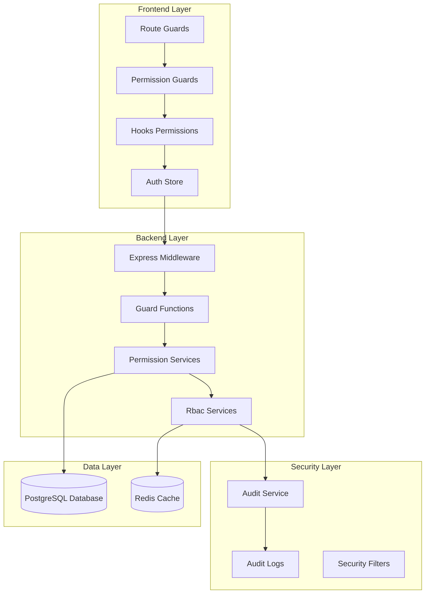
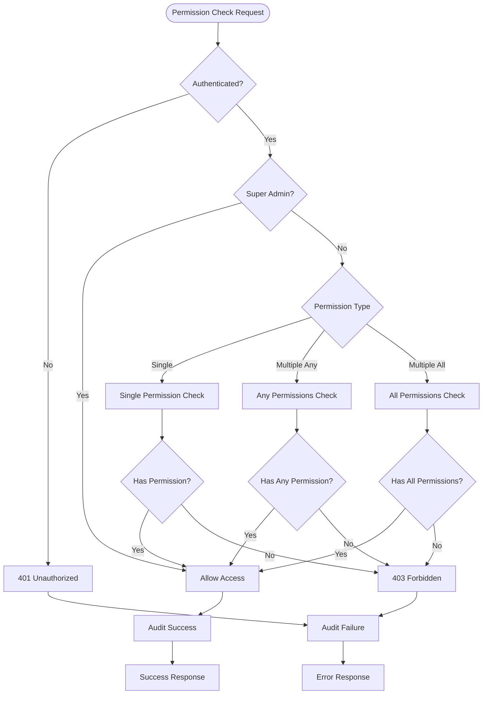
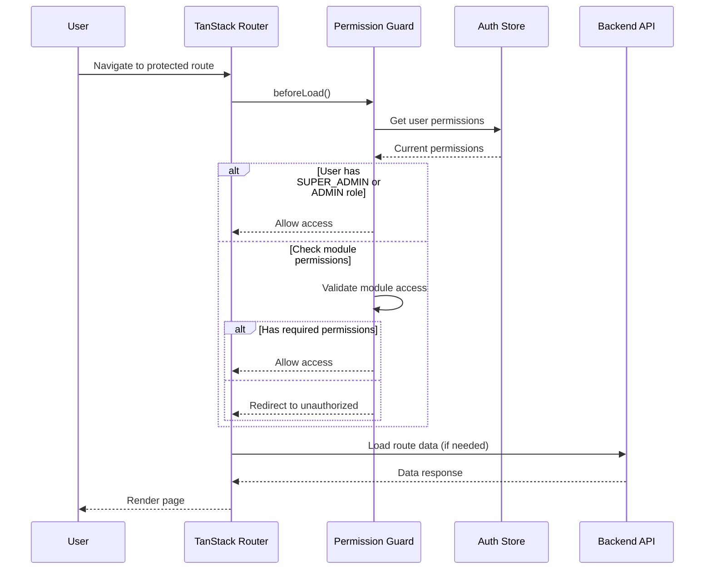
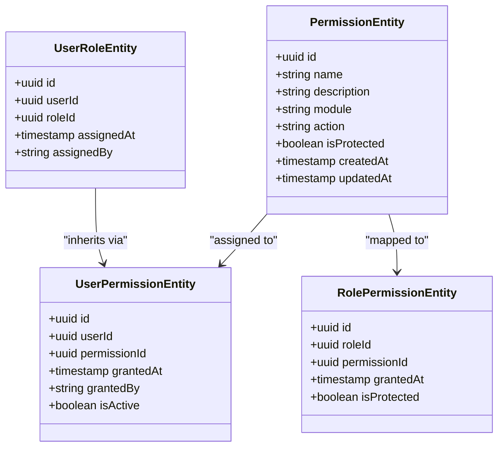
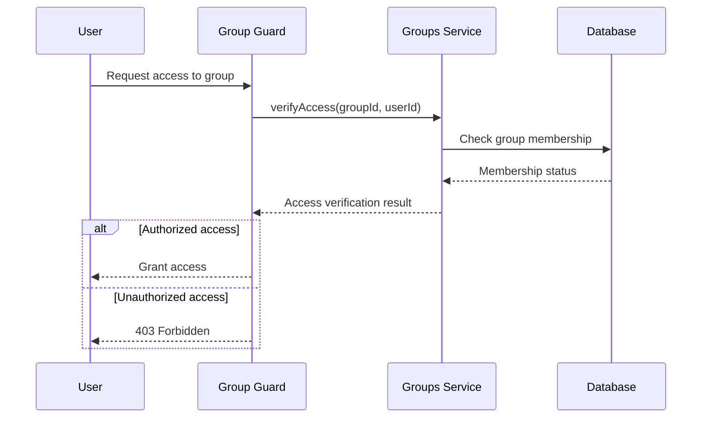

# Advanced Permission Guards System

<cite>
**Referenced Files in This Document**
- [permission.guard.ts](file://backend/src/modules/auth/guards/permission.guard.ts)
- [check-permission.middleware.ts](file://backend/src/modules/auth/guards/check-permission.middleware.ts)
- [config.guard.ts](file://backend/src/modules/configuration/guards/config.guard.ts)
- [groupe-access.guard.ts](file://backend/src/modules/groupes-etablissements/guards/groupe-access.guard.ts)
- [permission-guards.ts](file://frontend/src/app/permission-guards.ts)
- [route-guards.ts](file://frontend/src/app/route-guards.ts)
- [use-permissions-advanced.ts](file://frontend/src/hooks/use-permissions-advanced.ts)
- [use-permissions.ts](file://frontend/src/hooks/use-permissions.ts)
- [use-roles-permissions.ts](file://frontend/src/features/utilisateurs/hooks/use-roles-permissions.ts)
- [roles.enum.ts](file://shared/src/enums/roles.enum.ts)
- [config-permissions.ts](file://backend/src/modules/configuration/guards/config-permissions.ts)
- [groupes.service.ts](file://backend/src/modules/groupes-etablissements/services/groupes.service.ts)
- [audit.service.ts](file://backend/src/modules/auth/services/audit.service.ts)
- [audit-log.entity.ts](file://backend/src/modules/auth/entities/audit-log.entity.ts)
- [permissions.controller.ts](file://backend/src/modules/rbac/controllers/permissions.controller.ts)
- [permissions.service.ts](file://backend/src/modules/rbac/services/permissions.service.ts)
</cite>

## Table of Contents
1. [Introduction](#introduction)
2. [System Architecture](#system-architecture)
3. [Backend Permission Guards](#backend-permission-guards)
4. [Frontend Permission Guards](#frontend-permission-guards)
5. [RBAC Implementation](#rbac-implementation)
6. [Configuration Permissions](#configuration-permissions)
7. [Module-Specific Guards](#module-specific-guards)
8. [Audit and Security](#audit-and-security)
9. [Integration Patterns](#integration-patterns)
10. [Best Practices](#best-practices)

## Introduction

The Advanced Permission Guards System in eLISAschool provides a comprehensive role-based access control (RBAC) framework that ensures secure and granular permission management across the entire educational management platform. This system supports multiple authentication modes, dynamic permission resolution, and comprehensive audit logging to maintain security compliance and operational transparency.

The system operates on a dual-layer architecture where permissions are validated both at the backend API level and the frontend routing level, providing defense-in-depth security measures. It supports sophisticated permission patterns including hierarchical module permissions, action-based permissions, and role-based access controls with super admin bypass capabilities.

## System Architecture

The permission guards system follows a layered architecture pattern that separates concerns between authentication, authorization, and permission enforcement:

**Diagram sources**
- [permission-guards.ts:1-186](file://frontend/src/app/permission-guards.ts#L1-L186)
- [permission.guard.ts:1-129](file://backend/src/modules/auth/guards/permission.guard.ts#L1-L129)
- [audit.service.ts](file://backend/src/modules/auth/services/audit.service.ts)

The architecture implements several key security principles:

- **Defense-in-Depth**: Multiple layers of permission checking from frontend routing to backend API endpoints
- **Separation of Concerns**: Clear distinction between authentication, authorization, and permission enforcement
- **Audit Trail**: Comprehensive logging of all permission decisions and access attempts
- **Fallback Mechanisms**: Graceful degradation between old and new permission systems

## Backend Permission Guards

The backend permission guards form the core of the server-side security implementation, providing robust permission validation for all API endpoints.

### Core Permission Guard Functions

The primary permission guard system centers around several key functions that handle different permission checking scenarios:

**Diagram sources**
- [permission.guard.ts:55-99](file://backend/src/modules/auth/guards/permission.guard.ts#L55-L99)

### Permission Validation Logic

The backend implements a sophisticated permission validation system that supports both the new dynamic RBAC model and legacy static role-based permissions:

**Section sources**
- [permission.guard.ts:22-48](file://backend/src/modules/auth/guards/permission.guard.ts#L22-L48)

The system evaluates permissions in the following order:

1. **JWT-Based Permissions**: Checks the user's current permissions array from the authentication token
2. **Role-Based Fallback**: Falls back to predefined role-permission mappings for legacy compatibility
3. **Super Admin Bypass**: Automatically grants access to users with SUPER_ADMIN role

### Middleware Implementation

The permission guard system provides both decorator-style and middleware-style implementations for flexible integration:

**Section sources**
- [check-permission.middleware.ts:19-43](file://backend/src/modules/auth/guards/check-permission.middleware.ts#L19-L43)

The middleware approach offers:
- Function composition for route handlers
- Flexible permission checking patterns
- Consistent error handling across all endpoints

## Frontend Permission Guards

The frontend permission guards provide client-side security validation that enhances user experience while maintaining security boundaries.

### Route-Level Permission Guards

The frontend implements comprehensive route guards that prevent unauthorized access to protected areas of the application:

**Diagram sources**
- [permission-guards.ts:29-60](file://frontend/src/app/permission-guards.ts#L29-L60)

### Advanced Permission Checking

The frontend provides sophisticated permission checking mechanisms that support complex permission patterns:

**Section sources**
- [permission-guards.ts:132-185](file://frontend/src/app/permission-guards.ts#L132-L185)

The system supports three primary permission checking modes:

1. **requireAllPermissions**: Requires user to have ALL specified permissions
2. **requireAnyPermission**: Requires user to have AT LEAST ONE specified permission  
3. **requirePermission**: Checks for a single specific permission

### Hook-Based Integration

The system integrates seamlessly with React hooks for dynamic permission checking:

**Section sources**
- [use-permissions-advanced.ts](file://frontend/src/hooks/use-permissions-advanced.ts)
- [use-permissions.ts](file://frontend/src/hooks/use-permissions.ts)

These hooks provide reactive permission state management and automatic UI updates when permissions change.

## RBAC Implementation

The Role-Based Access Control (RBAC) system provides a comprehensive framework for managing user permissions and roles across the entire platform.

### Permission Entity Structure

The RBAC system defines a structured approach to permission management through dedicated entity types:

**Diagram sources**
- [permission.guard.ts:14](file://backend/src/modules/auth/guards/permission.guard.ts#L14)
- [roles.enum.ts](file://shared/src/enums/roles.enum.ts)

### Permission Resolution Hierarchy

The RBAC system implements a multi-level permission resolution hierarchy that determines effective permissions:

**Section sources**
- [permission.guard.ts:22-34](file://backend/src/modules/auth/guards/permission.guard.ts#L22-L34)

The hierarchy operates in the following order:

1. **Direct User Permissions**: Explicitly granted permissions to individual users
2. **Role-Based Permissions**: Permissions inherited through user roles
3. **Group-Based Permissions**: Permissions inherited through organizational groups
4. **Default Role Permissions**: Fallback permissions for basic roles

### Dynamic Permission Management

The RBAC system supports dynamic permission assignment and revocation through dedicated controllers and services:

**Section sources**
- [permissions.controller.ts](file://backend/src/modules/rbac/controllers/permissions.controller.ts)
- [permissions.service.ts](file://backend/src/modules/rbac/services/permissions.service.ts)

## Configuration Permissions

The configuration module implements specialized permission guards for managing system-wide settings and configurations.

### Configuration Permission Types

The system defines specific permission categories for configuration management:

**Section sources**
- [config.guard.ts:19-55](file://backend/src/modules/configuration/guards/config.guard.ts#L19-L55)

Configuration permissions are categorized into several domains:

- **Application Configuration**: Global system settings and parameters
- **Module Configuration**: Individual module activation and settings
- **Parameter Management**: CRUD operations on configuration parameters
- **Backup and Restore**: System backup and restoration capabilities
- **Audit and History**: Access to configuration change logs

### Configuration Guard Implementation

The configuration guards provide granular control over who can modify different aspects of system configuration:

**Section sources**
- [config.guard.ts:57-82](file://backend/src/modules/configuration/guards/config.guard.ts#L57-L82)

Each configuration guard corresponds to specific administrative actions:

- `canViewConfigApp`: View application-level settings
- `canEditConfigApp`: Modify application-level settings  
- `canViewConfigModule`: View module-specific settings
- `canEditConfigModule`: Modify module-specific settings
- `canToggleModule`: Enable/disable system modules

## Module-Specific Guards

The system implements specialized guards for different functional modules, each with unique access requirements and validation logic.

### Group Access Guard

The group access guard provides security for organizational group management:

**Section sources**
- [groupe-access.guard.ts:19-36](file://backend/src/modules/groupes-etablissements/guards/groupe-access.guard.ts#L19-L36)

This guard ensures that users can only access groups they have legitimate connections to:

**Diagram sources**
- [groupe-access.guard.ts:27-35](file://backend/src/modules/groupes-etablissements/guards/groupe-access.guard.ts#L27-L35)

### Parent Access Guard

The parent access guard provides specialized security for student-related data access:

**Section sources**
- [groupe-access.guard.ts:11-14](file://backend/src/modules/responsables-eleves/middlewares/parent-access.guard.ts)

This guard ensures that parents can only access information about their own children, implementing strict data separation between users.

## Audit and Security

The permission guards system implements comprehensive audit logging to track all permission decisions and access attempts.

### Audit Logging Implementation

The system automatically logs all permission-related events for security and compliance purposes:

**Section sources**
- [permission.guard.ts:81-85](file://backend/src/modules/auth/guards/permission.guard.ts#L81-L85)

Audit events capture essential information including:

- User ID and role information
- Permission being requested
- Access decision (granted/denied)
- Timestamp and IP address
- Request context and route information

### Security Error Handling

The system implements consistent error handling for security violations:

**Section sources**
- [permission.guard.ts:87-92](file://backend/src/modules/auth/guards/permission.guard.ts#L87-L92)

Security errors are standardized with specific error codes and messages to facilitate monitoring and incident response.

## Integration Patterns

The permission guards system provides several integration patterns to accommodate different use cases and architectural requirements.

### Decorator Pattern Integration

The system supports decorator-style integration for clean and readable code:

**Section sources**
- [permission.guard.ts:104-128](file://backend/src/modules/auth/guards/permission.guard.ts#L104-L128)

Common decorator patterns include:

- `@requirePermission(Permission.USERS_VIEW)`: Single permission requirement
- `@requirePermissions([Permission.USERS_CREATE, Permission.USERS_EDIT])`: Multiple permission requirement
- Predefined convenience decorators like `canManageUsers`, `canViewNotes`

### Middleware Integration

The middleware pattern provides flexibility for complex permission logic:

**Section sources**
- [check-permission.middleware.ts:19-43](file://backend/src/modules/auth/guards/check-permission.middleware.ts#L19-L43)

Middleware integration allows for:

- Custom permission validation logic
- Conditional permission checks based on request context
- Integration with external authorization systems

### Frontend Integration Patterns

The frontend guards support multiple integration approaches:

**Section sources**
- [permission-guards.ts:29-60](file://frontend/src/app/permission-guards.ts#L29-L60)

Frontend integration patterns include:

- Route-level guards using TanStack Router's `beforeLoad` hook
- Component-level permission checks using React hooks
- Dynamic UI rendering based on permission state

## Best Practices

The Advanced Permission Guards System follows established security best practices to ensure robust protection and maintainable code.

### Security Best Practices

1. **Principle of Least Privilege**: Users should have the minimum permissions necessary for their roles
2. **Defense-in-Depth**: Multiple layers of security validation from frontend to backend
3. **Audit Logging**: Comprehensive tracking of all permission decisions and access attempts
4. **Error Handling**: Consistent and secure error handling that doesn't leak sensitive information
5. **Super Admin Bypass**: Carefully controlled bypass mechanism for emergency situations

### Performance Optimization

The system implements several performance optimization strategies:

- **Permission Caching**: Redis-based caching for frequently accessed permission data
- **Lazy Loading**: Permissions loaded only when needed
- **Efficient Queries**: Optimized database queries for permission lookups
- **Batch Operations**: Efficient handling of multiple permission checks

### Maintainability Guidelines

To ensure long-term maintainability of the permission system:

- **Clear Naming Conventions**: Consistent naming for permissions, guards, and services
- **Documentation Standards**: Comprehensive documentation for all permission definitions
- **Testing Coverage**: Extensive unit and integration testing for permission logic
- **Migration Strategies**: Planned migration paths between old and new permission systems

The Advanced Permission Guards System provides a robust, scalable, and maintainable foundation for securing the eLISAschool platform while supporting future growth and feature development.