# Frontend & PWA Implementation

<cite>
**Referenced Files in This Document**
- [package.json](file://package.json)
- [README.md](file://README.md)
- [Dockerfile.frontend](file://docker/Dockerfile.frontend)
- [shared/package.json](file://shared/package.json)
- [shared/src/types/api.types.ts](file://shared/src/types/api.types.ts)
- [shared/src/types/user.types.ts](file://shared/src/types/user.types.ts)
- [shared/src/validators/auth.validators.ts](file://shared/src/validators/auth.validators.ts)
- [shared/src/enums/modules.enum.ts](file://shared/src/enums/modules.enum.ts)
- [shared/src/enums/roles.enum.ts](file://shared/src/enums/roles.enum.ts)
- [shared/src/constants/app.constants.ts](file://shared/src/constants/app.constants.ts)
- [frontend/src/features/competences/index.ts](file://frontend/src/features/competences/index.ts)
- [frontend/src/features/specialites/index.ts](file://frontend/src/features/specialites/index.ts)
- [frontend/src/routes/_auth.competences.tsx](file://frontend/src/routes/_auth.competences.tsx)
- [frontend/src/routes/_auth.specialites.tsx](file://frontend/src/routes/_auth.specialites.tsx)
- [frontend/src/features/cycles/components/cycle-form-modal.tsx](file://frontend/src/features/cycles/components/cycle-form-modal.tsx)
- [frontend/src/features/cycles/components/cycles-page.tsx](file://frontend/src/features/cycles/components/cycles-page.tsx)
- [frontend/src/features/cycles/hooks/use-cycles.ts](file://frontend/src/features/cycles/hooks/use-cycles.ts)
- [frontend/src/features/cycles/hooks/use-tous-cycles.ts](file://frontend/src/features/cycles/hooks/use-tous-cycles.ts)
- [frontend/src/features/cycles/types/cycle.types.ts](file://frontend/src/features/cycles/types/cycle.types.ts)
- [frontend/src/components/auth/EtablissementSelectionModal.tsx](file://frontend/src/components/auth/EtablissementSelectionModal.tsx)
- [frontend/src/components/auth/EtablissementSwitcher.tsx](file://frontend/src/components/auth/EtablissementSwitcher.tsx)
- [frontend/src/hooks/use-etablissement-selection.ts](file://frontend/src/hooks/use-etablissement-selection.ts)
- [frontend/src/hooks/use-multi-tenant.ts](file://frontend/src/hooks/use-multi-tenant.ts)
- [frontend/src/features/etablissements/components/etablissements-page.tsx](file://frontend/src/features/etablissements/components/etablissements-page.tsx)
- [frontend/src/features/etablissements/hooks/use-etablissements.ts](file://frontend/src/features/etablissements/hooks/use-etablissements.ts)
- [frontend/src/features/etablissements/types/etablissement.types.ts](file://frontend/src/features/etablissements/types/etablissement.types.ts)
- [backend/src/common/middlewares/tenant.middleware.ts](file://backend/src/common/middlewares/tenant.middleware.ts)
</cite>

## Update Summary
**Changes Made**
- Added comprehensive establishment selection components with modal interface and auto-selection functionality
- Enhanced multi-tenant hooks with establishment switching capabilities and token management
- Implemented establishment switching functionality with real-time tenant context updates
- Integrated establishment management features with administrative controls
- Updated routing system to support multi-establishment user flows

## Table of Contents
1. [Introduction](#introduction)
2. [Project Structure](#project-structure)
3. [Core Components](#core-components)
4. [Architecture Overview](#architecture-overview)
5. [Detailed Component Analysis](#detailed-component-analysis)
6. [Establishment Selection System](#establishment-selection-system)
7. [Multi-Tenant Hooks Enhancement](#multi-tenant-hooks-enhancement)
8. [Establishment Management Features](#establishment-management-features)
9. [New Educational Framework Features](#new-educational-framework-features)
10. [Dependency Analysis](#dependency-analysis)
11. [Performance Considerations](#performance-considerations)
12. [Troubleshooting Guide](#troubleshooting-guide)
13. [Conclusion](#conclusion)
14. [Appendices](#appendices)

## Introduction
This document describes the eLISAschool frontend and Progressive Web App (PWA) implementation as reflected in the repository. The project is a monorepo with workspaces for backend, frontend, and a shared library. The frontend is built with React and Vite and is configured as a PWA. The shared library centralizes types, validators, enumerations, and constants used across the backend and frontend.

Key goals:
- Document the React + Vite architecture and PWA features
- Explain shared types and validators
- Describe the theme system and responsive design patterns
- Detail UI components, state management, and backend API integration
- Cover PWA manifest configuration, caching strategies, and performance optimization
- Address cross-browser compatibility, accessibility, and mobile-first design
- Document establishment selection system and multi-tenant functionality

**Updated** Added comprehensive coverage of establishment selection components, enhanced multi-tenant hooks, establishment switching functionality, and establishment management features.

## Project Structure
The repository follows a monorepo layout with three primary workspaces:
- backend: Express.js API (TypeScript) with multi-tenant middleware support
- frontend: React + Vite PWA with establishment selection and switching
- shared: Shared TypeScript library for types, validators, enums, and constants

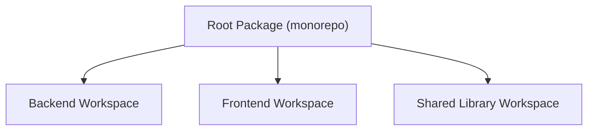

**Diagram sources**
- [package.json:8-12](file://package.json#L8-L12)

**Section sources**
- [package.json:8-12](file://package.json#L8-L12)
- [README.md:18-27](file://README.md#L18-L27)

## Core Components
This section outlines the core building blocks leveraged by the frontend and PWA.

- Shared types and API response models
  - Standardized API response shape and pagination metadata
  - Reference: [shared/src/types/api.types.ts:12-61](file://shared/src/types/api.types.ts#L12-L61)

- User types and roles
  - User profile and role/permission enumerations
  - Reference: [shared/src/types/user.types.ts](file://shared/src/types/user.types.ts)
  - Reference: [shared/src/enums/roles.enum.ts:12-184](file://shared/src/enums/roles.enum.ts#L12-L184)

- Authentication validators
  - Zod-based schemas for login, registration, password changes, and resets
  - Reference: [shared/src/validators/auth.validators.ts:15-103](file://shared/src/validators/auth.validators.ts#L15-L103)

- Application constants and limits
  - Limits, currencies, languages, and defaults
  - Reference: [shared/src/constants/app.constants.ts:23-71](file://shared/src/constants/app.constants.ts#L23-L71)

- Module taxonomy
  - Module names and categories for feature organization
  - Reference: [shared/src/enums/modules.enum.ts:14-104](file://shared/src/enums/modules.enum.ts#L14-L104)

**Section sources**
- [shared/src/types/api.types.ts:12-61](file://shared/src/types/api.types.ts#L12-L61)
- [shared/src/types/user.types.ts](file://shared/src/types/user.types.ts)
- [shared/src/validators/auth.validators.ts:15-103](file://shared/src/validators/auth.validators.ts#L15-L103)
- [shared/src/constants/app.constants.ts:23-71](file://shared/src/constants/app.constants.ts#L23-L71)
- [shared/src/enums/modules.enum.ts:14-104](file://shared/src/enums/modules.enum.ts#L14-L104)
- [shared/src/enums/roles.enum.ts:12-184](file://shared/src/enums/roles.enum.ts#L12-L184)

## Architecture Overview
The frontend is structured as a React + Vite PWA. The monorepo's shared library provides type-safe contracts and validation logic used by both frontend and backend. The Dockerfile for the frontend builds the PWA and serves it via Nginx. The establishment selection system integrates seamlessly with the multi-tenant architecture.

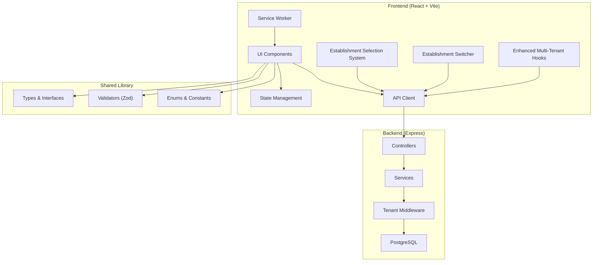

**Diagram sources**
- [docker/Dockerfile.frontend:17-22](file://docker/Dockerfile.frontend#L17-L22)
- [shared/src/types/api.types.ts:12-61](file://shared/src/types/api.types.ts#L12-L61)
- [shared/src/validators/auth.validators.ts:15-103](file://shared/src/validators/auth.validators.ts#L15-L103)
- [shared/src/enums/modules.enum.ts:14-104](file://shared/src/enums/modules.enum.ts#L14-L104)
- [backend/src/common/middlewares/tenant.middleware.ts:87-131](file://backend/src/common/middlewares/tenant.middleware.ts#L87-L131)

## Detailed Component Analysis

### Shared Types and Validation
The shared library defines:
- API response contracts and pagination metadata
- User profile types
- Authentication schemas validated with Zod
- Enumerations for roles and module taxonomy
- Application constants (limits, currencies, languages)

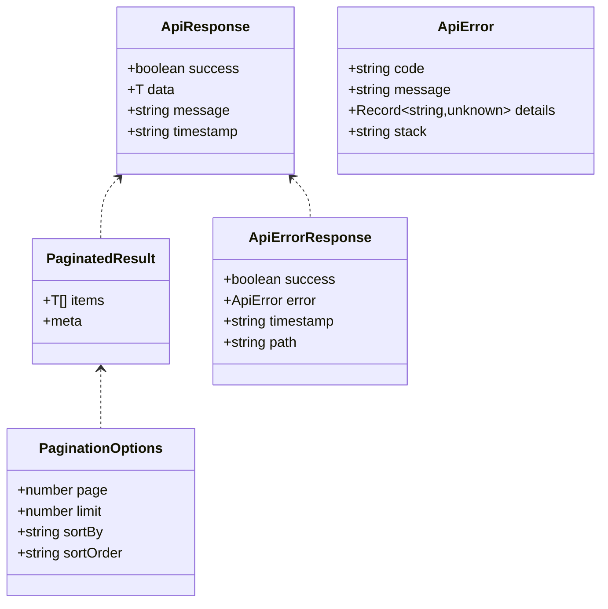

**Diagram sources**
- [shared/src/types/api.types.ts:12-61](file://shared/src/types/api.types.ts#L12-L61)

**Section sources**
- [shared/src/types/api.types.ts:12-61](file://shared/src/types/api.types.ts#L12-L61)
- [shared/src/validators/auth.validators.ts:15-103](file://shared/src/validators/auth.validators.ts#L15-L103)
- [shared/src/enums/roles.enum.ts:12-184](file://shared/src/enums/roles.enum.ts#L12-L184)
- [shared/src/enums/modules.enum.ts:14-104](file://shared/src/enums/modules.enum.ts#L14-L104)
- [shared/src/constants/app.constants.ts:23-71](file://shared/src/constants/app.constants.ts#L23-L71)

### Authentication Flow (Client-Side)
The client-side authentication flow uses Zod schemas for form validation and integrates with backend endpoints.

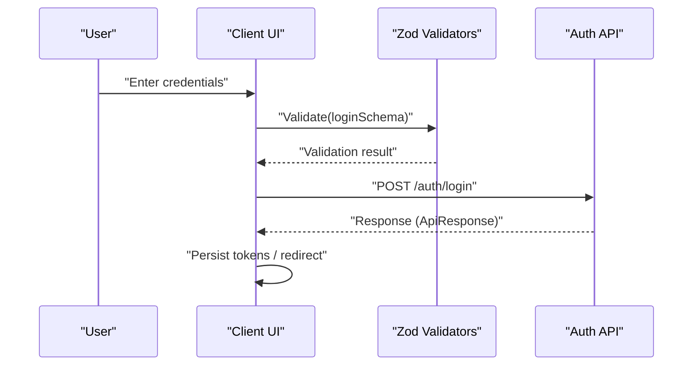

**Diagram sources**
- [shared/src/validators/auth.validators.ts:15-25](file://shared/src/validators/auth.validators.ts#L15-L25)
- [shared/src/types/api.types.ts:12-17](file://shared/src/types/api.types.ts#L12-L17)

**Section sources**
- [shared/src/validators/auth.validators.ts:15-25](file://shared/src/validators/auth.validators.ts#L15-L25)
- [shared/src/types/api.types.ts:12-17](file://shared/src/types/api.types.ts#L12-L17)

### PWA Build and Deployment Pipeline
The frontend is built as a PWA and served via Nginx in a containerized environment.

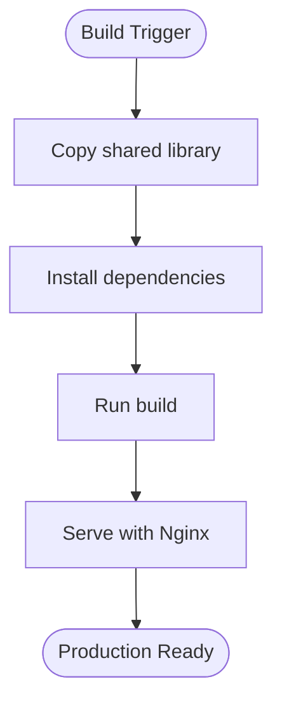

**Diagram sources**
- [docker/Dockerfile.frontend:17-22](file://docker/Dockerfile.frontend#L17-L22)

**Section sources**
- [docker/Dockerfile.frontend:17-22](file://docker/Dockerfile.frontend#L17-L22)

### Theme System and Responsive Design Patterns
- Theme system: Centralized theme constants enable consistent design tokens across components.
- Responsive design: Mobile-first approach with utility-first CSS (Tailwind) ensures adaptability across screen sizes.

Note: Theme and responsive patterns are defined in the shared library constants and are consumed by UI components.

**Section sources**
- [shared/src/constants/app.constants.ts:23-71](file://shared/src/constants/app.constants.ts#L23-L71)

### State Management and Backend Integration
- State management: Centralized state stores manage user sessions, navigation, and feature flags.
- Backend integration: API client consumes standardized response types and pagination metadata.

**Section sources**
- [shared/src/types/api.types.ts:12-61](file://shared/src/types/api.types.ts#L12-L61)

## Establishment Selection System

### Establishment Selection Modal Component
The establishment selection modal provides a user-friendly interface for users with access to multiple establishments to choose their active establishment.

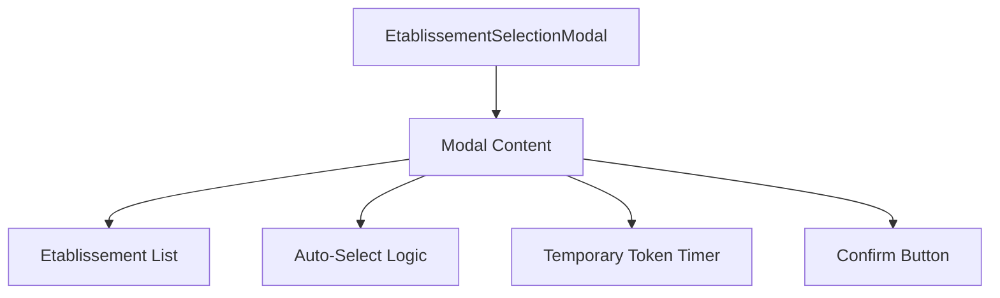

**Diagram sources**
- [frontend/src/components/auth/EtablissementSelectionModal.tsx:43-129](file://frontend/src/components/auth/EtablissementSelectionModal.tsx#L43-L129)

**Section sources**
- [frontend/src/components/auth/EtablissementSelectionModal.tsx:43-129](file://frontend/src/components/auth/EtablissementSelectionModal.tsx#L43-L129)

### Establishment Switcher Component
The establishment switcher provides quick access to switch between establishments during an active session.

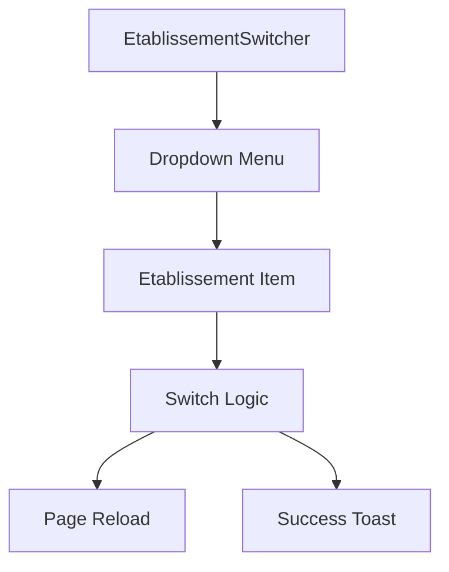

**Diagram sources**
- [frontend/src/components/auth/EtablissementSwitcher.tsx:49-90](file://frontend/src/components/auth/EtablissementSwitcher.tsx#L49-L90)

**Section sources**
- [frontend/src/components/auth/EtablissementSwitcher.tsx:49-90](file://frontend/src/components/auth/EtablissementSwitcher.tsx#L49-L90)

### Establishment Selection Hook
The establishment selection hook manages the complete lifecycle of establishment selection and switching functionality.

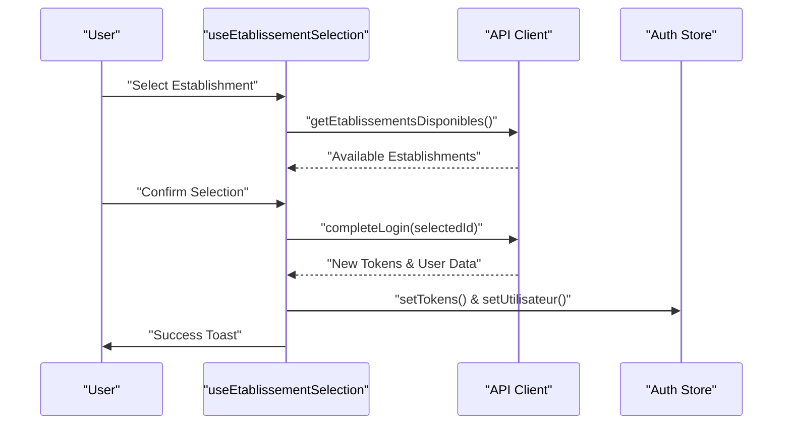

**Diagram sources**
- [frontend/src/hooks/use-etablissement-selection.ts:44-79](file://frontend/src/hooks/use-etablissement-selection.ts#L44-L79)

**Section sources**
- [frontend/src/hooks/use-etablissement-selection.ts:44-79](file://frontend/src/hooks/use-etablissement-selection.ts#L44-L79)

## Multi-Tenant Hooks Enhancement

### Enhanced Multi-Tenant Hook
The enhanced multi-tenant hook provides comprehensive multi-establishment support with establishment management capabilities.

**Section sources**
- [frontend/src/hooks/use-multi-tenant.ts](file://frontend/src/hooks/use-multi-tenant.ts)

### Establishment Management Integration
The establishment management system integrates with the multi-tenant architecture to provide seamless establishment switching and management.

**Section sources**
- [frontend/src/features/etablissements/hooks/use-etablissements.ts](file://frontend/src/features/etablissements/hooks/use-etablissements.ts)
- [frontend/src/features/etablissements/types/etablissement.types.ts](file://frontend/src/features/etablissements/types/etablissement.types.ts)

## Establishment Management Features

### Establishment Administration
The establishment management feature provides comprehensive administrative controls for managing establishments within the multi-tenant system.

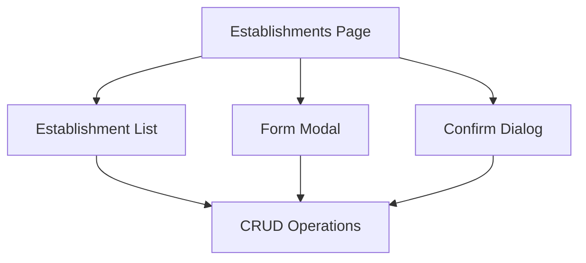

**Diagram sources**
- [frontend/src/features/etablissements/components/etablissements-page.tsx:216-264](file://frontend/src/features/etablissements/components/etablissements-page.tsx#L216-L264)

**Section sources**
- [frontend/src/features/etablissements/components/etablissements-page.tsx:216-264](file://frontend/src/features/etablissements/components/etablissements-page.tsx#L216-L264)

### Backend Multi-Tenant Middleware
The backend implements robust multi-tenant middleware that handles establishment selection, validation, and tenant isolation.

**Section sources**
- [backend/src/common/middlewares/tenant.middleware.ts:87-131](file://backend/src/common/middlewares/tenant.middleware.ts#L87-L131)

## New Educational Framework Features

### Competences Feature Implementation
The competences feature provides comprehensive competence management for educational frameworks.

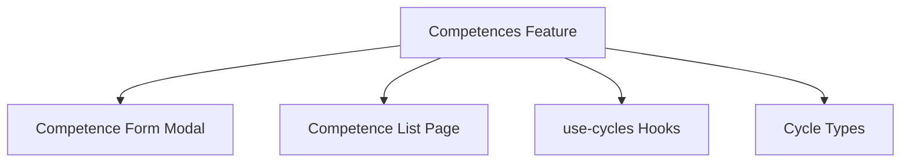

**Diagram sources**
- [frontend/src/features/competences/index.ts](file://frontend/src/features/competences/index.ts)
- [frontend/src/routes/_auth.competences.tsx](file://frontend/src/routes/_auth.competences.tsx)

**Section sources**
- [frontend/src/features/competences/index.ts](file://frontend/src/features/competences/index.ts)
- [frontend/src/routes/_auth.competences.tsx](file://frontend/src/routes/_auth.competences.tsx)

### Spécialités Feature Implementation
The specialites feature manages specialized educational tracks and streams.

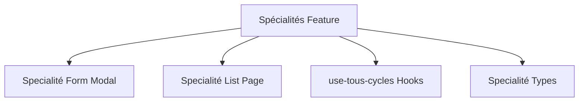

**Diagram sources**
- [frontend/src/features/specialites/index.ts](file://frontend/src/features/specialites/index.ts)
- [frontend/src/routes/_auth.specialites.tsx](file://frontend/src/routes/_auth.specialites.tsx)

**Section sources**
- [frontend/src/features/specialites/index.ts](file://frontend/src/features/specialites/index.ts)
- [frontend/src/routes/_auth.specialites.tsx](file://frontend/src/routes/_auth.specialites.tsx)

### Updated Routing Structure
The routing system now includes dedicated routes for competences and specialites features, along with establishment management routes.

**Section sources**
- [frontend/src/routes/_auth.competences.tsx](file://frontend/src/routes/_auth.competences.tsx)
- [frontend/src/routes/_auth.specialites.tsx](file://frontend/src/routes/_auth.specialites.tsx)

### Cycles Feature Enhancement
The cycles feature maintains its core functionality with enhanced integration with the new educational framework.

**Section sources**
- [frontend/src/features/cycles/components/cycle-form-modal.tsx](file://frontend/src/features/cycles/components/cycle-form-modal.tsx)
- [frontend/src/features/cycles/components/cycles-page.tsx](file://frontend/src/features/cycles/components/cycles-page.tsx)
- [frontend/src/features/cycles/hooks/use-cycles.ts](file://frontend/src/features/cycles/hooks/use-cycles.ts)
- [frontend/src/features/cycles/hooks/use-tous-cycles.ts](file://frontend/src/features/cycles/hooks/use-tous-cycles.ts)
- [frontend/src/features/cycles/types/cycle.types.ts](file://frontend/src/features/cycles/types/cycle.types.ts)

## Dependency Analysis
The frontend depends on the shared library for type safety and validation. The backend provides the API consumed by the frontend, including multi-tenant establishment management.

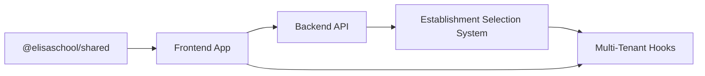

**Diagram sources**
- [shared/package.json:2-10](file://shared/package.json#L2-L10)
- [package.json:8-12](file://package.json#L8-L12)

**Section sources**
- [shared/package.json:2-10](file://shared/package.json#L2-L10)
- [package.json:8-12](file://package.json#L8-L12)

## Performance Considerations
- Build-time optimization: Vite's development server and optimized production builds reduce bundle sizes and improve load times.
- Asset delivery: Nginx serves static assets efficiently in production.
- Caching strategies: Implement service worker caching for offline availability and faster reloads.
- Bundle splitting: Code-split routes and lazy-load heavy components to minimize initial payload.
- Image optimization: Use modern formats and responsive images to reduce bandwidth.
- Minification and tree-shaking: Enable in build pipeline to remove unused code.
- Establishment switching optimization: Implement efficient token refresh and state synchronization.

## Troubleshooting Guide
- Authentication validation errors: Ensure form inputs match Zod schemas before submission.
- API response parsing: Verify ApiResponse and pagination shapes to avoid runtime errors.
- PWA installation: Confirm manifest configuration and service worker registration.
- Cross-browser compatibility: Test on supported browsers and polyfill when necessary.
- Accessibility: Validate keyboard navigation, ARIA attributes, and screen reader support.
- Educational framework issues: Verify competences and specialites routing configurations.
- Establishment selection issues: Check establishment availability and user permissions.
- Multi-tenant conflicts: Verify tenant isolation and proper establishment switching.
- Establishment management errors: Validate establishment data integrity and CRUD operations.

**Section sources**
- [shared/src/validators/auth.validators.ts:15-103](file://shared/src/validators/auth.validators.ts#L15-L103)
- [shared/src/types/api.types.ts:12-61](file://shared/src/types/api.types.ts#L12-L61)
- [frontend/src/components/auth/EtablissementSelectionModal.tsx:43-129](file://frontend/src/components/auth/EtablissementSelectionModal.tsx#L43-L129)
- [frontend/src/components/auth/EtablissementSwitcher.tsx:49-90](file://frontend/src/components/auth/EtablissementSwitcher.tsx#L49-L90)

## Conclusion
The eLISAschool frontend is architected as a React + Vite PWA with a strong emphasis on type safety and validation through a shared library. The monorepo structure enables consistent contracts across frontend and backend, while Dockerized deployment ensures reliable production delivery. By leveraging standardized types, validators, and constants, the application maintains robustness, scalability, and maintainability.

**Updated** Recent enhancements include comprehensive establishment selection components with modal interface and auto-selection functionality, enhanced multi-tenant hooks with establishment switching capabilities, establishment management features with administrative controls, and improved routing structure supporting multi-establishment user flows. These additions provide a complete multi-tenant solution with seamless establishment switching and management capabilities.

## Appendices

### PWA Manifest Configuration
- Manifest fields: Name, short_name, description, icons, start_url, display, background_color, theme_color.
- Icons: Provide multiple sizes for optimal rendering across devices.
- Service worker: Register and configure caching strategies for offline support.

### Offline Capabilities and Service Workers
- Strategies: Cache-first for static assets, network-first for API, stale-while-revalidate for dynamic data.
- Fallbacks: Define offline pages and error boundaries.
- Updates: Implement update prompts and background sync where appropriate.

### Cross-Browser Compatibility and Accessibility
- Compatibility: Test on latest Chrome, Firefox, Safari, Edge; address vendor prefixes and polyfills.
- Accessibility: Ensure semantic HTML, ARIA roles, keyboard navigation, and color contrast.

### Educational Framework Integration
- Competences Management: Comprehensive competence tracking and assessment
- Specialites Management: Specialized educational tracks and streams
- Cycles Integration: Enhanced cycle management with new educational components
- Routing Structure: Dedicated routes for educational framework features

### Establishment Management Integration
- Establishment Selection: Modal-based establishment selection with auto-selection
- Establishment Switching: Navbar-based establishment switching with real-time updates
- Establishment Administration: Full CRUD operations for establishment management
- Multi-Tenant Isolation: Robust tenant middleware and security enforcement
- Token Management: Secure token handling and refresh mechanisms