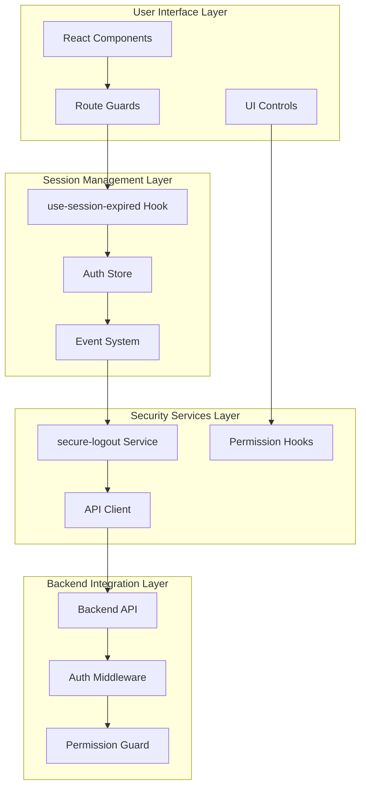
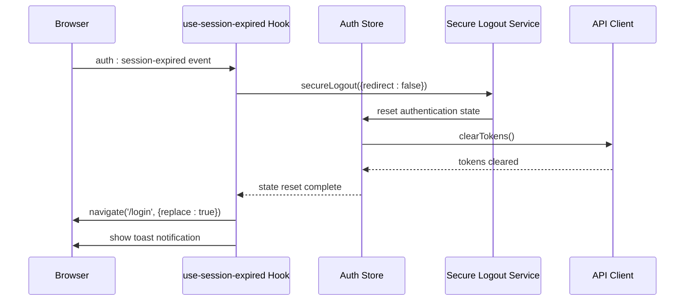
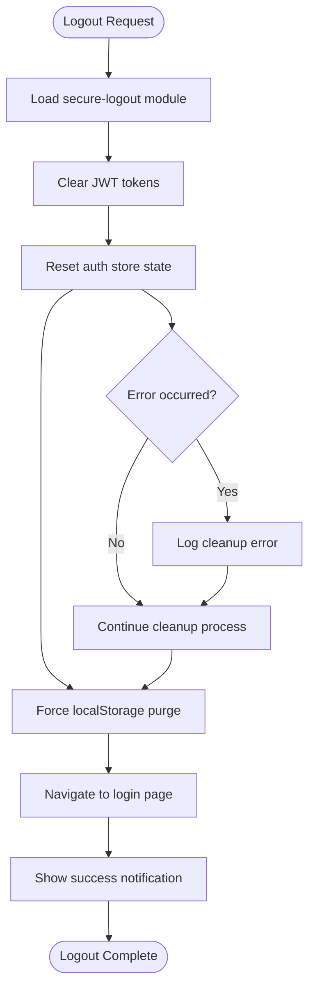
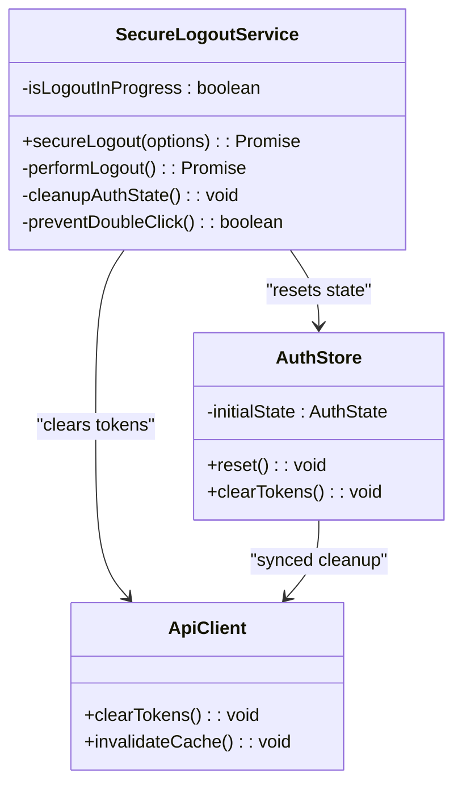
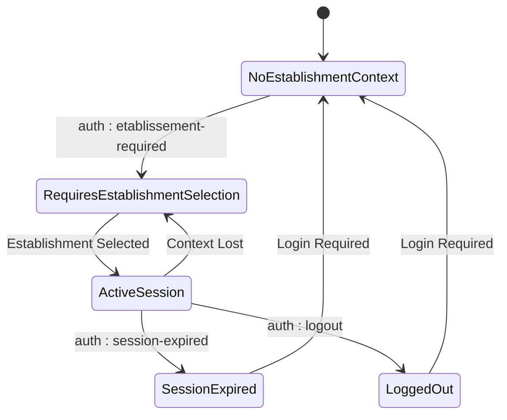
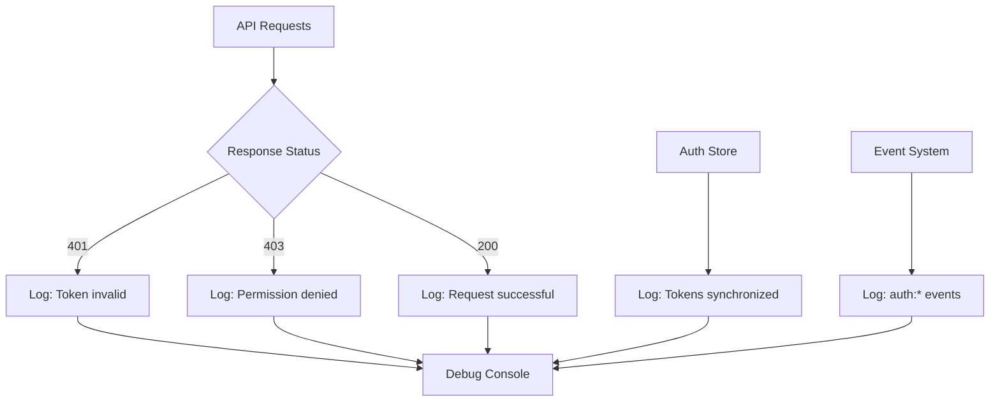

# Frontend Blocking Enhancements

<cite>
**Referenced Files in This Document**
- [use-session-expired.ts](file://frontend/src/hooks/use-session-expired.ts)
- [secure-logout.ts](file://frontend/src/lib/secure-logout.ts)
- [auth.store.ts](file://frontend/src/stores/auth.store.ts)
- [api.ts](file://frontend/src/lib/api.ts)
- [index.ts](file://frontend/src/hooks/index.ts)
- [unauthorized-page.tsx](file://frontend/src/features/system/components/unauthorized-page.tsx)
- [use-auth.ts](file://frontend/src/hooks/use-auth.ts)
- [use-etablissement-required.ts](file://frontend/src/hooks/use-etablissement-required.ts)
- [use-permissions.ts](file://frontend/src/hooks/use-permissions.ts)
- [SESSION-EXPIRATION-IMPLEMENTATION.md](file://SESSION-EXPIRATION-IMPLEMENTATION.md)
- [SECURE-LOGOUT-IMPLEMENTATION.md](file://SECURE-LOGOUT-IMPLEMENTATION.md)
- [AMELIORATIONS-SECURITE-AUTHENTIFICATION.md](file://AMELIORATIONS-SECURITE-AUTHENTIFICATION.md)
- [RESUME-IMPLÉMENTATION-PERMISSIONS-FRONTEND.md](file://RESUME-IMPLÉMENTATION-PERMISSIONS-FRONTEND.md)
</cite>

## Table of Contents
1. [Introduction](#introduction)
2. [Architecture Overview](#architecture-overview)
3. [Core Components](#core-components)
4. [Session Expiration Handling](#session-expiration-handling)
5. [Secure Logout Implementation](#secure-logout-implementation)
6. [Multi-Tenant Support](#multi-tenant-support)
7. [Permission-Based UI Control](#permission-based-ui-control)
8. [Security Enhancements](#security-enhancements)
9. [Monitoring and Debugging](#monitoring-and-debugging)
10. [Future Improvements](#future-improvements)
11. [Conclusion](#conclusion)

## Introduction

The Frontend Blocking Enhancements represent a comprehensive security and user experience improvement initiative for the eLISAschool platform. This documentation covers the implementation of robust session management, secure logout procedures, multi-tenant support, and permission-based UI controls that work together to provide defense-in-depth security while maintaining excellent user experience.

The enhancements focus on three primary areas: session lifecycle management, secure authentication termination, and granular permission enforcement across the frontend interface. These improvements address common security vulnerabilities while ensuring smooth operation in a multi-establishment educational management system.

## Architecture Overview

The frontend blocking enhancement system follows a layered security architecture with multiple protection mechanisms working in concert:



**Diagram sources**
- [use-session-expired.ts:1-100](file://frontend/src/hooks/use-session-expired.ts#L1-L100)
- [secure-logout.ts:1-100](file://frontend/src/lib/secure-logout.ts#L1-L100)
- [auth.store.ts:1-150](file://frontend/src/stores/auth.store.ts#L1-L150)

The architecture implements defense-in-depth security by combining frontend route guards, UI control masking, backend middleware validation, and business logic verification.

## Core Components

### Session Expiration Management

The session expiration system provides centralized handling of authentication timeouts and token invalidation scenarios:



**Diagram sources**
- [use-session-expired.ts:39-84](file://frontend/src/hooks/use-session-expired.ts#L39-L84)
- [secure-logout.ts:1-100](file://frontend/src/lib/secure-logout.ts#L1-L100)

The system handles three primary scenarios:
1. **Token refresh failures** - Automatic cleanup and redirection
2. **Invalid authentication state** - Comprehensive session termination
3. **Manual logout events** - Controlled session cleanup

### Secure Logout Implementation

The secure logout service ensures complete authentication state removal and prevents session fixation attacks:



**Diagram sources**
- [secure-logout.ts:1-100](file://frontend/src/lib/secure-logout.ts#L1-L100)
- [auth.store.ts:135-146](file://frontend/src/stores/auth.store.ts#L135-L146)

**Section sources**
- [secure-logout.ts:1-100](file://frontend/src/lib/secure-logout.ts#L1-L100)
- [auth.store.ts:135-146](file://frontend/src/stores/auth.store.ts#L135-L146)

## Session Expiration Handling

### Event-Driven Architecture

The session expiration system uses a publish-subscribe pattern with custom DOM events:

| Event Type | Trigger Conditions | Behavior | User Impact |
|------------|-------------------|----------|-------------|
| `auth:session-expired` | No refresh token, invalid/expired refresh token, server response errors | Complete logout, redirect to login | Immediate session termination |
| `auth:logout` | Manual user logout | Controlled cleanup | User-initiated termination |
| `auth:etablissement-required` | Token valid but missing establishment context | Show establishment selection modal | Context-dependent access |

### Implementation Details

The `use-session-expired` hook provides centralized event handling with automatic cleanup:

**Section sources**
- [use-session-expired.ts:39-84](file://frontend/src/hooks/use-session-expired.ts#L39-L84)
- [SESSION-EXPIRATION-IMPLEMENTATION.md:63-100](file://SESSION-EXPIRATION-IMPLEMENTATION.md#L63-L100)

## Secure Logout Implementation

### Anti-Double-Click Protection

The secure logout service implements multiple safeguards against race conditions and double-click scenarios:



**Diagram sources**
- [secure-logout.ts:1-100](file://frontend/src/lib/secure-logout.ts#L1-L100)
- [auth.store.ts:135-146](file://frontend/src/stores/auth.store.ts#L135-L146)

**Section sources**
- [SECURE-LOGOUT-IMPLEMENTATION.md:110-156](file://SECURE-LOGOUT-IMPLEMENTATION.md#L110-L156)

## Multi-Tenant Support

### Establishment Context Management

The system supports multi-establishment environments through context-aware authentication:



**Diagram sources**
- [use-etablissement-required.ts:1-100](file://frontend/src/hooks/use-etablissement-required.ts#L1-L100)

The multi-tenant implementation ensures that users with valid tokens but missing establishment context are prompted to select their establishment before gaining full access.

**Section sources**
- [SESSION-EXPIRATION-IMPLEMENTATION.md:192-222](file://SESSION-EXPIRATION-IMPLEMENTATION.md#L192-L222)

## Permission-Based UI Control

### Defense-in-Depth Security Model

The frontend implements multiple layers of permission enforcement:

```mermaid
graph LR
subgraph "Frontend Security Layers"
A[Route Guards<br/>RequirePermission] --> B[UI Control Guards<br/>PermissionGate, hooks]
B --> C[Backend Middleware Guards<br/>requirePermission()]
C --> D[Backend Service Logic<br/>Business Validation]
end
subgraph "Permission Types"
E[Module Permissions]
F[Action Permissions]
G[Record-Level Permissions]
end
B --> E
B --> F
B --> G
```

**Diagram sources**
- [RESUME-IMPLÉMENTATION-PERMISSIONS-FRONTEND.md:269-296](file://RESUME-IMPLÉMENTATION-PERMISSIONS-FRONTEND.md#L269-L296)

The permission system provides:
- **Route-level blocking** - Prevents navigation to unauthorized sections
- **Component-level masking** - Hides buttons and controls users cannot access
- **Form-level validation** - Prevents submission of unauthorized actions
- **Real-time updates** - Permissions refresh automatically when changed

**Section sources**
- [RESUME-IMPLÉMENTATION-PERMISSIONS-FRONTEND.md:269-296](file://RESUME-IMPLÉMENTATION-PERMISSIONS-FRONTEND.md#L269-L296)

## Security Enhancements

### HTTP Header Security

The backend implements comprehensive HTTP header security measures:

| Security Header | Purpose | Configuration |
|----------------|---------|---------------|
| **Content-Security-Policy** | Prevent XSS and data injection | Self-origin policy with unsafe-inline for styles |
| **X-Frame-Options** | Prevent clickjacking | DENY frames |
| **X-Content-Type-Options** | Prevent MIME type sniffing | nosniff |
| **X-XSS-Protection** | Basic XSS filtering | Enabled |
| **Strict-Transport-Security** | Force HTTPS | Production deployment |

### CORS Configuration

The Cross-Origin Resource Sharing policy is configured for maximum security:

- **Allowed Origins** - Single configured frontend URL only
- **Credentials** - Required for cookie-based authentication
- **Allowed Methods** - RESTful methods only (GET, POST, PUT, DELETE)
- **Allowed Headers** - Minimal whitelist (Content-Type, Authorization)

**Section sources**
- [AMELIORATIONS-SECURITE-AUTHENTIFICATION.md:148-195](file://AMELIORATIONS-SECURITE-AUTHENTIFICATION.md#L148-L195)

## Monitoring and Debugging

### Event Logging System

The system provides comprehensive logging for debugging authentication issues:



**Diagram sources**
- [use-session-expired.ts:1-100](file://frontend/src/hooks/use-session-expired.ts#L1-L100)

### Debug Information

Key debug messages include:
- `[API] Token invalide` - Authentication token validation failures
- `[API] Token incomplet: etablissementId manquant` - Multi-tenant context issues  
- `[Auth Store] Tokens synchronisés avec API Client` - Successful token synchronization

**Section sources**
- [SESSION-EXPIRATION-IMPLEMENTATION.md:200-215](file://SESSION-EXPIRATION-IMPLEMENTATION.md#L200-L215)

## Future Improvements

### Planned Enhancements

The system architecture supports several future security improvements:

1. **Proactive Token Refresh**
   - Detect token expiration 1 minute before
   - Automatically refresh tokens silently
   - Queue requests during refresh period

2. **WebSocket Heartbeat**
   - Maintain session activity through WebSocket pings
   - Extend session lifetime for active users
   - Graceful degradation on connection loss

3. **Offline Mode Support**
   - Cache failed requests locally
   - Retry cached requests after reconnection
   - Synchronize local changes with backend

4. **Enhanced Analytics**
   - Track session expiration patterns
   - Monitor authentication failure rates
   - Analyze user session duration metrics

### Technical Debt Reduction

Current implementation focuses on immediate security needs while maintaining flexibility for future enhancements. The modular design allows incremental improvements without disrupting existing functionality.

## Conclusion

The Frontend Blocking Enhancements provide a comprehensive security framework that protects the eLISAschool platform while maintaining excellent user experience. The implementation demonstrates best practices in authentication security, session management, and permission-based access control.

Key achievements include:
- **Defense-in-depth architecture** - Multiple security layers working together
- **User-friendly error handling** - Clear messaging and graceful degradation
- **Multi-tenant support** - Context-aware authentication for educational institutions
- **Comprehensive logging** - Detailed debugging capabilities for security incidents
- **Future-proof design** - Extensible architecture supporting planned improvements

The system successfully balances security requirements with usability, providing administrators and users with confidence in the platform's security posture while maintaining efficient operation across multiple educational establishments.