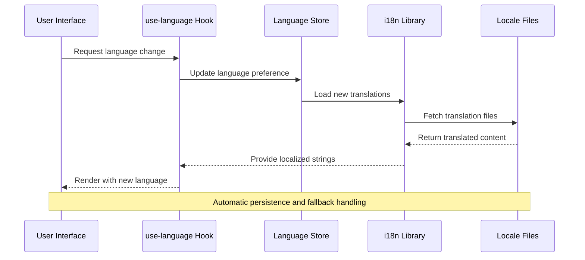
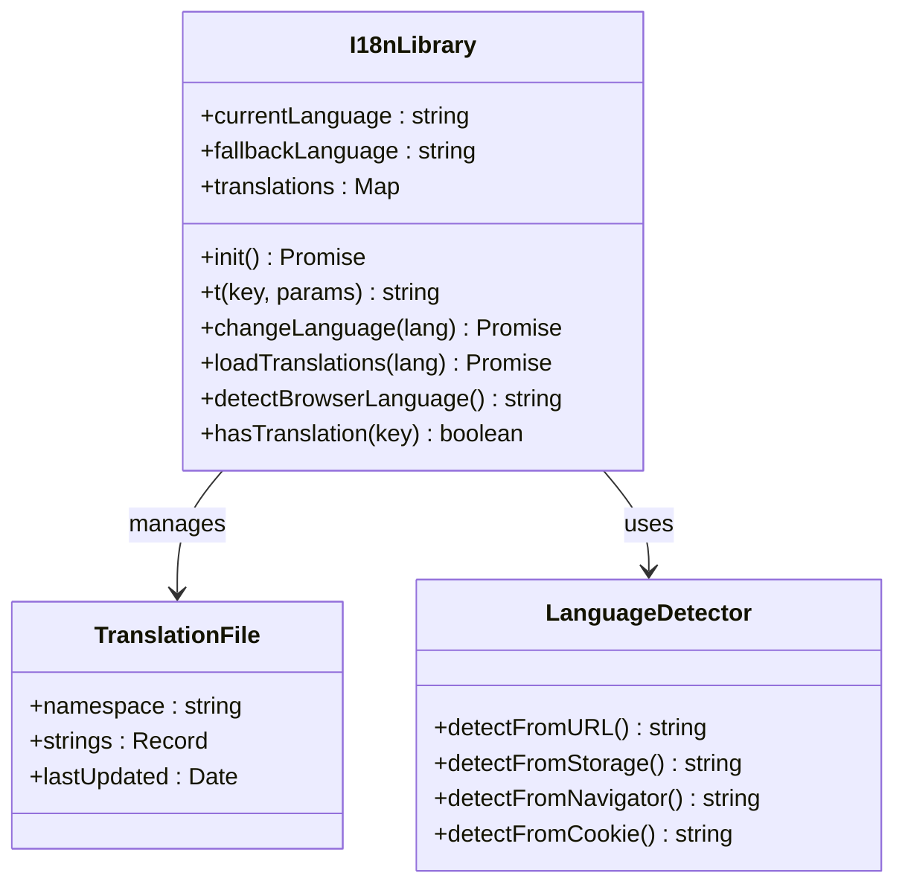
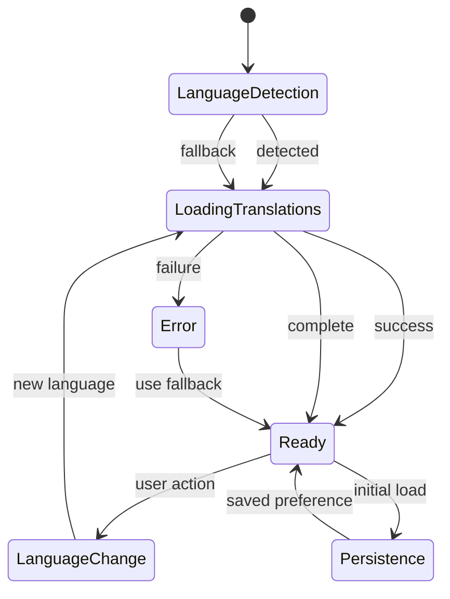
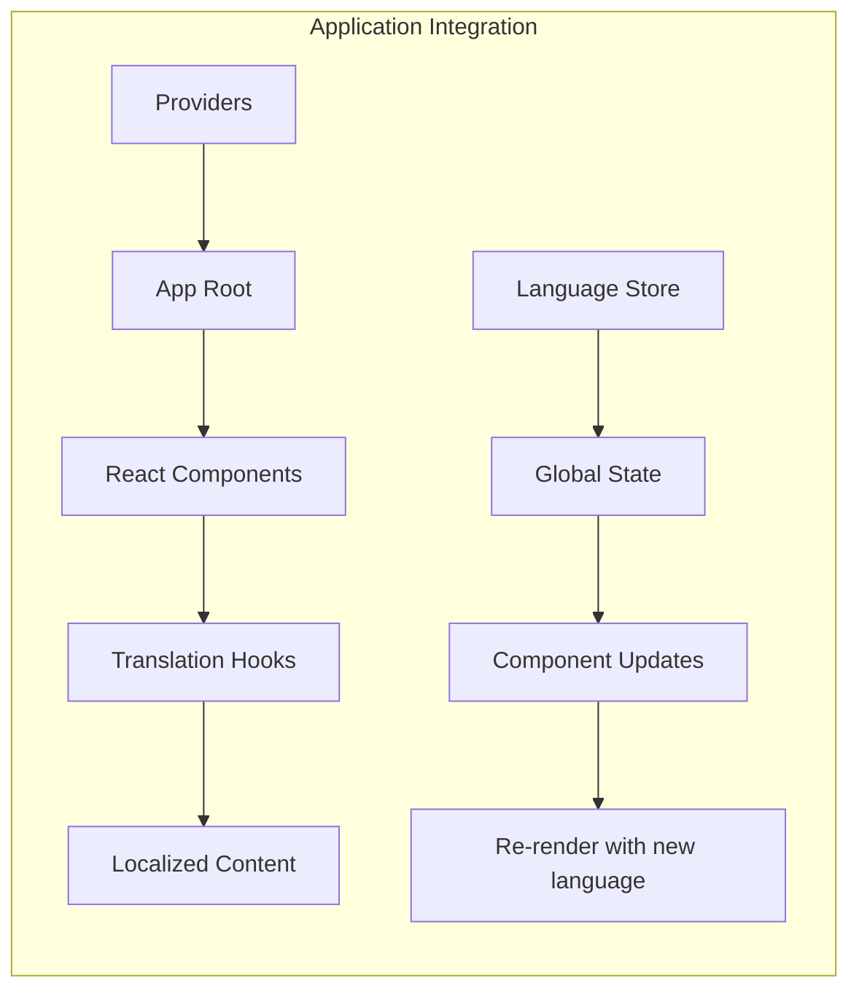

# Internationalization (i18n) Support

<cite>
**Referenced Files in This Document**
- [i18n.ts](file://frontend/src/lib/i18n.ts)
- [use-language.ts](file://frontend/src/hooks/use-language.ts)
- [language.store.ts](file://frontend/src/stores/language.store.ts)
- [en/absences.json](file://frontend/src/locales/en/absences.json)
- [fr/absences.json](file://frontend/src/locales/fr/absences.json)
- [en/common.json](file://frontend/src/locales/en/common.json)
- [fr/common.json](file://frontend/src/locales/fr/common.json)
- [App.tsx](file://frontend/src/app/App.tsx)
- [providers.tsx](file://frontend/src/app/providers.tsx)
</cite>

## Table of Contents
1. [Introduction](#introduction)
2. [Project Structure](#project-structure)
3. [Core Components](#core-components)
4. [Architecture Overview](#architecture-overview)
5. [Detailed Component Analysis](#detailed-component-analysis)
6. [Translation Management](#translation-management)
7. [Integration Points](#integration-points)
8. [Performance Considerations](#performance-considerations)
9. [Troubleshooting Guide](#troubleshooting-guide)
10. [Conclusion](#conclusion)

## Introduction

The eLISAschool project implements a comprehensive internationalization (i18n) system that supports multiple languages, primarily French and English. The i18n infrastructure is built using React hooks, Zustand stores, and JSON-based translation files. This system enables the application to dynamically switch between languages and provides a scalable foundation for supporting additional languages in the future.

The internationalization system follows modern React patterns with automatic language detection, persistent user preferences, and efficient translation loading mechanisms. The implementation ensures seamless language switching without page reloads and maintains consistency across all application modules.

## Project Structure

The internationalization system is organized across three main areas within the frontend application:

```mermaid
graph TB
subgraph "Internationalization Structure"
A[i18n Core] --> B[Libraries]
A --> C[Hooks]
A --> D[Stores]
B --> E[i18n.ts]
C --> F[use-language.ts]
D --> G[language.store.ts]
A --> H[Locale Files]
H --> I[English (en/)]
H --> J[French (fr/)]
I --> K[Module Translations]
J --> L[Module Translations]
K --> M[absences.json]
K --> N[common.json]
K --> O[auth.json]
L --> P[absences.json]
L --> Q[common.json]
L --> R[auth.json]
end
```

**Diagram sources**
- [i18n.ts](file://frontend/src/lib/i18n.ts)
- [use-language.ts](file://frontend/src/hooks/use-language.ts)
- [language.store.ts](file://frontend/src/stores/language.store.ts)

**Section sources**
- [i18n.ts](file://frontend/src/lib/i18n.ts)
- [use-language.ts](file://frontend/src/hooks/use-language.ts)
- [language.store.ts](file://frontend/src/stores/language.store.ts)

## Core Components

The i18n system consists of three primary components that work together to provide seamless multilingual support:

### Translation Library (`i18n.ts`)
The core translation library serves as the central hub for all internationalization functionality. It manages language detection, translation loading, and provides the primary interface for accessing localized content throughout the application.

### Language Hook (`use-language.ts`)
This custom React hook provides convenient access to language switching functionality and current language state. It encapsulates the complexity of language management while exposing a simple API for components to use.

### Language Store (`language.store.ts`)
Built with Zustand, this global state management solution handles persistent language preferences and maintains the current language selection across application sessions.

**Section sources**
- [i18n.ts](file://frontend/src/lib/i18n.ts)
- [use-language.ts](file://frontend/src/hooks/use-language.ts)
- [language.store.ts](file://frontend/src/stores/language.store.ts)

## Architecture Overview

The i18n architecture follows a layered approach with clear separation of concerns:



**Diagram sources**
- [use-language.ts](file://frontend/src/hooks/use-language.ts)
- [language.store.ts](file://frontend/src/stores/language.store.ts)
- [i18n.ts](file://frontend/src/lib/i18n.ts)

The architecture ensures that language changes propagate throughout the application immediately without requiring page refreshes. The system automatically handles translation file loading, caching, and fallback mechanisms.

## Detailed Component Analysis

### Translation Library Implementation

The translation library provides the foundational layer for internationalization:



**Diagram sources**
- [i18n.ts](file://frontend/src/lib/i18n.ts)

### Language Management System

The language management system combines reactive hooks with persistent state:



**Diagram sources**
- [use-language.ts](file://frontend/src/hooks/use-language.ts)
- [language.store.ts](file://frontend/src/stores/language.store.ts)

**Section sources**
- [i18n.ts](file://frontend/src/lib/i18n.ts)
- [use-language.ts](file://frontend/src/hooks/use-language.ts)
- [language.store.ts](file://frontend/src/stores/language.store.ts)

## Translation Management

### Translation File Organization

The translation system organizes content by functional modules with dedicated JSON files:

| Module | Purpose | Files |
|--------|---------|-------|
| Absences | Student absence tracking | `absences.json` |
| Auth | Authentication and user management | `auth.json` |
| Common | Shared UI elements and phrases | `common.json` |
| Configuration | System settings and preferences | `configuration.json` |
| Dashboard | Main application interface | `dashboard.json` |
| Students | Student enrollment and records | `eleves.json` |
| Personnel | Staff management | `personnel.json` |

Each module contains structured JSON objects with hierarchical keys representing the translation hierarchy within that domain.

### Translation Key Structure

Translation keys follow a dot-notation convention for hierarchical organization:

```
module.section.property
module.entity.action
common.button.submit
auth.login.form.title
```

This structure enables logical grouping of related translations and facilitates maintenance across different application sections.

**Section sources**
- [en/absences.json](file://frontend/src/locales/en/absences.json)
- [fr/absences.json](file://frontend/src/locales/fr/absences.json)
- [en/common.json](file://frontend/src/locales/en/common.json)
- [fr/common.json](file://frontend/src/locales/fr/common.json)

## Integration Points

### Application Integration

The i18n system integrates seamlessly with the React application through several key integration points:



**Diagram sources**
- [providers.tsx](file://frontend/src/app/providers.tsx)
- [App.tsx](file://frontend/src/app/App.tsx)

### Component Usage Patterns

Components integrate with the i18n system through standardized patterns:

1. **Direct Translation Access**: Using translation keys directly in JSX
2. **Parameterized Translations**: Supporting dynamic content insertion
3. **Pluralization Handling**: Managing singular/plural forms
4. **Date/Number Formatting**: Localized formatting for dates and numbers

### Backend Integration

While the primary focus is on frontend internationalization, the system is designed to support backend localization through consistent key structures and translation management workflows.

**Section sources**
- [providers.tsx](file://frontend/src/app/providers.tsx)
- [App.tsx](file://frontend/src/app/App.tsx)

## Performance Considerations

### Lazy Loading Strategy

The i18n system implements intelligent lazy loading to optimize performance:

- **On-demand Loading**: Translation files are loaded only when needed
- **Caching Mechanism**: Loaded translations are cached for subsequent requests
- **Bundle Splitting**: Separate bundles for different language files
- **Preloading**: Common translations are preloaded during application initialization

### Memory Management

The system includes several memory optimization features:

- **Automatic Cleanup**: Unused translation references are garbage collected
- **Efficient Storage**: Optimized data structures for storing translation data
- **Incremental Updates**: Partial updates when switching languages

### Scalability Features

The architecture supports scaling to additional languages and modules:

- **Dynamic Imports**: New language files can be added without code changes
- **Namespace Organization**: Logical grouping of translations by functional area
- **Fallback System**: Graceful degradation when translations are missing

## Troubleshooting Guide

### Common Issues and Solutions

| Issue | Symptoms | Solution |
|-------|----------|----------|
| Missing Translations | Blank or key display instead of text | Verify translation file exists and key is present |
| Language Switch Not Working | UI doesn't update after language change | Check language store persistence and hook implementation |
| Translation Loading Failures | Slow loading or empty content | Verify network connectivity and file accessibility |
| Fallback Language Problems | Unexpected default language | Check fallback configuration and browser language detection |

### Debugging Tools

The system includes debugging capabilities for development:

- **Console Logging**: Detailed logs of translation loading and switching
- **Error Boundaries**: Graceful handling of translation errors
- **Development Helpers**: Utility functions for testing translations

### Performance Monitoring

Key metrics to monitor for i18n performance:

- **Translation Load Time**: Time taken to load language files
- **Memory Usage**: Storage consumption of loaded translations
- **Render Performance**: Impact on component rendering times

**Section sources**
- [i18n.ts](file://frontend/src/lib/i18n.ts)
- [use-language.ts](file://frontend/src/hooks/use-language.ts)
- [language.store.ts](file://frontend/src/stores/language.store.ts)

## Conclusion

The eLISAschool internationalization system provides a robust, scalable foundation for multilingual support. The implementation demonstrates best practices in React internationalization through:

- **Clean Architecture**: Separation of concerns between translation logic, state management, and UI integration
- **Performance Optimization**: Intelligent loading and caching strategies
- **Developer Experience**: Simple APIs and comprehensive tooling
- **Scalability**: Support for additional languages and modules
- **Maintainability**: Structured organization of translation files

The system successfully balances functionality with performance, providing a seamless multilingual experience while maintaining code quality and developer productivity. The modular approach ensures that adding new languages or expanding translation coverage remains straightforward and maintainable.

Future enhancements could include automated translation management, translation validation tools, and expanded language support based on the application's growing international reach.