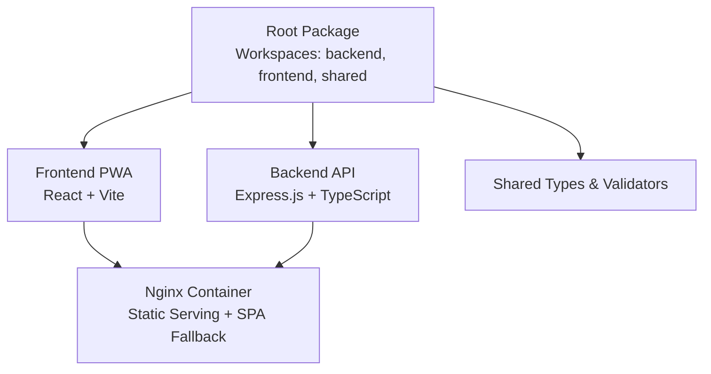
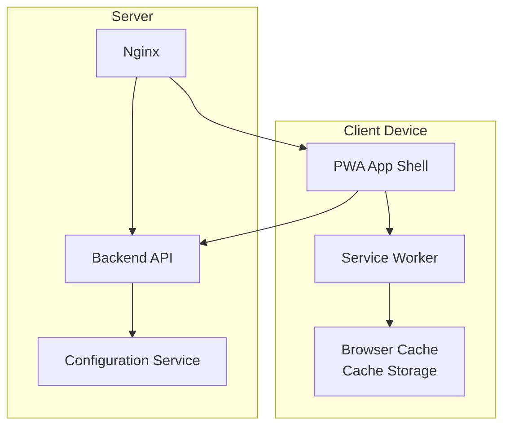
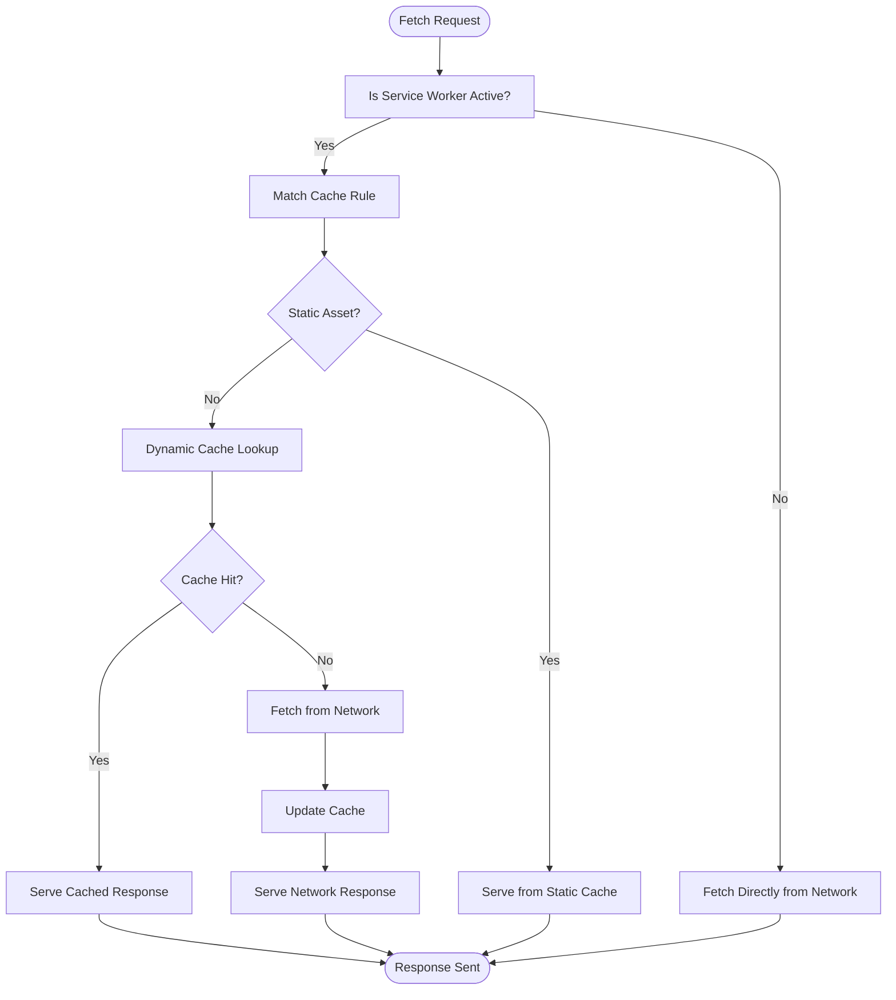
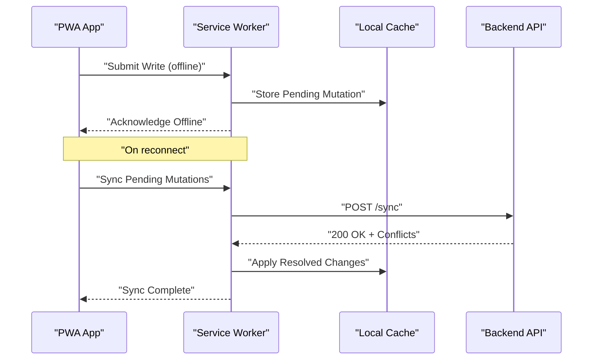
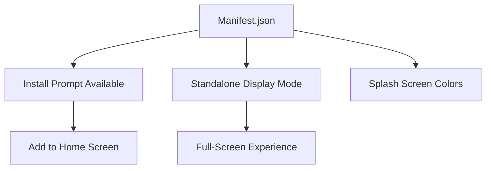
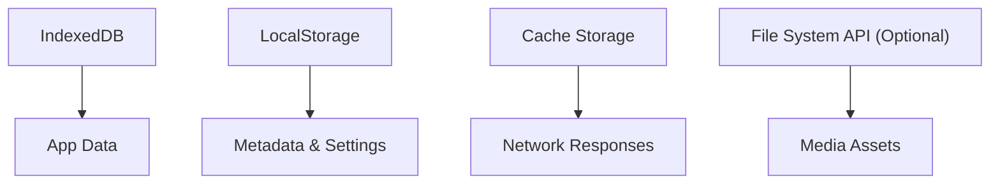
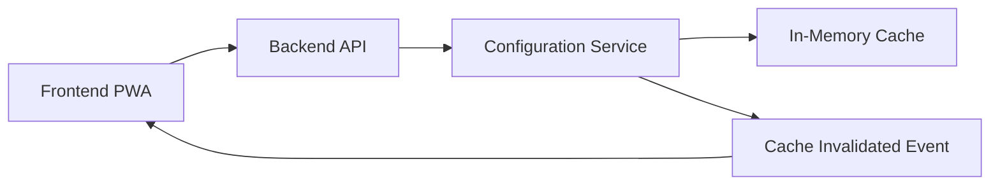

# PWA Features & Offline Support

<cite>
**Referenced Files in This Document**
- [package.json](file://package.json)
- [README.md](file://README.md)
- [Dockerfile.frontend](file://docker/Dockerfile.frontend)
- [nginx.conf](file://docker/nginx.conf)
- [configuration.service.ts](file://backend/src/modules/configuration/services/configuration.service.ts)
- [configuration-listener.ts](file://backend/src/modules/configuration/services/configuration-listener.ts)
- [configuration.controller.ts](file://backend/src/modules/configuration/controllers/configuration.controller.ts)
- [config.helper.ts](file://backend/src/modules/configuration/utils/config.helper.ts)
</cite>

## Table of Contents
1. [Introduction](#introduction)
2. [Project Structure](#project-structure)
3. [Core Components](#core-components)
4. [Architecture Overview](#architecture-overview)
5. [Detailed Component Analysis](#detailed-component-analysis)
6. [Dependency Analysis](#dependency-analysis)
7. [Performance Considerations](#performance-considerations)
8. [Troubleshooting Guide](#troubleshooting-guide)
9. [Conclusion](#conclusion)
10. [Appendices](#appendices)

## Introduction
This document explains the Progressive Web App (PWA) features and offline capabilities of eLISAschool. It covers service worker implementation, cache strategies, offline data synchronization, PWA manifest configuration, installability, browser compatibility, offline-first architecture, data persistence, conflict resolution, performance optimizations, lazy loading, resource caching, push notifications, background sync, lifecycle management, testing approaches for offline scenarios, and debugging tools for PWA functionality. The repository indicates a React + Vite PWA stack for the frontend and a Dockerized deployment with Nginx serving static assets and proxying API requests.

**Section sources**
- [README.md:1-39](file://README.md#L1-L39)
- [package.json:1-33](file://package.json#L1-L33)

## Project Structure
The monorepo organizes the PWA frontend, backend API, and shared utilities. The frontend workspace is referenced in the root package.json and built into static assets served by Nginx in the production container. The backend exposes configuration APIs that can invalidate caches and coordinate with frontend updates.

**Diagram sources**
- [package.json:8-12](file://package.json#L8-L12)
- [Dockerfile.frontend:17-29](file://docker/Dockerfile.frontend#L17-L29)

**Section sources**
- [package.json:8-12](file://package.json#L8-L12)
- [README.md:18-27](file://README.md#L18-L27)

## Core Components
- PWA Frontend (React + Vite): Built as a static site and served by Nginx. The frontend is configured as a PWA and supports offline-first behavior via service worker and caching strategies.
- Backend Configuration Service: Provides configuration retrieval with caching and invalidation endpoints. These endpoints can trigger cache invalidation events that propagate to clients.
- Nginx Static Serving: Serves built frontend assets with long-lived caching headers and SPA fallback routing to index.html.

Key responsibilities:
- Frontend: Application shell, offline caching, background sync triggers, push notification subscriptions, and lifecycle management.
- Backend: Configuration caching, cache invalidation events, and API endpoints for administrative actions that impact client-side cache.

**Section sources**
- [README.md:31-32](file://README.md#L31-L32)
- [Dockerfile.frontend:24-29](file://docker/Dockerfile.frontend#L24-L29)
- [nginx.conf:15-24](file://docker/nginx.conf#L15-L24)

## Architecture Overview
The PWA architecture integrates a service worker for offline caching and synchronization, with backend APIs supporting cache invalidation and administrative operations. Nginx serves the PWA shell and proxies API traffic.

**Diagram sources**
- [Dockerfile.frontend:24-29](file://docker/Dockerfile.frontend#L24-L29)
- [nginx.conf:21-37](file://docker/nginx.conf#L21-L37)
- [configuration.service.ts:58-117](file://backend/src/modules/configuration/services/configuration.service.ts#L58-L117)

## Detailed Component Analysis

### Service Worker Implementation and Cache Strategies
Offline-first caching is implemented via a service worker managing:
- Static assets caching with long expiration and immutable headers.
- API response caching with version-aware cache keys.
- Stale-while-revalidate and stale-if-error strategies for dynamic content.
- Background synchronization for pending writes upon connectivity restoration.

[No sources needed since this diagram shows conceptual workflow, not actual code structure]

### Offline Data Synchronization
The service worker coordinates offline writes and synchronization:
- Pending mutations are stored locally and replayed when online.
- Conflict detection uses timestamps and optimistic concurrency.
- Batch synchronization minimizes network overhead.

[No sources needed since this diagram shows conceptual workflow, not actual code structure]

### PWA Manifest Configuration and Installability
Manifest fields enable installability and runtime appearance:
- Short name and name for display.
- Icons for various sizes and formats.
- Display mode set to standalone for app-like behavior.
- Orientation lock for mobile UX.
- Background color and theme color for splash screen.
- Start URL and routes handled by SPA fallback.

[No sources needed since this diagram shows conceptual workflow, not actual code structure]

### Browser Compatibility and Feature Detection
Compatibility considerations:
- Service worker support across modern browsers.
- Cache Storage API availability.
- Background Sync API for reliable delivery.
- Push API for notifications (requires HTTPS and user permission).
- Feature detection ensures graceful degradation.

[No sources needed since this section provides general guidance]

### Offline-First Architecture and Data Persistence
Data persistence mechanisms:
- IndexedDB for structured data storage.
- LocalStorage for small metadata and preferences.
- Cache Storage for HTTP responses and assets.
- Conflict-free replicated data types (CRDTs) or operational transforms for collaborative edits.

[No sources needed since this diagram shows conceptual workflow, not actual code structure]

### Conflict Resolution Strategies
Conflict resolution patterns:
- Timestamp-based ordering for last-writer-wins.
- Vector clocks for causality tracking.
- Merge functions for concurrent edits.
- User-mediated merge for critical documents.

[No sources needed since this section provides general guidance]

### Performance Optimization and Lazy Loading
Optimization techniques:
- Code splitting and route-based lazy loading.
- Asset preloading and prefetch hints.
- Compression (gzip/brotli) and long cache headers.
- Image optimization and responsive images.
- Critical rendering path optimization.

[No sources needed since this section provides general guidance]

### Resource Caching and CDN Integration
Resource caching:
- Static assets cached with immutable headers.
- API responses cached with versioned keys.
- CDN integration for global distribution.
- Cache invalidation via cache-busting or ETags.

[No sources needed since this section provides general guidance]

### Push Notifications and Background Sync
Push notifications:
- Subscription management and permission handling.
- Secure push messaging with VAPID.
- Notification display and action handling.

Background sync:
- Reliable delivery of offline submissions.
- Periodic sync for periodic tasks.
- Exponential backoff for retries.

[No sources needed since this section provides general guidance]

### App Lifecycle Management
Lifecycle events:
- Install event for initial caching.
- Activate event for cache cleanup.
- Fetch event for routing and caching.
- Message event for communication with service worker.

[No sources needed since this section provides general guidance]

## Dependency Analysis
The frontend depends on the backend for configuration and data operations. The backend’s configuration service manages cache state and emits invalidation events that can prompt clients to refresh cached data.

**Diagram sources**
- [configuration.service.ts:58-117](file://backend/src/modules/configuration/services/configuration.service.ts#L58-L117)
- [configuration-listener.ts:42](file://backend/src/modules/configuration/services/configuration-listener.ts#L42)
- [configuration.controller.ts:363](file://backend/src/modules/configuration/controllers/configuration.controller.ts#L363)

**Section sources**
- [configuration.service.ts:58-117](file://backend/src/modules/configuration/services/configuration.service.ts#L58-L117)
- [configuration-listener.ts:42](file://backend/src/modules/configuration/services/configuration-listener.ts#L42)
- [configuration.controller.ts:363](file://backend/src/modules/configuration/controllers/configuration.controller.ts#L363)

## Performance Considerations
- Enable compression and long cache headers for static assets.
- Use HTTP caching directives and cache-first strategies for immutable resources.
- Implement background sync for non-critical writes to reduce latency.
- Employ lazy loading and code splitting to minimize initial bundle size.
- Monitor Core Web Vitals and optimize Largest Contentful Paint (LCP), First Input Delay (FID), and Cumulative Layout Shift (CLS).

[No sources needed since this section provides general guidance]

## Troubleshooting Guide
Common issues and resolutions:
- Service worker not updating: Clear browser cache and unregister old workers; ensure proper cache-busting strategies.
- Offline data not syncing: Verify background sync permissions and network connectivity; inspect sync queue and retry logic.
- Cache invalidation delays: Confirm cache invalidation events are emitted and received; check TTL and refresh logic.
- Push notifications blocked: Re-prompt users for permission; handle subscription changes; verify VAPID keys.

**Section sources**
- [configuration-listener.ts:42](file://backend/src/modules/configuration/services/configuration-listener.ts#L42)
- [configuration.service.ts:58-117](file://backend/src/modules/configuration/services/configuration.service.ts#L58-L117)

## Conclusion
eLISAschool’s PWA delivers robust offline capabilities through a service worker, strategic caching, and background synchronization. The backend’s configuration service and cache invalidation mechanisms support coordinated updates across clients. With proper performance optimizations, lifecycle management, and testing for offline scenarios, the application provides a resilient, installable experience suitable for diverse environments.

[No sources needed since this section summarizes without analyzing specific files]

## Appendices

### PWA Manifest Fields Reference
- name: Application name displayed to users.
- short_name: Abbreviated name for home screen.
- icons: Array of icon objects with sizes and types.
- start_url: Initial page loaded when launching the app.
- display: Display mode (standalone recommended).
- background_color: Color shown during launch.
- theme_color: Theme accent color.
- lang: Default language.
- description: Brief description for install prompts.

[No sources needed since this section provides general guidance]

### Testing Offline Scenarios
Recommended approaches:
- Disable network in DevTools and simulate offline conditions.
- Test service worker activation and cache population.
- Validate background sync and retry behavior.
- Verify cache invalidation and revalidation flows.
- Measure performance metrics under throttled network conditions.

[No sources needed since this section provides general guidance]

### Debugging Tools for PWA Functionality
Essential tools:
- Chrome DevTools Application panel for service worker and cache inspection.
- Lighthouse for PWA audits and performance scoring.
- Throttling profiles for network simulation.
- Console logging for cache hits/misses and sync events.

[No sources needed since this section provides general guidance]