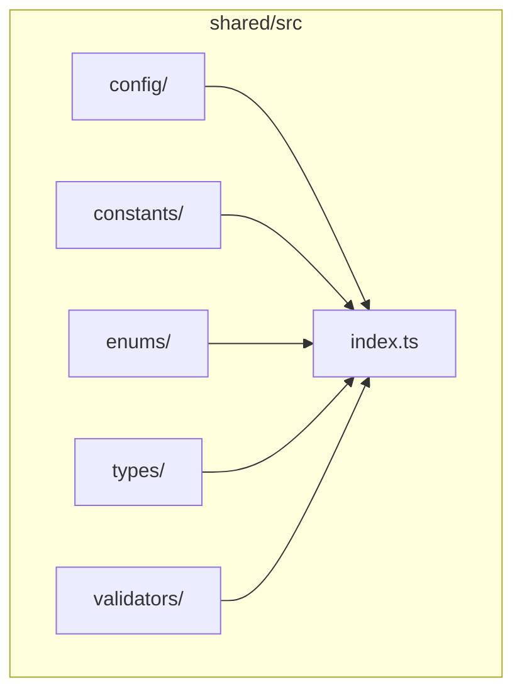
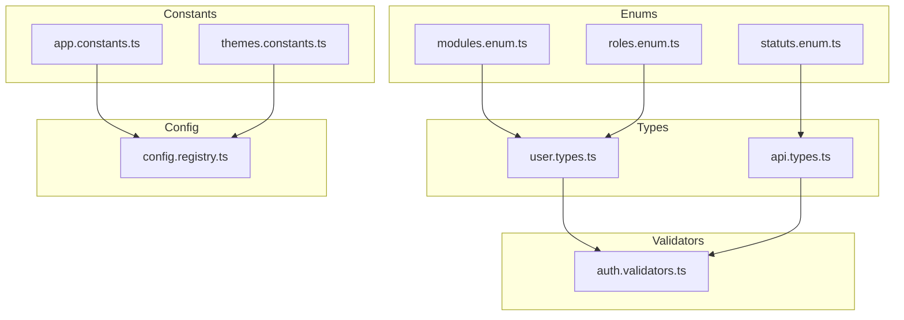
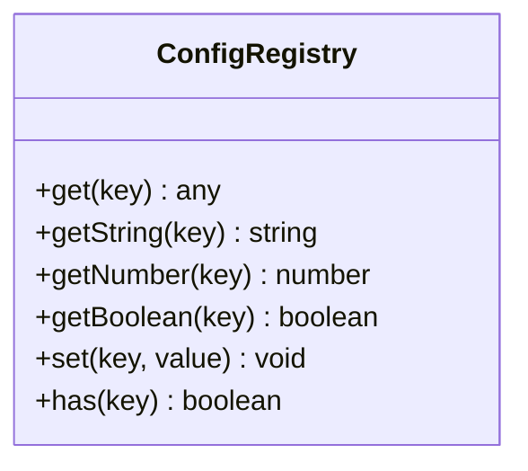
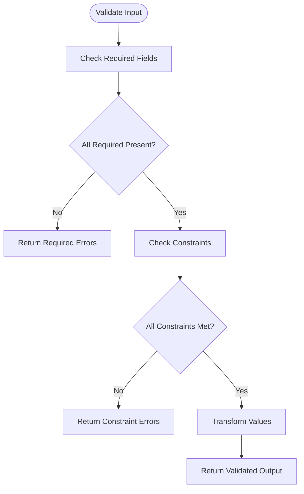
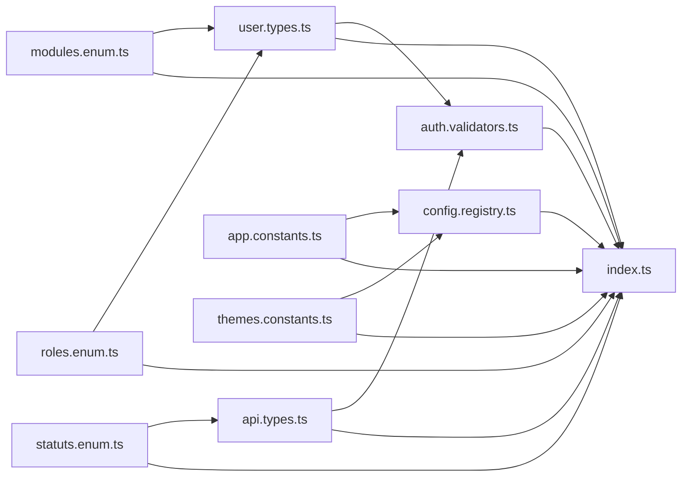

# Shared Utilities & Types

<cite>
**Referenced Files in This Document**
- [shared/src/index.ts](file://shared/src/index.ts)
- [shared/src/config/config.registry.ts](file://shared/src/config/config.registry.ts)
- [shared/src/config/index.ts](file://shared/src/config/index.ts)
- [shared/src/constants/app.constants.ts](file://shared/src/constants/app.constants.ts)
- [shared/src/constants/themes.constants.ts](file://shared/src/constants/themes.constants.ts)
- [shared/src/constants/index.ts](file://shared/src/constants/index.ts)
- [shared/src/enums/modules.enum.ts](file://shared/src/enums/modules.enum.ts)
- [shared/src/enums/roles.enum.ts](file://shared/src/enums/roles.enum.ts)
- [shared/src/enums/statuts.enum.ts](file://shared/src/enums/statuts.enum.ts)
- [shared/src/enums/index.ts](file://shared/src/enums/index.ts)
- [shared/src/types/api.types.ts](file://shared/src/types/api.types.ts)
- [shared/src/types/user.types.ts](file://shared/src/types/user.types.ts)
- [shared/src/types/index.ts](file://shared/src/types/index.ts)
- [shared/src/validators/auth.validators.ts](file://shared/src/validators/auth.validators.ts)
- [shared/src/validators/index.ts](file://shared/src/validators/index.ts)
</cite>

## Table of Contents
1. [Introduction](#introduction)
2. [Project Structure](#project-structure)
3. [Core Components](#core-components)
4. [Architecture Overview](#architecture-overview)
5. [Detailed Component Analysis](#detailed-component-analysis)
6. [Dependency Analysis](#dependency-analysis)
7. [Performance Considerations](#performance-considerations)
8. [Troubleshooting Guide](#troubleshooting-guide)
9. [Conclusion](#conclusion)

## Introduction
This document describes the shared utilities and type definitions used across the eLISAschool frontend. It focuses on:
- The TypeScript type system for users, API responses, and validation interfaces
- The configuration registry pattern and environment variable management
- Utility functions for data transformation and formatting
- Validation schemas for forms and API requests
- Shared constants, enums, and configuration objects
- Type safety practices, generic patterns, and interface design principles

## Project Structure
The shared library organizes code into cohesive modules:
- config: centralized configuration registry and exports
- constants: application-wide constants and theme definitions
- enums: typed enumerations for modules, roles, and statuses
- types: domain-specific TypeScript interfaces and types
- validators: form and API request validation schemas
- index: module re-exports for convenient imports

**Diagram sources**
- [shared/src/index.ts](file://shared/src/index.ts)
- [shared/src/config/index.ts](file://shared/src/config/index.ts)
- [shared/src/constants/index.ts](file://shared/src/constants/index.ts)
- [shared/src/enums/index.ts](file://shared/src/enums/index.ts)
- [shared/src/types/index.ts](file://shared/src/types/index.ts)
- [shared/src/validators/index.ts](file://shared/src/validators/index.ts)

**Section sources**
- [shared/src/index.ts](file://shared/src/index.ts)
- [shared/src/config/index.ts](file://shared/src/config/index.ts)
- [shared/src/constants/index.ts](file://shared/src/constants/index.ts)
- [shared/src/enums/index.ts](file://shared/src/enums/index.ts)
- [shared/src/types/index.ts](file://shared/src/types/index.ts)
- [shared/src/validators/index.ts](file://shared/src/validators/index.ts)

## Core Components
This section outlines the primary building blocks of the shared utilities.

- Configuration Registry
  - Provides a central place to manage runtime configuration and environment variables.
  - Exposes typed getters and setters to enforce type safety and prevent invalid configurations.

- Constants
  - Application constants define global values such as feature flags, limits, and identifiers.
  - Theme constants encapsulate UI-related color palettes and design tokens.

- Enums
  - Typed enumerations model domain values consistently across modules:
    - Modules enumeration defines available application modules
    - Roles enumeration defines user permissions and profiles
    - Statuses enumeration defines lifecycle or state values

- Types
  - User types define the shape of user-related data structures.
  - API types define request/response contracts for server interactions.

- Validators
  - Validation schemas define form and API payload constraints using a schema library.
  - Includes authentication-specific validators.

- Index Exports
  - The index files aggregate and re-export module members for ergonomic imports.

**Section sources**
- [shared/src/config/config.registry.ts](file://shared/src/config/config.registry.ts)
- [shared/src/constants/app.constants.ts](file://shared/src/constants/app.constants.ts)
- [shared/src/constants/themes.constants.ts](file://shared/src/constants/themes.constants.ts)
- [shared/src/enums/modules.enum.ts](file://shared/src/enums/modules.enum.ts)
- [shared/src/enums/roles.enum.ts](file://shared/src/enums/roles.enum.ts)
- [shared/src/enums/statuts.enum.ts](file://shared/src/enums/statuts.enum.ts)
- [shared/src/types/api.types.ts](file://shared/src/types/api.types.ts)
- [shared/src/types/user.types.ts](file://shared/src/types/user.types.ts)
- [shared/src/validators/auth.validators.ts](file://shared/src/validators/auth.validators.ts)

## Architecture Overview
The shared utilities follow a layered architecture:
- Types define contracts for data and API interactions
- Enums and constants provide domain and configuration primitives
- Validators enforce constraints on inputs
- The configuration registry centralizes environment-driven settings
- Index files provide a single entry point for consumers

**Diagram sources**
- [shared/src/types/user.types.ts](file://shared/src/types/user.types.ts)
- [shared/src/types/api.types.ts](file://shared/src/types/api.types.ts)
- [shared/src/enums/modules.enum.ts](file://shared/src/enums/modules.enum.ts)
- [shared/src/enums/roles.enum.ts](file://shared/src/enums/roles.enum.ts)
- [shared/src/enums/statuts.enum.ts](file://shared/src/enums/statuts.enum.ts)
- [shared/src/constants/app.constants.ts](file://shared/src/constants/app.constants.ts)
- [shared/src/constants/themes.constants.ts](file://shared/src/constants/themes.constants.ts)
- [shared/src/validators/auth.validators.ts](file://shared/src/validators/auth.validators.ts)
- [shared/src/config/config.registry.ts](file://shared/src/config/config.registry.ts)

## Detailed Component Analysis

### Configuration Registry Pattern
The configuration registry centralizes environment-driven settings and ensures type-safe access. It exposes:
- Typed getters for configuration keys
- Optional fallback values
- Validation hooks for malformed values
- A mechanism to initialize and update configuration at runtime

**Diagram sources**
- [shared/src/config/config.registry.ts](file://shared/src/config/config.registry.ts)

**Section sources**
- [shared/src/config/config.registry.ts](file://shared/src/config/config.registry.ts)

### Environment Variable Management
Environment variables are accessed via the configuration registry. Consumers should:
- Use typed getters to avoid casting errors
- Provide sensible defaults for optional variables
- Validate values during initialization
- Avoid hardcoding environment-dependent values directly in components

Best practices:
- Centralize environment keys in constants
- Use enums for enumerated environment values
- Log warnings for missing but required variables
- Keep sensitive values out of client-side bundles when possible

**Section sources**
- [shared/src/config/config.registry.ts](file://shared/src/config/config.registry.ts)
- [shared/src/constants/app.constants.ts](file://shared/src/constants/app.constants.ts)

### TypeScript Type System

#### User Types
User types define the canonical shape of user-related data:
- Identification fields (id, email, username)
- Profile fields (firstName, lastName, avatar)
- Role and permission metadata
- Timestamps and status indicators

Design principles:
- Prefer readonly interfaces for immutable data contracts
- Use union types for optional or nullable fields
- Leverage mapped utility types for partial updates
- Keep types aligned with backend DTOs to minimize mismatches

**Section sources**
- [shared/src/types/user.types.ts](file://shared/src/types/user.types.ts)

#### API Response Types
API types define request/response contracts:
- Request DTOs for endpoints
- Response envelopes (data, pagination, metadata)
- Error response shapes
- Generic wrappers for list and item responses

Design principles:
- Model success and error branches explicitly
- Use generics for reusable list/pagination wrappers
- Align field names with backend serialization conventions
- Add discriminators for union response types when needed

**Section sources**
- [shared/src/types/api.types.ts](file://shared/src/types/api.types.ts)

### Validation Interfaces and Schemas
Validation schemas ensure data integrity before submission:
- Form validation schemas define field-level constraints
- API request validation enforces payload correctness
- Authentication validators check credentials and tokens

Common patterns:
- Use a schema library to define validators
- Separate concerns: input validation vs. domain validation
- Provide localized error messages keyed by field
- Reuse common validators across forms

**Diagram sources**
- [shared/src/validators/auth.validators.ts](file://shared/src/validators/auth.validators.ts)

**Section sources**
- [shared/src/validators/auth.validators.ts](file://shared/src/validators/auth.validators.ts)

### Shared Constants and Enums

#### Constants
Application constants include:
- Feature flags and capabilities
- Limits and thresholds
- Identifiers for modules and resources
- URLs and endpoints (when applicable)

Theme constants include:
- Color palettes for light/dark modes
- Typography scales and weights
- Spacing and sizing tokens

Usage guidelines:
- Import constants instead of literals
- Group related constants logically
- Avoid magic numbers and strings in code

**Section sources**
- [shared/src/constants/app.constants.ts](file://shared/src/constants/app.constants.ts)
- [shared/src/constants/themes.constants.ts](file://shared/src/constants/themes.constants.ts)

#### Enums
Domain enums:
- Modules: enumerates available application modules
- Roles: enumerates user roles and permissions
- Statuses: enumerates lifecycle or state values

Design principles:
- Enumerate all possible values explicitly
- Avoid numeric enums unless necessary
- Use unions for string-based enums
- Keep enum names concise and descriptive

**Section sources**
- [shared/src/enums/modules.enum.ts](file://shared/src/enums/modules.enum.ts)
- [shared/src/enums/roles.enum.ts](file://shared/src/enums/roles.enum.ts)
- [shared/src/enums/statuts.enum.ts](file://shared/src/enums/statuts.enum.ts)

### Utility Functions for Data Transformation and Formatting
While the shared library currently exposes a focused set of types, enums, constants, validators, and the configuration registry, utility functions can be introduced following these principles:
- Pure functions for deterministic transformations
- Overload signatures for variant inputs
- Generics for reusable, type-safe utilities
- Immutable transformations to prevent side effects
- Centralized formatting helpers for dates, currency, and numbers

[No sources needed since this section provides general guidance]

### Type Safety Practices and Generic Patterns
Type safety practices observed in the shared types:
- Explicit typing for all public APIs
- Discriminated unions for variant data
- Mapped types for partial updates and pick projections
- Non-null assertions reserved for controlled contexts
- Generic constraints to limit allowable types

Interface design principles:
- Favor composition over inheritance
- Keep interfaces minimal and cohesive
- Use optional properties sparingly
- Align naming with domain terminology

**Section sources**
- [shared/src/types/user.types.ts](file://shared/src/types/user.types.ts)
- [shared/src/types/api.types.ts](file://shared/src/types/api.types.ts)

## Dependency Analysis
The shared library maintains low coupling and high cohesion:
- Types depend on enums and constants
- Validators depend on types and enums
- Configuration registry depends on constants and environment
- Index files aggregate exports for consumers

**Diagram sources**
- [shared/src/types/user.types.ts](file://shared/src/types/user.types.ts)
- [shared/src/types/api.types.ts](file://shared/src/types/api.types.ts)
- [shared/src/enums/modules.enum.ts](file://shared/src/enums/modules.enum.ts)
- [shared/src/enums/roles.enum.ts](file://shared/src/enums/roles.enum.ts)
- [shared/src/enums/statuts.enum.ts](file://shared/src/enums/statuts.enum.ts)
- [shared/src/constants/app.constants.ts](file://shared/src/constants/app.constants.ts)
- [shared/src/constants/themes.constants.ts](file://shared/src/constants/themes.constants.ts)
- [shared/src/config/config.registry.ts](file://shared/src/config/config.registry.ts)
- [shared/src/validators/auth.validators.ts](file://shared/src/validators/auth.validators.ts)
- [shared/src/index.ts](file://shared/src/index.ts)

**Section sources**
- [shared/src/index.ts](file://shared/src/index.ts)
- [shared/src/config/index.ts](file://shared/src/config/index.ts)
- [shared/src/constants/index.ts](file://shared/src/constants/index.ts)
- [shared/src/enums/index.ts](file://shared/src/enums/index.ts)
- [shared/src/types/index.ts](file://shared/src/types/index.ts)
- [shared/src/validators/index.ts](file://shared/src/validators/index.ts)

## Performance Considerations
- Keep types flat and avoid deeply nested structures to reduce serialization overhead
- Prefer enums over free-form strings for frequent comparisons
- Cache computed values derived from constants and enums
- Minimize runtime validations in hot paths; rely on compile-time checks
- Use lazy initialization for expensive configuration computations

[No sources needed since this section provides general guidance]

## Troubleshooting Guide
Common issues and resolutions:
- Missing environment variables
  - Symptom: Unexpected nulls or runtime errors when accessing configuration
  - Resolution: Initialize configuration early and log missing required keys
- Type mismatch between client and server
  - Symptom: Validation failures or runtime errors on API calls
  - Resolution: Align types with backend DTOs and keep enums synchronized
- Inconsistent enum values
  - Symptom: UI displays unexpected labels or filters fail
  - Resolution: Centralize enum definitions and validate against them
- Overly permissive validators
  - Symptom: Invalid data passes validation
  - Resolution: Tighten constraints and add unit tests for edge cases

**Section sources**
- [shared/src/config/config.registry.ts](file://shared/src/config/config.registry.ts)
- [shared/src/types/api.types.ts](file://shared/src/types/api.types.ts)
- [shared/src/enums/modules.enum.ts](file://shared/src/enums/modules.enum.ts)
- [shared/src/validators/auth.validators.ts](file://shared/src/validators/auth.validators.ts)

## Conclusion
The shared utilities and types provide a robust foundation for type safety, configuration management, and validation across the eLISAschool frontend. By adhering to the patterns outlined here—typed contracts, centralized configuration, validated inputs, and consistent enums and constants—you can maintain reliability and scalability as the application evolves.