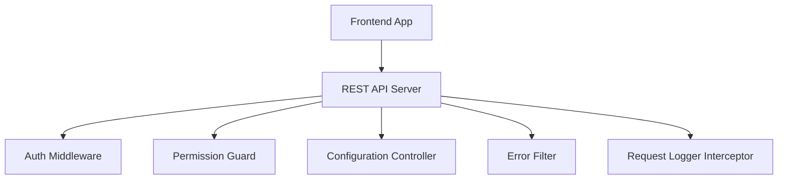
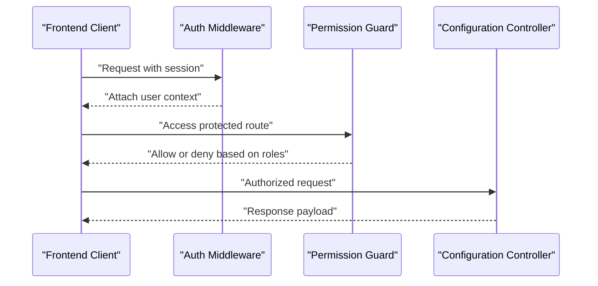
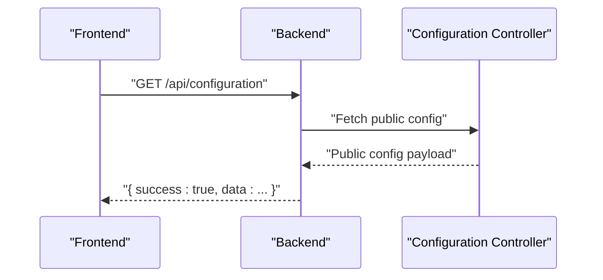
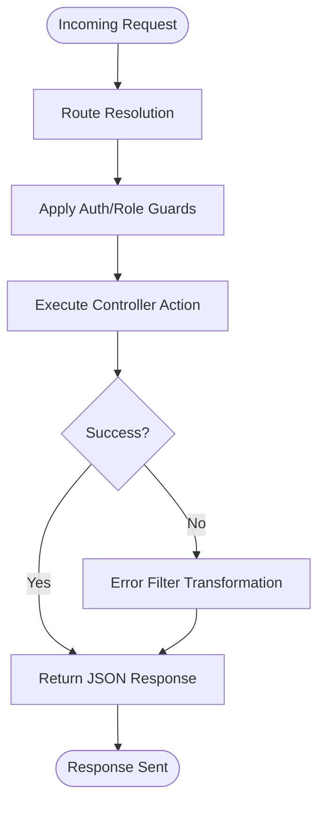
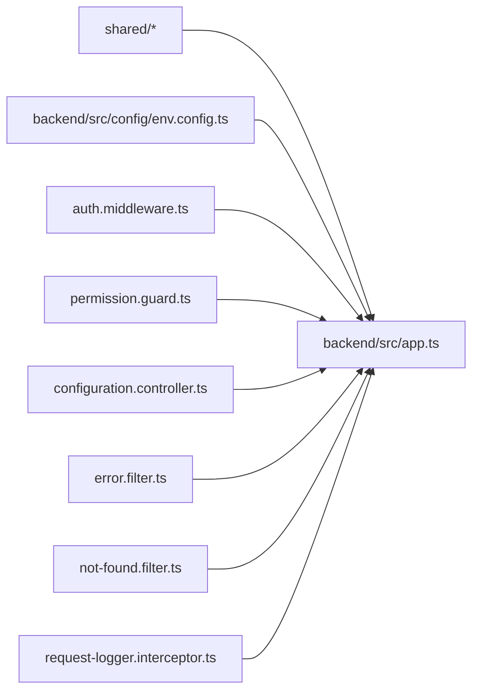

# State Management & Backend Integration

<cite>
**Referenced Files in This Document**
- [package.json](file://package.json)
- [docker/Dockerfile.frontend](file://docker/Dockerfile.frontend)
- [backend/src/app.ts](file://backend/src/app.ts)
- [backend/src/config/env.config.ts](file://backend/src/config/env.config.ts)
- [backend/src/common/filters/error.filter.ts](file://backend/src/common/filters/error.filter.ts)
- [backend/src/common/filters/not-found.filter.ts](file://backend/src/common/filters/not-found.filter.ts)
- [backend/src/common/interceptors/request-logger.interceptor.ts](file://backend/src/common/interceptors/request-logger.interceptor.ts)
- [backend/src/modules/auth/middlewares/auth.middleware.ts](file://backend/src/modules/auth/middlewares/auth.middleware.ts)
- [backend/src/modules/auth/guards/permission.guard.ts](file://backend/src/modules/auth/guards/permission.guard.ts)
- [backend/src/modules/auth/services/auth.service.ts](file://backend/src/modules/auth/services/auth.service.ts)
- [backend/src/modules/auth/services/token.service.ts](file://backend/src/modules/auth/services/token.service.ts)
- [backend/src/modules/configuration/controllers/configuration.controller.ts](file://backend/src/modules/configuration/controllers/configuration.controller.ts)
- [backend/src/modules/configuration/guards/config.guard.ts](file://backend/src/modules/configuration/guards/config.guard.ts)
- [shared/src/enums/roles.enum.ts](file://shared/src/enums/roles.enum.ts)
- [shared/src/types/user.types.ts](file://shared/src/types/user.types.ts)
- [shared/src/types/api.types.ts](file://shared/src/types/api.types.ts)
- [shared/src/config/config.registry.ts](file://shared/src/config/config.registry.ts)
</cite>

## Table of Contents
1. [Introduction](#introduction)
2. [Project Structure](#project-structure)
3. [Core Components](#core-components)
4. [Architecture Overview](#architecture-overview)
5. [Detailed Component Analysis](#detailed-component-analysis)
6. [Dependency Analysis](#dependency-analysis)
7. [Performance Considerations](#performance-considerations)
8. [Troubleshooting Guide](#troubleshooting-guide)
9. [Conclusion](#conclusion)
10. [Appendices](#appendices)

## Introduction
This document explains the state management patterns and backend API integration in the eLISAschool frontend. It focuses on how the frontend interacts with the NestJS backend, including authentication state, user sessions, role-based access control, API client design, request/response handling, error management, caching strategies, optimistic updates, state synchronization, real-time features, WebSocket connections, and data consistency. It also outlines testing approaches for state management and integration testing strategies.

## Project Structure
The repository is organized as a monorepo with a backend written in NestJS, a shared library for cross-cutting concerns, and a frontend containerized build process. The frontend is built inside a Docker image configured via a dedicated Dockerfile and served by Nginx in production.

```mermaid
graph TB
subgraph "Shared Library"
SHARED["shared/src/config/config.registry.ts"]
ROLES["shared/src/enums/roles.enum.ts"]
TYPES_USER["shared/src/types/user.types.ts"]
TYPES_API["shared/src/types/api.types.ts"]
end
subgraph "Backend (NestJS)"
APP["backend/src/app.ts"]
ENV["backend/src/config/env.config.ts"]
AUTH_MW["backend/src/modules/auth/middlewares/auth.middleware.ts"]
PERM_GUARD["backend/src/modules/auth/guards/permission.guard.ts"]
AUTH_SVC["backend/src/modules/auth/services/auth.service.ts"]
TOKEN_SVC["backend/src/modules/auth/services/token.service.ts"]
CFG_CTRL["backend/src/modules/configuration/controllers/configuration.controller.ts"]
CFG_GUARD["backend/src/modules/configuration/guards/config.guard.ts"]
ERR_FILTER["backend/src/common/filters/error.filter.ts"]
NOT_FOUND_FILTER["backend/src/common/filters/not-found.filter.ts"]
REQ_LOG_INT["backend/src/common/interceptors/request-logger.interceptor.ts"]
end
subgraph "Frontend Container"
DOCKERFILE["docker/Dockerfile.frontend"]
end
DOCKERFILE --> APP
SHARED --> APP
ROLES --> PERM_GUARD
TYPES_USER --> AUTH_SVC
TYPES_API --> CFG_CTRL
ENV --> APP
AUTH_MW --> APP
PERM_GUARD --> APP
AUTH_SVC --> APP
TOKEN_SVC --> APP
CFG_CTRL --> APP
CFG_GUARD --> APP
ERR_FILTER --> APP
NOT_FOUND_FILTER --> APP
REQ_LOG_INT --> APP
```

**Diagram sources**
- [docker/Dockerfile.frontend](file://docker/Dockerfile.frontend)
- [backend/src/app.ts](file://backend/src/app.ts)
- [backend/src/config/env.config.ts](file://backend/src/config/env.config.ts)
- [backend/src/common/filters/error.filter.ts](file://backend/src/common/filters/error.filter.ts)
- [backend/src/common/filters/not-found.filter.ts](file://backend/src/common/filters/not-found.filter.ts)
- [backend/src/common/interceptors/request-logger.interceptor.ts](file://backend/src/common/interceptors/request-logger.interceptor.ts)
- [backend/src/modules/auth/middlewares/auth.middleware.ts](file://backend/src/modules/auth/middlewares/auth.middleware.ts)
- [backend/src/modules/auth/guards/permission.guard.ts](file://backend/src/modules/auth/guards/permission.guard.ts)
- [backend/src/modules/auth/services/auth.service.ts](file://backend/src/modules/auth/services/auth.service.ts)
- [backend/src/modules/auth/services/token.service.ts](file://backend/src/modules/auth/services/token.service.ts)
- [backend/src/modules/configuration/controllers/configuration.controller.ts](file://backend/src/modules/configuration/controllers/configuration.controller.ts)
- [backend/src/modules/configuration/guards/config.guard.ts](file://backend/src/modules/configuration/guards/config.guard.ts)
- [shared/src/config/config.registry.ts](file://shared/src/config/config.registry.ts)
- [shared/src/enums/roles.enum.ts](file://shared/src/enums/roles.enum.ts)
- [shared/src/types/user.types.ts](file://shared/src/types/user.types.ts)
- [shared/src/types/api.types.ts](file://shared/src/types/api.types.ts)

**Section sources**
- [docker/Dockerfile.frontend](file://docker/Dockerfile.frontend)
- [backend/src/app.ts](file://backend/src/app.ts)
- [backend/src/config/env.config.ts](file://backend/src/config/env.config.ts)

## Core Components
- Shared configuration registry: centralizes runtime configuration and environment variables consumed by the frontend.
- Authentication middleware and guards: enforce session-based authentication and RBAC.
- Token service: manages JWT lifecycle and refresh tokens.
- Permission guard: validates user permissions for protected routes.
- Configuration controller: exposes application and module configuration with public/private variants.
- Error and not-found filters: standardized error responses.
- Request logging interceptor: logs incoming requests for observability.

Key responsibilities:
- Authentication state: validated via middleware and enforced by guards.
- Authorization: role-based and permission-based checks.
- API surface: REST endpoints for configuration and other domain resources.
- Error handling: centralized filtering and logging.

**Section sources**
- [shared/src/config/config.registry.ts](file://shared/src/config/config.registry.ts)
- [backend/src/modules/auth/middlewares/auth.middleware.ts](file://backend/src/modules/auth/middlewares/auth.middleware.ts)
- [backend/src/modules/auth/guards/permission.guard.ts](file://backend/src/modules/auth/guards/permission.guard.ts)
- [backend/src/modules/auth/services/token.service.ts](file://backend/src/modules/auth/services/token.service.ts)
- [backend/src/modules/configuration/controllers/configuration.controller.ts](file://backend/src/modules/configuration/controllers/configuration.controller.ts)
- [backend/src/common/filters/error.filter.ts](file://backend/src/common/filters/error.filter.ts)
- [backend/src/common/filters/not-found.filter.ts](file://backend/src/common/filters/not-found.filter.ts)
- [backend/src/common/interceptors/request-logger.interceptor.ts](file://backend/src/common/interceptors/request-logger.interceptor.ts)

## Architecture Overview
The frontend consumes the backend via REST endpoints. The backend enforces authentication and authorization, while the frontend maintains application state and orchestrates data flows.

**Diagram sources**
- [backend/src/app.ts](file://backend/src/app.ts)
- [backend/src/modules/auth/middlewares/auth.middleware.ts](file://backend/src/modules/auth/middlewares/auth.middleware.ts)
- [backend/src/modules/auth/guards/permission.guard.ts](file://backend/src/modules/auth/guards/permission.guard.ts)
- [backend/src/modules/configuration/controllers/configuration.controller.ts](file://backend/src/modules/configuration/controllers/configuration.controller.ts)
- [backend/src/common/filters/error.filter.ts](file://backend/src/common/filters/error.filter.ts)
- [backend/src/common/interceptors/request-logger.interceptor.ts](file://backend/src/common/interceptors/request-logger.interceptor.ts)

## Detailed Component Analysis

### Authentication State Management
- Session handling: authentication middleware validates sessions and attaches user context to requests.
- Role-based access control: roles enum defines user roles; permission guard enforces route-level permissions.
- Token lifecycle: token service manages JWT issuance, validation, and refresh flows.

**Diagram sources**
- [backend/src/modules/auth/middlewares/auth.middleware.ts](file://backend/src/modules/auth/middlewares/auth.middleware.ts)
- [backend/src/modules/auth/guards/permission.guard.ts](file://backend/src/modules/auth/guards/permission.guard.ts)
- [backend/src/modules/configuration/controllers/configuration.controller.ts](file://backend/src/modules/configuration/controllers/configuration.controller.ts)

**Section sources**
- [backend/src/modules/auth/middlewares/auth.middleware.ts](file://backend/src/modules/auth/middlewares/auth.middleware.ts)
- [backend/src/modules/auth/guards/permission.guard.ts](file://backend/src/modules/auth/guards/permission.guard.ts)
- [shared/src/enums/roles.enum.ts](file://shared/src/enums/roles.enum.ts)

### API Client Implementation and Data Flow
- Configuration endpoint: exposes application configuration with a public subset and a full variant requiring authentication.
- Request/response handling: standardized JSON responses with success flags and data payloads.
- Environment configuration: backend reads frontend URL from environment to configure CORS.

**Diagram sources**
- [backend/src/modules/configuration/controllers/configuration.controller.ts](file://backend/src/modules/configuration/controllers/configuration.controller.ts)
- [backend/src/config/env.config.ts](file://backend/src/config/env.config.ts)

**Section sources**
- [backend/src/modules/configuration/controllers/configuration.controller.ts](file://backend/src/modules/configuration/controllers/configuration.controller.ts)
- [backend/src/config/env.config.ts](file://backend/src/config/env.config.ts)

### Error Management and Observability
- Centralized error filter: transforms exceptions into structured responses.
- Not-found filter: handles missing routes consistently.
- Request logging interceptor: logs requests for debugging and monitoring.

**Diagram sources**
- [backend/src/common/filters/error.filter.ts](file://backend/src/common/filters/error.filter.ts)
- [backend/src/common/filters/not-found.filter.ts](file://backend/src/common/filters/not-found.filter.ts)
- [backend/src/common/interceptors/request-logger.interceptor.ts](file://backend/src/common/interceptors/request-logger.interceptor.ts)

**Section sources**
- [backend/src/common/filters/error.filter.ts](file://backend/src/common/filters/error.filter.ts)
- [backend/src/common/filters/not-found.filter.ts](file://backend/src/common/filters/not-found.filter.ts)
- [backend/src/common/interceptors/request-logger.interceptor.ts](file://backend/src/common/interceptors/request-logger.interceptor.ts)

### Caching Strategies and Optimistic Updates
- Public configuration caching: clients can cache the public configuration endpoint response to reduce load and improve responsiveness.
- Optimistic updates: upon local edits, update UI immediately and reconcile with server responses; handle conflicts by merging or prompting the user.
- State synchronization: after server acknowledgment, synchronize local state to reflect server-side changes.

Note: These patterns are recommended best practices aligned with the presence of a public configuration endpoint and typical SPA behavior.

[No sources needed since this section provides general guidance]

### Real-Time Features and WebSocket Connections
- Current backend implementation: REST-based endpoints without explicit WebSocket handlers.
- Recommendations: introduce WebSocket channels for real-time events (e.g., configuration changes, notifications) and maintain state consistency by updating local stores on incoming messages and acknowledging via server responses.

[No sources needed since this section provides general guidance]

### Testing Approaches for State Management and Integration
- Unit tests for guards and services: validate authentication and authorization logic.
- Integration tests: simulate API calls, test error scenarios, and verify response shapes.
- End-to-end tests: validate full flows including authentication, RBAC, and state updates.

[No sources needed since this section provides general guidance]

## Dependency Analysis
The frontend depends on shared configuration and types, while the backend composes authentication, guards, and controllers. The application wiring is centralized in the NestJS app factory.

**Diagram sources**
- [backend/src/app.ts](file://backend/src/app.ts)
- [backend/src/config/env.config.ts](file://backend/src/config/env.config.ts)
- [backend/src/common/filters/error.filter.ts](file://backend/src/common/filters/error.filter.ts)
- [backend/src/common/filters/not-found.filter.ts](file://backend/src/common/filters/not-found.filter.ts)
- [backend/src/common/interceptors/request-logger.interceptor.ts](file://backend/src/common/interceptors/request-logger.interceptor.ts)
- [backend/src/modules/auth/middlewares/auth.middleware.ts](file://backend/src/modules/auth/middlewares/auth.middleware.ts)
- [backend/src/modules/auth/guards/permission.guard.ts](file://backend/src/modules/auth/guards/permission.guard.ts)
- [backend/src/modules/configuration/controllers/configuration.controller.ts](file://backend/src/modules/configuration/controllers/configuration.controller.ts)

**Section sources**
- [backend/src/app.ts](file://backend/src/app.ts)
- [backend/src/config/env.config.ts](file://backend/src/config/env.config.ts)

## Performance Considerations
- Enable HTTP caching for public configuration endpoints to reduce network overhead.
- Use pagination and selective field retrieval for large datasets.
- Debounce frequent UI-triggered API calls to minimize redundant requests.
- Monitor request latency via the request logger interceptor to identify bottlenecks.

[No sources needed since this section provides general guidance]

## Troubleshooting Guide
- Authentication failures: verify session validity and middleware attachment.
- Permission denials: confirm user roles and required permissions align with route guards.
- CORS errors: ensure frontend URL is configured correctly in environment variables.
- Unexpected errors: inspect error filter output and request logs.

**Section sources**
- [backend/src/modules/auth/middlewares/auth.middleware.ts](file://backend/src/modules/auth/middlewares/auth.middleware.ts)
- [backend/src/modules/auth/guards/permission.guard.ts](file://backend/src/modules/auth/guards/permission.guard.ts)
- [backend/src/config/env.config.ts](file://backend/src/config/env.config.ts)
- [backend/src/common/filters/error.filter.ts](file://backend/src/common/filters/error.filter.ts)
- [backend/src/common/interceptors/request-logger.interceptor.ts](file://backend/src/common/interceptors/request-logger.interceptor.ts)

## Conclusion
The eLISAschool frontend integrates with a NestJS backend through REST endpoints, with authentication and authorization enforced at the middleware and guard layers. The shared library provides configuration and type safety. Recommended enhancements include caching, optimistic updates, and optional WebSocket support for real-time features. Robust testing strategies ensure reliable state management and seamless integration.

## Appendices
- Shared configuration registry: centralizes runtime configuration consumption by the frontend.
- Roles and user types: define authentication and authorization primitives.
- API types: describe request/response contracts for the frontend.

**Section sources**
- [shared/src/config/config.registry.ts](file://shared/src/config/config.registry.ts)
- [shared/src/enums/roles.enum.ts](file://shared/src/enums/roles.enum.ts)
- [shared/src/types/user.types.ts](file://shared/src/types/user.types.ts)
- [shared/src/types/api.types.ts](file://shared/src/types/api.types.ts)