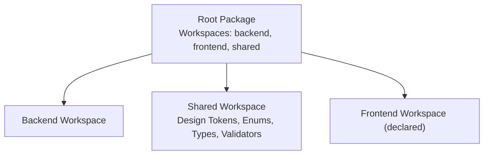
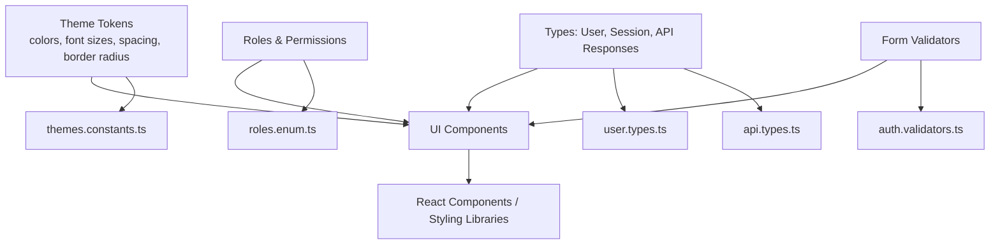
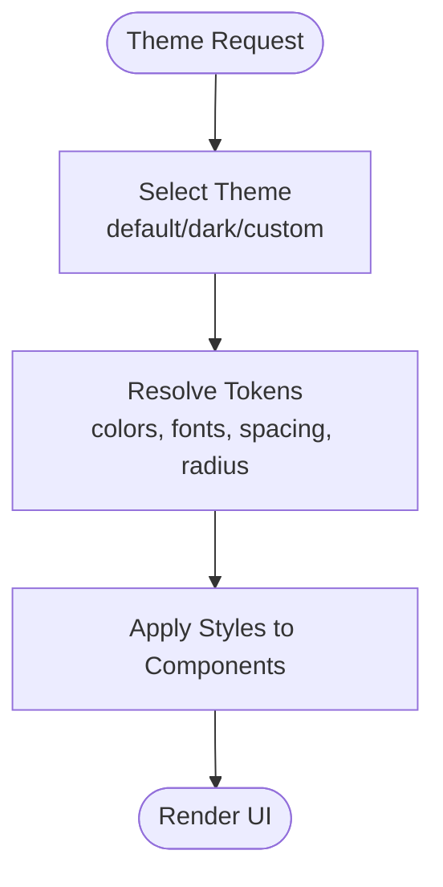
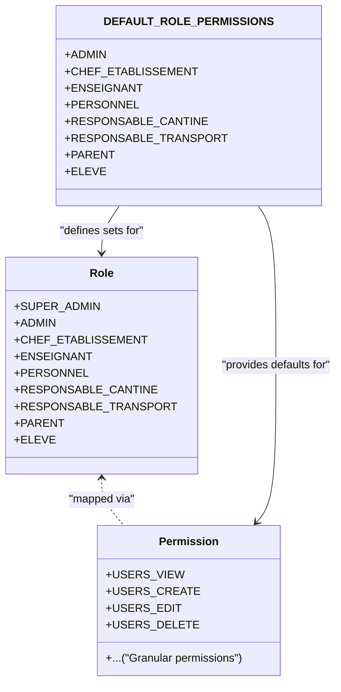
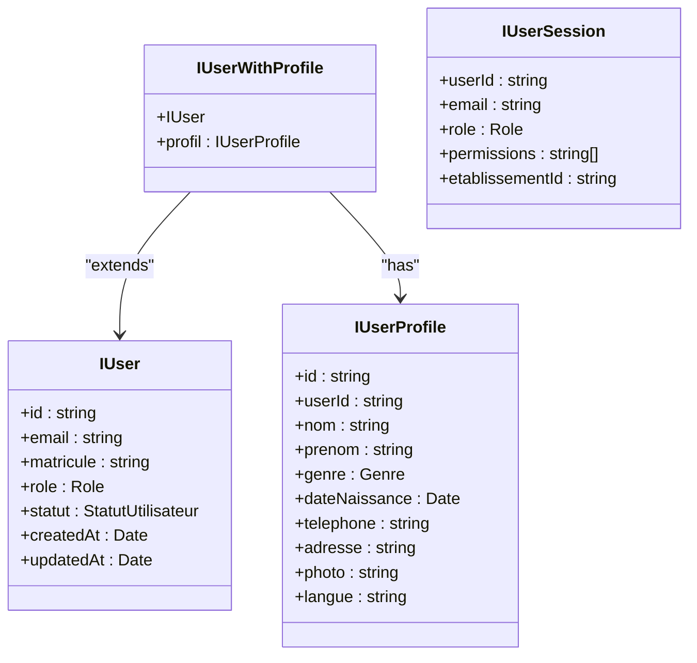
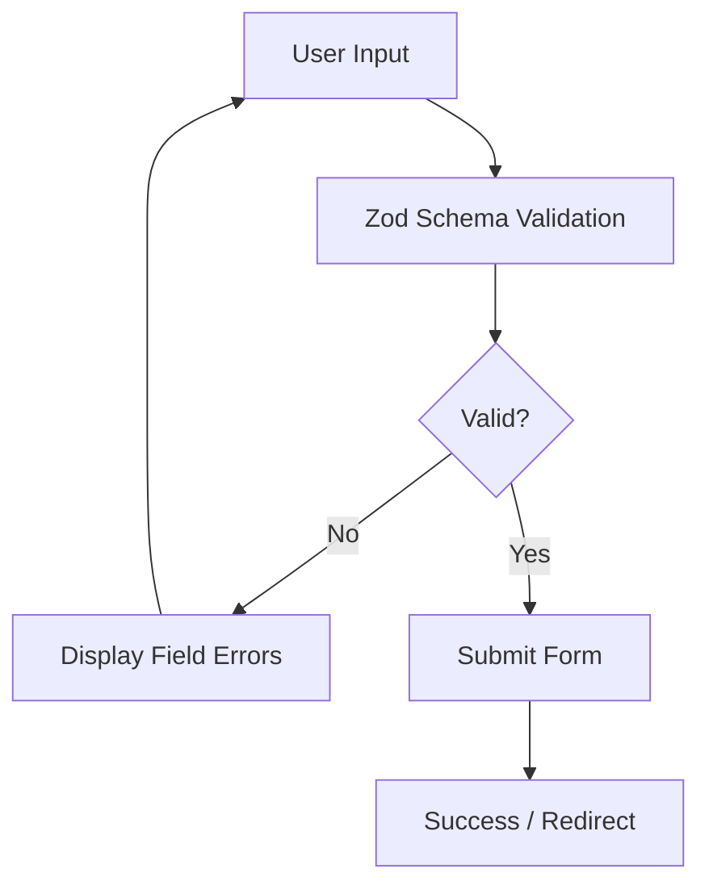
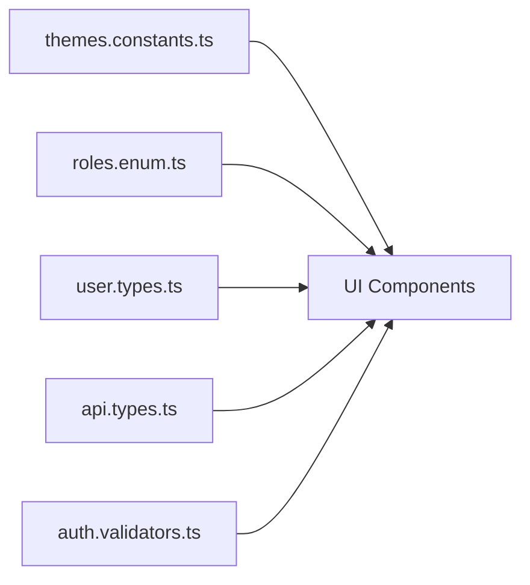

# UI Components & Design System

<cite>
**Referenced Files in This Document**
- [package.json](file://package.json)
- [themes.constants.ts](file://shared/src/constants/themes.constants.ts)
- [app.constants.ts](file://shared/src/constants/app.constants.ts)
- [roles.enum.ts](file://shared/src/enums/roles.enum.ts)
- [user.types.ts](file://shared/src/types/user.types.ts)
- [api.types.ts](file://shared/src/types/api.types.ts)
- [auth.validators.ts](file://shared/src/validators/auth.validators.ts)
</cite>

## Table of Contents
1. [Introduction](#introduction)
2. [Project Structure](#project-structure)
3. [Core Components](#core-components)
4. [Architecture Overview](#architecture-overview)
5. [Detailed Component Analysis](#detailed-component-analysis)
6. [Dependency Analysis](#dependency-analysis)
7. [Performance Considerations](#performance-considerations)
8. [Troubleshooting Guide](#troubleshooting-guide)
9. [Conclusion](#conclusion)
10. [Appendices](#appendices)

## Introduction
This document describes the UI components and design system foundation for eLISAschool. It focuses on the shared design tokens and type systems that underpin the user interface, role-based access patterns, and validation schemas. While the frontend workspace is declared in the monorepo configuration, this repository snapshot does not include a dedicated frontend directory. Therefore, this document emphasizes the design system assets present in the shared package and outlines how they would integrate with UI components in a React-based frontend.

## Project Structure
The repository follows a monorepo layout with workspaces for backend, frontend, and shared packages. The design system and type definitions live in the shared package, enabling reuse across applications.

**Diagram sources**
- [package.json:8-12](file://package.json#L8-L12)

**Section sources**
- [package.json:1-33](file://package.json#L1-L33)

## Core Components
This section documents the design system primitives and type contracts that inform UI components and styling.

- Theme tokens and palettes
  - Default theme with semantic color roles (primary, secondary, accent, danger, warning, success, info), neutral tones, backgrounds, and text roles.
  - Predefined themes: default, dark mode, and a thematic variant aligned with national colors.
- Typography scale
  - Font sizes ranging from extra-small to extra-extra-large suitable for headings and body text.
- Spacing units
  - A consistent spacing scale mapped to rem units for margins, padding, and gaps.
- Border radius scale
  - Standardized corner radii for consistent rounded elements.

These tokens are exported as constants and grouped for easy consumption by UI libraries and styling systems.

**Section sources**
- [themes.constants.ts:12-57](file://shared/src/constants/themes.constants.ts#L12-L57)
- [themes.constants.ts:62-102](file://shared/src/constants/themes.constants.ts#L62-L102)

- Application constants
  - Limits for UI constraints (e.g., message length, file size, pagination defaults).
  - Supported currencies and languages with defaults.
  - These constants guide component behavior and validation rules.

**Section sources**
- [app.constants.ts:23-43](file://shared/src/constants/app.constants.ts#L23-L43)
- [app.constants.ts:48-71](file://shared/src/constants/app.constants.ts#L48-L71)

- Role and permission model
  - Enumerated roles for administrators, teachers, staff, parents, and students.
  - Granular permissions for managing users, grades, reports, canteen, transport, materials, clubs, documents, cards, configuration, monitoring, messaging, notifications, requests, and gamification.
  - Default permission sets per role to drive feature visibility and capability in the UI.

**Section sources**
- [roles.enum.ts:12-39](file://shared/src/enums/roles.enum.ts#L12-L39)
- [roles.enum.ts:44-115](file://shared/src/enums/roles.enum.ts#L44-L115)
- [roles.enum.ts:120-184](file://shared/src/enums/roles.enum.ts#L120-L184)

- Type contracts for user data and API responses
  - Base user interface, profile, session, and enriched user with profile.
  - Standardized API response shape, pagination metadata, pagination options, and error structures.

**Section sources**
- [user.types.ts:14-45](file://shared/src/types/user.types.ts#L14-L45)
- [user.types.ts:50-56](file://shared/src/types/user.types.ts#L50-L56)
- [api.types.ts:12-31](file://shared/src/types/api.types.ts#L12-L31)
- [api.types.ts:36-41](file://shared/src/types/api.types.ts#L36-L41)
- [api.types.ts:46-61](file://shared/src/types/api.types.ts#L46-L61)

- Form validation schemas
  - Zod-based schemas for login, registration, password changes, forgot password, and reset password.
  - Validation rules leverage application limits and enforce strong password policies.

**Section sources**
- [auth.validators.ts:15-25](file://shared/src/validators/auth.validators.ts#L15-L25)
- [auth.validators.ts:30-58](file://shared/src/validators/auth.validators.ts#L30-L58)
- [auth.validators.ts:63-78](file://shared/src/validators/auth.validators.ts#L63-L78)
- [auth.validators.ts:83-86](file://shared/src/validators/auth.validators.ts#L83-L86)
- [auth.validators.ts:91-103](file://shared/src/validators/auth.validators.ts#L91-L103)

## Architecture Overview
The design system is organized around shared tokens and types consumed by UI components. The following diagram illustrates how design tokens, enums, types, and validators relate to each other and how they influence role-based UI behavior.

**Diagram sources**
- [themes.constants.ts:12-110](file://shared/src/constants/themes.constants.ts#L12-L110)
- [roles.enum.ts:12-184](file://shared/src/enums/roles.enum.ts#L12-L184)
- [user.types.ts:14-56](file://shared/src/types/user.types.ts#L14-L56)
- [api.types.ts:12-61](file://shared/src/types/api.types.ts#L12-L61)
- [auth.validators.ts:15-103](file://shared/src/validators/auth.validators.ts#L15-L103)

## Detailed Component Analysis
This section maps the design system to potential UI component patterns and role-specific behaviors.

### Theme System and Styling Patterns
- Color palette
  - Semantic roles (primary, secondary, accent, danger, warning, success, info) enable consistent theming across components.
  - Neutral tones and text roles support readable interfaces and accessible contrast.
  - Predefined themes (default, dark, thematic) allow runtime switching and brand alignment.
- Typography
  - Font size scale supports responsive headings and body copy.
- Spacing and borders
  - Consistent spacing and border radius scales promote visual rhythm and cohesive layouts.

**Diagram sources**
- [themes.constants.ts:40-57](file://shared/src/constants/themes.constants.ts#L40-L57)
- [themes.constants.ts:62-102](file://shared/src/constants/themes.constants.ts#L62-L102)

**Section sources**
- [themes.constants.ts:12-57](file://shared/src/constants/themes.constants.ts#L12-L57)
- [themes.constants.ts:62-102](file://shared/src/constants/themes.constants.ts#L62-L102)

### Role-Based UI Composition
- Roles define capabilities and feature visibility.
- Permissions map to granular actions (view, create, edit, delete, validate, print, manage, broadcast, approve, etc.).
- Default role permissions establish baseline feature sets for each role.

**Diagram sources**
- [roles.enum.ts:12-39](file://shared/src/enums/roles.enum.ts#L12-L39)
- [roles.enum.ts:44-115](file://shared/src/enums/roles.enum.ts#L44-L115)
- [roles.enum.ts:120-184](file://shared/src/enums/roles.enum.ts#L120-L184)

**Section sources**
- [roles.enum.ts:12-39](file://shared/src/enums/roles.enum.ts#L12-L39)
- [roles.enum.ts:120-184](file://shared/src/enums/roles.enum.ts#L120-L184)

### Prop Interfaces and Reusable Component Libraries
- User and session types define props for identity-aware components (e.g., navigation bars, profile cards, permission gates).
- API response types standardize data fetching and error handling across reusable lists, forms, modals, and dashboards.
- Pagination types enable consistent data presentation patterns.

**Diagram sources**
- [user.types.ts:14-45](file://shared/src/types/user.types.ts#L14-L45)
- [user.types.ts:50-56](file://shared/src/types/user.types.ts#L50-L56)

**Section sources**
- [user.types.ts:14-45](file://shared/src/types/user.types.ts#L14-L45)
- [user.types.ts:50-56](file://shared/src/types/user.types.ts#L50-L56)
- [api.types.ts:12-31](file://shared/src/types/api.types.ts#L12-L31)

### Form Validation and Accessibility
- Zod schemas enforce client-side validation for authentication flows, ensuring robust input handling and user feedback.
- Accessible form controls should reflect validation messages, focus management, and keyboard navigation patterns.

**Diagram sources**
- [auth.validators.ts:15-25](file://shared/src/validators/auth.validators.ts#L15-L25)
- [auth.validators.ts:30-58](file://shared/src/validators/auth.validators.ts#L30-L58)
- [auth.validators.ts:63-78](file://shared/src/validators/auth.validators.ts#L63-L78)
- [auth.validators.ts:91-103](file://shared/src/validators/auth.validators.ts#L91-L103)

**Section sources**
- [auth.validators.ts:15-25](file://shared/src/validators/auth.validators.ts#L15-L25)
- [auth.validators.ts:30-58](file://shared/src/validators/auth.validators.ts#L30-L58)
- [auth.validators.ts:63-78](file://shared/src/validators/auth.validators.ts#L63-L78)
- [auth.validators.ts:91-103](file://shared/src/validators/auth.validators.ts#L91-L103)

### Responsive Breakpoints and Cross-Browser Compatibility
- The design system currently defines tokens for colors, typography, spacing, and border radius. There is no explicit breakpoint scale in the provided files.
- To ensure responsive behavior, adopt a mobile-first approach and introduce a consistent breakpoint scale aligned with the design tokens.

[No sources needed since this section provides general guidance]

### Accessibility Guidelines
- Use semantic HTML and ARIA attributes where appropriate.
- Ensure sufficient color contrast against backgrounds defined by the theme tokens.
- Provide focus indicators and keyboard navigation support.
- Offer accessible form labeling and error announcements.

[No sources needed since this section provides general guidance]

### Testing Strategies and Documentation Standards
- Unit tests for validation schemas using Zod to verify input constraints.
- Component tests for UI elements consuming theme tokens, role permissions, and typed props.
- Storybook or similar documentation tooling to showcase component variants, states, and usage examples.

[No sources needed since this section provides general guidance]

## Dependency Analysis
The design system components depend on each other to form a cohesive UI foundation. The following diagram highlights these relationships.

**Diagram sources**
- [themes.constants.ts:12-110](file://shared/src/constants/themes.constants.ts#L12-L110)
- [roles.enum.ts:12-184](file://shared/src/enums/roles.enum.ts#L12-L184)
- [user.types.ts:14-56](file://shared/src/types/user.types.ts#L14-L56)
- [api.types.ts:12-61](file://shared/src/types/api.types.ts#L12-L61)
- [auth.validators.ts:15-103](file://shared/src/validators/auth.validators.ts#L15-L103)

**Section sources**
- [themes.constants.ts:12-110](file://shared/src/constants/themes.constants.ts#L12-L110)
- [roles.enum.ts:12-184](file://shared/src/enums/roles.enum.ts#L12-L184)
- [user.types.ts:14-56](file://shared/src/types/user.types.ts#L14-L56)
- [api.types.ts:12-61](file://shared/src/types/api.types.ts#L12-L61)
- [auth.validators.ts:15-103](file://shared/src/validators/auth.validators.ts#L15-L103)

## Performance Considerations
- Prefer CSS custom properties or styled-system tokens to minimize re-renders during theme switching.
- Memoize computed styles derived from theme tokens.
- Lazy-load heavy UI components and defer non-critical resources.

[No sources needed since this section provides general guidance]

## Troubleshooting Guide
- Authentication form errors
  - Validate inputs against Zod schemas and surface localized error messages.
  - Ensure password constraints align with application limits.
- Role-based rendering issues
  - Confirm that permission checks use the correct role-to-permission mapping.
  - Verify that session data includes the expected permissions array.
- API response handling
  - Distinguish between successful responses and error responses using the standardized shapes.
  - Paginate results according to pagination options and metadata.

**Section sources**
- [auth.validators.ts:15-25](file://shared/src/validators/auth.validators.ts#L15-L25)
- [roles.enum.ts:120-184](file://shared/src/enums/roles.enum.ts#L120-L184)
- [api.types.ts:12-31](file://shared/src/types/api.types.ts#L12-L31)
- [api.types.ts:46-61](file://shared/src/types/api.types.ts#L46-L61)

## Conclusion
The eLISAschool design system centers on shared theme tokens, role and permission enums, type-safe contracts, and validated forms. These building blocks enable consistent, accessible, and maintainable UI components across roles and use cases. While the frontend workspace is declared, the design system assets in this repository provide a solid foundation for implementing UI components and styling patterns in a React-based frontend.

## Appendices
- Additional considerations
  - Introduce a responsive breakpoint scale aligned with the existing spacing and typography tokens.
  - Establish component-level documentation standards and testing practices for reusable UI libraries.

[No sources needed since this section provides general guidance]