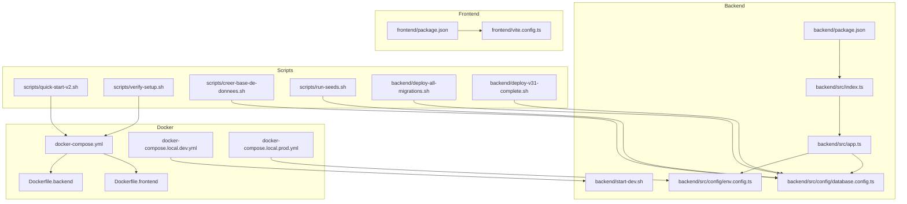
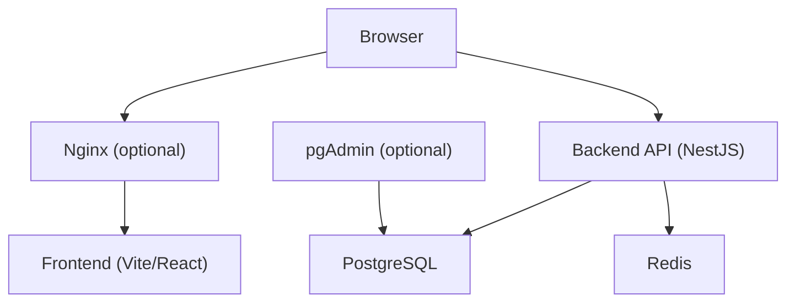
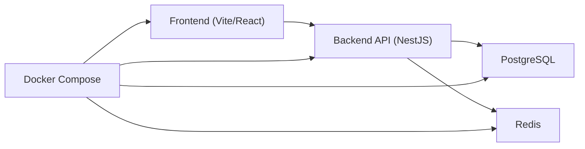

# Getting Started

<cite>
**Referenced Files in This Document**
- [README.md](file://README.md)
- [QUICKSTART.md](file://QUICKSTART.md)
- [docker/README.md](file://docker/README.md)
- [docker/docker-compose.yml](file://docker/docker-compose.yml)
- [docker/docker-compose.local.dev.yml](file://docker/docker-compose.local.dev.yml)
- [docker/docker-compose.local.prod.yml](file://docker/docker-compose.local.prod.yml)
- [docker/Dockerfile.backend](file://docker/Dockerfile.backend)
- [docker/Dockerfile.frontend](file://docker/Dockerfile.frontend)
- [backend/package.json](file://backend/package.json)
- [backend/src/config/env.config.ts](file://backend/src/config/env.config.ts)
- [backend/src/config/database.config.ts](file://backend/src/config/database.config.ts)
- [backend/src/index.ts](file://backend/src/index.ts)
- [backend/src/app.ts](file://backend/src/app.ts)
- [backend/start-dev.sh](file://backend/start-dev.sh)
- [frontend/package.json](file://frontend/package.json)
- [frontend/vite.config.ts](file://frontend/vite.config.ts)
- [scripts/quick-start-v2.sh](file://scripts/quick-start-v2.sh)
- [scripts/verify-setup.sh](file://scripts/verify-setup.sh)
- [scripts/creer-base-de-donnees.sh](file://scripts/creer-base-de-donnees.sh)
- [scripts/run-seeds.sh](file://scripts/run-seeds.sh)
- [backend/deploy-all-migrations.sh](file://backend/deploy-all-migrations.sh)
- [backend/deploy-v31-complete.sh](file://backend/deploy-v31-complete.sh)
- [docker/scripts/validate-infrastructure.sh](file://docker/scripts/validate-infrastructure.sh)
- [docker/QUICK-START.md](file://docker/QUICK-START.md)
- [docker/PGADMIN-GUIDE.md](file://docker/PGADMIN-GUIDE.md)
- [docs/guides/GUIDE-DEVELOPPEMENT.md](file://docs/guides/GUIDE-DEVELOPPEMENT.md)
- [docs/guides/GUIDE-CONNEXION-BASE-DE-DONNEES.md](file://docs/guides/GUIDE-CONNEXION-BASE-DE-DONNEES.md)
- [docs/guides/GUIDE-TEST-MULTI-TENANT-V3.md](file://docs/guides/GUIDE-TEST-MULTI-TENANT-V3.md)
- [docs/guides/GUIDE-AUTHENTIFICATION.md](file://docs/guides/GUIDE-AUTHENTIFICATION.md)
- [docs/guides/GUIDE-STRUCTURE-ACADEMIQUE.md](file://docs/guides/GUIDE-STRUCTURE-ACADEMIQUE.md)
- [docs/guides/GUIDE-ACCES-RESEAU-LOCAL.md](file://docs/guides/GUIDE-ACCES-RESEAU-LOCAL.md)
- [docs/guides/GUIDE-DEPLOIEMENT-RAPIDE-V2.md](file://docs/guides/GUIDE-DEPLOIEMENT-RAPIDE-V2.md)
- [docs/guides/MIGRATIONS-GUIDE.md](file://docs/guides/MIGRATIONS-GUIDE.md)
- [docs/guides/PERFORMANCE-INSTALLATION.md](file://docs/guides/PERFORMANCE-INSTALLATION.md)
- [docs/guides/GUIDE-COMMANDES-DOCKER-ELISASCHOOL.md](file://docs/guides/GUIDE-COMMANDES-DOCKER-ELISASCHOOL.md)
</cite>

## Table of Contents
1. [Introduction](#introduction)
2. [Project Structure](#project-structure)
3. [Core Components](#core-components)
4. [Architecture Overview](#architecture-overview)
5. [Detailed Component Analysis](#detailed-component-analysis)
6. [Dependency Analysis](#dependency-analysis)
7. [Performance Considerations](#performance-considerations)
8. [Troubleshooting Guide](#troubleshooting-guide)
9. [Conclusion](#conclusion)
10. [Appendices](#appendices)

## Introduction
eLISAschool is a multi-tenant school management system designed for African educational contexts. It provides comprehensive modules to manage institutions, academic structures, students, staff, finances, scheduling, messaging, and more. The platform supports multiple schools (tenants), role-based access control, and configurable academic calendars aligned with regional practices.

This guide helps you install, configure, and run eLISAschool locally or in production using Docker or native services. It also explains core concepts such as multi-tenancy, roles, and permissions, and walks through first-time setup and basic administrative tasks.

[No sources needed since this section doesn't analyze specific files]

## Project Structure
At a high level:
- Backend: NestJS application with TypeScript, PostgreSQL migrations, Redis integration, and modular architecture.
- Frontend: React/Vite application with feature-based organization and TanStack Router.
- Docker: Compose files and images for local and production environments.
- Scripts: Automation for setup, migrations, seeds, and verification.
- Docs: Guides covering development, deployment, authentication, database connectivity, and multi-tenant testing.

**Diagram sources**
- [docker/docker-compose.yml](file://docker/docker-compose.yml)
- [docker/docker-compose.local.dev.yml](file://docker/docker-compose.local.dev.yml)
- [docker/docker-compose.local.prod.yml](file://docker/docker-compose.local.prod.yml)
- [docker/Dockerfile.backend](file://docker/Dockerfile.backend)
- [docker/Dockerfile.frontend](file://docker/Dockerfile.frontend)
- [backend/package.json](file://backend/package.json)
- [backend/src/index.ts](file://backend/src/index.ts)
- [backend/src/app.ts](file://backend/src/app.ts)
- [backend/src/config/env.config.ts](file://backend/src/config/env.config.ts)
- [backend/src/config/database.config.ts](file://backend/src/config/database.config.ts)
- [backend/start-dev.sh](file://backend/start-dev.sh)
- [frontend/package.json](file://frontend/package.json)
- [frontend/vite.config.ts](file://frontend/vite.config.ts)
- [scripts/quick-start-v2.sh](file://scripts/quick-start-v2.sh)
- [scripts/verify-setup.sh](file://scripts/verify-setup.sh)
- [scripts/creer-base-de-donnees.sh](file://scripts/creer-base-de-donnees.sh)
- [scripts/run-seeds.sh](file://scripts/run-seeds.sh)
- [backend/deploy-all-migrations.sh](file://backend/deploy-all-migrations.sh)
- [backend/deploy-v31-complete.sh](file://backend/deploy-v31-complete.sh)

**Section sources**
- [README.md](file://README.md)
- [QUICKSTART.md](file://QUICKSTART.md)
- [docker/README.md](file://docker/README.md)
- [docker/docker-compose.yml](file://docker/docker-compose.yml)
- [docker/docker-compose.local.dev.yml](file://docker/docker-compose.local.dev.yml)
- [docker/docker-compose.local.prod.yml](file://docker/docker-compose.local.prod.yml)
- [docker/Dockerfile.backend](file://docker/Dockerfile.backend)
- [docker/Dockerfile.frontend](file://docker/Dockerfile.frontend)
- [backend/package.json](file://backend/package.json)
- [backend/src/config/env.config.ts](file://backend/src/config/env.config.ts)
- [backend/src/config/database.config.ts](file://backend/src/config/database.config.ts)
- [backend/src/index.ts](file://backend/src/index.ts)
- [backend/src/app.ts](file://backend/src/app.ts)
- [backend/start-dev.sh](file://backend/start-dev.sh)
- [frontend/package.json](file://frontend/package.json)
- [frontend/vite.config.ts](file://frontend/vite.config.ts)
- [scripts/quick-start-v2.sh](file://scripts/quick-start-v2.sh)
- [scripts/verify-setup.sh](file://scripts/verify-setup.sh)
- [scripts/creer-base-de-donnees.sh](file://scripts/creer-base-de-donnees.sh)
- [scripts/run-seeds.sh](file://scripts/run-seeds.sh)
- [backend/deploy-all-migrations.sh](file://backend/deploy-all-migrations.sh)
- [backend/deploy-v31-complete.sh](file://backend/deploy-v31-complete.sh)

## Core Components
- Backend runtime: Node.js with NestJS; entry points initialize the app and load configuration.
- Database: PostgreSQL with extensive migration scripts and seed data.
- Cache/Sessions: Redis used by the backend for caching and session storage.
- Frontend: Vite + React application configured via environment variables.
- Docker: Containerized services for consistent development and production runs.

Key configuration areas:
- Environment variables for database, Redis, JWT, and frontend proxy settings.
- Database connection configuration and migration execution.
- Docker Compose orchestration for all services.

**Section sources**
- [backend/src/config/env.config.ts](file://backend/src/config/env.config.ts)
- [backend/src/config/database.config.ts](file://backend/src/config/database.config.ts)
- [backend/src/index.ts](file://backend/src/index.ts)
- [backend/src/app.ts](file://backend/src/app.ts)
- [docker/docker-compose.yml](file://docker/docker-compose.yml)
- [docker/docker-compose.local.dev.yml](file://docker/docker-compose.local.dev.yml)
- [docker/docker-compose.local.prod.yml](file://docker/docker-compose.local.prod.yml)
- [frontend/vite.config.ts](file://frontend/vite.config.ts)

## Architecture Overview
The system consists of:
- Frontend UI served by a web server (Nginx in production).
- Backend API (NestJS) exposing REST endpoints.
- PostgreSQL database storing tenant-scoped data.
- Redis for caching and sessions.
- Optional pgAdmin for database administration.

**Diagram sources**
- [docker/docker-compose.yml](file://docker/docker-compose.yml)
- [docker/nginx.conf](file://docker/nginx.conf)
- [backend/src/app.ts](file://backend/src/app.ts)
- [backend/src/config/database.config.ts](file://backend/src/config/database.config.ts)

## Detailed Component Analysis

### Installation Requirements
- Node.js (for native development)
- PostgreSQL (service or container)
- Redis (service or container)
- Docker and Docker Compose (recommended for both dev and prod)

Verify prerequisites using provided scripts before proceeding.

**Section sources**
- [scripts/verify-setup.sh](file://scripts/verify-setup.sh)
- [docker/scripts/validate-infrastructure.sh](file://docker/scripts/validate-infrastructure.sh)
- [docs/guides/PERFORMANCE-INSTALLATION.md](file://docs/guides/PERFORMANCE-INSTALLATION.md)

### Development Setup (Native)
Steps:
1. Install dependencies for backend and frontend.
2. Configure environment variables for database, Redis, and JWT secrets.
3. Create the database if not present.
4. Run migrations and seed initial data.
5. Start backend and frontend servers.

Useful references:
- Backend package scripts and start script.
- Frontend package scripts and Vite configuration.
- Database creation and seeding scripts.

**Section sources**
- [backend/package.json](file://backend/package.json)
- [backend/start-dev.sh](file://backend/start-dev.sh)
- [frontend/package.json](file://frontend/package.json)
- [frontend/vite.config.ts](file://frontend/vite.config.ts)
- [scripts/creer-base-de-donnees.sh](file://scripts/creer-base-de-donnees.sh)
- [scripts/run-seeds.sh](file://scripts/run-seeds.sh)
- [backend/src/config/env.config.ts](file://backend/src/config/env.config.ts)
- [backend/src/config/database.config.ts](file://backend/src/config/database.config.ts)

### Development Setup (Docker)
Steps:
1. Ensure Docker and Docker Compose are installed.
2. Use the quick start script or compose file to bring up services.
3. Verify that backend, frontend, PostgreSQL, and Redis are running.
4. Access the application at the documented local URLs.

References:
- Docker Compose files for local dev/prod.
- Quick start documentation and validation scripts.

**Section sources**
- [docker/docker-compose.yml](file://docker/docker-compose.yml)
- [docker/docker-compose.local.dev.yml](file://docker/docker-compose.local.dev.yml)
- [docker/QUICK-START.md](file://docker/QUICK-START.md)
- [scripts/quick-start-v2.sh](file://scripts/quick-start-v2.sh)
- [docker/scripts/validate-infrastructure.sh](file://docker/scripts/validate-infrastructure.sh)

### Production Setup (Docker)
Steps:
1. Prepare environment variables for production (database, Redis, JWT, CORS, ports).
2. Build and run production containers using the appropriate compose file.
3. Run migrations and seed data once during initial deployment.
4. Optionally enable pgAdmin for database administration.

References:
- Production compose file.
- Migration and seed automation scripts.
- pgAdmin guide.

**Section sources**
- [docker/docker-compose.local.prod.yml](file://docker/docker-compose.local.prod.yml)
- [backend/deploy-all-migrations.sh](file://backend/deploy-all-migrations.sh)
- [backend/deploy-v31-complete.sh](file://backend/deploy-v31-complete.sh)
- [docker/PGADMIN-GUIDE.md](file://docker/PGADMIN-GUIDE.md)

### Initial Configuration
Environment variables:
- Database connection parameters (host, port, user, password, database name).
- Redis connection parameters (host, port, password).
- JWT secret and token expiration settings.
- Frontend proxy configuration for API calls.

Configuration files:
- Backend env loader and database config.
- Frontend Vite configuration for proxies and build options.

**Section sources**
- [backend/src/config/env.config.ts](file://backend/src/config/env.config.ts)
- [backend/src/config/database.config.ts](file://backend/src/config/database.config.ts)
- [frontend/vite.config.ts](file://frontend/vite.config.ts)

### Database Setup
Tasks:
- Create the database instance.
- Apply migrations to build schema.
- Seed initial data (roles, permissions, sample tenants/users).

Automation:
- Scripts to create database, run migrations, and seed data.
- Comprehensive migration deployment scripts.

**Section sources**
- [scripts/creer-base-de-donnees.sh](file://scripts/creer-base-de-donnees.sh)
- [backend/deploy-all-migrations.sh](file://backend/deploy-all-migrations.sh)
- [backend/deploy-v31-complete.sh](file://backend/deploy-v31-complete.sh)
- [scripts/run-seeds.sh](file://scripts/run-seeds.sh)
- [docs/guides/MIGRATIONS-GUIDE.md](file://docs/guides/MIGRATIONS-GUIDE.md)

### First-Time Login
After seeding:
- Log in with the default super-admin credentials provided by seeds.
- Navigate to the dashboard and explore modules.
- Switch between tenants if applicable.

Authentication guidance:
- Authentication flow and login procedures.
- Multi-tenant switching behavior.

**Section sources**
- [docs/guides/GUIDE-AUTHENTIFICATION.md](file://docs/guides/GUIDE-AUTHENTIFICATION.md)
- [docs/guides/GUIDE-TEST-MULTI-TENANT-V3.md](file://docs/guides/GUIDE-TEST-MULTI-TENANT-V3.md)

### Basic Navigation and Core Concepts
Multi-tenancy:
- Each institution is isolated by tenant context.
- Users can be associated with one or more establishments.

Roles and Permissions:
- Role-based access control governs module visibility and actions.
- Permissions are enforced across the backend and reflected in the frontend.

Academic Structure:
- Cycles, levels, classes, subjects, periods, and academic years.

**Section sources**
- [docs/guides/GUIDE-TEST-MULTI-TENANT-V3.md](file://docs/guides/GUIDE-TEST-MULTI-TENANT-V3.md)
- [docs/guides/GUIDE-STRUCTURE-ACADEMIQUE.md](file://docs/guides/GUIDE-STRUCTURE-ACADEMIQUE.md)

### Practical Administrative Tasks
Examples:
- Create an establishment (school) and configure its details.
- Add users and assign roles/permissions.
- Set up academic structure (cycles, levels, classes).
- Activate modules and configure preferences.

Guides:
- Development workflow and commands.
- Database connectivity and admin tools.
- Local network access configuration.

**Section sources**
- [docs/guides/GUIDE-DEVELOPPEMENT.md](file://docs/guides/GUIDE-DEVELOPPEMENT.md)
- [docs/guides/GUIDE-CONNEXION-BASE-DE-DONNEES.md](file://docs/guides/GUIDE-CONNEXION-BASE-DE-DONNEES.md)
- [docs/guides/GUIDE-ACCES-RESEAU-LOCAL.md](file://docs/guides/GUIDE-ACCES-RESEAU-LOCAL.md)

## Dependency Analysis
High-level dependency relationships:
- Frontend depends on Backend API via HTTP.
- Backend depends on PostgreSQL and Redis.
- Docker Compose orchestrates all services.

**Diagram sources**
- [docker/docker-compose.yml](file://docker/docker-compose.yml)
- [backend/src/app.ts](file://backend/src/app.ts)
- [backend/src/config/database.config.ts](file://backend/src/config/database.config.ts)

**Section sources**
- [docker/docker-compose.yml](file://docker/docker-compose.yml)
- [backend/src/app.ts](file://backend/src/app.ts)
- [backend/src/config/database.config.ts](file://backend/src/config/database.config.ts)

## Performance Considerations
- Use Docker for consistent performance across environments.
- Tune PostgreSQL and Redis configurations for your workload.
- Enable indexes and optimize queries as per migration notes.
- Monitor application logs and use pgAdmin for database insights.

**Section sources**
- [docs/guides/PERFORMANCE-INSTALLATION.md](file://docs/guides/PERFORMANCE-INSTALLATION.md)
- [docker/PGADMIN-GUIDE.md](file://docker/PGADMIN-GUIDE.md)

## Troubleshooting Guide
Common issues and resolutions:
- Prerequisites not met: run verification scripts.
- Database connection errors: check environment variables and service availability.
- Migrations failing: review migration guides and re-run targeted scripts.
- Frontend cannot reach API: verify proxy settings and CORS configuration.
- Multi-tenant access problems: consult multi-tenant testing guide.

Operational tips:
- Use Docker Compose logs to diagnose service startup issues.
- Validate infrastructure with provided scripts.
- Refer to deployment and quick start guides for step-by-step checks.

**Section sources**
- [scripts/verify-setup.sh](file://scripts/verify-setup.sh)
- [docker/scripts/validate-infrastructure.sh](file://docker/scripts/validate-infrastructure.sh)
- [docs/guides/MIGRATIONS-GUIDE.md](file://docs/guides/MIGRATIONS-GUIDE.md)
- [docs/guides/GUIDE-DEPLOIEMENT-RAPIDE-V2.md](file://docs/guides/GUIDE-DEPLOIEMENT-RAPIDE-V2.md)
- [docs/guides/GUIDE-COMMANDES-DOCKER-ELISASCHOOL.md](file://docs/guides/GUIDE-COMMANDES-DOCKER-ELISASCHOOL.md)

## Conclusion
You now have the essentials to install, configure, and operate eLISAschool in development and production. Use the provided scripts and guides to streamline setup, validate your environment, and perform common administrative tasks. For deeper customization, refer to environment configuration and Docker Compose files.

[No sources needed since this section summarizes without analyzing specific files]

## Appendices

### Quick Start Commands
- Native development: install deps, configure env, create DB, run migrations/seeds, start servers.
- Docker development: run quick start script or compose up.
- Production: prepare env, build containers, run migrations/seeds, start services.

**Section sources**
- [scripts/quick-start-v2.sh](file://scripts/quick-start-v2.sh)
- [docker/QUICK-START.md](file://docker/QUICK-START.md)
- [backend/deploy-all-migrations.sh](file://backend/deploy-all-migrations.sh)
- [backend/deploy-v31-complete.sh](file://backend/deploy-v31-complete.sh)

### Environment Variables Reference
- Database: host, port, user, password, database name.
- Redis: host, port, password.
- JWT: secret, expiration.
- Frontend: API base URL and proxy settings.

**Section sources**
- [backend/src/config/env.config.ts](file://backend/src/config/env.config.ts)
- [backend/src/config/database.config.ts](file://backend/src/config/database.config.ts)
- [frontend/vite.config.ts](file://frontend/vite.config.ts)

### Docker Compose Services
- Backend API
- Frontend UI
- PostgreSQL
- Redis
- Optional pgAdmin

**Section sources**
- [docker/docker-compose.yml](file://docker/docker-compose.yml)
- [docker/docker-compose.local.dev.yml](file://docker/docker-compose.local.dev.yml)
- [docker/docker-compose.local.prod.yml](file://docker/docker-compose.local.prod.yml)
- [docker/PGADMIN-GUIDE.md](file://docker/PGADMIN-GUIDE.md)