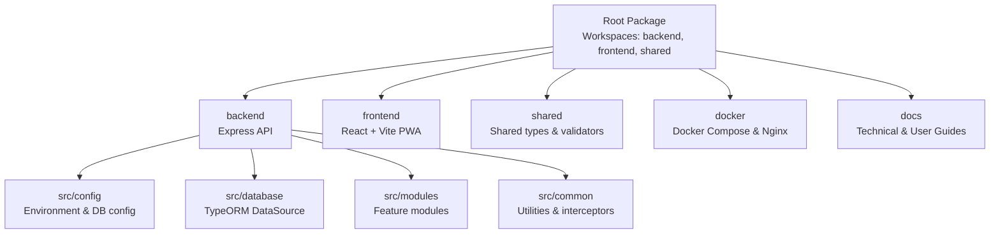
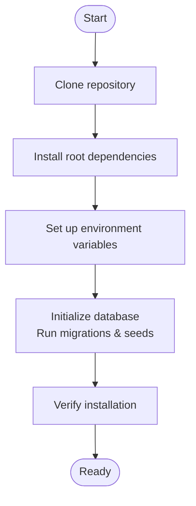
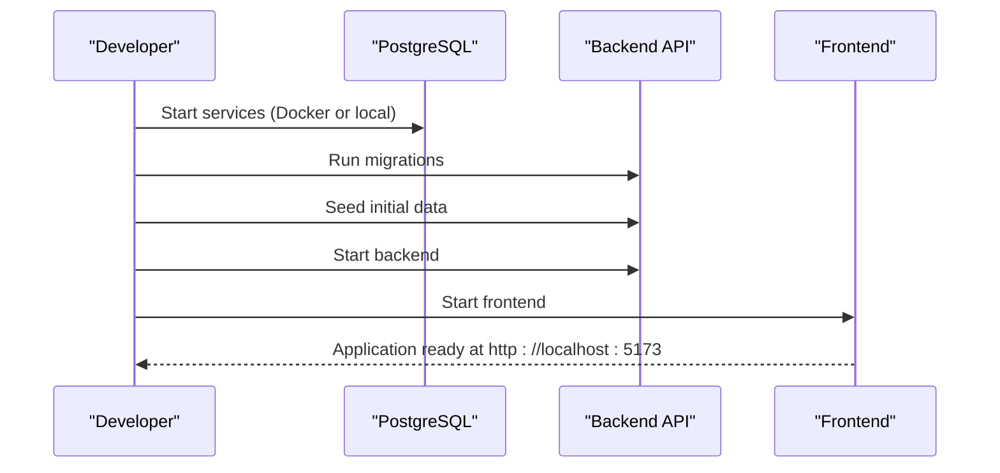

# Getting Started

<cite>
**Referenced Files in This Document**
- [README.md](file://README.md)
- [package.json](file://package.json)
- [backend/package.json](file://backend/package.json)
- [docker/docker-compose.yml](file://docker/docker-compose.yml)
- [docker/nginx.conf](file://docker/nginx.conf)
- [backend/src/config/env.config.ts](file://backend/src/config/env.config.ts)
- [backend/src/config/database.config.ts](file://backend/src/config/database.config.ts)
- [backend/src/database/data-source.ts](file://backend/src/database/data-source.ts)
- [backend/src/database/seeds/run-seeds.ts](file://backend/src/database/seeds/run-seeds.ts)
- [backend/src/index.ts](file://backend/src/index.ts)
- [.gitignore](file://.gitignore)
- [backend/tsconfig.json](file://backend/tsconfig.json)
</cite>

## Table of Contents
1. [Introduction](#introduction)
2. [Project Structure](#project-structure)
3. [System Requirements](#system-requirements)
4. [Prerequisites](#prerequisites)
5. [Installation](#installation)
6. [Initial Setup](#initial-setup)
7. [Running the Application](#running-the-application)
8. [Environment Variables](#environment-variables)
9. [Database Configuration](#database-configuration)
10. [First-Time Launch](#first-time-launch)
11. [Verification Steps](#verification-steps)
12. [Docker-Based Development](#docker-based-development)
13. [Local Development Environment](#local-development-environment)
14. [Common Setup Issues and Troubleshooting](#common-setup-issues-and-troubleshooting)
15. [Performance Considerations](#performance-considerations)
16. [Conclusion](#conclusion)

## Introduction
eLISAschool is a Progressive Web App (PWA) designed for school administration in Sub-Saharan Africa, with a modular backend built on Node.js, Express, TypeScript, and TypeORM, and a React + Vite frontend. It uses PostgreSQL with Row Level Security (RLS) and implements JWT-based authentication with AES-256 encryption and Role-Based Access Control (RBAC).

## Project Structure
The repository follows a monorepo layout with workspaces for backend, frontend, and shared packages:
- backend: Express.js API with TypeScript and TypeORM
- frontend: React + Vite PWA
- shared: Shared types and validators
- docker: Docker configuration and Nginx
- docs: Technical and user documentation



**Diagram sources**
- [package.json:8-12](file://package.json#L8-L12)
- [backend/src/config/env.config.ts:120-165](file://backend/src/config/env.config.ts#L120-L165)
- [backend/src/config/database.config.ts:15-51](file://backend/src/config/database.config.ts#L15-L51)

**Section sources**
- [README.md:18-27](file://README.md#L18-L27)
- [package.json:8-12](file://package.json#L8-L12)

## System Requirements
- Node.js: >= 20.0.0
- npm: >= 10.0.0
- Docker and Docker Compose (for Docker-based setup)
- PostgreSQL 16+ (for local development)
- Redis 7+ (for queues and synchronization)

**Section sources**
- [package.json:28-31](file://package.json#L28-L31)
- [docker/docker-compose.yml:10-11](file://docker/docker-compose.yml#L10-L11)
- [docker/docker-compose.yml:32-33](file://docker/docker-compose.yml#L32-L33)

## Prerequisites
- Git installed
- Node.js and npm installed locally (if not using Docker)
- Docker Desktop (if using Docker Compose)
- PostgreSQL client tools (psql) for database operations
- Basic understanding of:
  - Node.js and npm workspaces
  - Docker and Docker Compose
  - PostgreSQL basics
  - JWT and environment variables

**Section sources**
- [README.md:29-34](file://README.md#L29-L34)
- [backend/package.json:23-38](file://backend/package.json#L23-L38)

## Installation
Follow these steps to prepare your environment:

1. Clone the repository
2. Install root dependencies
3. Prepare environment variables
4. Initialize the database (migrations and seeds)



**Diagram sources**
- [README.md:7-16](file://README.md#L7-L16)
- [package.json:13-26](file://package.json#L13-L26)

**Section sources**
- [README.md:7-16](file://README.md#L7-L16)
- [package.json:13-26](file://package.json#L13-L26)

## Initial Setup
Before launching the application, configure environment variables and initialize the database.

Key setup tasks:
- Configure environment variables (.env)
- Run database migrations
- Seed initial data
- Build or start services

**Section sources**
- [backend/src/config/env.config.ts:68-112](file://backend/src/config/env.config.ts#L68-L112)
- [backend/src/config/database.config.ts:15-51](file://backend/src/config/database.config.ts#L15-L51)

## Running the Application
Choose one of the following approaches:

### Option A: Docker-Based Development
- Start all services with Docker Compose
- Access the frontend at http://localhost:5173
- API is served at http://localhost:3000/api

### Option B: Local Development
- Start backend and frontend separately
- Backend runs on port 3000
- Frontend runs on port 5173

**Section sources**
- [docker/docker-compose.yml:64-69](file://docker/docker-compose.yml#L64-L69)
- [docker/docker-compose.yml:88-95](file://docker/docker-compose.yml#L88-L95)
- [package.json:14-16](file://package.json#L14-L16)

## Environment Variables
The application validates environment variables using Zod. Required variables include:

- Application
  - NODE_ENV: development | production | test
  - APP_PORT: default 3000
  - APP_URL: default http://localhost:3000
  - FRONTEND_URL: default http://localhost:5173

- Database
  - DB_HOST: default localhost
  - DB_PORT: default 5432
  - DB_NAME: default elisaschool
  - DB_USER: default elisaschool_user
  - DB_PASSWORD: required

- JWT
  - JWT_SECRET: minimum 32 characters
  - JWT_EXPIRES_IN: default 7d
  - JWT_REFRESH_EXPIRES_IN: default 30d

- Encryption
  - ENCRYPTION_KEY: exactly 32 characters

- Redis
  - REDIS_HOST: default localhost
  - REDIS_PORT: default 6379
  - REDIS_PASSWORD: optional

- Email
  - SMTP_HOST: optional
  - SMTP_PORT: optional
  - SMTP_USER: optional
  - SMTP_PASSWORD: optional
  - SMTP_FROM: default noreply@elisaschool.cm

- Logging
  - LOG_LEVEL: error | warn | info | debug
  - LOG_FILE: default logs/app.log

Default values are applied in development mode if variables are missing.

**Section sources**
- [backend/src/config/env.config.ts:14-58](file://backend/src/config/env.config.ts#L14-L58)
- [backend/src/config/env.config.ts:75-112](file://backend/src/config/env.config.ts#L75-L112)

## Database Configuration
The backend uses TypeORM with PostgreSQL:

- TypeORM DataSource configured via environment variables
- Entities discovered automatically under src/modules/**/entities
- Migrations stored in src/database/migrations
- Subscribers in src/database/subscribers
- Synchronize enabled only in development
- SSL disabled by default (can be enabled in production)

Connection pooling and timeouts are configured based on environment.

**Section sources**
- [backend/src/config/database.config.ts:15-51](file://backend/src/config/database.config.ts#L15-L51)
- [backend/src/database/data-source.ts:17-37](file://backend/src/database/data-source.ts#L17-L37)

## First-Time Launch
Complete these steps for a fresh installation:

1. Set up environment variables (.env)
2. Start database services (PostgreSQL and Redis)
3. Run database migrations
4. Seed initial data
5. Start backend and frontend
6. Access the application



**Diagram sources**
- [docker/docker-compose.yml:10-29](file://docker/docker-compose.yml#L10-L29)
- [package.json:22-23](file://package.json#L22-L23)
- [backend/src/database/seeds/run-seeds.ts:15-31](file://backend/src/database/seeds/run-seeds.ts#L15-L31)

**Section sources**
- [package.json:22-23](file://package.json#L22-L23)
- [backend/src/database/seeds/run-seeds.ts:15-31](file://backend/src/database/seeds/run-seeds.ts#L15-L31)

## Verification Steps
After setup, verify the installation:

1. Backend health check
   - Endpoint: http://localhost:3000/api/health
   - Should return a healthy status

2. API documentation
   - Endpoint: http://localhost:3000/api/docs
   - Swagger/OpenAPI documentation should be available

3. Database connectivity
   - Check that migrations ran successfully
   - Verify seed data was inserted

4. Frontend accessibility
   - Open http://localhost:5173
   - Application should load without errors

5. Environment validation
   - Confirm environment variables are loaded correctly
   - Check logs for any validation warnings

**Section sources**
- [backend/src/index.ts:34-39](file://backend/src/index.ts#L34-L39)
- [backend/src/config/env.config.ts:68-112](file://backend/src/config/env.config.ts#L68-L112)

## Docker-Based Development
Use Docker Compose for a complete local environment:

1. Start services
   ```bash
   npm run docker:up
   ```

2. View logs
   ```bash
   npm run docker:logs
   ```

3. Stop services
   ```bash
   npm run docker:down
   ```

Docker Compose provisions:
- PostgreSQL 16 (with health checks)
- Redis 7
- Backend API (Express + TypeScript)
- Frontend (React + Vite)

Network and volume configurations persist data and enable inter-service communication.

**Section sources**
- [docker/docker-compose.yml:6-109](file://docker/docker-compose.yml#L6-L109)
- [package.json:24-26](file://package.json#L24-L26)

## Local Development Environment
For local development without Docker:

1. Install dependencies
   ```bash
   npm install
   ```

2. Start backend and frontend
   ```bash
   npm run dev
   ```

3. Or start components individually
   ```bash
   npm run dev:backend
   npm run dev:frontend
   ```

Ensure PostgreSQL and Redis are running locally or adjust environment variables accordingly.

**Section sources**
- [README.md:8-16](file://README.md#L8-L16)
- [package.json:14-16](file://package.json#L14-L16)
- [backend/package.json:9-21](file://backend/package.json#L9-L21)

## Common Setup Issues and Troubleshooting
- PostgreSQL connection refused
  - Ensure PostgreSQL is running
  - Verify DB_HOST, DB_PORT, DB_NAME, DB_USER, DB_PASSWORD
  - Check firewall and network settings

- JWT secret too short
  - Provide ENCRYPTION_KEY with exactly 32 characters
  - Provide JWT_SECRET with minimum 32 characters

- Migration failures
  - Run migrations again after fixing environment variables
  - Check database permissions

- Port conflicts
  - Change APP_PORT (backend) and FRONTEND_PORT (frontend) in .env
  - Ensure ports are free on the host

- Missing frontend workspace
  - The repository structure indicates a frontend workspace
  - If frontend directory is missing, ensure you have the complete repository

- Environment variable validation errors
  - Review Zod validation messages
  - Use defaults only in development mode

**Section sources**
- [backend/src/config/env.config.ts:29-58](file://backend/src/config/env.config.ts#L29-L58)
- [backend/src/config/env.config.ts:71-109](file://backend/src/config/env.config.ts#L71-L109)
- [docker/docker-compose.yml:14-19](file://docker/docker-compose.yml#L14-L19)

## Performance Considerations
- Use production environment for optimized performance
- Enable SSL for PostgreSQL connections in production
- Adjust connection pool sizes based on workload
- Monitor database and Redis health checks
- Use appropriate log levels for production

**Section sources**
- [backend/src/config/database.config.ts:39-50](file://backend/src/config/database.config.ts#L39-L50)
- [backend/src/config/env.config.ts:161-164](file://backend/src/config/env.config.ts#L161-L164)

## Conclusion
You now have the essential steps to set up eLISAschool locally or with Docker. Follow the environment variable configuration, run migrations and seeds, and verify the health endpoints. For persistent development, use Docker Compose for a reproducible environment, or run components locally for faster iteration. If issues arise, consult the troubleshooting section and validate environment variables against the Zod schema.