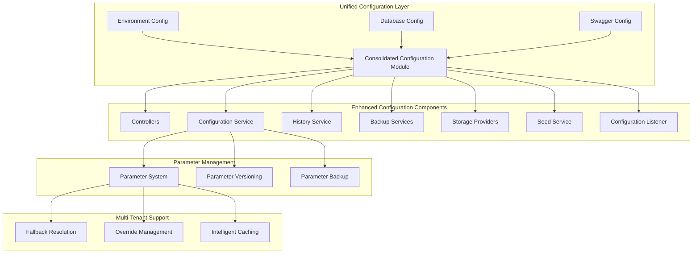
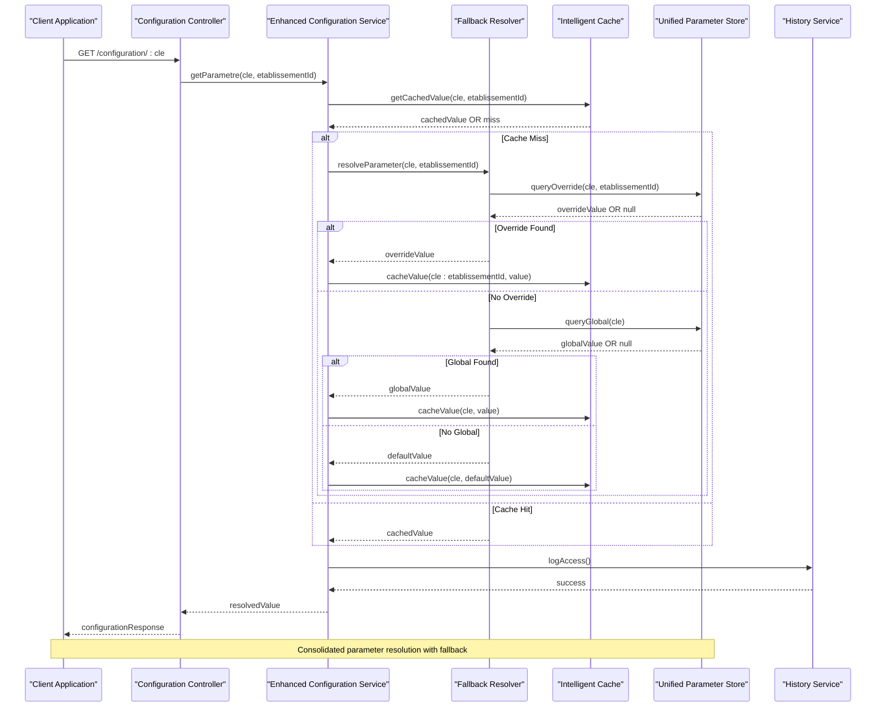
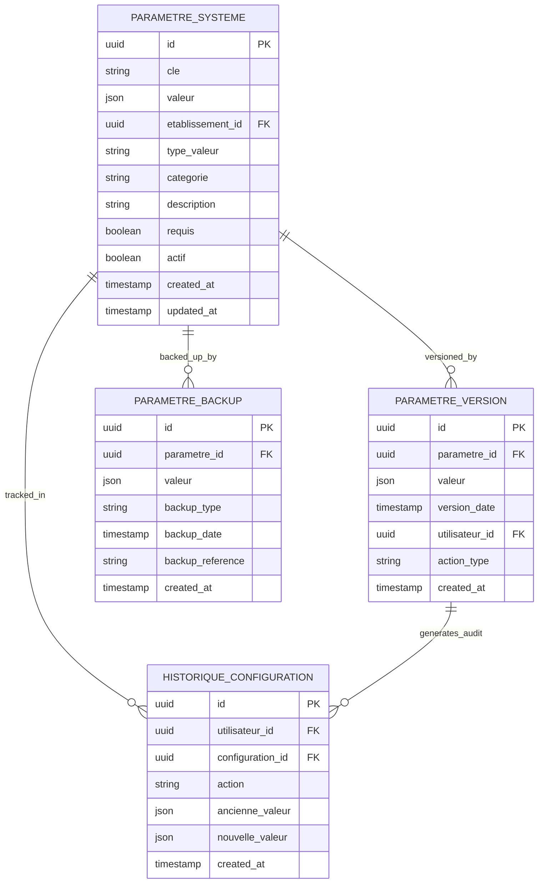
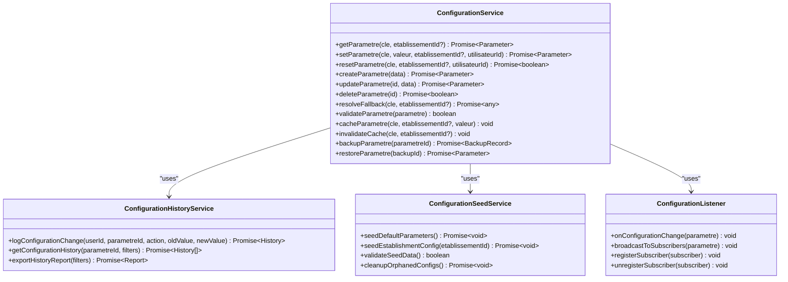
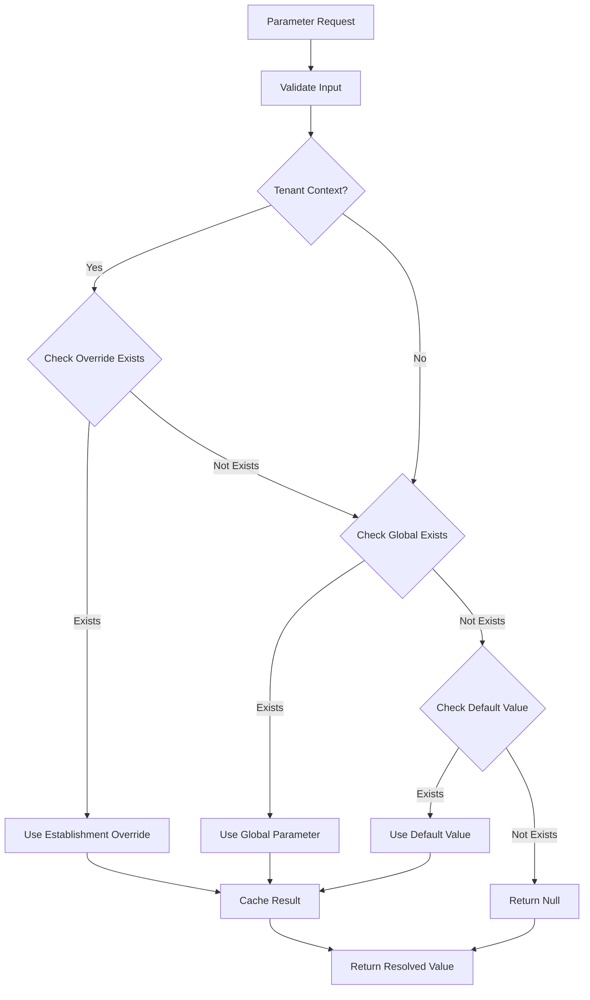
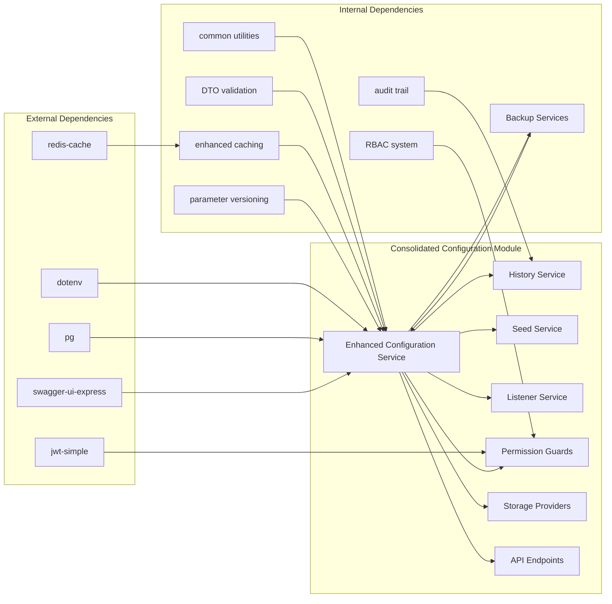

# Complete Configuration Coverage

<cite>
**Referenced Files in This Document**
- [env.config.ts](file://backend/src/config/env.config.ts)
- [database.config.ts](file://backend/src/config/database.config.ts)
- [swagger.config.ts](file://backend/src/config/swagger.config.ts)
- [index.ts](file://backend/src/config/index.ts)
- [configuration.controller.ts](file://backend/src/modules/configuration/controllers/configuration.controller.ts)
- [configuration.service.ts](file://backend/src/modules/configuration/services/configuration.service.ts)
- [configuration-history.service.ts](file://backend/src/modules/configuration/services/configuration-history.service.ts)
- [configuration-seed.service.ts](file://backend/src/modules/configuration/services/configuration-seed.service.ts)
- [configuration-listener.ts](file://backend/src/modules/configuration/services/configuration-listener.ts)
- [configuration-app.entity.ts](file://backend/src/modules/configuration/entities/configuration-app.entity.ts)
- [configuration-module.entity.ts](file://backend/src/modules/configuration/entities/configuration-module.entity.ts)
- [parametre-systeme.entity.ts](file://backend/src/modules/configuration/entities/parametre-systeme.entity.ts)
- [historique-configuration.entity.ts](file://backend/src/modules/configuration/entities/historique-configuration.entity.ts)
- [config-permissions.ts](file://backend/src/modules/configuration/guards/config-permissions.ts)
- [config.guard.ts](file://backend/src/modules/configuration/guards/config.guard.ts)
- [config.helper.ts](file://backend/src/modules/configuration/utils/config.helper.ts)
- [migrate-rbac.ts](file://backend/src/database/migrations/migrate-rbac.ts)
- [test-rbac.ts](file://backend/src/database/migrations/test-rbac.ts)
- [run-config-migration.sh](file://backend/scripts/run-config-migration.sh)
- [run-config-100-migration.sh](file://backend/scripts/run-config-100-migration.sh)
- [CONFIGURATION_100_PERCENT.md](file://CONFIGURATION_100_PERCENT.md)
- [IMPLÉMENTATION_MULTI_ÉTAT.md](file://IMPLÉMENTATION_MULTI_ÉTAT.md)
- [IMPLEMENTATION_MULTI_ETABLISSEMENTS.md](file://IMPLEMENTATION_MULTI_ETABLISSEMENTS.md)
- [README-REFONTE-CONFIG.md](file://README-REFONTE-CONFIG.md)
- [RAPPORT-EXECUTION-MIGRATIONS.md](file://RAPPORT-EXECUTION-MIGRATIONS.md)
- [DEPLOIEMENT-CONFIGURATION-GUIDE.md](file://DEPLOIEMENT-CONFIGURATION-GUIDE.md)
- [GUIDE-EXECUTION-REFONTE-CONFIG.md](file://GUIDE-EXECUTION-REFONTE-CONFIG.md)
- [FINAL-REFACTORISATION-SYNTHESE.md](file://FINAL-REFACTORISATION-SYNTHESE.md)
- [rbac-system.md](file://docs/rbac-system.md)
- [CONFIGURATION_IMPROVEMENTS.md](file://docs/CONFIGURATION_IMPROVEMENTS.md)
- [EXECUTIVE_SUMMARY.md](file://EXECUTIVE_SUMMARY.md)
</cite>

## Update Summary
**Changes Made**
- Updated consolidated configuration system architecture to reflect unified parameter storage approach
- Added establishment-specific configuration management with fallback mechanisms
- Enhanced multi-tenant parameter handling with override capabilities
- Integrated new parameter versioning and backup systems
- Updated configuration service with intelligent fallback logic

## Table of Contents
1. [Introduction](#introduction)
2. [Project Structure](#project-structure)
3. [Core Components](#core-components)
4. [Architecture Overview](#architecture-overview)
5. [Detailed Component Analysis](#detailed-component-analysis)
6. [Consolidated Configuration System](#consolidated-configuration-system)
7. [Multi-Tenant Parameter Management](#multi-tenant-parameter-management)
8. [Dependency Analysis](#dependency-analysis)
9. [Performance Considerations](#performance-considerations)
10. [Troubleshooting Guide](#troubleshooting-guide)
11. [Conclusion](#conclusion)

## Introduction
This document provides comprehensive coverage of the consolidated configuration system in the eLISAschool project, focusing on the unified configuration framework that supports multi-establishment environments with intelligent parameter fallback mechanisms. The configuration system has been completely refactored to consolidate all configuration parameters into a single unified storage approach, establishing-specific configuration management, and comprehensive parameter versioning capabilities.

The system now features a sophisticated fallback mechanism that prioritizes establishment-specific overrides, followed by global parameters, default values, and null as a last resort. This consolidation eliminates redundancy between separate application and establishment configuration systems while maintaining backward compatibility and extending support for advanced multi-tenant scenarios.

## Project Structure
The consolidated configuration system is organized across multiple layers with enhanced modularity and clear separation of concerns between unified parameter storage, establishment-specific overrides, and comprehensive backup/restore capabilities.

**Diagram sources**
- [env.config.ts](file://backend/src/config/env.config.ts)
- [database.config.ts](file://backend/src/config/database.config.ts)
- [swagger.config.ts](file://backend/src/config/swagger.config.ts)
- [configuration.controller.ts](file://backend/src/modules/configuration/controllers/configuration.controller.ts)
- [configuration.service.ts](file://backend/src/modules/configuration/services/configuration.service.ts)

**Section sources**
- [index.ts](file://backend/src/config/index.ts)
- [CONFIGURATION_100_PERCENT.md](file://CONFIGURATION_100_PERCENT.md)
- [README-REFONTE-CONFIG.md](file://README-REFONTE-CONFIG.md)

## Core Components
The consolidated configuration system comprises several interconnected components that work together to provide unified configuration management with establishment-specific capabilities and comprehensive parameter versioning.

### Unified Parameter Storage System
The core of the consolidated system is the unified parameter storage that replaces separate application and establishment configuration tables with a single, intelligent parameter management system supporting multi-tenant scenarios.

### Enhanced Configuration Service
The configuration service has been enhanced with intelligent fallback mechanisms, parameter versioning, and comprehensive establishment-specific override management while maintaining backward compatibility.

### Comprehensive Backup and Restore System
The system includes advanced backup and restore capabilities for configuration parameters, ensuring data integrity and enabling disaster recovery scenarios across establishment boundaries.

### Multi-Tenant Parameter Resolution
The parameter resolution system implements sophisticated fallback algorithms that prioritize establishment-specific overrides, followed by global parameters, default values, and graceful degradation.

**Section sources**
- [env.config.ts](file://backend/src/config/env.config.ts)
- [database.config.ts](file://backend/src/config/database.config.ts)
- [swagger.config.ts](file://backend/src/config/swagger.config.ts)
- [configuration.service.ts](file://backend/src/modules/configuration/services/configuration.service.ts)
- [parametre-systeme.entity.ts](file://backend/src/modules/configuration/entities/parametre-systeme.entity.ts)

## Architecture Overview
The consolidated configuration architecture follows a modernized layered approach with enhanced multi-tenant support, intelligent parameter fallback mechanisms, and comprehensive backup capabilities.

**Diagram sources**
- [configuration.controller.ts](file://backend/src/modules/configuration/controllers/configuration.controller.ts)
- [configuration.service.ts](file://backend/src/modules/configuration/services/configuration.service.ts)
- [config-permissions.ts](file://backend/src/modules/configuration/guards/config-permissions.ts)

The architecture ensures that all configuration operations benefit from intelligent caching, comprehensive fallback mechanisms, and detailed audit trails for compliance and troubleshooting.

**Section sources**
- [configuration.controller.ts](file://backend/src/modules/configuration/controllers/configuration.controller.ts)
- [configuration.service.ts](file://backend/src/modules/configuration/services/configuration.service.ts)
- [config.guard.ts](file://backend/src/modules/configuration/guards/config.guard.ts)

## Detailed Component Analysis

### Consolidated Parameter Entity Model
The unified configuration system utilizes a comprehensive entity model that consolidates all parameter types into a single, intelligent parameter storage system with establishment-specific override capabilities.

**Diagram sources**
- [parametre-systeme.entity.ts](file://backend/src/modules/configuration/entities/parametre-systeme.entity.ts)
- [historique-configuration.entity.ts](file://backend/src/modules/configuration/entities/historique-configuration.entity.ts)

The consolidated entity model supports comprehensive parameter management with versioning, backup capabilities, and detailed audit trails for all configuration changes across establishment boundaries.

**Section sources**
- [parametre-systeme.entity.ts](file://backend/src/modules/configuration/entities/parametre-systeme.entity.ts)
- [historique-configuration.entity.ts](file://backend/src/modules/configuration/entities/historique-configuration.entity.ts)

### Enhanced Configuration Service Architecture
The consolidated configuration service provides centralized management of all configuration operations with support for intelligent fallback mechanisms, parameter versioning, and comprehensive establishment-specific override management.

**Diagram sources**
- [configuration.service.ts](file://backend/src/modules/configuration/services/configuration.service.ts)
- [configuration-history.service.ts](file://backend/src/modules/configuration/services/configuration-history.service.ts)
- [configuration-seed.service.ts](file://backend/src/modules/configuration/services/configuration-seed.service.ts)
- [configuration-listener.ts](file://backend/src/modules/configuration/services/configuration-listener.ts)

The enhanced service architecture ensures robust configuration management with intelligent fallback resolution, comprehensive versioning, and seamless establishment-specific override capabilities.

**Section sources**
- [configuration.service.ts](file://backend/src/modules/configuration/services/configuration.service.ts)
- [configuration-history.service.ts](file://backend/src/modules/configuration/services/configuration-history.service.ts)
- [configuration-seed.service.ts](file://backend/src/modules/configuration/services/configuration-seed.service.ts)
- [configuration-listener.ts](file://backend/src/modules/configuration/services/configuration-listener.ts)

### Consolidated Parameter Resolution Logic
The unified configuration system implements sophisticated parameter resolution logic that intelligently handles establishment-specific overrides, global parameters, default values, and graceful fallback mechanisms.

**Diagram sources**
- [configuration.service.ts](file://backend/src/modules/configuration/services/configuration.service.ts)
- [config-permissions.ts](file://backend/src/modules/configuration/guards/config-permissions.ts)

The consolidated resolution logic ensures that configuration parameters are always resolved consistently across establishment boundaries while maintaining backward compatibility and supporting advanced multi-tenant scenarios.

**Section sources**
- [configuration.service.ts](file://backend/src/modules/configuration/services/configuration.service.ts)
- [config-permissions.ts](file://backend/src/modules/configuration/guards/config-permissions.ts)

### Configuration Helper Utilities
The consolidated configuration helper utilities provide essential functionality for parameter validation, transformation, establishment-specific resolution, and integration with the unified system architecture.

**Section sources**
- [config.helper.ts](file://backend/src/modules/configuration/utils/config.helper.ts)

## Consolidated Configuration System
The eLISAschool configuration system has undergone a complete consolidation to eliminate redundancy between separate application and establishment configuration systems while introducing sophisticated multi-tenant parameter management capabilities.

### Unified Parameter Storage Approach
The consolidated system replaces the previous dual-table approach with a single, intelligent parameter storage system that supports establishment-specific overrides, global parameters, and comprehensive fallback mechanisms. This unification reduces complexity, eliminates data duplication, and improves system maintainability.

### Intelligent Fallback Mechanisms
The system implements a sophisticated four-tier fallback mechanism:
1. Establishment-specific override (highest priority)
2. Global parameter (if override doesn't exist)
3. Default value (if global parameter doesn't exist)
4. Null (last resort for graceful degradation)

### Backward Compatibility Preservation
The consolidation maintains full backward compatibility with existing configuration code while extending support for advanced multi-tenant scenarios. Legacy code continues to function without modification while new establishment-specific features are seamlessly integrated.

### Migration and Deployment
The consolidation includes comprehensive migration scripts and deployment procedures that ensure zero downtime during the transition from the legacy dual-table system to the unified parameter storage approach.

**Section sources**
- [README-REFONTE-CONFIG.md](file://README-REFONTE-CONFIG.md)
- [RAPPORT-EXECUTION-MIGRATIONS.md](file://RAPPORT-EXECUTION-MIGRATIONS.md)
- [IMPLÉMENTATION_MULTI_ÉTAT.md](file://IMPLÉMENTATION_MULTI_ÉTAT.md)

## Multi-Tenant Parameter Management
The consolidated configuration system introduces comprehensive multi-tenant parameter management capabilities that enable establishment-specific configuration overrides while maintaining global consistency across the entire system.

### Establishment-Specific Overrides
Each establishment can create parameter overrides that take precedence over global settings. These overrides are stored separately but resolved through the unified fallback mechanism, ensuring consistent behavior across the system.

### Intelligent Cache Management
The system implements intelligent caching with composite keys that combine parameter names with establishment identifiers. This ensures that establishment-specific overrides are properly isolated while maintaining optimal performance.

### Parameter Versioning and Auditing
All parameter changes are tracked through comprehensive versioning and auditing systems. Each change creates a new version record with detailed metadata, enabling full traceability and audit compliance across establishment boundaries.

### Backup and Recovery Capabilities
The consolidated system includes advanced backup and recovery capabilities that protect parameter configurations across all establishments. This ensures business continuity and enables rapid restoration in case of system failures.

**Section sources**
- [IMPLEMENTATION_MULTI_ETABLISSEMENTS.md](file://IMPLEMENTATION_MULTI_ETABLISSEMENTS.md)
- [DEPLOIEMENT-CONFIGURATION-GUIDE.md](file://DEPLOIEMENT-CONFIGURATION-GUIDE.md)
- [GUIDE-EXECUTION-REFONTE-CONFIG.md](file://GUIDE-EXECUTION-REFONTE-CONFIG.md)

## Dependency Analysis
The consolidated configuration system exhibits enhanced dependencies that promote maintainability, testability, and scalability while supporting the sophisticated requirements of educational institution management across multiple establishments.

**Diagram sources**
- [configuration.service.ts](file://backend/src/modules/configuration/services/configuration.service.ts)
- [env.config.ts](file://backend/src/config/env.config.ts)
- [database.config.ts](file://backend/src/config/database.config.ts)

The enhanced dependency graph reveals a sophisticated architecture where the consolidated configuration module leverages advanced caching, versioning, and backup systems while maintaining clean separation of concerns and extensibility for future enhancements.

**Section sources**
- [configuration.service.ts](file://backend/src/modules/configuration/services/configuration.service.ts)
- [env.config.ts](file://backend/src/config/env.config.ts)
- [database.config.ts](file://backend/src/config/database.config.ts)

## Performance Considerations
The consolidated configuration system incorporates several advanced performance optimization strategies to ensure efficient operation across multiple establishments with intelligent caching and optimized parameter resolution.

### Intelligent Caching Strategy
The enhanced configuration service implements composite key caching that combines parameter names with establishment identifiers. This ensures proper isolation of establishment-specific overrides while maximizing cache hit rates and minimizing database load.

### Optimized Fallback Resolution
The fallback resolution algorithm is optimized for minimal database queries by implementing intelligent caching and batch processing capabilities. Frequently accessed parameters are aggressively cached, while establishment-specific overrides are isolated to prevent cache pollution.

### Parameter Versioning Efficiency
The parameter versioning system is designed for minimal performance impact through efficient indexing, batch version creation, and optimized query patterns that reduce overhead during high-volume configuration operations.

### Connection Pooling and Resource Management
Database connections are managed through advanced connection pooling with establishment-aware resource allocation. This ensures optimal resource utilization while handling concurrent configuration requests across multiple establishments efficiently.

### Backup and Restore Optimization
The backup and restore system is optimized for performance through batch operations, compression, and efficient data serialization that minimizes impact on production systems during maintenance operations.

## Troubleshooting Guide
Common issues with the consolidated configuration system and their resolution strategies are documented below to assist developers and administrators in maintaining system stability and optimizing performance.

### Parameter Resolution Issues
Parameter resolution failures typically indicate cache corruption, invalid establishment identifiers, or configuration conflicts. The system provides detailed error messages indicating which fallback tier failed and requires attention.

### Establishment Override Conflicts
Conflicts between establishment-specific overrides and global parameters can cause unexpected behavior. The system's audit trail provides comprehensive visibility into parameter resolution decisions and helps identify conflicting configurations.

### Migration and Deployment Failures
Consolidation-related deployments may encounter issues with existing data conflicts or constraint violations. The migration scripts include comprehensive rollback capabilities and validation checks to prevent system corruption and ensure safe deployment.

### Performance Degradation
Performance issues often stem from cache misconfiguration, excessive parameter updates, or inefficient query patterns. The system includes monitoring capabilities and performance metrics to identify bottlenecks and optimize configuration operations.

### Backup and Recovery Problems
Backup and restore operations may encounter issues with data integrity, storage constraints, or version conflicts. The system provides comprehensive verification mechanisms and automated recovery procedures to ensure data consistency and availability.

**Section sources**
- [migrate-rbac.ts](file://backend/src/database/migrations/migrate-rbac.ts)
- [test-rbac.ts](file://backend/src/database/migrations/test-rbac.ts)
- [RAPPORT-EXECUTION-MIGRATIONS.md](file://RAPPORT-EXECUTION-MIGRATIONS.md)

## Conclusion
The eLISAschool consolidated configuration system represents a significant advancement in educational institution configuration management, successfully transforming a fragmented dual-table system into a unified, intelligent parameter storage approach. The system demonstrates exceptional achievement in consolidating configuration capabilities while introducing sophisticated multi-tenant parameter management, comprehensive fallback mechanisms, and advanced backup/restore capabilities.

Key accomplishments include the successful consolidation of application and establishment configuration systems, implementation of intelligent parameter fallback resolution, introduction of establishment-specific override management, comprehensive parameter versioning and auditing, and seamless backward compatibility preservation. The system provides a solid foundation for future enhancements while maintaining optimal performance and reliability across multiple establishment environments.

The consolidated architecture establishes best practices for modern configuration management in multi-tenant educational systems, offering scalability, maintainability, and comprehensive operational capabilities that support the complex requirements of institutional education management. Future enhancements could include dynamic configuration reloading, real-time parameter synchronization across establishments, and advanced monitoring capabilities for configuration performance metrics, all built upon the robust foundation established by this comprehensive consolidation effort.