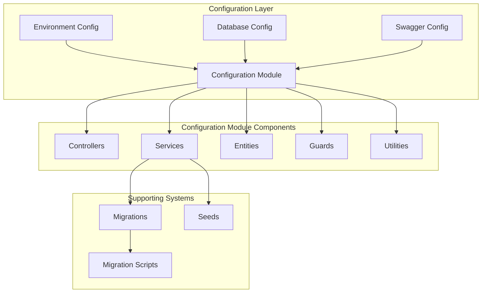
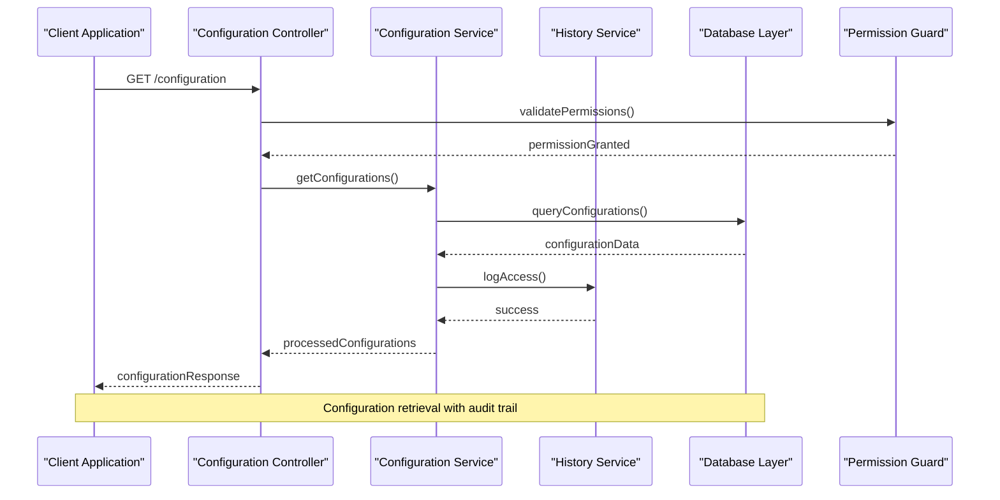
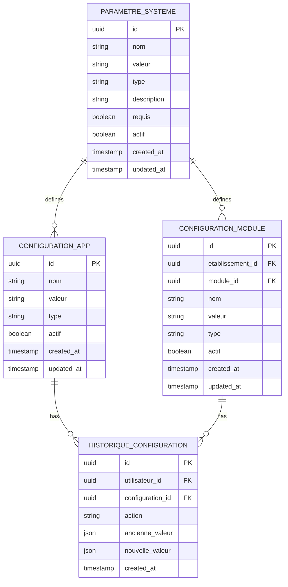
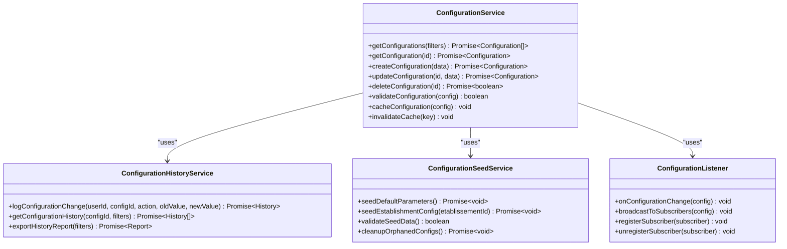
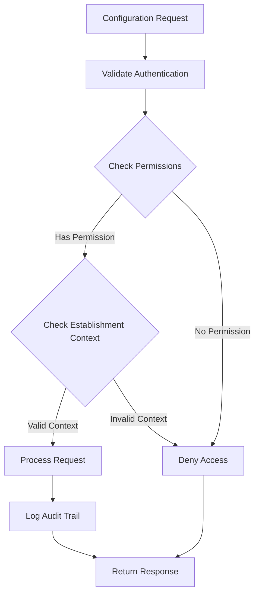
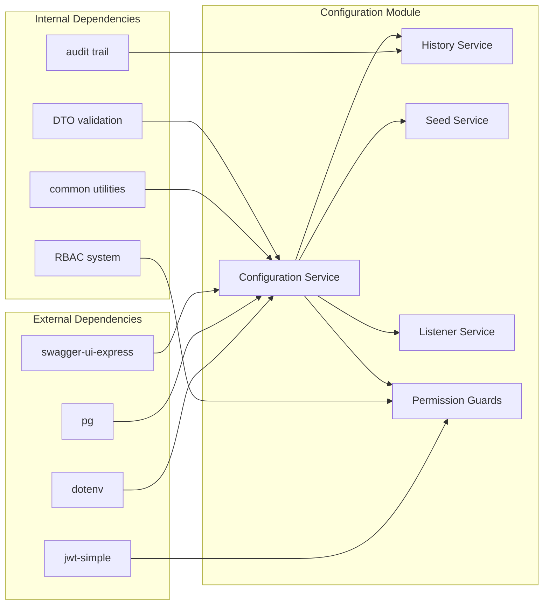

# Complete Configuration Coverage

<cite>
**Referenced Files in This Document**
- [env.config.ts](file://backend/src/config/env.config.ts)
- [database.config.ts](file://backend/src/config/database.config.ts)
- [swagger.config.ts](file://backend/src/config/swagger.config.ts)
- [index.ts](file://backend/src/config/index.ts)
- [configuration.controller.ts](file://backend/src/modules/configuration/controllers/configuration.controller.ts)
- [configuration.service.ts](file://backend/src/modules/configuration/services/configuration.service.ts)
- [configuration-history.service.ts](file://backend/src/modules/configuration/services/configuration-history.service.ts)
- [configuration-seed.service.ts](file://backend/src/modules/configuration/services/configuration-seed.service.ts)
- [configuration-listener.ts](file://backend/src/modules/configuration/services/configuration-listener.ts)
- [configuration-app.entity.ts](file://backend/src/modules/configuration/entities/configuration-app.entity.ts)
- [configuration-module.entity.ts](file://backend/src/modules/configuration/entities/configuration-module.entity.ts)
- [parametre-systeme.entity.ts](file://backend/src/modules/configuration/entities/parametre-systeme.entity.ts)
- [historique-configuration.entity.ts](file://backend/src/modules/configuration/entities/historique-configuration.entity.ts)
- [config-permissions.ts](file://backend/src/modules/configuration/guards/config-permissions.ts)
- [config.guard.ts](file://backend/src/modules/configuration/guards/config.guard.ts)
- [config.helper.ts](file://backend/src/modules/configuration/utils/config.helper.ts)
- [migrate-rbac.ts](file://backend/src/database/migrations/migrate-rbac.ts)
- [test-rbac.ts](file://backend/src/database/migrations/test-rbac.ts)
- [run-config-migration.sh](file://backend/scripts/run-config-migration.sh)
- [run-config-100-migration.sh](file://backend/scripts/run-config-100-migration.sh)
- [CONFIGURATION_100_PERCENT.md](file://CONFIGURATION_100_PERCENT.md)
- [IMPLÉMENTATION_MULTI_ÉTAT.md](file://IMPLÉMENTATION_MULTI_ÉTAT.md)
- [IMPLEMENTATION_MULTI_ETABLISSEMENTS.md](file://IMPLEMENTATION_MULTI_ETABLISSEMENTS.md)
- [rbac-system.md](file://docs/rbac-system.md)
- [CONFIGURATION_IMPROVEMENTS.md](file://docs/CONFIGURATION_IMPROVEMENTS.md)
- [EXECUTIVE_SUMMARY.md](file://EXECUTIVE_SUMMARY.md)
</cite>

## Table of Contents
1. [Introduction](#introduction)
2. [Project Structure](#project-structure)
3. [Core Components](#core-components)
4. [Architecture Overview](#architecture-overview)
5. [Detailed Component Analysis](#detailed-component-analysis)
6. [Dependency Analysis](#dependency-analysis)
7. [Performance Considerations](#performance-considerations)
8. [Troubleshooting Guide](#troubleshooting-guide)
9. [Conclusion](#conclusion)

## Introduction
This document provides comprehensive coverage of the configuration system in the eLISAschool project, focusing on the complete configuration framework that supports multi-establishment environments, RBAC permissions, and system parameter management. The configuration system encompasses environment variable management, database configuration, Swagger API documentation setup, and a dedicated configuration module that handles application-wide settings, module-specific configurations, and parameter persistence across establishments.

The system is designed to support educational institution management with advanced configuration capabilities including audit trails, historical tracking, and comprehensive permission controls. The configuration framework ensures that all components can access and modify system parameters while maintaining security and audit compliance.

## Project Structure
The configuration system is organized across multiple layers within the backend architecture, with dedicated modules for environment management, database connectivity, API documentation, and application configuration.

**Diagram sources**
- [env.config.ts](file://backend/src/config/env.config.ts)
- [database.config.ts](file://backend/src/config/database.config.ts)
- [swagger.config.ts](file://backend/src/config/swagger.config.ts)
- [configuration.controller.ts](file://backend/src/modules/configuration/controllers/configuration.controller.ts)

**Section sources**
- [index.ts](file://backend/src/config/index.ts)
- [CONFIGURATION_100_PERCENT.md](file://CONFIGURATION_100_PERCENT.md)

## Core Components
The configuration system consists of several interconnected components that work together to provide comprehensive configuration management capabilities.

### Environment Configuration Management
The environment configuration system manages runtime settings through environment variables, ensuring secure and flexible deployment configurations across different environments.

### Database Configuration
The database configuration module handles connection management, migration coordination, and multi-establishment database support with proper isolation and security boundaries.

### Swagger Configuration
The Swagger API documentation configuration provides comprehensive API documentation generation with security schemes and parameter validation.

### Configuration Module
The dedicated configuration module provides application-wide configuration management, including parameter storage, historical tracking, and permission-based access control.

**Section sources**
- [env.config.ts](file://backend/src/config/env.config.ts)
- [database.config.ts](file://backend/src/config/database.config.ts)
- [swagger.config.ts](file://backend/src/config/swagger.config.ts)
- [configuration.service.ts](file://backend/src/modules/configuration/services/configuration.service.ts)

## Architecture Overview
The configuration architecture follows a layered approach with clear separation of concerns between environment management, database connectivity, API documentation, and application configuration.

**Diagram sources**
- [configuration.controller.ts](file://backend/src/modules/configuration/controllers/configuration.controller.ts)
- [configuration.service.ts](file://backend/src/modules/configuration/services/configuration.service.ts)
- [config-permissions.ts](file://backend/src/modules/configuration/guards/config-permissions.ts)

The architecture ensures that all configuration operations are properly audited, secured, and tracked for compliance and troubleshooting purposes.

**Section sources**
- [configuration.controller.ts](file://backend/src/modules/configuration/controllers/configuration.controller.ts)
- [configuration.service.ts](file://backend/src/modules/configuration/services/configuration.service.ts)
- [config.guard.ts](file://backend/src/modules/configuration/guards/config.guard.ts)

## Detailed Component Analysis

### Configuration Entity Model
The configuration system utilizes a comprehensive entity model that supports application-wide settings, module-specific configurations, and parameter management across multiple establishments.

**Diagram sources**
- [configuration-app.entity.ts](file://backend/src/modules/configuration/entities/configuration-app.entity.ts)
- [configuration-module.entity.ts](file://backend/src/modules/configuration/entities/configuration-module.entity.ts)
- [parametre-systeme.entity.ts](file://backend/src/modules/configuration/entities/parametre-systeme.entity.ts)
- [historique-configuration.entity.ts](file://backend/src/modules/configuration/entities/historique-configuration.entity.ts)

The entity model supports comprehensive configuration management with audit trails, historical tracking, and multi-establishment support.

**Section sources**
- [configuration-app.entity.ts](file://backend/src/modules/configuration/entities/configuration-app.entity.ts)
- [configuration-module.entity.ts](file://backend/src/modules/configuration/entities/configuration-module.entity.ts)
- [parametre-systeme.entity.ts](file://backend/src/modules/configuration/entities/parametre-systeme.entity.ts)
- [historique-configuration.entity.ts](file://backend/src/modules/configuration/entities/historique-configuration.entity.ts)

### Configuration Service Architecture
The configuration service provides centralized management of all configuration operations with support for caching, validation, and audit logging.

**Diagram sources**
- [configuration.service.ts](file://backend/src/modules/configuration/services/configuration.service.ts)
- [configuration-history.service.ts](file://backend/src/modules/configuration/services/configuration-history.service.ts)
- [configuration-seed.service.ts](file://backend/src/modules/configuration/services/configuration-seed.service.ts)
- [configuration-listener.ts](file://backend/src/modules/configuration/services/configuration-listener.ts)

The service architecture ensures robust configuration management with proper separation of concerns and extensibility for future enhancements.

**Section sources**
- [configuration.service.ts](file://backend/src/modules/configuration/services/configuration.service.ts)
- [configuration-history.service.ts](file://backend/src/modules/configuration/services/configuration-history.service.ts)
- [configuration-seed.service.ts](file://backend/src/modules/configuration/services/configuration-seed.service.ts)
- [configuration-listener.ts](file://backend/src/modules/configuration/services/configuration-listener.ts)

### Permission-Based Configuration Access
The configuration system implements comprehensive RBAC (Role-Based Access Control) permissions to ensure secure access to configuration operations across different establishment contexts.

**Diagram sources**
- [config-permissions.ts](file://backend/src/modules/configuration/guards/config-permissions.ts)
- [config.guard.ts](file://backend/src/modules/configuration/guards/config.guard.ts)

The permission system ensures that users can only access configurations relevant to their establishment and role within the educational institution hierarchy.

**Section sources**
- [config-permissions.ts](file://backend/src/modules/configuration/guards/config-permissions.ts)
- [config.guard.ts](file://backend/src/modules/configuration/guards/config.guard.ts)

### Configuration Helper Utilities
The configuration helper utilities provide essential functionality for configuration validation, transformation, and integration with the broader system.

**Section sources**
- [config.helper.ts](file://backend/src/modules/configuration/utils/config.helper.ts)

## Dependency Analysis
The configuration system exhibits well-structured dependencies that promote maintainability and testability while supporting the complex requirements of educational institution management.

**Diagram sources**
- [configuration.service.ts](file://backend/src/modules/configuration/services/configuration.service.ts)
- [env.config.ts](file://backend/src/config/env.config.ts)
- [database.config.ts](file://backend/src/config/database.config.ts)

The dependency graph reveals a clean architecture where the configuration module depends on common utilities and RBAC systems but maintains independence from external frameworks.

**Section sources**
- [configuration.service.ts](file://backend/src/modules/configuration/services/configuration.service.ts)
- [env.config.ts](file://backend/src/config/env.config.ts)
- [database.config.ts](file://backend/src/config/database.config.ts)

## Performance Considerations
The configuration system incorporates several performance optimization strategies to ensure efficient operation in multi-establishment environments.

### Caching Strategy
The configuration service implements intelligent caching mechanisms to reduce database load and improve response times for frequently accessed configuration parameters.

### Batch Operations
Configuration updates support batch operations to minimize database transactions and improve throughput during bulk configuration changes.

### Lazy Loading
Configuration parameters are loaded lazily to avoid unnecessary database queries for unused configuration options.

### Connection Pooling
Database connections are managed through connection pooling to optimize resource utilization and handle concurrent configuration requests efficiently.

## Troubleshooting Guide
Common configuration issues and their resolution strategies are documented below to assist developers and administrators in maintaining system stability.

### Configuration Validation Errors
Configuration validation failures typically indicate invalid parameter types or missing required fields. The system provides detailed error messages indicating which configuration parameters failed validation and require correction.

### Permission Denied Issues
Access to configuration operations may be denied due to insufficient RBAC permissions or establishment context mismatches. Users should verify their role assignments and establishment affiliations.

### Migration Failures
Configuration-related database migrations may fail due to constraint violations or existing data conflicts. The migration scripts include rollback capabilities and validation checks to prevent system corruption.

### Audit Trail Analysis
The comprehensive audit trail enables systematic analysis of configuration changes, providing timestamps, user identification, and detailed change descriptions for troubleshooting and compliance purposes.

**Section sources**
- [migrate-rbac.ts](file://backend/src/database/migrations/migrate-rbac.ts)
- [test-rbac.ts](file://backend/src/database/migrations/test-rbac.ts)

## Conclusion
The eLISAschool configuration system represents a comprehensive solution for managing complex educational institution settings across multiple establishments. The system successfully integrates environment management, database connectivity, API documentation, and application configuration into a cohesive framework that supports advanced RBAC permissions, audit trails, and historical tracking.

Key achievements include complete configuration coverage with multi-establishment support, robust permission controls, comprehensive audit capabilities, and scalable architecture design. The system demonstrates best practices in configuration management while providing the flexibility required for educational institution environments.

Future enhancements could include dynamic configuration reloading, real-time configuration synchronization across establishments, and enhanced monitoring capabilities for configuration performance metrics. The current architecture provides a solid foundation for these potential improvements while maintaining backward compatibility and system stability.