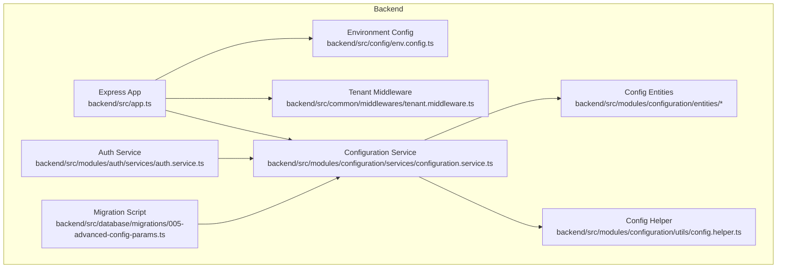
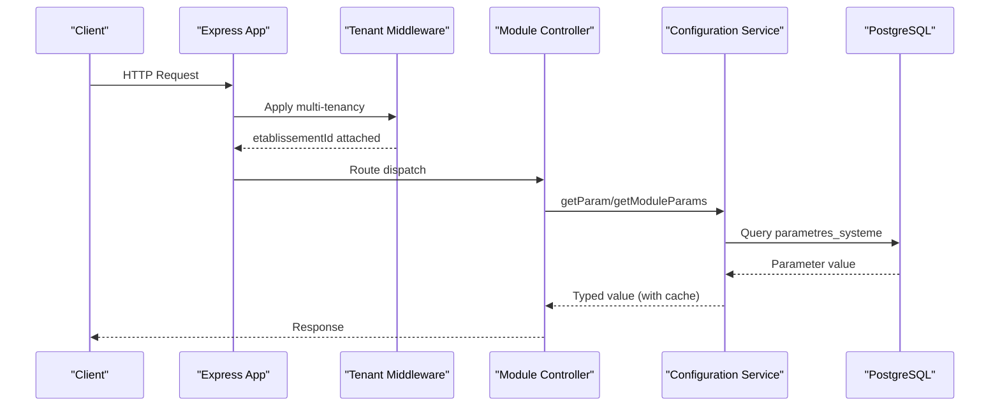
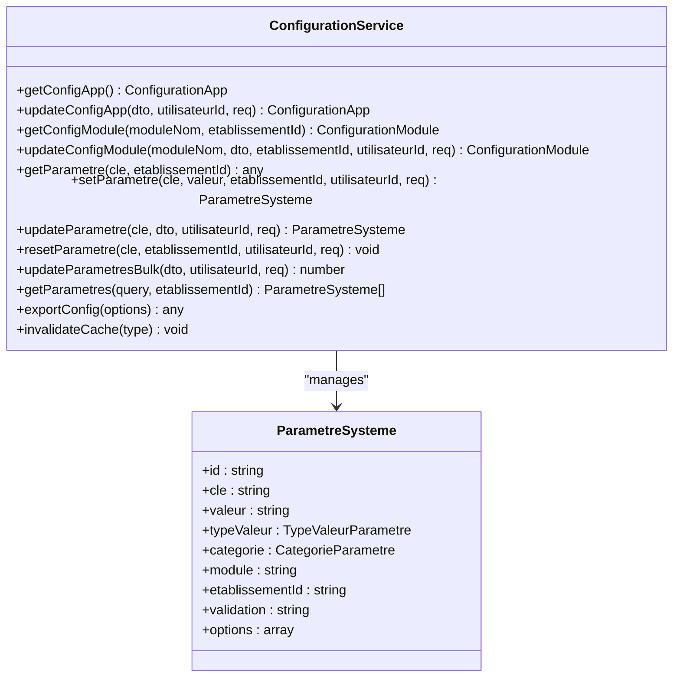
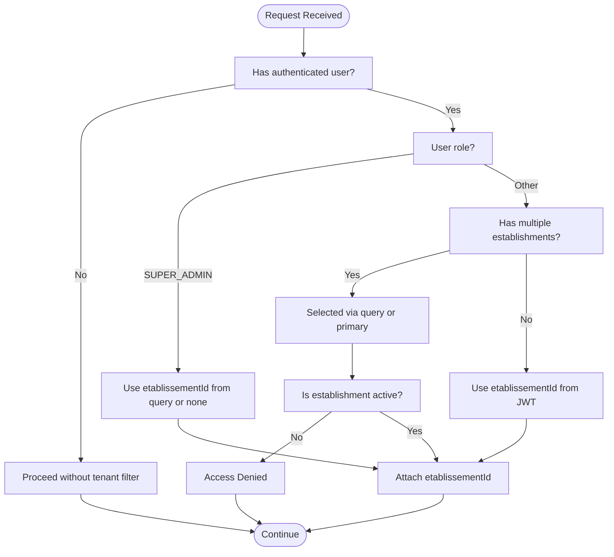
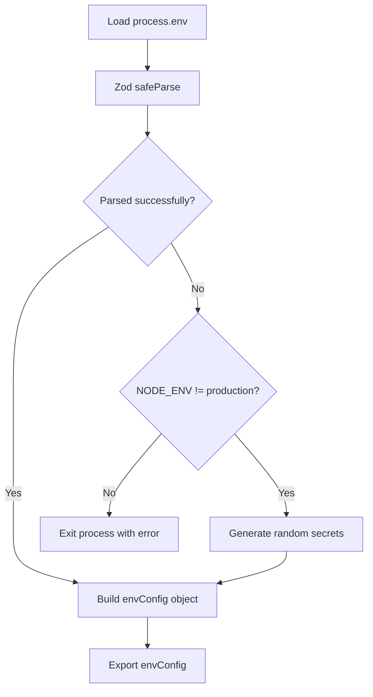
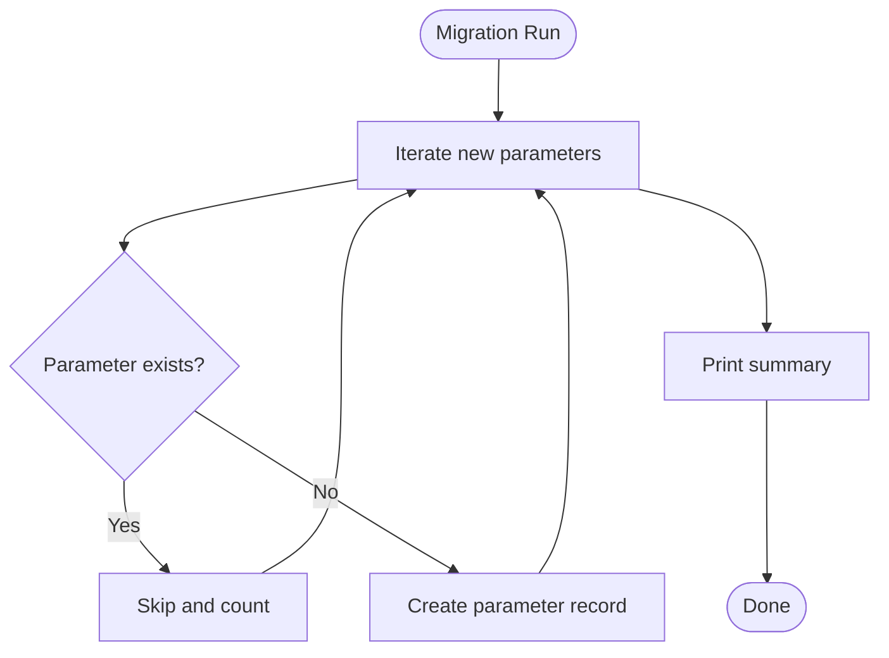
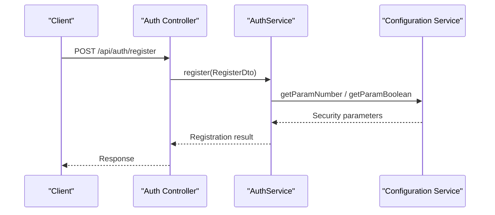
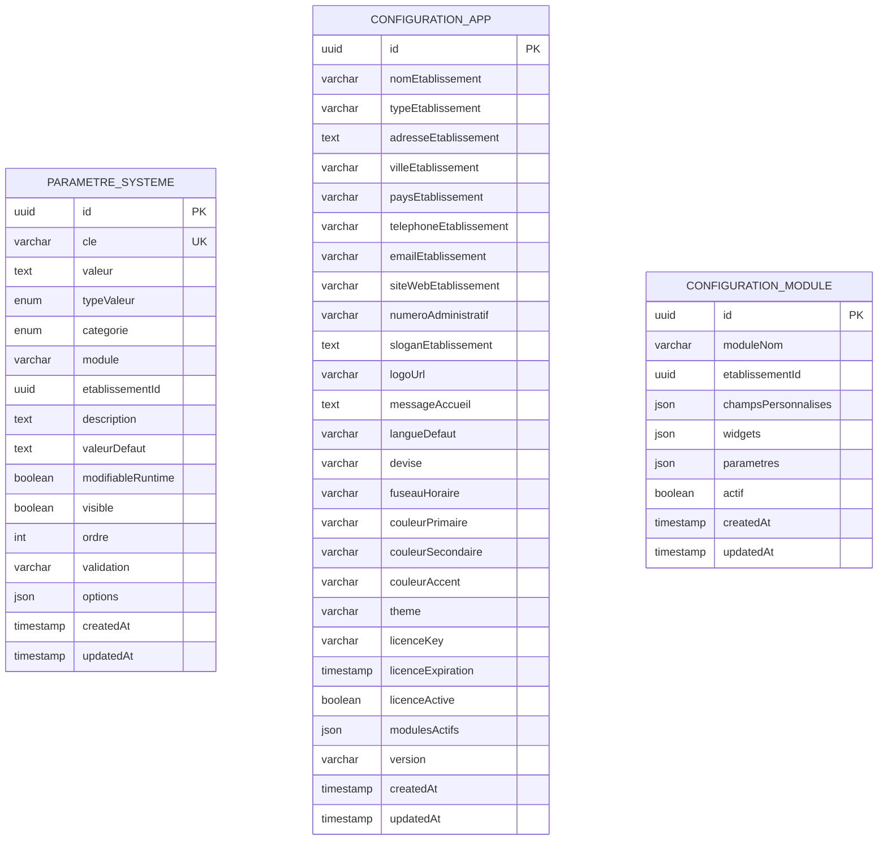
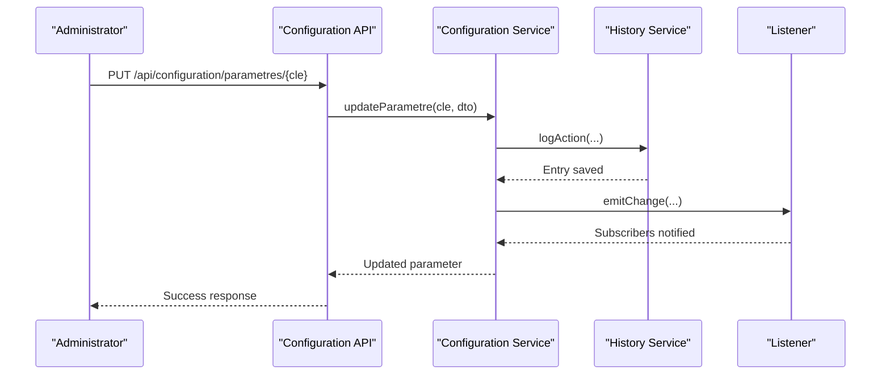
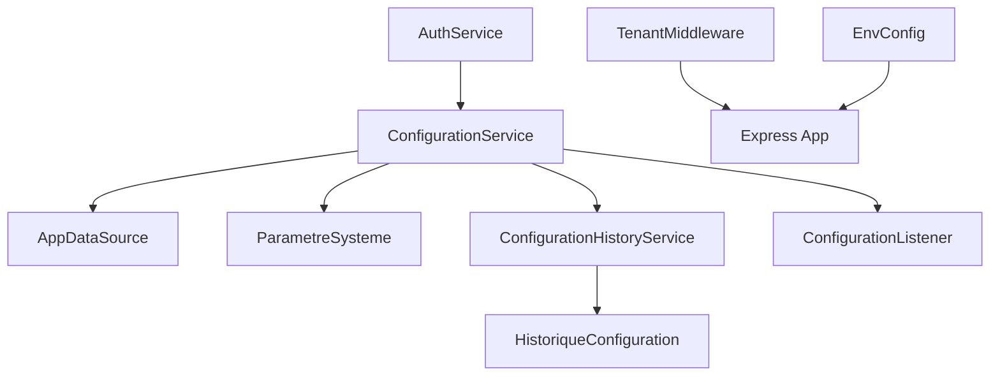

# Executive Summary

<cite>
**Referenced Files in This Document**
- [EXECUTIVE_SUMMARY.md](file://EXECUTIVE_SUMMARY.md)
- [README.md](file://README.md)
- [backend/src/app.ts](file://backend/src/app.ts)
- [backend/package.json](file://backend/package.json)
- [shared/package.json](file://shared/package.json)
- [backend/src/config/env.config.ts](file://backend/src/config/env.config.ts)
- [backend/src/modules/configuration/README.md](file://backend/src/modules/configuration/README.md)
- [backend/src/modules/configuration/services/configuration.service.ts](file://backend/src/modules/configuration/services/configuration.service.ts)
- [backend/src/common/middlewares/tenant.middleware.ts](file://backend/src/common/middlewares/tenant.middleware.ts)
- [backend/src/modules/auth/services/auth.service.ts](file://backend/src/modules/auth/services/auth.service.ts)
- [backend/src/database/migrations/005-advanced-config-params.ts](file://backend/src/database/migrations/005-advanced-config-params.ts)
- [backend/src/modules/configuration/entities/parametre-systeme.entity.ts](file://backend/src/modules/configuration/entities/parametre-systeme.entity.ts)
- [backend/src/modules/configuration/utils/config.helper.ts](file://backend/src/modules/configuration/utils/config.helper.ts)
- [backend/src/modules/configuration/entities/configuration-app.entity.ts](file://backend/src/modules/configuration/entities/configuration-app.entity.ts)
- [backend/src/modules/configuration/entities/configuration-module.entity.ts](file://backend/src/modules/configuration/entities/configuration-module.entity.ts)
- [backend/src/modules/configuration/services/configuration-history.service.ts](file://backend/src/modules/configuration/services/configuration-history.service.ts)
- [backend/src/modules/configuration/services/configuration-listener.ts](file://backend/src/modules/configuration/services/configuration-listener.ts)
</cite>

## Table of Contents
1. [Introduction](#introduction)
2. [Project Structure](#project-structure)
3. [Core Components](#core-components)
4. [Architecture Overview](#architecture-overview)
5. [Detailed Component Analysis](#detailed-component-analysis)
6. [Dependency Analysis](#dependency-analysis)
7. [Performance Considerations](#performance-considerations)
8. [Troubleshooting Guide](#troubleshooting-guide)
9. [Conclusion](#conclusion)
10. [Appendices](#appendices)

## Introduction
This document presents an executive summary of the eLISAschool project’s recent improvements to its configuration system, focusing on enhanced reliability, security, and operational flexibility. The work encompasses critical bug fixes, automated parameter validation, dynamic development secrets, and the addition of 30+ new configuration parameters across modules such as Authentication, Students, Bulletins, Canteen, Transport, Cards, Messaging, Gamification, and System settings. The initiative achieves near-complete coverage of configurable parameters, robust audit trails, and streamlined administration via a dedicated guide and migration tooling.

## Project Structure
The eLISAschool backend is a modular Express.js application written in TypeScript, leveraging PostgreSQL with TypeORM. It supports multi-tenancy across educational institutions, integrates comprehensive RBAC, and provides standardized APIs with Swagger documentation. The configuration system sits at the heart of operational control, enabling administrators to manage application behavior without redeployment.

**Diagram sources**
- [backend/src/app.ts:1-226](file://backend/src/app.ts#L1-L226)
- [backend/src/config/env.config.ts:1-176](file://backend/src/config/env.config.ts#L1-L176)
- [backend/src/modules/configuration/services/configuration.service.ts:1-868](file://backend/src/modules/configuration/services/configuration.service.ts#L1-L868)
- [backend/src/common/middlewares/tenant.middleware.ts:1-132](file://backend/src/common/middlewares/tenant.middleware.ts#L1-L132)
- [backend/src/modules/auth/services/auth.service.ts:1-533](file://backend/src/modules/auth/services/auth.service.ts#L1-L533)
- [backend/src/modules/configuration/entities/parametre-systeme.entity.ts:1-131](file://backend/src/modules/configuration/entities/parametre-systeme.entity.ts#L1-L131)
- [backend/src/modules/configuration/utils/config.helper.ts:1-131](file://backend/src/modules/configuration/utils/config.helper.ts#L1-L131)
- [backend/src/database/migrations/005-advanced-config-params.ts:1-335](file://backend/src/database/migrations/005-advanced-config-params.ts#L1-L335)

**Section sources**
- [README.md:1-39](file://README.md#L1-L39)
- [backend/src/app.ts:1-226](file://backend/src/app.ts#L1-L226)
- [backend/package.json:1-63](file://backend/package.json#L1-L63)
- [shared/package.json:1-21](file://shared/package.json#L1-L21)

## Core Components
- Configuration Service: Centralized management of application, module, and system parameters with caching, validation, history, and event emission.
- Tenant Middleware: Multi-tenancy enforcement with support for single- and multi-establishment users.
- Environment Configuration: Zod-based validation and secure generation of development secrets.
- Parameter Entities: Structured storage of parameters with categories, types, scopes, and validation rules.
- Configuration Helper: Lightweight cache and typed accessors for frequent reads.
- Migration Tooling: Automated creation of advanced configuration parameters.
- Auth Service: Integrates configuration-driven security policies for registration, login, and password management.
- History and Listener Services: Comprehensive audit trail and event-driven invalidation.

**Section sources**
- [backend/src/modules/configuration/services/configuration.service.ts:1-868](file://backend/src/modules/configuration/services/configuration.service.ts#L1-L868)
- [backend/src/common/middlewares/tenant.middleware.ts:1-132](file://backend/src/common/middlewares/tenant.middleware.ts#L1-L132)
- [backend/src/config/env.config.ts:1-176](file://backend/src/config/env.config.ts#L1-L176)
- [backend/src/modules/configuration/entities/parametre-systeme.entity.ts:1-131](file://backend/src/modules/configuration/entities/parametre-systeme.entity.ts#L1-L131)
- [backend/src/modules/configuration/utils/config.helper.ts:1-131](file://backend/src/modules/configuration/utils/config.helper.ts#L1-L131)
- [backend/src/database/migrations/005-advanced-config-params.ts:1-335](file://backend/src/database/migrations/005-advanced-config-params.ts#L1-L335)
- [backend/src/modules/auth/services/auth.service.ts:1-533](file://backend/src/modules/auth/services/auth.service.ts#L1-L533)
- [backend/src/modules/configuration/services/configuration-history.service.ts:1-267](file://backend/src/modules/configuration/services/configuration-history.service.ts#L1-L267)
- [backend/src/modules/configuration/services/configuration-listener.ts:1-144](file://backend/src/modules/configuration/services/configuration-listener.ts#L1-L144)

## Architecture Overview
The configuration system is built around a hybrid model: static environment variables validated at startup and dynamic parameters stored in the database with multi-tenant scoping. The Express application mounts routes, applies security middleware, and attaches the tenant context before delegating to module controllers. Services consume configuration through a helper with integrated caching and typed accessors.

**Diagram sources**
- [backend/src/app.ts:160-213](file://backend/src/app.ts#L160-L213)
- [backend/src/common/middlewares/tenant.middleware.ts:41-119](file://backend/src/common/middlewares/tenant.middleware.ts#L41-L119)
- [backend/src/modules/configuration/services/configuration.service.ts:333-362](file://backend/src/modules/configuration/services/configuration.service.ts#L333-L362)
- [backend/src/modules/configuration/utils/config.helper.ts:24-77](file://backend/src/modules/configuration/utils/config.helper.ts#L24-L77)

## Detailed Component Analysis

### Configuration Service
The Configuration Service orchestrates:
- Hybrid configuration retrieval with fallback to global parameters for tenant-scoped overrides.
- Robust validation of parameter values using type detection, regex patterns, numeric ranges, and enumerated options.
- Memory cache with TTL and granular invalidation events.
- Full CRUD lifecycle for parameters, including bulk updates and resets.
- Export and import capabilities, along with licensing management.
- Event emission for subscribers and audit trail integration.

**Diagram sources**
- [backend/src/modules/configuration/services/configuration.service.ts:53-721](file://backend/src/modules/configuration/services/configuration.service.ts#L53-L721)
- [backend/src/modules/configuration/entities/parametre-systeme.entity.ts:63-128](file://backend/src/modules/configuration/entities/parametre-systeme.entity.ts#L63-L128)

**Section sources**
- [backend/src/modules/configuration/services/configuration.service.ts:53-721](file://backend/src/modules/configuration/services/configuration.service.ts#L53-L721)
- [backend/src/modules/configuration/entities/parametre-systeme.entity.ts:1-131](file://backend/src/modules/configuration/entities/parametre-systeme.entity.ts#L1-L131)

### Tenant Middleware
The tenant middleware enforces multi-tenancy by attaching an establishment identifier to requests. It supports:
- SUPER_ADMIN access to all establishments or a selected one via query parameter.
- Multi-establishment users by honoring explicit selection or defaulting to the primary establishment.
- Legacy single-establishment users by extracting the identifier from the JWT.
- Strict access control and informative errors when no active establishment is found.

**Diagram sources**
- [backend/src/common/middlewares/tenant.middleware.ts:41-119](file://backend/src/common/middlewares/tenant.middleware.ts#L41-L119)

**Section sources**
- [backend/src/common/middlewares/tenant.middleware.ts:1-132](file://backend/src/common/middlewares/tenant.middleware.ts#L1-L132)

### Environment Configuration and Security
The environment configuration validates and normalizes environment variables using Zod. In non-production environments, it generates secure random secrets for JWT and encryption keys, mitigating hardcoded secret risks. This ensures secure defaults while maintaining developer productivity.

**Diagram sources**
- [backend/src/config/env.config.ts:76-120](file://backend/src/config/env.config.ts#L76-L120)
- [backend/src/config/env.config.ts:15-17](file://backend/src/config/env.config.ts#L15-L17)

**Section sources**
- [backend/src/config/env.config.ts:1-176](file://backend/src/config/env.config.ts#L1-L176)

### Parameter Validation and Migration
The system introduces a centralized validation method that checks:
- Regex patterns for string constraints.
- Numeric ranges for minimum/maximum values.
- Enumerations for allowed options.
- Strict typing for values.

A migration script adds 30+ new parameters across modules, ensuring consistent defaults and visibility in the admin interface. The script reports created and skipped parameters, facilitating repeatable deployments.

**Diagram sources**
- [backend/src/database/migrations/005-advanced-config-params.ts:14-328](file://backend/src/database/migrations/005-advanced-config-params.ts#L14-L328)

**Section sources**
- [backend/src/modules/configuration/services/configuration.service.ts:800-868](file://backend/src/modules/configuration/services/configuration.service.ts#L800-L868)
- [backend/src/database/migrations/005-advanced-config-params.ts:1-335](file://backend/src/database/migrations/005-advanced-config-params.ts#L1-L335)

### Authentication Service Integration
The authentication service dynamically retrieves security-related configuration values such as session duration, maximum login attempts, lockout duration, and password requirements. This enables administrators to adjust security policies without code changes.

**Diagram sources**
- [backend/src/modules/auth/services/auth.service.ts:191-276](file://backend/src/modules/auth/services/auth.service.ts#L191-L276)
- [backend/src/modules/configuration/services/configuration.service.ts:333-362](file://backend/src/modules/configuration/services/configuration.service.ts#L333-L362)

**Section sources**
- [backend/src/modules/auth/services/auth.service.ts:1-533](file://backend/src/modules/auth/services/auth.service.ts#L1-L533)

### Configuration Entities and Helpers
The configuration model comprises:
- Application-level settings (deprecated in favor of scoped parameters).
- Module-level customization with personalized fields and dashboard widgets.
- System parameters with categories, types, scoping, validation, and ordering.

The configuration helper provides fast, typed access with a lightweight cache and utilities for module parameter retrieval and cache invalidation.

**Diagram sources**
- [backend/src/modules/configuration/entities/parametre-systeme.entity.ts:63-128](file://backend/src/modules/configuration/entities/parametre-systeme.entity.ts#L63-L128)
- [backend/src/modules/configuration/entities/configuration-app.entity.ts:30-116](file://backend/src/modules/configuration/entities/configuration-app.entity.ts#L30-L116)
- [backend/src/modules/configuration/entities/configuration-module.entity.ts:54-85](file://backend/src/modules/configuration/entities/configuration-module.entity.ts#L54-L85)

**Section sources**
- [backend/src/modules/configuration/entities/parametre-systeme.entity.ts:1-131](file://backend/src/modules/configuration/entities/parametre-systeme.entity.ts#L1-L131)
- [backend/src/modules/configuration/entities/configuration-app.entity.ts:1-120](file://backend/src/modules/configuration/entities/configuration-app.entity.ts#L1-L120)
- [backend/src/modules/configuration/entities/configuration-module.entity.ts:1-89](file://backend/src/modules/configuration/entities/configuration-module.entity.ts#L1-L89)
- [backend/src/modules/configuration/utils/config.helper.ts:1-131](file://backend/src/modules/configuration/utils/config.helper.ts#L1-L131)

### Audit Trail and Eventing
The configuration system maintains a complete audit trail with actions such as CREATE, UPDATE, DELETE, and RESTORE. An event emitter notifies subscribers of changes, enabling real-time reactions (e.g., cache invalidation, external sync). Backups and restores are supported for full configuration recovery.

**Diagram sources**
- [backend/src/modules/configuration/services/configuration.service.ts:364-406](file://backend/src/modules/configuration/services/configuration.service.ts#L364-L406)
- [backend/src/modules/configuration/services/configuration-history.service.ts:53-100](file://backend/src/modules/configuration/services/configuration-history.service.ts#L53-L100)
- [backend/src/modules/configuration/services/configuration-listener.ts:69-95](file://backend/src/modules/configuration/services/configuration-listener.ts#L69-L95)

**Section sources**
- [backend/src/modules/configuration/services/configuration-history.service.ts:1-267](file://backend/src/modules/configuration/services/configuration-history.service.ts#L1-L267)
- [backend/src/modules/configuration/services/configuration-listener.ts:1-144](file://backend/src/modules/configuration/services/configuration-listener.ts#L1-L144)

## Dependency Analysis
The configuration system integrates tightly with:
- Express routing and middleware pipeline.
- TypeORM repositories for persistence.
- Zod for environment validation.
- Winston for logging.
- Shared configuration registry and enums.

**Diagram sources**
- [backend/src/modules/configuration/services/configuration.service.ts:17-71](file://backend/src/modules/configuration/services/configuration.service.ts#L17-L71)
- [backend/src/modules/auth/services/auth.service.ts:29-30](file://backend/src/modules/auth/services/auth.service.ts#L29-L30)
- [backend/src/common/middlewares/tenant.middleware.ts:17-20](file://backend/src/common/middlewares/tenant.middleware.ts#L17-L20)
- [backend/src/config/env.config.ts:9-11](file://backend/src/config/env.config.ts#L9-L11)

**Section sources**
- [backend/src/modules/configuration/services/configuration.service.ts:1-868](file://backend/src/modules/configuration/services/configuration.service.ts#L1-L868)
- [backend/src/modules/auth/services/auth.service.ts:1-533](file://backend/src/modules/auth/services/auth.service.ts#L1-L533)
- [backend/src/common/middlewares/tenant.middleware.ts:1-132](file://backend/src/common/middlewares/tenant.middleware.ts#L1-L132)
- [backend/src/config/env.config.ts:1-176](file://backend/src/config/env.config.ts#L1-L176)

## Performance Considerations
- Caching: The configuration service employs a memory cache with TTL and a lightweight quick-cache in helpers to minimize database queries and improve latency.
- Bulk Operations: Bulk parameter updates iterate and apply changes per item; future enhancements aim to consolidate updates into a single transaction to reduce round trips.
- Indexing: Composite indexes on category/module/order can accelerate parameter listing and filtering.
- Redis: Planned deployment of distributed Redis cache with pub/sub for cross-process invalidation and reduced TTL.

[No sources needed since this section provides general guidance]

## Troubleshooting Guide
Common issues and resolutions:
- Parameter not found: Ensure the migration has been executed; verify parameter existence and visibility.
- Validation failures: Review parameter configuration (validation regex, options, type) and adjust accordingly.
- Cache not invalidating: Trigger cache invalidation endpoint or restart the service to refresh caches.
- Multi-tenancy access denied: Verify the user’s establishment associations and ensure the requested establishment is active.

**Section sources**
- [backend/src/modules/configuration/README.md:286-316](file://backend/src/modules/configuration/README.md#L286-L316)
- [backend/src/modules/configuration/services/configuration.service.ts:364-406](file://backend/src/modules/configuration/services/configuration.service.ts#L364-L406)
- [backend/src/common/middlewares/tenant.middleware.ts:62-97](file://backend/src/common/middlewares/tenant.middleware.ts#L62-L97)

## Conclusion
The eLISAschool configuration system enhancements deliver significant improvements in reliability, security, and operability. Critical bugs were eliminated, validation was standardized, and a comprehensive set of new parameters was introduced across modules. The system now offers robust audit trails, event-driven invalidation, and streamlined administration, positioning the platform for continued growth and multi-establishment deployments.

[No sources needed since this section summarizes without analyzing specific files]

## Appendices
- Implementation highlights and metrics are documented in the executive summary report.
- Administrative guidance and API usage are provided in the configuration guide.

**Section sources**
- [EXECUTIVE_SUMMARY.md:1-352](file://EXECUTIVE_SUMMARY.md#L1-L352)
- [backend/src/modules/configuration/README.md:1-359](file://backend/src/modules/configuration/README.md#L1-L359)