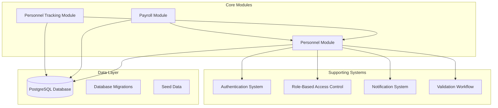
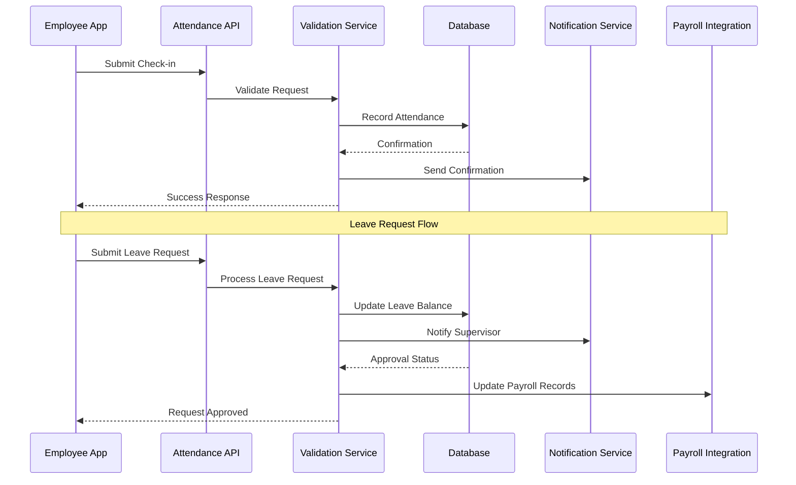
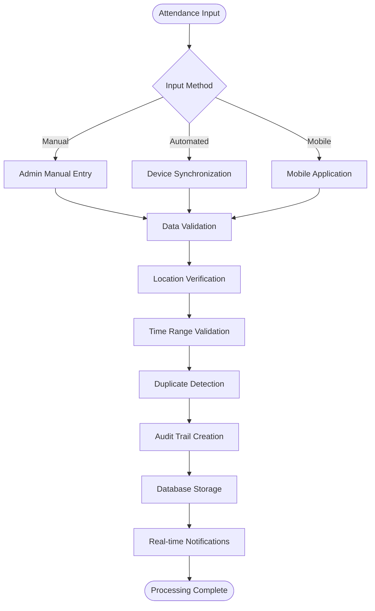
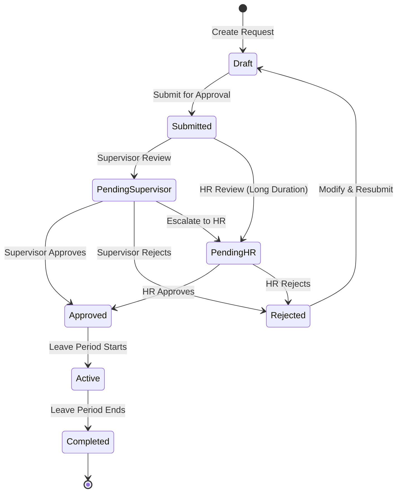
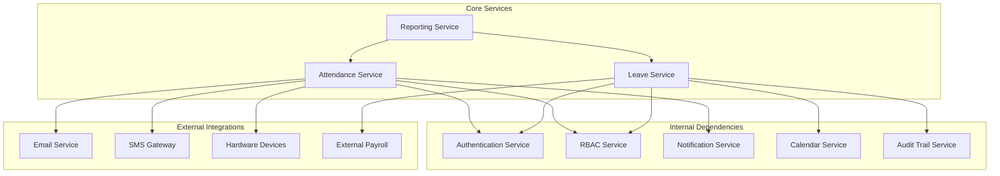

# Attendance & Leave Management

<cite>
**Referenced Files in This Document**
- [backend/src/modules/personnel/index.ts](file://backend/src/modules/personnel/index.ts)
- [backend/database/migrations/016-module-personnel-rh-phase1.sql](file://backend/database/migrations/016-module-personnel-rh-phase1.sql)
- [backend/database/migrations/017-module-personnel-rh-phase2.sql](file://backend/database/migrations/017-module-personnel-rh-phase2.sql)
- [backend/database/migrations/018-module-personnel-rh-phase3.sql](file://backend/database/migrations/018-module-personnel-rh-phase3.sql)
- [backend/database/migrations/019-module-personnel-rh-phase4.sql](file://backend/database/migrations/019-module-personnel-rh-phase4.sql)
- [backend/database/migrations/020-module-personnel-rh-phase5.sql](file://backend/database/migrations/020-module-personnel-rh-phase5.sql)
- [backend/database/migrations/029-paie-etendue.sql](file://backend/database/migrations/029-paie-etendue.sql)
- [backend/src/modules/paie/index.ts](file://backend/src/modules/paie/index.ts)
- [backend/src/modules/suivi-personnel/index.ts](file://backend/src/modules/suivi-personnel/index.ts)
- [backend/src/shared/constants/personnel.constants.ts](file://backend/src/shared/constants/personnel.constants.ts)
- [backend/src/routes/route-registry.ts](file://backend/src/routes/route-registry.ts)
</cite>

## Table of Contents
1. [Introduction](#introduction)
2. [Project Structure](#project-structure)
3. [Core Components](#core-components)
4. [Architecture Overview](#architecture-overview)
5. [Detailed Component Analysis](#detailed-component-analysis)
6. [Dependency Analysis](#dependency-analysis)
7. [Performance Considerations](#performance-considerations)
8. [Troubleshooting Guide](#troubleshooting-guide)
9. [Conclusion](#conclusion)
10. [Appendices](#appendices)

## Introduction

eLISAschool's Attendance & Leave Management system is a comprehensive solution designed to handle all aspects of personnel time tracking, absence management, and payroll integration within an educational institution context. The system provides robust functionality for manual and automated attendance tracking, sophisticated leave request workflows, absence monitoring, and detailed reporting capabilities.

The system supports multiple attendance recording methods including manual entry, automated tracking through various devices, and mobile check-in options. It features comprehensive leave type management with configurable approval workflows, automatic balance calculations, and seamless integration with payroll systems while ensuring compliance with labor regulations.

## Project Structure

The attendance and leave management functionality is primarily implemented within the personnel module, with supporting components across several other modules. The system follows a modular architecture pattern with clear separation of concerns between data persistence, business logic, API endpoints, and presentation layers.

**Diagram sources**
- [backend/src/modules/personnel/index.ts](file://backend/src/modules/personnel/index.ts)
- [backend/src/modules/paie/index.ts](file://backend/src/modules/paie/index.ts)
- [backend/src/modules/suivi-personnel/index.ts](file://backend/src/modules/suivi-personnel/index.ts)

**Section sources**
- [backend/src/modules/personnel/index.ts](file://backend/src/modules/personnel/index.ts)
- [backend/src/routes/route-registry.ts](file://backend/src/routes/route-registry.ts)

## Core Components

### Attendance Tracking Engine

The core attendance tracking engine handles multiple input methods and ensures data consistency across the system. It processes real-time check-ins, batch updates, and historical corrections while maintaining audit trails for all modifications.

### Leave Management System

The leave management system provides comprehensive leave type configuration, automated balance calculations, multi-level approval workflows, and integration with calendar systems. It supports various leave types including annual leave, sick leave, maternity leave, and custom organizational leave categories.

### Absence Monitoring Framework

The absence monitoring framework tracks late arrivals, early departures, unauthorized absences, and generates alerts for HR administrators. It includes predictive analytics for absence patterns and automated notifications to supervisors and employees.

### Payroll Integration Module

The payroll integration module ensures accurate salary calculations based on attendance records, leave balances, overtime hours, and statutory deductions. It maintains compliance with local labor regulations and supports multiple payroll scenarios.

**Section sources**
- [backend/src/modules/personnel/index.ts](file://backend/src/modules/personnel/index.ts)
- [backend/src/modules/paie/index.ts](file://backend/src/modules/paie/index.ts)
- [backend/src/modules/suivi-personnel/index.ts](file://backend/src/modules/suivi-personnel/index.ts)

## Architecture Overview

The attendance and leave management system follows a microservices-inspired architecture within the monolithic application structure. Each major component operates as an independent module with well-defined interfaces and communication protocols.

**Diagram sources**
- [backend/src/modules/personnel/index.ts](file://backend/src/modules/personnel/index.ts)
- [backend/src/modules/suivi-personnel/index.ts](file://backend/src/modules/suivi-personnel/index.ts)

## Detailed Component Analysis

### Attendance Recording System

The attendance recording system supports multiple input methods and validation rules to ensure data integrity and prevent fraudulent entries.

#### Manual Entry Interface

Administrators can manually record attendance through a comprehensive interface that includes bulk operations, date range selection, and reason codes for exceptions.

#### Automated Tracking Integration

The system integrates with various hardware devices including biometric scanners, RFID cards, and GPS-based mobile applications for automated attendance capture.

#### Mobile Check-in Capabilities

Mobile applications enable employees to check in/out using geolocation services, photo verification, and device fingerprinting to prevent proxy attendance.

**Diagram sources**
- [backend/src/modules/personnel/index.ts](file://backend/src/modules/personnel/index.ts)
- [backend/src/modules/suivi-personnel/index.ts](file://backend/src/modules/suivi-personnel/index.ts)

### Leave Request Workflow

The leave request workflow implements a flexible approval chain system that can be configured based on organizational hierarchy, leave type, and duration.

#### Leave Type Configuration

Administrators can define various leave types with specific rules, maximum durations, required documentation, and impact on employee benefits.

#### Multi-Level Approval Process

The system supports hierarchical approval chains where requests may require approval from immediate supervisors, department heads, and HR managers depending on leave duration and type.

#### Balance Calculation Engine

Automatic calculation of remaining leave balances considers accrued days, carried forward balances, probationary periods, and statutory requirements.

**Diagram sources**
- [backend/src/modules/personnel/index.ts](file://backend/src/modules/personnel/index.ts)
- [backend/src/modules/validation-workflow/index.ts](file://backend/src/modules/validation-workflow/index.ts)

### Absence Monitoring and Reporting

The absence monitoring system provides comprehensive tracking of attendance anomalies, generates alerts for potential issues, and produces detailed reports for management review.

#### Late Arrival Detection

Automatic detection of late arrivals based on scheduled work times, grace periods, and location-based validation.

#### Overtime Management

Tracking of overtime hours with approval workflows, compensation calculations, and regulatory compliance checks.

#### Absence Pattern Analysis

Statistical analysis of absence patterns to identify trends, predict future absences, and support workforce planning decisions.

**Section sources**
- [backend/src/modules/personnel/index.ts](file://backend/src/modules/personnel/index.ts)
- [backend/src/modules/suivi-personnel/index.ts](file://backend/src/modules/suivi-personnel/index.ts)

## Dependency Analysis

The attendance and leave management system has well-defined dependencies on core platform services and external integrations.

**Diagram sources**
- [backend/src/modules/personnel/index.ts](file://backend/src/modules/personnel/index.ts)
- [backend/src/modules/paie/index.ts](file://backend/src/modules/paie/index.ts)

**Section sources**
- [backend/src/modules/personnel/index.ts](file://backend/src/modules/personnel/index.ts)
- [backend/src/shared/constants/personnel.constants.ts](file://backend/src/shared/constants/personnel.constants.ts)

## Performance Considerations

The attendance and leave management system is designed for high-volume processing during peak hours (start/end of workdays) and requires careful performance optimization.

### Database Optimization

- Indexed queries for attendance records by employee, date, and status
- Partitioned tables for large historical datasets
- Materialized views for frequently accessed reports
- Connection pooling for concurrent access

### Caching Strategies

- Real-time attendance status caching
- Leave balance pre-calculation and caching
- Report result caching with appropriate invalidation policies
- Session-based user preference caching

### Scalability Patterns

- Horizontal scaling for API endpoints
- Message queue processing for background tasks
- Batch processing for report generation
- Load balancing for mobile check-in endpoints

## Troubleshooting Guide

### Common Issues and Solutions

#### Attendance Recording Failures

**Symptoms**: Employees unable to check in/out, delayed synchronization from devices
**Causes**: Network connectivity issues, device authentication failures, database connection problems
**Resolution Steps**:
1. Verify network connectivity and firewall settings
2. Check device registration and authentication tokens
3. Monitor database connection pool utilization
4. Review error logs for specific failure reasons

#### Leave Request Processing Delays

**Symptoms**: Requests stuck in pending status, delayed approvals
**Causes**: Workflow configuration errors, missing approver assignments, notification delivery failures
**Resolution Steps**:
1. Validate workflow configuration and approver hierarchies
2. Check notification service health and delivery logs
3. Review database locks and transaction timeouts
4. Verify email/SMS gateway connectivity

#### Performance Degradation

**Symptoms**: Slow response times, timeout errors during peak hours
**Causes**: Database query optimization issues, insufficient resources, memory leaks
**Resolution Steps**:
1. Analyze slow query logs and optimize database indexes
2. Monitor application server resource utilization
3. Review garbage collection and memory usage patterns
4. Scale infrastructure horizontally if needed

**Section sources**
- [backend/src/modules/personnel/index.ts](file://backend/src/modules/personnel/index.ts)
- [backend/src/modules/suivi-personnel/index.ts](file://backend/src/modules/suivi-personnel/index.ts)

## Conclusion

eLISAschool's Attendance & Leave Management system provides a comprehensive, scalable, and compliant solution for managing personnel time tracking and absence management in educational institutions. The system's modular architecture, extensive feature set, and robust integration capabilities make it suitable for organizations of various sizes and complexity levels.

Key strengths include flexible attendance recording methods, sophisticated leave workflow management, comprehensive reporting capabilities, and seamless payroll integration. The system's design prioritizes data integrity, security, and performance while maintaining ease of use for both administrators and employees.

Future enhancements should focus on advanced analytics, machine learning-based absence prediction, enhanced mobile capabilities, and expanded international compliance features to support global deployment scenarios.

## Appendices

### A. API Endpoints Reference

#### Attendance Management Endpoints
- POST `/api/attendance/checkin` - Record attendance check-in
- POST `/api/attendance/checkout` - Record attendance check-out  
- GET `/api/attendance/history` - Retrieve attendance history
- PUT `/api/attendance/correct/{id}` - Correct attendance records
- GET `/api/attendance/report/{period}` - Generate attendance reports

#### Leave Management Endpoints
- POST `/api/leave/request` - Submit leave request
- GET `/api/leave/balance` - Check leave balances
- PUT `/api/leave/approve/{id}` - Approve/reject leave request
- GET `/api/leave/calendar` - View leave calendar
- DELETE `/api/leave/cancel/{id}` - Cancel leave request

### B. Database Schema Overview

The system utilizes a normalized database schema with proper foreign key relationships, indexing strategies, and partitioning for optimal performance. Key tables include attendance_records, leave_requests, employee_profiles, and related reference data.

### C. Configuration Parameters

Critical configuration parameters include timezone settings, work schedule definitions, approval workflow configurations, notification templates, and integration endpoints for external systems.