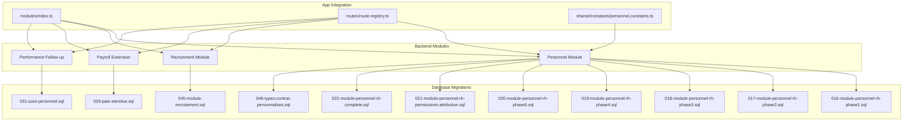
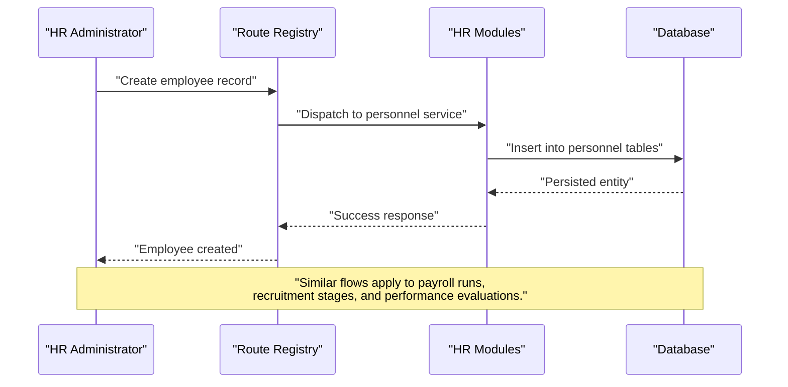
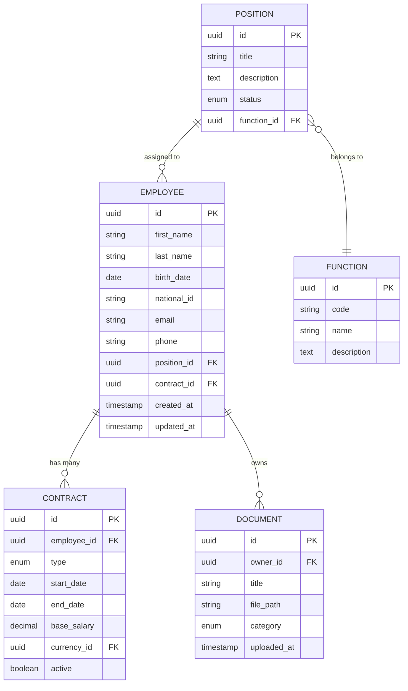
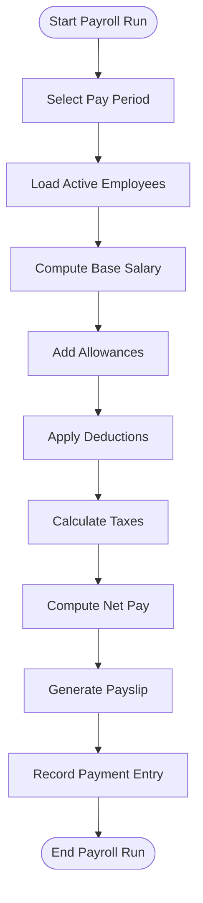
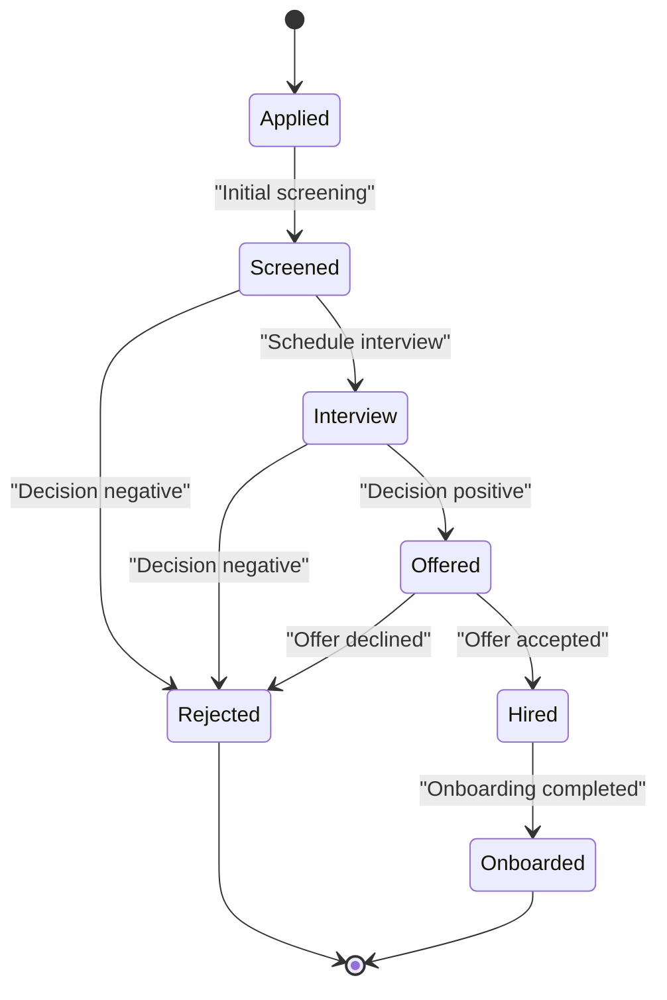
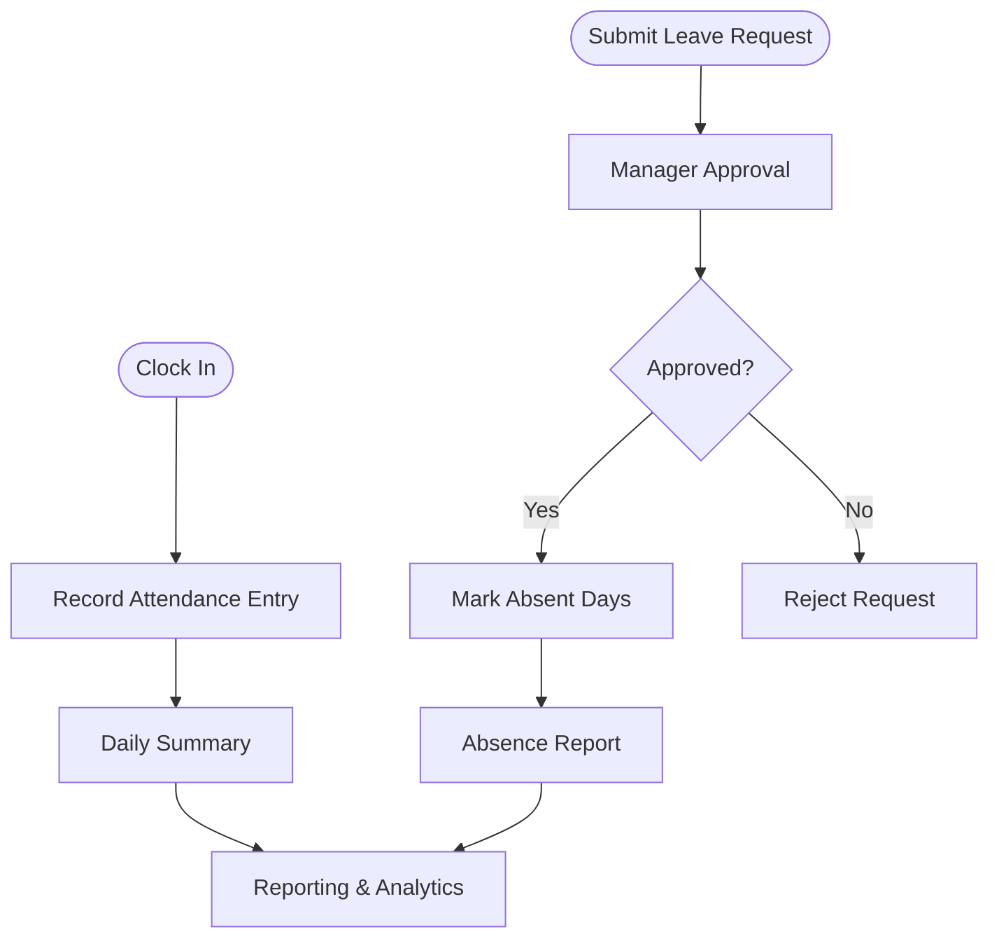
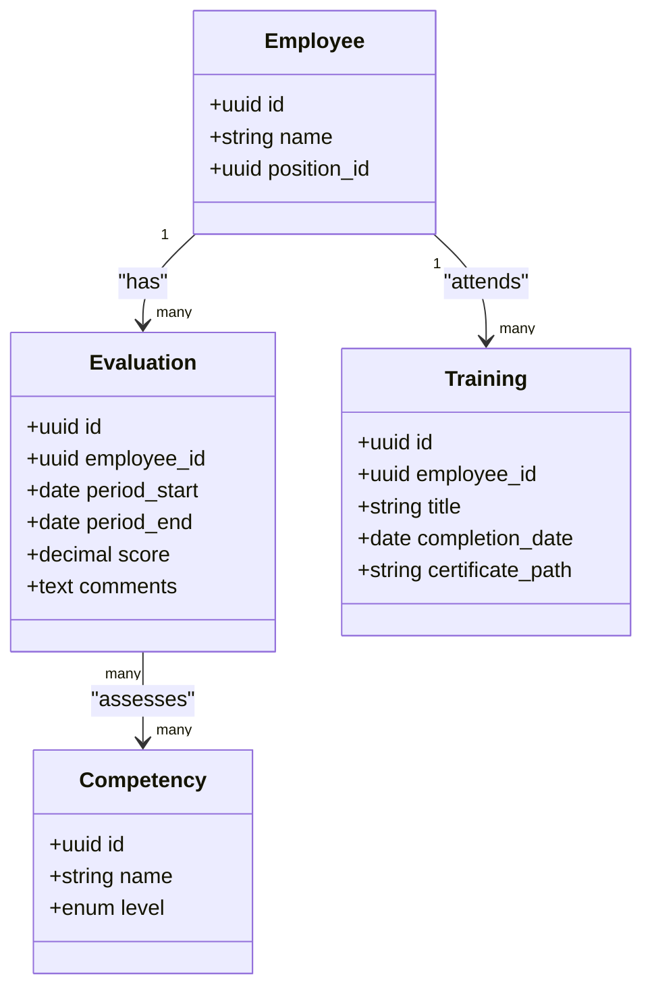
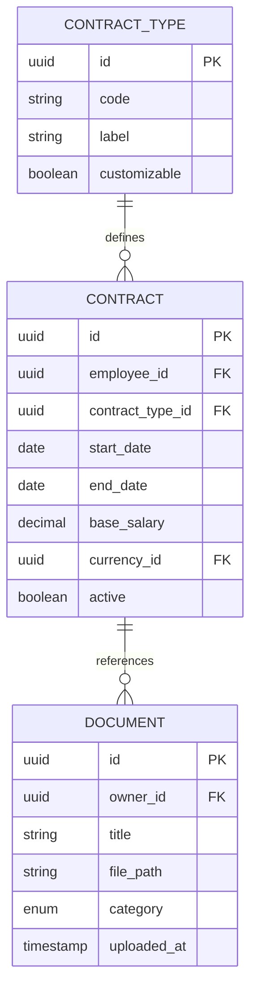
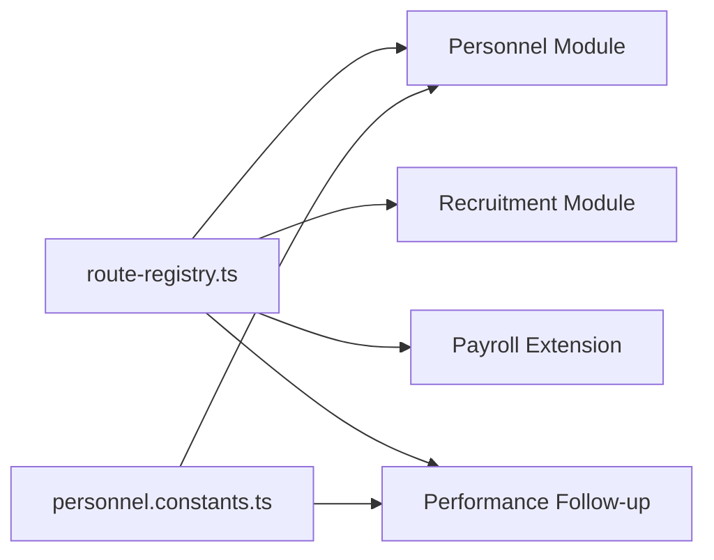

# Human Resources Management

<cite>
**Referenced Files in This Document**
- [016-module-personnel-rh-phase1.sql](file://backend/database/migrations/016-module-personnel-rh-phase1.sql)
- [017-module-personnel-rh-phase2.sql](file://backend/database/migrations/017-module-personnel-rh-phase2.sql)
- [018-module-personnel-rh-phase3.sql](file://backend/database/migrations/018-module-personnel-rh-phase3.sql)
- [019-module-personnel-rh-phase4.sql](file://backend/database/migrations/019-module-personnel-rh-phase4.sql)
- [020-module-personnel-rh-phase5.sql](file://backend/database/migrations/020-module-personnel-rh-phase5.sql)
- [021-module-personnel-rh-permissions-attribution.sql](file://backend/database/migrations/021-module-personnel-rh-permissions-attribution.sql)
- [022-module-personnel-rh-complete.sql](file://backend/database/migrations/022-module-personnel-rh-complete.sql)
- [029-paie-etendue.sql](file://backend/database/migrations/029-paie-etendue.sql)
- [031-suivi-personnel.sql](file://backend/database/migrations/031-suivi-personnel.sql)
- [045-module-recrutement.sql](file://backend/database/migrations/045-module-recrutement.sql)
- [046-types-contrat-personnalises.sql](file://backend/database/migrations/046-types-contrat-personnalises.sql)
- [personnel.constants.ts](file://backend/src/shared/constants/personnel.constants.ts)
- [index.ts](file://backend/src/modules/index.ts)
- [route-registry.ts](file://backend/src/routes/route-registry.ts)
- [RH-PHASES-2-5-COMPLETE.md](file://docs/autres/RH-PHASES-2-5-COMPLETE.md)
- [IMPROVEMENTS-RH-PARCOURS-PROFESSIONNEL.md](file://docs/_improvements/IMPROVEMENTS-RH-PARCOURS-PROFESSIONNEL.md)
</cite>

## Update Summary
**Changes Made**
- Updated personnel administration models to use TypePersonnel code prefixing (TYPE_ prefix) for improved consistency
- Removed deprecated categorie_personnel table references throughout the documentation
- Enhanced position template functionality with function relationships for better organizational structure
- Updated database schema diagrams to reflect the new TypePersonnel naming convention
- Revised entity relationship models to show improved position-template-function relationships

## Table of Contents
1. [Introduction](#introduction)
2. [Project Structure](#project-structure)
3. [Core Components](#core-components)
4. [Architecture Overview](#architecture-overview)
5. [Detailed Component Analysis](#detailed-component-analysis)
6. [Dependency Analysis](#dependency-analysis)
7. [Performance Considerations](#performance-considerations)
8. [Troubleshooting Guide](#troubleshooting-guide)
9. [Conclusion](#conclusion)
10. [Appendices](#appendices)

## Introduction
This document describes the human resources management system within eLISAschool, covering personnel administration, payroll processing, recruitment workflow, and performance evaluation. It explains the complete staff lifecycle from recruitment through retirement, including contract management and document handling. It also details attendance and leave management, time tracking, absence monitoring, performance evaluation workflows, career progression tracking, training management, practical examples, reporting capabilities, compliance requirements, data privacy, and integration with external payroll systems.

**Updated** The system now uses standardized TypePersonnel code prefixing for improved consistency and maintainability across all personnel-related entities.

## Project Structure
The HR domain is implemented as a set of backend modules and database migrations:
- Personnel module (multi-phase migrations) for core employee records, roles, contracts, and related entities with enhanced TypePersonnel code prefixing
- Payroll extension migration for salary structures, allowances/deductions, tax components, and payment runs
- Recruitment module for candidate pipeline and hiring stages
- Performance tracking and follow-up via dedicated migrations and constants
- Shared constants for HR-related enums and configuration
- Module registration and route registry to expose APIs

**Diagram sources**
- [index.ts](file://backend/src/modules/index.ts)
- [route-registry.ts](file://backend/src/routes/route-registry.ts)
- [personnel.constants.ts](file://backend/src/shared/constants/personnel.constants.ts)
- [016-module-personnel-rh-phase1.sql](file://backend/database/migrations/016-module-personnel-rh-phase1.sql)
- [017-module-personnel-rh-phase2.sql](file://backend/database/migrations/017-module-personnel-rh-phase2.sql)
- [018-module-personnel-rh-phase3.sql](file://backend/database/migrations/018-module-personnel-rh-phase3.sql)
- [019-module-personnel-rh-phase4.sql](file://backend/database/migrations/019-module-personnel-rh-phase4.sql)
- [020-module-personnel-rh-phase5.sql](file://backend/database/migrations/020-module-personnel-rh-phase5.sql)
- [021-module-personnel-rh-permissions-attribution.sql](file://backend/database/migrations/021-module-personnel-rh-permissions-attribution.sql)
- [022-module-personnel-rh-complete.sql](file://backend/database/migrations/022-module-personnel-rh-complete.sql)
- [029-paie-etendue.sql](file://backend/database/migrations/029-paie-etendue.sql)
- [031-suivi-personnel.sql](file://backend/database/migrations/031-suivi-personnel.sql)
- [045-module-recrutement.sql](file://backend/database/migrations/045-module-recrutement.sql)
- [046-types-contrat-personnalises.sql](file://backend/database/migrations/046-types-contrat-personnalises.sql)

**Section sources**
- [index.ts](file://backend/src/modules/index.ts)
- [route-registry.ts](file://backend/src/routes/route-registry.ts)
- [personnel.constants.ts](file://backend/src/shared/constants/personnel.constants.ts)
- [016-module-personnel-rh-phase1.sql](file://backend/database/migrations/016-module-personnel-rh-phase1.sql)
- [017-module-personnel-rh-phase2.sql](file://backend/database/migrations/017-module-personnel-rh-phase2.sql)
- [018-module-personnel-rh-phase3.sql](file://backend/database/migrations/018-module-personnel-rh-phase3.sql)
- [019-module-personnel-rh-phase4.sql](file://backend/database/migrations/019-module-personnel-rh-phase4.sql)
- [020-module-personnel-rh-phase5.sql](file://backend/database/migrations/020-module-personnel-rh-phase5.sql)
- [021-module-personnel-rh-permissions-attribution.sql](file://backend/database/migrations/021-module-personnel-rh-permissions-attribution.sql)
- [022-module-personnel-rh-complete.sql](file://backend/database/migrations/022-module-personnel-rh-complete.sql)
- [029-paie-etendue.sql](file://backend/database/migrations/029-paie-etendue.sql)
- [031-suivi-personnel.sql](file://backend/database/migrations/031-suivi-personnel.sql)
- [045-module-recrutement.sql](file://backend/database/migrations/045-module-recrutement.sql)
- [046-types-contrat-personnalises.sql](file://backend/database/migrations/046-types-contrat-personnalises.sql)

## Core Components
- Personnel Administration: Employee master data, job positions, contracts, documents, and role-based access control for HR operations with standardized TypePersonnel code prefixing.
- Payroll Processing: Salary structures, allowances/deductions, tax components, pay periods, and payment runs.
- Recruitment Workflow: Candidate profiles, application stages, interviews, offers, and onboarding handoff.
- Attendance and Leave Management: Time tracking, attendance logs, leave requests, approvals, and absence monitoring.
- Performance Evaluation and Career Progression: Evaluations, competencies, career moves, and training records.

Key implementation anchors:
- Multi-phase personnel schema and permissions with TypePersonnel code standardization
- Payroll extension for extended salary components and payments
- Recruitment module schema
- Performance follow-up schema
- Shared HR constants for enums and defaults

**Updated** All personnel-related entities now use consistent TYPE_ prefix coding for better maintainability and clarity.

**Section sources**
- [016-module-personnel-rh-phase1.sql](file://backend/database/migrations/016-module-personnel-rh-phase1.sql)
- [017-module-personnel-rh-phase2.sql](file://backend/database/migrations/017-module-personnel-rh-phase2.sql)
- [018-module-personnel-rh-phase3.sql](file://backend/database/migrations/018-module-personnel-rh-phase3.sql)
- [019-module-personnel-rh-phase4.sql](file://backend/database/migrations/019-module-personnel-rh-phase4.sql)
- [020-module-personnel-rh-phase5.sql](file://backend/database/migrations/020-module-personnel-rh-phase5.sql)
- [021-module-personnel-rh-permissions-attribution.sql](file://backend/database/migrations/021-module-personnel-rh-permissions-attribution.sql)
- [022-module-personnel-rh-complete.sql](file://backend/database/migrations/022-module-personnel-rh-complete.sql)
- [029-paie-etendue.sql](file://backend/database/migrations/029-paie-etendue.sql)
- [045-module-recrutement.sql](file://backend/database/migrations/045-module-recrutement.sql)
- [031-suivi-personnel.sql](file://backend/database/migrations/031-suivi-personnel.sql)
- [personnel.constants.ts](file://backend/src/shared/constants/personnel.constants.ts)

## Architecture Overview
The HR system follows a modular architecture:
- Database layer: Phase-by-phase migrations define entities and relationships for personnel, payroll, recruitment, and performance with standardized TypePersonnel code prefixing.
- Application layer: Modules are registered and routes exposed via central registries.
- Shared layer: Constants provide common enums and defaults used across modules.

**Diagram sources**
- [route-registry.ts](file://backend/src/routes/route-registry.ts)
- [index.ts](file://backend/src/modules/index.ts)
- [016-module-personnel-rh-phase1.sql](file://backend/database/migrations/016-module-personnel-rh-phase1.sql)
- [029-paie-etendue.sql](file://backend/database/migrations/029-paie-etendue.sql)
- [045-module-recrutement.sql](file://backend/database/migrations/045-module-recrutement.sql)
- [031-suivi-personnel.sql](file://backend/database/migrations/031-suivi-personnel.sql)

## Detailed Component Analysis

### Personnel Administration
Covers employee master data, job positions, contracts, and document handling. The multi-phase migrations establish foundational tables, constraints, and indexes, while permissions are attributed to support RBAC for HR tasks. **Updated** All personnel-related codes now use the TYPE_ prefix for consistency.

**Updated** Enhanced position template functionality with function relationships for better organizational structure and improved code standardization using TYPE_ prefix.

**Diagram sources**
- [016-module-personnel-rh-phase1.sql](file://backend/database/migrations/016-module-personnel-rh-phase1.sql)
- [017-module-personnel-rh-phase2.sql](file://backend/database/migrations/017-module-personnel-rh-phase2.sql)
- [018-module-personnel-rh-phase3.sql](file://backend/database/migrations/018-module-personnel-rh-phase3.sql)
- [019-module-personnel-rh-phase4.sql](file://backend/database/migrations/019-module-personnel-rh-phase4.sql)
- [020-module-personnel-rh-phase5.sql](file://backend/database/migrations/020-module-personnel-rh-phase5.sql)
- [046-types-contrat-personnalises.sql](file://backend/database/migrations/046-types-contrat-personnalises.sql)

Practical example: Onboarding flow
- Create employee profile
- Assign position and contract
- Upload required documents
- Grant initial HR permissions

**Section sources**
- [016-module-personnel-rh-phase1.sql](file://backend/database/migrations/016-module-personnel-rh-phase1.sql)
- [017-module-personnel-rh-phase2.sql](file://backend/database/migrations/017-module-personnel-rh-phase2.sql)
- [018-module-personnel-rh-phase3.sql](file://backend/database/migrations/018-module-personnel-rh-phase3.sql)
- [019-module-personnel-rh-phase4.sql](file://backend/database/migrations/019-module-personnel-rh-phase4.sql)
- [020-module-personnel-rh-phase5.sql](file://backend/database/migrations/020-module-personnel-rh-phase5.sql)
- [021-module-personnel-rh-permissions-attribution.sql](file://backend/database/migrations/021-module-personnel-rh-permissions-attribution.sql)
- [046-types-contrat-personnalises.sql](file://backend/database/migrations/046-types-contrat-personnalises.sql)

### Payroll Processing
Payroll extends salary structures, allowances/deductions, tax components, pay periods, and payment runs. The payroll extension migration introduces additional fields and tables to support comprehensive compensation calculations and disbursements.

**Diagram sources**
- [029-paie-etendue.sql](file://backend/database/migrations/029-paie-etendue.sql)

Practical example: Monthly payroll calculation
- Define pay period
- For each employee, compute gross by adding allowances
- Apply statutory deductions and taxes
- Produce net pay and generate payslips
- Post payment entries for accounting integration

**Section sources**
- [029-paie-etendue.sql](file://backend/database/migrations/029-paie-etendue.sql)

### Recruitment Workflow
The recruitment module supports candidate profiles, application stages, interview scheduling, offer management, and onboarding handoff.

**Diagram sources**
- [045-module-recrutement.sql](file://backend/database/migrations/045-module-recrutement.sql)

Practical example: Hiring a teacher
- Receive application and create candidate record
- Screen resume and schedule interview
- Conduct interview and evaluate
- Extend offer and accept
- Transition to personnel module for onboarding

**Section sources**
- [045-module-recrutement.sql](file://backend/database/migrations/045-module-recrutement.sql)

### Attendance and Leave Management
Attendance and leave are tracked via follow-up migrations that capture time logs, leave requests, approvals, and absence summaries.

**Diagram sources**
- [031-suivi-personnel.sql](file://backend/database/migrations/031-suivi-personnel.sql)

Practical example: Managing monthly absences
- Collect daily attendance logs
- Process approved leave requests
- Generate absence reports per employee and department
- Export for payroll adjustments

**Section sources**
- [031-suivi-personnel.sql](file://backend/database/migrations/031-suivi-personnel.sql)

### Performance Evaluation and Career Progression
Performance evaluations, competencies, career moves, and training records are supported by the performance follow-up schema and shared HR constants.

**Diagram sources**
- [031-suivi-personnel.sql](file://backend/database/migrations/031-suivi-personnel.sql)
- [personnel.constants.ts](file://backend/src/shared/constants/personnel.constants.ts)

Practical example: Annual review cycle
- Set evaluation period
- Managers submit scores and comments
- Link competencies and training achievements
- Use outcomes for promotion decisions and development plans

**Section sources**
- [031-suivi-personnel.sql](file://backend/database/migrations/031-suivi-personnel.sql)
- [personnel.constants.ts](file://backend/src/shared/constants/personnel.constants.ts)

### Contract Management and Document Handling
Contracts include type, dates, base salary, currency, and active status. Customizable contract types allow institutional flexibility. Documents are attached to employees or contracts with categories and timestamps.

**Diagram sources**
- [046-types-contrat-personnalises.sql](file://backend/database/migrations/046-types-contrat-personnalises.sql)
- [016-module-personnel-rh-phase1.sql](file://backend/database/migrations/016-module-personnel-rh-phase1.sql)

Practical example: Renewing a fixed-term contract
- Create new contract record linked to employee
- Update previous contract end date and inactive flag
- Attach renewal documents and notifications

**Section sources**
- [046-types-contrat-personnalises.sql](file://backend/database/migrations/046-types-contrat-personnalises.sql)
- [016-module-personnel-rh-phase1.sql](file://backend/database/migrations/016-module-personnel-rh-phase1.sql)

## Dependency Analysis
Module registration and route exposure connect the HR subsystems to the application runtime. Shared constants provide consistent enums across modules.

**Diagram sources**
- [route-registry.ts](file://backend/src/routes/route-registry.ts)
- [index.ts](file://backend/src/modules/index.ts)
- [personnel.constants.ts](file://backend/src/shared/constants/personnel.constants.ts)

**Section sources**
- [route-registry.ts](file://backend/src/routes/route-registry.ts)
- [index.ts](file://backend/src/modules/index.ts)
- [personnel.constants.ts](file://backend/src/shared/constants/personnel.constants.ts)

## Performance Considerations
- Indexes and constraints defined in migrations improve query performance for large employee datasets and frequent payroll runs.
- Batch operations for payroll and attendance aggregation should be scheduled during off-peak hours.
- Pagination and filtering at the API layer reduce payload sizes for dashboards and reports.
- Caching frequently accessed reference data (positions, contract types, currencies) can reduce database load.
- **Updated** Standardized TypePersonnel code prefixing improves query optimization and indexing efficiency.

[No sources needed since this section provides general guidance]

## Troubleshooting Guide
Common issues and resolutions:
- Missing permissions for HR actions: Verify permission attribution migrations have been applied and roles assigned correctly.
- Payroll discrepancies: Validate allowance/deduction rules and tax component configurations; ensure pay period alignment.
- Recruitment stage stuck: Check state transitions and approval workflows; confirm manager assignments.
- Attendance gaps: Confirm clock-in/out logs and timezone settings; reconcile with leave approvals.
- **Updated** TypePersonnel code inconsistencies: Ensure all personnel-related codes use the standardized TYPE_ prefix format.
- **Updated** Position-template relationships: Verify function relationships are properly configured for position templates.

Operational references:
- HR phases documentation for end-to-end workflows
- Improvements for professional career path tracking

**Section sources**
- [021-module-personnel-rh-permissions-attribution.sql](file://backend/database/migrations/021-module-personnel-rh-permissions-attribution.sql)
- [029-paie-etendue.sql](file://backend/database/migrations/029-paie-etendue.sql)
- [045-module-recrutement.sql](file://backend/database/migrations/045-module-recrutement.sql)
- [031-suivi-personnel.sql](file://backend/database/migrations/031-suivi-personnel.sql)
- [RH-PHASES-2-5-COMPLETE.md](file://docs/autres/RH-PHASES-2-5-COMPLETE.md)
- [IMPROVEMENTS-RH-PARCOURS-PROFESSIONNEL.md](file://docs/_improvements/IMPROVEMENTS-RH-PARCOURS-PROFESSIONNEL.md)

## Conclusion
eLISAschool's HR system provides a comprehensive foundation for managing the full staff lifecycle. The phased migrations ensure robust data models for personnel, payroll, recruitment, and performance. With clear workflows, extensible contract types, and integrated reporting, institutions can maintain compliance, streamline operations, and support career development.

**Updated** The recent refactoring with TypePersonnel code prefixing, removal of deprecated tables, and enhanced position-template relationships significantly improves system maintainability and scalability.

[No sources needed since this section summarizes without analyzing specific files]

## Appendices

### Staff Lifecycle Reference
- Recruitment: Application → Screening → Interview → Offer → Hire → Onboard
- Employment: Contract creation → Position assignment → Documents → Ongoing evaluations
- Separation: Resignation/Termination → Exit checks → Final payroll → Archival

**Section sources**
- [045-module-recrutement.sql](file://backend/database/migrations/045-module-recrutement.sql)
- [016-module-personnel-rh-phase1.sql](file://backend/database/migrations/016-module-personnel-rh-phase1.sql)
- [029-paie-etendue.sql](file://backend/database/migrations/029-paie-etendue.sql)
- [031-suivi-personnel.sql](file://backend/database/migrations/031-suivi-personnel.sql)

### Compliance and Data Privacy
- Role-based access control ensures only authorized users can view sensitive HR data.
- Audit trails and immutable records support regulatory compliance.
- Data minimization and retention policies should be enforced for documents and personal data.

**Section sources**
- [021-module-personnel-rh-permissions-attribution.sql](file://backend/database/migrations/021-module-personnel-rh-permissions-attribution.sql)
- [022-module-personnel-rh-complete.sql](file://backend/database/migrations/022-module-personnel-rh-complete.sql)

### External Payroll Integration
- Export standardized payroll files (CSV/JSON) for external systems.
- Map internal allowances/deductions/taxes to external provider schemas.
- Reconcile payment runs and handle exceptions via audit logs.

**Section sources**
- [029-paie-etendue.sql](file://backend/database/migrations/029-paie-etendue.sql)

### Migration Notes
**Updated** Key migration changes:
- Refactored all personnel administration models to use TypePersonnel code prefixing (TYPE_ prefix)
- Removed deprecated categorie_personnel table and all its references
- Enhanced position template functionality with new function relationships
- Improved database schema consistency and maintainability

**Section sources**
- [016-module-personnel-rh-phase1.sql](file://backend/database/migrations/016-module-personnel-rh-phase1.sql)
- [017-module-personnel-rh-phase2.sql](file://backend/database/migrations/017-module-personnel-rh-phase2.sql)
- [018-module-personnel-rh-phase3.sql](file://backend/database/migrations/018-module-personnel-rh-phase3.sql)
- [019-module-personnel-rh-phase4.sql](file://backend/database/migrations/019-module-personnel-rh-phase4.sql)
- [020-module-personnel-rh-phase5.sql](file://backend/database/migrations/020-module-personnel-rh-phase5.sql)