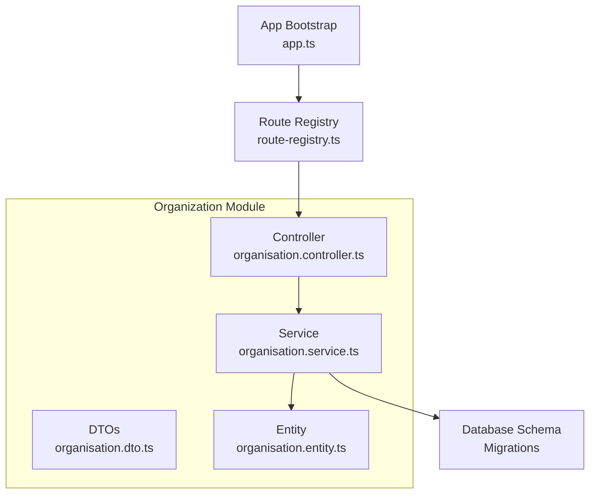
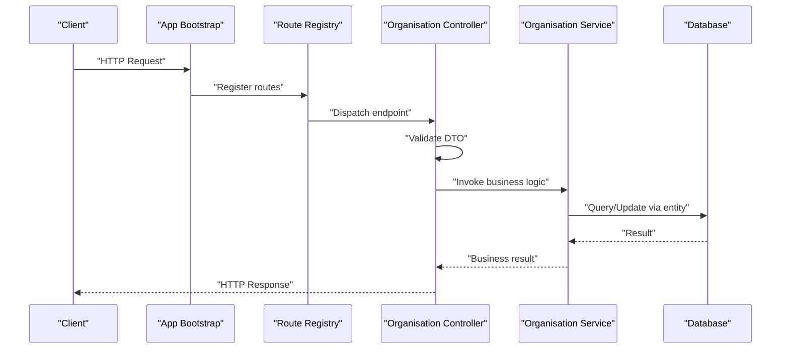
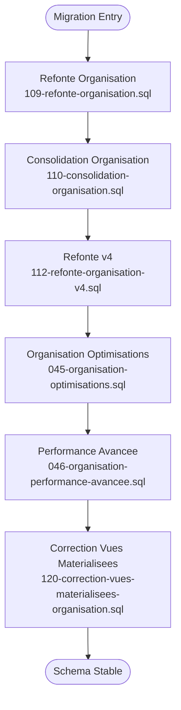
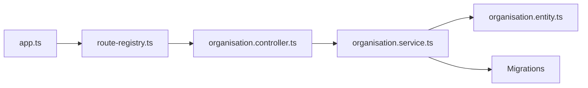

# Organization Module Architecture

<cite>
**Referenced Files in This Document**
- [backend/src/modules/organisation/index.ts](file://backend/src/modules/organisation/index.ts)
- [backend/src/modules/organisation/controllers/organisation.controller.ts](file://backend/src/modules/organisation/controllers/organisation.controller.ts)
- [backend/src/modules/organisation/services/organisation.service.ts](file://backend/src/modules/organisation/services/organisation.service.ts)
- [backend/src/modules/organisation/dto/organisation.dto.ts](file://backend/src/modules/organisation/dto/organisation.dto.ts)
- [backend/src/modules/organisation/entities/organisation.entity.ts](file://backend/src/modules/organisation/entities/organisation.entity.ts)
- [backend/database/migrations/109-refonte-organisation.sql](file://backend/database/migrations/109-refonte-organisation.sql)
- [backend/database/migrations/110-consolidation-organisation.sql](file://backend/database/migrations/110-consolidation-organisation.sql)
- [backend/database/migrations/112-refonte-organisation-v4.sql](file://backend/database/migrations/112-refonte-organisation-v4.sql)
- [backend/database/migrations/120-correction-vues-materialisees-organisation.sql](file://backend/database/migrations/120-correction-vues-materialisees-organisation.sql)
- [backend/database/migrations/045-organisation-optimisations.sql](file://backend/database/migrations/045-organisation-optimisations.sql)
- [backend/database/migrations/046-organisation-performance-avancee.sql](file://backend/database/migrations/046-organisation-performance-avancee.sql)
- [backend/src/routes/route-registry.ts](file://backend/src/routes/route-registry.ts)
- [backend/src/app.ts](file://backend/src/app.ts)
- [backend/package.json](file://backend/package.json)
</cite>

## Table of Contents
1. [Introduction](#introduction)
2. [Project Structure](#project-structure)
3. [Core Components](#core-components)
4. [Architecture Overview](#architecture-overview)
5. [Detailed Component Analysis](#detailed-component-analysis)
6. [Dependency Analysis](#dependency-analysis)
7. [Performance Considerations](#performance-considerations)
8. [Troubleshooting Guide](#troubleshooting-guide)
9. [Conclusion](#conclusion)

## Introduction
This document explains the Organization module architecture within the eLISAschool backend. It focuses on how the module is structured, its key components (controllers, services, DTOs, entities), and how it integrates with routes and the database through migrations. The goal is to provide a clear mental model for both technical and non-technical readers, including diagrams that map directly to source files.

## Project Structure
The Organization module follows a standard NestJS-style layout:
- Controllers expose HTTP endpoints
- Services encapsulate business logic
- DTOs define request/response contracts
- Entities represent data models
- Migrations evolve the schema over time
- Routes register module endpoints at the application level

**Diagram sources**
- [backend/src/modules/organisation/controllers/organisation.controller.ts](file://backend/src/modules/organisation/controllers/organisation.controller.ts)
- [backend/src/modules/organisation/services/organisation.service.ts](file://backend/src/modules/organisation/services/organisation.service.ts)
- [backend/src/modules/organisation/dto/organisation.dto.ts](file://backend/src/modules/organisation/dto/organisation.dto.ts)
- [backend/src/modules/organisation/entities/organisation.entity.ts](file://backend/src/modules/organisation/entities/organisation.entity.ts)
- [backend/src/routes/route-registry.ts](file://backend/src/routes/route-registry.ts)
- [backend/src/app.ts](file://backend/src/app.ts)

**Section sources**
- [backend/src/modules/organisation/index.ts](file://backend/src/modules/organisation/index.ts)
- [backend/src/routes/route-registry.ts](file://backend/src/routes/route-registry.ts)
- [backend/src/app.ts](file://backend/src/app.ts)

## Core Components
- Controller: Handles HTTP requests, validates inputs via DTOs, delegates to service layer, and returns standardized responses.
- Service: Implements core business rules, orchestrates data access, and interacts with entities and database queries.
- DTOs: Define input/output shapes for API endpoints, ensuring consistent validation and documentation.
- Entity: Maps to database tables, defining fields, relationships, and constraints.

Key responsibilities:
- CRUD operations for organization-related resources
- Validation and error handling at controller/service boundaries
- Data transformation between DTOs and entities
- Query optimization and indexing via migrations

**Section sources**
- [backend/src/modules/organisation/controllers/organisation.controller.ts](file://backend/src/modules/organisation/controllers/organisation.controller.ts)
- [backend/src/modules/organisation/services/organisation.service.ts](file://backend/src/modules/organisation/services/organisation.service.ts)
- [backend/src/modules/organisation/dto/organisation.dto.ts](file://backend/src/modules/organisation/dto/organisation.dto.ts)
- [backend/src/modules/organisation/entities/organisation.entity.ts](file://backend/src/modules/organisation/entities/organisation.entity.ts)

## Architecture Overview
The Organization module integrates into the application through route registration and app bootstrap. Requests flow from the router to the controller, then to the service, which performs business logic and persists or retrieves data using entities and database migrations.

**Diagram sources**
- [backend/src/app.ts](file://backend/src/app.ts)
- [backend/src/routes/route-registry.ts](file://backend/src/routes/route-registry.ts)
- [backend/src/modules/organisation/controllers/organisation.controller.ts](file://backend/src/modules/organisation/controllers/organisation.controller.ts)
- [backend/src/modules/organisation/services/organisation.service.ts](file://backend/src/modules/organisation/services/organisation.service.ts)

## Detailed Component Analysis

### Controller Layer
Responsibilities:
- Parse and validate incoming requests using DTOs
- Delegate to service methods for business operations
- Map service results to HTTP responses
- Handle errors consistently

Validation and error handling are enforced by DTOs and centralized error strategies.

**Section sources**
- [backend/src/modules/organisation/controllers/organisation.controller.ts](file://backend/src/modules/organisation/controllers/organisation.controller.ts)
- [backend/src/modules/organisation/dto/organisation.dto.ts](file://backend/src/modules/organisation/dto/organisation.dto.ts)

### Service Layer
Responsibilities:
- Implement domain logic for organization operations
- Compose queries and mutations against entities
- Manage transactions where needed
- Encapsulate data transformations

The service acts as the single source of truth for organization-related business rules.

**Section sources**
- [backend/src/modules/organisation/services/organisation.service.ts](file://backend/src/modules/organisation/services/organisation.service.ts)

### DTOs
Responsibilities:
- Define strict request/response schemas
- Provide validation decorators/rules
- Support API documentation generation

DTOs ensure consistency across endpoints and reduce runtime errors.

**Section sources**
- [backend/src/modules/organisation/dto/organisation.dto.ts](file://backend/src/modules/organisation/dto/organisation.dto.ts)

### Entities
Responsibilities:
- Represent database tables and relationships
- Enforce field types and constraints
- Support ORM operations

Entities align with migration scripts to maintain schema integrity.

**Section sources**
- [backend/src/modules/organisation/entities/organisation.entity.ts](file://backend/src/modules/organisation/entities/organisation.entity.ts)

### Database Migrations
The Organization module evolves through multiple migrations focusing on refactoring, consolidation, performance, and materialized views. Key milestones include:
- Refactorings and consolidations to stabilize schema
- Performance optimizations and advanced indexes
- Corrections to materialized views for reporting efficiency

**Diagram sources**
- [backend/database/migrations/109-refonte-organisation.sql](file://backend/database/migrations/109-refonte-organisation.sql)
- [backend/database/migrations/110-consolidation-organisation.sql](file://backend/database/migrations/110-consolidation-organisation.sql)
- [backend/database/migrations/112-refonte-organisation-v4.sql](file://backend/database/migrations/112-refonte-organisation-v4.sql)
- [backend/database/migrations/045-organisation-optimisations.sql](file://backend/database/migrations/045-organisation-optimisations.sql)
- [backend/database/migrations/046-organisation-performance-avancee.sql](file://backend/database/migrations/046-organisation-performance-avancee.sql)
- [backend/database/migrations/120-correction-vues-materialisees-organisation.sql](file://backend/database/migrations/120-correction-vues-materialisees-organisation.sql)

**Section sources**
- [backend/database/migrations/109-refonte-organisation.sql](file://backend/database/migrations/109-refonte-organisation.sql)
- [backend/database/migrations/110-consolidation-organisation.sql](file://backend/database/migrations/110-consolidation-organisation.sql)
- [backend/database/migrations/112-refonte-organisation-v4.sql](file://backend/database/migrations/112-refonte-organisation-v4.sql)
- [backend/database/migrations/045-organisation-optimisations.sql](file://backend/database/migrations/045-organisation-optimisations.sql)
- [backend/database/migrations/046-organisation-performance-avancee.sql](file://backend/database/migrations/046-organisation-performance-avancee.sql)
- [backend/database/migrations/120-correction-vues-materialisees-organisation.sql](file://backend/database/migrations/120-correction-vues-materialisees-organisation.sql)

## Dependency Analysis
The Organization module depends on:
- Route registry for endpoint exposure
- Application bootstrap for lifecycle management
- Database schema defined by migrations
- Shared utilities and configuration (as used by other modules)

**Diagram sources**
- [backend/src/app.ts](file://backend/src/app.ts)
- [backend/src/routes/route-registry.ts](file://backend/src/routes/route-registry.ts)
- [backend/src/modules/organisation/controllers/organisation.controller.ts](file://backend/src/modules/organisation/controllers/organisation.controller.ts)
- [backend/src/modules/organisation/services/organisation.service.ts](file://backend/src/modules/organisation/services/organisation.service.ts)
- [backend/src/modules/organisation/entities/organisation.entity.ts](file://backend/src/modules/organisation/entities/organisation.entity.ts)

**Section sources**
- [backend/package.json](file://backend/package.json)
- [backend/src/app.ts](file://backend/src/app.ts)
- [backend/src/routes/route-registry.ts](file://backend/src/routes/route-registry.ts)

## Performance Considerations
- Indexing: Migrations introduce targeted indexes to accelerate common queries.
- Materialized views: Used to precompute complex aggregations for reporting.
- Query composition: Service layer should favor efficient joins and selective projections.
- Caching: Consider caching read-heavy endpoints if appropriate.

Recommendations:
- Monitor slow queries and add composite indexes where necessary.
- Validate materialized view refresh strategies for consistency and latency.
- Profile service methods to avoid N+1 query patterns.

[No sources needed since this section provides general guidance]

## Troubleshooting Guide
Common issues and resolutions:
- Endpoint not found: Verify route registration and path prefixes.
- Validation errors: Check DTO definitions and request payloads.
- Database errors: Ensure migrations are applied and schema matches entities.
- Performance regressions: Review indexes and materialized view refresh schedules.

Debugging steps:
- Inspect controller logs for request/response details.
- Validate DTOs against sample payloads.
- Run migration status checks and compare expected vs actual schema.
- Use query profiling tools to identify bottlenecks.

**Section sources**
- [backend/src/modules/organisation/controllers/organisation.controller.ts](file://backend/src/modules/organisation/controllers/organisation.controller.ts)
- [backend/src/modules/organisation/dto/organisation.dto.ts](file://backend/src/modules/organisation/dto/organisation.dto.ts)
- [backend/database/migrations/120-correction-vues-materialisees-organisation.sql](file://backend/database/migrations/120-correction-vues-materialisees-organisation.sql)

## Conclusion
The Organization module is structured around clear separation of concerns: controllers handle HTTP concerns, services encapsulate business logic, DTOs enforce contracts, and entities align with the database schema. Migrations drive schema evolution with a focus on stability and performance. By following the documented patterns and recommendations, developers can extend and maintain the module effectively while ensuring reliability and scalability.

[No sources needed since this section summarizes without analyzing specific files]