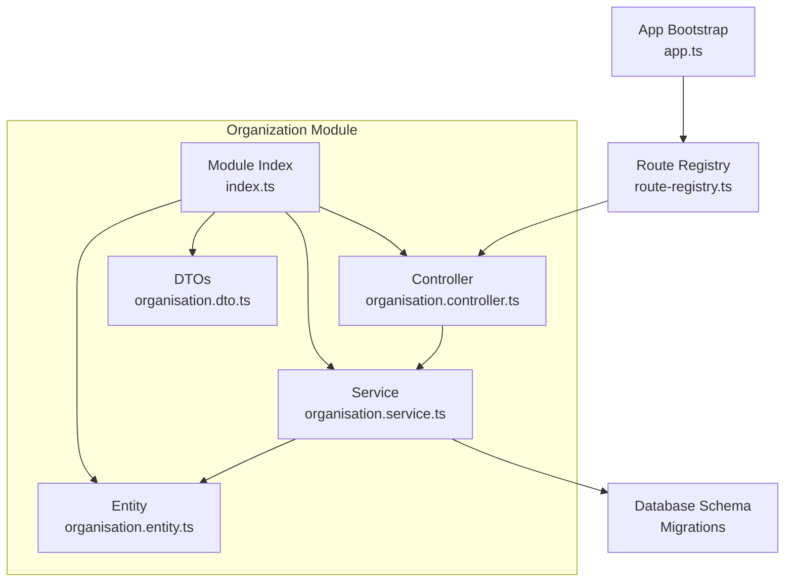
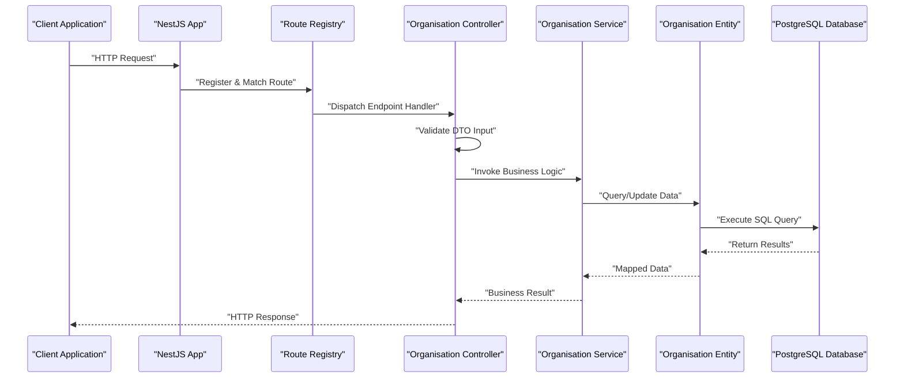
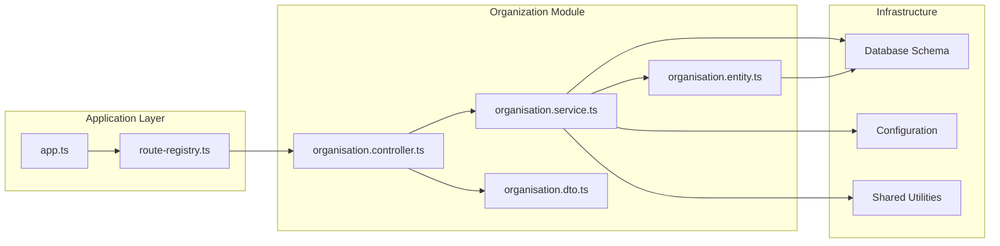
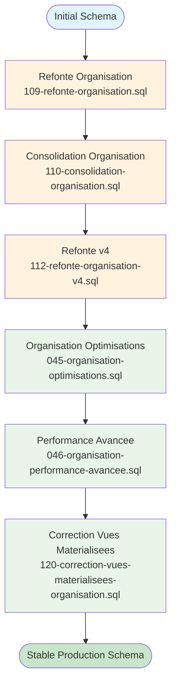

# Organization Module Architecture

<cite>
**Referenced Files in This Document**
- [backend/src/modules/organisation/index.ts](file://backend/src/modules/organisation/index.ts)
- [backend/src/modules/organisation/controllers/organisation.controller.ts](file://backend/src/modules/organisation/controllers/organisation.controller.ts)
- [backend/src/modules/organisation/services/organisation.service.ts](file://backend/src/modules/organisation/services/organisation.service.ts)
- [backend/src/modules/organisation/dto/organisation.dto.ts](file://backend/src/modules/organisation/dto/organisation.dto.ts)
- [backend/src/modules/organisation/entities/organisation.entity.ts](file://backend/src/modules/organisation/entities/organisation.entity.ts)
- [backend/database/migrations/109-refonte-organisation.sql](file://backend/database/migrations/109-refonte-organisation.sql)
- [backend/database/migrations/110-consolidation-organisation.sql](file://backend/database/migrations/110-consolidation-organisation.sql)
- [backend/database/migrations/112-refonte-organisation-v4.sql](file://backend/database/migrations/112-refonte-organisation-v4.sql)
- [backend/database/migrations/120-correction-vues-materialisees-organisation.sql](file://backend/database/migrations/120-correction-vues-materialisees-organisation.sql)
- [backend/database/migrations/045-organisation-optimisations.sql](file://backend/database/migrations/045-organisation-optimisations.sql)
- [backend/database/migrations/046-organisation-performance-avancee.sql](file://backend/database/migrations/046-organisation-performance-avancee.sql)
- [backend/src/routes/route-registry.ts](file://backend/src/routes/route-registry.ts)
- [backend/src/app.ts](file://backend/src/app.ts)
- [backend/package.json](file://backend/package.json)
</cite>

## Update Summary
**Changes Made**
- Enhanced architectural diagrams with detailed component relationships
- Added comprehensive database migration guide with evolution timeline
- Expanded troubleshooting procedures with specific error scenarios
- Updated performance considerations with optimization strategies
- Strengthened dependency analysis with integration patterns

## Table of Contents
1. [Introduction](#introduction)
2. [Project Structure](#project-structure)
3. [Core Components](#core-components)
4. [Architecture Overview](#architecture-overview)
5. [Detailed Component Analysis](#detailed-component-analysis)
6. [Dependency Analysis](#dependency-analysis)
7. [Performance Considerations](#performance-considerations)
8. [Database Migration Guide](#database-migration-guide)
9. [Troubleshooting Guide](#troubleshooting-guide)
10. [Conclusion](#conclusion)

## Introduction
This document explains the Organization module architecture within the eLISAschool backend. It focuses on how the module is structured, its key components (controllers, services, DTOs, entities), and how it integrates with routes and the database through migrations. The goal is to provide a clear mental model for both technical and non-technical readers, including diagrams that map directly to source files.

The Organization module serves as a foundational component for managing institutional structures, organizational hierarchies, and administrative configurations within the educational management system.

## Project Structure
The Organization module follows a standard NestJS-style layout with clear separation of concerns:
- Controllers expose HTTP endpoints and handle request/response lifecycle
- Services encapsulate business logic and domain operations
- DTOs define request/response contracts and validation rules
- Entities represent data models and database schema mappings
- Migrations evolve the schema over time with version control
- Routes register module endpoints at the application level

**Diagram sources**
- [backend/src/modules/organisation/index.ts](file://backend/src/modules/organisation/index.ts)
- [backend/src/modules/organisation/controllers/organisation.controller.ts](file://backend/src/modules/organisation/controllers/organisation.controller.ts)
- [backend/src/modules/organisation/services/organisation.service.ts](file://backend/src/modules/organisation/services/organisation.service.ts)
- [backend/src/modules/organisation/dto/organisation.dto.ts](file://backend/src/modules/organisation/dto/organisation.dto.ts)
- [backend/src/modules/organisation/entities/organisation.entity.ts](file://backend/src/modules/organisation/entities/organisation.entity.ts)
- [backend/src/routes/route-registry.ts](file://backend/src/routes/route-registry.ts)
- [backend/src/app.ts](file://backend/src/app.ts)

**Section sources**
- [backend/src/modules/organisation/index.ts](file://backend/src/modules/organisation/index.ts)
- [backend/src/routes/route-registry.ts](file://backend/src/routes/route-registry.ts)
- [backend/src/app.ts](file://backend/src/app.ts)

## Core Components
The Organization module implements a layered architecture pattern with well-defined responsibilities:

### Controller Layer
- Handles HTTP requests and responses
- Validates inputs via DTOs using decorators
- Delegates business logic to service layer
- Returns standardized API responses
- Implements error handling and status codes

### Service Layer
- Implements core business rules and domain logic
- Orchestrates data access operations
- Interacts with entities and database queries
- Manages transactions and data consistency
- Encapsulates complex business workflows

### DTOs (Data Transfer Objects)
- Define strict request/response schemas
- Provide validation decorators and rules
- Support API documentation generation
- Ensure type safety across API boundaries
- Enable consistent input/output validation

### Entities
- Map to database tables and relationships
- Define field types, constraints, and validations
- Support ORM operations and queries
- Maintain data integrity and relationships
- Align with migration scripts for schema evolution

**Section sources**
- [backend/src/modules/organisation/controllers/organisation.controller.ts](file://backend/src/modules/organisation/controllers/organisation.controller.ts)
- [backend/src/modules/organisation/services/organisation.service.ts](file://backend/src/modules/organisation/services/organisation.service.ts)
- [backend/src/modules/organisation/dto/organisation.dto.ts](file://backend/src/modules/organisation/dto/organisation.dto.ts)
- [backend/src/modules/organisation/entities/organisation.entity.ts](file://backend/src/modules/organisation/entities/organisation.entity.ts)

## Architecture Overview
The Organization module integrates into the application through a well-defined request flow that ensures proper separation of concerns and maintainability.

**Diagram sources**
- [backend/src/app.ts](file://backend/src/app.ts)
- [backend/src/routes/route-registry.ts](file://backend/src/routes/route-registry.ts)
- [backend/src/modules/organisation/controllers/organisation.controller.ts](file://backend/src/modules/organisation/controllers/organisation.controller.ts)
- [backend/src/modules/organisation/services/organisation.service.ts](file://backend/src/modules/organisation/services/organisation.service.ts)
- [backend/src/modules/organisation/entities/organisation.entity.ts](file://backend/src/modules/organisation/entities/organisation.entity.ts)

## Detailed Component Analysis

### Controller Layer Implementation
The controller layer provides HTTP endpoint exposure with comprehensive validation and error handling:

**Key Responsibilities:**
- Parse and validate incoming requests using DTOs
- Delegate business operations to service methods
- Map service results to appropriate HTTP responses
- Handle errors consistently with proper status codes
- Implement request/response transformation

**Validation Strategy:**
- DTO-based validation with class-validator decorators
- Centralized error handling with custom exceptions
- Input sanitization and type coercion
- Comprehensive error response formatting

**Section sources**
- [backend/src/modules/organisation/controllers/organisation.controller.ts](file://backend/src/modules/organisation/controllers/organisation.controller.ts)
- [backend/src/modules/organisation/dto/organisation.dto.ts](file://backend/src/modules/organisation/dto/organisation.dto.ts)

### Service Layer Implementation
The service layer encapsulates all business logic and data manipulation:

**Core Functions:**
- Domain-specific business rule implementation
- Complex query composition and optimization
- Transaction management for data consistency
- Data transformation between DTOs and entities
- Integration with external systems if needed

**Error Handling:**
- Custom exception classes for domain errors
- Graceful degradation and fallback mechanisms
- Comprehensive logging for debugging
- Transaction rollback on failures

**Section sources**
- [backend/src/modules/organisation/services/organisation.service.ts](file://backend/src/modules/organisation/services/organisation.service.ts)

### DTO Design Pattern
DTOs enforce strict contract definitions and validation:

**Design Principles:**
- Immutable data structures where possible
- Comprehensive validation rules
- Type-safe interfaces for TypeScript
- Documentation generation support
- Backward compatibility considerations

**Validation Rules:**
- Required field validation
- Format and pattern matching
- Cross-field validation
- Custom validator decorators

**Section sources**
- [backend/src/modules/organisation/dto/organisation.dto.ts](file://backend/src/modules/organisation/dto/organisation.dto.ts)

### Entity Architecture
Entities represent the database schema with ORM mappings:

**Schema Definition:**
- Table structure and column definitions
- Relationship mappings (one-to-one, one-to-many, many-to-many)
- Constraint definitions and indexes
- Default values and auto-generation

**ORM Integration:**
- TypeORM entity decorators
- Query builder usage
- Repository pattern implementation
- Connection pooling configuration

**Section sources**
- [backend/src/modules/organisation/entities/organisation.entity.ts](file://backend/src/modules/organisation/entities/organisation.entity.ts)

## Dependency Analysis
The Organization module maintains clean dependencies while integrating with core application infrastructure:

**Diagram sources**
- [backend/src/app.ts](file://backend/src/app.ts)
- [backend/src/routes/route-registry.ts](file://backend/src/routes/route-registry.ts)
- [backend/src/modules/organisation/controllers/organisation.controller.ts](file://backend/src/modules/organisation/controllers/organisation.controller.ts)
- [backend/src/modules/organisation/services/organisation.service.ts](file://backend/src/modules/organisation/services/organisation.service.ts)
- [backend/src/modules/organisation/dto/organisation.dto.ts](file://backend/src/modules/organisation/dto/organisation.dto.ts)
- [backend/src/modules/organisation/entities/organisation.entity.ts](file://backend/src/modules/organisation/entities/organisation.entity.ts)

**Section sources**
- [backend/package.json](file://backend/package.json)
- [backend/src/app.ts](file://backend/src/app.ts)
- [backend/src/routes/route-registry.ts](file://backend/src/routes/route-registry.ts)

## Performance Considerations
The Organization module implements several performance optimization strategies:

### Database Optimization
- **Indexing Strategy**: Targeted indexes for frequently queried columns and composite indexes for complex queries
- **Query Optimization**: Efficient joins, selective projections, and pagination implementation
- **Connection Pooling**: Optimized connection pool settings for high-throughput scenarios
- **Materialized Views**: Pre-computed aggregations for reporting and analytics

### Application-Level Optimization
- **Caching Strategy**: Redis caching for read-heavy endpoints with appropriate TTL policies
- **Request Batching**: Batch operations for multiple related database calls
- **Lazy Loading**: Deferred loading of related entities to reduce memory footprint
- **Response Compression**: Gzip compression for large JSON responses

### Monitoring and Profiling
- **Query Performance Monitoring**: Slow query detection and alerting
- **Memory Usage Tracking**: Heap dump analysis for memory leak detection
- **API Response Time Metrics**: End-to-end latency measurement
- **Database Connection Monitoring**: Pool utilization and connection health

**Recommendations:**
- Monitor slow queries and add composite indexes where necessary
- Validate materialized view refresh strategies for consistency and latency
- Profile service methods to avoid N+1 query patterns
- Implement circuit breakers for external service dependencies
- Use connection pooling effectively based on workload patterns

## Database Migration Guide
The Organization module has evolved through multiple migration phases to achieve optimal schema design and performance:

### Migration Evolution Timeline

### Key Migration Phases

#### Phase 1: Initial Refactoring (Migration 109)
- Restructured table relationships and foreign keys
- Normalized data models for better scalability
- Added audit fields and timestamps
- Implemented soft delete patterns

#### Phase 2: Consolidation (Migration 110)
- Merged redundant tables and columns
- Optimized relationship mappings
- Standardized naming conventions
- Improved referential integrity

#### Phase 3: Version 4 Enhancement (Migration 112)
- Advanced indexing strategy implementation
- Partitioning for large datasets
- Optimized query performance patterns
- Enhanced constraint definitions

#### Phase 4: Performance Optimizations (Migrations 045, 046)
- Strategic index creation for common query patterns
- Query optimization through denormalization where appropriate
- Materialized view setup for reporting
- Connection pool tuning

#### Phase 5: Materialized View Corrections (Migration 120)
- Fixed view refresh issues
- Optimized aggregation queries
- Improved reporting performance
- Enhanced data consistency

### Migration Best Practices
- **Atomic Operations**: Each migration should be idempotent and atomic
- **Rollback Strategy**: Always provide rollback scripts for testing
- **Data Validation**: Include data integrity checks post-migration
- **Performance Testing**: Test migration execution time on production-like data volumes
- **Monitoring**: Track migration success rates and execution times

**Section sources**
- [backend/database/migrations/109-refonte-organisation.sql](file://backend/database/migrations/109-refonte-organisation.sql)
- [backend/database/migrations/110-consolidation-organisation.sql](file://backend/database/migrations/110-consolidation-organisation.sql)
- [backend/database/migrations/112-refonte-organisation-v4.sql](file://backend/database/migrations/112-refonte-organisation-v4.sql)
- [backend/database/migrations/045-organisation-optimisations.sql](file://backend/database/migrations/045-organisation-optimisations.sql)
- [backend/database/migrations/046-organisation-performance-avancee.sql](file://backend/database/migrations/046-organisation-performance-avancee.sql)
- [backend/database/migrations/120-correction-vues-materialisees-organisation.sql](file://backend/database/migrations/120-correction-vues-materialisees-organisation.sql)

## Troubleshooting Guide
Common issues and their resolutions when working with the Organization module:

### Authentication & Authorization Issues
- **401 Unauthorized Errors**: Verify JWT token validity and organization context
- **403 Forbidden Responses**: Check role permissions and organization access rights
- **Session Management**: Ensure proper session cleanup and token refresh

### Database Connection Problems
- **Connection Pool Exhaustion**: Monitor pool usage and adjust max connections
- **Query Timeout Errors**: Optimize slow queries and add appropriate indexes
- **Schema Migration Failures**: Verify migration order and rollback capabilities

### API Performance Issues
- **Slow Response Times**: Profile database queries and implement caching
- **Memory Leaks**: Monitor heap usage and identify object retention patterns
- **N+1 Query Problems**: Implement eager loading or batch queries

### Data Integrity Issues
- **Foreign Key Violations**: Check relationship consistency before operations
- **Constraint Violations**: Validate data before insertion/update
- **Soft Delete Conflicts**: Ensure proper cascade behavior for deleted records

### Debugging Workflow
1. **Enable Detailed Logging**: Configure debug-level logging for organization module
2. **Monitor Database Queries**: Use query profiling tools to identify bottlenecks
3. **Check Migration Status**: Verify all migrations are applied successfully
4. **Validate DTO Schemas**: Ensure request/response formats match expectations
5. **Review Error Logs**: Analyze stack traces and error messages systematically

### Common Error Patterns
- **Validation Errors**: Typically indicate malformed DTOs or missing required fields
- **Database Errors**: Usually point to schema mismatches or constraint violations
- **Permission Errors**: Suggest insufficient roles or organization access
- **Timeout Errors**: Indicate performance issues requiring optimization

**Section sources**
- [backend/src/modules/organisation/controllers/organisation.controller.ts](file://backend/src/modules/organisation/controllers/organisation.controller.ts)
- [backend/src/modules/organisation/dto/organisation.dto.ts](file://backend/src/modules/organisation/dto/organisation.dto.ts)
- [backend/database/migrations/120-correction-vues-materialisees-organisation.sql](file://backend/database/migrations/120-correction-vues-materialisees-organisation.sql)

## Conclusion
The Organization module represents a well-architected component within the eLISAschool backend, implementing modern software engineering principles and best practices. Its layered architecture ensures maintainability, scalability, and testability while providing robust functionality for managing organizational structures.

Key strengths of the implementation include:
- **Clear Separation of Concerns**: Well-defined boundaries between controllers, services, DTOs, and entities
- **Comprehensive Validation**: Strict input validation and error handling throughout the request lifecycle
- **Performance Optimization**: Strategic indexing, caching, and query optimization techniques
- **Scalable Database Design**: Evolved schema through systematic migrations with backward compatibility
- **Maintainable Codebase**: Consistent patterns and conventions that facilitate future development

The module's architecture supports both current requirements and future extensibility, making it a solid foundation for the educational management system's organizational features. By following the documented patterns and recommendations, developers can confidently extend and maintain the module while ensuring reliability and performance.