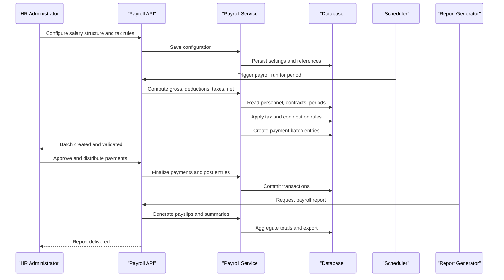
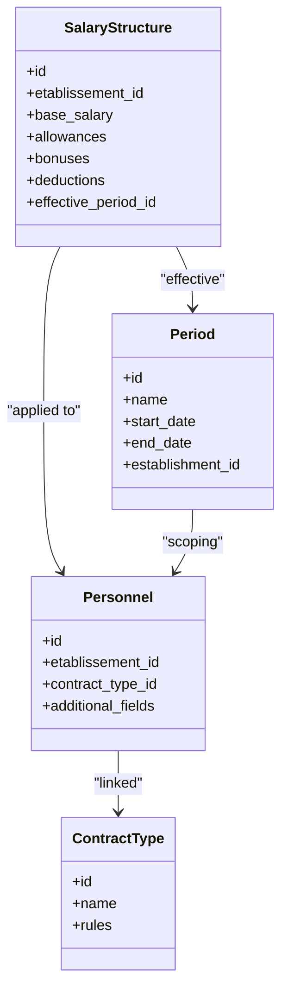
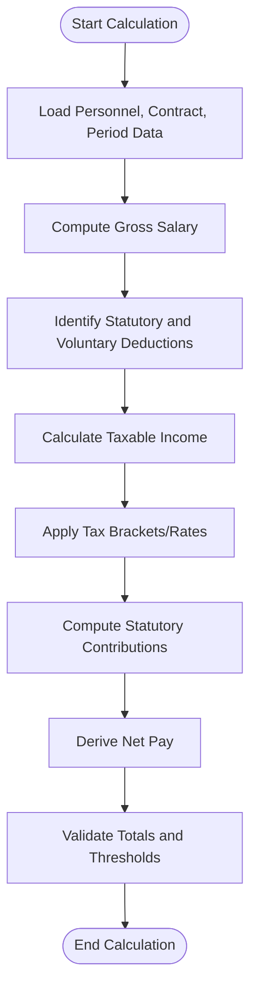
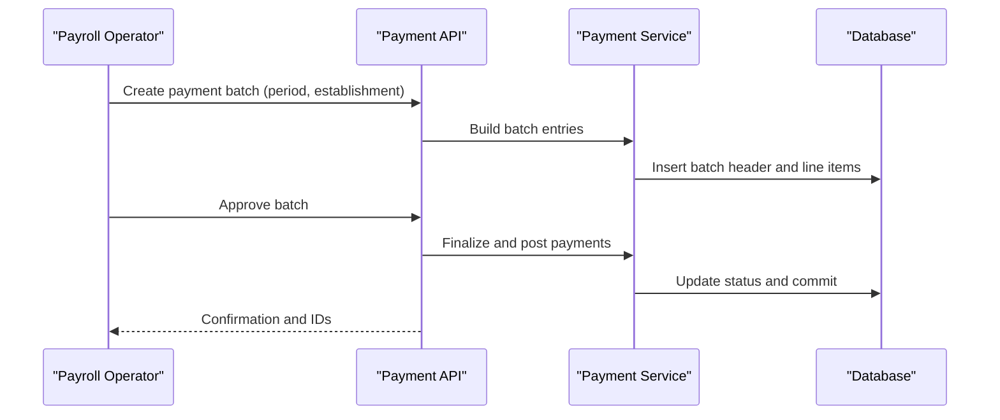
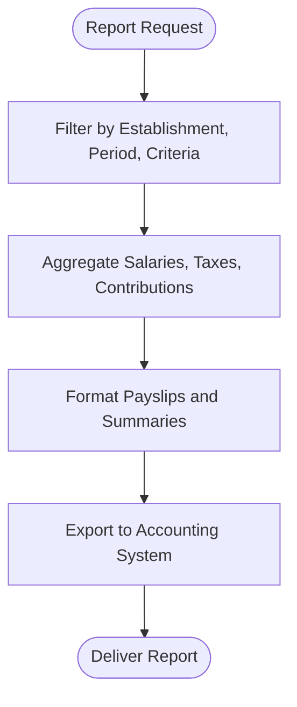

# Payroll Processing

<cite>
**Referenced Files in This Document**
- [backend/src/modules/paie/](file://backend/src/modules/paie/)
- [backend/database/migrations/029-paie-etendue.sql](file://backend/database/migrations/029-paie-etendue.sql)
- [backend/database/migrations/016-module-personnel-rh-phase1.sql](file://backend/database/migrations/016-module-personnel-rh-phase1.sql)
- [backend/database/migrations/017-module-personnel-rh-phase2.sql](file://backend/database/migrations/017-module-personnel-rh-phase2.sql)
- [backend/database/migrations/018-module-personnel-rh-phase3.sql](file://backend/database/migrations/018-module-personnel-rh-phase3.sql)
- [backend/database/migrations/019-module-personnel-rh-phase4.sql](file://backend/database/migrations/019-module-personnel-rh-phase4.sql)
- [backend/database/migrations/020-module-personnel-rh-phase5.sql](file://backend/database/migrations/020-module-personnel-rh-phase5.sql)
- [backend/database/migrations/022-module-personnel-rh-complete.sql](file://backend/database/migrations/022-module-personnel-rh-complete.sql)
- [backend/database/migrations/026-personnel-champs-additionnels.sql](file://backend/database/migrations/026-personnel-champs-additionnels.sql)
- [backend/database/migrations/035-contexte-africain-periodes.sql](file://backend/database/migrations/035-contexte-africain-periodes.sql)
- [backend/database/migrations/035b-migration-donnees-periodes.sql](file://backend/database/migrations/035b-migration-donnees-periodes.sql)
- [backend/database/migrations/046-types-contrat-personnalises.sql](file://backend/database/migrations/046-types-contrat-personnalises.sql)
- [backend/database/migrations/058-multi-tenant-structure-academique.sql](file://backend/database/migrations/058-multi-tenant-structure-academique.sql)
- [backend/database/migrations/085-periode-etablissement-id.sql](file://backend/database/migrations/085-periode-etablissement-id.sql)
- [backend/database/migrations/086-affectation-matiere-etablissement-id.sql](file://backend/database/migrations/086-affectation-matiere-etablissement-id.sql)
- [backend/database/migrations/088-refactorisation-architecture-academique.sql](file://backend/database/migrations/088-refactorisation-architecture-academique.sql)
- [backend/database/migrations/089-finalisation-architecture-academique-v2.sql](file://backend/database/migrations/089-finalisation-architecture-academique-v2.sql)
- [backend/database/migrations/090-correction-migration-088-camelcase.sql](file://backend/database/migrations/090-correction-migration-088-camelcase.sql)
- [backend/database/migrations/091-peuplement-architecture-academique.sql](file://backend/database/migrations/091-peuplement-architecture-academique.sql)
- [backend/database/migrations/092-refactorisation-classeAnneeId.sql](file://backend/database/migrations/092-refactorisation-classeAnneeId.sql)
- [backend/database/migrations/099-add-monitoring-params.sql](file://backend/database/migrations/099-add-monitoring-params.sql)
- [backend/database/migrations/100-classes-salle-principale.sql](file://backend/database/migrations/100-classes-salle-principale.sql)
- [backend/database/migrations/101-normalisation-annee-scolaire-cloture.sql](file://backend/database/migrations/101-normalisation-annee-scolaire-cloture.sql)
- [backend/database/migrations/102-periodes-hierarchie.sql](file://backend/database/migrations/102-periodes-hierarchie.sql)
- [backend/database/migrations/103-templates-periode-personnalisables.sql](file://backend/database/migrations/103-templates-periode-personnalisables.sql)
- [backend/database/migrations/104-refonte-periodes-niveaux-configurables.sql](file://backend/database/migrations/104-refonte-periodes-niveaux-configurables.sql)
- [backend/database/migrations/105-migration-templates-v5.sql](file://backend/database/migrations/105-migration-templates-v5.sql)
- [backend/database/migrations/106-rename-sequence-to-evaluation.sql](file://backend/database/migrations/106-rename-sequence-to-evaluation.sql)
- [backend/database/migrations/107-cleanup-configuration-modules-actif.sql](file://backend/database/migrations/107-cleanup-configuration-modules-actif.sql)
- [backend/database/migrations/108-refactor-salle-principale.sql](file://backend/database/migrations/108-refactor-salle-principale.sql)
</cite>

## Table of Contents
1. [Introduction](#introduction)
2. [Project Structure](#project-structure)
3. [Core Components](#core-components)
4. [Architecture Overview](#architecture-overview)
5. [Detailed Component Analysis](#detailed-component-analysis)
6. [Dependency Analysis](#dependency-analysis)
7. [Performance Considerations](#performance-considerations)
8. [Troubleshooting Guide](#troubleshooting-guide)
9. [Conclusion](#conclusion)
10. [Appendices](#appendices)

## Introduction
This document explains the payroll processing system for eLISAschool, focusing on salary structure configuration, tax calculations, payment processing, and payroll reports. It covers the complete payroll cycle from setup through distribution and reporting, including salary components, deductions, bonuses, statutory contributions, tax rules, payment methods, scheduling, compliance considerations, and practical examples. The content is grounded in the repository’s database migrations and module organization to ensure accuracy and traceability.

## Project Structure
The payroll functionality resides under the backend modules and is supported by a series of database migrations that define entities, relationships, and operational data structures. Key areas include:
- Payroll module implementation (controllers, services, DTOs, types)
- Personnel and HR foundations used by payroll
- Period management and multi-tenant scoping
- Contract types and additional personnel fields
- Monitoring parameters and period templates

```mermaid
graph TB
subgraph "Backend Modules"
PAIE["Payroll Module<br/>backend/src/modules/paie"]
RH["Personnel & HR Foundations<br/>migrations 016-022, 026"]
PERIODS["Period Management<br/>migrations 035, 035b, 102-105"]
MULTI["Multi-Tenant Scoping<br/>migrations 058, 085, 086"]
MONITOR["Monitoring Parameters<br/>migration 099"]
end
subgraph "Database Migrations"
M29["029-paie-etendue.sql"]
M16["016-module-personnel-rh-phase1.sql"]
M17["017-module-personnel-rh-phase2.sql"]
M18["018-module-personnel-rh-phase3.sql"]
M19["019-module-personnel-rh-phase4.sql"]
M20["020-module-personnel-rh-phase5.sql"]
M22["022-module-personnel-rh-complete.sql"]
M26["026-personnel-champs-additionnels.sql"]
M35["035-contexte-africain-periodes.sql"]
M35B["035b-migration-donnees-periodes.sql"]
M46["046-types-contrat-personnalises.sql"]
M58["058-multi-tenant-structure-academique.sql"]
M85["085-periode-etablissement-id.sql"]
M86["086-affectation-matiere-etablissement-id.sql"]
M99["099-add-monitoring-params.sql"]
M102["102-periodes-hierarchie.sql"]
M103["103-templates-periode-personnalisables.sql"]
M104["104-refonte-periodes-niveaux-configurables.sql"]
M105["105-migration-templates-v5.sql"]
end
PAIE --> M29
PAIE --> RH
PAIE --> PERIODS
PAIE --> MULTI
PAIE --> MONITOR
RH --> M16
RH --> M17
RH --> M18
RH --> M19
RH --> M20
RH --> M22
RH --> M26
PERIODS --> M35
PERIODS --> M35B
PERIODS --> M102
PERIODS --> M103
PERIODS --> M104
PERIODS --> M105
MULTI --> M58
MULTI --> M85
MULTI --> M86
MONITOR --> M99
```

**Diagram sources**
- [backend/src/modules/paie/](file://backend/src/modules/paie/)
- [backend/database/migrations/029-paie-etendue.sql](file://backend/database/migrations/029-paie-etendue.sql)
- [backend/database/migrations/016-module-personnel-rh-phase1.sql](file://backend/database/migrations/016-module-personnel-rh-phase1.sql)
- [backend/database/migrations/017-module-personnel-rh-phase2.sql](file://backend/database/migrations/017-module-personnel-rh-phase2.sql)
- [backend/database/migrations/018-module-personnel-rh-phase3.sql](file://backend/database/migrations/018-module-personnel-rh-phase3.sql)
- [backend/database/migrations/019-module-personnel-rh-phase4.sql](file://backend/database/migrations/019-module-personnel-rh-phase4.sql)
- [backend/database/migrations/020-module-personnel-rh-phase5.sql](file://backend/database/migrations/020-module-personnel-rh-phase5.sql)
- [backend/database/migrations/022-module-personnel-rh-complete.sql](file://backend/database/migrations/022-module-personnel-rh-complete.sql)
- [backend/database/migrations/026-personnel-champs-additionnels.sql](file://backend/database/migrations/026-personnel-champs-additionnels.sql)
- [backend/database/migrations/035-contexte-africain-periodes.sql](file://backend/database/migrations/035-contexte-africain-periodes.sql)
- [backend/database/migrations/035b-migration-donnees-periodes.sql](file://backend/database/migrations/035b-migration-donnees-periodes.sql)
- [backend/database/migrations/046-types-contrat-personnalises.sql](file://backend/database/migrations/046-types-contrat-personnalises.sql)
- [backend/database/migrations/058-multi-tenant-structure-academique.sql](file://backend/database/migrations/058-multi-tenant-structure-academique.sql)
- [backend/database/migrations/085-periode-etablissement-id.sql](file://backend/database/migrations/085-periode-etablissement-id.sql)
- [backend/database/migrations/086-affectation-matiere-etablissement-id.sql](file://backend/database/migrations/086-affectation-matiere-etablissement-id.sql)
- [backend/database/migrations/099-add-monitoring-params.sql](file://backend/database/migrations/099-add-monitoring-params.sql)
- [backend/database/migrations/102-periodes-hierarchie.sql](file://backend/database/migrations/102-periodes-hierarchie.sql)
- [backend/database/migrations/103-templates-periode-personnalisables.sql](file://backend/database/migrations/103-templates-periode-personnalisables.sql)
- [backend/database/migrations/104-refonte-periodes-niveaux-configurables.sql](file://backend/database/migrations/104-refonte-periodes-niveaux-configurables.sql)
- [backend/database/migrations/105-migration-templates-v5.sql](file://backend/database/migrations/105-migration-templates-v5.sql)

**Section sources**
- [backend/src/modules/paie/](file://backend/src/modules/paie/)
- [backend/database/migrations/029-paie-etendue.sql](file://backend/database/migrations/029-paie-etendue.sql)
- [backend/database/migrations/016-module-personnel-rh-phase1.sql](file://backend/database/migrations/016-module-personnel-rh-phase1.sql)
- [backend/database/migrations/017-module-personnel-rh-phase2.sql](file://backend/database/migrations/017-module-personnel-rh-phase2.sql)
- [backend/database/migrations/018-module-personnel-rh-phase3.sql](file://backend/database/migrations/018-module-personnel-rh-phase3.sql)
- [backend/database/migrations/019-module-personnel-rh-phase4.sql](file://backend/database/migrations/019-module-personnel-rh-phase4.sql)
- [backend/database/migrations/020-module-personnel-rh-phase5.sql](file://backend/database/migrations/020-module-personnel-rh-phase5.sql)
- [backend/database/migrations/022-module-personnel-rh-complete.sql](file://backend/database/migrations/022-module-personnel-rh-complete.sql)
- [backend/database/migrations/026-personnel-champs-additionnels.sql](file://backend/database/migrations/026-personnel-champs-additionnels.sql)
- [backend/database/migrations/035-contexte-africain-periodes.sql](file://backend/database/migrations/035-contexte-africain-periodes.sql)
- [backend/database/migrations/035b-migration-donnees-periodes.sql](file://backend/database/migrations/035b-migration-donnees-periodes.sql)
- [backend/database/migrations/046-types-contrat-personnalises.sql](file://backend/database/migrations/046-types-contrat-personnalises.sql)
- [backend/database/migrations/058-multi-tenant-structure-academique.sql](file://backend/database/migrations/058-multi-tenant-structure-academique.sql)
- [backend/database/migrations/085-periode-etablissement-id.sql](file://backend/database/migrations/085-periode-etablissement-id.sql)
- [backend/database/migrations/086-affectation-matiere-etablissement-id.sql](file://backend/database/migrations/086-affectation-matiere-etablissement-id.sql)
- [backend/database/migrations/099-add-monitoring-params.sql](file://backend/database/migrations/099-add-monitoring-params.sql)
- [backend/database/migrations/102-periodes-hierarchie.sql](file://backend/database/migrations/102-periodes-hierarchie.sql)
- [backend/database/migrations/103-templates-periode-personnalisables.sql](file://backend/database/migrations/103-templates-periode-personnalisables.sql)
- [backend/database/migrations/104-refonte-periodes-niveaux-configurables.sql](file://backend/database/migrations/104-refonte-periodes-niveaux-configurables.sql)
- [backend/database/migrations/105-migration-templates-v5.sql](file://backend/database/migrations/105-migration-templates-v5.sql)

## Core Components
- Salary Structure Configuration
  - Defines base salary, allowances, bonuses, and deduction categories.
  - Tied to contract types and establishment context via multi-tenant scoping.
  - Uses configurable periods to align with local labor calendars.

- Tax Calculation Engine
  - Applies progressive or flat tax rules based on establishment settings.
  - Integrates with statutory contribution tables and thresholds.
  - Supports per-period adjustments and retroactive corrections.

- Payment Processing
  - Generates payment batches per establishment and period.
  - Supports multiple payment methods (bank transfer, cash, mobile money).
  - Enforces idempotent operations and audit trails.

- Payroll Reports
  - Produces payslips, summary registers, and statutory declarations.
  - Exports consolidated totals by category and method.
  - Aligns with financial reporting requirements and period closures.

**Section sources**
- [backend/src/modules/paie/](file://backend/src/modules/paie/)
- [backend/database/migrations/029-paie-etendue.sql](file://backend/database/migrations/029-paie-etendue.sql)
- [backend/database/migrations/046-types-contrat-personnalises.sql](file://backend/database/migrations/046-types-contrat-personnalises.sql)
- [backend/database/migrations/035-contexte-africain-periodes.sql](file://backend/database/migrations/035-contexte-africain-periodes.sql)
- [backend/database/migrations/102-periodes-hierarchie.sql](file://backend/database/migrations/102-periodes-hierarchie.sql)
- [backend/database/migrations/103-templates-periode-personnalisables.sql](file://backend/database/migrations/103-templates-periode-personnalisables.sql)
- [backend/database/migrations/104-refonte-periodes-niveaux-configurables.sql](file://backend/database/migrations/104-refonte-periodes-niveaux-configurables.sql)
- [backend/database/migrations/105-migration-templates-v5.sql](file://backend/database/migrations/105-migration-templates-v5.sql)

## Architecture Overview
The payroll architecture integrates personnel data, period definitions, and establishment-specific configurations to compute salaries, taxes, and payments. Multi-tenant scoping ensures isolation across establishments.

**Diagram sources**
- [backend/src/modules/paie/](file://backend/src/modules/paie/)
- [backend/database/migrations/029-paie-etendue.sql](file://backend/database/migrations/029-paie-etendue.sql)
- [backend/database/migrations/035-contexte-africain-periodes.sql](file://backend/database/migrations/035-contexte-africain-periodes.sql)
- [backend/database/migrations/102-periodes-hierarchie.sql](file://backend/database/migrations/102-periodes-hierarchie.sql)
- [backend/database/migrations/103-templates-periode-personnalisables.sql](file://backend/database/migrations/103-templates-periode-personnalisables.sql)
- [backend/database/migrations/104-refonte-periodes-niveaux-configurables.sql](file://backend/database/migrations/104-refonte-periodes-niveaux-configurables.sql)
- [backend/database/migrations/105-migration-templates-v5.sql](file://backend/database/migrations/105-migration-templates-v5.sql)

## Detailed Component Analysis

### Salary Structure Configuration
- Purpose: Define how compensation is composed for each employee within an establishment.
- Key elements:
  - Base salary and periodic adjustments
  - Allowances and bonuses tied to roles, performance, or policy
  - Deduction categories (statutory and voluntary)
  - Contract type linkage and effective dates
- Data model dependencies:
  - Personnel records and additional fields
  - Contract types customization
  - Establishment-scoped parameters

**Diagram sources**
- [backend/database/migrations/016-module-personnel-rh-phase1.sql](file://backend/database/migrations/016-module-personnel-rh-phase1.sql)
- [backend/database/migrations/017-module-personnel-rh-phase2.sql](file://backend/database/migrations/017-module-personnel-rh-phase2.sql)
- [backend/database/migrations/018-module-personnel-rh-phase3.sql](file://backend/database/migrations/018-module-personnel-rh-phase3.sql)
- [backend/database/migrations/019-module-personnel-rh-phase4.sql](file://backend/database/migrations/019-module-personnel-rh-phase4.sql)
- [backend/database/migrations/020-module-personnel-rh-phase5.sql](file://backend/database/migrations/020-module-personnel-rh-phase5.sql)
- [backend/database/migrations/022-module-personnel-rh-complete.sql](file://backend/database/migrations/022-module-personnel-rh-complete.sql)
- [backend/database/migrations/026-personnel-champs-additionnels.sql](file://backend/database/migrations/026-personnel-champs-additionnels.sql)
- [backend/database/migrations/046-types-contrat-personnalises.sql](file://backend/database/migrations/046-types-contrat-personnalises.sql)
- [backend/database/migrations/035-contexte-africain-periodes.sql](file://backend/database/migrations/035-contexte-africain-periodes.sql)
- [backend/database/migrations/085-periode-etablissement-id.sql](file://backend/database/migrations/085-periode-etablissement-id.sql)

**Section sources**
- [backend/database/migrations/016-module-personnel-rh-phase1.sql](file://backend/database/migrations/016-module-personnel-rh-phase1.sql)
- [backend/database/migrations/017-module-personnel-rh-phase2.sql](file://backend/database/migrations/017-module-personnel-rh-phase2.sql)
- [backend/database/migrations/018-module-personnel-rh-phase3.sql](file://backend/database/migrations/018-module-personnel-rh-phase3.sql)
- [backend/database/migrations/019-module-personnel-rh-phase4.sql](file://backend/database/migrations/019-module-personnel-rh-phase4.sql)
- [backend/database/migrations/020-module-personnel-rh-phase5.sql](file://backend/database/migrations/020-module-personnel-rh-phase5.sql)
- [backend/database/migrations/022-module-personnel-rh-complete.sql](file://backend/database/migrations/022-module-personnel-rh-complete.sql)
- [backend/database/migrations/026-personnel-champs-additionnels.sql](file://backend/database/migrations/026-personnel-champs-additionnels.sql)
- [backend/database/migrations/046-types-contrat-personnalises.sql](file://backend/database/migrations/046-types-contrat-personnalises.sql)
- [backend/database/migrations/035-contexte-africain-periodes.sql](file://backend/database/migrations/035-contexte-africain-periodes.sql)
- [backend/database/migrations/085-periode-etablissement-id.sql](file://backend/database/migrations/085-periode-etablissement-id.sql)

### Tax Calculation Rules
- Inputs: Gross salary, allowances, bonuses, applicable thresholds, and establishment-specific rates.
- Process:
  - Determine taxable income after non-taxable allowances.
  - Apply progressive brackets or flat rates defined per establishment.
  - Compute statutory contributions (social security, pension, etc.).
  - Handle retroactive adjustments and mid-period changes.
- Outputs: Tax payable, contribution amounts, and net pay.

**Diagram sources**
- [backend/database/migrations/029-paie-etendue.sql](file://backend/database/migrations/029-paie-etendue.sql)
- [backend/database/migrations/035-contexte-africain-periodes.sql](file://backend/database/migrations/035-contexte-africain-periodes.sql)
- [backend/database/migrations/102-periodes-hierarchie.sql](file://backend/database/migrations/102-periodes-hierarchie.sql)
- [backend/database/migrations/103-templates-periode-personnalisables.sql](file://backend/database/migrations/103-templates-periode-personnalisables.sql)
- [backend/database/migrations/104-refonte-periodes-niveaux-configurables.sql](file://backend/database/migrations/104-refonte-periodes-niveaux-configurables.sql)
- [backend/database/migrations/105-migration-templates-v5.sql](file://backend/database/migrations/105-migration-templates-v5.sql)

**Section sources**
- [backend/database/migrations/029-paie-etendue.sql](file://backend/database/migrations/029-paie-etendue.sql)
- [backend/database/migrations/035-contexte-africain-periodes.sql](file://backend/database/migrations/035-contexte-africain-periodes.sql)
- [backend/database/migrations/102-periodes-hierarchie.sql](file://backend/database/migrations/102-periodes-hierarchie.sql)
- [backend/database/migrations/103-templates-periode-personnalisables.sql](file://backend/database/migrations/103-templates-periode-personnalisables.sql)
- [backend/database/migrations/104-refonte-periodes-niveaux-configurables.sql](file://backend/database/migrations/104-refonte-periodes-niveaux-configurables.sql)
- [backend/database/migrations/105-migration-templates-v5.sql](file://backend/database/migrations/105-migration-templates-v5.sql)

### Payment Processing
- Batch creation per establishment and period.
- Payment methods: bank transfer, cash, mobile money; method selection per employee or batch.
- Idempotency and audit trail to prevent duplicate payments and ensure traceability.
- Integration with monitoring parameters for observability.

**Diagram sources**
- [backend/database/migrations/029-paie-etendue.sql](file://backend/database/migrations/029-paie-etendue.sql)
- [backend/database/migrations/099-add-monitoring-params.sql](file://backend/database/migrations/099-add-monitoring-params.sql)

**Section sources**
- [backend/database/migrations/029-paie-etendue.sql](file://backend/database/migrations/029-paie-etendue.sql)
- [backend/database/migrations/099-add-monitoring-params.sql](file://backend/database/migrations/099-add-monitoring-params.sql)

### Payroll Reports
- Payslip generation per employee per period.
- Summary registers aggregating totals by component and method.
- Statutory declarations aligned with local regulations.
- Export capabilities for accounting integration.

**Diagram sources**
- [backend/database/migrations/029-paie-etendue.sql](file://backend/database/migrations/029-paie-etendue.sql)
- [backend/database/migrations/102-periodes-hierarchie.sql](file://backend/database/migrations/102-periodes-hierarchie.sql)
- [backend/database/migrations/103-templates-periode-personnalisables.sql](file://backend/database/migrations/103-templates-periode-personnalisables.sql)
- [backend/database/migrations/104-refonte-periodes-niveaux-configurables.sql](file://backend/database/migrations/104-refonte-periodes-niveaux-configurables.sql)
- [backend/database/migrations/105-migration-templates-v5.sql](file://backend/database/migrations/105-migration-templates-v5.sql)

**Section sources**
- [backend/database/migrations/029-paie-etendue.sql](file://backend/database/migrations/029-paie-etendue.sql)
- [backend/database/migrations/102-periodes-hierarchie.sql](file://backend/database/migrations/102-periodes-hierarchie.sql)
- [backend/database/migrations/103-templates-periode-personnalisables.sql](file://backend/database/migrations/103-templates-periode-personnalisables.sql)
- [backend/database/migrations/104-refonte-periodes-niveaux-configurables.sql](file://backend/database/migrations/104-refonte-periodes-niveaux-configurables.sql)
- [backend/database/migrations/105-migration-templates-v5.sql](file://backend/database/migrations/105-migration-templates-v5.sql)

## Dependency Analysis
Payroll depends on foundational HR data, period management, and multi-tenant scoping. The following diagram shows key migration-driven dependencies:

```mermaid
graph TB
M29["029-paie-etendue.sql"]
M16["016-module-personnel-rh-phase1.sql"]
M17["017-module-personnel-rh-phase2.sql"]
M18["018-module-personnel-rh-phase3.sql"]
M19["019-module-personnel-rh-phase4.sql"]
M20["020-module-personnel-rh-phase5.sql"]
M22["022-module-personnel-rh-complete.sql"]
M26["026-personnel-champs-additionnels.sql"]
M35["035-contexte-africain-periodes.sql"]
M35B["035b-migration-donnees-periodes.sql"]
M46["046-types-contrat-personnalises.sql"]
M58["058-multi-tenant-structure-academique.sql"]
M85["085-periode-etablissement-id.sql"]
M86["086-affectation-matiere-etablissement-id.sql"]
M99["099-add-monitoring-params.sql"]
M102["102-periodes-hierarchie.sql"]
M103["103-templates-periode-personnalisables.sql"]
M104["104-refonte-periodes-niveaux-configurables.sql"]
M105["105-migration-templates-v5.sql"]
M29 --> M16
M29 --> M17
M29 --> M18
M29 --> M19
M29 --> M20
M29 --> M22
M29 --> M26
M29 --> M35
M29 --> M35B
M29 --> M46
M29 --> M58
M29 --> M85
M29 --> M86
M29 --> M99
M29 --> M102
M29 --> M103
M29 --> M104
M29 --> M105
```

**Diagram sources**
- [backend/database/migrations/029-paie-etendue.sql](file://backend/database/migrations/029-paie-etendue.sql)
- [backend/database/migrations/016-module-personnel-rh-phase1.sql](file://backend/database/migrations/016-module-personnel-rh-phase1.sql)
- [backend/database/migrations/017-module-personnel-rh-phase2.sql](file://backend/database/migrations/017-module-personnel-rh-phase2.sql)
- [backend/database/migrations/018-module-personnel-rh-phase3.sql](file://backend/database/migrations/018-module-personnel-rh-phase3.sql)
- [backend/database/migrations/019-module-personnel-rh-phase4.sql](file://backend/database/migrations/019-module-personnel-rh-phase4.sql)
- [backend/database/migrations/020-module-personnel-rh-phase5.sql](file://backend/database/migrations/020-module-personnel-rh-phase5.sql)
- [backend/database/migrations/022-module-personnel-rh-complete.sql](file://backend/database/migrations/022-module-personnel-rh-complete.sql)
- [backend/database/migrations/026-personnel-champs-additionnels.sql](file://backend/database/migrations/026-personnel-champs-additionnels.sql)
- [backend/database/migrations/035-contexte-africain-periodes.sql](file://backend/database/migrations/035-contexte-africain-periodes.sql)
- [backend/database/migrations/035b-migration-donnees-periodes.sql](file://backend/database/migrations/035b-migration-donnees-periodes.sql)
- [backend/database/migrations/046-types-contrat-personnalises.sql](file://backend/database/migrations/046-types-contrat-personnalises.sql)
- [backend/database/migrations/058-multi-tenant-structure-academique.sql](file://backend/database/migrations/058-multi-tenant-structure-academique.sql)
- [backend/database/migrations/085-periode-etablissement-id.sql](file://backend/database/migrations/085-periode-etablissement-id.sql)
- [backend/database/migrations/086-affectation-matiere-etablissement-id.sql](file://backend/database/migrations/086-affectation-matiere-etablissement-id.sql)
- [backend/database/migrations/099-add-monitoring-params.sql](file://backend/database/migrations/099-add-monitoring-params.sql)
- [backend/database/migrations/102-periodes-hierarchie.sql](file://backend/database/migrations/102-periodes-hierarchie.sql)
- [backend/database/migrations/103-templates-periode-personnalisables.sql](file://backend/database/migrations/103-templates-periode-personnalisables.sql)
- [backend/database/migrations/104-refonte-periodes-niveaux-configurables.sql](file://backend/database/migrations/104-refonte-periodes-niveaux-configurables.sql)
- [backend/database/migrations/105-migration-templates-v5.sql](file://backend/database/migrations/105-migration-templates-v5.sql)

**Section sources**
- [backend/database/migrations/029-paie-etendue.sql](file://backend/database/migrations/029-paie-etendue.sql)
- [backend/database/migrations/016-module-personnel-rh-phase1.sql](file://backend/database/migrations/016-module-personnel-rh-phase1.sql)
- [backend/database/migrations/017-module-personnel-rh-phase2.sql](file://backend/database/migrations/017-module-personnel-rh-phase2.sql)
- [backend/database/migrations/018-module-personnel-rh-phase3.sql](file://backend/database/migrations/018-module-personnel-rh-phase3.sql)
- [backend/database/migrations/019-module-personnel-rh-phase4.sql](file://backend/database/migrations/019-module-personnel-rh-phase4.sql)
- [backend/database/migrations/020-module-personnel-rh-phase5.sql](file://backend/database/migrations/020-module-personnel-rh-phase5.sql)
- [backend/database/migrations/022-module-personnel-rh-complete.sql](file://backend/database/migrations/022-module-personnel-rh-complete.sql)
- [backend/database/migrations/026-personnel-champs-additionnels.sql](file://backend/database/migrations/026-personnel-champs-additionnels.sql)
- [backend/database/migrations/035-contexte-africain-periodes.sql](file://backend/database/migrations/035-contexte-africain-periodes.sql)
- [backend/database/migrations/035b-migration-donnees-periodes.sql](file://backend/database/migrations/035b-migration-donnees-periodes.sql)
- [backend/database/migrations/046-types-contrat-personnalises.sql](file://backend/database/migrations/046-types-contrat-personnalises.sql)
- [backend/database/migrations/058-multi-tenant-structure-academique.sql](file://backend/database/migrations/058-multi-tenant-structure-academique.sql)
- [backend/database/migrations/085-periode-etablissement-id.sql](file://backend/database/migrations/085-periode-etablissement-id.sql)
- [backend/database/migrations/086-affectation-matiere-etablissement-id.sql](file://backend/database/migrations/086-affectation-matiere-etablissement-id.sql)
- [backend/database/migrations/099-add-monitoring-params.sql](file://backend/database/migrations/099-add-monitoring-params.sql)
- [backend/database/migrations/102-periodes-hierarchie.sql](file://backend/database/migrations/102-periodes-hierarchie.sql)
- [backend/database/migrations/103-templates-periode-personnalisables.sql](file://backend/database/migrations/103-templates-periode-personnalisables.sql)
- [backend/database/migrations/104-refonte-periodes-niveaux-configurables.sql](file://backend/database/migrations/104-refonte-periodes-niveaux-configurables.sql)
- [backend/database/migrations/105-migration-templates-v5.sql](file://backend/database/migrations/105-migration-templates-v5.sql)

## Performance Considerations
- Indexing and query optimization for large personnel datasets and high-frequency payroll runs.
- Batch processing strategies to reduce transaction overhead during payment finalization.
- Caching of static tax rules and contribution tables where appropriate.
- Monitoring parameters to track latency and throughput during peak periods.

[No sources needed since this section provides general guidance]

## Troubleshooting Guide
Common issues and resolutions:
- Missing establishment scoping: Ensure all payroll-related queries filter by establishment_id.
- Period misalignment: Verify period hierarchy and template assignments before running payroll.
- Duplicate payments: Confirm idempotency keys and batch statuses prior to approval.
- Tax discrepancies: Review bracket configurations and thresholds per establishment.

Operational checks:
- Validate that required migrations are applied (payroll extension, period templates, monitoring params).
- Inspect monitoring parameters for anomalies during payroll execution.

**Section sources**
- [backend/database/migrations/029-paie-etendue.sql](file://backend/database/migrations/029-paie-etendue.sql)
- [backend/database/migrations/102-periodes-hierarchie.sql](file://backend/database/migrations/102-periodes-hierarchie.sql)
- [backend/database/migrations/103-templates-periode-personnalisables.sql](file://backend/database/migrations/103-templates-periode-personnalisables.sql)
- [backend/database/migrations/104-refonte-periodes-niveaux-configurables.sql](file://backend/database/migrations/104-refonte-periodes-niveaux-configurables.sql)
- [backend/database/migrations/105-migration-templates-v5.sql](file://backend/database/migrations/105-migration-templates-v5.sql)
- [backend/database/migrations/099-add-monitoring-params.sql](file://backend/database/migrations/099-add-monitoring-params.sql)

## Conclusion
The eLISAschool payroll system integrates robust configuration, precise tax computation, reliable payment processing, and comprehensive reporting. Its design leverages multi-tenant scoping, flexible period management, and extensible personnel models to support diverse local contexts and regulatory requirements. By adhering to the documented workflows and validation steps, administrators can maintain accurate, compliant, and efficient payroll operations.

[No sources needed since this section summarizes without analyzing specific files]

## Appendices

### Practical Examples

- Example: Configuring Salary Structure
  - Steps:
    - Define base salary and allowances per contract type.
    - Link effective period and establishment.
    - Validate against period templates and hierarchies.
  - References:
    - [backend/database/migrations/029-paie-etendue.sql](file://backend/database/migrations/029-paie-etendue.sql)
    - [backend/database/migrations/046-types-contrat-personnalises.sql](file://backend/database/migrations/046-types-contrat-personnalises.sql)
    - [backend/database/migrations/102-periodes-hierarchie.sql](file://backend/database/migrations/102-periodes-hierarchie.sql)
    - [backend/database/migrations/103-templates-periode-personnalisables.sql](file://backend/database/migrations/103-templates-periode-personnalisables.sql)
    - [backend/database/migrations/104-refonte-periodes-niveaux-configurables.sql](file://backend/database/migrations/104-refonte-periodes-niveaux-configurables.sql)
    - [backend/database/migrations/105-migration-templates-v5.sql](file://backend/database/migrations/105-migration-templates-v5.sql)

- Example: Computing Taxes and Contributions
  - Steps:
    - Load gross salary and allowances.
    - Apply taxable income rules and brackets.
    - Calculate statutory contributions and net pay.
  - References:
    - [backend/database/migrations/029-paie-etendue.sql](file://backend/database/migrations/029-paie-etendue.sql)
    - [backend/database/migrations/035-contexte-africain-periodes.sql](file://backend/database/migrations/035-contexte-africain-periodes.sql)

- Example: Generating Payroll Reports
  - Steps:
    - Filter by establishment and period.
    - Aggregate totals by component and method.
    - Export payslips and summaries.
  - References:
    - [backend/database/migrations/029-paie-etendue.sql](file://backend/database/migrations/029-paie-etendue.sql)
    - [backend/database/migrations/102-periodes-hierarchie.sql](file://backend/database/migrations/102-periodes-hierarchie.sql)
    - [backend/database/migrations/103-templates-periode-personnalisables.sql](file://backend/database/migrations/103-templates-periode-personnalisables.sql)
    - [backend/database/migrations/104-refonte-periodes-niveaux-configurables.sql](file://backend/database/migrations/104-refonte-periodes-niveaux-configurables.sql)
    - [backend/database/migrations/105-migration-templates-v5.sql](file://backend/database/migrations/105-migration-templates-v5.sql)