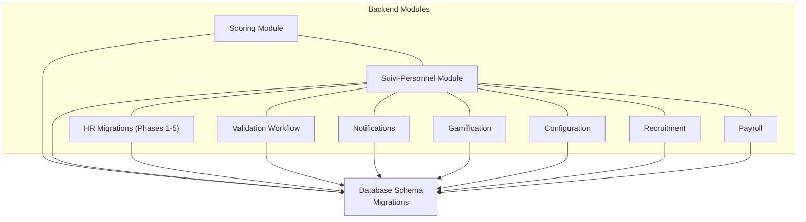
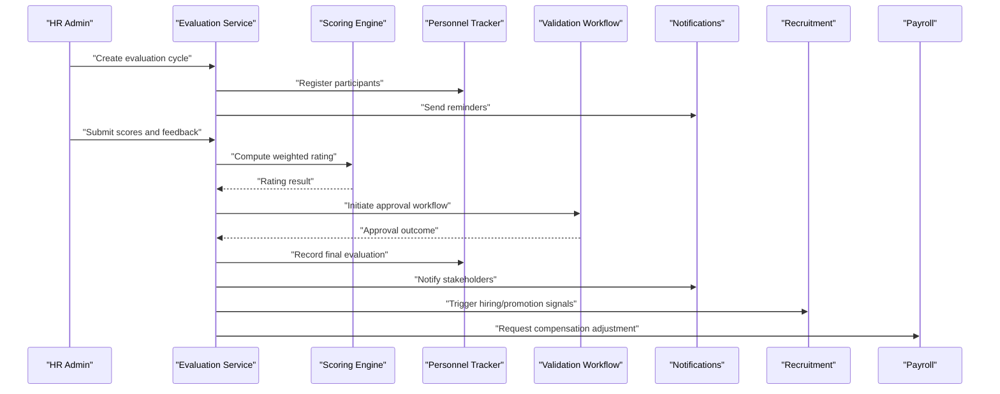
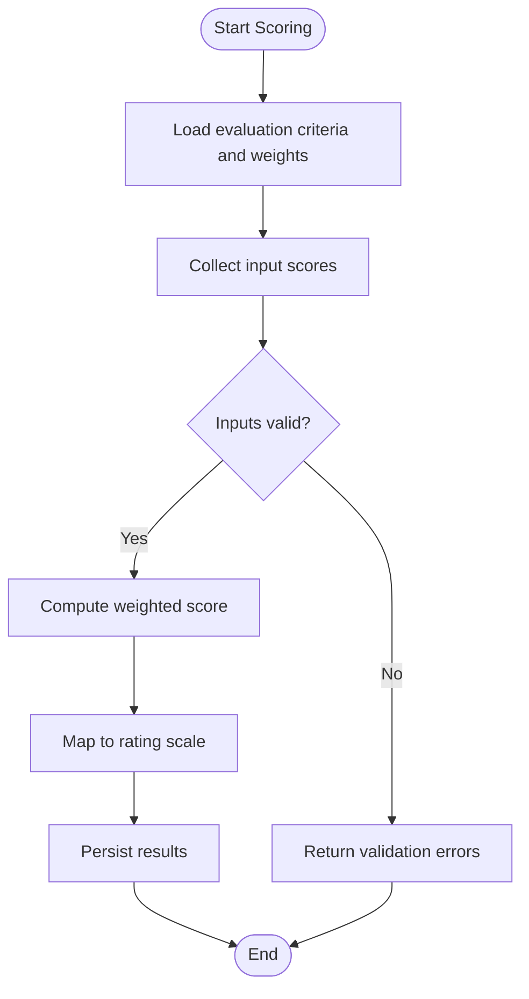
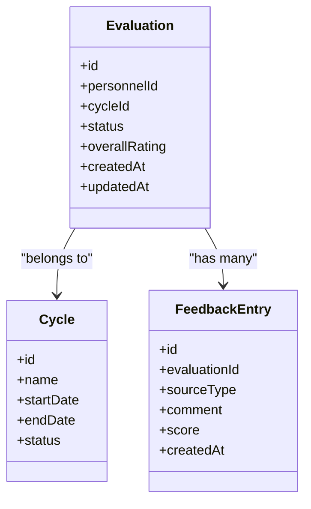
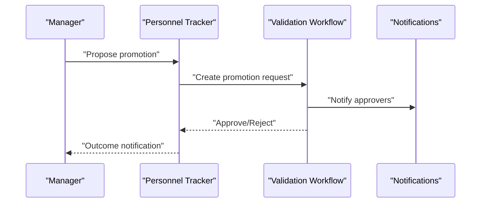
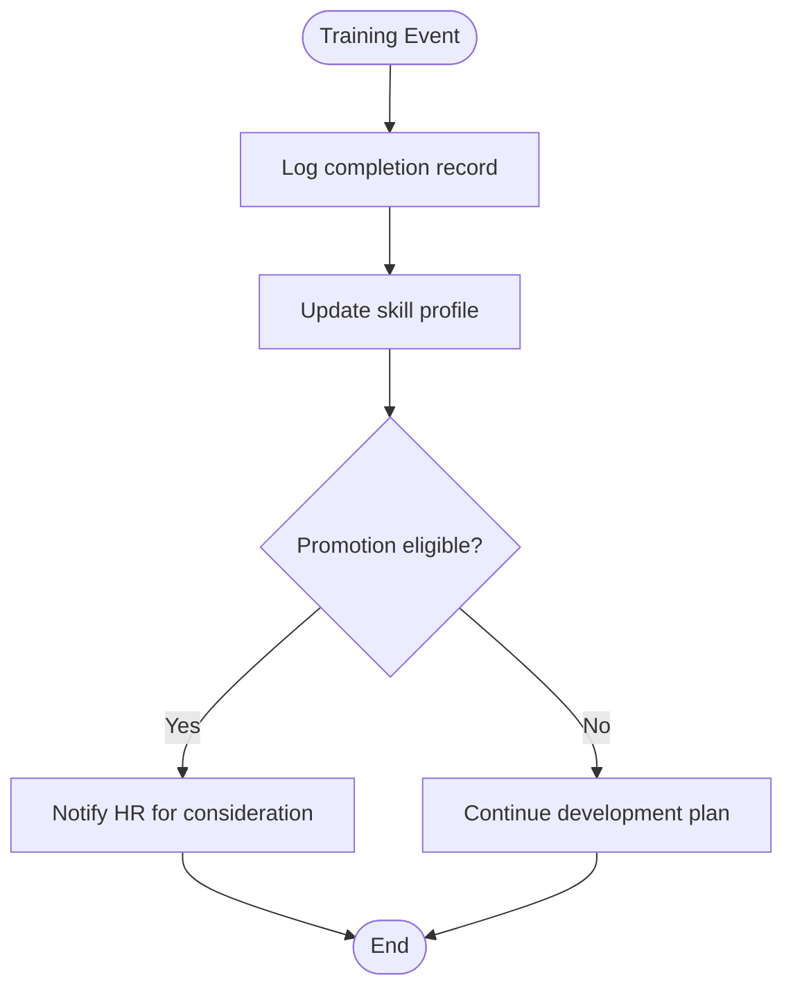
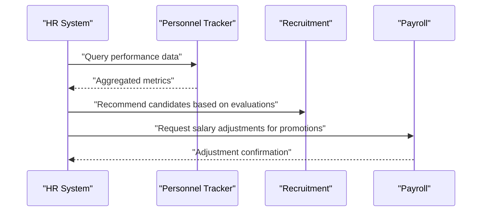
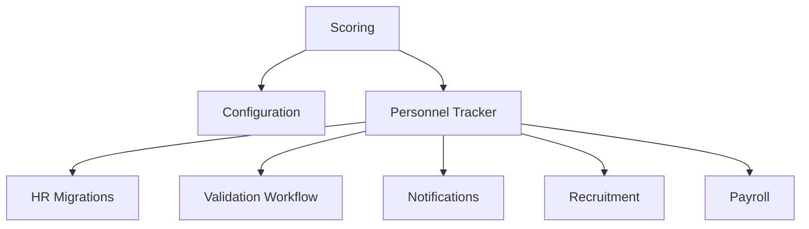

# Performance Evaluation

<cite>
**Referenced Files in This Document**
- [backend/src/modules/scoring/](file://backend/src/modules/scoring/)
- [backend/src/modules/suivi-personnel/](file://backend/src/modules/suivi-personnel/)
- [backend/database/migrations/039-scoring-personnel.ts](file://backend/database/migrations/039-scoring-personnel.ts)
- [backend/database/migrations/031-suivi-personnel.sql](file://backend/database/migrations/031-suivi-personnel.sql)
- [backend/database/migrations/016-module-personnel-rh-phase1.sql](file://backend/database/migrations/016-module-personnel-rh-phase1.sql)
- [backend/database/migrations/017-module-personnel-rh-phase2.sql](file://backend/database/migrations/017-module-personnel-rh-phase2.sql)
- [backend/database/migrations/018-module-personnel-rh-phase3.sql](file://backend/database/migrations/018-module-personnel-rh-phase3.sql)
- [backend/database/migrations/019-module-personnel-rh-phase4.sql](file://backend/database/migrations/019-module-personnel-rh-phase4.sql)
- [backend/database/migrations/020-module-personnel-rh-phase5.sql](file://backend/database/migrations/020-module-personnel-rh-phase5.sql)
- [backend/database/migrations/021-module-personnel-rh-permissions-attribution.sql](file://backend/database/migrations/021-module-personnel-rh-permissions-attribution.sql)
- [backend/database/migrations/022-module-personnel-rh-complete.sql](file://backend/database/migrations/022-module-personnel-rh-complete.sql)
- [backend/database/migrations/026-personnel-champs-additionnels.sql](file://backend/database/migrations/026-personnel-champs-additionnels.sql)
- [backend/scripts/run-scoring-migration.ts](file://backend/scripts/run-scoring-migration.ts)
- [backend/scripts/run-scoring-migration-v2.ts](file://backend/scripts/run-scoring-migration-v2.ts)
- [backend/src/shared/constants/personnel.constants.ts](file://backend/src/shared/constants/personnel.constants.ts)
- [backend/src/modules/recrutement/](file://backend/src/modules/recrutement/)
- [backend/src/modules/paie/](file://backend/src/modules/paie/)
- [backend/src/modules/validation-workflow/](file://backend/src/modules/validation-workflow/)
- [backend/src/modules/notifications/](file://backend/src/modules/notifications/)
- [backend/src/modules/gamification/](file://backend/src/modules/gamification/)
- [backend/src/modules/configuration/](file://backend/src/modules/configuration/)
</cite>

## Table of Contents
1. [Introduction](#introduction)
2. [Project Structure](#project-structure)
3. [Core Components](#core-components)
4. [Architecture Overview](#architecture-overview)
5. [Detailed Component Analysis](#detailed-component-analysis)
6. [Dependency Analysis](#dependency-analysis)
7. [Performance Considerations](#performance-considerations)
8. [Troubleshooting Guide](#troubleshooting-guide)
9. [Conclusion](#conclusion)
10. [Appendices](#appendices)

## Introduction
This document describes eLISAschool’s performance evaluation system for personnel, focusing on:
- Performance metrics and scoring models
- Review workflows and feedback collection
- Career progression and promotion workflows
- Training management and skill development tracking
- Evaluation criteria, rating calculations, and reporting
- Integration points with HR planning and compensation systems

The content synthesizes the backend modules, database schema, migrations, and scripts related to personnel tracking and scoring to provide a comprehensive guide for administrators, HR managers, and developers.

## Project Structure
The performance evaluation system is implemented across several backend modules and database migrations:
- Scoring module: defines scoring entities, rules, and calculation logic
- Personnel tracking (suivi-personnel): records evaluations, reviews, and career events
- HR module migrations: define core HR tables, roles, contracts, and lifecycle events
- Validation workflow: orchestrates multi-step approvals for evaluations and promotions
- Notifications: triggers alerts for review cycles and actions
- Gamification: optional engagement layer that can reflect training achievements
- Configuration: manages evaluation templates, cycles, and parameters
- Recruitment and Payroll: integration points for hiring decisions and compensation adjustments

**Diagram sources**
- [backend/src/modules/scoring/](file://backend/src/modules/scoring/)
- [backend/src/modules/suivi-personnel/](file://backend/src/modules/suivi-personnel/)
- [backend/database/migrations/039-scoring-personnel.ts](file://backend/database/migrations/039-scoring-personnel.ts)
- [backend/database/migrations/031-suivi-personnel.sql](file://backend/database/migrations/031-suivi-personnel.sql)
- [backend/database/migrations/016-module-personnel-rh-phase1.sql](file://backend/database/migrations/016-module-personnel-rh-phase1.sql)
- [backend/database/migrations/017-module-personnel-rh-phase2.sql](file://backend/database/migrations/017-module-personnel-rh-phase2.sql)
- [backend/database/migrations/018-module-personnel-rh-phase3.sql](file://backend/database/migrations/018-module-personnel-rh-phase3.sql)
- [backend/database/migrations/019-module-personnel-rh-phase4.sql](file://backend/database/migrations/019-module-personnel-rh-phase4.sql)
- [backend/database/migrations/020-module-personnel-rh-phase5.sql](file://backend/database/migrations/020-module-personnel-rh-phase5.sql)
- [backend/database/migrations/021-module-personnel-rh-permissions-attribution.sql](file://backend/database/migrations/021-module-personnel-rh-permissions-attribution.sql)
- [backend/database/migrations/022-module-personnel-rh-complete.sql](file://backend/database/migrations/022-module-personnel-rh-complete.sql)
- [backend/database/migrations/026-personnel-champs-additionnels.sql](file://backend/database/migrations/026-personnel-champs-additionnels.sql)
- [backend/src/modules/validation-workflow/](file://backend/src/modules/validation-workflow/)
- [backend/src/modules/notifications/](file://backend/src/modules/notifications/)
- [backend/src/modules/gamification/](file://backend/src/modules/gamification/)
- [backend/src/modules/configuration/](file://backend/src/modules/configuration/)
- [backend/src/modules/recrutement/](file://backend/src/modules/recrutement/)
- [backend/src/modules/paie/](file://backend/src/modules/paie/)

**Section sources**
- [backend/src/modules/scoring/](file://backend/src/modules/scoring/)
- [backend/src/modules/suivi-personnel/](file://backend/src/modules/suivi-personnel/)
- [backend/database/migrations/039-scoring-personnel.ts](file://backend/database/migrations/039-scoring-personnel.ts)
- [backend/database/migrations/031-suivi-personnel.sql](file://backend/database/migrations/031-suivi-personnel.sql)
- [backend/database/migrations/016-module-personnel-rh-phase1.sql](file://backend/database/migrations/016-module-personnel-rh-phase1.sql)
- [backend/database/migrations/017-module-personnel-rh-phase2.sql](file://backend/database/migrations/017-module-personnel-rh-phase2.sql)
- [backend/database/migrations/018-module-personnel-rh-phase3.sql](file://backend/database/migrations/018-module-personnel-rh-phase3.sql)
- [backend/database/migrations/019-module-personnel-rh-phase4.sql](file://backend/database/migrations/019-module-personnel-rh-phase4.sql)
- [backend/database/migrations/020-module-personnel-rh-phase5.sql](file://backend/database/migrations/020-module-personnel-rh-phase5.sql)
- [backend/database/migrations/021-module-personnel-rh-permissions-attribution.sql](file://backend/database/migrations/021-module-personnel-rh-permissions-attribution.sql)
- [backend/database/migrations/022-module-personnel-rh-complete.sql](file://backend/database/migrations/022-module-personnel-rh-complete.sql)
- [backend/database/migrations/026-personnel-champs-additionnels.sql](file://backend/database/migrations/026-personnel-champs-additionnels.sql)
- [backend/src/modules/validation-workflow/](file://backend/src/modules/validation-workflow/)
- [backend/src/modules/notifications/](file://backend/src/modules/notifications/)
- [backend/src/modules/gamification/](file://backend/src/modules/gamification/)
- [backend/src/modules/configuration/](file://backend/src/modules/configuration/)
- [backend/src/modules/recrutement/](file://backend/src/modules/recrutement/)
- [backend/src/modules/paie/](file://backend/src/modules/paie/)

## Core Components
- Scoring Model: Defines competencies, weights, and scoring rules used to compute performance ratings.
- Evaluation Records: Stores individual assessments, comments, and timestamps.
- Review Cycles: Configurable periods (quarterly, annual) with start/end dates and status transitions.
- Feedback Collection: Multi-source inputs from supervisors, peers, and self-assessments.
- Career Progression: Tracks role changes, promotions, and skill milestones.
- Training Management: Logs completed trainings, certifications, and skill updates.
- Validation Workflow: Enforces approval steps before finalizing evaluations or promotions.
- Notifications: Alerts stakeholders about upcoming reviews, pending approvals, and outcomes.
- Configuration: Manages evaluation templates, rating scales, and cycle parameters.
- Integrations: Links to recruitment (hiring decisions) and payroll (compensation adjustments).

**Section sources**
- [backend/src/modules/scoring/](file://backend/src/modules/scoring/)
- [backend/src/modules/suivi-personnel/](file://backend/src/modules/suivi-personnel/)
- [backend/database/migrations/039-scoring-personnel.ts](file://backend/database/migrations/039-scoring-personnel.ts)
- [backend/database/migrations/031-suivi-personnel.sql](file://backend/database/migrations/031-suivi-personnel.sql)
- [backend/database/migrations/016-module-personnel-rh-phase1.sql](file://backend/database/migrations/016-module-personnel-rh-phase1.sql)
- [backend/database/migrations/017-module-personnel-rh-phase2.sql](file://backend/database/migrations/017-module-personnel-rh-phase2.sql)
- [backend/database/migrations/018-module-personnel-rh-phase3.sql](file://backend/database/migrations/018-module-personnel-rh-phase3.sql)
- [backend/database/migrations/019-module-personnel-rh-phase4.sql](file://backend/database/migrations/019-module-personnel-rh-phase4.sql)
- [backend/database/migrations/020-module-personnel-rh-phase5.sql](file://backend/database/migrations/020-module-personnel-rh-phase5.sql)
- [backend/database/migrations/021-module-personnel-rh-permissions-attribution.sql](file://backend/database/migrations/021-module-personnel-rh-permissions-attribution.sql)
- [backend/database/migrations/022-module-personnel-rh-complete.sql](file://backend/database/migrations/022-module-personnel-rh-complete.sql)
- [backend/database/migrations/026-personnel-champs-additionnels.sql](file://backend/database/migrations/026-personnel-champs-additionnels.sql)
- [backend/src/modules/validation-workflow/](file://backend/src/modules/validation-workflow/)
- [backend/src/modules/notifications/](file://backend/src/modules/notifications/)
- [backend/src/modules/gamification/](file://backend/src/modules/gamification/)
- [backend/src/modules/configuration/](file://backend/src/modules/configuration/)
- [backend/src/modules/recrutement/](file://backend/src/modules/recrutement/)
- [backend/src/modules/paie/](file://backend/src/modules/paie/)

## Architecture Overview
The performance evaluation architecture integrates scoring, personnel tracking, HR lifecycle, validation workflows, notifications, configuration, and integrations with recruitment and payroll.

**Diagram sources**
- [backend/src/modules/scoring/](file://backend/src/modules/scoring/)
- [backend/src/modules/suivi-personnel/](file://backend/src/modules/suivi-personnel/)
- [backend/database/migrations/039-scoring-personnel.ts](file://backend/database/migrations/039-scoring-personnel.ts)
- [backend/database/migrations/031-suivi-personnel.sql](file://backend/database/migrations/031-suivi-personnel.sql)
- [backend/database/migrations/016-module-personnel-rh-phase1.sql](file://backend/database/migrations/016-module-personnel-rh-phase1.sql)
- [backend/database/migrations/017-module-personnel-rh-phase2.sql](file://backend/database/migrations/017-module-personnel-rh-phase2.sql)
- [backend/database/migrations/018-module-personnel-rh-phase3.sql](file://backend/database/migrations/018-module-personnel-rh-phase3.sql)
- [backend/database/migrations/019-module-personnel-rh-phase4.sql](file://backend/database/migrations/019-module-personnel-rh-phase4.sql)
- [backend/database/migrations/020-module-personnel-rh-phase5.sql](file://backend/database/migrations/020-module-personnel-rh-phase5.sql)
- [backend/database/migrations/021-module-personnel-rh-permissions-attribution.sql](file://backend/database/migrations/021-module-personnel-rh-permissions-attribution.sql)
- [backend/database/migrations/022-module-personnel-rh-complete.sql](file://backend/database/migrations/022-module-personnel-rh-complete.sql)
- [backend/database/migrations/026-personnel-champs-additionnels.sql](file://backend/database/migrations/026-personnel-champs-additionnels.sql)
- [backend/src/modules/validation-workflow/](file://backend/src/modules/validation-workflow/)
- [backend/src/modules/notifications/](file://backend/src/modules/notifications/)
- [backend/src/modules/recrutement/](file://backend/src/modules/recrutement/)
- [backend/src/modules/paie/](file://backend/src/modules/paie/)

## Detailed Component Analysis

### Scoring Model and Rating Calculation
- Competency definitions include weights and thresholds.
- Scores are aggregated per competency and overall using configured formulas.
- Ratings map to standardized scales (e.g., Excellent, Proficient, Developing).
- Historical trends support longitudinal analysis.

**Diagram sources**
- [backend/src/modules/scoring/](file://backend/src/modules/scoring/)
- [backend/database/migrations/039-scoring-personnel.ts](file://backend/database/migrations/039-scoring-personnel.ts)

**Section sources**
- [backend/src/modules/scoring/](file://backend/src/modules/scoring/)
- [backend/database/migrations/039-scoring-personnel.ts](file://backend/database/migrations/039-scoring-personnel.ts)

### Evaluation Records and Review Cycles
- Evaluations are tied to personnel profiles and specific cycles.
- Cycles define time windows, statuses, and responsible reviewers.
- Feedback entries capture source type, comments, and timestamps.
- Finalization requires successful workflow approvals.

**Diagram sources**
- [backend/src/modules/suivi-personnel/](file://backend/src/modules/suivi-personnel/)
- [backend/database/migrations/031-suivi-personnel.sql](file://backend/database/migrations/031-suivi-personnel.sql)

**Section sources**
- [backend/src/modules/suivi-personnel/](file://backend/src/modules/suivi-personnel/)
- [backend/database/migrations/031-suivi-personnel.sql](file://backend/database/migrations/031-suivi-personnel.sql)

### Career Progression and Promotion Workflows
- Role changes and promotions are recorded with effective dates and reasons.
- Promotions may require multi-step approvals via the validation workflow.
- Skill milestones and training completions influence eligibility.

**Diagram sources**
- [backend/src/modules/suivi-personnel/](file://backend/src/modules/suivi-personnel/)
- [backend/database/migrations/016-module-personnel-rh-phase1.sql](file://backend/database/migrations/016-module-personnel-rh-phase1.sql)
- [backend/database/migrations/017-module-personnel-rh-phase2.sql](file://backend/database/migrations/017-module-personnel-rh-phase2.sql)
- [backend/database/migrations/018-module-personnel-rh-phase3.sql](file://backend/database/migrations/018-module-personnel-rh-phase3.sql)
- [backend/database/migrations/019-module-personnel-rh-phase4.sql](file://backend/database/migrations/019-module-personnel-rh-phase4.sql)
- [backend/database/migrations/020-module-personnel-rh-phase5.sql](file://backend/database/migrations/020-module-personnel-rh-phase5.sql)
- [backend/database/migrations/021-module-personnel-rh-permissions-attribution.sql](file://backend/database/migrations/021-module-personnel-rh-permissions-attribution.sql)
- [backend/database/migrations/022-module-personnel-rh-complete.sql](file://backend/database/migrations/022-module-personnel-rh-complete.sql)
- [backend/database/migrations/026-personnel-champs-additionnels.sql](file://backend/database/migrations/026-personnel-champs-additionnels.sql)
- [backend/src/modules/validation-workflow/](file://backend/src/modules/validation-workflow/)
- [backend/src/modules/notifications/](file://backend/src/modules/notifications/)

**Section sources**
- [backend/src/modules/suivi-personnel/](file://backend/src/modules/suivi-personnel/)
- [backend/database/migrations/016-module-personnel-rh-phase1.sql](file://backend/database/migrations/016-module-personnel-rh-phase1.sql)
- [backend/database/migrations/017-module-personnel-rh-phase2.sql](file://backend/database/migrations/017-module-personnel-rh-phase2.sql)
- [backend/database/migrations/018-module-personnel-rh-phase3.sql](file://backend/database/migrations/018-module-personnel-rh-phase3.sql)
- [backend/database/migrations/019-module-personnel-rh-phase4.sql](file://backend/database/migrations/019-module-personnel-rh-phase4.sql)
- [backend/database/migrations/020-module-personnel-rh-phase5.sql](file://backend/database/migrations/020-module-personnel-rh-phase5.sql)
- [backend/database/migrations/021-module-personnel-rh-permissions-attribution.sql](file://backend/database/migrations/021-module-personnel-rh-permissions-attribution.sql)
- [backend/database/migrations/022-module-personnel-rh-complete.sql](file://backend/database/migrations/022-module-personnel-rh-complete.sql)
- [backend/database/migrations/026-personnel-champs-additionnels.sql](file://backend/database/migrations/026-personnel-champs-additionnels.sql)
- [backend/src/modules/validation-workflow/](file://backend/src/modules/validation-workflow/)
- [backend/src/modules/notifications/](file://backend/src/modules/notifications/)

### Training Management and Skill Development Tracking
- Trainings are logged with completion dates and associated skills.
- Skills update personnel profiles and influence promotion eligibility.
- Gamification can recognize training achievements and encourage participation.

**Diagram sources**
- [backend/src/modules/suivi-personnel/](file://backend/src/modules/suivi-personnel/)
- [backend/database/migrations/031-suivi-personnel.sql](file://backend/database/migrations/031-suivi-personnel.sql)
- [backend/src/modules/gamification/](file://backend/src/modules/gamification/)

**Section sources**
- [backend/src/modules/suivi-personnel/](file://backend/src/modules/suivi-personnel/)
- [backend/database/migrations/031-suivi-personnel.sql](file://backend/database/migrations/031-suivi-personnel.sql)
- [backend/src/modules/gamification/](file://backend/src/modules/gamification/)

### Integration with HR Planning and Compensation Systems
- Recruitment links: evaluation outcomes inform hiring and internal mobility decisions.
- Payroll links: approved promotions trigger compensation adjustments.
- Permissions ensure only authorized users can initiate these integrations.

**Diagram sources**
- [backend/src/modules/suivi-personnel/](file://backend/src/modules/suivi-personnel/)
- [backend/database/migrations/016-module-personnel-rh-phase1.sql](file://backend/database/migrations/016-module-personnel-rh-phase1.sql)
- [backend/database/migrations/017-module-personnel-rh-phase2.sql](file://backend/database/migrations/017-module-personnel-rh-phase2.sql)
- [backend/database/migrations/018-module-personnel-rh-phase3.sql](file://backend/database/migrations/018-module-personnel-rh-phase3.sql)
- [backend/database/migrations/019-module-personnel-rh-phase4.sql](file://backend/database/migrations/019-module-personnel-rh-phase4.sql)
- [backend/database/migrations/020-module-personnel-rh-phase5.sql](file://backend/database/migrations/020-module-personnel-rh-phase5.sql)
- [backend/database/migrations/021-module-personnel-rh-permissions-attribution.sql](file://backend/database/migrations/021-module-personnel-rh-permissions-attribution.sql)
- [backend/database/migrations/022-module-personnel-rh-complete.sql](file://backend/database/migrations/022-module-personnel-rh-complete.sql)
- [backend/database/migrations/026-personnel-champs-additionnels.sql](file://backend/database/migrations/026-personnel-champs-additionnels.sql)
- [backend/src/modules/recrutement/](file://backend/src/modules/recrutement/)
- [backend/src/modules/paie/](file://backend/src/modules/paie/)

**Section sources**
- [backend/src/modules/suivi-personnel/](file://backend/src/modules/suivi-personnel/)
- [backend/database/migrations/016-module-personnel-rh-phase1.sql](file://backend/database/migrations/016-module-personnel-rh-phase1.sql)
- [backend/database/migrations/017-module-personnel-rh-phase2.sql](file://backend/database/migrations/017-module-personnel-rh-phase2.sql)
- [backend/database/migrations/018-module-personnel-rh-phase3.sql](file://backend/database/migrations/018-module-personnel-rh-phase3.sql)
- [backend/database/migrations/019-module-personnel-rh-phase4.sql](file://backend/database/migrations/019-module-personnel-rh-phase4.sql)
- [backend/database/migrations/020-module-personnel-rh-phase5.sql](file://backend/database/migrations/020-module-personnel-rh-phase5.sql)
- [backend/database/migrations/021-module-personnel-rh-permissions-attribution.sql](file://backend/database/migrations/021-module-personnel-rh-permissions-attribution.sql)
- [backend/database/migrations/022-module-personnel-rh-complete.sql](file://backend/database/migrations/022-module-personnel-rh-complete.sql)
- [backend/database/migrations/026-personnel-champs-additionnels.sql](file://backend/database/migrations/026-personnel-champs-additionnels.sql)
- [backend/src/modules/recrutement/](file://backend/src/modules/recrutement/)
- [backend/src/modules/paie/](file://backend/src/modules/paie/)

## Dependency Analysis
Key dependencies and relationships:
- Scoring depends on configuration for criteria and scales.
- Personnel tracking depends on HR migrations for core entities and permissions.
- Validation workflow coordinates approvals across evaluations and promotions.
- Notifications depend on personnel events and workflow states.
- Integrations with recruitment and payroll rely on finalized evaluations and approvals.

**Diagram sources**
- [backend/src/modules/scoring/](file://backend/src/modules/scoring/)
- [backend/src/modules/suivi-personnel/](file://backend/src/modules/suivi-personnel/)
- [backend/database/migrations/039-scoring-personnel.ts](file://backend/database/migrations/039-scoring-personnel.ts)
- [backend/database/migrations/031-suivi-personnel.sql](file://backend/database/migrations/031-suivi-personnel.sql)
- [backend/database/migrations/016-module-personnel-rh-phase1.sql](file://backend/database/migrations/016-module-personnel-rh-phase1.sql)
- [backend/database/migrations/017-module-personnel-rh-phase2.sql](file://backend/database/migrations/017-module-personnel-rh-phase2.sql)
- [backend/database/migrations/018-module-personnel-rh-phase3.sql](file://backend/database/migrations/018-module-personnel-rh-phase3.sql)
- [backend/database/migrations/019-module-personnel-rh-phase4.sql](file://backend/database/migrations/019-module-personnel-rh-phase4.sql)
- [backend/database/migrations/020-module-personnel-rh-phase5.sql](file://backend/database/migrations/020-module-personnel-rh-phase5.sql)
- [backend/database/migrations/021-module-personnel-rh-permissions-attribution.sql](file://backend/database/migrations/021-module-personnel-rh-permissions-attribution.sql)
- [backend/database/migrations/022-module-personnel-rh-complete.sql](file://backend/database/migrations/022-module-personnel-rh-complete.sql)
- [backend/database/migrations/026-personnel-champs-additionnels.sql](file://backend/database/migrations/026-personnel-champs-additionnels.sql)
- [backend/src/modules/validation-workflow/](file://backend/src/modules/validation-workflow/)
- [backend/src/modules/notifications/](file://backend/src/modules/notifications/)
- [backend/src/modules/recrutement/](file://backend/src/modules/recrutement/)
- [backend/src/modules/paie/](file://backend/src/modules/paie/)
- [backend/src/modules/configuration/](file://backend/src/modules/configuration/)

**Section sources**
- [backend/src/modules/scoring/](file://backend/src/modules/scoring/)
- [backend/src/modules/suivi-personnel/](file://backend/src/modules/suivi-personnel/)
- [backend/database/migrations/039-scoring-personnel.ts](file://backend/database/migrations/039-scoring-personnel.ts)
- [backend/database/migrations/031-suivi-personnel.sql](file://backend/database/migrations/031-suivi-personnel.sql)
- [backend/database/migrations/016-module-personnel-rh-phase1.sql](file://backend/database/migrations/016-module-personnel-rh-phase1.sql)
- [backend/database/migrations/017-module-personnel-rh-phase2.sql](file://backend/database/migrations/017-module-personnel-rh-phase2.sql)
- [backend/database/migrations/018-module-personnel-rh-phase3.sql](file://backend/database/migrations/018-module-personnel-rh-phase3.sql)
- [backend/database/migrations/019-module-personnel-rh-phase4.sql](file://backend/database/migrations/019-module-personnel-rh-phase4.sql)
- [backend/database/migrations/020-module-personnel-rh-phase5.sql](file://backend/database/migrations/020-module-personnel-rh-phase5.sql)
- [backend/database/migrations/021-module-personnel-rh-permissions-attribution.sql](file://backend/database/migrations/021-module-personnel-rh-permissions-attribution.sql)
- [backend/database/migrations/022-module-personnel-rh-complete.sql](file://backend/database/migrations/022-module-personnel-rh-complete.sql)
- [backend/database/migrations/026-personnel-champs-additionnels.sql](file://backend/database/migrations/026-personnel-champs-additionnels.sql)
- [backend/src/modules/validation-workflow/](file://backend/src/modules/validation-workflow/)
- [backend/src/modules/notifications/](file://backend/src/modules/notifications/)
- [backend/src/modules/recrutement/](file://backend/src/modules/recrutement/)
- [backend/src/modules/paie/](file://backend/src/modules/paie/)
- [backend/src/modules/configuration/](file://backend/src/modules/configuration/)

## Performance Considerations
- Indexing: Ensure indexes on frequently queried fields such as personnelId, cycleId, and status.
- Batch processing: Use batch operations for large-scale scoring computations and report generation.
- Caching: Cache configuration and rating scales to reduce repeated lookups.
- Asynchronous tasks: Offload notifications and integrations to background jobs.
- Monitoring: Track latency and error rates for scoring and workflow endpoints.

[No sources needed since this section provides general guidance]

## Troubleshooting Guide
Common issues and resolutions:
- Missing migrations: Run scoring and personnel migrations to ensure schema consistency.
- Permission errors: Verify RBAC permissions for evaluation and promotion actions.
- Workflow stalls: Inspect validation workflow state and approver assignments.
- Notification failures: Check notification provider configuration and delivery logs.
- Data integrity: Validate foreign key constraints between evaluations, cycles, and personnel records.

**Section sources**
- [backend/scripts/run-scoring-migration.ts](file://backend/scripts/run-scoring-migration.ts)
- [backend/scripts/run-scoring-migration-v2.ts](file://backend/scripts/run-scoring-migration-v2.ts)
- [backend/src/shared/constants/personnel.constants.ts](file://backend/src/shared/constants/personnel.constants.ts)
- [backend/database/migrations/039-scoring-personnel.ts](file://backend/database/migrations/039-scoring-personnel.ts)
- [backend/database/migrations/031-suivi-personnel.sql](file://backend/database/migrations/031-suivi-personnel.sql)
- [backend/database/migrations/021-module-personnel-rh-permissions-attribution.sql](file://backend/database/migrations/021-module-personnel-rh-permissions-attribution.sql)
- [backend/src/modules/validation-workflow/](file://backend/src/modules/validation-workflow/)
- [backend/src/modules/notifications/](file://backend/src/modules/notifications/)

## Conclusion
eLISAschool’s performance evaluation system combines configurable scoring, structured review cycles, robust validation workflows, and integrations with HR planning and compensation. By leveraging the scoring model, personnel tracking, and migration-defined schemas, organizations can implement fair, transparent, and actionable performance processes. The documentation above provides a foundation for setup, operation, and troubleshooting, ensuring reliable performance evaluations and career progression management.

[No sources needed since this section summarizes without analyzing specific files]

## Appendices

### Practical Examples

#### Setting Up Evaluations
- Define evaluation criteria and weights in configuration.
- Create a new evaluation cycle with start/end dates and assign reviewers.
- Register personnel participants and distribute feedback forms.

**Section sources**
- [backend/src/modules/configuration/](file://backend/src/modules/configuration/)
- [backend/database/migrations/031-suivi-personnel.sql](file://backend/database/migrations/031-suivi-personnel.sql)
- [backend/database/migrations/039-scoring-personnel.ts](file://backend/database/migrations/039-scoring-personnel.ts)

#### Conducting Reviews
- Collect feedback from multiple sources (supervisors, peers, self).
- Compute weighted scores and map to rating scales.
- Initiate validation workflow for approvals.

**Section sources**
- [backend/src/modules/scoring/](file://backend/src/modules/scoring/)
- [backend/src/modules/suivi-personnel/](file://backend/src/modules/suivi-personnel/)
- [backend/src/modules/validation-workflow/](file://backend/src/modules/validation-workflow/)

#### Generating Performance Reports
- Aggregate ratings by department, role, and time period.
- Export reports for HR planning and compensation reviews.
- Integrate with recruitment and payroll systems for downstream actions.

**Section sources**
- [backend/src/modules/suivi-personnel/](file://backend/src/modules/suivi-personnel/)
- [backend/database/migrations/016-module-personnel-rh-phase1.sql](file://backend/database/migrations/016-module-personnel-rh-phase1.sql)
- [backend/database/migrations/017-module-personnel-rh-phase2.sql](file://backend/database/migrations/017-module-personnel-rh-phase2.sql)
- [backend/database/migrations/018-module-personnel-rh-phase3.sql](file://backend/database/migrations/018-module-personnel-rh-phase3.sql)
- [backend/database/migrations/019-module-personnel-rh-phase4.sql](file://backend/database/migrations/019-module-personnel-rh-phase4.sql)
- [backend/database/migrations/020-module-personnel-rh-phase5.sql](file://backend/database/migrations/020-module-personnel-rh-phase5.sql)
- [backend/database/migrations/021-module-personnel-rh-permissions-attribution.sql](file://backend/database/migrations/021-module-personnel-rh-permissions-attribution.sql)
- [backend/database/migrations/022-module-personnel-rh-complete.sql](file://backend/database/migrations/022-module-personnel-rh-complete.sql)
- [backend/database/migrations/026-personnel-champs-additionnels.sql](file://backend/database/migrations/026-personnel-champs-additionnels.sql)
- [backend/src/modules/recrutement/](file://backend/src/modules/recrutement/)
- [backend/src/modules/paie/](file://backend/src/modules/paie/)