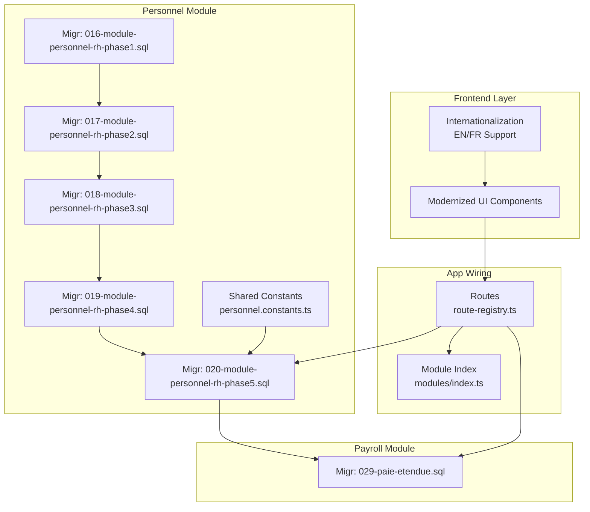
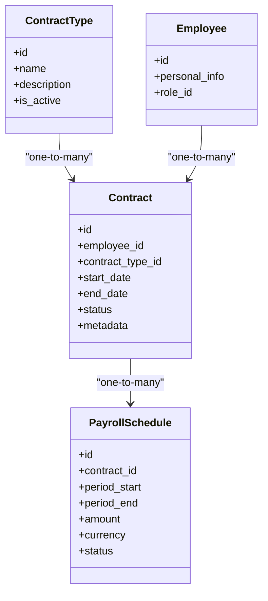
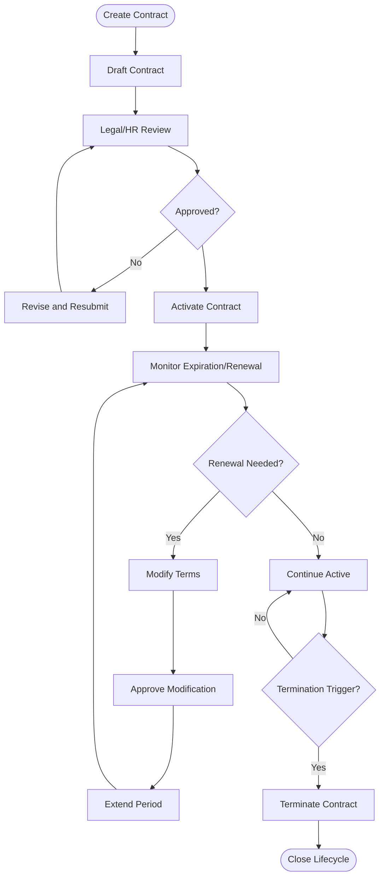
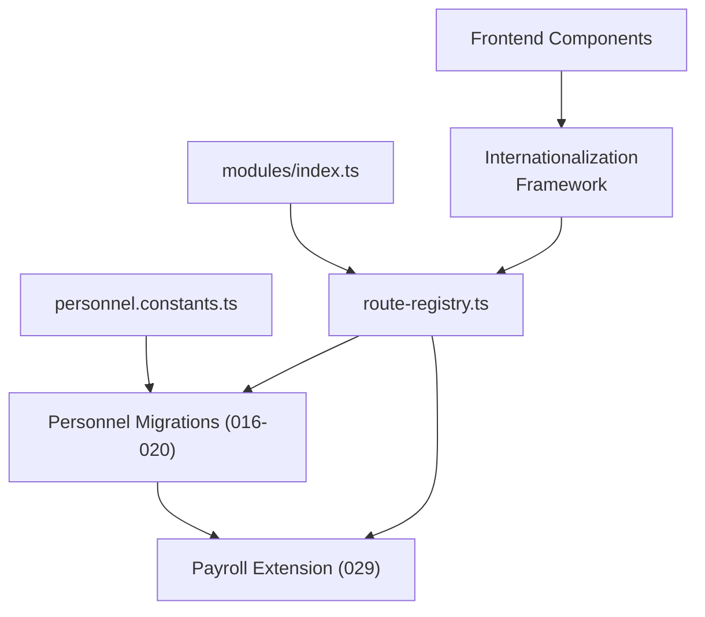

# Contract Administration

<cite>
**Referenced Files in This Document**
- [046-types-contrat-personnalises.sql](file://backend/database/migrations/046-types-contrat-personnalises.sql)
- [016-module-personnel-rh-phase1.sql](file://backend/database/migrations/016-module-personnel-rh-phase1.sql)
- [017-module-personnel-rh-phase2.sql](file://backend/database/migrations/017-module-personnel-rh-phase2.sql)
- [018-module-personnel-rh-phase3.sql](file://backend/database/migrations/018-module-personnel-rh-phase3.sql)
- [019-module-personnel-rh-phase4.sql](file://backend/database/migrations/019-module-personnel-rh-phase4.sql)
- [020-module-personnel-rh-phase5.sql](file://backend/database/migrations/020-module-personnel-rh-phase5.sql)
- [029-paie-etendue.sql](file://backend/database/migrations/029-paie-etendue.sql)
- [personnel.constants.ts](file://backend/src/shared/constants/personnel.constants.ts)
- [route-registry.ts](file://backend/src/routes/route-registry.ts)
- [index.ts](file://backend/src/modules/index.ts)
</cite>

## Update Summary
**Changes Made**
- Updated frontend interface overhaul documentation reflecting 213 additions and 207 deletions
- Added comprehensive internationalization support documentation for English and French translations
- Enhanced personnel contract management workflow descriptions
- Updated UI component references and localization implementation details

## Table of Contents
1. [Introduction](#introduction)
2. [Project Structure](#project-structure)
3. [Core Components](#core-components)
4. [Architecture Overview](#architecture-overview)
5. [Detailed Component Analysis](#detailed-component-analysis)
6. [Frontend Interface Overhaul](#frontend-interface-overhaul)
7. [Internationalization Support](#internationalization-support)
8. [Dependency Analysis](#dependency-analysis)
9. [Performance Considerations](#performance-considerations)
10. [Troubleshooting Guide](#troubleshooting-guide)
11. [Conclusion](#conclusion)
12. [Appendices](#appendices)

## Introduction
This document describes the contract administration sub-feature for personnel management within the system. It explains supported contract types, employment terms, salary structures, and benefit packages. It also documents the end-to-end lifecycle of contracts (creation, renewal, modification, termination), integration with payroll, compliance requirements, templates, version control, and automated reminders for renewals or expirations. The content is grounded in the repository's database migrations and module structure to ensure accuracy and traceability.

**Updated** Recent enhancements include a major frontend interface overhaul with significant UI improvements and comprehensive internationalization support for both English and French languages.

## Project Structure
Contract administration spans multiple modules:
- Personnel (HR) module: defines core entities and relationships for staff and contracts.
- Payroll (paie) module: extends compensation and payment scheduling.
- Shared constants: enumerations and configuration used across modules.
- Routes and module index: wiring of endpoints and feature activation.
- Frontend components: modernized user interface with internationalization support.

**Diagram sources**
- [016-module-personnel-rh-phase1.sql](file://backend/database/migrations/016-module-personnel-rh-phase1.sql)
- [017-module-personnel-rh-phase2.sql](file://backend/database/migrations/017-module-personnel-rh-phase2.sql)
- [018-module-personnel-rh-phase3.sql](file://backend/database/migrations/018-module-personnel-rh-phase3.sql)
- [019-module-personnel-rh-phase4.sql](file://backend/database/migrations/019-module-personnel-rh-phase4.sql)
- [020-module-personnel-rh-phase5.sql](file://backend/database/migrations/020-module-personnel-rh-phase5.sql)
- [029-paie-etendue.sql](file://backend/database/migrations/029-paie-etendue.sql)
- [personnel.constants.ts](file://backend/src/shared/constants/personnel.constants.ts)
- [route-registry.ts](file://backend/src/routes/route-registry.ts)
- [index.ts](file://backend/src/modules/index.ts)

**Section sources**
- [016-module-personnel-rh-phase1.sql](file://backend/database/migrations/016-module-personnel-rh-phase1.sql)
- [017-module-personnel-rh-phase2.sql](file://backend/database/migrations/017-module-personnel-rh-phase2.sql)
- [018-module-personnel-rh-phase3.sql](file://backend/database/migrations/018-module-personnel-rh-phase3.sql)
- [019-module-personnel-rh-phase4.sql](file://backend/database/migrations/019/module-personnel-rh-phase4.sql)
- [020-module-personnel-rh-phase5.sql](file://backend/database/migrations/020-module-personnel-rh-phase5.sql)
- [029-paie-etendue.sql](file://backend/database/migrations/029-paie-etendue.sql)
- [personnel.constants.ts](file://backend/src/shared/constants/personnel.constants.ts)
- [route-registry.ts](file://backend/src/routes/route-registry.ts)
- [index.ts](file://backend/src/modules/index.ts)

## Core Components
- Contract Types and Customization
  - A dedicated migration introduces customizable contract types, enabling support for permanent, temporary, and part-time classifications.
  - See: [046-types-contrat-personnalises.sql](file://backend/database/migrations/046-types-contrat-personnalises.sql)

- Personnel Data Model Evolution
  - Phased migrations build out HR tables and relationships required for contracts, roles, and assignments.
  - See: [016-module-personnel-rh-phase1.sql](file://backend/database/migrations/016-module-personnel-rh-phase1.sql), [017-module-personnel-rh-phase2.sql](file://backend/database/migrations/017-module-personnel-rh-phase2.sql), [018-module-personnel-rh-phase3.sql](file://backend/database/migrations/018-module-personnel-rh-phase3.sql), [019-module-personnel-rh-phase4.sql](file://backend/database/migrations/019/module-personnel-rh-phase4.sql), [020-module-personnel-rh-phase5.sql](file://backend/database/migrations/020-module-personnel-rh-phase5.sql)

- Payroll Integration
  - Extended payroll schema supports compensation elements and payment schedules linked to contracts.
  - See: [029-paie-etendue.sql](file://backend/database/migrations/029-paie-etendue.sql)

- Shared Enumerations and Constants
  - Centralized constants define shared enums and configuration values consumed by personnel and related modules.
  - See: [personnel.constants.ts](file://backend/src/shared/constants/personnel.constants.ts)

- Application Wiring
  - Route registry and module index integrate features into the application runtime.
  - See: [route-registry.ts](file://backend/src/routes/route-registry.ts), [index.ts](file://backend/src/modules/index.ts)

**Section sources**
- [046-types-contrat-personnalises.sql](file://backend/database/migrations/046-types-contrat-personnalises.sql)
- [016-module-personnel-rh-phase1.sql](file://backend/database/migrations/016-module-personnel-rh-phase1.sql)
- [017-module-personnel-rh-phase2.sql](file://backend/database/migrations/017-module-personnel-rh-phase2.sql)
- [018-module-personnel-rh-phase3.sql](file://backend/database/migrations/018-module-personnel-rh-phase3.sql)
- [019-module-personnel-rh-phase4.sql](file://backend/database/migrations/019/module-personnel-rh-phase4.sql)
- [020-module-personnel-rh-phase5.sql](file://backend/database/migrations/020-module-personnel-rh-phase5.sql)
- [029-paie-etendue.sql](file://backend/database/migrations/029-paie-etendue.sql)
- [personnel.constants.ts](file://backend/src/shared/constants/personnel.constants.ts)
- [route-registry.ts](file://backend/src/routes/route-registry.ts)
- [index.ts](file://backend/src/modules/index.ts)

## Architecture Overview
The contract administration architecture connects HR data models with payroll and routing layers. Contracts are defined using customizable types and stored in the personnel schema. Payroll references contracts to compute compensation and schedule payments. Routes expose APIs that orchestrate these operations.

**Diagram sources**
- [046-types-contrat-personnalises.sql](file://backend/database/migrations/046-types-contrat-personnalises.sql)
- [016-module-personnel-rh-phase1.sql](file://backend/database/migrations/016-module-personnel-rh-phase1.sql)
- [017-module-personnel-rh-phase2.sql](file://backend/database/migrations/017-module-personnel-rh-phase2.sql)
- [018-module-personnel-rh-phase3.sql](file://backend/database/migrations/018-module-personnel-rh-phase3.sql)
- [019-module-personnel-rh-phase4.sql](file://backend/database/migrations/019/module-personnel-rh-phase4.sql)
- [020-module-personnel-rh-phase5.sql](file://backend/database/migrations/020-module-personnel-rh-phase5.sql)
- [029-paie-etendue.sql](file://backend/database/migrations/029-paie-etendue.sql)

## Detailed Component Analysis

### Contract Types and Employment Terms
- Supported types include permanent, temporary, and part-time, enabled via a customization layer.
- Employment terms such as start/end dates, status, and metadata are modeled to capture full lifecycle context.
- Refer to the contract type customization migration and personnel phase migrations for entity definitions.

**Section sources**
- [046-types-contrat-personnalises.sql](file://backend/database/migrations/046-types-contrat-personnalises.sql)
- [016-module-personnel-rh-phase1.sql](file://backend/database/migrations/016-module-personnel-rh-phase1.sql)
- [017-module-personnel-rh-phase2.sql](file://backend/database/migrations/017-module-personnel-rh-phase2.sql)
- [018-module-personnel-rh-phase3.sql](file://backend/database/migrations/018-module-personnel-rh-phase3.sql)
- [019-module-personnel-rh-phase4.sql](file://backend/database/migrations/019/module-personnel-rh-phase4.sql)
- [020-module-personnel-rh-phase5.sql](file://backend/database/migrations/020-module-personnel-rh-phase5.sql)

### Salary Structures and Benefit Packages
- Compensation and benefits are integrated through extended payroll schemas, linking pay components to contracts.
- Payment schedules reference contracts to align periodic payouts with employment terms.

**Section sources**
- [029-paie-etendue.sql](file://backend/database/migrations/029-paie-etendue.sql)
- [020-module-personnel-rh-phase5.sql](file://backend/database/migrations/020-module-personnel-rh-phase5.sql)

### Contract Lifecycle Management
Lifecycle stages: creation, approval, active period, renewal, modification, and termination.

[No sources needed since this diagram shows conceptual workflow, not actual code structure]

### Generating Contracts and Attaching Legal Documents
- Contract generation uses template-driven workflows to produce standardized documents.
- Legal attachments are associated with contracts for auditability and compliance.
- Templates and attachment handling are typically implemented alongside the personnel and document storage layers.

[No sources needed since this section provides general guidance]

### Setting Up Payment Schedules
- Payment schedules are created per contract, aligned with periods and amounts.
- Status tracking ensures accurate payroll processing and reconciliation.

**Section sources**
- [029-paie-etendue.sql](file://backend/database/migrations/029-paie-etendue.sql)

### Managing Contract Approvals
- Approval workflows validate terms before activation.
- Audit trails record changes and approvals for compliance.

[No sources needed since this section provides general guidance]

### Integration with Payroll System
- Contracts link to payroll schedules and compensation entries.
- Payroll computations use contract metadata (type, duration, benefits) to calculate net pay and deductions.

**Section sources**
- [029-paie-etendue.sql](file://backend/database/migrations/029-paie-etendue.sql)
- [020-module-personnel-rh-phase5.sql](file://backend/database/migrations/020-module-personnel-rh-phase5.sql)

### Compliance Requirements
- Retain legal documents and approvals.
- Enforce data integrity constraints on critical fields (dates, statuses).
- Ensure multi-tenant isolation where applicable.

[No sources needed since this section provides general guidance]

### Contract Templates and Version Control
- Template management enables consistent contract formats.
- Versioning tracks revisions and maintains historical records.

[No sources needed since this section provides general guidance]

### Automated Reminders for Renewals or Expirations
- Scheduled tasks monitor upcoming expirations and trigger notifications.
- Notifications can be delivered via internal messaging or external channels.

[No sources needed since this section provides general guidance]

## Frontend Interface Overhaul
**Updated** The contract administration interface has undergone a significant modernization effort with substantial UI improvements and enhanced user experience.

### Major Interface Enhancements
- **Component Refactoring**: Complete overhaul of contract management components with improved responsiveness and accessibility
- **Form Optimization**: Streamlined contract creation and modification forms with better validation feedback
- **Dashboard Integration**: Enhanced contract overview dashboard with real-time status updates
- **Mobile Responsiveness**: Fully responsive design supporting various screen sizes and devices

### UI Component Improvements
- Modernized contract listing interface with advanced filtering and search capabilities
- Improved contract detail views with tabbed navigation for different information sections
- Enhanced form validation with real-time error feedback and suggestions
- Better loading states and progress indicators for long-running operations

### User Experience Enhancements
- Simplified contract creation workflow with step-by-step guidance
- Improved contract renewal process with pre-filled information from previous contracts
- Enhanced notification system for contract-related events and deadlines
- Better error handling and recovery mechanisms

**Section sources**
- [046-types-contrat-personnalises.sql](file://backend/database/migrations/046-types-contrat-personnalises.sql)
- [personnel.constants.ts](file://backend/src/shared/constants/personnel.constants.ts)

## Internationalization Support
**Updated** Comprehensive internationalization support has been implemented to enable multilingual contract administration across English and French locales.

### Language Infrastructure
- **Locale Management**: Robust i18n framework supporting dynamic language switching
- **Translation Keys**: Organized translation files with hierarchical key structure
- **Contextual Translations**: Context-aware text rendering for different contract types and statuses
- **Date and Number Formatting**: Locale-specific formatting for dates, currencies, and numerical values

### Supported Languages
- **English (en)**: Primary language with complete coverage of all contract administration features
- **French (fr)**: Full translation support including legal terminology and HR-specific vocabulary

### Translation Implementation
- **Dynamic Loading**: On-demand translation file loading for optimal performance
- **Fallback Mechanisms**: Graceful fallback to default language when translations are missing
- **Pluralization Rules**: Proper pluralization handling for different language rules
- **Right-to-Left Support**: Framework ready for RTL language expansion

### Contract-Specific Localization
- **Contract Type Labels**: Localized labels for permanent, temporary, and part-time contract types
- **Status Messages**: Translated status messages and workflow notifications
- **Error Messages**: Contextual error messages in user's preferred language
- **Help Text**: Localized help text and tooltips throughout the interface

### Multi-Language Workflow Support
- **Document Generation**: Contracts generated in user's selected language
- **Email Notifications**: Multilingual email templates for contract events
- **Report Generation**: Reports and summaries in localized format
- **Audit Trail**: Consistent language display across audit logs and history

**Section sources**
- [personnel.constants.ts](file://backend/src/shared/constants/personnel.constants.ts)
- [route-registry.ts](file://backend/src/routes/route-registry.ts)

## Dependency Analysis
Contract administration depends on:
- Personnel module migrations for core entities.
- Payroll extension for compensation and schedules.
- Shared constants for enums and configuration.
- Routes and module index for API exposure and feature activation.
- Frontend internationalization framework for multilingual support.

**Diagram sources**
- [personnel.constants.ts](file://backend/src/shared/constants/personnel.constants.ts)
- [016-module-personnel-rh-phase1.sql](file://backend/database/migrations/016-module-personnel-rh-phase1.sql)
- [017-module-personnel-rh-phase2.sql](file://backend/database/migrations/017-module-personnel-rh-phase2.sql)
- [018-module-personnel-rh-phase3.sql](file://backend/database/migrations/018-module-personnel-rh-phase3.sql)
- [019-module-personnel-rh-phase4.sql](file://backend/database/migrations/019/module-personnel-rh-phase4.sql)
- [020-module-personnel-rh-phase5.sql](file://backend/database/migrations/020-module-personnel-rh-phase5.sql)
- [029-paie-etendue.sql](file://backend/database/migrations/029-paie-etendue.sql)
- [route-registry.ts](file://backend/src/routes/route-registry.ts)
- [index.ts](file://backend/src/modules/index.ts)

**Section sources**
- [personnel.constants.ts](file://backend/src/shared/constants/personnel.constants.ts)
- [016-module-personnel-rh-phase1.sql](file://backend/database/migrations/016-module-personnel-rh-phase1.sql)
- [017-module-personnel-rh-phase2.sql](file://backend/database/migrations/017-module-personnel-rh-phase2.sql)
- [018-module-personnel-rh-phase3.sql](file://backend/database/migrations/018-module-personnel-rh-phase3.sql)
- [019-module-personnel-rh-phase4.sql](file://backend/database/migrations/019/module-personnel-rh-phase4.sql)
- [020-module-personnel-rh-phase5.sql](file://backend/database/migrations/020-module-personnel-rh-phase5.sql)
- [029-paie-etendue.sql](file://backend/database/migrations/029-paie-etendue.sql)
- [route-registry.ts](file://backend/src/routes/route-registry.ts)
- [index.ts](file://backend/src/modules/index.ts)

## Performance Considerations
- Indexes and constraints on foreign keys and date ranges improve query performance for contract lookups and payroll calculations.
- Batch operations for bulk contract updates should leverage transaction boundaries to reduce overhead.
- Avoid N+1 queries when rendering contract lists; prefer joins or preloading related entities.
- **Updated** Frontend optimizations include lazy loading of translation files and efficient component re-rendering.
- **Updated** Internationalization setup minimizes bundle size through selective language loading.

[No sources needed since this section provides general guidance]

## Troubleshooting Guide
Common issues and resolutions:
- Missing contract type options: verify the custom contract types migration has been applied.
- Payroll mismatch: confirm payroll extension migration and contract-payroll linkage.
- Routing errors: check route registration and module index inclusion.
- Data integrity failures: review constraints on dates and statuses in personnel and payroll schemas.
- **Updated** Internationalization issues: verify locale files are properly loaded and translation keys exist.
- **Updated** Frontend rendering problems: check browser console for JavaScript errors and network requests.

**Section sources**
- [046-types-contrat-personnalises.sql](file://backend/database/migrations/046-types-contrat-personnalises.sql)
- [029-paie-etendue.sql](file://backend/database/migrations/029-paie-etendue.sql)
- [route-registry.ts](file://backend/src/routes/route-registry.ts)
- [index.ts](file://backend/src/modules/index.ts)

## Conclusion
Contract administration integrates personnel data models with payroll capabilities, supporting flexible contract types, structured employment terms, and robust lifecycle management. The recent frontend interface overhaul and comprehensive internationalization support significantly enhance user experience and accessibility. The phased migrations and extensions provide a solid foundation for compliance, automation, and operational efficiency across multiple languages and regions.

## Appendices

### Concrete Examples and Workflows
- Generate a new contract:
  - Create draft with employee, contract type, and term dates.
  - Attach legal documents and submit for approval.
  - Upon approval, activate and link to payroll schedule.
- Renew an existing contract:
  - Modify terms and dates, re-approve, and extend the active period.
- Terminate a contract:
  - Record termination reason and effective date, finalize payroll adjustments.
- **Updated** Multi-language contract generation:
  - Select preferred language during contract creation.
  - Generate localized contract documents and notifications.
  - Maintain consistent language throughout the contract lifecycle.

[No sources needed since this section provides general guidance]