# Employee Profile Management

<cite>
**Referenced Files in This Document**
- [016-module-personnel-rh-phase1.sql](file://backend/database/migrations/016-module-personnel-rh-phase1.sql)
- [017-module-personnel-rh-phase2.sql](file://backend/database/migrations/017-module-personnel-rh-phase2.sql)
- [018-module-personnel-rh-phase3.sql](file://backend/database/migrations/018-module-personnel-rh-phase3.sql)
- [019-module-personnel-rh-phase4.sql](file://backend/database/migrations/019-module-personnel-rh-phase4.sql)
- [020-module-personnel-rh-phase5.sql](file://backend/database/migrations/020-module-personnel-rh-phase5.sql)
- [021-module-personnel-rh-permissions-attribution.sql](file://backend/database/migrations/021-module-personnel-rh-permissions-attribution.sql)
- [022-module-personnel-rh-complete.sql](file://backend/database/migrations/022-module-personnel-rh-complete.sql)
- [026-personnel-champs-additionnels.sql](file://backend/database/migrations/026-personnel-champs-additionnels.sql)
- [personnel.constants.ts](file://backend/src/shared/constants/personnel.constants.ts)
- [route-registry.ts](file://backend/src/routes/route-registry.ts)
- [audit-trail.md](file://backend/docs/audit-trail.md)
</cite>

## Table of Contents
1. [Introduction](#introduction)
2. [Project Structure](#project-structure)
3. [Core Components](#core-components)
4. [Architecture Overview](#architecture-overview)
5. [Detailed Component Analysis](#detailed-component-analysis)
6. [Dependency Analysis](#dependency-analysis)
7. [Performance Considerations](#performance-considerations)
8. [Troubleshooting Guide](#troubleshooting-guide)
9. [Conclusion](#conclusion)
10. [Appendices](#appendices)

## Introduction
This document provides comprehensive guidance for the Employee Profile Management sub-feature within the personnel module. It explains staff data structure, personal information fields, professional qualifications, contact details, and emergency contacts. It also documents profile creation workflows, validation rules, field-level permissions, relationships with organizational units, privacy considerations, audit trails, bulk operations, templates, and custom field configurations. The content is grounded in the repository’s database migrations and shared constants to ensure accuracy and traceability.

## Project Structure
The employee profile management feature is primarily implemented through:
- Database schema definitions across multiple migration files that establish core tables, relationships, indexes, and constraints for personnel profiles, employment history, documents, and related entities.
- Shared constants defining enumerations and configuration values used by controllers and services.
- Route registration that wires endpoints to controllers and applies authorization policies.
- Audit trail documentation describing how changes are recorded.

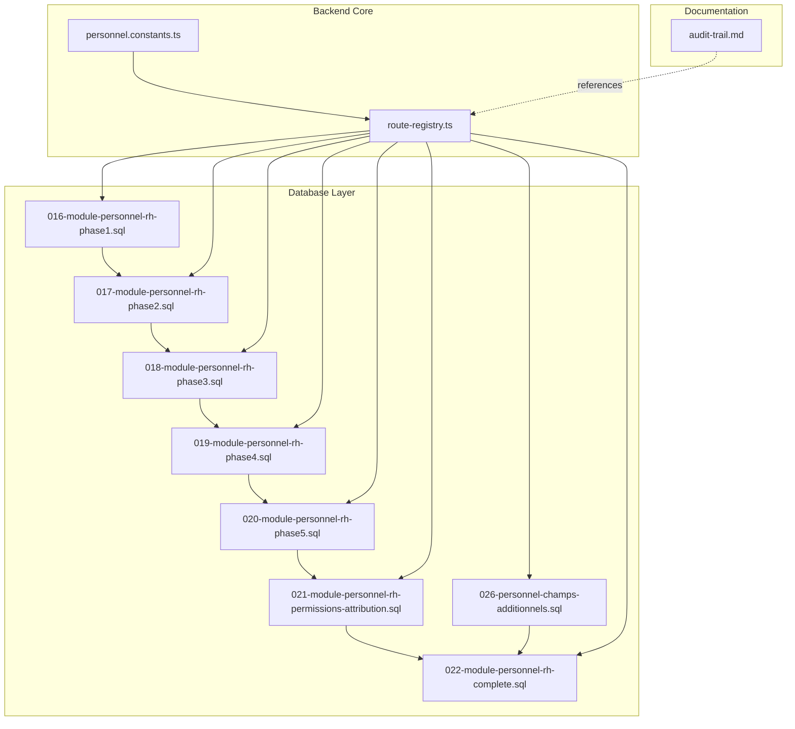

**Diagram sources**
- [016-module-personnel-rh-phase1.sql](file://backend/database/migrations/016-module-personnel-rh-phase1.sql)
- [017-module-personnel-rh-phase2.sql](file://backend/database/migrations/017-module-personnel-rh-phase2.sql)
- [018-module-personnel-rh-phase3.sql](file://backend/database/migrations/018-module-personnel-rh-phase3.sql)
- [019-module-personnel-rh-phase4.sql](file://backend/database/migrations/019-module-personnel-rh-phase4.sql)
- [020-module-personnel-rh-phase5.sql](file://backend/database/migrations/020-module-personnel-rh-phase5.sql)
- [021-module-personnel-rh-permissions-attribution.sql](file://backend/database/migrations/021-module-personnel-rh-permissions-attribution.sql)
- [022-module-personnel-rh-complete.sql](file://backend/database/migrations/022-module-personnel-rh-complete.sql)
- [026-personnel-champs-additionnels.sql](file://backend/database/migrations/026-personnel-champs-additionnels.sql)
- [personnel.constants.ts](file://backend/src/shared/constants/personnel.constants.ts)
- [route-registry.ts](file://backend/src/routes/route-registry.ts)
- [audit-trail.md](file://backend/docs/audit-trail.md)

**Section sources**
- [016-module-personnel-rh-phase1.sql](file://backend/database/migrations/016-module-personnel-rh-phase1.sql)
- [017-module-personnel-rh-phase2.sql](file://backend/database/migrations/017-module-personnel-rh-phase2.sql)
- [018-module-personnel-rh-phase3.sql](file://backend/database/migrations/018-module-personnel-rh-phase3.sql)
- [019-module-personnel-rh-phase4.sql](file://backend/database/migrations/019-module-personnel-rh-phase4.sql)
- [020-module-personnel-rh-phase5.sql](file://backend/database/migrations/020-module-personnel-rh-phase5.sql)
- [021-module-personnel-rh-permissions-attribution.sql](file://backend/database/migrations/021-module-personnel-rh-permissions-attribution.sql)
- [022-module-personnel-rh-complete.sql](file://backend/database/migrations/022-module-personnel-rh-complete.sql)
- [026-personnel-champs-additionnels.sql](file://backend/database/migrations/026-personnel-champs-additionnels.sql)
- [personnel.constants.ts](file://backend/src/shared/constants/personnel.constants.ts)
- [route-registry.ts](file://backend/src/routes/route-registry.ts)
- [audit-trail.md](file://backend/docs/audit-trail.md)

## Core Components
- Personnel entity model and attributes:
  - Personal identification (e.g., full name, date of birth, gender, nationality).
  - Contact details (e.g., phone numbers, email addresses, residential address).
  - Professional qualifications (e.g., degrees, certifications, training records).
  - Emergency contacts (e.g., next-of-kin names, relationship, phone numbers).
  - Employment history entries (e.g., position titles, start/end dates, roles, departments).
  - Documents (e.g., contracts, certificates, ID copies).
- Organizational unit linkage:
  - Assignment of employees to organizational units or departments.
  - Hierarchical relationships between units and reporting lines.
- Field-level permissions:
  - Granular access control over sensitive fields such as medical or financial data.
  - Role-based visibility and edit rights enforced at API layer.
- Validation rules:
  - Required fields for identity and contact information.
  - Date range validations for employment periods.
  - Format checks for emails and phone numbers.
- Bulk operations:
  - Batch import/export capabilities for onboarding and maintenance tasks.
- Templates and custom fields:
  - Reusable profile templates for different staff categories.
  - Extensible custom fields to capture institution-specific data.

**Section sources**
- [016-module-personnel-rh-phase1.sql](file://backend/database/migrations/016-module-personnel-rh-phase1.sql)
- [017-module-personnel-rh-phase2.sql](file://backend/database/migrations/017-module-personnel-rh-phase2.sql)
- [018-module-personnel-rh-phase3.sql](file://backend/database/migrations/018-module-personnel-rh-phase3.sql)
- [019-module-personnel-rh-phase4.sql](file://backend/database/migrations/019-module-personnel-rh-phase4.sql)
- [020-module-personnel-rh-phase5.sql](file://backend/database/migrations/020-module-personnel-rh-phase5.sql)
- [021-module-personnel-rh-permissions-attribution.sql](file://backend/database/migrations/021-module-personnel-rh-permissions-attribution.sql)
- [022-module-personnel-rh-complete.sql](file://backend/database/migrations/022-module-personnel-rh-complete.sql)
- [026-personnel-champs-additionnels.sql](file://backend/database/migrations/026-personnel-champs-additionnels.sql)
- [personnel.constants.ts](file://backend/src/shared/constants/personnel.constants.ts)

## Architecture Overview
The employee profile management architecture integrates route registration, shared constants, and database schema layers. Endpoints registered in the route registry invoke controllers that enforce RBAC policies and call services which interact with the database defined by the personnel migrations.

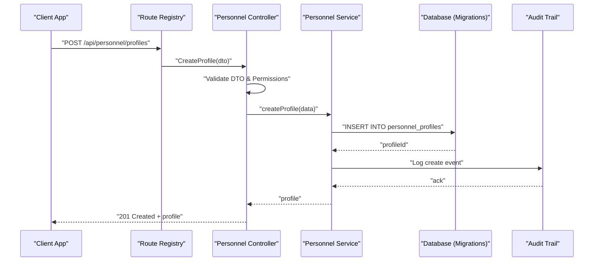

**Diagram sources**
- [route-registry.ts](file://backend/src/routes/route-registry.ts)
- [016-module-personnel-rh-phase1.sql](file://backend/database/migrations/016-module-personnel-rh-phase1.sql)
- [audit-trail.md](file://backend/docs/audit-trail.md)

## Detailed Component Analysis

### Data Model and Relationships
The personnel data model spans several interconnected tables established by migrations. Key entities include:
- Profiles: core personal and contact information.
- Qualifications: academic and professional credentials.
- EmergencyContacts: next-of-kin and emergency reachability.
- EmploymentHistory: job assignments, positions, and tenure.
- Documents: attachments linked to profiles.
- OrgUnits: organizational units to which employees are assigned.

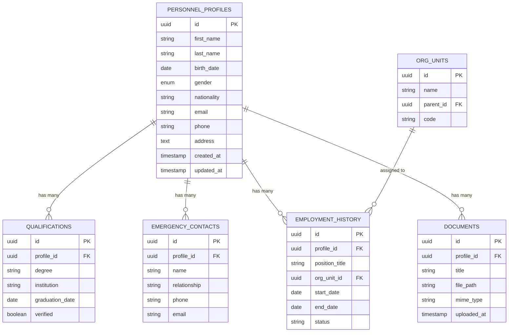

**Diagram sources**
- [016-module-personnel-rh-phase1.sql](file://backend/database/migrations/016-module-personnel-rh-phase1.sql)
- [017-module-personnel-rh-phase2.sql](file://backend/database/migrations/017-module-personnel-rh-phase2.sql)
- [018-module-personnel-rh-phase3.sql](file://backend/database/migrations/018-module-personnel-rh-phase3.sql)
- [019-module-personnel-rh-phase4.sql](file://backend/database/migrations/019-module-personnel-rh-phase4.sql)
- [020-module-personnel-rh-phase5.sql](file://backend/database/migrations/020-module-personnel-rh-phase5.sql)
- [022-module-personnel-rh-complete.sql](file://backend/database/migrations/022-module-personnel-rh-complete.sql)

**Section sources**
- [016-module-personnel-rh-phase1.sql](file://backend/database/migrations/016-module-personnel-rh-phase1.sql)
- [017-module-personnel-rh-phase2.sql](file://backend/database/migrations/017-module-personnel-rh-phase2.sql)
- [018-module-personnel-rh-phase3.sql](file://backend/database/migrations/018-module-personnel-rh-phase3.sql)
- [019-module-personnel-rh-phase4.sql](file://backend/database/migrations/019-module-personnel-rh-phase4.sql)
- [020-module-personnel-rh-phase5.sql](file://backend/database/migrations/020-module-personnel-rh-phase5.sql)
- [022-module-personnel-rh-complete.sql](file://backend/database/migrations/022-module-personnel-rh-complete.sql)

### Profile Creation Workflow
End-to-end flow for adding a new employee profile:
- Client submits a profile creation request via the registered endpoint.
- Route registry validates authentication and authorization.
- Controller performs DTO validation against required fields and formats.
- Service persists profile and related records (qualifications, emergency contacts).
- Audit trail logs the creation event.
- Response returns the newly created profile identifier and summary.

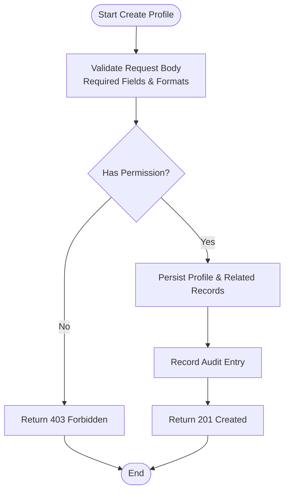

**Diagram sources**
- [route-registry.ts](file://backend/src/routes/route-registry.ts)
- [016-module-personnel-rh-phase1.sql](file://backend/database/migrations/016-module-personnel-rh-phase1.sql)
- [audit-trail.md](file://backend/docs/audit-trail.md)

**Section sources**
- [route-registry.ts](file://backend/src/routes/route-registry.ts)
- [016-module-personnel-rh-phase1.sql](file://backend/database/migrations/016-module-personnel-rh-phase1.sql)
- [audit-trail.md](file://backend/docs/audit-trail.md)

### Updating Personal Information
Updating an existing profile involves:
- Fetching current profile state.
- Validating only changed fields.
- Applying updates with permission checks per field group.
- Recording audit entries for each modified attribute.
- Returning updated profile snapshot.

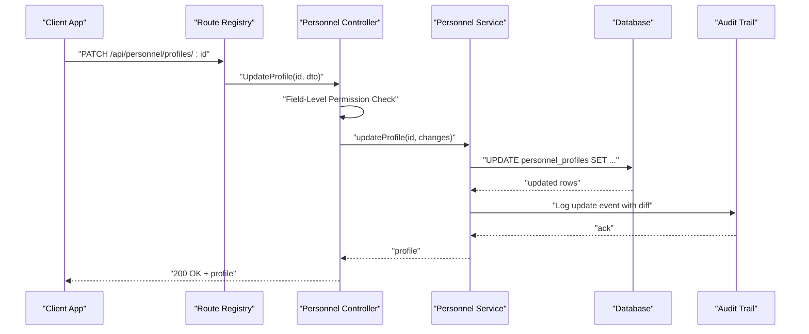

**Diagram sources**
- [route-registry.ts](file://backend/src/routes/route-registry.ts)
- [016-module-personnel-rh-phase1.sql](file://backend/database/migrations/016-module-personnel-rh-phase1.sql)
- [audit-trail.md](file://backend/docs/audit-trail.md)

**Section sources**
- [route-registry.ts](file://backend/src/routes/route-registry.ts)
- [016-module-personnel-rh-phase1.sql](file://backend/database/migrations/016-module-personnel-rh-phase1.sql)
- [audit-trail.md](file://backend/docs/audit-trail.md)

### Managing Documents
Document management includes uploading, linking, and retrieving files associated with a profile:
- Upload endpoint accepts multipart/form-data.
- Controller validates MIME type and size limits.
- Service stores file metadata and links it to the profile.
- Retrieval endpoint serves documents based on access permissions.

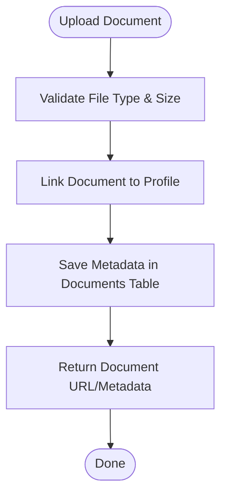

**Diagram sources**
- [016-module-personnel-rh-phase1.sql](file://backend/database/migrations/016-module-personnel-rh-phase1.sql)
- [022-module-personnel-rh-complete.sql](file://backend/database/migrations/022-module-personnel-rh-complete.sql)

**Section sources**
- [016-module-personnel-rh-phase1.sql](file://backend/database/migrations/016-module-personnel-rh-phase1.sql)
- [022-module-personnel-rh-complete.sql](file://backend/database/migrations/022-module-personnel-rh-complete.sql)

### Maintaining Employment History
Employment history management covers creating, updating, and archiving job assignments:
- Create entry with position title, start date, and optional end date.
- Enforce non-overlapping date ranges per profile.
- Assign to an organizational unit and set status (active, past).
- Update or close entries as employment evolves.

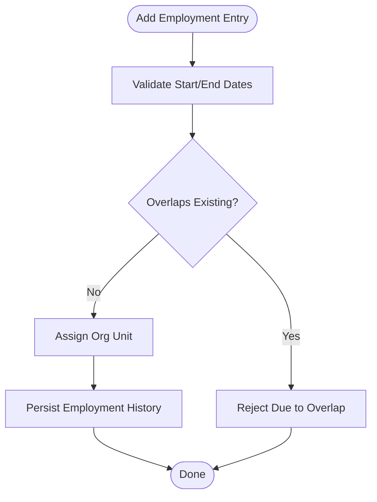

**Diagram sources**
- [018-module-personnel-rh-phase3.sql](file://backend/database/migrations/018-module-personnel-rh-phase3.sql)
- [019-module-personnel-rh-phase4.sql](file://backend/database/migrations/019-module-personnel-rh-phase4.sql)

**Section sources**
- [018-module-personnel-rh-phase3.sql](file://backend/database/migrations/018-module-personnel-rh-phase3.sql)
- [019-module-personnel-rh-phase4.sql](file://backend/database/migrations/019-module-personnel-rh-phase4.sql)

### Relationship Between Personnel Profiles and Organizational Units
Profiles are linked to organizational units through employment history entries. This allows:
- Multiple assignments over time.
- Clear reporting lines and departmental ownership.
- Access scoping based on unit membership.

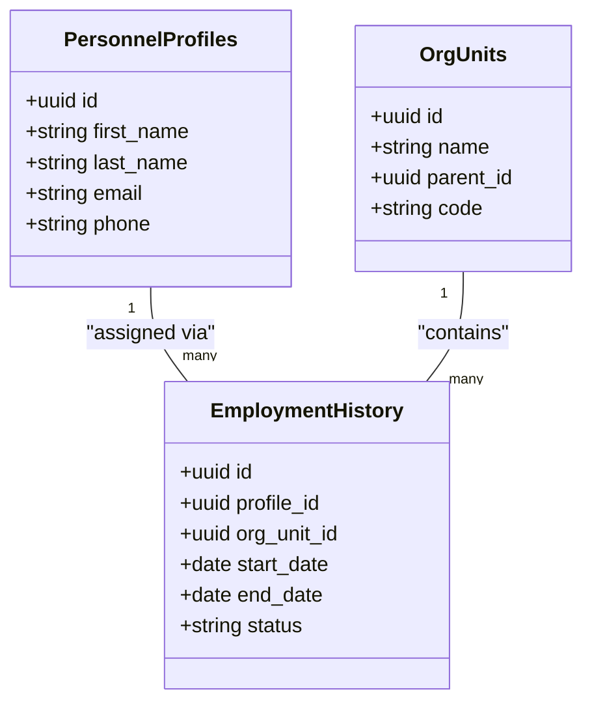

**Diagram sources**
- [016-module-personnel-rh-phase1.sql](file://backend/database/migrations/016-module-personnel-rh-phase1.sql)
- [018-module-personnel-rh-phase3.sql](file://backend/database/migrations/018-module-personnel-rh-phase3.sql)
- [019-module-personnel-rh-phase4.sql](file://backend/database/migrations/019-module-personnel-rh-phase4.sql)

**Section sources**
- [016-module-personnel-rh-phase1.sql](file://backend/database/migrations/016-module-personnel-rh-phase1.sql)
- [018-module-personnel-rh-phase3.sql](file://backend/database/migrations/018-module-personnel-rh-phase3.sql)
- [019-module-personnel-rh-phase4.sql](file://backend/database/migrations/019-module-personnel-rh-phase4.sql)

### Data Validation Rules
Common validation patterns applied during profile operations:
- Required fields: identity and primary contact information must be present.
- Email format: standard email syntax checks.
- Phone number format: country-code-aware validation where applicable.
- Date constraints: start_date <= end_date; no overlapping employment periods.
- Enumerations: gender, nationality, status values restricted to predefined sets.

These rules are enforced at controller/service boundaries and reflected in database constraints.

**Section sources**
- [016-module-personnel-rh-phase1.sql](file://backend/database/migrations/016-module-personnel-rh-phase1.sql)
- [017-module-personnel-rh-phase2.sql](file://backend/database/migrations/017-module-personnel-rh-phase2.sql)
- [018-module-personnel-rh-phase3.sql](file://backend/database/migrations/018-module-personnel-rh-phase3.sql)
- [019-module-personnel-rh-phase4.sql](file://backend/database/migrations/019-module-personnel-rh-phase4.sql)
- [personnel.constants.ts](file://backend/src/shared/constants/personnel.constants.ts)

### Field-Level Permissions
Permissions are configured and attributed through dedicated migrations and enforced at the API layer:
- Sensitive fields (e.g., medical, financial) require explicit role grants.
- Group-based permissions allow unit managers to edit specific fields.
- Super-admin roles bypass restrictions where appropriate.

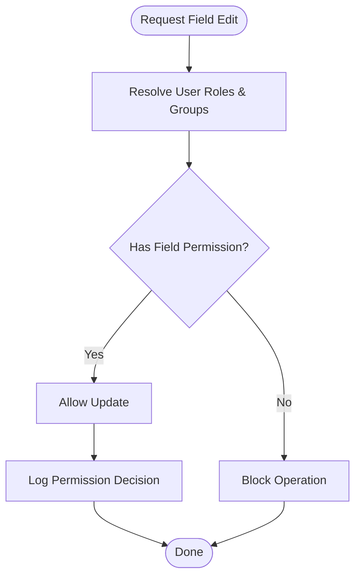

**Diagram sources**
- [021-module-personnel-rh-permissions-attribution.sql](file://backend/database/migrations/021-module-personnel-rh-permissions-attribution.sql)
- [route-registry.ts](file://backend/src/routes/route-registry.ts)

**Section sources**
- [021-module-personnel-rh-permissions-attribution.sql](file://backend/database/migrations/021-module-personnel-rh-permissions-attribution.sql)
- [route-registry.ts](file://backend/src/routes/route-registry.ts)

### Bulk Operations
Bulk operations support efficient onboarding and maintenance:
- CSV/JSON import for profiles, qualifications, and employment history.
- Validation errors reported per row without aborting entire batch.
- Idempotent upserts keyed by unique identifiers (e.g., matricule or email).
- Audit logging for each imported record.

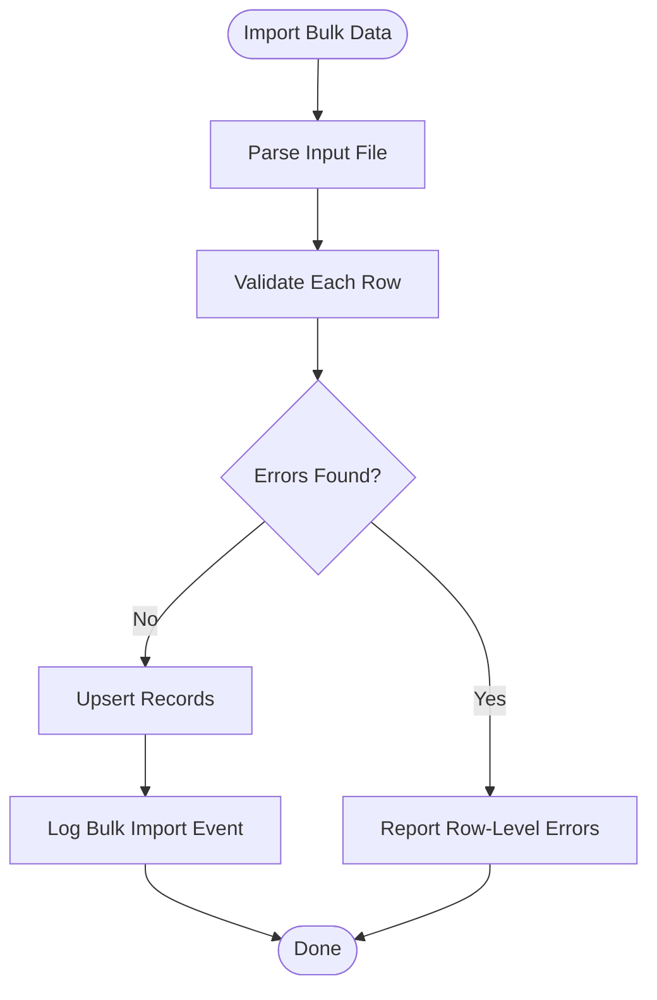

[No diagram sources since this is conceptual]

**Section sources**
- [022-module-personnel-rh-complete.sql](file://backend/database/migrations/022-module-personnel-rh-complete.sql)
- [audit-trail.md](file://backend/docs/audit-trail.md)

### Profile Templates and Custom Field Configurations
Templates streamline repetitive profile setups:
- Predefined templates for roles (teacher, admin, support).
- Custom fields extension mechanism to capture institution-specific attributes.
- Template-driven default values and validation rules.

Custom fields are supported via additional columns and configuration tables introduced in later migrations.

**Section sources**
- [026-personnel-champs-additionnels.sql](file://backend/database/migrations/026-personnel-champs-additionnels.sql)
- [022-module-personnel-rh-complete.sql](file://backend/database/migrations/022-module-personnel-rh-complete.sql)

## Dependency Analysis
The employee profile management feature depends on:
- Route registry for endpoint exposure and policy application.
- Shared constants for enumerations and defaults.
- Database migrations for schema integrity and constraints.
- Audit trail subsystem for change tracking.

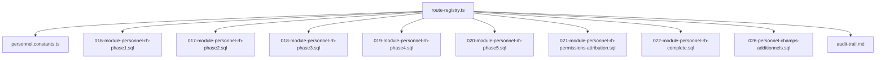

**Diagram sources**
- [route-registry.ts](file://backend/src/routes/route-registry.ts)
- [personnel.constants.ts](file://backend/src/shared/constants/personnel.constants.ts)
- [016-module-personnel-rh-phase1.sql](file://backend/database/migrations/016-module-personnel-rh-phase1.sql)
- [017-module-personnel-rh-phase2.sql](file://backend/database/migrations/017-module-personnel-rh-phase2.sql)
- [018-module-personnel-rh-phase3.sql](file://backend/database/migrations/018-module-personnel-rh-phase3.sql)
- [019-module-personnel-rh-phase4.sql](file://backend/database/migrations/019-module-personnel-rh-phase4.sql)
- [020-module-personnel-rh-phase5.sql](file://backend/database/migrations/020-module-personnel-rh-phase5.sql)
- [021-module-personnel-rh-permissions-attribution.sql](file://backend/database/migrations/021-module-personnel-rh-permissions-attribution.sql)
- [022-module-personnel-rh-complete.sql](file://backend/database/migrations/022-module-personnel-rh-complete.sql)
- [026-personnel-champs-additionnels.sql](file://backend/database/migrations/026-personnel-champs-additionnels.sql)
- [audit-trail.md](file://backend/docs/audit-trail.md)

**Section sources**
- [route-registry.ts](file://backend/src/routes/route-registry.ts)
- [personnel.constants.ts](file://backend/src/shared/constants/personnel.constants.ts)
- [016-module-personnel-rh-phase1.sql](file://backend/database/migrations/016-module-personnel-rh-phase1.sql)
- [017-module-personnel-rh-phase2.sql](file://backend/database/migrations/017-module-personnel-rh-phase2.sql)
- [018-module-personnel-rh-phase3.sql](file://backend/database/migrations/018-module-personnel-rh-phase3.sql)
- [019-module-personnel-rh-phase4.sql](file://backend/database/migrations/019-module-personnel-rh-phase4.sql)
- [020-module-personnel-rh-phase5.sql](file://backend/database/migrations/020-module-personnel-rh-phase5.sql)
- [021-module-personnel-rh-permissions-attribution.sql](file://backend/database/migrations/021-module-personnel-rh-permissions-attribution.sql)
- [022-module-personnel-rh-complete.sql](file://backend/database/migrations/022-module-personnel-rh-complete.sql)
- [026-personnel-champs-additionnels.sql](file://backend/database/migrations/026-personnel-champs-additionnels.sql)
- [audit-trail.md](file://backend/docs/audit-trail.md)

## Performance Considerations
- Indexes on frequently queried fields (e.g., email, phone, org_unit_id) improve lookup performance.
- Pagination and filtering on large personnel lists reduce payload sizes.
- Batch imports should use transactions and chunked processing to avoid long locks.
- Avoid N+1 queries when loading profile details with nested relations.

[No sources needed since this section provides general guidance]

## Troubleshooting Guide
Common issues and resolutions:
- Permission denied errors: verify user roles and field-level permissions.
- Validation failures: check required fields, formats, and date constraints.
- Duplicate records: ensure unique keys (email/matricule) are respected.
- Audit gaps: confirm audit logging is enabled and not suppressed by system settings.

For detailed audit behavior and log formats, consult the audit trail documentation.

**Section sources**
- [021-module-personnel-rh-permissions-attribution.sql](file://backend/database/migrations/021-module-personnel-rh-permissions-attribution.sql)
- [audit-trail.md](file://backend/docs/audit-trail.md)

## Conclusion
Employee Profile Management is built on a robust, multi-phase database schema and a clear separation of concerns between routing, validation, persistence, and auditing. The design supports granular permissions, extensibility via custom fields, and operational efficiency through bulk operations. Adhering to the documented workflows and validation rules ensures data integrity, compliance, and maintainability.

[No sources needed since this section summarizes without analyzing specific files]

## Appendices

### Example Workflows

#### Adding a New Employee
- Prepare profile data including required personal and contact fields.
- Submit via the create endpoint; receive profile ID upon success.
- Attach initial documents and qualification records.
- Assign to an organizational unit via employment history.

**Section sources**
- [016-module-personnel-rh-phase1.sql](file://backend/database/migrations/016-module-personnel-rh-phase1.sql)
- [018-module-personnel-rh-phase3.sql](file://backend/database/migrations/018-module-personnel-rh-phase3.sql)
- [022-module-personnel-rh-complete.sql](file://backend/database/migrations/022-module-personnel-rh-complete.sql)

#### Updating Personal Information
- Patch only changed fields to minimize overhead.
- Ensure field-level permissions allow edits.
- Review audit entries post-update.

**Section sources**
- [016-module-personnel-rh-phase1.sql](file://backend/database/migrations/016-module-personnel-rh-phase1.sql)
- [audit-trail.md](file://backend/docs/audit-trail.md)

#### Managing Documents
- Upload files with validated types and sizes.
- Link documents to the correct profile.
- Retrieve using authorized endpoints.

**Section sources**
- [016-module-personnel-rh-phase1.sql](file://backend/database/migrations/016-module-personnel-rh-phase1.sql)
- [022-module-personnel-rh-complete.sql](file://backend/database/migrations/022-module-personnel-rh-complete.sql)

#### Maintaining Employment History
- Add entries with accurate dates and statuses.
- Prevent overlaps and maintain historical continuity.
- Update assignments as organizational structures evolve.

**Section sources**
- [018-module-personnel-rh-phase3.sql](file://backend/database/migrations/018-module-personnel-rh-phase3.sql)
- [019-module-personnel-rh-phase4.sql](file://backend/database/migrations/019-module-personnel-rh-phase4.sql)

### Privacy and Compliance
- Restrict access to sensitive fields via RBAC.
- Minimize data retention and provide deletion workflows.
- Ensure audit logs do not store raw sensitive payloads unless necessary.

**Section sources**
- [021-module-personnel-rh-permissions-attribution.sql](file://backend/database/migrations/021-module-personnel-rh-permissions-attribution.sql)
- [audit-trail.md](file://backend/docs/audit-trail.md)