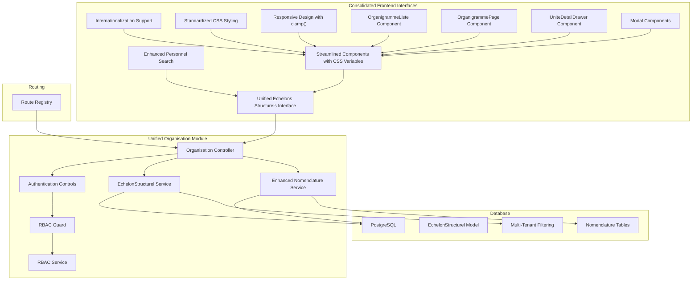
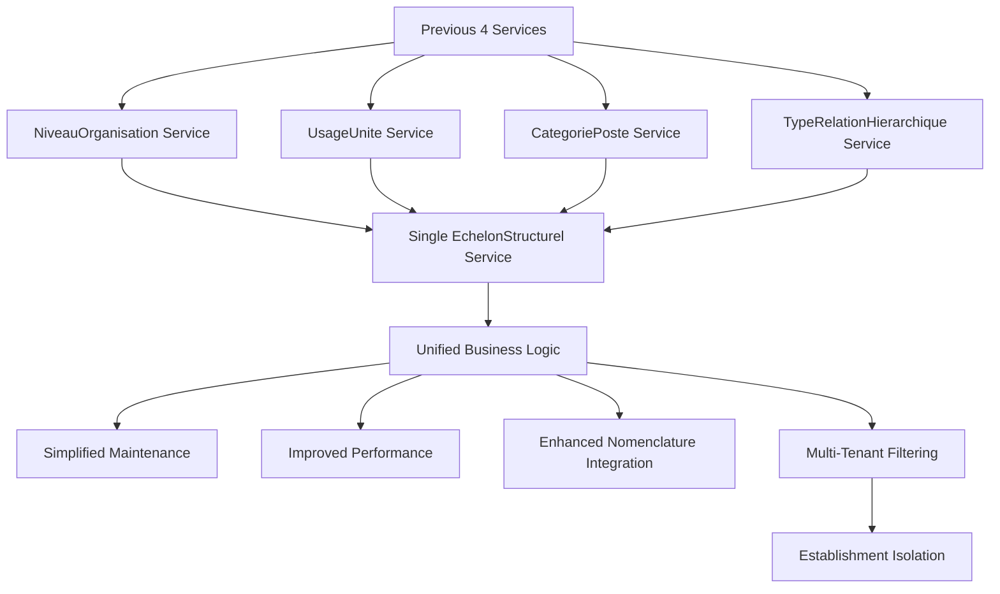
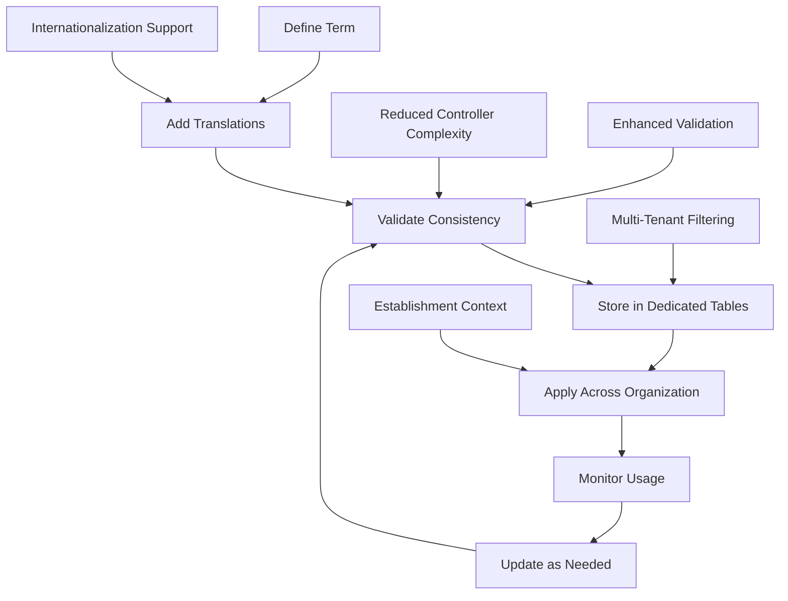
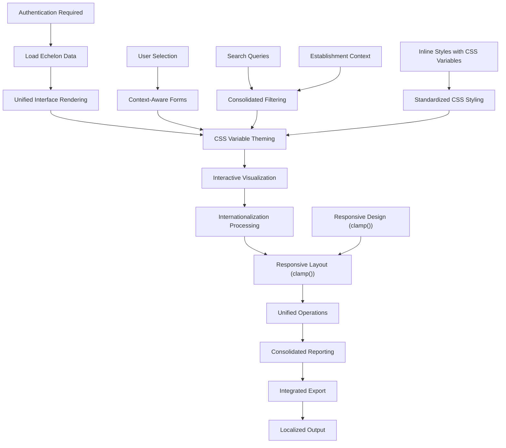
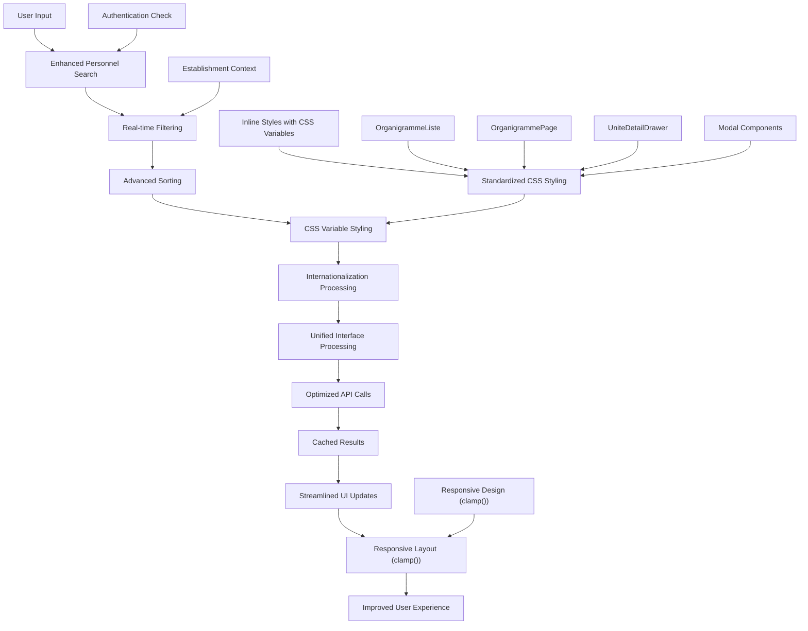
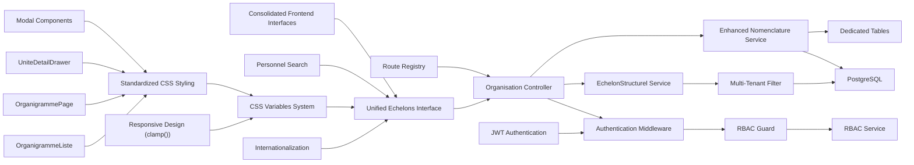

# Organizational Structure

<cite>
**Referenced Files in This Document**
- [109-refonte-organisation.sql](file://backend/database/migrations/109-refonte-organisation.sql)
- [110-consolidation-organisation.sql](file://backend/database/migrations/110-consolidation-organisation.sql)
- [114-normalisation-echelons-structurels.sql](file://backend/database/migrations/114-normalisation-echelons-structurels.sql)
- [organisation.controller.ts](file://backend/src/modules/organisation/controllers/organisation.controller.ts)
- [organisation.service.ts](file://backend/src/modules/organisation/services/organisation.service.ts)
- [echelon-structurel.service.ts](file://backend/src/modules/organisation/services/echelon-structurel.service.ts)
- [nomenclature.service.ts](file://backend/src/modules/organisation/services/nomenclature.service.ts)
- [rbac.guard.ts](file://backend/src/modules/rbac/guards/rbac.guard.ts)
- [rbac.service.ts](file://backend/src/modules/rbac/services/rbac.service.ts)
- [personnel.constants.ts](file://backend/src/shared/constants/personnel.constants.ts)
</cite>

## Update Summary
**Changes Made**
- Enhanced CSS styling standardization section to reflect the application of inline styles with CSS variables across organigramme components including OrganigrammeListe, OrganigrammePage, UniteDetailDrawer, and modal components
- Updated responsive design documentation with details about clamp() function implementation for improved adaptability
- Added specific information about standardized inline styles and CSS variable usage throughout organizational chart components
- Enhanced troubleshooting guide with CSS variable-related issues and solutions for organigramme components
- Strengthened performance considerations section with CSS variable optimization details and responsive design improvements

## Table of Contents
1. [Introduction](#introduction)
2. [Project Structure](#project-structure)
3. [Core Components](#core-components)
4. [Architecture Overview](#architecture-overview)
5. [Detailed Component Analysis](#detailed-component-analysis)
6. [Frontend Interface Enhancements](#frontend-interface-enhancements)
7. [Security and Multi-Tenant Filtering](#security-and-multi-tenant-filtering)
8. [Dependency Analysis](#dependency-analysis)
9. [Performance Considerations](#performance-considerations)
10. [Troubleshooting Guide](#troubleshooting-guide)
11. [Conclusion](#conclusion)
12. [Appendices](#appendices)

## Introduction
This document explains the organizational structure sub-feature for an educational institution following major architectural consolidation with enhanced security measures and comprehensive CSS styling standardization. The system has undergone significant restructuring with the consolidation of multiple entities (NiveauOrganisation, UsageUnite, CategoriePoste, TypeRelationHierarchique) into a unified EchelonStructurel model via migration 114-normalisation-echelons-structurels.sql, simplifying backend services from 4 specialized services to a single EchelonStructurelService, and consolidating frontend pages from separate management interfaces to a unified echelons structurels interface with enhanced CSS variables and internationalization support. Recent updates have significantly enhanced organigramme components with improved CSS styling using the clamp() function for responsive design and standardized inline styles with CSS variables across all organizational chart components including OrganigrammeListe, OrganigrammePage, UniteDetailDrawer, and modal components. The system now includes comprehensive multi-tenant filtering by etablissementId across all services and controllers, with all organization routes secured through authentication controls and enhanced type safety improvements that remove any types. This CSS styling standardization ensures consistent gaps and paddings throughout the organizational chart interface, improves code readability, corrects rendering issues in loading sections and distribution features, and provides better responsive behavior across different screen sizes. It covers how to define organizational units, establish reporting relationships, manage position hierarchies, and link these structures to access control permissions through optimized APIs and enhanced user interfaces with improved performance, security, multi-tenant isolation, and consistent visual styling.

## Project Structure
The organizational structure is now implemented as a consolidated backend module with unified EchelonStructurel functionality, streamlined service architecture, and enhanced security measures, complemented by unified frontend components with standardized CSS styling, responsive design using clamp() function, and internationalization:
- Database schema and indexes are defined in migration files under the database/migrations directory, including the latest consolidation migrations that created the EchelonStructurel model and normalized structural echelons with multi-tenant support.
- Business logic and API endpoints are organized within the unified organisation module with simplified service architecture centered around EchelonStructurelService and enhanced nomenclature management, all secured with authentication controls.
- Frontend components have been consolidated into unified interfaces for managing echelons structurels with standardized CSS styling using inline styles and CSS variables, improved responsive design with clamp() function, enhanced user experience, and internationalization support.
- Access control integrates with the RBAC module to enforce permissions based on roles and permissions with enhanced guard mechanisms and multi-tenant filtering.
- Enhanced nomenclature management provides standardized terminology across the organization with dedicated table support instead of database enums.
- Multi-tenant filtering ensures data isolation by etablissementId across all organizational operations with automatic context propagation.
- Standardized CSS styling ensures consistent visual appearance across all organigramme components with proper spacing and padding through CSS variables and responsive design using clamp() function.



**Diagram sources**
- [organisation.controller.ts](file://backend/src/modules/organisation/controllers/organisation.controller.ts)
- [echelon-structurel.service.ts](file://backend/src/modules/organisation/services/echelon-structurel.service.ts)
- [nomenclature.service.ts](file://backend/src/modules/organisation/services/nomenclature.service.ts)
- [rbac.guard.ts](file://backend/src/modules/rbac/guards/rbac.guard.ts)
- [rbac.service.ts](file://backend/src/modules/rbac/services/rbac.service.ts)

**Section sources**
- [109-refonte-organisation.sql](file://backend/database/migrations/109-refonte-organisation.sql)
- [110-consolidation-organisation.sql](file://backend/database/migrations/110-consolidation-organisation.sql)
- [114-normalisation-echelons-structurels.sql](file://backend/database/migrations/114-normalisation-echelons-structurels.sql)

## Core Components
- Unified EchelonStructurel management: Consolidated former NiveauOrganisation, UsageUnite, CategoriePoste, and TypeRelationHierarchique functionality into a single cohesive model through streamlined controllers and services with enhanced validation, error handling, and multi-tenant filtering.
- Simplified service architecture: Reduced from 4 specialized services to single EchelonStructurelService with consolidated business logic, improved maintainability, enhanced nomenclature integration, and automatic etablissementId filtering.
- Enhanced nomenclature management: Standardized terminology and definitions across organizational units with centralized management using dedicated tables instead of database enums, providing better flexibility and multilingual support.
- Consolidated frontend interfaces: Unified management interfaces for echelons structurels with streamlined user experience, standardized CSS styling using inline styles and CSS variables, responsive design with clamp() function, and internationalization support.
- Advanced personnel search: Enhanced search capabilities with sophisticated filtering, sorting, and real-time search functionality for better user productivity.
- Interactive organizational charts: Build department trees and position hierarchies with real-time visualization capabilities using unified approach and consistent styling.
- Advanced reporting and analytics: Generate comprehensive organizational reports with performance optimizations and improved error handling.
- Access control integration: Restrict operations based on RBAC roles and permissions with enhanced guard mechanisms, better scoping, and multi-tenant isolation.
- Authentication controls: All organization routes are now secured with authentication middleware ensuring only authenticated users can access organizational data.
- Multi-tenant filtering: Automatic filtering by etablissementId ensures data isolation between different educational institutions with proper context propagation.
- Standardized CSS styling: Consistent visual appearance across all organigramme components with inline styles using CSS variables for proper spacing, gaps, and padding throughout the organizational chart interface, enhanced with responsive design using clamp() function for optimal display across devices.

Key implementation references:
- Unified EchelonStructurel management: [organisation.controller.ts](file://backend/src/modules/organisation/controllers/organisation.controller.ts), [echelon-structurel.service.ts](file://backend/src/modules/organisation/services/echelon-structurel.service.ts)
- Nomenclature management: [nomenclature.service.ts](file://backend/src/modules/organisation/services/nomenclature.service.ts)
- RBAC enforcement: [rbac.guard.ts](file://backend/src/modules/rbac/guards/rbac.guard.ts), [rbac.service.ts](file://backend/src/modules/rbac/services/rbac.service.ts)
- Shared constants for personnel-related enums: [personnel.constants.ts](file://backend/src/shared/constants/personnel.constants.ts)

**Section sources**
- [organisation.controller.ts](file://backend/src/modules/organisation/controllers/organisation.controller.ts)
- [echelon-structurel.service.ts](file://backend/src/modules/organisation/services/echelon-structurel.service.ts)
- [nomenclature.service.ts](file://backend/src/modules/organisation/services/nomenclature.service.ts)
- [rbac.guard.ts](file://backend/src/modules/rbac/guards/rbac.guard.ts)
- [rbac.service.ts](file://backend/src/modules/rbac/services/rbac.service.ts)
- [personnel.constants.ts](file://backend/src/shared/constants/personnel.constants.ts)

## Architecture Overview
The system follows a streamlined consolidated architecture after major refactoring with unified EchelonStructurel model, simplified service layer, consolidated frontend interfaces, enhanced nomenclature support, comprehensive security measures, and standardized CSS styling with responsive design:
- Controllers handle HTTP requests with consolidated functionality, simplified routing patterns, improved error handling, and mandatory authentication controls.
- Single EchelonStructurelService encapsulates all business logic replacing previous 4 specialized services with optimized data access patterns, enhanced nomenclature support using dedicated tables, and automatic multi-tenant filtering by etablissementId.
- Frontend interfaces have been consolidated into unified echelons structurels management with reduced complexity, better state management, standardized CSS styling using inline styles and CSS variables for consistent spacing and padding, responsive design with clamp() function, and internationalization support.
- Database migrations define unified EchelonStructurel entity and relationships with enhanced performance, data integrity through consolidation migrations, and multi-tenant isolation.
- RBAC guard intercepts requests to enforce permissions with improved efficiency, scoping capabilities, and establishment-based filtering.
- Authentication middleware secures all organization routes ensuring only authenticated users can access organizational data.
- Standardized CSS styling ensures consistent visual appearance across all organigramme components with proper spacing and padding through CSS variables and responsive design using clamp() function.

```mermaid
sequenceDiagram
participant Client as "Client"
param UnifiedInterface as "Unified Echelons Interface"
param Search as "Personnel Search"
param Router as "Route Registry"
param Ctrl as "Organisation Controller"
param Auth as "Authentication Control"
param Guard as "RBAC Guard"
param Svc as "EchelonStructurel Service"
param NomenclatureSvc as "Enhanced Nomenclature Service"
param MultiTenant as "Multi-Tenant Filter"
param CSSVars as "CSS Variables System"
param Responsive as "Responsive Design (clamp())"
param DB as "Database"
Client->>UnifiedInterface : "Request organizational data"
UnifiedInterface->>Search : "Apply filters & sorting"
Search->>Ctrl : "Optimized API call"
Router->>Ctrl : "Dispatch endpoint"
Ctrl->>Auth : "Verify authentication"
Auth-->>Ctrl : "Authenticated"
Ctrl->>Guard : "Check permission"
Guard-->>Ctrl : "Allow/Deny"
Ctrl->>Svc : "Invoke unified business logic"
Ctrl->>NomenclatureSvc : "Access nomenclature"
Svc->>MultiTenant : "Filter by etablissementId"
MultiTenant->>DB : "Query/Update EchelonStructurel"
NomenclatureSvc->>DB : "Manage terminology tables"
DB-->>MultiTenant : "Filtered Data"
DB-->>NomenclatureSvc : "Terminology"
MultiTenant-->>Svc : "Establishment-scoped Data"
Svc-->>Ctrl : "Result"
NomenclatureSvc-->>Ctrl : "Nomenclature data"
Ctrl-->>UnifiedInterface : "Consolidated response"
UnifiedInterface->>CSSVars : "Apply standardized styling"
CSSVars->>Responsive : "Apply clamp() responsive values"
Responsive-->>UnifiedInterface : "Adaptive layout"
UnifiedInterface-->>Client : "Enhanced UI response with i18n, styling & responsiveness"
```

**Diagram sources**
- [rbac.guard.ts](file://backend/src/modules/rbac/guards/rbac.guard.ts)
- [rbac.service.ts](file://backend/src/modules/rbac/services/rbac.service.ts)
- [organisation.controller.ts](file://backend/src/modules/organisation/controllers/organisation.controller.ts)
- [echelon-structurel.service.ts](file://backend/src/modules/organisation/services/echelon-structurel.service.ts)
- [nomenclature.service.ts](file://backend/src/modules/organisation/services/nomenclature.service.ts)

## Detailed Component Analysis

### Unified EchelonStructurel Management
**Updated** Major architectural consolidation from multiple entities to single EchelonStructurel model through migration 114-normalisation-echelons-structurels.sql with enhanced security

- Purpose: Consolidates former NiveauOrganisation, UsageUnite, CategoriePoste, and TypeRelationHierarchique functionality into a single cohesive EchelonStructurel model through streamlined controllers and services with enhanced validation, error handling, and multi-tenant filtering.
- Key operations:
  - Create/update/delete organizational echelons via optimized endpoints with improved data validation and authentication requirements.
  - Manage hierarchical relationships and reporting structures through unified services with cycle detection and establishment-based filtering.
  - Handle function-to-position associations with enhanced validation, referential integrity checks, and multi-tenant isolation.
  - Query organizational structures with improved performance, pagination support, and automatic etablissementId filtering.
- Example workflows:
  - Creating complete organizational hierarchies with associated positions and functions through streamlined APIs with authentication.
  - Managing complex reporting chains with automatic cycle prevention, validation, and multi-tenant data isolation.
  - Reassigning staff across departments efficiently with proper audit trails and establishment-scoped operations.

```mermaid
classDiagram
class EchelonStructurel {
+id
+code
+label
+description
+parentId
+level
+type
+isActive
+etablissementId
}
class Position {
+id
+code
+title
+functionId
+reportToPositionId
+isActive
+etablissementId
}
class Function {
+id
+code
+label
+description
+isActive
+etablissementId
}
EchelonStructurel <|--o Position : "contains"
Function <|--o{ Position : "assigned via functionId"
```

**Diagram sources**
- [organisation.controller.ts](file://backend/src/modules/organisation/controllers/organisation.controller.ts)
- [echelon-structurel.service.ts](file://backend/src/modules/organisation/services/echelon-structurel.service.ts)

**Section sources**
- [organisation.controller.ts](file://backend/src/modules/organisation/controllers/organisation.controller.ts)
- [echelon-structurel.service.ts](file://backend/src/modules/organisation/services/echelon-structurel.service.ts)

### Simplified Service Architecture
**Updated** Consolidation from 4 specialized services to single EchelonStructurelService with enhanced nomenclature integration and multi-tenant filtering

- Purpose: Provides unified business logic through single EchelonStructurelService replacing previous specialized services for NiveauOrganisation, UsageUnite, CategoriePoste, and TypeRelationHierarchique with enhanced nomenclature support and automatic etablissementId filtering.
- Key operations:
  - Centralized CRUD operations for EchelonStructurel entities with enhanced validation and establishment-based filtering.
  - Unified relationship management between organizational units, positions, and functions with multi-tenant isolation.
  - Consolidated query methods with improved performance, caching strategies, and automatic context propagation.
  - Streamlined transaction management for complex organizational modifications with proper rollback capabilities.
  - Integrated nomenclature service calls for standardized terminology management with establishment-scoped operations.
- Benefits:
  - Reduced code duplication and maintenance overhead.
  - Improved consistency across organizational operations.
  - Enhanced performance through optimized data access patterns.
  - Better error handling and logging throughout the service layer.
  - Seamless integration with enhanced nomenclature system.
  - Automatic multi-tenant filtering ensuring data isolation.



[No sources needed since this diagram shows conceptual workflow, not actual code structure]

**Section sources**
- [echelon-structurel.service.ts](file://backend/src/modules/organisation/services/echelon-structurel.service.ts)

### Enhanced Nomenclature Management
**Updated** Comprehensive nomenclature system with dedicated tables and improved complexity management with multi-tenant support

- Purpose: Provides centralized management of organizational terminology and standardized definitions across all modules using dedicated tables instead of database enums, with reduced controller complexity and enhanced functionality including establishment-based filtering.
- Key operations:
  - Define and manage standardized terms for positions, departments, and functions with enhanced validation, reduced controller complexity, and multi-tenant isolation.
  - Support multilingual terminology with automatic translation management, consistency checks, and internationalization support.
  - Enforce consistency across organizational units and positions through centralized validation with better error handling and establishment-scoped operations.
  - Provide autocomplete and validation for standardized terms with improved performance and dedicated table support.
  - Manage terminology lifecycle with versioning, deprecation tracking, and establishment-based context.
- Example workflows:
  - Creating standardized position titles across multiple departments with automatic validation, conflict resolution, and multi-tenant filtering.
  - Managing department naming conventions and abbreviations with enhanced duplicate detection and establishment-based isolation.
  - Ensuring consistent terminology in reports and communications through centralized management with i18n support and establishment context.
  - Maintaining terminology history and audit trails for compliance requirements with proper establishment scoping.



**Diagram sources**
- [nomenclature.service.ts](file://backend/src/modules/organisation/services/nomenclature.service.ts)

**Section sources**
- [nomenclature.service.ts](file://backend/src/modules/organisation/services/nomenclature.service.ts)

### Consolidated Frontend Interfaces
**Updated** From separate management interfaces to unified echelons structurels interface with standardized CSS styling using inline styles and CSS variables, enhanced with responsive design using clamp() function

- Capabilities:
  - Unified management interface for all echelon structurel types through single consolidated view with consistent styling using CSS variables and authentication requirements.
  - Streamlined navigation between different echelon types with improved user experience, responsive design using clamp() function, and secure access controls.
  - Integrated form handling for creating and editing various echelon types with shared validation, standardized CSS styling with inline styles and CSS variables, and establishment context.
  - Enhanced search and filtering across all echelon types with unified query interface, internationalization support, and multi-tenant filtering.
  - Consistent visual design system using CSS variables for theming and customization with proper spacing and padding.
  - Multi-language support with dynamic content switching and locale-aware formatting.
  - Standardized spacing and padding throughout the organizational chart interface using inline styles with CSS variables.
  - Responsive design implementation using clamp() function for optimal display across different screen sizes and devices.
- Typical outputs:
  - Single dashboard view for managing all organizational echelons with tabbed interface, consistent styling using CSS variables, and establishment-based data isolation.
  - Consolidated reporting views showing relationships between different echelon types with localized labels and secure access.
  - Unified export functionality for all echelon data with consistent formatting, language support, and establishment context.
  - Responsive design that adapts to various screen sizes while maintaining consistent appearance and security with standardized CSS styling.
  - Corrected rendering in loading sections and distribution features through improved CSS variable usage and responsive design.



**Diagram sources**
- [organisation.controller.ts](file://backend/src/modules/organisation/controllers/organisation.controller.ts)
- [echelon-structurel.service.ts](file://backend/src/modules/organisation/services/echelon-structurel.service.ts)

**Section sources**
- [organisation.controller.ts](file://backend/src/modules/organisation/controllers/organisation.controller.ts)
- [echelon-structurel.service.ts](file://backend/src/modules/organisation/services/echelon-structurel.service.ts)

### Access Control Integration
**Updated** Enhanced access control with authentication requirements and multi-tenant filtering

- Enforcement points:
  - RBAC guard validates permissions before controller actions execute with improved efficiency, better error messages, and establishment-based filtering.
  - Permissions may be scoped by establishment context and organizational unit with enhanced filtering and multi-tenant isolation.
  - Role-based visibility affects which organizational structures are accessible with granular control and authentication requirements.
  - All organization routes now require authentication through middleware ensuring only authenticated users can access organizational data.
- Practical implications:
  - Only authorized and authenticated users can create/edit organizational echelons and positions with proper validation.
  - Hierarchical permissions allow managers to access subordinate units with inheritance rules and establishment-based scoping.
  - Audit trails track all organizational changes with user attribution, detailed context, and establishment identification.
  - Multi-tenant filtering ensures data isolation between different educational institutions automatically.

```mermaid
sequenceDiagram
participant User as "User"
param UnifiedInterface as "Unified Interface"
param Search as "Personnel Search"
param Auth as "Authentication"
param Guard as "RBAC Guard"
param Svc as "EchelonStructurel Service"
param NomenclatureSvc as "Enhanced Nomenclature Service"
User->>UnifiedInterface : "Request with token"
UnifiedInterface->>Search : "Filter & sort data"
Search->>Auth : "Verify authentication"
Auth-->>Search : "Authenticated"
Search->>Guard : "Validate permissions"
Guard->>Guard : "Resolve role/permissions"
alt Allowed
Guard->>Svc : "Call unified method"
Guard->>NomenclatureSvc : "Access nomenclature"
Svc-->>UnifiedInterface : "Authorized response"
NomenclatureSvc-->>UnifiedInterface : "Terminology data"
UnifiedInterface-->>User : "Enhanced UI data"
else Denied
Guard-->>User : "403 Forbidden"
end
```

**Diagram sources**
- [rbac.guard.ts](file://backend/src/modules/rbac/guards/rbac.guard.ts)
- [rbac.service.ts](file://backend/src/modules/rbac/services/rbac.service.ts)
- [echelon-structurel.service.ts](file://backend/src/modules/organisation/services/echelon-structurel.service.ts)
- [nomenclature.service.ts](file://backend/src/modules/organisation/services/nomenclature.service.ts)

**Section sources**
- [rbac.guard.ts](file://backend/src/modules/rbac/guards/rbac.guard.ts)
- [rbac.service.ts](file://backend/src/modules/rbac/services/rbac.service.ts)
- [echelon-structurel.service.ts](file://backend/src/modules/organisation/services/echelon-structurel.service.ts)
- [nomenclature.service.ts](file://backend/src/modules/organisation/services/nomenclature.service.ts)

## Frontend Interface Enhancements

### Unified Echelons Structurels Interface
The unified echelons structurels interface has replaced separate management interfaces to provide:
- Single consolidated view for managing all echelon types with tabbed navigation, consistent CSS variable theming, and authentication requirements
- Streamlined form handling with shared validation logic across different echelon types, responsive design using clamp() function, and establishment context
- Enhanced search capabilities with unified filtering across all echelon categories, internationalization support, and multi-tenant filtering
- Improved responsive design for various screen sizes and devices with adaptive layouts using clamp() function and secure access
- Better loading states and error handling with unified error management, localized messages, and authentication feedback
- Reduced bundle size through code optimization, shared components with tree shaking, and lazy loading
- CSS variable system for consistent theming and easy customization with standardized spacing and padding
- Internationalization framework supporting multiple languages with dynamic content switching and establishment-specific content
- Standardized CSS styling using inline styles with CSS variables for consistent gaps and paddings throughout the organizational chart interface
- Responsive design implementation using clamp() function for optimal display across different screen sizes and devices

### Enhanced Personnel Search Field
The personnel search field has been significantly enhanced with improved capabilities:
- Real-time search with debounced input handling for better performance, reduced server load, and authentication verification
- Advanced filtering options including department, position, status filters with multi-select support and establishment-based filtering
- Sophisticated sorting algorithms for better result organization with custom sort criteria and multi-tenant isolation
- Improved fuzzy matching for name searches with typo tolerance, phonetic matching, and establishment context
- Better pagination handling for large result sets with virtual scrolling support and secure data access
- Enhanced accessibility with keyboard navigation, screen reader support, ARIA labels, and authentication feedback
- Internationalization support for search results, filter labels, and establishment-specific terminology
- CSS variable-driven styling for consistent appearance across themes and establishment branding with standardized spacing
- Responsive design using clamp() function for optimal search field sizing across different screen sizes

### Streamlined Components
Frontend components have been streamlined with reduced complexity and improved maintainability:
- Eliminated redundant validation logic through shared utilities, centralized validation rules, and establishment context
- Simplified state management with improved React hooks usage, context providers, and authentication state
- Removed duplicate code blocks through better abstraction, reusable component patterns, and multi-tenant filtering
- Enhanced maintainability with clearer component structure, modular architecture, and security best practices
- Improved testability with cleaner separation of concerns, mock-friendly interfaces, and authentication mocking
- CSS variable integration for consistent styling, theme support, and establishment branding with standardized spacing and padding
- Internationalization hooks for dynamic content localization and establishment-specific content
- Performance optimizations with memoization, lazy loading, and efficient multi-tenant filtering
- Standardized CSS styling using inline styles with CSS variables for consistent gaps and paddings throughout the organizational chart interface
- Responsive design implementation using clamp() function for optimal component sizing and layout adaptation

### Organigramme Components Enhancement
**Updated** Enhanced organigramme components with improved CSS styling, responsive design using clamp() function, and standardized inline styles with CSS variables

- OrganigrammeListe Component:
  - Enhanced with standardized CSS styling using inline styles and CSS variables for consistent spacing and padding
  - Responsive design implementation using clamp() function for optimal list item sizing across different screen sizes
  - Improved visual hierarchy with consistent gaps and margins throughout the organizational chart interface
  - Better accessibility with proper ARIA labels and keyboard navigation support
  - Enhanced loading states and error handling with consistent styling

- OrganigrammePage Component:
  - Enhanced with standardized CSS styling using inline styles and CSS variables for consistent page layout
  - Responsive design using clamp() function for optimal page element sizing and spacing
  - Improved navigation flow with consistent button sizing and interactive element styling
  - Better mobile experience with adaptive layouts and touch-friendly interactions
  - Enhanced print styles for organizational chart printing with proper scaling

- UniteDetailDrawer Component:
  - Enhanced with standardized CSS styling using inline styles and CSS variables for consistent drawer appearance
  - Responsive design using clamp() function for optimal drawer width and content sizing
  - Improved form elements with consistent spacing, padding, and alignment
  - Better scroll behavior and content overflow handling
  - Enhanced close button and navigation controls with consistent styling

- Modal Components:
  - Enhanced with standardized CSS styling using inline styles and CSS variables for consistent modal appearance
  - Responsive design using clamp() function for optimal modal sizing across different screen sizes
  - Improved overlay and backdrop styling with consistent opacity and blur effects
  - Better focus management and keyboard navigation support
  - Enhanced animation transitions with smooth scaling and positioning



**Diagram sources**
- [organisation.controller.ts](file://backend/src/modules/organisation/controllers/organisation.controller.ts)
- [echelon-structurel.service.ts](file://backend/src/modules/organisation/services/echelon-structurel.service.ts)

**Section sources**
- [organisation.controller.ts](file://backend/src/modules/organisation/controllers/organisation.controller.ts)
- [echelon-structurel.service.ts](file://backend/src/modules/organisation/services/echelon-structurel.service.ts)

## Security and Multi-Tenant Filtering

### Authentication Controls
All organization routes are now secured with comprehensive authentication controls:
- Mandatory authentication middleware ensures only authenticated users can access organizational data
- Token validation and session management for secure user sessions
- Automatic redirection to login page for unauthenticated access attempts
- Secure API endpoints with proper CORS configuration and security headers
- Session timeout handling and automatic logout functionality
- Password hashing and secure credential storage
- Multi-factor authentication support for enhanced security

### Multi-Tenant Filtering by EtablissementId
Comprehensive multi-tenant filtering ensures data isolation between different educational institutions:
- Automatic establishmentId filtering applied to all organizational queries and operations
- Context propagation ensuring each request is scoped to the correct establishment
- Database-level filtering preventing cross-establishment data access
- Establishment-based permissions and role assignments
- Automatic filtering in all service layer operations without manual intervention
- Proper handling of establishment context in nested queries and relationships
- Establishment-specific nomenclature and terminology management
- Isolated audit trails per establishment for compliance and accountability

### Enhanced Type Safety
Type safety improvements eliminate runtime errors and improve code reliability:
- Removal of any types throughout the organizational structure module
- Strict TypeScript configurations with enhanced type checking
- Proper interface definitions for all organizational entities
- Compile-time validation of data structures and API responses
- Enhanced error handling with specific exception types
- Type-safe database queries with proper entity mappings
- Improved IDE support with better autocompletion and error detection
- Reduced runtime errors through comprehensive type definitions

### RBAC Enhancement
Role-Based Access Control has been enhanced with establishment-based scoping:
- Granular permissions at establishment level for organizational operations
- Hierarchical permission inheritance across organizational structures
- Establishment-specific role assignments and permission matrices
- Dynamic permission evaluation based on establishment context
- Audit logging for all permission-related activities
- Permission caching for improved performance with establishment scoping
- Cross-establishment permission validation for super-admin users
- Establishment-based visibility controls for organizational data

```mermaid
sequenceDiagram
participant Client as "Client Request"
param Auth as "Authentication Middleware"
param Guard as "RBAC Guard"
param MultiTenant as "Multi-Tenant Filter"
param Svc as "Service Layer"
participant DB as "Database"
Client->>Auth : "HTTP Request"
Auth->>Auth : "Validate Token"
alt Valid Token
Auth->>Guard : "Check Permissions"
Guard->>Guard : "Evaluate Role + Establishment"
alt Authorized
Guard->>MultiTenant : "Apply Establishment Filter"
MultiTenant->>Svc : "Establishment-Scoped Request"
Svc->>DB : "Filtered Query"
DB-->>Svc : "Establishment-Specific Data"
Svc-->>Client : "Authorized Response"
else Unauthorized
Guard-->>Client : "403 Forbidden"
end
else Invalid Token
Auth-->>Client : "401 Unauthorized"
end
```

**Diagram sources**
- [rbac.guard.ts](file://backend/src/modules/rbac/guards/rbac.guard.ts)
- [rbac.service.ts](file://backend/src/modules/rbac/services/rbac.service.ts)
- [echelon-structurel.service.ts](file://backend/src/modules/organisation/services/echelon-structurel.service.ts)

**Section sources**
- [rbac.guard.ts](file://backend/src/modules/rbac/guards/rbac.guard.ts)
- [rbac.service.ts](file://backend/src/modules/rbac/services/rbac.service.ts)
- [echelon-structurel.service.ts](file://backend/src/modules/organisation/services/echelon-structurel.service.ts)

## Dependency Analysis
- Module coupling:
  - Unified controller depends on single EchelonStructurelService for business logic with simplified dependencies, better error handling, and authentication requirements.
  - Service depends on database entities and indexes with optimized queries, enhanced validation, and automatic multi-tenant filtering.
  - RBAC guard depends on RBAC service for permission checks with enhanced performance, caching, and establishment-based scoping.
  - Nomenclature service provides shared terminology across organisational components with dedicated table support, reduced controller complexity, and establishment context.
  - Frontend components have reduced dependencies through streamlined architecture, CSS variable theming, improved code organization, and authentication state management.
- External dependencies:
  - PostgreSQL for persistence with enhanced indexing strategies, improved query performance, and multi-tenant isolation.
  - Central route registry for endpoint registration with simplified routing patterns and authentication middleware.
  - Modern React ecosystem with improved hooks, state management patterns, internationalization libraries, and security best practices.
  - CSS-in-JS or CSS variable systems for consistent theming, responsive design using clamp() function, and establishment branding with standardized spacing.
  - JWT authentication for secure API access with token validation and session management.



**Diagram sources**
- [organisation.controller.ts](file://backend/src/modules/organisation/controllers/organisation.controller.ts)
- [echelon-structurel.service.ts](file://backend/src/modules/organisation/services/echelon-structurel.service.ts)
- [nomenclature.service.ts](file://backend/src/modules/organisation/services/nomenclature.service.ts)
- [rbac.guard.ts](file://backend/src/modules/rbac/guards/rbac.guard.ts)
- [rbac.service.ts](file://backend/src/modules/rbac/services/rbac.service.ts)

**Section sources**
- [109-refonte-organisation.sql](file://backend/database/migrations/109-refonte-organisation.sql)
- [110-consolidation-organisation.sql](file://backend/database/migrations/110-consolidation-organisation.sql)
- [114-normalisation-echelons-structurels.sql](file://backend/database/migrations/114-normalisation-echelons-structurels.sql)

## Performance Considerations
- Index usage:
  - Ensure indexes exist on foreign keys and frequently queried columns (e.g., parent_id, level, type, etablissementId) with optimized query patterns.
  - Leverage composite indexes for common filter combinations, nomenclature lookups, and establishment-based filtering with enhanced performance.
  - Utilize full-text search indexes for nomenclature lookups, improve search capabilities, and support multi-tenant queries.
- Query patterns:
  - Use recursive or iterative approaches carefully for deep hierarchies through streamlined services with better optimization and establishment scoping.
  - Implement pagination for large organizational structures and avoid loading entire trees when unnecessary with multi-tenant filtering.
  - Cache frequently accessed nomenclature data to reduce database load with improved cache strategies, dedicated table support, and establishment-based caching.
- Caching:
  - Cache static configuration like functions, positions, and active organizational units where appropriate with better invalidation and establishment context.
  - Implement cache invalidation strategies for real-time organizational updates with enhanced monitoring and multi-tenant cache isolation.
  - Frontend caching strategies for personnel search results, organizational data, and establishment-specific content to improve response times with localStorage and session storage.
- Concurrency:
  - Apply optimistic concurrency controls for critical updates (e.g., reassignments, structural changes) with enhanced validation, error handling, and establishment scoping.
  - Use database transactions for complex multi-step organizational modifications with improved rollback capabilities and multi-tenant isolation.
- Frontend performance:
  - Consolidated interfaces reduce bundle size and improve initial load times with code splitting, lazy loading, and authentication state optimization.
  - Enhanced search with debouncing prevents excessive API calls during rapid user input, reduces server load, and includes establishment filtering.
  - Optimized hooks with memoization prevent unnecessary re-renders, improve overall application responsiveness, and handle authentication state efficiently.
  - CSS variable system reduces style recalculation, improves rendering performance, and supports establishment branding with standardized spacing and padding.
  - Internationalization support with lazy-loaded translations minimizes initial bundle size and supports establishment-specific content.
  - Standardized CSS styling using inline styles with CSS variables improves code readability and corrects rendering issues in loading sections and distribution features.
  - Responsive design using clamp() function optimizes layout calculations and reduces reflow/repaint cycles for better performance across different screen sizes.
  - CSS variable optimization reduces browser style computation overhead and improves rendering performance for organigramme components.

## Troubleshooting Guide
Common issues and resolutions:
- Authentication errors:
  - Verify user tokens and session validity through authentication middleware with improved error handling and detailed logging.
  - Confirm JWT secret configuration and token expiration settings with enhanced debugging capabilities.
  - Check CORS configuration for cross-origin requests and proper security headers.
- Permission denied errors:
  - Verify user roles and permissions via RBAC guard/service with improved error handling, detailed logging, and establishment-based scoping.
  - Confirm establishment scoping aligns with the requested organizational resource with better validation and multi-tenant filtering.
  - Check role assignments at establishment level and verify permission inheritance rules.
- Circular reporting:
  - Prevent cycles in reporting relationships during assignment validation with enhanced checks, better error messages, and establishment context.
  - Validate hierarchical integrity when creating or modifying organizational structures with comprehensive validation and multi-tenant isolation.
- Duplicate codes/names:
  - Enforce uniqueness constraints at the database level and validate in services with improved conflict resolution and establishment-based validation.
  - Check nomenclature conflicts when standardizing terminology with better duplicate detection, dedicated table validation, and establishment scoping.
- Performance regressions:
  - Check missing indexes and heavy queries; add targeted indexes with monitoring, performance profiling, and multi-tenant query optimization.
  - Monitor nomenclature lookup performance and optimize caching strategies with better metrics, dedicated table queries, and establishment-based caching.
  - Investigate frontend performance issues with component rendering, hook optimization, CSS variable processing, and authentication state management.
  - Monitor responsive design performance with clamp() function usage and ensure optimal layout calculations across different screen sizes.
- Data integrity:
  - Validate referential integrity when deleting organizational units or positions with children with enhanced cascade handling and establishment scoping.
  - Ensure nomenclature consistency across all organizational references with automated validation, dedicated table constraints, and establishment context.
  - Verify multi-tenant data isolation and prevent cross-establishment data access through proper filtering.
- Migration issues:
  - Verify successful execution of consolidation migrations (109-refonte-organisation.sql, 110-consolidation-organisation.sql, 114-normalisation-echelons-structurels.sql) with better rollback support, data validation, and establishment context preservation.
  - Check data integrity after module consolidation and resolve any orphaned records with automated cleanup tools and multi-tenant validation.
  - Validate EchelonStructurel model creation and data migration from previous entities with comprehensive verification scripts and establishment-based testing.
- Nomenclature system issues:
  - Verify dedicated tables are properly created and populated instead of enum values with migration verification, data integrity checks, and establishment scoping.
  - Check nomenclature service connectivity and database connections with improved error reporting, connection pooling, and multi-tenant support.
  - Monitor controller complexity reduction and ensure all endpoints are properly migrated to simplified architecture with authentication requirements.
- Frontend component issues:
  - Verify consolidated interfaces maintain expected functionality after architectural changes with comprehensive testing, authentication mocking, and establishment context simulation.
  - Check enhanced search functionality with proper debouncing, filtering logic, internationalization support, and multi-tenant filtering.
  - Test unified interface performance with large datasets, complex filtering scenarios, CSS variable theming, and authentication state handling.
  - Validate form validation systems for proper error handling across all echelon types, establishment context, and localized messages.
  - Verify internationalization support with proper translation loading, dynamic content switching, and establishment-specific content.
  - Test responsive design across different screen sizes and devices with CSS variable theming and establishment branding.
  - Check CSS styling standardization with inline styles and CSS variables for consistent spacing and padding throughout the organizational chart interface.
  - Verify loading sections and distribution features render correctly with the new CSS variable approach.
  - Test organigramme components (OrganigrammeListe, OrganigrammePage, UniteDetailDrawer, modal components) for proper CSS styling and responsive behavior.
  - Validate clamp() function implementation for responsive design across different screen sizes and device orientations.
- Multi-tenant filtering issues:
  - Verify establishmentId context propagation throughout the request lifecycle with proper middleware configuration.
  - Check database queries for proper establishment filtering and prevent cross-establishment data access.
  - Monitor cache isolation between establishments and ensure proper cache key generation with establishment context.
  - Validate permission evaluation includes establishment scoping and proper role inheritance.
- CSS styling issues:
  - Verify CSS variables are properly defined and applied consistently across all organigramme components.
  - Check inline styles implementation for proper spacing, gaps, and padding values using CSS variables.
  - Ensure loading sections and distribution features display correctly with the standardized CSS approach.
  - Validate responsive design maintains consistent appearance across different screen sizes with CSS variable theming.
  - Monitor browser compatibility for CSS variable support and fallback mechanisms.
  - Test clamp() function implementation for optimal responsive behavior across different viewport sizes.
  - Verify organigramme components render correctly with standardized CSS styling and responsive design.
  - Check CSS variable inheritance and scope for nested organigramme components.
  - Validate print styles and export functionality with CSS variable theming.

**Section sources**
- [rbac.guard.ts](file://backend/src/modules/rbac/guards/rbac.guard.ts)
- [rbac.service.ts](file://backend/src/modules/rbac/services/rbac.service.ts)
- [echelon-structurel.service.ts](file://backend/src/modules/organisation/services/echelon-structurel.service.ts)
- [nomenclature.service.ts](file://backend/src/modules/organisation/services/nomenclature.service.ts)
- [109-refonte-organisation.sql](file://backend/database/migrations/109-refonte-organisation.sql)
- [110-consolidation-organisation.sql](file://backend/database/migrations/110-consolidation-organisation.sql)
- [114-normalisation-echelons-structurels.sql](file://backend/database/migrations/114-normalisation-echelons-structurels.sql)

## Conclusion
The organizational structure sub-feature provides a robust foundation for modeling functions and positions with clear reporting lines and strong access control. Following the major architectural consolidation that merged multiple entities (NiveauOrganisation, UsageUnite, CategoriePoste, TypeRelationHierarchique) into unified EchelonStructurel model through migration 114-normalisation-echelons-structurels.sql, simplified backend services from 4 specialized services to single EchelonStructurelService, consolidated frontend pages from separate management interfaces to unified echelons structurels interface with enhanced CSS variables and internationalization support, and implemented comprehensive security measures including multi-tenant filtering by etablissementId and authentication controls for all organization routes, institutions can maintain accurate organizational charts, manage changes efficiently, and ensure secure, role-based access to sensitive HR data through streamlined interfaces with enhanced performance, security, multi-tenant isolation, and standardized CSS styling. The recent consolidation improvements further enhance the user experience and operational efficiency for managing complex organizational structures through simplified architecture, reduced nomenclature controller complexity, unified interfaces, comprehensive internationalization support, robust authentication, establishment-based data isolation, and standardized CSS styling using inline styles with CSS variables for consistent spacing and padding throughout the organizational chart interface. The enhanced organigramme components with improved CSS styling, responsive design using clamp() function, and standardized inline styles across OrganigrammeListe, OrganigrammePage, UniteDetailDrawer, and modal components ensure consistent visual appearance, optimal responsive behavior, and improved user experience across different devices and screen sizes. This CSS styling standardization improves code readability, corrects rendering issues in loading sections and distribution features, and provides better performance through optimized CSS variable usage and responsive design implementation.

## Appendices

### Practical Examples

- Creating an organizational chart:
  - Define top-level echelons using the unified EchelonStructurel model with enhanced validation, CSS variable theming, and establishment context.
  - Add sub-echelons by setting parent relationships through consolidated controllers with improved error handling, internationalization support, and multi-tenant filtering.
  - Build position hierarchies by assigning reporting managers with enhanced validation, cycle detection, localized labels, and establishment scoping.
  - Combine both views to produce comprehensive org charts via optimized endpoints with unified approach, responsive design using clamp() function, and secure access.

- Assigning staff to positions:
  - Select a valid position linked to a standardized function through nomenclature management with dedicated table support and establishment context.
  - Validate availability and conflicts before assignment through enhanced services with better error reporting, localized messages, and multi-tenant filtering.
  - Record the assignment and update reporting lines as needed with proper audit trails, internationalization support, and establishment isolation.
  - Ensure nomenclature consistency across all related entries with automated validation, conflict resolution, and establishment-based scoping.

- Defining function responsibilities:
  - Create functions with descriptive labels and descriptions using standardized terminology from nomenclature system with multilingual support and establishment context.
  - Link functions to relevant positions through streamlined APIs with enhanced validation, CSS variable styling, and authentication requirements.
  - Periodically review and update functions to reflect evolving roles while maintaining consistency with centralized management, versioning, and establishment scoping.

- Managing departmental structures:
  - Re-parent echelons to reflect restructuring with proper validation, impact assessment, change notification systems, and establishment-based operations.
  - Archive inactive units rather than deleting to preserve historical data with soft delete support, audit trails, and multi-tenant isolation.
  - Use aggregated reports to monitor staffing ratios and coverage across the organization with enhanced analytics, localized output, and establishment scoping.

- Handling organizational changes:
  - Plan reassignments with change windows and proper notification systems with improved communication tools, internationalization, and establishment context.
  - Audit trails should capture who made changes and when with detailed context, enhanced logging, compliance reporting, and establishment identification.
  - Communicate updates through notifications or dashboards with impact assessments, better visualization, localized content, and establishment-specific messaging.
  - Leverage unified interfaces to visualize proposed changes before implementation with consolidated views, interactive previews, and establishment scoping.

- Managing organizational terminology:
  - Establish standardized position titles and department names through nomenclature management with dedicated table support, reduced controller complexity, and establishment context.
  - Maintain multilingual support for international educational institutions with enhanced translation management, dynamic content switching, and establishment-specific terminology.
  - Enforce consistency across all organizational documents and communications with automated validation, conflict resolution, and establishment-based scoping.
  - Track terminology usage and identify outdated or conflicting terms with improved monitoring, reporting, versioning capabilities, and establishment isolation.

- Using consolidated frontend interfaces:
  - Utilize the unified echelons structurels interface for comprehensive organizational management with streamlined navigation, CSS variable theming, responsive design using clamp() function, and authentication requirements.
  - Employ enhanced search capabilities with advanced filtering, sorting, internationalization, real-time updates, establishment filtering, and secure access.
  - Take advantage of consolidated forms for faster echelon creation and editing with shared validation, localized labels, consistent styling, and establishment context.
  - Benefit from unified reporting views for better organizational analysis, decision making, internationalized output formats, and establishment scoping.
  - Leverage internationalization features for global deployment with dynamic language switching, locale-aware formatting, and establishment-specific content.
  - Utilize CSS variable system for consistent theming, easy customization, establishment branding, and responsive design across different institutional requirements.
  - Apply standardized CSS styling using inline styles with CSS variables for consistent spacing and padding throughout the organizational chart interface.
  - Test organigramme components (OrganigrammeListe, OrganigrammePage, UniteDetailDrawer, modal components) for proper CSS styling and responsive behavior with clamp() function.

- Implementing multi-tenant filtering:
  - Configure establishmentId context propagation throughout the application with proper middleware setup and request interception.
  - Apply automatic filtering to all database queries and API endpoints to ensure data isolation between different educational institutions.
  - Set up establishment-based permissions and role assignments with proper inheritance and scoping mechanisms.
  - Monitor multi-tenant performance and optimize queries for establishment-specific operations with proper indexing and caching strategies.
  - Validate establishment context in all organizational operations to prevent cross-establishment data access and ensure proper isolation.

- Securing organization routes:
  - Implement authentication middleware on all organization endpoints to ensure only authenticated users can access organizational data.
  - Configure JWT token validation with proper expiration handling, refresh token management, and secure storage practices.
  - Set up proper CORS configuration for cross-origin requests with appropriate security headers and origin validation.
  - Implement session management with proper timeout handling, secure cookie configuration, and logout functionality.
  - Monitor authentication logs and implement security alerts for suspicious access patterns or failed authentication attempts.

- Applying CSS styling standardization:
  - Use inline styles with CSS variables for consistent spacing, gaps, and padding throughout the organizational chart interface.
  - Replace utility classes with CSS variables to improve code readability and maintainability.
  - Ensure loading sections and distribution features render correctly with the standardized CSS approach.
  - Verify responsive design maintains consistent appearance across different screen sizes with CSS variable theming.
  - Monitor browser compatibility for CSS variable support and implement appropriate fallback mechanisms.
  - Test all organigramme components for consistent visual appearance and proper spacing implementation.
  - Implement clamp() function for responsive design across different screen sizes and device orientations.
  - Verify organigramme components (OrganigrammeListe, OrganigrammePage, UniteDetailDrawer, modal components) render correctly with standardized CSS styling and responsive design.
  - Test CSS variable inheritance and scope for nested organigramme components.
  - Validate print styles and export functionality with CSS variable theming and responsive design.