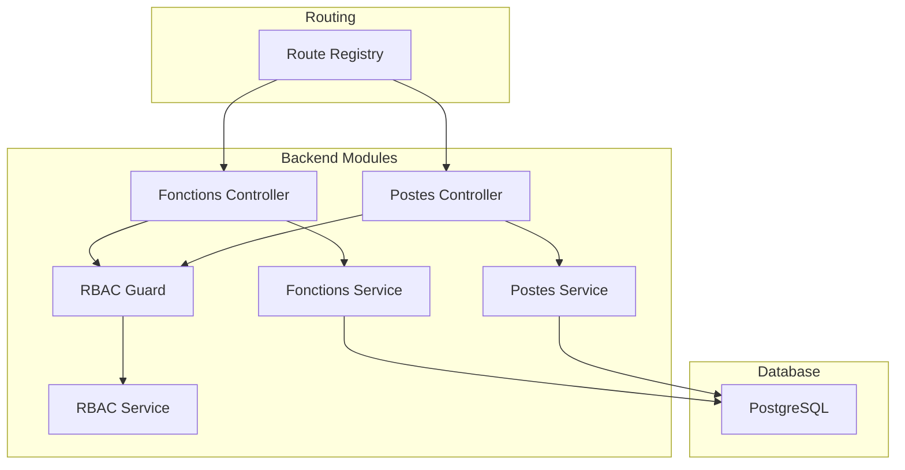
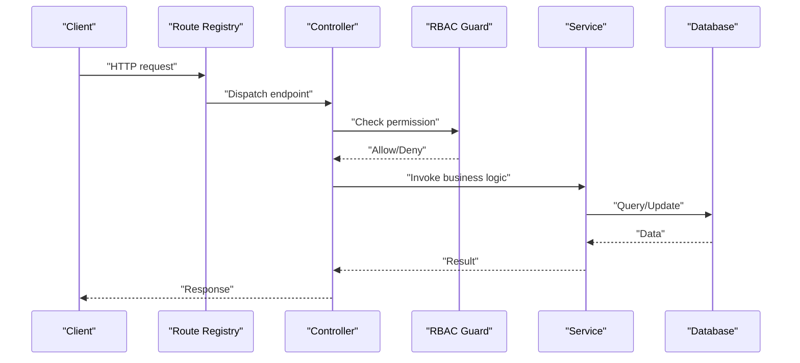
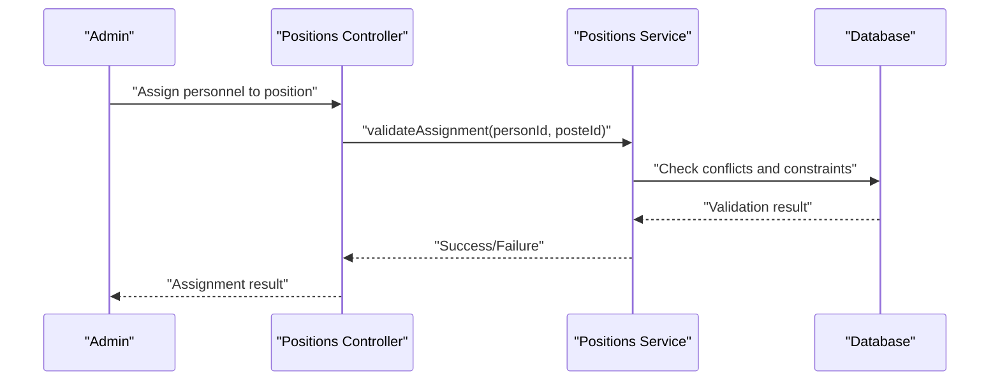
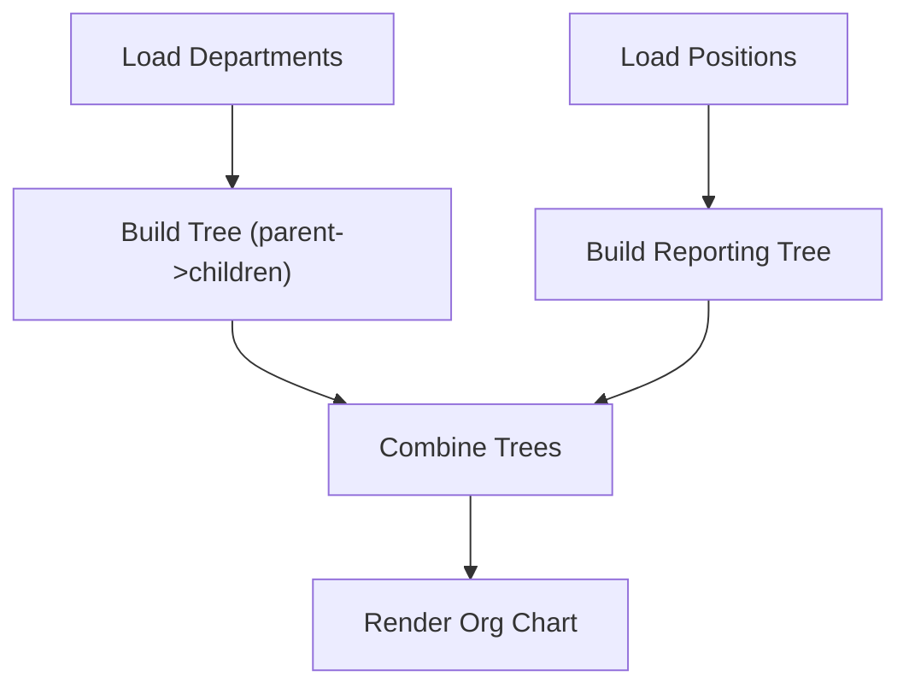
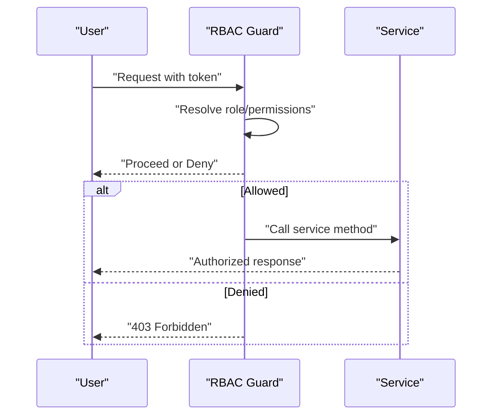
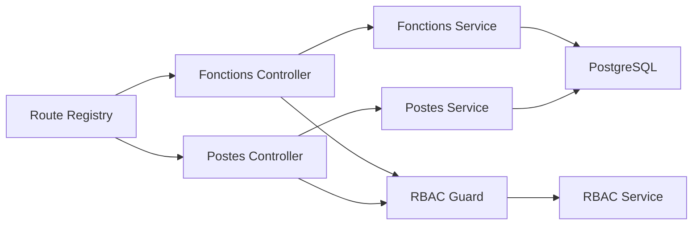

# Organizational Structure

<cite>
**Referenced Files in This Document**
- [044-module-organisation.sql](file://backend/database/migrations/044-module-organisation.sql)
- [045-organisation-optimisations.sql](file://backend/database/migrations/045-organisation-optimisations.sql)
- [046-organisation-performance-avancee.sql](file://backend/database/migrations/046-organisation-performance-avancee.sql)
- [109-refonte-organisation.sql](file://backend/database/migrations/109-refonte-organisation.sql)
- [fonctions.controller.ts](file://backend/src/modules/fonctions/controllers/fonctions.controller.ts)
- [fonctions.service.ts](file://backend/src/modules/fonctions/services/fonctions.service.ts)
- [postes.controller.ts](file://backend/src/modules/postes/controllers/postes.controller.ts)
- [postes.service.ts](file://backend/src/modules/postes/services/postes.service.ts)
- [rbac.guard.ts](file://backend/src/modules/rbac/guards/rbac.guard.ts)
- [rbac.service.ts](file://backend/src/modules/rbac/services/rbac.service.ts)
- [personnel.constants.ts](file://backend/src/shared/constants/personnel.constants.ts)
</cite>

## Update Summary
**Changes Made**
- Updated architecture overview to reflect the removal of direct REST API controller and consolidation into other controllers
- Simplified backend service layer documentation to remove redundant code paths
- Updated data model references to include new refactoring migration (109-refonte-organisation.sql)
- Streamlined component analysis to focus on consolidated functionality
- Updated dependency analysis to reflect simplified architecture

## Table of Contents
1. [Introduction](#introduction)
2. [Project Structure](#project-structure)
3. [Core Components](#core-components)
4. [Architecture Overview](#architecture-overview)
5. [Detailed Component Analysis](#detailed-component-analysis)
6. [Dependency Analysis](#dependency-analysis)
7. [Performance Considerations](#performance-considerations)
8. [Troubleshooting Guide](#troubleshooting-guide)
9. [Conclusion](#conclusion)
10. [Appendices](#appendices)

## Introduction
This document explains the organizational structure sub-feature for an educational institution. It covers how to define organizational units, establish reporting relationships, manage position hierarchies, and link these structures to access control permissions. The system has undergone major refactoring with a simplified backend service layer and consolidated API endpoints, removing redundant code paths while maintaining full functionality.

## Project Structure
The organizational structure is implemented as a set of backend modules with optimized controllers and services following a refactored architecture:
- Database schema and indexes are defined in migration files under the database/migrations directory, including the latest refactoring migration.
- Business logic and API endpoints are organized by feature modules (fonctions, postes) with consolidated functionality.
- Access control integrates with the RBAC module to enforce permissions based on roles and permissions.
- Direct REST API controller has been removed with functionality consolidated into specialized controllers.



**Diagram sources**
- [fonctions.controller.ts](file://backend/src/modules/fonctions/controllers/fonctions.controller.ts)
- [fonctions.service.ts](file://backend/src/modules/fonctions/services/fonctions.service.ts)
- [postes.controller.ts](file://backend/src/modules/postes/controllers/postes.controller.ts)
- [postes.service.ts](file://backend/src/modules/postes/services/postes.service.ts)
- [rbac.guard.ts](file://backend/src/modules/rbac/guards/rbac.guard.ts)
- [rbac.service.ts](file://backend/src/modules/rbac/services/rbac.service.ts)

**Section sources**
- [044-module-organisation.sql](file://backend/database/migrations/044-module-organisation.sql)
- [045-organisation-optimisations.sql](file://backend/database/migrations/045-organisation-optimisations.sql)
- [046-organisation-performance-avancee.sql](file://backend/database/migrations/046-organisation-performance-avancee.sql)
- [109-refonte-organisation.sql](file://backend/database/migrations/109-refonte-organisation.sql)

## Core Components
- Function definitions: Define job functions/responsibilities and associate them with positions through consolidated controllers.
- Position management: Define positions, assign functions, specify reporting lines, and link positions to personnel via optimized services.
- Reporting and charting: Retrieve hierarchical trees for departments and positions through streamlined APIs.
- Access control integration: Restrict operations based on RBAC roles and permissions with enhanced guard mechanisms.

Key implementation references:
- Functions CRUD and associations: [fonctions.controller.ts](file://backend/src/modules/fonctions/controllers/fonctions.controller.ts), [fonctions.service.ts](file://backend/src/modules/fonctions/services/fonctions.service.ts)
- Positions CRUD, reporting, and assignments: [postes.controller.ts](file://backend/src/modules/postes/controllers/postes.controller.ts), [postes.service.ts](file://backend/src/modules/postes/services/postes.service.ts)
- RBAC enforcement: [rbac.guard.ts](file://backend/src/modules/rbac/guards/rbac.guard.ts), [rbac.service.ts](file://backend/src/modules/rbac/services/rbac.service.ts)
- Shared constants for personnel-related enums: [personnel.constants.ts](file://backend/src/shared/constants/personnel.constants.ts)

**Section sources**
- [fonctions.controller.ts](file://backend/src/modules/fonctions/controllers/fonctions.controller.ts)
- [fonctions.service.ts](file://backend/src/modules/fonctions/services/fonctions.service.ts)
- [postes.controller.ts](file://backend/src/modules/postes/controllers/postes.controller.ts)
- [postes.service.ts](file://backend/src/modules/postes/services/postes.service.ts)
- [rbac.guard.ts](file://backend/src/modules/rbac/guards/rbac.guard.ts)
- [rbac.service.ts](file://backend/src/modules/rbac/services/rbac.service.ts)
- [personnel.constants.ts](file://backend/src/shared/constants/personnel.constants.ts)

## Architecture Overview
The system follows a streamlined layered architecture after major refactoring:
- Controllers handle HTTP requests with consolidated functionality and simplified routing.
- Services encapsulate business logic with optimized data access patterns.
- Database migrations define entities and relationships with enhanced performance.
- RBAC guard intercepts requests to enforce permissions with improved efficiency.



**Diagram sources**
- [rbac.guard.ts](file://backend/src/modules/rbac/guards/rbac.guard.ts)
- [rbac.service.ts](file://backend/src/modules/rbac/services/rbac.service.ts)
- [fonctions.controller.ts](file://backend/src/modules/fonctions/controllers/fonctions.controller.ts)
- [fonctions.service.ts](file://backend/src/modules/fonctions/services/fonctions.service.ts)
- [postes.controller.ts](file://backend/src/modules/postes/controllers/postes.controller.ts)
- [postes.service.ts](file://backend/src/modules/postes/services/postes.service.ts)

## Detailed Component Analysis

### Functions (Job Responsibilities)
- Purpose: Define standardized job functions/responsibilities used across positions through consolidated controllers.
- Key operations:
  - Create/update/delete functions via optimized endpoints.
  - Associate functions with multiple positions through streamlined services.
  - Query positions by function with enhanced performance.
- Example workflows:
  - Defining a new function such as "Mathematics Teacher".
  - Linking the function to several positions efficiently.
  - Removing a function from a position while preserving history if needed.

```mermaid
classDiagram
class Fonction {
+id
+code
+label
+description
+isActive
}
class Poste {
+id
+code
+title
+functionId
+reportToPosteId
+isActive
}
Fonction <|--o{ Poste : "assigned via functionId"
```

**Diagram sources**
- [fonctions.controller.ts](file://backend/src/modules/fonctions/controllers/fonctions.controller.ts)
- [fonctions.service.ts](file://backend/src/modules/fonctions/services/fonctions.service.ts)
- [postes.controller.ts](file://backend/src/modules/postes/controllers/postes.controller.ts)
- [postes.service.ts](file://backend/src/modules/postes/services/postes.service.ts)

**Section sources**
- [fonctions.controller.ts](file://backend/src/modules/fonctions/controllers/fonctions.controller.ts)
- [fonctions.service.ts](file://backend/src/modules/fonctions/services/fonctions.service.ts)
- [postes.controller.ts](file://backend/src/modules/postes/controllers/postes.controller.ts)
- [postes.service.ts](file://backend/src/modules/postes/services/postes.service.ts)

### Positions (Roles within the Organization)
- Purpose: Model concrete positions that can be filled by personnel, including reporting relationships through optimized services.
- Key operations:
  - Create/update/delete positions via consolidated controllers.
  - Assign a function to a position with enhanced validation.
  - Define reporting line to another position (manager).
  - Assign personnel to positions (subject to availability rules).
  - Query position hierarchy and reporting chains with improved performance.
- Example workflows:
  - Creating a "Head of Department" position and linking it to a function.
  - Setting a manager position for subordinate positions.
  - Reassigning a staff member to a different position efficiently.
  - Generating a reporting chain for audits with optimized queries.



**Diagram sources**
- [postes.controller.ts](file://backend/src/modules/postes/controllers/postes.controller.ts)
- [postes.service.ts](file://backend/src/modules/postes/services/postes.service.ts)

**Section sources**
- [postes.controller.ts](file://backend/src/modules/postes/controllers/postes.controller.ts)
- [postes.service.ts](file://backend/src/modules/postes/services/postes.service.ts)

### Organizational Charts and Structural Reporting
- Capabilities:
  - Build department trees using parent-child links through optimized services.
  - Build position trees using reporting lines with enhanced performance.
  - Combine both to visualize organization charts via consolidated endpoints.
- Typical outputs:
  - Flat lists with depth levels for UI trees.
  - Ancestor/descendant sets for filtering.
  - Aggregated counts (staff per department, positions per function).



[No sources needed since this diagram shows conceptual workflow, not actual code structure]

### Access Control Integration
- Enforcement points:
  - RBAC guard validates permissions before controller actions execute with improved efficiency.
  - Permissions may be scoped by establishment context.
- Practical implications:
  - Only authorized users can create/edit departments and positions.
  - Role-based visibility affects which organizational units are returned.



**Diagram sources**
- [rbac.guard.ts](file://backend/src/modules/rbac/guards/rbac.guard.ts)
- [rbac.service.ts](file://backend/src/modules/rbac/services/rbac.service.ts)

**Section sources**
- [rbac.guard.ts](file://backend/src/modules/rbac/guards/rbac.guard.ts)
- [rbac.service.ts](file://backend/src/modules/rbac/services/rbac.service.ts)

## Dependency Analysis
- Module coupling:
  - Controllers depend on services for business logic with simplified dependencies.
  - Services depend on database entities and indexes with optimized queries.
  - RBAC guard depends on RBAC service for permission checks with enhanced performance.
- External dependencies:
  - PostgreSQL for persistence.
  - Central route registry for endpoint registration.



**Diagram sources**
- [fonctions.controller.ts](file://backend/src/modules/fonctions/controllers/fonctions.controller.ts)
- [fonctions.service.ts](file://backend/src/modules/fonctions/services/fonctions.service.ts)
- [postes.controller.ts](file://backend/src/modules/postes/controllers/postes.controller.ts)
- [postes.service.ts](file://backend/src/modules/postes/services/postes.service.ts)
- [rbac.guard.ts](file://backend/src/modules/rbac/guards/rbac.guard.ts)
- [rbac.service.ts](file://backend/src/modules/rbac/services/rbac.service.ts)

**Section sources**
- [044-module-organisation.sql](file://backend/database/migrations/044-module-organisation.sql)
- [045-organisation-optimisations.sql](file://backend/database/migrations/045-organisation-optimisations.sql)
- [046-organisation-performance-avancee.sql](file://backend/database/migrations/046-organisation-performance-avancee.sql)
- [109-refonte-organisation.sql](file://backend/database/migrations/109-refonte-organisation.sql)

## Performance Considerations
- Index usage:
  - Ensure indexes exist on foreign keys and frequently queried columns (e.g., parent_id, function_id, report_to_poste_id).
  - Leverage composite indexes for common filter combinations with optimized query patterns.
- Query patterns:
  - Use recursive or iterative approaches carefully for deep hierarchies through streamlined services.
  - Paginate large lists and avoid loading entire trees when unnecessary.
- Caching:
  - Cache static configuration like functions and active positions where appropriate.
- Concurrency:
  - Apply optimistic concurrency controls for critical updates (e.g., reassignments) with enhanced validation.

## Troubleshooting Guide
Common issues and resolutions:
- Permission denied errors:
  - Verify user roles and permissions via RBAC guard/service with improved error handling.
  - Confirm establishment scoping aligns with the requested resource.
- Circular reporting:
  - Prevent cycles in reporting relationships during assignment validation with enhanced checks.
- Duplicate codes/names:
  - Enforce uniqueness constraints at the database level and validate in services.
- Performance regressions:
  - Check missing indexes and heavy queries; add targeted indexes with monitoring.
- Data integrity:
  - Validate referential integrity when deleting departments or positions with children.

**Section sources**
- [rbac.guard.ts](file://backend/src/modules/rbac/guards/rbac.guard.ts)
- [rbac.service.ts](file://backend/src/modules/rbac/services/rbac.service.ts)
- [044-module-organisation.sql](file://backend/database/migrations/044-module-organisation.sql)
- [045-organisation-optimisations.sql](file://backend/database/migrations/045-organisation-optimisations.sql)
- [046-organisation-performance-avancee.sql](file://backend/database/migrations/046-organisation-performance-avancee.sql)
- [109-refonte-organisation.sql](file://backend/database/migrations/109-refonte-organisation.sql)

## Conclusion
The organizational structure sub-feature provides a robust foundation for modeling functions and positions with clear reporting lines and strong access control. Following the major refactoring with simplified backend service layer and consolidated API endpoints, institutions can maintain accurate organizational charts, manage changes efficiently, and ensure secure, role-based access to sensitive HR data through optimized and streamlined interfaces.

## Appendices

### Practical Examples

- Creating an organizational chart:
  - Define top-level departments, then add sub-departments by setting parents.
  - Build position trees by assigning reporting managers through consolidated controllers.
  - Combine both views to produce a comprehensive org chart via optimized endpoints.

- Assigning staff to positions:
  - Select a valid position linked to a function.
  - Validate availability and conflicts before assignment through enhanced services.
  - Record the assignment and update reporting lines as needed.

- Defining function responsibilities:
  - Create a function with descriptive labels and descriptions.
  - Link the function to relevant positions through streamlined APIs.
  - Periodically review and update functions to reflect evolving roles.

- Managing departmental structures:
  - Re-parent departments to reflect restructuring.
  - Archive inactive units rather than deleting to preserve historical data.
  - Use aggregated reports to monitor staffing ratios and coverage.

- Handling organizational changes:
  - Plan reassignments with change windows.
  - Audit trails should capture who made changes and when.
  - Communicate updates through notifications or dashboards.