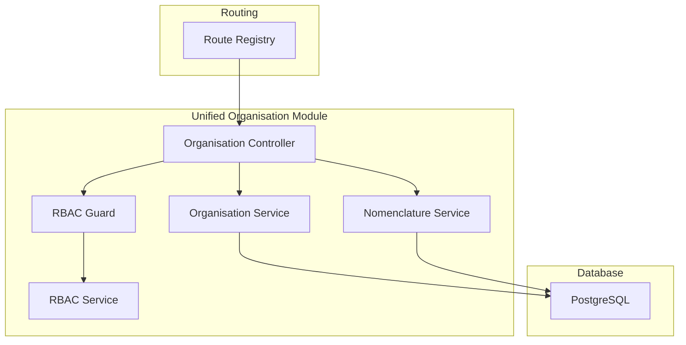
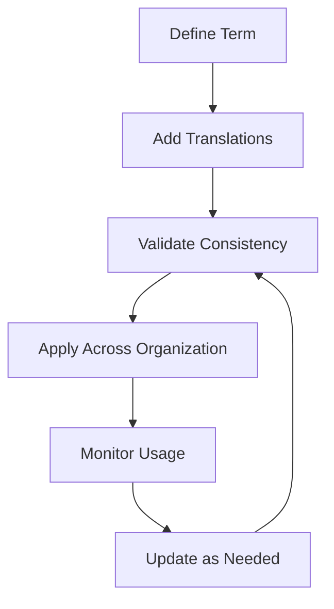
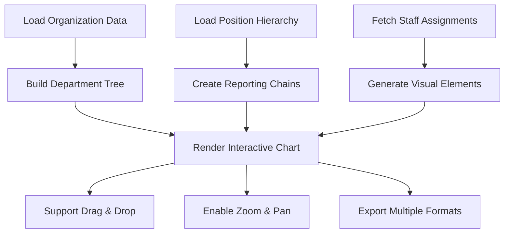
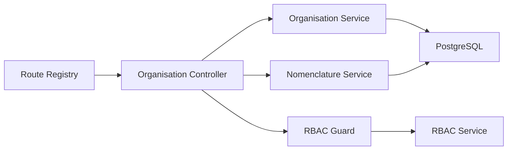

# Organizational Structure

<cite>
**Referenced Files in This Document**
- [044-module-organisation.sql](file://backend/database/migrations/044-module-organisation.sql)
- [045-organisation-optimisations.sql](file://backend/database/migrations/045-organisation-optimisations.sql)
- [046-organisation-performance-avancee.sql](file://backend/database/migrations/046-organisation-performance-avancee.sql)
- [109-refonte-organisation.sql](file://backend/database/migrations/109-refonte-organisation.sql)
- [110-consolidation-organisation.sql](file://backend/database/migrations/110-consolidation-organisation.sql)
- [organisation.controller.ts](file://backend/src/modules/organisation/controllers/organisation.controller.ts)
- [organisation.service.ts](file://backend/src/modules/organisation/services/organisation.service.ts)
- [nomenclature.service.ts](file://backend/src/modules/organisation/services/nomenclature.service.ts)
- [rbac.guard.ts](file://backend/src/modules/rbac/guards/rbac.guard.ts)
- [rbac.service.ts](file://backend/src/modules/rbac/services/rbac.service.ts)
- [personnel.constants.ts](file://backend/src/shared/constants/personnel.constants.ts)
</cite>

## Update Summary
**Changes Made**
- Updated architecture overview to reflect major backend organization model restructuring with enhanced services and improved error handling
- Added documentation for the new nomenclature system that replaces database enums with dedicated tables
- Updated frontend organizational chart implementation from separate horizontal/vertical components to unified flow-based approach
- Enhanced service architecture with better separation of concerns and improved data validation
- Streamlined API endpoints with consolidated functionality and simplified routing patterns

## Table of Contents
1. [Introduction](#introduction)
2. [Project Structure](#project-structure)
3. [Core Components](#core-components)
4. [Architecture Overview](#architecture-overview)
5. [Detailed Component Analysis](#detailed-component-analysis)
6. [Dependency Analysis](#dependency-analysis)
7. [Performance Considerations](#performance-considerations)
8. [Troubleshooting Guide](#troubleshooting-guide)
9. [Conclusion](#conclusion)
10. [Appendices](#appendices)

## Introduction
This document explains the organizational structure sub-feature for an educational institution following a major architectural refactoring. The system has undergone significant backend restructuring with enhanced services, improved nomenclature management replacing database enums with dedicated tables, and better error handling. The frontend organizational chart has been simplified from separate horizontal/vertical components to a unified flow-based approach. It covers how to define organizational units, establish reporting relationships, manage position hierarchies, and link these structures to access control permissions through streamlined APIs and optimized services.

## Project Structure
The organizational structure is now implemented as a unified backend module with consolidated functionality and enhanced service architecture:
- Database schema and indexes are defined in migration files under the database/migrations directory, including the latest consolidation migrations.
- Business logic and API endpoints are organized within the unified organisation module with specialized services.
- Access control integrates with the RBAC module to enforce permissions based on roles and permissions.
- Enhanced nomenclature management provides standardized terminology across the organization with dedicated table support.



**Diagram sources**
- [organisation.controller.ts](file://backend/src/modules/organisation/controllers/organisation.controller.ts)
- [organisation.service.ts](file://backend/src/modules/organisation/services/organisation.service.ts)
- [nomenclature.service.ts](file://backend/src/modules/organisation/services/nomenclature.service.ts)
- [rbac.guard.ts](file://backend/src/modules/rbac/guards/rbac.guard.ts)
- [rbac.service.ts](file://backend/src/modules/rbac/services/rbac.service.ts)

**Section sources**
- [044-module-organisation.sql](file://backend/database/migrations/044-module-organisation.sql)
- [045-organisation-optimisations.sql](file://backend/database/migrations/045-organisation-optimisations.sql)
- [046-organisation-performance-avancee.sql](file://backend/database/migrations/046-organisation-performance-avancee.sql)
- [109-refonte-organisation.sql](file://backend/database/migrations/109-refonte-organisation.sql)
- [110-consolidation-organisation.sql](file://backend/database/migrations/110-consolidation-organisation.sql)

## Core Components
- Unified function and position management: Consolidated job functions and positions within the organisation module through streamlined controllers and services with enhanced validation.
- Enhanced nomenclature management: Standardized terminology and definitions across organizational units with centralized management using dedicated tables instead of database enums.
- Interactive organizational charts: Build department trees and position hierarchies with real-time visualization capabilities using unified flow-based approach.
- Advanced reporting and analytics: Generate comprehensive organizational reports with performance optimizations and improved error handling.
- Access control integration: Restrict operations based on RBAC roles and permissions with enhanced guard mechanisms and better scoping.

Key implementation references:
- Unified organisation management: [organisation.controller.ts](file://backend/src/modules/organisation/controllers/organisation.controller.ts), [organisation.service.ts](file://backend/src/modules/organisation/services/organisation.service.ts)
- Nomenclature management: [nomenclature.service.ts](file://backend/src/modules/organisation/services/nomenclature.service.ts)
- RBAC enforcement: [rbac.guard.ts](file://backend/src/modules/rbac/guards/rbac.guard.ts), [rbac.service.ts](file://backend/src/modules/rbac/services/rbac.service.ts)
- Shared constants for personnel-related enums: [personnel.constants.ts](file://backend/src/shared/constants/personnel.constants.ts)

**Section sources**
- [organisation.controller.ts](file://backend/src/modules/organisation/controllers/organisation.controller.ts)
- [organisation.service.ts](file://backend/src/modules/organisation/services/organisation.service.ts)
- [nomenclature.service.ts](file://backend/src/modules/organisation/services/nomenclature.service.ts)
- [rbac.guard.ts](file://backend/src/modules/rbac/guards/rbac.guard.ts)
- [rbac.service.ts](file://backend/src/modules/rbac/services/rbac.service.ts)
- [personnel.constants.ts](file://backend/src/shared/constants/personnel.constants.ts)

## Architecture Overview
The system follows a streamlined unified architecture after major refactoring with consolidated modules and enhanced service layer:
- Controllers handle HTTP requests with consolidated functionality and simplified routing patterns with improved error handling.
- Services encapsulate business logic with optimized data access patterns and enhanced nomenclature support using dedicated tables.
- Database migrations define entities and relationships with enhanced performance and data integrity through consolidation migrations.
- RBAC guard intercepts requests to enforce permissions with improved efficiency and scoping capabilities.

```mermaid
sequenceDiagram
participant Client as "Client"
participant Router as "Route Registry"
participant Ctrl as "Organisation Controller"
participant Guard as "RBAC Guard"
participant Svc as "Organisation Service"
param Svc as "Nomenclature Service"
participant DB as "Database"
Client->>Router : "HTTP request"
Router->>Ctrl : "Dispatch endpoint"
Ctrl->>Guard : "Check permission"
Guard-->>Ctrl : "Allow/Deny"
Ctrl->>Svc : "Invoke business logic"
Ctrl->>param Svc : "Access nomenclature"
Svc->>DB : "Query/Update"
param Svc->>DB : "Manage terminology"
DB-->>Svc : "Data"
DB-->>param Svc : "Terminology"
Svc-->>Ctrl : "Result"
param Svc-->>Ctrl : "Nomenclature data"
Ctrl-->>Client : "Response"
```

**Diagram sources**
- [rbac.guard.ts](file://backend/src/modules/rbac/guards/rbac.guard.ts)
- [rbac.service.ts](file://backend/src/modules/rbac/services/rbac.service.ts)
- [organisation.controller.ts](file://backend/src/modules/organisation/controllers/organisation.controller.ts)
- [organisation.service.ts](file://backend/src/modules/organisation/services/organisation.service.ts)
- [nomenclature.service.ts](file://backend/src/modules/organisation/services/nomenclature.service.ts)

## Detailed Component Analysis

### Unified Organisation Management
- Purpose: Consolidates former 'postes' and 'fonctions' functionality into a single cohesive module through streamlined controllers and services with enhanced validation and error handling.
- Key operations:
  - Create/update/delete organizational units via optimized endpoints with improved data validation.
  - Manage position hierarchies and reporting relationships through consolidated services with cycle detection.
  - Handle function-to-position associations with enhanced validation and referential integrity checks.
  - Query organizational structures with improved performance and pagination support.
- Example workflows:
  - Creating a complete organizational unit with associated positions and functions through streamlined APIs.
  - Managing complex reporting chains with automatic cycle prevention and validation.
  - Reassigning staff across departments efficiently with proper audit trails.

```mermaid
classDiagram
class OrganisationUnit {
+id
+code
+label
+description
+parentId
+isActive
}
class Position {
+id
+code
+title
+functionId
+reportToPositionId
+isActive
}
class Function {
+id
+code
+label
+description
+isActive
}
OrganisationUnit <|--o Position : "contains"
Function <|--o{ Position : "assigned via functionId"
```

**Diagram sources**
- [organisation.controller.ts](file://backend/src/modules/organisation/controllers/organisation.controller.ts)
- [organisation.service.ts](file://backend/src/modules/organisation/services/organisation.service.ts)

**Section sources**
- [organisation.controller.ts](file://backend/src/modules/organisation/controllers/organisation.controller.ts)
- [organisation.service.ts](file://backend/src/modules/organisation/services/organisation.service.ts)

### Enhanced Nomenclature Management
- Purpose: Provides centralized management of organizational terminology and standardized definitions across all modules using dedicated tables instead of database enums.
- Key operations:
  - Define and manage standardized terms for positions, departments, and functions with enhanced validation.
  - Support multilingual terminology with automatic translation management and consistency checks.
  - Enforce consistency across organizational units and positions through centralized validation.
  - Provide autocomplete and validation for standardized terms with improved performance.
- Example workflows:
  - Creating standardized position titles across multiple departments with automatic validation.
  - Managing department naming conventions and abbreviations with conflict resolution.
  - Ensuring consistent terminology in reports and communications through centralized management.



[No sources needed since this diagram shows conceptual workflow, not actual code structure]

**Section sources**
- [nomenclature.service.ts](file://backend/src/modules/organisation/services/nomenclature.service.ts)

### Interactive Organizational Charts
- Capabilities:
  - Build dynamic department trees using parent-child relationships through optimized services with unified flow-based approach.
  - Create position hierarchies with real-time reporting line updates and improved performance.
  - Generate interactive visualizations with drag-and-drop reorganization using simplified component architecture.
  - Export organizational structures in multiple formats (PDF, PNG, SVG) with enhanced rendering options.
- Typical outputs:
  - Real-time hierarchical views with expandable nodes and improved responsiveness.
  - Annotated charts showing staff assignments and vacancies with better visualization.
  - Comparative views for organizational restructuring planning with side-by-side comparison.



[No sources needed since this diagram shows conceptual workflow, not actual code structure]

### Access Control Integration
- Enforcement points:
  - RBAC guard validates permissions before controller actions execute with improved efficiency and better error messages.
  - Permissions may be scoped by establishment context and organizational unit with enhanced filtering.
  - Role-based visibility affects which organizational structures are accessible with granular control.
- Practical implications:
  - Only authorized users can create/edit organizational units and positions with proper validation.
  - Hierarchical permissions allow managers to access subordinate units with inheritance rules.
  - Audit trails track all organizational changes with user attribution and detailed context.

```mermaid
sequenceDiagram
participant User as "User"
participant Guard as "RBAC Guard"
param Svc as "Nomenclature Service"
participant Svc as "Organisation Service"
User->>Guard : "Request with token"
Guard->>Guard : "Resolve role/permissions"
alt Allowed
Guard->>Svc : "Call organisation method"
Guard->>param Svc : "Access nomenclature"
Svc-->>User : "Authorized response"
param Svc-->>User : "Terminology data"
else Denied
Guard-->>User : "403 Forbidden"
end
```

**Diagram sources**
- [rbac.guard.ts](file://backend/src/modules/rbac/guards/rbac.guard.ts)
- [rbac.service.ts](file://backend/src/modules/rbac/services/rbac.service.ts)
- [organisation.service.ts](file://backend/src/modules/organisation/services/organisation.service.ts)
- [nomenclature.service.ts](file://backend/src/modules/organisation/services/nomenclature.service.ts)

**Section sources**
- [rbac.guard.ts](file://backend/src/modules/rbac/guards/rbac.guard.ts)
- [rbac.service.ts](file://backend/src/modules/rbac/services/rbac.service.ts)
- [organisation.service.ts](file://backend/src/modules/organisation/services/organisation.service.ts)
- [nomenclature.service.ts](file://backend/src/modules/organisation/services/nomenclature.service.ts)

## Dependency Analysis
- Module coupling:
  - Unified controller depends on specialized services for business logic with simplified dependencies and better error handling.
  - Services depend on database entities and indexes with optimized queries and enhanced validation.
  - RBAC guard depends on RBAC service for permission checks with enhanced performance and caching.
  - Nomenclature service provides shared terminology across organisational components with dedicated table support.
- External dependencies:
  - PostgreSQL for persistence with enhanced indexing strategies and improved query performance.
  - Central route registry for endpoint registration with simplified routing patterns.
  - Frontend charting libraries for interactive visualizations with unified flow-based approach.



**Diagram sources**
- [organisation.controller.ts](file://backend/src/modules/organisation/controllers/organisation.controller.ts)
- [organisation.service.ts](file://backend/src/modules/organisation/services/organisation.service.ts)
- [nomenclature.service.ts](file://backend/src/modules/organisation/services/nomenclature.service.ts)
- [rbac.guard.ts](file://backend/src/modules/rbac/guards/rbac.guard.ts)
- [rbac.service.ts](file://backend/src/modules/rbac/services/rbac.service.ts)

**Section sources**
- [044-module-organisation.sql](file://backend/database/migrations/044-module-organisation.sql)
- [045-organisation-optimisations.sql](file://backend/database/migrations/045-organisation-optimisations.sql)
- [046-organisation-performance-avancee.sql](file://backend/database/migrations/046-organisation-performance-avancee.sql)
- [109-refonte-organisation.sql](file://backend/database/migrations/109-refonte-organisation.sql)
- [110-consolidation-organisation.sql](file://backend/database/migrations/110-consolidation-organisation.sql)

## Performance Considerations
- Index usage:
  - Ensure indexes exist on foreign keys and frequently queried columns (e.g., parent_id, function_id, report_to_position_id) with optimized query patterns.
  - Leverage composite indexes for common filter combinations and nomenclature lookups with enhanced performance.
  - Utilize full-text search indexes for nomenclature lookups and improve search capabilities.
- Query patterns:
  - Use recursive or iterative approaches carefully for deep hierarchies through streamlined services with better optimization.
  - Implement pagination for large organizational structures and avoid loading entire trees when unnecessary.
  - Cache frequently accessed nomenclature data to reduce database load with improved cache strategies.
- Caching:
  - Cache static configuration like functions, positions, and active organizational units where appropriate with better invalidation.
  - Implement cache invalidation strategies for real-time organizational updates with enhanced monitoring.
- Concurrency:
  - Apply optimistic concurrency controls for critical updates (e.g., reassignments, structural changes) with enhanced validation and error handling.
  - Use database transactions for complex multi-step organizational modifications with improved rollback capabilities.

## Troubleshooting Guide
Common issues and resolutions:
- Permission denied errors:
  - Verify user roles and permissions via RBAC guard/service with improved error handling and detailed logging.
  - Confirm establishment scoping aligns with the requested organizational resource with better validation.
- Circular reporting:
  - Prevent cycles in reporting relationships during assignment validation with enhanced checks and better error messages.
  - Validate hierarchical integrity when creating or modifying organizational structures with comprehensive validation.
- Duplicate codes/names:
  - Enforce uniqueness constraints at the database level and validate in services with improved conflict resolution.
  - Check nomenclature conflicts when standardizing terminology with better duplicate detection.
- Performance regressions:
  - Check missing indexes and heavy queries; add targeted indexes with monitoring and performance profiling.
  - Monitor nomenclature lookup performance and optimize caching strategies with better metrics.
- Data integrity:
  - Validate referential integrity when deleting organizational units or positions with children with enhanced cascade handling.
  - Ensure nomenclature consistency across all organizational references with automated validation.
- Migration issues:
  - Verify successful execution of consolidation migrations (109-refonte-organisation.sql, 110-consolidation-organisation.sql) with better rollback support.
  - Check data integrity after module consolidation and resolve any orphaned records with automated cleanup tools.
- Nomenclature system issues:
  - Verify dedicated tables are properly created and populated instead of enum values with migration verification.
  - Check nomenclature service connectivity and database connections with improved error reporting.

**Section sources**
- [rbac.guard.ts](file://backend/src/modules/rbac/guards/rbac.guard.ts)
- [rbac.service.ts](file://backend/src/modules/rbac/services/rbac.service.ts)
- [organisation.service.ts](file://backend/src/modules/organisation/services/organisation.service.ts)
- [nomenclature.service.ts](file://backend/src/modules/organisation/services/nomenclature.service.ts)
- [044-module-organisation.sql](file://backend/database/migrations/044-module-organisation.sql)
- [045-organisation-optimisations.sql](file://backend/database/migrations/045-organisation-optimisations.sql)
- [046-organisation-performance-avancee.sql](file://backend/database/migrations/046-organisation-performance-avancee.sql)
- [109-refonte-organisation.sql](file://backend/database/migrations/109-refonte-organisation.sql)
- [110-consolidation-organisation.sql](file://backend/database/migrations/110-consolidation-organisation.sql)

## Conclusion
The organizational structure sub-feature provides a robust foundation for modeling functions and positions with clear reporting lines and strong access control. Following the major architectural refactoring that consolidated separate modules into a unified organisation module with enhanced service architecture, improved nomenclature system replacing database enums with dedicated tables, and better error handling, institutions can maintain accurate organizational charts, manage changes efficiently, and ensure secure, role-based access to sensitive HR data through streamlined interfaces with unified flow-based visualization capabilities and enhanced performance.

## Appendices

### Practical Examples

- Creating an organizational chart:
  - Define top-level departments using the unified organisation module with enhanced validation.
  - Add sub-departments by setting parent relationships through consolidated controllers with improved error handling.
  - Build position hierarchies by assigning reporting managers with enhanced validation and cycle detection.
  - Combine both views to produce comprehensive org charts via optimized endpoints with unified flow-based approach.

- Assigning staff to positions:
  - Select a valid position linked to a standardized function through nomenclature management.
  - Validate availability and conflicts before assignment through enhanced services with better error reporting.
  - Record the assignment and update reporting lines as needed with proper audit trails.
  - Ensure nomenclature consistency across all related entries with automated validation.

- Defining function responsibilities:
  - Create functions with descriptive labels and descriptions using standardized terminology from nomenclature system.
  - Link functions to relevant positions through streamlined APIs with enhanced validation.
  - Periodically review and update functions to reflect evolving roles while maintaining consistency with centralized management.

- Managing departmental structures:
  - Re-parent departments to reflect restructuring with proper validation and impact assessment.
  - Archive inactive units rather than deleting to preserve historical data with soft delete support.
  - Use aggregated reports to monitor staffing ratios and coverage across the organization with enhanced analytics.

- Handling organizational changes:
  - Plan reassignments with change windows and proper notification systems with improved communication tools.
  - Audit trails should capture who made changes and when with detailed context and enhanced logging.
  - Communicate updates through notifications or dashboards with impact assessments and better visualization.
  - Leverage interactive charts to visualize proposed changes before implementation with unified flow-based approach.

- Managing organizational terminology:
  - Establish standardized position titles and department names through nomenclature management with dedicated table support.
  - Maintain multilingual support for international educational institutions with enhanced translation management.
  - Enforce consistency across all organizational documents and communications with automated validation.
  - Track terminology usage and identify outdated or conflicting terms with improved monitoring and reporting.