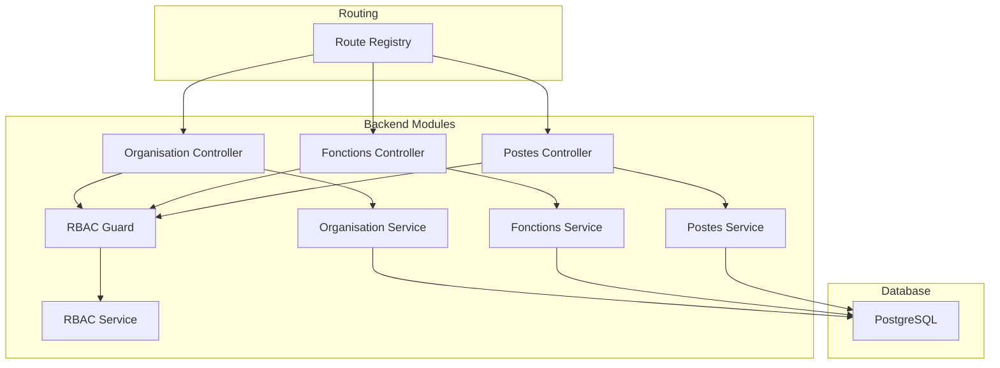
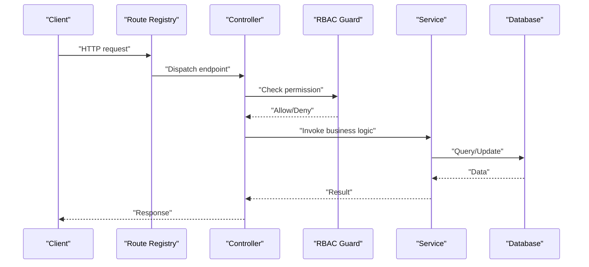
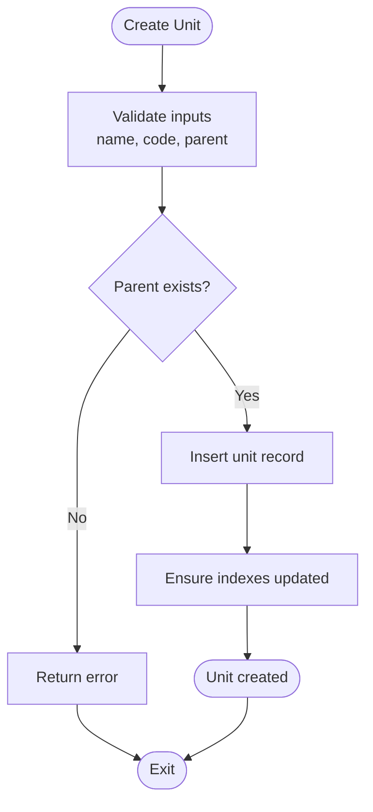
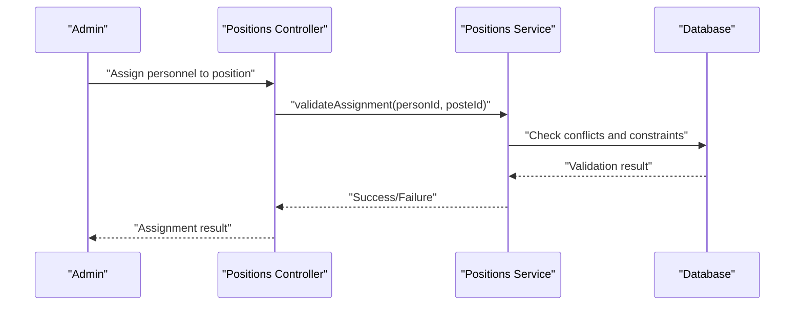
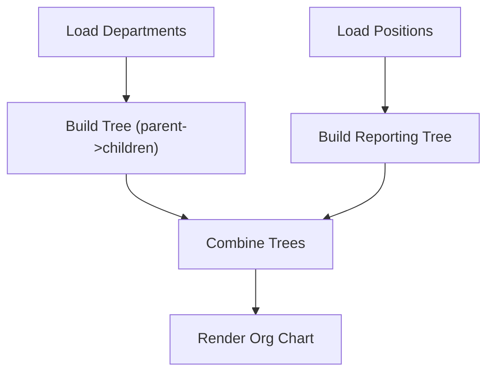
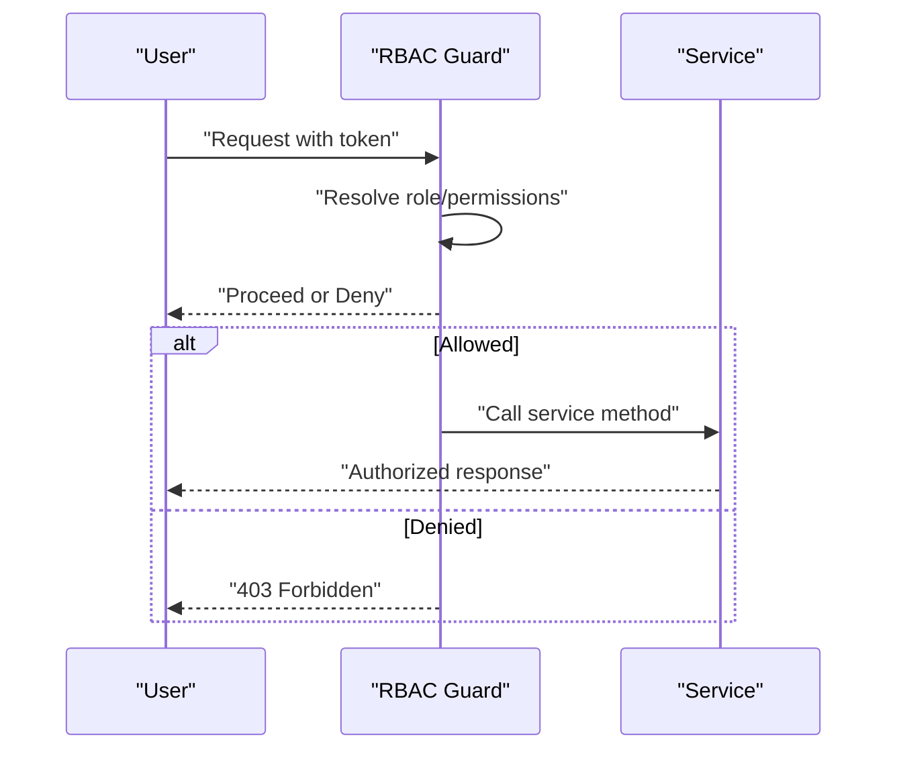
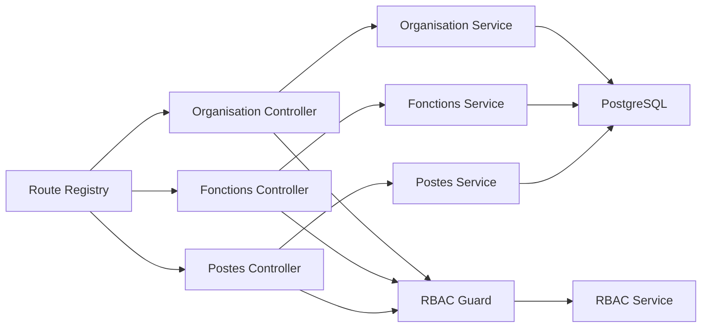

# Organizational Structure

<cite>
**Referenced Files in This Document**
- [044-module-organisation.sql](file://backend/database/migrations/044-module-organisation.sql)
- [045-organisation-optimisations.sql](file://backend/database/migrations/045-organisation-optimisations.sql)
- [046-organisation-performance-avancee.sql](file://backend/database/migrations/046-organisation-performance-avancee.sql)
- [fonctions.controller.ts](file://backend/src/modules/fonctions/controllers/fonctions.controller.ts)
- [fonctions.service.ts](file://backend/src/modules/fonctions/services/fonctions.service.ts)
- [postes.controller.ts](file://backend/src/modules/postes/controllers/postes.controller.ts)
- [postes.service.ts](file://backend/src/modules/postes/services/postes.service.ts)
- [organisation.controller.ts](file://backend/src/modules/organisation/controllers/organisation.controller.ts)
- [organisation.service.ts](file://backend/src/modules/organisation/services/organisation.service.ts)
- [rbac.guard.ts](file://backend/src/modules/rbac/guards/rbac.guard.ts)
- [rbac.service.ts](file://backend/src/modules/rbac/services/rbac.service.ts)
- [personnel.constants.ts](file://backend/src/shared/constants/personnel.constants.ts)
- [route-registry.ts](file://backend/src/routes/route-registry.ts)
</cite>

## Table of Contents
1. [Introduction](#introduction)
2. [Project Structure](#project-structure)
3. [Core Components](#core-components)
4. [Architecture Overview](#architecture-overview)
5. [Detailed Component Analysis](#detailed-component-analysis)
6. [Dependency Analysis](#dependency-analysis)
7. [Performance Considerations](#performance-considerations)
8. [Troubleshooting Guide](#troubleshooting-guide)
9. [Conclusion](#conclusion)
10. [Appendices](#appendices)

## Introduction
This document explains the organizational structure sub-feature for an educational institution. It covers how to define organizational units, establish reporting relationships, manage position hierarchies, and link these structures to access control permissions. It also provides practical examples for creating organizational charts, assigning staff to positions, defining function responsibilities, and managing departmental structures. Finally, it addresses organizational changes, reassignments, and structural reporting capabilities.

## Project Structure
The organizational structure is implemented as a set of backend modules with dedicated controllers, services, and database migrations:
- Database schema and indexes are defined in migration files under the database/migrations directory.
- Business logic and API endpoints are organized by feature modules (fonctions, postes, organisation).
- Access control integrates with the RBAC module to enforce permissions based on roles and permissions.
- Routes are registered centrally to expose REST endpoints.



**Diagram sources**
- [route-registry.ts](file://backend/src/routes/route-registry.ts)
- [organisation.controller.ts](file://backend/src/modules/organisation/controllers/organisation.controller.ts)
- [organisation.service.ts](file://backend/src/modules/organisation/services/organisation.service.ts)
- [fonctions.controller.ts](file://backend/src/modules/fonctions/controllers/fonctions.controller.ts)
- [fonctions.service.ts](file://backend/src/modules/fonctions/services/fonctions.service.ts)
- [postes.controller.ts](file://backend/src/modules/postes/controllers/postes.controller.ts)
- [postes.service.ts](file://backend/src/modules/postes/services/postes.service.ts)
- [rbac.guard.ts](file://backend/src/modules/rbac/guards/rbac.guard.ts)
- [rbac.service.ts](file://backend/src/modules/rbac/services/rbac.service.ts)

**Section sources**
- [044-module-organisation.sql](file://backend/database/migrations/044-module-organisation.sql)
- [045-organisation-optimisations.sql](file://backend/database/migrations/045-organisation-optimisations.sql)
- [046-organisation-performance-avancee.sql](file://backend/database/migrations/046-organisation-performance-avancee.sql)
- [route-registry.ts](file://backend/src/routes/route-registry.ts)

## Core Components
- Organisation unit management: Create, update, delete, and query departments or units; define parent-child relationships to build a hierarchy.
- Function definitions: Define job functions/responsibilities and associate them with positions.
- Position management: Define positions, assign functions, specify reporting lines, and link positions to personnel.
- Reporting and charting: Retrieve hierarchical trees for departments and positions; generate organizational charts.
- Access control integration: Restrict operations based on RBAC roles and permissions.

Key implementation references:
- Organisation CRUD and hierarchy APIs: [organisation.controller.ts](file://backend/src/modules/organisation/controllers/organisation.controller.ts), [organisation.service.ts](file://backend/src/modules/organisation/services/organisation.service.ts)
- Functions CRUD and associations: [fonctions.controller.ts](file://backend/src/modules/fonctions/controllers/fonctions.controller.ts), [fonctions.service.ts](file://backend/src/modules/fonctions/services/fonctions.service.ts)
- Positions CRUD, reporting, and assignments: [postes.controller.ts](file://backend/src/modules/postes/controllers/postes.controller.ts), [postes.service.ts](file://backend/src/modules/postes/services/postes.service.ts)
- RBAC enforcement: [rbac.guard.ts](file://backend/src/modules/rbac/guards/rbac.guard.ts), [rbac.service.ts](file://backend/src/modules/rbac/services/rbac.service.ts)
- Shared constants for personnel-related enums: [personnel.constants.ts](file://backend/src/shared/constants/personnel.constants.ts)

**Section sources**
- [organisation.controller.ts](file://backend/src/modules/organisation/controllers/organisation.controller.ts)
- [organisation.service.ts](file://backend/src/modules/organisation/services/organisation.service.ts)
- [fonctions.controller.ts](file://backend/src/modules/fonctions/controllers/fonctions.controller.ts)
- [fonctions.service.ts](file://backend/src/modules/fonctions/services/fonctions.service.ts)
- [postes.controller.ts](file://backend/src/modules/postes/controllers/postes.controller.ts)
- [postes.service.ts](file://backend/src/modules/postes/services/postes.service.ts)
- [rbac.guard.ts](file://backend/src/modules/rbac/guards/rbac.guard.ts)
- [rbac.service.ts](file://backend/src/modules/rbac/services/rbac.service.ts)
- [personnel.constants.ts](file://backend/src/shared/constants/personnel.constants.ts)

## Architecture Overview
The system follows a layered architecture:
- Controllers handle HTTP requests and responses.
- Services encapsulate business logic and data access.
- Database migrations define entities and relationships.
- RBAC guard intercepts requests to enforce permissions.



**Diagram sources**
- [route-registry.ts](file://backend/src/routes/route-registry.ts)
- [rbac.guard.ts](file://backend/src/modules/rbac/guards/rbac.guard.ts)
- [rbac.service.ts](file://backend/src/modules/rbac/services/rbac.service.ts)
- [organisation.controller.ts](file://backend/src/modules/organisation/controllers/organisation.controller.ts)
- [organisation.service.ts](file://backend/src/modules/organisation/services/organisation.service.ts)

## Detailed Component Analysis

### Organisation Units (Departments)
- Purpose: Model departments or units with hierarchical parent-child relationships.
- Key operations:
  - Create/update/delete units.
  - Set parent unit to form a tree.
  - Query descendants and ancestors.
  - Generate full hierarchy for org charts.
- Data model highlights:
  - Unique identifiers, names, codes, status flags.
  - Parent reference for hierarchy.
  - Indexes for performance on parent-child queries.
- Example workflows:
  - Creating a top-level department.
  - Adding a sub-department under an existing one.
  - Reassigning a unit to a different parent.
  - Exporting a flat list for UI tree rendering.



**Diagram sources**
- [organisation.controller.ts](file://backend/src/modules/organisation/controllers/organisation.controller.ts)
- [organisation.service.ts](file://backend/src/modules/organisation/services/organisation.service.ts)
- [044-module-organisation.sql](file://backend/database/migrations/044-module-organisation.sql)
- [045-organisation-optimisations.sql](file://backend/database/migrations/045-organisation-optimisations.sql)
- [046-organisation-performance-avancee.sql](file://backend/database/migrations/046-organisation-performance-avancee.sql)

**Section sources**
- [organisation.controller.ts](file://backend/src/modules/organisation/controllers/organisation.controller.ts)
- [organisation.service.ts](file://backend/src/modules/organisation/services/organisation.service.ts)
- [044-module-organisation.sql](file://backend/database/migrations/044-module-organisation.sql)
- [045-organisation-optimisations.sql](file://backend/database/migrations/045-organisation-optimisations.sql)
- [046-organisation-performance-avancee.sql](file://backend/database/migrations/046-organisation-performance-avancee.sql)

### Functions (Job Responsibilities)
- Purpose: Define standardized job functions/responsibilities used across positions.
- Key operations:
  - Create/update/delete functions.
  - Associate functions with multiple positions.
  - Query positions by function.
- Example workflows:
  - Defining a new function such as “Mathematics Teacher”.
  - Linking the function to several positions.
  - Removing a function from a position while preserving history if needed.

```mermaid
classDiagram
class Fonction {
+id
+code
+label
+description
+isActive
}
class Poste {
+id
+code
+title
+functionId
+reportToPosteId
+isActive
}
Fonction <|--o{ Poste : "assigned via functionId"
```

**Diagram sources**
- [fonctions.controller.ts](file://backend/src/modules/fonctions/controllers/fonctions.controller.ts)
- [fonctions.service.ts](file://backend/src/modules/fonctions/services/fonctions.service.ts)
- [postes.controller.ts](file://backend/src/modules/postes/controllers/postes.controller.ts)
- [postes.service.ts](file://backend/src/modules/postes/services/postes.service.ts)

**Section sources**
- [fonctions.controller.ts](file://backend/src/modules/fonctions/controllers/fonctions.controller.ts)
- [fonctions.service.ts](file://backend/src/modules/fonctions/services/fonctions.service.ts)
- [postes.controller.ts](file://backend/src/modules/postes/controllers/postes.controller.ts)
- [postes.service.ts](file://backend/src/modules/postes/services/postes.service.ts)

### Positions (Roles within the Organization)
- Purpose: Model concrete positions that can be filled by personnel, including reporting relationships.
- Key operations:
  - Create/update/delete positions.
  - Assign a function to a position.
  - Define reporting line to another position (manager).
  - Assign personnel to positions (subject to availability rules).
  - Query position hierarchy and reporting chains.
- Example workflows:
  - Creating a “Head of Department” position and linking it to a function.
  - Setting a manager position for subordinate positions.
  - Reassigning a staff member to a different position.
  - Generating a reporting chain for audits.



**Diagram sources**
- [postes.controller.ts](file://backend/src/modules/postes/controllers/postes.controller.ts)
- [postes.service.ts](file://backend/src/modules/postes/services/postes.service.ts)

**Section sources**
- [postes.controller.ts](file://backend/src/modules/postes/controllers/postes.controller.ts)
- [postes.service.ts](file://backend/src/modules/postes/services/postes.service.ts)

### Organizational Charts and Structural Reporting
- Capabilities:
  - Build department trees using parent-child links.
  - Build position trees using reporting lines.
  - Combine both to visualize organization charts.
- Typical outputs:
  - Flat lists with depth levels for UI trees.
  - Ancestor/descendant sets for filtering.
  - Aggregated counts (staff per department, positions per function).



[No sources needed since this diagram shows conceptual workflow, not actual code structure]

### Access Control Integration
- Enforcement points:
  - RBAC guard validates permissions before controller actions execute.
  - Permissions may be scoped by establishment context.
- Practical implications:
  - Only authorized users can create/edit departments and positions.
  - Role-based visibility affects which organizational units are returned.



**Diagram sources**
- [rbac.guard.ts](file://backend/src/modules/rbac/guards/rbac.guard.ts)
- [rbac.service.ts](file://backend/src/modules/rbac/services/rbac.service.ts)

**Section sources**
- [rbac.guard.ts](file://backend/src/modules/rbac/guards/rbac.guard.ts)
- [rbac.service.ts](file://backend/src/modules/rbac/services/rbac.service.ts)

## Dependency Analysis
- Module coupling:
  - Controllers depend on services for business logic.
  - Services depend on database entities and indexes.
  - RBAC guard depends on RBAC service for permission checks.
- External dependencies:
  - PostgreSQL for persistence.
  - Central route registry for endpoint registration.



**Diagram sources**
- [route-registry.ts](file://backend/src/routes/route-registry.ts)
- [organisation.controller.ts](file://backend/src/modules/organisation/controllers/organisation.controller.ts)
- [organisation.service.ts](file://backend/src/modules/organisation/services/organisation.service.ts)
- [fonctions.controller.ts](file://backend/src/modules/fonctions/controllers/fonctions.controller.ts)
- [fonctions.service.ts](file://backend/src/modules/fonctions/services/fonctions.service.ts)
- [postes.controller.ts](file://backend/src/modules/postes/controllers/postes.controller.ts)
- [postes.service.ts](file://backend/src/modules/postes/services/postes.service.ts)
- [rbac.guard.ts](file://backend/src/modules/rbac/guards/rbac.guard.ts)
- [rbac.service.ts](file://backend/src/modules/rbac/services/rbac.service.ts)

**Section sources**
- [route-registry.ts](file://backend/src/routes/route-registry.ts)
- [044-module-organisation.sql](file://backend/database/migrations/044-module-organisation.sql)
- [045-organisation-optimisations.sql](file://backend/database/migrations/045-organisation-optimisations.sql)
- [046-organisation-performance-avancee.sql](file://backend/database/migrations/046-organisation-performance-avancee.sql)

## Performance Considerations
- Index usage:
  - Ensure indexes exist on foreign keys and frequently queried columns (e.g., parent_id, function_id, report_to_poste_id).
  - Leverage composite indexes for common filter combinations.
- Query patterns:
  - Use recursive or iterative approaches carefully for deep hierarchies.
  - Paginate large lists and avoid loading entire trees when unnecessary.
- Caching:
  - Cache static configuration like functions and active positions where appropriate.
- Concurrency:
  - Apply optimistic concurrency controls for critical updates (e.g., reassignments).

[No sources needed since this section provides general guidance]

## Troubleshooting Guide
Common issues and resolutions:
- Permission denied errors:
  - Verify user roles and permissions via RBAC guard/service.
  - Confirm establishment scoping aligns with the requested resource.
- Circular reporting:
  - Prevent cycles in reporting relationships during assignment validation.
- Duplicate codes/names:
  - Enforce uniqueness constraints at the database level and validate in services.
- Performance regressions:
  - Check missing indexes and heavy queries; add targeted indexes.
- Data integrity:
  - Validate referential integrity when deleting departments or positions with children.

**Section sources**
- [rbac.guard.ts](file://backend/src/modules/rbac/guards/rbac.guard.ts)
- [rbac.service.ts](file://backend/src/modules/rbac/services/rbac.service.ts)
- [044-module-organisation.sql](file://backend/database/migrations/044-module-organisation.sql)
- [045-organisation-optimisations.sql](file://backend/database/migrations/045-organisation-optimisations.sql)
- [046-organisation-performance-avancee.sql](file://backend/database/migrations/046-organisation-performance-avancee.sql)

## Conclusion
The organizational structure sub-feature provides a robust foundation for modeling departments, functions, and positions with clear reporting lines and strong access control. By following the recommended workflows and leveraging the provided APIs and database schemas, institutions can maintain accurate organizational charts, manage changes efficiently, and ensure secure, role-based access to sensitive HR data.

## Appendices

### Practical Examples

- Creating an organizational chart:
  - Define top-level departments, then add sub-departments by setting parents.
  - Build position trees by assigning reporting managers.
  - Combine both views to produce a comprehensive org chart.

- Assigning staff to positions:
  - Select a valid position linked to a function.
  - Validate availability and conflicts before assignment.
  - Record the assignment and update reporting lines as needed.

- Defining function responsibilities:
  - Create a function with descriptive labels and descriptions.
  - Link the function to relevant positions.
  - Periodically review and update functions to reflect evolving roles.

- Managing departmental structures:
  - Re-parent departments to reflect restructuring.
  - Archive inactive units rather than deleting to preserve historical data.
  - Use aggregated reports to monitor staffing ratios and coverage.

- Handling organizational changes:
  - Plan reassignments with change windows.
  - Audit trails should capture who made changes and when.
  - Communicate updates through notifications or dashboards.

[No sources needed since this section provides general guidance]