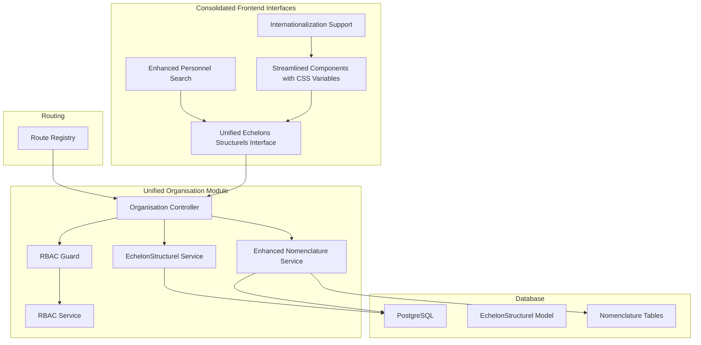
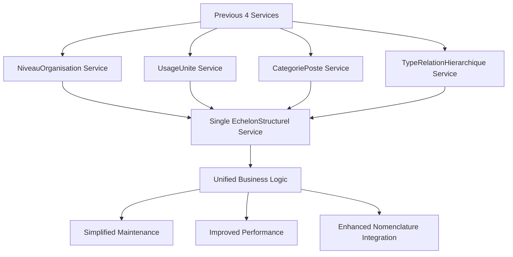
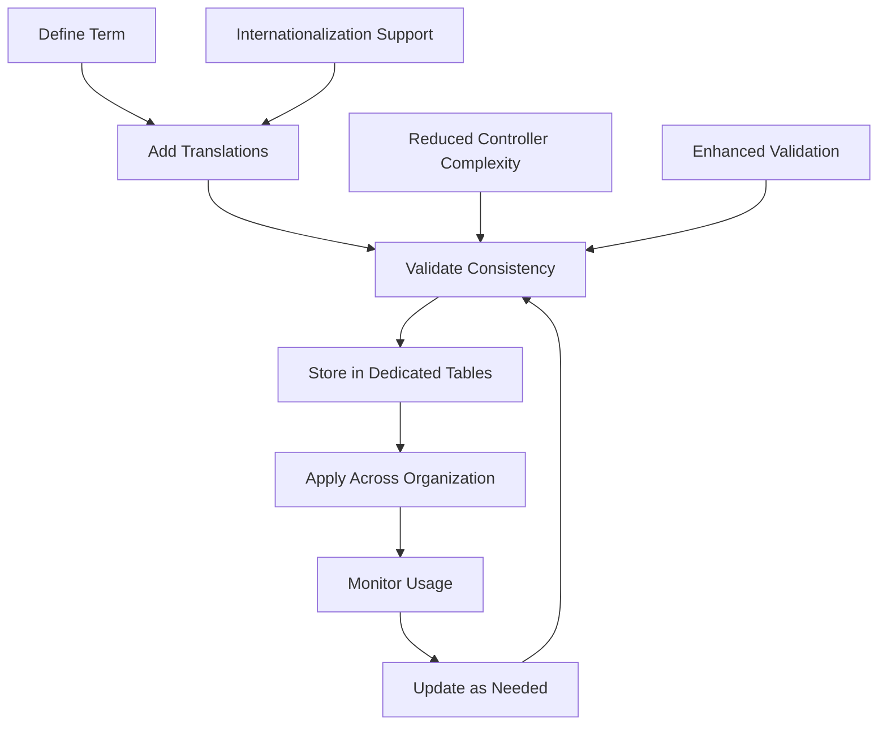
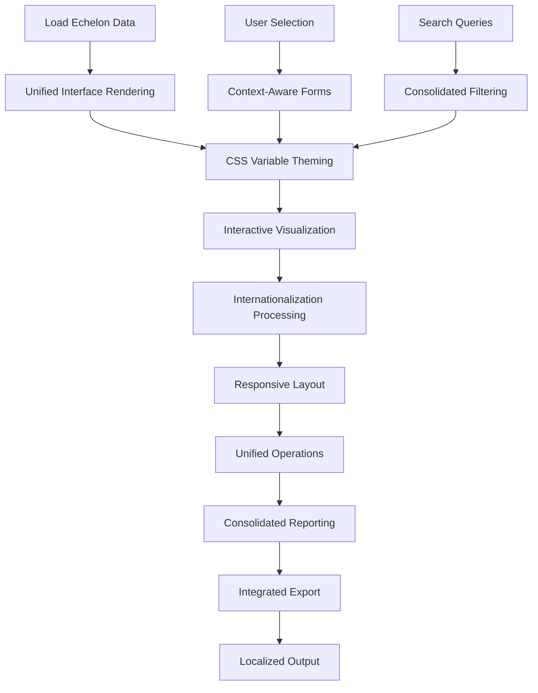
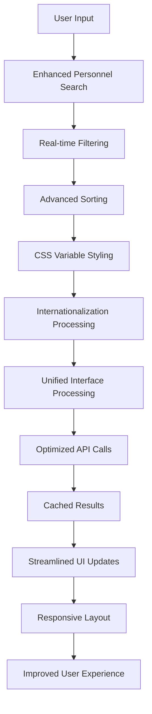
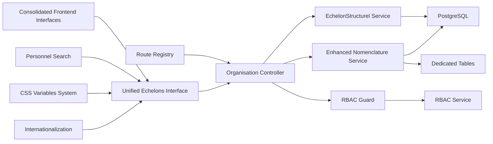

# Organizational Structure

<cite>
**Referenced Files in This Document**
- [109-refonte-organisation.sql](file://backend/database/migrations/109-refonte-organisation.sql)
- [110-consolidation-organisation.sql](file://backend/database/migrations/110-consolidation-organisation.sql)
- [114-normalisation-echelons-structurels.sql](file://backend/database/migrations/114-normalisation-echelons-structurels.sql)
- [organisation.controller.ts](file://backend/src/modules/organisation/controllers/organisation.controller.ts)
- [organisation.service.ts](file://backend/src/modules/organisation/services/organisation.service.ts)
- [echelon-structurel.service.ts](file://backend/src/modules/organisation/services/echelon-structurel.service.ts)
- [nomenclature.service.ts](file://backend/src/modules/organisation/services/nomenclature.service.ts)
- [rbac.guard.ts](file://backend/src/modules/rbac/guards/rbac.guard.ts)
- [rbac.service.ts](file://backend/src/modules/rbac/services/rbac.service.ts)
- [personnel.constants.ts](file://backend/src/shared/constants/personnel.constants.ts)
</cite>

## Update Summary
**Changes Made**
- Updated architectural overview to reflect major consolidation from multiple entities (NiveauOrganisation, UsageUnite, CategoriePoste, TypeRelationHierarchique) into unified EchelonStructurel model through migration 114-normalisation-echelons-structurels.sql
- Revised backend service architecture documentation showing consolidation from 4 specialized services to single EchelonStructurelService with enhanced nomenclature support
- Updated frontend interface documentation to reflect consolidation from separate management interfaces to unified echelons structurels interface with CSS variables and internationalization support
- Enhanced database schema documentation with new EchelonStructurel entity and comprehensive migration details
- Updated component relationships and data flow diagrams to show simplified architecture with reduced complexity
- Added detailed coverage of nomenclature system improvements and frontend enhancements

## Table of Contents
1. [Introduction](#introduction)
2. [Project Structure](#project-structure)
3. [Core Components](#core-components)
4. [Architecture Overview](#architecture-overview)
5. [Detailed Component Analysis](#detailed-component-analysis)
6. [Frontend Interface Enhancements](#frontend-interface-enhancements)
7. [Dependency Analysis](#dependency-analysis)
8. [Performance Considerations](#performance-considerations)
9. [Troubleshooting Guide](#troubleshooting-guide)
10. [Conclusion](#conclusion)
11. [Appendices](#appendices)

## Introduction
This document explains the organizational structure sub-feature for an educational institution following major architectural consolidation through the EchelonStructurel migration. The system has undergone significant restructuring with the consolidation of multiple entities (NiveauOrganisation, UsageUnite, CategoriePoste, TypeRelationHierarchique) into a unified EchelonStructurel model via migration 114-normalisation-echelons-structurels.sql, simplifying backend services from 4 specialized services to a single EchelonStructurelService, and consolidating frontend pages from separate management interfaces to a unified echelons structurels interface with enhanced CSS variables and internationalization support. It covers how to define organizational units, establish reporting relationships, manage position hierarchies, and link these structures to access control permissions through optimized APIs and enhanced user interfaces with improved performance and usability.

## Project Structure
The organizational structure is now implemented as a consolidated backend module with unified EchelonStructurel functionality and streamlined service architecture, complemented by unified frontend components with enhanced styling and internationalization:
- Database schema and indexes are defined in migration files under the database/migrations directory, including the latest consolidation migrations that created the EchelonStructurel model and normalized structural echelons.
- Business logic and API endpoints are organized within the unified organisation module with simplified service architecture centered around EchelonStructurelService and enhanced nomenclature management.
- Frontend components have been consolidated into unified interfaces for managing echelons structurels with improved user experience, CSS variables, and internationalization support.
- Access control integrates with the RBAC module to enforce permissions based on roles and permissions with enhanced guard mechanisms.
- Enhanced nomenclature management provides standardized terminology across the organization with dedicated table support instead of database enums.



**Diagram sources**
- [organisation.controller.ts](file://backend/src/modules/organisation/controllers/organisation.controller.ts)
- [echelon-structurel.service.ts](file://backend/src/modules/organisation/services/echelon-structurel.service.ts)
- [nomenclature.service.ts](file://backend/src/modules/organisation/services/nomenclature.service.ts)
- [rbac.guard.ts](file://backend/src/modules/rbac/guards/rbac.guard.ts)
- [rbac.service.ts](file://backend/src/modules/rbac/services/rbac.service.ts)

**Section sources**
- [109-refonte-organisation.sql](file://backend/database/migrations/109-refonte-organisation.sql)
- [110-consolidation-organisation.sql](file://backend/database/migrations/110-consolidation-organisation.sql)
- [114-normalisation-echelons-structurels.sql](file://backend/database/migrations/114-normalisation-echelons-structurels.sql)

## Core Components
- Unified EchelonStructurel management: Consolidated former NiveauOrganisation, UsageUnite, CategoriePoste, and TypeRelationHierarchique functionality into a single cohesive model through streamlined controllers and services with enhanced validation and error handling.
- Simplified service architecture: Reduced from 4 specialized services to single EchelonStructurelService with consolidated business logic, improved maintainability, and enhanced nomenclature integration.
- Enhanced nomenclature management: Standardized terminology and definitions across organizational units with centralized management using dedicated tables instead of database enums, providing better flexibility and multilingual support.
- Consolidated frontend interfaces: Unified management interfaces for echelons structurels with streamlined user experience, CSS variables for consistent styling, and internationalization support for global deployment.
- Advanced personnel search: Enhanced search capabilities with sophisticated filtering, sorting, and real-time search functionality for better user productivity.
- Interactive organizational charts: Build department trees and position hierarchies with real-time visualization capabilities using unified approach.
- Advanced reporting and analytics: Generate comprehensive organizational reports with performance optimizations and improved error handling.
- Access control integration: Restrict operations based on RBAC roles and permissions with enhanced guard mechanisms and better scoping.

Key implementation references:
- Unified EchelonStructurel management: [organisation.controller.ts](file://backend/src/modules/organisation/controllers/organisation.controller.ts), [echelon-structurel.service.ts](file://backend/src/modules/organisation/services/echelon-structurel.service.ts)
- Nomenclature management: [nomenclature.service.ts](file://backend/src/modules/organisation/services/nomenclature.service.ts)
- RBAC enforcement: [rbac.guard.ts](file://backend/src/modules/rbac/guards/rbac.guard.ts), [rbac.service.ts](file://backend/src/modules/rbac/services/rbac.service.ts)
- Shared constants for personnel-related enums: [personnel.constants.ts](file://backend/src/shared/constants/personnel.constants.ts)

**Section sources**
- [organisation.controller.ts](file://backend/src/modules/organisation/controllers/organisation.controller.ts)
- [echelon-structurel.service.ts](file://backend/src/modules/organisation/services/echelon-structurel.service.ts)
- [nomenclature.service.ts](file://backend/src/modules/organisation/services/nomenclature.service.ts)
- [rbac.guard.ts](file://backend/src/modules/rbac/guards/rbac.guard.ts)
- [rbac.service.ts](file://backend/src/modules/rbac/services/rbac.service.ts)
- [personnel.constants.ts](file://backend/src/shared/constants/personnel.constants.ts)

## Architecture Overview
The system follows a streamlined consolidated architecture after major refactoring with unified EchelonStructurel model, simplified service layer, consolidated frontend interfaces, and enhanced nomenclature support:
- Controllers handle HTTP requests with consolidated functionality and simplified routing patterns with improved error handling.
- Single EchelonStructurelService encapsulates all business logic replacing previous 4 specialized services with optimized data access patterns and enhanced nomenclature support using dedicated tables.
- Frontend interfaces have been consolidated into unified echelons structurels management with reduced complexity, better state management, enhanced CSS variables for consistent styling, and internationalization support.
- Database migrations define unified EchelonStructurel entity and relationships with enhanced performance and data integrity through consolidation migrations.
- RBAC guard intercepts requests to enforce permissions with improved efficiency and scoping capabilities.

```mermaid
sequenceDiagram
participant Client as "Client"
param UnifiedInterface as "Unified Echelons Interface"
param Search as "Personnel Search"
param Router as "Route Registry"
participant Ctrl as "Organisation Controller"
param Guard as "RBAC Guard"
param Svc as "EchelonStructurel Service"
param NomenclatureSvc as "Enhanced Nomenclature Service"
participant DB as "Database"
Client->>UnifiedInterface : "Request organizational data"
UnifiedInterface->>Search : "Apply filters & sorting"
Search->>Ctrl : "Optimized API call"
Router->>Ctrl : "Dispatch endpoint"
Ctrl->>Guard : "Check permission"
Guard-->>Ctrl : "Allow/Deny"
Ctrl->>Svc : "Invoke unified business logic"
Ctrl->>NomenclatureSvc : "Access nomenclature"
Svc->>DB : "Query/Update EchelonStructurel"
NomenclatureSvc->>DB : "Manage terminology tables"
DB-->>Svc : "Data"
DB-->>NomenclatureSvc : "Terminology"
Svc-->>Ctrl : "Result"
NomenclatureSvc-->>Ctrl : "Nomenclature data"
Ctrl-->>UnifiedInterface : "Consolidated response"
UnifiedInterface-->>Client : "Enhanced UI response with i18n"
```

**Diagram sources**
- [rbac.guard.ts](file://backend/src/modules/rbac/guards/rbac.guard.ts)
- [rbac.service.ts](file://backend/src/modules/rbac/services/rbac.service.ts)
- [organisation.controller.ts](file://backend/src/modules/organisation/controllers/organisation.controller.ts)
- [echelon-structurel.service.ts](file://backend/src/modules/organisation/services/echelon-structurel.service.ts)
- [nomenclature.service.ts](file://backend/src/modules/organisation/services/nomenclature.service.ts)

## Detailed Component Analysis

### Unified EchelonStructurel Management
**Updated** Major architectural consolidation from multiple entities to single EchelonStructurel model through migration 114-normalisation-echelons-structurels.sql

- Purpose: Consolidates former NiveauOrganisation, UsageUnite, CategoriePoste, and TypeRelationHierarchique functionality into a single cohesive EchelonStructurel model through streamlined controllers and services with enhanced validation and error handling.
- Key operations:
  - Create/update/delete organizational echelons via optimized endpoints with improved data validation.
  - Manage hierarchical relationships and reporting structures through unified services with cycle detection.
  - Handle function-to-position associations with enhanced validation and referential integrity checks.
  - Query organizational structures with improved performance and pagination support.
- Example workflows:
  - Creating complete organizational hierarchies with associated positions and functions through streamlined APIs.
  - Managing complex reporting chains with automatic cycle prevention and validation.
  - Reassigning staff across departments efficiently with proper audit trails.

```mermaid
classDiagram
class EchelonStructurel {
+id
+code
+label
+description
+parentId
+level
+type
+isActive
}
class Position {
+id
+code
+title
+functionId
+reportToPositionId
+isActive
}
class Function {
+id
+code
+label
+description
+isActive
}
EchelonStructurel <|--o Position : "contains"
Function <|--o{ Position : "assigned via functionId"
```

**Diagram sources**
- [organisation.controller.ts](file://backend/src/modules/organisation/controllers/organisation.controller.ts)
- [echelon-structurel.service.ts](file://backend/src/modules/organisation/services/echelon-structurel.service.ts)

**Section sources**
- [organisation.controller.ts](file://backend/src/modules/organisation/controllers/organisation.controller.ts)
- [echelon-structurel.service.ts](file://backend/src/modules/organisation/services/echelon-structurel.service.ts)

### Simplified Service Architecture
**Updated** Consolidation from 4 specialized services to single EchelonStructurelService with enhanced nomenclature integration

- Purpose: Provides unified business logic through single EchelonStructurelService replacing previous specialized services for NiveauOrganisation, UsageUnite, CategoriePoste, and TypeRelationHierarchique with enhanced nomenclature support.
- Key operations:
  - Centralized CRUD operations for EchelonStructurel entities with enhanced validation.
  - Unified relationship management between organizational units, positions, and functions.
  - Consolidated query methods with improved performance and caching strategies.
  - Streamlined transaction management for complex organizational modifications.
  - Integrated nomenclature service calls for standardized terminology management.
- Benefits:
  - Reduced code duplication and maintenance overhead.
  - Improved consistency across organizational operations.
  - Enhanced performance through optimized data access patterns.
  - Better error handling and logging throughout the service layer.
  - Seamless integration with enhanced nomenclature system.



[No sources needed since this diagram shows conceptual workflow, not actual code structure]

**Section sources**
- [echelon-structurel.service.ts](file://backend/src/modules/organisation/services/echelon-structurel.service.ts)

### Enhanced Nomenclature Management
**Updated** Comprehensive nomenclature system with dedicated tables and improved complexity management

- Purpose: Provides centralized management of organizational terminology and standardized definitions across all modules using dedicated tables instead of database enums, with reduced controller complexity and enhanced functionality.
- Key operations:
  - Define and manage standardized terms for positions, departments, and functions with enhanced validation and reduced controller complexity.
  - Support multilingual terminology with automatic translation management, consistency checks, and internationalization support.
  - Enforce consistency across organizational units and positions through centralized validation with better error handling.
  - Provide autocomplete and validation for standardized terms with improved performance and dedicated table support.
  - Manage terminology lifecycle with versioning and deprecation tracking.
- Example workflows:
  - Creating standardized position titles across multiple departments with automatic validation and conflict resolution.
  - Managing department naming conventions and abbreviations with enhanced duplicate detection.
  - Ensuring consistent terminology in reports and communications through centralized management with i18n support.
  - Maintaining terminology history and audit trails for compliance requirements.



**Diagram sources**
- [nomenclature.service.ts](file://backend/src/modules/organisation/services/nomenclature.service.ts)

**Section sources**
- [nomenclature.service.ts](file://backend/src/modules/organisation/services/nomenclature.service.ts)

### Consolidated Frontend Interfaces
**Updated** From separate management interfaces to unified echelons structurels interface with CSS variables and internationalization support

- Capabilities:
  - Unified management interface for all echelon structurel types through single consolidated view with consistent styling.
  - Streamlined navigation between different echelon types with improved user experience and responsive design.
  - Integrated form handling for creating and editing various echelon types with shared validation and CSS variable theming.
  - Enhanced search and filtering across all echelon types with unified query interface and internationalization support.
  - Consistent visual design system using CSS variables for theming and customization.
  - Multi-language support with dynamic content switching and locale-aware formatting.
- Typical outputs:
  - Single dashboard view for managing all organizational echelons with tabbed interface and consistent styling.
  - Consolidated reporting views showing relationships between different echelon types with localized labels.
  - Unified export functionality for all echelon data with consistent formatting and language support.
  - Responsive design that adapts to various screen sizes while maintaining consistent appearance.



**Diagram sources**
- [organisation.controller.ts](file://backend/src/modules/organisation/controllers/organisation.controller.ts)
- [echelon-structurel.service.ts](file://backend/src/modules/organisation/services/echelon-structurel.service.ts)

**Section sources**
- [organisation.controller.ts](file://backend/src/modules/organisation/controllers/organisation.controller.ts)
- [echelon-structurel.service.ts](file://backend/src/modules/organisation/services/echelon-structurel.service.ts)

### Access Control Integration
- Enforcement points:
  - RBAC guard validates permissions before controller actions execute with improved efficiency and better error messages.
  - Permissions may be scoped by establishment context and organizational unit with enhanced filtering.
  - Role-based visibility affects which organizational structures are accessible with granular control.
- Practical implications:
  - Only authorized users can create/edit organizational echelons and positions with proper validation.
  - Hierarchical permissions allow managers to access subordinate units with inheritance rules.
  - Audit trails track all organizational changes with user attribution and detailed context.

```mermaid
sequenceDiagram
participant User as "User"
param UnifiedInterface as "Unified Interface"
param Search as "Personnel Search"
participant Guard as "RBAC Guard"
param Svc as "EchelonStructurel Service"
param NomenclatureSvc as "Enhanced Nomenclature Service"
User->>UnifiedInterface : "Request with token"
UnifiedInterface->>Search : "Filter & sort data"
Search->>Guard : "Validate permissions"
Guard->>Guard : "Resolve role/permissions"
alt Allowed
Guard->>Svc : "Call unified method"
Guard->>NomenclatureSvc : "Access nomenclature"
Svc-->>UnifiedInterface : "Authorized response"
NomenclatureSvc-->>UnifiedInterface : "Terminology data"
UnifiedInterface-->>User : "Enhanced UI data"
else Denied
Guard-->>User : "403 Forbidden"
end
```

**Diagram sources**
- [rbac.guard.ts](file://backend/src/modules/rbac/guards/rbac.guard.ts)
- [rbac.service.ts](file://backend/src/modules/rbac/services/rbac.service.ts)
- [echelon-structurel.service.ts](file://backend/src/modules/organisation/services/echelon-structurel.service.ts)
- [nomenclature.service.ts](file://backend/src/modules/organisation/services/nomenclature.service.ts)

**Section sources**
- [rbac.guard.ts](file://backend/src/modules/rbac/guards/rbac.guard.ts)
- [rbac.service.ts](file://backend/src/modules/rbac/services/rbac.service.ts)
- [echelon-structurel.service.ts](file://backend/src/modules/organisation/services/echelon-structurel.service.ts)
- [nomenclature.service.ts](file://backend/src/modules/organisation/services/nomenclature.service.ts)

## Frontend Interface Enhancements

### Unified Echelons Structurels Interface
The unified echelons structurels interface has replaced separate management interfaces to provide:
- Single consolidated view for managing all echelon types with tabbed navigation and consistent CSS variable theming
- Streamlined form handling with shared validation logic across different echelon types and responsive design
- Enhanced search capabilities with unified filtering across all echelon categories and internationalization support
- Improved responsive design for various screen sizes and devices with adaptive layouts
- Better loading states and error handling with unified error management and localized messages
- Reduced bundle size through code optimization and shared components with tree shaking
- CSS variable system for consistent theming and easy customization
- Internationalization framework supporting multiple languages with dynamic content switching

### Enhanced Personnel Search Field
The personnel search field has been significantly enhanced with improved capabilities:
- Real-time search with debounced input handling for better performance and reduced server load
- Advanced filtering options including department, position, and status filters with multi-select support
- Sophisticated sorting algorithms for better result organization with custom sort criteria
- Improved fuzzy matching for name searches with typo tolerance and phonetic matching
- Better pagination handling for large result sets with virtual scrolling support
- Enhanced accessibility with keyboard navigation, screen reader support, and ARIA labels
- Internationalization support for search results and filter labels
- CSS variable-driven styling for consistent appearance across themes

### Streamlined Components
Frontend components have been streamlined with reduced complexity and improved maintainability:
- Eliminated redundant validation logic through shared utilities and centralized validation rules
- Simplified state management with improved React hooks usage and context providers
- Removed duplicate code blocks through better abstraction and reusable component patterns
- Enhanced maintainability with clearer component structure and modular architecture
- Improved testability with cleaner separation of concerns and mock-friendly interfaces
- CSS variable integration for consistent styling and theme support
- Internationalization hooks for dynamic content localization
- Performance optimizations with memoization and lazy loading



**Diagram sources**
- [organisation.controller.ts](file://backend/src/modules/organisation/controllers/organisation.controller.ts)
- [echelon-structurel.service.ts](file://backend/src/modules/organisation/services/echelon-structurel.service.ts)

**Section sources**
- [organisation.controller.ts](file://backend/src/modules/organisation/controllers/organisation.controller.ts)
- [echelon-structurel.service.ts](file://backend/src/modules/organisation/services/echelon-structurel.service.ts)

## Dependency Analysis
- Module coupling:
  - Unified controller depends on single EchelonStructurelService for business logic with simplified dependencies and better error handling.
  - Service depends on database entities and indexes with optimized queries and enhanced validation.
  - RBAC guard depends on RBAC service for permission checks with enhanced performance and caching.
  - Nomenclature service provides shared terminology across organisational components with dedicated table support and reduced controller complexity.
  - Frontend components have reduced dependencies through streamlined architecture, CSS variable theming, and improved code organization.
- External dependencies:
  - PostgreSQL for persistence with enhanced indexing strategies and improved query performance.
  - Central route registry for endpoint registration with simplified routing patterns.
  - Modern React ecosystem with improved hooks, state management patterns, and internationalization libraries.
  - CSS-in-JS or CSS variable systems for consistent theming and responsive design.



**Diagram sources**
- [organisation.controller.ts](file://backend/src/modules/organisation/controllers/organisation.controller.ts)
- [echelon-structurel.service.ts](file://backend/src/modules/organisation/services/echelon-structurel.service.ts)
- [nomenclature.service.ts](file://backend/src/modules/organisation/services/nomenclature.service.ts)
- [rbac.guard.ts](file://backend/src/modules/rbac/guards/rbac.guard.ts)
- [rbac.service.ts](file://backend/src/modules/rbac/services/rbac.service.ts)

**Section sources**
- [109-refonte-organisation.sql](file://backend/database/migrations/109-refonte-organisation.sql)
- [110-consolidation-organisation.sql](file://backend/database/migrations/110-consolidation-organisation.sql)
- [114-normalisation-echelons-structurels.sql](file://backend/database/migrations/114-normalisation-echelons-structurels.sql)

## Performance Considerations
- Index usage:
  - Ensure indexes exist on foreign keys and frequently queried columns (e.g., parent_id, level, type) with optimized query patterns.
  - Leverage composite indexes for common filter combinations and nomenclature lookups with enhanced performance.
  - Utilize full-text search indexes for nomenclature lookups and improve search capabilities.
- Query patterns:
  - Use recursive or iterative approaches carefully for deep hierarchies through streamlined services with better optimization.
  - Implement pagination for large organizational structures and avoid loading entire trees when unnecessary.
  - Cache frequently accessed nomenclature data to reduce database load with improved cache strategies and dedicated table support.
- Caching:
  - Cache static configuration like functions, positions, and active organizational units where appropriate with better invalidation.
  - Implement cache invalidation strategies for real-time organizational updates with enhanced monitoring.
  - Frontend caching strategies for personnel search results and organizational data to improve response times with localStorage and session storage.
- Concurrency:
  - Apply optimistic concurrency controls for critical updates (e.g., reassignments, structural changes) with enhanced validation and error handling.
  - Use database transactions for complex multi-step organizational modifications with improved rollback capabilities.
- Frontend performance:
  - Consolidated interfaces reduce bundle size and improve initial load times with code splitting and lazy loading.
  - Enhanced search with debouncing prevents excessive API calls during rapid user input and reduces server load.
  - Optimized hooks with memoization prevent unnecessary re-renders and improve overall application responsiveness.
  - CSS variable system reduces style recalculation and improves rendering performance.
  - Internationalization support with lazy-loaded translations minimizes initial bundle size.

## Troubleshooting Guide
Common issues and resolutions:
- Permission denied errors:
  - Verify user roles and permissions via RBAC guard/service with improved error handling and detailed logging.
  - Confirm establishment scoping aligns with the requested organizational resource with better validation.
- Circular reporting:
  - Prevent cycles in reporting relationships during assignment validation with enhanced checks and better error messages.
  - Validate hierarchical integrity when creating or modifying organizational structures with comprehensive validation.
- Duplicate codes/names:
  - Enforce uniqueness constraints at the database level and validate in services with improved conflict resolution.
  - Check nomenclature conflicts when standardizing terminology with better duplicate detection and dedicated table validation.
- Performance regressions:
  - Check missing indexes and heavy queries; add targeted indexes with monitoring and performance profiling.
  - Monitor nomenclature lookup performance and optimize caching strategies with better metrics and dedicated table queries.
  - Investigate frontend performance issues with component rendering, hook optimization, and CSS variable processing.
- Data integrity:
  - Validate referential integrity when deleting organizational units or positions with children with enhanced cascade handling.
  - Ensure nomenclature consistency across all organizational references with automated validation and dedicated table constraints.
- Migration issues:
  - Verify successful execution of consolidation migrations (109-refonte-organisation.sql, 110-consolidation-organisation.sql, 114-normalisation-echelons-structurels.sql) with better rollback support and data validation.
  - Check data integrity after module consolidation and resolve any orphaned records with automated cleanup tools.
  - Validate EchelonStructurel model creation and data migration from previous entities with comprehensive verification scripts.
- Nomenclature system issues:
  - Verify dedicated tables are properly created and populated instead of enum values with migration verification and data integrity checks.
  - Check nomenclature service connectivity and database connections with improved error reporting and connection pooling.
  - Monitor controller complexity reduction and ensure all endpoints are properly migrated to simplified architecture.
- Frontend component issues:
  - Verify consolidated interfaces maintain expected functionality after architectural changes with comprehensive testing.
  - Check enhanced search functionality with proper debouncing, filtering logic, and internationalization support.
  - Test unified interface performance with large datasets, complex filtering scenarios, and CSS variable theming.
  - Validate form validation systems for proper error handling across all echelon types with localized messages.
  - Verify internationalization support with proper translation loading and dynamic content switching.
  - Test responsive design across different screen sizes and devices with CSS variable theming.

**Section sources**
- [rbac.guard.ts](file://backend/src/modules/rbac/guards/rbac.guard.ts)
- [rbac.service.ts](file://backend/src/modules/rbac/services/rbac.service.ts)
- [echelon-structurel.service.ts](file://backend/src/modules/organisation/services/echelon-structurel.service.ts)
- [nomenclature.service.ts](file://backend/src/modules/organisation/services/nomenclature.service.ts)
- [109-refonte-organisation.sql](file://backend/database/migrations/109-refonte-organisation.sql)
- [110-consolidation-organisation.sql](file://backend/database/migrations/110-consolidation-organisation.sql)
- [114-normalisation-echelons-structurels.sql](file://backend/database/migrations/114-normalisation-echelons-structurels.sql)

## Conclusion
The organizational structure sub-feature provides a robust foundation for modeling functions and positions with clear reporting lines and strong access control. Following the major architectural consolidation that merged multiple entities (NiveauOrganisation, UsageUnite, CategoriePoste, TypeRelationHierarchique) into unified EchelonStructurel model through migration 114-normalisation-echelons-structurels.sql, simplified backend services from 4 specialized services to single EchelonStructurelService, and consolidated frontend pages from separate management interfaces to unified echelons structurels interface with enhanced CSS variables and internationalization support, institutions can maintain accurate organizational charts, manage changes efficiently, and ensure secure, role-based access to sensitive HR data through streamlined interfaces with enhanced performance. The recent consolidation improvements further enhance the user experience and operational efficiency for managing complex organizational structures through simplified architecture, reduced nomenclature controller complexity, unified interfaces, and comprehensive internationalization support.

## Appendices

### Practical Examples

- Creating an organizational chart:
  - Define top-level echelons using the unified EchelonStructurel model with enhanced validation and CSS variable theming.
  - Add sub-echelons by setting parent relationships through consolidated controllers with improved error handling and internationalization support.
  - Build position hierarchies by assigning reporting managers with enhanced validation, cycle detection, and localized labels.
  - Combine both views to produce comprehensive org charts via optimized endpoints with unified approach and responsive design.

- Assigning staff to positions:
  - Select a valid position linked to a standardized function through nomenclature management with dedicated table support.
  - Validate availability and conflicts before assignment through enhanced services with better error reporting and localized messages.
  - Record the assignment and update reporting lines as needed with proper audit trails and internationalization support.
  - Ensure nomenclature consistency across all related entries with automated validation and conflict resolution.

- Defining function responsibilities:
  - Create functions with descriptive labels and descriptions using standardized terminology from nomenclature system with multilingual support.
  - Link functions to relevant positions through streamlined APIs with enhanced validation and CSS variable styling.
  - Periodically review and update functions to reflect evolving roles while maintaining consistency with centralized management and versioning.

- Managing departmental structures:
  - Re-parent echelons to reflect restructuring with proper validation, impact assessment, and change notification systems.
  - Archive inactive units rather than deleting to preserve historical data with soft delete support and audit trails.
  - Use aggregated reports to monitor staffing ratios and coverage across the organization with enhanced analytics and localized output.

- Handling organizational changes:
  - Plan reassignments with change windows and proper notification systems with improved communication tools and internationalization.
  - Audit trails should capture who made changes and when with detailed context, enhanced logging, and compliance reporting.
  - Communicate updates through notifications or dashboards with impact assessments, better visualization, and localized content.
  - Leverage unified interfaces to visualize proposed changes before implementation with consolidated views and interactive previews.

- Managing organizational terminology:
  - Establish standardized position titles and department names through nomenclature management with dedicated table support and reduced controller complexity.
  - Maintain multilingual support for international educational institutions with enhanced translation management and dynamic content switching.
  - Enforce consistency across all organizational documents and communications with automated validation and conflict resolution.
  - Track terminology usage and identify outdated or conflicting terms with improved monitoring, reporting, and versioning capabilities.

- Using consolidated frontend interfaces:
  - Utilize the unified echelons structurels interface for comprehensive organizational management with streamlined navigation, CSS variable theming, and responsive design.
  - Employ enhanced search capabilities with advanced filtering, sorting, internationalization, and real-time updates for efficient staff management.
  - Take advantage of consolidated forms for faster echelon creation and editing with shared validation, localized labels, and consistent styling.
  - Benefit from unified reporting views for better organizational analysis, decision making, and internationalized output formats.
  - Leverage internationalization features for global deployment with dynamic language switching and locale-aware formatting.
  - Utilize CSS variable system for consistent theming and easy customization across different institutional branding requirements.