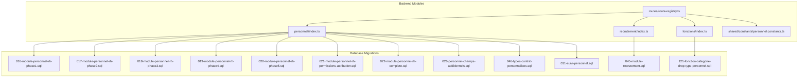
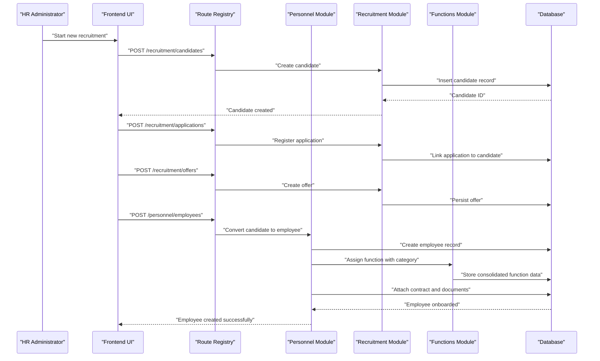
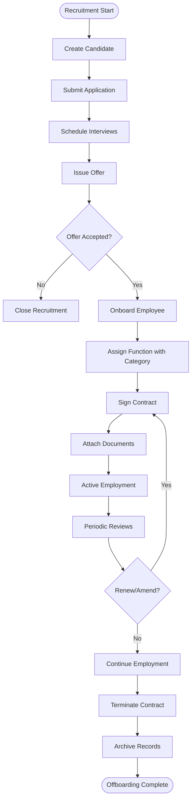
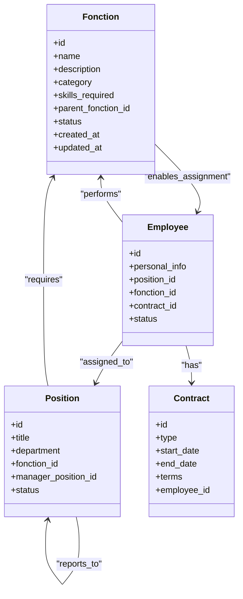
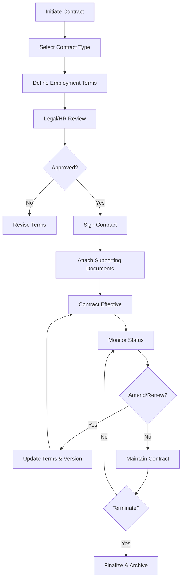
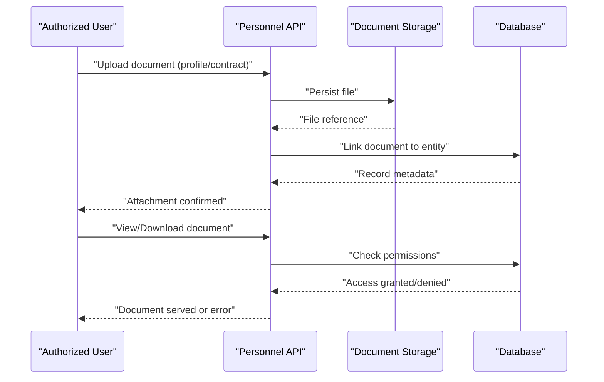
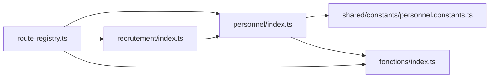

# Personnel Administration

<cite>
**Referenced Files in This Document**
- [backend/database/migrations/016-module-personnel-rh-phase1.sql](file://backend/database/migrations/016-module-personnel-rh-phase1.sql)
- [backend/database/migrations/017-module-personnel-rh-phase2.sql](file://backend/database/migrations/017-module-personnel-rh-phase2.sql)
- [backend/database/migrations/018-module-personnel-rh-phase3.sql](file://backend/database/migrations/018-module-personnel-rh-phase3.sql)
- [backend/database/migrations/019-module-personnel-rh-phase4.sql](file://backend/database/migrations/019-module-personnel-rh-phase4.sql)
- [backend/database/migrations/020-module-personnel-rh-phase5.sql](file://backend/database/migrations/020-module-personnel-rh-phase5.sql)
- [backend/database/migrations/021-module-personnel-rh-permissions-attribution.sql](file://backend/database/migrations/021-module-personnel-rh-permissions-attribution.sql)
- [backend/database/migrations/022-module-personnel-rh-complete.sql](file://backend/database/migrations/022-module-personnel-rh-complete.sql)
- [backend/database/migrations/026-personnel-champs-additionnels.sql](file://backend/database/migrations/026-personnel-champs-additionnels.sql)
- [backend/database/migrations/045-module-recrutement.sql](file://backend/database/migrations/045-module-recrutement.sql)
- [backend/database/migrations/046-types-contrat-personnalises.sql](file://backend/database/migrations/046-types-contrat-personnalises.sql)
- [backend/database/migrations/031-suivi-personnel.sql](file://backend/database/migrations/031-suivi-personnel.sql)
- [backend/src/modules/personnel/index.ts](file://backend/src/modules/personnel/index.ts)
- [backend/src/modules/recrutement/index.ts](file://backend/src/modules/recrutement/index.ts)
- [backend/src/modules/fonctions/index.ts](file://backend/src/modules/fonctions/index.ts)
- [backend/src/shared/constants/personnel.constants.ts](file://backend/src/shared/constants/personnel.constants.ts)
- [backend/src/routes/route-registry.ts](file://backend/src/routes/route-registry.ts)
- [backend/database/migrations/121-fonction-categorie-drop-type-personnel.sql](file://backend/database/migrations/121-fonction-categorie-drop-type-personnel.sql)
</cite>

## Update Summary
**Changes Made**
- Updated organizational structure section to reflect the elimination of TypePersonnel entity and consolidation into fonction entity with category support
- Revised migration references to include the new refactoring migration that removes type-personnel system
- Updated architectural diagrams to show the integrated category-based approach
- Modified practical examples to demonstrate the new consolidated model
- Enhanced troubleshooting guide with migration-specific guidance for the refactoring changes

## Table of Contents
1. [Introduction](#introduction)
2. [Project Structure](#project-structure)
3. [Core Components](#core-components)
4. [Architecture Overview](#architecture-overview)
5. [Detailed Component Analysis](#detailed-component-analysis)
6. [Dependency Analysis](#dependency-analysis)
7. [Performance Considerations](#performance-considerations)
8. [Troubleshooting Guide](#troubleshooting-guide)
9. [Conclusion](#conclusion)
10. [Appendices](#appendices)

## Introduction
This document describes eLISAschool's personnel administration system with a focus on the end-to-end staff lifecycle: recruitment, onboarding, profile management, contract administration, and offboarding. The system has undergone a major refactoring that eliminates the separate TypePersonnel entity and consolidates functionality into the fonction (function) entity with integrated category support. This change simplifies the organizational structure while maintaining comprehensive staff management capabilities. The documentation covers the complete staff lifecycle from initial recruitment through onboarding, profile management, and eventual offboarding, along with the streamlined organizational structure using functions, positions, and hierarchical relationships.

## Project Structure
The personnel module is implemented across backend database migrations and TypeScript modules. The key areas include:
- Database schema evolution for personnel, recruitment, contracts, and tracking
- Module entry points for personnel, recruitment, and functions
- Shared constants used by personnel-related logic
- Route registration to expose APIs
- **Updated**: Refactored organizational structure with integrated category support replacing the separate type-personnel system

**Diagram sources**
- [backend/src/modules/personnel/index.ts](file://backend/src/modules/personnel/index.ts)
- [backend/src/modules/recrutement/index.ts](file://backend/src/modules/recrutement/index.ts)
- [backend/src/modules/fonctions/index.ts](file://backend/src/modules/fonctions/index.ts)
- [backend/src/shared/constants/personnel.constants.ts](file://backend/src/shared/constants/personnel.constants.ts)
- [backend/src/routes/route-registry.ts](file://backend/src/routes/route-registry.ts)
- [backend/database/migrations/121-fonction-categorie-drop-type-personnel.sql](file://backend/database/migrations/121-fonction-categorie-drop-type-personnel.sql)

**Section sources**
- [backend/src/modules/personnel/index.ts](file://backend/src/modules/personnel/index.ts)
- [backend/src/modules/recrutement/index.ts](file://backend/src/modules/recrutement/index.ts)
- [backend/src/modules/fonctions/index.ts](file://backend/src/modules/fonctions/index.ts)
- [backend/src/shared/constants/personnel.constants.ts](file://backend/src/shared/constants/personnel.constants.ts)
- [backend/src/routes/route-registry.ts](file://backend/src/routes/route-registry.ts)
- [backend/database/migrations/121-fonction-categorie-drop-type-personnel.sql](file://backend/database/migrations/121-fonction-categorie-drop-type-personnel.sql)

## Core Components
- Personnel core entities and lifecycle states are defined through phased migrations that progressively add tables, fields, and constraints. These cover personal details, employment records, roles, and auditability.
- Recruitment pipeline is modeled via dedicated migration artifacts that capture candidates, applications, interviews, offers, and conversion to employees.
- **Updated**: Organizational structure now uses the consolidated fonction entity with integrated category support, eliminating the separate TypePersonnel entity. Functions define responsibilities, skill sets, and categories (e.g., teaching, administrative, technical).
- Contract management supports standardized and customizable contract types, with employment terms such as start/end dates, work schedule, and compensation references.
- Document handling is integrated into personnel records, allowing attachments linked to profiles, contracts, or recruitment stages.
- Tracking and analytics are supported by a dedicated personnel tracking migration, enabling performance and activity logs.

Practical examples:
- Staff data entry: Create a candidate record, convert to employee, assign function with appropriate category, attach contract and documents.
- Organizational chart: Define functions with categories and hierarchical relationships, then assign incumbents based on their functional roles.
- Document attachment: Upload documents during recruitment, contract signing, or profile updates; maintain versioning and access controls.

**Section sources**
- [backend/database/migrations/016-module-personnel-rh-phase1.sql](file://backend/database/migrations/016-module-personnel-rh-phase1.sql)
- [backend/database/migrations/017-module-personnel-rh-phase2.sql](file://backend/database/migrations/017-module-personnel-rh-phase2.sql)
- [backend/database/migrations/018-module-personnel-rh-phase3.sql](file://backend/database/migrations/018-module-personnel-rh-phase3.sql)
- [backend/database/migrations/019-module-personnel-rh-phase4.sql](file://backend/database/migrations/019-module-personnel-rh-phase4.sql)
- [backend/database/migrations/020-module-personnel-rh-phase5.sql](file://backend/database/migrations/020-module-personnel-rh-phase5.sql)
- [backend/database/migrations/021-module-personnel-rh-permissions-attribution.sql](file://backend/database/migrations/021-module-personnel-rh-permissions-attribution.sql)
- [backend/database/migrations/022-module-personnel-rh-complete.sql](file://backend/database/migrations/022-module-personnel-rh-complete.sql)
- [backend/database/migrations/026-personnel-champs-additionnels.sql](file://backend/database/migrations/026-personnel-champs-additionnels.sql)
- [backend/database/migrations/045-module-recrutement.sql](file://backend/database/migrations/045-module-recrutement.sql)
- [backend/database/migrations/046-types-contrat-personnalises.sql](file://backend/database/migrations/046-types-contrat-personnalises.sql)
- [backend/database/migrations/031-suivi-personnel.sql](file://backend/database/migrations/031-suivi-personnel.sql)
- [backend/database/migrations/121-fonction-categorie-drop-type-personnel.sql](file://backend/database/migrations/121-fonction-categorie-drop-type-personnel.sql)

## Architecture Overview
The personnel administration architecture follows a layered approach with an integrated organizational structure:
- API layer: Routes registered centrally and dispatched to module controllers/services.
- Domain modules: Personnel, Recruitment, and Functions encapsulate business logic with the consolidated category-based approach.
- Data layer: Relational schema evolved via migrations ensures integrity and extensibility, including the refactoring that eliminates TypePersonnel.
- Cross-cutting concerns: Permissions, audit trails, and shared constants support security and consistency.
- **Updated**: Integrated category-based organizational structure replaces the separate type-personnel system, providing simplified function management with built-in categorization.

**Diagram sources**
- [backend/src/routes/route-registry.ts](file://backend/src/routes/route-registry.ts)
- [backend/src/modules/recrutement/index.ts](file://backend/src/modules/recrutement/index.ts)
- [backend/src/modules/personnel/index.ts](file://backend/src/modules/personnel/index.ts)
- [backend/src/modules/fonctions/index.ts](file://backend/src/modules/fonctions/index.ts)
- [backend/database/migrations/045-module-recrutement.sql](file://backend/database/migrations/045-module-recrutement.sql)
- [backend/database/migrations/121-fonction-categorie-drop-type-personnel.sql](file://backend/database/migrations/121-fonction-categorie-drop-type-personnel.sql)

## Detailed Component Analysis

### Staff Lifecycle Workflow
End-to-end flow from recruitment to offboarding:
- Recruitment: Candidate intake, application processing, interview scheduling, offer issuance.
- Onboarding: Convert candidate to employee, assign function with appropriate category, sign contract, attach required documents.
- Profile Management: Maintain personal data, qualifications, emergency contacts, and sensitive information with access controls.
- Contract Management: Manage contract type, terms, renewals, amendments, and termination events.
- Offboarding: Terminate contract, archive documents, revoke access, and retain audit trail.
- **Updated**: Function Assignment: Streamlined process for assigning functions with integrated categories instead of separate type-personnel management.

[No sources needed since this diagram shows conceptual workflow, not actual code structure]

### Organizational Structure: Consolidated Functions with Categories
**Updated** The organizational structure has been significantly refactored:
- **Elimination of TypePersonnel**: The separate TypePersonnel entity has been completely removed from the system.
- **Integrated Category Support**: Functions now include built-in category support for better organization and classification.
- **Simplified Relationships**: The consolidation reduces complexity while maintaining comprehensive organizational modeling.
- **Enhanced Functionality**: Functions now serve as the single source of truth for role definitions, responsibilities, and categorization.

Key improvements:
- Single entity model for all personnel types and categories
- Simplified database schema with fewer joins and dependencies
- Improved query performance due to reduced table relationships
- Enhanced user experience with unified function management interface

**Diagram sources**
- [backend/database/migrations/016-module-personnel-rh-phase1.sql](file://backend/database/migrations/016-module-personnel-rh-phase1.sql)
- [backend/database/migrations/017-module-personnel-rh-phase2.sql](file://backend/database/migrations/017-module-personnel-rh-phase2.sql)
- [backend/database/migrations/018-module-personnel-rh-phase3.sql](file://backend/database/migrations/018-module-personnel-rh-phase3.sql)
- [backend/database/migrations/019-module-personnel-rh-phase4.sql](file://backend/database/migrations/019-module-personnel-rh-phase4.sql)
- [backend/database/migrations/020-module-personnel-rh-phase5.sql](file://backend/database/migrations/020-module-personnel-rh-phase5.sql)
- [backend/database/migrations/046-types-contrat-personnalises.sql](file://backend/database/migrations/046-types-contrat-personnalises.sql)
- [backend/database/migrations/121-fonction-categorie-drop-type-personnel.sql](file://backend/database/migrations/121-fonction-categorie-drop-type-personnel.sql)
- [backend/src/modules/fonctions/index.ts](file://backend/src/modules/fonctions/index.ts)
- [backend/src/modules/personnel/index.ts](file://backend/src/modules/personnel/index.ts)

### Contract Types and Employment Terms
- Standardized contract types (e.g., full-time, part-time, fixed-term, temporary) are supported.
- Customizable contract types can be added via configuration-driven migrations.
- Employment terms include start/end dates, probation periods, work schedule, compensation references, and renewal conditions.
- Amendments and renewals are tracked with versioning and effective dates.

**Diagram sources**
- [backend/database/migrations/046-types-contrat-personnalises.sql](file://backend/database/migrations/046-types-contrat-personnalises.sql)
- [backend/database/migrations/016-module-personnel-rh-phase1.sql](file://backend/database/migrations/016-module-personnel-rh-phase1.sql)
- [backend/database/migrations/022-module-personnel-rh-complete.sql](file://backend/database/migrations/022-module-personnel-rh-complete.sql)

### Document Handling Workflows
- Documents can be attached at multiple stages: recruitment (CVs, certificates), onboarding (contracts, IDs), and ongoing profile updates (qualifications, medical records).
- Access control ensures only authorized users can view or edit sensitive documents.
- Audit trails log who accessed or modified documents and when.
- Versioning supports updates while preserving historical records.

**Diagram sources**
- [backend/database/migrations/022-module-personnel-rh-complete.sql](file://backend/database/migrations/022-module-personnel-rh-complete.sql)
- [backend/database/migrations/021-module-personnel-rh-permissions-attribution.sql](file://backend/database/migrations/021-module-personnel-rh-permissions-attribution.sql)
- [backend/src/modules/personnel/index.ts](file://backend/src/modules/personnel/index.ts)

### Practical Examples
- Staff data entry:
  - Create candidate record with contact and background info.
  - Add application details and upload CV.
  - Schedule interviews and record outcomes.
  - Issue offer and accept it.
  - Convert to employee, assign function with appropriate category, sign contract, attach required documents.
- Organizational chart creation:
  - Define functions with categories (teaching, administrative, technical) and parent-child relationships.
  - Create positions under departments, set manager positions.
  - Assign incumbents to positions and update reporting lines.
- Document attachment processes:
  - During recruitment: attach CV, transcripts, references.
  - During onboarding: attach contract, identification, certifications.
  - During employment: attach performance reviews, training certificates.

[No sources needed since this section provides practical guidance without analyzing specific files]

## Dependency Analysis
Module dependencies and interactions:
- Route registry centralizes endpoints and delegates to modules.
- Personnel module depends on shared constants and integrates with recruitment and function configurations.
- Recruitment module feeds into personnel onboarding flows.
- Functions module provides the consolidated organizational structure with category support.
- **Updated**: Refactored dependency structure eliminates TypePersonnel dependencies and streamlines function management.

**Diagram sources**
- [backend/src/routes/route-registry.ts](file://backend/src/routes/route-registry.ts)
- [backend/src/modules/personnel/index.ts](file://backend/src/modules/personnel/index.ts)
- [backend/src/modules/recrutement/index.ts](file://backend/src/modules/recrutement/index.ts)
- [backend/src/modules/fonctions/index.ts](file://backend/src/modules/fonctions/index.ts)
- [backend/src/shared/constants/personnel.constants.ts](file://backend/src/shared/constants/personnel.constants.ts)

**Section sources**
- [backend/src/routes/route-registry.ts](file://backend/src/routes/route-registry.ts)
- [backend/src/modules/personnel/index.ts](file://backend/src/modules/personnel/index.ts)
- [backend/src/modules/recrutement/index.ts](file://backend/src/modules/recrutement/index.ts)
- [backend/src/modules/fonctions/index.ts](file://backend/src/modules/fonctions/index.ts)
- [backend/src/shared/constants/personnel.constants.ts](file://backend/src/shared/constants/personnel.constants.ts)

## Performance Considerations
- Indexing: Ensure indexes on frequently queried columns (e.g., employee identifiers, position IDs, contract dates) to optimize lookups and reports.
- Pagination: Implement pagination for large lists (candidates, employees, documents) to reduce payload sizes and improve UI responsiveness.
- Caching: Cache static organizational structures (functions, positions) where appropriate to minimize repeated queries.
- Batch operations: Use batch inserts/updates for bulk onboarding or mass document linking.
- File storage: Stream large documents and avoid loading entire files into memory; store metadata in the database and binaries in object storage.
- **Updated**: Performance improvements from the refactoring:
  - Eliminated TypePersonnel entity reduces database joins and query complexity.
  - Consolidated function management improves data retrieval performance.
  - Simplified relationships enhance overall system efficiency.
  - Reduced schema complexity leads to faster migrations and backups.

[No sources needed since this section provides general guidance]

## Troubleshooting Guide
Common issues and resolutions:
- Permission errors when accessing personnel data:
  - Verify RBAC permissions and group assignments.
  - Check permission attribution migrations and ensure roles are correctly mapped.
- Missing fields in personnel records:
  - Confirm all relevant migrations have been applied (phases 1–5 and additional fields).
  - Validate schema against expected entity definitions.
- Contract type not found:
  - Ensure custom contract types are seeded/configured via the customization migration.
- Document upload failures:
  - Check storage service connectivity and permissions.
  - Validate file size limits and MIME type restrictions.
- Audit trail gaps:
  - Confirm audit logging is enabled and write permissions exist for audit tables.
- **Updated**: Post-refactoring issues:
  - If function assignments fail, verify that the TypePersonnel entity has been properly eliminated.
  - Check that the migration 121-fonction-categorie-drop-type-personnel.sql has been executed successfully.
  - Ensure all references to TypePersonnel have been updated to use the consolidated fonction entity.
  - Validate that category-based function assignments are working correctly.
  - Review any custom code that may still reference the old TypePersonnel structure.

**Section sources**
- [backend/database/migrations/021-module-personnel-rh-permissions-attribution.sql](file://backend/database/migrations/021-module-personnel-rh-permissions-attribution.sql)
- [backend/database/migrations/016-module-personnel-rh-phase1.sql](file://backend/database/migrations/016-module-personnel-rh-phase1.sql)
- [backend/database/migrations/026-personnel-champs-additionnels.sql](file://backend/database/migrations/026-personnel-champs-additionnels.sql)
- [backend/database/migrations/046-types-contrat-personnalises.sql](file://backend/database/migrations/046-types-contrat-personnalises.sql)
- [backend/database/migrations/121-fonction-categorie-drop-type-personnel.sql](file://backend/database/migrations/121-fonction-categorie-drop-type-personnel.sql)

## Conclusion
eLISAschool's personnel administration system provides a comprehensive foundation for managing the complete staff lifecycle. Through structured migrations and modular services, it supports recruitment pipelines, robust employee profiles, flexible contract management, and secure document handling. The recent major refactoring that eliminates the TypePersonnel entity and consolidates functionality into the fonction entity with integrated category support has significantly simplified the organizational structure while maintaining all essential capabilities. This consolidation improves system performance, reduces complexity, and provides a more intuitive user experience. The organizational model enables clear hierarchies and role assignments, while compliance and privacy safeguards protect sensitive data. With careful attention to performance and troubleshooting practices, the system scales effectively to meet institutional needs.

## Appendices

### Compliance and Data Privacy
- Data minimization: Collect only necessary personal data; use optional fields judiciously.
- Consent and purpose limitation: Document reasons for collecting sensitive data and obtain consent where required.
- Access controls: Enforce least privilege; restrict access to sensitive fields and documents.
- Retention policies: Define retention schedules for recruitment artifacts, contracts, and performance records.
- Auditability: Maintain immutable logs for access and modifications to personnel data.
- Cross-border transfers: If integrating with external HR systems, ensure data transfer agreements and encryption in transit.

[No sources needed since this section provides general guidance]

### Integration with External HR Systems
- API endpoints: Expose RESTful endpoints for synchronization (create/update employees, contracts, documents).
- Authentication: Use token-based authentication and scope-limited access.
- Idempotency: Design endpoints to handle retries safely.
- Error handling: Provide consistent error codes and messages for downstream consumers.
- Webhooks: Notify external systems of state changes (e.g., contract termination).
- **Updated**: Integration considerations for the refactored system:
  - Update integration endpoints to use the consolidated fonction entity instead of TypePersonnel.
  - Ensure category-based function assignments are properly synchronized with external systems.
  - Validate that migration changes don't break existing integration workflows.

[No sources needed since this section provides general guidance]