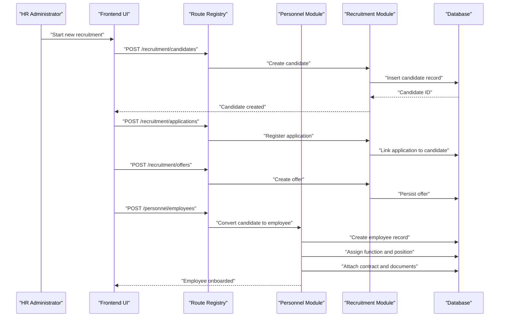
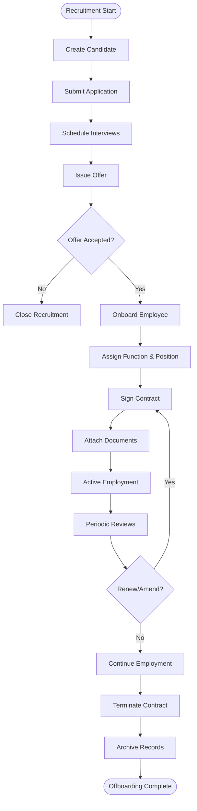
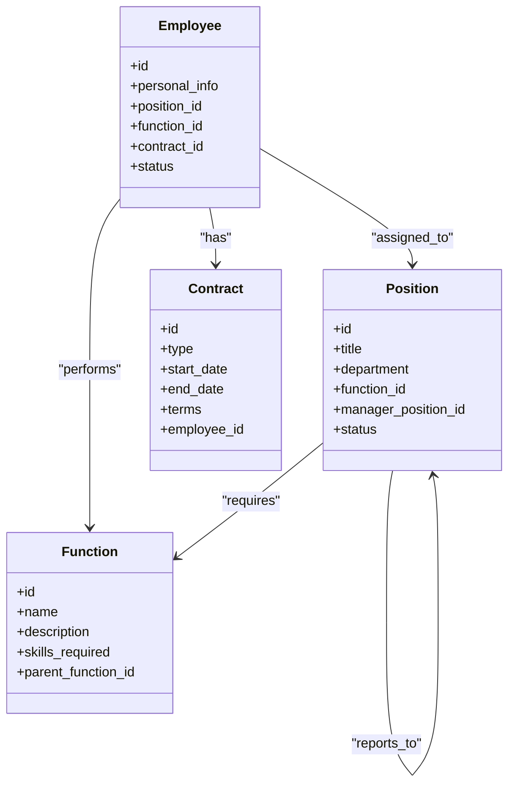
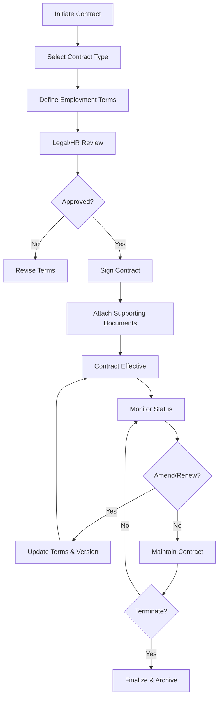
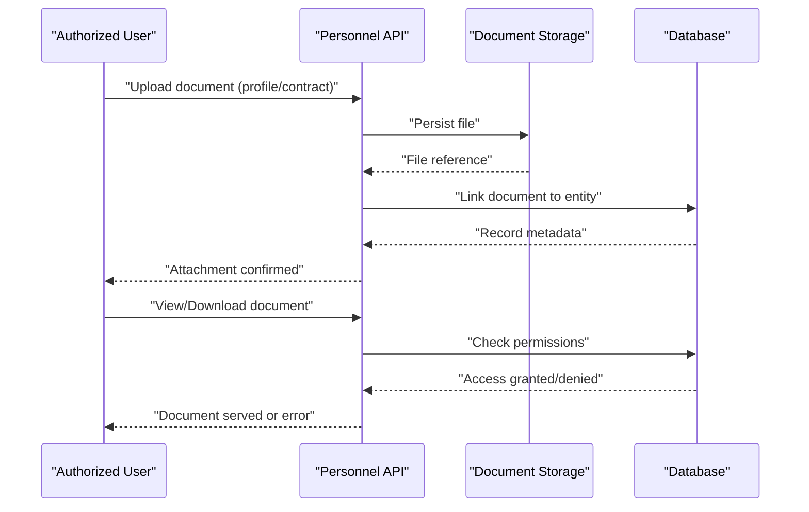
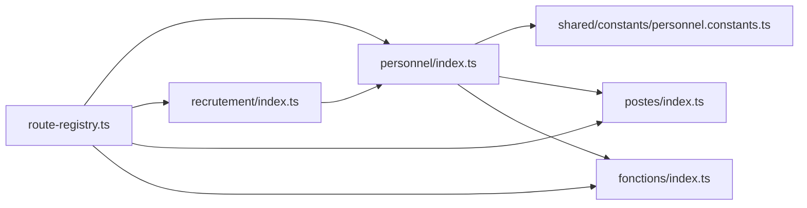

# Personnel Administration

<cite>
**Referenced Files in This Document**
- [backend/database/migrations/016-module-personnel-rh-phase1.sql](file://backend/database/migrations/016-module-personnel-rh-phase1.sql)
- [backend/database/migrations/017-module-personnel-rh-phase2.sql](file://backend/database/migrations/017-module-personnel-rh-phase2.sql)
- [backend/database/migrations/018-module-personnel-rh-phase3.sql](file://backend/database/migrations/018-module-personnel-rh-phase3.sql)
- [backend/database/migrations/019-module-personnel-rh-phase4.sql](file://backend/database/migrations/019-module-personnel-rh-phase4.sql)
- [backend/database/migrations/020-module-personnel-rh-phase5.sql](file://backend/database/migrations/020-module-personnel-rh-phase5.sql)
- [backend/database/migrations/021-module-personnel-rh-permissions-attribution.sql](file://backend/database/migrations/021-module-personnel-rh-permissions-attribution.sql)
- [backend/database/migrations/022-module-personnel-rh-complete.sql](file://backend/database/migrations/022-module-personnel-rh-complete.sql)
- [backend/database/migrations/026-personnel-champs-additionnels.sql](file://backend/database/migrations/026-personnel-champs-additionnels.sql)
- [backend/database/migrations/045-module-recrutement.sql](file://backend/database/migrations/045-module-recrutement.sql)
- [backend/database/migrations/046-types-contrat-personnalises.sql](file://backend/database/migrations/046-types-contrat-personnalises.sql)
- [backend/database/migrations/031-suivi-personnel.sql](file://backend/database/migrations/031-suivi-personnel.sql)
- [backend/src/modules/personnel/index.ts](file://backend/src/modules/personnel/index.ts)
- [backend/src/modules/recrutement/index.ts](file://backend/src/modules/recrutement/index.ts)
- [backend/src/modules/postes/index.ts](file://backend/src/modules/postes/index.ts)
- [backend/src/modules/fonctions/index.ts](file://backend/src/modules/fonctions/index.ts)
- [backend/src/shared/constants/personnel.constants.ts](file://backend/src/shared/constants/personnel.constants.ts)
- [backend/src/routes/route-registry.ts](file://backend/src/routes/route-registry.ts)
</cite>

## Table of Contents
1. [Introduction](#introduction)
2. [Project Structure](#project-structure)
3. [Core Components](#core-components)
4. [Architecture Overview](#architecture-overview)
5. [Detailed Component Analysis](#detailed-component-analysis)
6. [Dependency Analysis](#dependency-analysis)
7. [Performance Considerations](#performance-considerations)
8. [Troubleshooting Guide](#troubleshooting-guide)
9. [Conclusion](#conclusion)
10. [Appendices](#appendices)

## Introduction
This document describes eLISAschool’s personnel administration system with a focus on the end-to-end staff lifecycle: recruitment, onboarding, profile management, contract administration, and offboarding. It also explains the organizational structure (functions, positions, hierarchy), contract types and employment terms, and document handling workflows. Practical examples are provided for data entry, organizational chart creation, and attaching documents. Compliance and privacy considerations, as well as integration points with external HR systems, are addressed.

## Project Structure
The personnel module is implemented across backend database migrations and TypeScript modules. The key areas include:
- Database schema evolution for personnel, recruitment, contracts, and tracking
- Module entry points for personnel, recruitment, positions, and functions
- Shared constants used by personnel-related logic
- Route registration to expose APIs

```mermaid
graph TB
subgraph "Backend Modules"
P["personnel/index.ts"]
R["recrutement/index.ts"]
PO["postes/index.ts"]
F["fonctions/index.ts"]
C["shared/constants/personnel.constants.ts"]
RT["routes/route-registry.ts"]
end
subgraph "Database Migrations"
M16["016-module-personnel-rh-phase1.sql"]
M17["017-module-personnel-rh-phase2.sql"]
M18["018-module-personnel-rh-phase3.sql"]
M19["019-module-personnel-rh-phase4.sql"]
M20["020-module-personnel-rh-phase5.sql"]
M21["021-module-personnel-rh-permissions-attribution.sql"]
M22["022-module-personnel-rh-complete.sql"]
M26["026-personnel-champs-additionnels.sql"]
M45["045-module-recrutement.sql"]
M46["046-types-contrat-personnalises.sql"]
M31["031-suivi-personnel.sql"]
end
RT --> P
RT --> R
RT --> PO
RT --> F
P --> M16
P --> M17
P --> M18
P --> M19
P --> M20
P --> M21
P --> M22
P --> M26
R --> M45
P --> M46
P --> M31
P --> C
```

**Diagram sources**
- [backend/src/modules/personnel/index.ts](file://backend/src/modules/personnel/index.ts)
- [backend/src/modules/recrutement/index.ts](file://backend/src/modules/recrutement/index.ts)
- [backend/src/modules/postes/index.ts](file://backend/src/modules/postes/index.ts)
- [backend/src/modules/fonctions/index.ts](file://backend/src/modules/fonctions/index.ts)
- [backend/src/shared/constants/personnel.constants.ts](file://backend/src/shared/constants/personnel.constants.ts)
- [backend/src/routes/route-registry.ts](file://backend/src/routes/route-registry.ts)
- [backend/database/migrations/016-module-personnel-rh-phase1.sql](file://backend/database/migrations/016-module-personnel-rh-phase1.sql)
- [backend/database/migrations/017-module-personnel-rh-phase2.sql](file://backend/database/migrations/017-module-personnel-rh-phase2.sql)
- [backend/database/migrations/018-module-personnel-rh-phase3.sql](file://backend/database/migrations/018-module-personnel-rh-phase3.sql)
- [backend/database/migrations/019-module-personnel-rh-phase4.sql](file://backend/database/migrations/019-module-personnel-rh-phase4.sql)
- [backend/database/migrations/020-module-personnel-rh-phase5.sql](file://backend/database/migrations/020-module-personnel-rh-phase5.sql)
- [backend/database/migrations/021-module-personnel-rh-permissions-attribution.sql](file://backend/database/migrations/021-module-personnel-rh-permissions-attribution.sql)
- [backend/database/migrations/022-module-personnel-rh-complete.sql](file://backend/database/migrations/022-module-personnel-rh-complete.sql)
- [backend/database/migrations/026-personnel-champs-additionnels.sql](file://backend/database/migrations/026-personnel-champs-additionnels.sql)
- [backend/database/migrations/045-module-recrutement.sql](file://backend/database/migrations/045-module-recrutement.sql)
- [backend/database/migrations/046-types-contrat-personnalises.sql](file://backend/database/migrations/046-types-contrat-personnalises.sql)
- [backend/database/migrations/031-suivi-personnel.sql](file://backend/database/migrations/031-suivi-personnel.sql)

**Section sources**
- [backend/src/modules/personnel/index.ts](file://backend/src/modules/personnel/index.ts)
- [backend/src/modules/recrutement/index.ts](file://backend/src/modules/recrutement/index.ts)
- [backend/src/modules/postes/index.ts](file://backend/src/modules/postes/index.ts)
- [backend/src/modules/fonctions/index.ts](file://backend/src/modules/fonctions/index.ts)
- [backend/src/shared/constants/personnel.constants.ts](file://backend/src/shared/constants/personnel.constants.ts)
- [backend/src/routes/route-registry.ts](file://backend/src/routes/route-registry.ts)
- [backend/database/migrations/016-module-personnel-rh-phase1.sql](file://backend/database/migrations/016-module-personnel-rh-phase1.sql)
- [backend/database/migrations/017-module-personnel-rh-phase2.sql](file://backend/database/migrations/017-module-personnel-rh-phase2.sql)
- [backend/database/migrations/018-module-personnel-rh-phase3.sql](file://backend/database/migrations/018-module-personnel-rh-phase3.sql)
- [backend/database/migrations/019-module-personnel-rh-phase4.sql](file://backend/database/migrations/019-module-personnel-rh-phase4.sql)
- [backend/database/migrations/020-module-personnel-rh-phase5.sql](file://backend/database/migrations/020-module-personnel-rh-phase5.sql)
- [backend/database/migrations/021-module-personnel-rh-permissions-attribution.sql](file://backend/database/migrations/021-module-personnel-rh-permissions-attribution.sql)
- [backend/database/migrations/022-module-personnel-rh-complete.sql](file://backend/database/migrations/022-module-personnel-rh-complete.sql)
- [backend/database/migrations/026-personnel-champs-additionnels.sql](file://backend/database/migrations/026-personnel-champs-additionnels.sql)
- [backend/database/migrations/045-module-recrutement.sql](file://backend/database/migrations/045-module-recrutement.sql)
- [backend/database/migrations/046-types-contrat-personnalises.sql](file://backend/database/migrations/046-types-contrat-personnalises.sql)
- [backend/database/migrations/031-suivi-personnel.sql](file://backend/database/migrations/031-suivi-personnel.sql)

## Core Components
- Personnel core entities and lifecycle states are defined through phased migrations that progressively add tables, fields, and constraints. These cover personal details, employment records, roles, and auditability.
- Recruitment pipeline is modeled via dedicated migration artifacts that capture candidates, applications, interviews, offers, and conversion to employees.
- Organizational structure includes functions (roles/responsibilities) and positions (job slots within the organization), enabling hierarchical relationships and assignment to personnel.
- Contract management supports standardized and customizable contract types, with employment terms such as start/end dates, work schedule, and compensation references.
- Document handling is integrated into personnel records, allowing attachments linked to profiles, contracts, or recruitment stages.
- Tracking and analytics are supported by a dedicated personnel tracking migration, enabling performance and activity logs.

Practical examples:
- Staff data entry: Create a candidate record, convert to employee, assign function and position, attach contract and documents.
- Organizational chart: Define functions and positions, link them hierarchically, then assign incumbents.
- Document attachment: Upload documents during recruitment, contract signing, or profile updates; maintain versioning and access controls.

**Section sources**
- [backend/database/migrations/016-module-personnel-rh-phase1.sql](file://backend/database/migrations/016-module-personnel-rh-phase1.sql)
- [backend/database/migrations/017-module-personnel-rh-phase2.sql](file://backend/database/migrations/017-module-personnel-rh-phase2.sql)
- [backend/database/migrations/018-module-personnel-rh-phase3.sql](file://backend/database/migrations/018-module-personnel-rh-phase3.sql)
- [backend/database/migrations/019-module-personnel-rh-phase4.sql](file://backend/database/migrations/019-module-personnel-rh-phase4.sql)
- [backend/database/migrations/020-module-personnel-rh-phase5.sql](file://backend/database/migrations/020-module-personnel-rh-phase5.sql)
- [backend/database/migrations/021-module-personnel-rh-permissions-attribution.sql](file://backend/database/migrations/021-module-personnel-rh-permissions-attribution.sql)
- [backend/database/migrations/022-module-personnel-rh-complete.sql](file://backend/database/migrations/022-module-personnel-rh-complete.sql)
- [backend/database/migrations/026-personnel-champs-additionnels.sql](file://backend/database/migrations/026-personnel-champs-additionnels.sql)
- [backend/database/migrations/045-module-recrutement.sql](file://backend/database/migrations/045-module-recrutement.sql)
- [backend/database/migrations/046-types-contrat-personnalises.sql](file://backend/database/migrations/046-types-contrat-personnalises.sql)
- [backend/database/migrations/031-suivi-personnel.sql](file://backend/database/migrations/031-suivi-personnel.sql)

## Architecture Overview
The personnel administration architecture follows a layered approach:
- API layer: Routes registered centrally and dispatched to module controllers/services.
- Domain modules: Personnel, Recruitment, Positions, Functions encapsulate business logic.
- Data layer: Relational schema evolved via migrations ensures integrity and extensibility.
- Cross-cutting concerns: Permissions, audit trails, and shared constants support security and consistency.

**Diagram sources**
- [backend/src/routes/route-registry.ts](file://backend/src/routes/route-registry.ts)
- [backend/src/modules/recrutement/index.ts](file://backend/src/modules/recrutement/index.ts)
- [backend/src/modules/personnel/index.ts](file://backend/src/modules/personnel/index.ts)
- [backend/database/migrations/045-module-recrutement.sql](file://backend/database/migrations/045-module-recrutement.sql)
- [backend/database/migrations/016-module-personnel-rh-phase1.sql](file://backend/database/migrations/016-module-personnel-rh-phase1.sql)

## Detailed Component Analysis

### Staff Lifecycle Workflow
End-to-end flow from recruitment to offboarding:
- Recruitment: Candidate intake, application processing, interview scheduling, offer issuance.
- Onboarding: Convert candidate to employee, assign function and position, sign contract, attach required documents.
- Profile Management: Maintain personal data, qualifications, emergency contacts, and sensitive information with access controls.
- Contract Management: Manage contract type, terms, renewals, amendments, and termination events.
- Offboarding: Terminate contract, archive documents, revoke access, and retain audit trail.

[No sources needed since this diagram shows conceptual workflow, not actual code structure]

### Organizational Structure: Functions and Positions
- Functions define responsibilities and skill sets (e.g., teacher, administrator).
- Positions represent specific job slots within the organization, often tied to departments or units.
- Hierarchical relationships allow reporting lines and delegation.
- Assignment links personnel to positions and functions, enabling role-based access and workload planning.

**Diagram sources**
- [backend/database/migrations/016-module-personnel-rh-phase1.sql](file://backend/database/migrations/016-module-personnel-rh-phase1.sql)
- [backend/database/migrations/017-module-personnel-rh-phase2.sql](file://backend/database/migrations/017-module-personnel-rh-phase2.sql)
- [backend/database/migrations/018-module-personnel-rh-phase3.sql](file://backend/database/migrations/018-module-personnel-rh-phase3.sql)
- [backend/database/migrations/019-module-personnel-rh-phase4.sql](file://backend/database/migrations/019-module-personnel-rh-phase4.sql)
- [backend/database/migrations/020-module-personnel-rh-phase5.sql](file://backend/database/migrations/020-module-personnel-rh-phase5.sql)
- [backend/database/migrations/046-types-contrat-personnalises.sql](file://backend/database/migrations/046-types-contrat-personnalises.sql)
- [backend/src/modules/fonctions/index.ts](file://backend/src/modules/fonctions/index.ts)
- [backend/src/modules/postes/index.ts](file://backend/src/modules/postes/index.ts)
- [backend/src/modules/personnel/index.ts](file://backend/src/modules/personnel/index.ts)

### Contract Types and Employment Terms
- Standardized contract types (e.g., full-time, part-time, fixed-term, temporary) are supported.
- Customizable contract types can be added via configuration-driven migrations.
- Employment terms include start/end dates, probation periods, work schedule, compensation references, and renewal conditions.
- Amendments and renewals are tracked with versioning and effective dates.

**Diagram sources**
- [backend/database/migrations/046-types-contrat-personnalises.sql](file://backend/database/migrations/046-types-contrat-personnalises.sql)
- [backend/database/migrations/016-module-personnel-rh-phase1.sql](file://backend/database/migrations/016-module-personnel-rh-phase1.sql)
- [backend/database/migrations/022-module-personnel-rh-complete.sql](file://backend/database/migrations/022-module-personnel-rh-complete.sql)

### Document Handling Workflows
- Documents can be attached at multiple stages: recruitment (CVs, certificates), onboarding (contracts, IDs), and ongoing profile updates (qualifications, medical records).
- Access control ensures only authorized users can view or edit sensitive documents.
- Audit trails log who accessed or modified documents and when.
- Versioning supports updates while preserving historical records.

**Diagram sources**
- [backend/database/migrations/022-module-personnel-rh-complete.sql](file://backend/database/migrations/022-module-personnel-rh-complete.sql)
- [backend/database/migrations/021-module-personnel-rh-permissions-attribution.sql](file://backend/database/migrations/021-module-personnel-rh-permissions-attribution.sql)
- [backend/src/modules/personnel/index.ts](file://backend/src/modules/personnel/index.ts)

### Practical Examples
- Staff data entry:
  - Create candidate record with contact and background info.
  - Add application details and upload CV.
  - Schedule interviews and record outcomes.
  - Issue offer and accept it.
  - Convert to employee, assign function and position, sign contract, attach required documents.
- Organizational chart creation:
  - Define functions with skills and parent-child relationships.
  - Create positions under departments, set manager positions.
  - Assign incumbents to positions and update reporting lines.
- Document attachment processes:
  - During recruitment: attach CV, transcripts, references.
  - During onboarding: attach contract, identification, certifications.
  - During employment: attach performance reviews, training certificates.

[No sources needed since this section provides practical guidance without analyzing specific files]

## Dependency Analysis
Module dependencies and interactions:
- Route registry centralizes endpoints and delegates to modules.
- Personnel module depends on shared constants and integrates with recruitment and contract configurations.
- Recruitment module feeds into personnel onboarding flows.
- Positions and functions provide structural context for assignments.

**Diagram sources**
- [backend/src/routes/route-registry.ts](file://backend/src/routes/route-registry.ts)
- [backend/src/modules/personnel/index.ts](file://backend/src/modules/personnel/index.ts)
- [backend/src/modules/recrutement/index.ts](file://backend/src/modules/recrutement/index.ts)
- [backend/src/modules/postes/index.ts](file://backend/src/modules/postes/index.ts)
- [backend/src/modules/fonctions/index.ts](file://backend/src/modules/fonctions/index.ts)
- [backend/src/shared/constants/personnel.constants.ts](file://backend/src/shared/constants/personnel.constants.ts)

**Section sources**
- [backend/src/routes/route-registry.ts](file://backend/src/routes/route-registry.ts)
- [backend/src/modules/personnel/index.ts](file://backend/src/modules/personnel/index.ts)
- [backend/src/modules/recrutement/index.ts](file://backend/src/modules/recrutement/index.ts)
- [backend/src/modules/postes/index.ts](file://backend/src/modules/postes/index.ts)
- [backend/src/modules/fonctions/index.ts](file://backend/src/modules/fonctions/index.ts)
- [backend/src/shared/constants/personnel.constants.ts](file://backend/src/shared/constants/personnel.constants.ts)

## Performance Considerations
- Indexing: Ensure indexes on frequently queried columns (e.g., employee identifiers, position IDs, contract dates) to optimize lookups and reports.
- Pagination: Implement pagination for large lists (candidates, employees, documents) to reduce payload sizes and improve UI responsiveness.
- Caching: Cache static organizational structures (functions, positions) where appropriate to minimize repeated queries.
- Batch operations: Use batch inserts/updates for bulk onboarding or mass document linking.
- File storage: Stream large documents and avoid loading entire files into memory; store metadata in the database and binaries in object storage.

[No sources needed since this section provides general guidance]

## Troubleshooting Guide
Common issues and resolutions:
- Permission errors when accessing personnel data:
  - Verify RBAC permissions and group assignments.
  - Check permission attribution migrations and ensure roles are correctly mapped.
- Missing fields in personnel records:
  - Confirm all relevant migrations have been applied (phases 1–5 and additional fields).
  - Validate schema against expected entity definitions.
- Contract type not found:
  - Ensure custom contract types are seeded/configured via the customization migration.
- Document upload failures:
  - Check storage service connectivity and permissions.
  - Validate file size limits and MIME type restrictions.
- Audit trail gaps:
  - Confirm audit logging is enabled and write permissions exist for audit tables.

**Section sources**
- [backend/database/migrations/021-module-personnel-rh-permissions-attribution.sql](file://backend/database/migrations/021-module-personnel-rh-permissions-attribution.sql)
- [backend/database/migrations/016-module-personnel-rh-phase1.sql](file://backend/database/migrations/016-module-personnel-rh-phase1.sql)
- [backend/database/migrations/026-personnel-champs-additionnels.sql](file://backend/database/migrations/026-personnel-champs-additionnels.sql)
- [backend/database/migrations/046-types-contrat-personnalises.sql](file://backend/database/migrations/046-types-contrat-personnalises.sql)

## Conclusion
eLISAschool’s personnel administration system provides a comprehensive foundation for managing the complete staff lifecycle. Through structured migrations and modular services, it supports recruitment pipelines, robust employee profiles, flexible contract management, and secure document handling. The organizational model enables clear hierarchies and role assignments, while compliance and privacy safeguards protect sensitive data. With careful attention to performance and troubleshooting practices, the system scales effectively to meet institutional needs.

## Appendices

### Compliance and Data Privacy
- Data minimization: Collect only necessary personal data; use optional fields judiciously.
- Consent and purpose limitation: Document reasons for collecting sensitive data and obtain consent where required.
- Access controls: Enforce least privilege; restrict access to sensitive fields and documents.
- Retention policies: Define retention schedules for recruitment artifacts, contracts, and performance records.
- Auditability: Maintain immutable logs for access and modifications to personnel data.
- Cross-border transfers: If integrating with external HR systems, ensure data transfer agreements and encryption in transit.

[No sources needed since this section provides general guidance]

### Integration with External HR Systems
- API endpoints: Expose RESTful endpoints for synchronization (create/update employees, contracts, documents).
- Authentication: Use token-based authentication and scope-limited access.
- Idempotency: Design endpoints to handle retries safely.
- Error handling: Provide consistent error codes and messages for downstream consumers.
- Webhooks: Notify external systems of state changes (e.g., contract termination).

[No sources needed since this section provides general guidance]