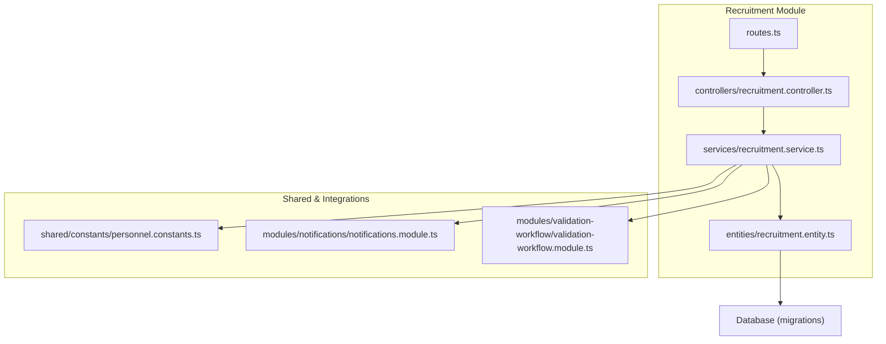
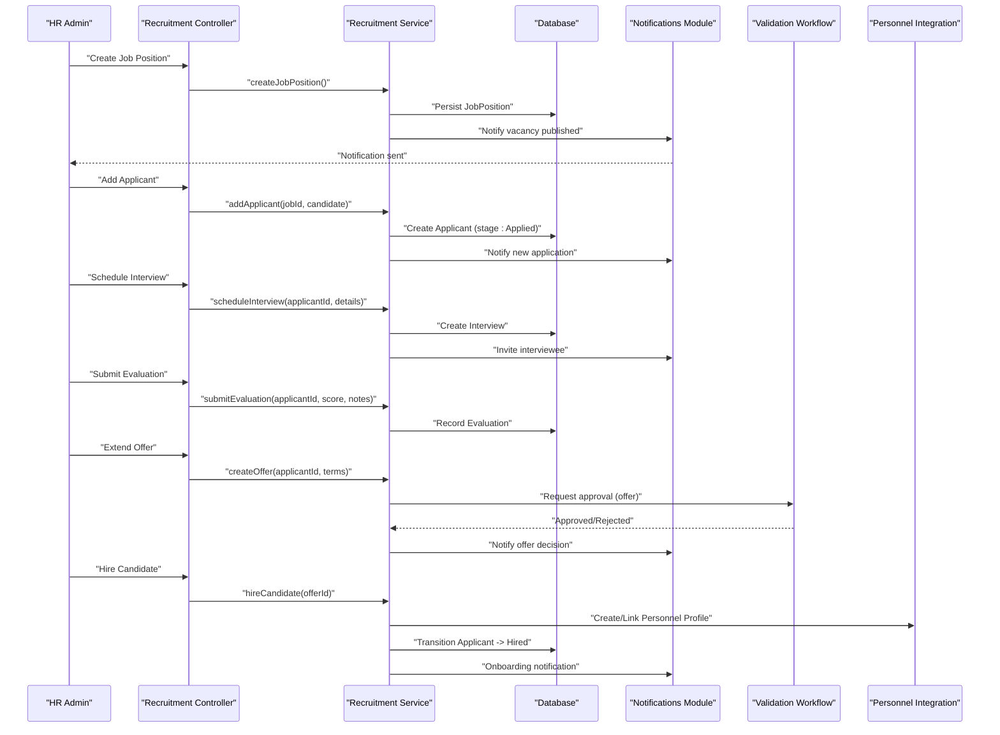
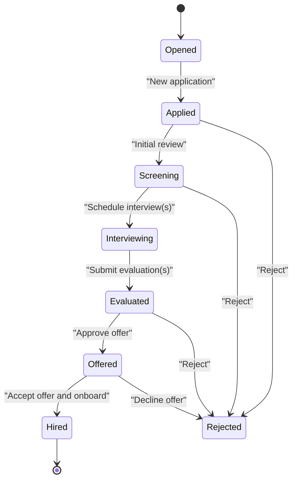
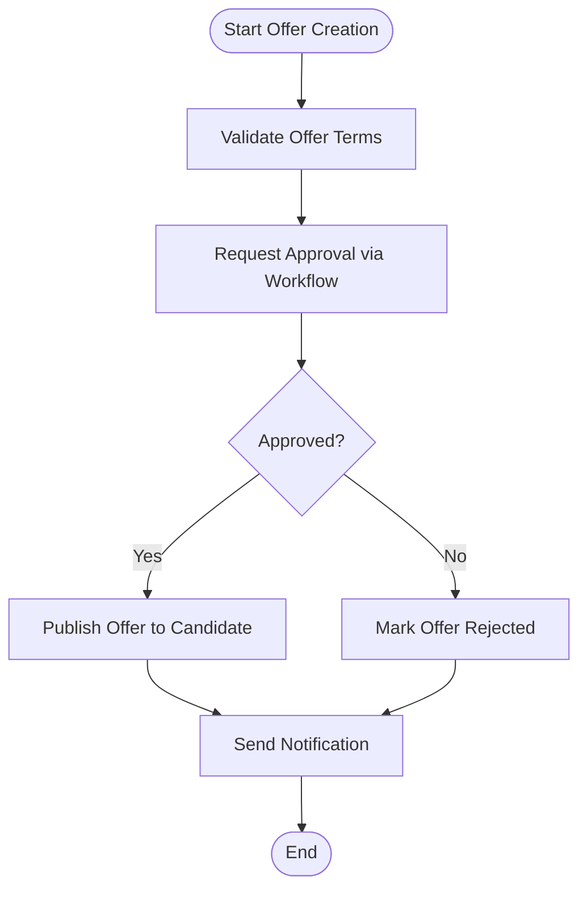
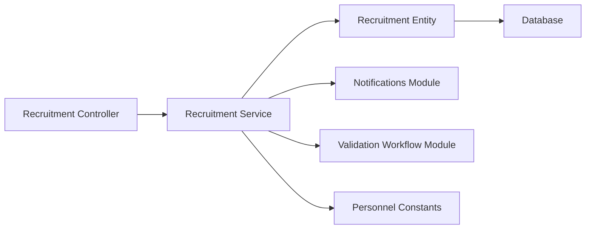

# Recruitment Workflow

<cite>
**Referenced Files in This Document**
- [045-module-recrutement.sql](file://backend/database/migrations/045-module-recrutement.sql)
- [recruitment.controller.ts](file://backend/src/modules/recrutement/controllers/recruitment.controller.ts)
- [recruitment.service.ts](file://backend/src/modules/recrutement/services/recruitment.service.ts)
- [recruitment.entity.ts](file://backend/src/modules/recrutement/entities/recruitment.entity.ts)
- [routes.ts](file://backend/src/modules/recrutement/routes.ts)
- [personnel.constants.ts](file://backend/src/shared/constants/personnel.constants.ts)
- [notifications.module.ts](file://backend/src/modules/notifications/notifications.module.ts)
- [validation-workflow.module.ts](file://backend/src/modules/validation-workflow/validation-workflow.module.ts)
- [deploy-recrutement.sh](file://scripts/deploy-recrutement.sh)
</cite>

## Table of Contents
1. [Introduction](#introduction)
2. [Project Structure](#project-structure)
3. [Core Components](#core-components)
4. [Architecture Overview](#architecture-overview)
5. [Detailed Component Analysis](#detailed-component-analysis)
6. [Dependency Analysis](#dependency-analysis)
7. [Performance Considerations](#performance-considerations)
8. [Troubleshooting Guide](#troubleshooting-guide)
9. [Conclusion](#conclusion)
10. [Appendices](#appendices)

## Introduction
This document explains the recruitment workflow sub-feature end-to-end: from creating job positions and publishing vacancies, through applicant tracking, interview scheduling, evaluation, offer management, to onboarding into personnel profiles and contract creation. It is written for HR administrators while providing sufficient technical depth for system configuration and integration.

The recruitment module integrates with:
- Personnel profiles (candidate becomes employee)
- Notifications (automated alerts at key stages)
- Validation workflows (approvals for offers and hiring decisions)
- Contracts (post-hiring lifecycle)

## Project Structure
The recruitment feature is implemented as a dedicated backend module with standard NestJS patterns: controllers, services, entities, and routes. Database schema is defined via migrations. Deployment is automated by a script.

**Diagram sources**
- [recruitment.controller.ts](file://backend/src/modules/recrutement/controllers/recruitment.controller.ts)
- [recruitment.service.ts](file://backend/src/modules/recrutement/services/recruitment.service.ts)
- [recruitment.entity.ts](file://backend/src/modules/recrutement/entities/recruitment.entity.ts)
- [routes.ts](file://backend/src/modules/recrutement/routes.ts)
- [personnel.constants.ts](file://backend/src/shared/constants/personnel.constants.ts)
- [notifications.module.ts](file://backend/src/modules/notifications/notifications.module.ts)
- [validation-workflow.module.ts](file://backend/src/modules/validation-workflow/validation-workflow.module.ts)

**Section sources**
- [045-module-recrutement.sql](file://backend/database/migrations/045-module-recrutement.sql)
- [deploy-recrutement.sh](file://scripts/deploy-recrutement.sh)

## Core Components
- Controllers expose REST endpoints for job postings, applicants, interviews, evaluations, and offers.
- Services implement business logic: pipeline transitions, approvals, notifications, and integrations with personnel and contracts.
- Entities model core data: JobPosition, Applicant, Interview, Evaluation, Offer, and related associations.
- Routes register API paths and bind them to controller methods.
- Migrations define database tables and relationships required by the module.

Key responsibilities:
- Create and manage job positions and vacancy status
- Track applicants across pipeline stages
- Schedule interviews and record outcomes
- Evaluate candidates against criteria
- Manage offers and approvals
- Convert selected candidates to personnel and create contracts
- Emit notifications at each milestone

**Section sources**
- [recruitment.controller.ts](file://backend/src/modules/recrutement/controllers/recruitment.controller.ts)
- [recruitment.service.ts](file://backend/src/modules/recrutement/services/recruitment.service.ts)
- [recruitment.entity.ts](file://backend/src/modules/recrutement/entities/recruitment.entity.ts)
- [routes.ts](file://backend/src/modules/recrutement/routes.ts)
- [045-module-recrutement.sql](file://backend/database/migrations/045-module-recrutement.sql)

## Architecture Overview
The recruitment workflow follows a staged pipeline with optional approval gates and notifications.

**Diagram sources**
- [recruitment.controller.ts](file://backend/src/modules/recrutement/controllers/recruitment.controller.ts)
- [recruitment.service.ts](file://backend/src/modules/recrutement/services/recruitment.service.ts)
- [notifications.module.ts](file://backend/src/modules/notifications/notifications.module.ts)
- [validation-workflow.module.ts](file://backend/src/modules/validation-workflow/validation-workflow.module.ts)

## Detailed Component Analysis

### Pipeline Stages and Transitions
Typical stages include:
- Opened (job position active)
- Applied (applicant submitted)
- Screening (initial review)
- Interviewing (one or more interviews scheduled)
- Evaluated (scores recorded)
- Offered (offer created and approved)
- Hired (onboarded to personnel)
- Rejected (at any stage)

Transitions are enforced by service logic and may require approvals for sensitive moves (e.g., extending an offer).

[No sources needed since this diagram shows conceptual workflow, not actual code structure]

### Data Model Overview
Core entities typically include:
- JobPosition: role title, department, location, requirements, status
- Applicant: personal info, resume, current stage, applied date
- Interview: type, date/time, interviewer(s), notes
- Evaluation: scores per criterion, comments, evaluator
- Offer: compensation, start date, conditions, approval state
- Audit trail and timestamps for compliance

These are persisted via the migration that defines tables and foreign keys.

**Section sources**
- [045-module-recrutement.sql](file://backend/database/migrations/045-module-recrutement.sql)
- [recruitment.entity.ts](file://backend/src/modules/recrutement/entities/recruitment.entity.ts)

### API Endpoints and Usage Examples
Common operations exposed by the module:
- Create and update job positions
- Submit applications
- Update applicant stage
- Schedule interviews
- Record evaluations
- Create and approve offers
- Hire candidate and trigger onboarding

Example flows:
- Creating a job position: POST /jobs with title, department, requirements; returns job ID and publishes notification.
- Adding an applicant: POST /jobs/:id/applicants with candidate details; sets stage to Applied and notifies stakeholders.
- Scheduling an interview: POST /applicants/:id/interviews with date, time, participants; sends invitations.
- Evaluating a candidate: POST /applicants/:id/evaluations with scores and comments; updates stage to Evaluated if all required evaluations are present.
- Extending an offer: POST /applicants/:id/offers with terms; triggers validation workflow for approval.
- Hiring: PUT /offers/:id/hire; creates or links personnel profile and emits onboarding notifications.

For exact endpoint paths and request/response schemas, refer to the controller and route definitions.

**Section sources**
- [recruitment.controller.ts](file://backend/src/modules/recrutement/controllers/recruitment.controller.ts)
- [routes.ts](file://backend/src/modules/recrutement/routes.ts)

### Approval Workflows
Offers and certain hiring actions can be gated by the validation workflow module. The service requests approval before transitioning to Offered or Hired states. If rejected, the process returns to a prior stage or terminates with rejection.

**Diagram sources**
- [recruitment.service.ts](file://backend/src/modules/recrutement/services/recruitment.service.ts)
- [validation-workflow.module.ts](file://backend/src/modules/validation-workflow/validation-workflow.module.ts)

### Notifications System
Automated notifications are emitted at key milestones:
- New application received
- Interview scheduled or rescheduled
- Evaluation submitted
- Offer extended or withdrawn
- Candidate hired and onboarding initiated

Administrators can configure recipients and channels via the notifications module.

**Section sources**
- [notifications.module.ts](file://backend/src/modules/notifications/notifications.module.ts)
- [recruitment.service.ts](file://backend/src/modules/recrutement/services/recruitment.service.ts)

### Integration with Personnel Profiles and Contracts
When a candidate is hired:
- A personnel profile is created or linked to the applicant
- Employment details (role, department, start date) are synchronized
- Contract creation is triggered based on configured templates and policies
- Onboarding tasks and notifications are dispatched

Constants and shared types ensure consistency between recruitment and personnel modules.

**Section sources**
- [personnel.constants.ts](file://backend/src/shared/constants/personnel.constants.ts)
- [recruitment.service.ts](file://backend/src/modules/recrutement/services/recruitment.service.ts)

### Example Scenarios

#### Scenario 1: Create a Job Position and Publish
- HR admin creates a job position with required fields and publishes it.
- System marks the position as open and notifies relevant teams.

Operational steps:
- Use the job creation endpoint to submit position details.
- Confirm publication via returned status and notifications.

**Section sources**
- [recruitment.controller.ts](file://backend/src/modules/recrutement/controllers/recruitment.controller.ts)
- [recruitment.service.ts](file://backend/src/modules/recrutement/services/recruitment.service.ts)

#### Scenario 2: Manage Applicants and Move Through Pipeline
- Receive applications and set initial stage to Applied.
- Perform screening and move to Screening.
- Schedule interviews and transition to Interviewing.
- Collect evaluations and advance to Evaluated.

Operational steps:
- Add applicants to the job posting.
- Update stages using pipeline transition endpoints.
- Schedule interviews and record evaluations.

**Section sources**
- [recruitment.controller.ts](file://backend/src/modules/recrutement/controllers/recruitment.controller.ts)
- [recruitment.service.ts](file://backend/src/modules/recrutement/services/recruitment.service.ts)

#### Scenario 3: Conduct Interviews and Evaluate Candidates
- Invite candidates to interviews and log outcomes.
- Record evaluation scores and comments per criterion.
- Ensure all required evaluations are completed before advancing.

Operational steps:
- Create interview records with participants and times.
- Submit evaluations tied to the applicant.
- System validates completeness and allows progression.

**Section sources**
- [recruitment.controller.ts](file://backend/src/modules/recrutement/controllers/recruitment.controller.ts)
- [recruitment.service.ts](file://backend/src/modules/recrutement/services/recruitment.service.ts)

#### Scenario 4: Extend Offers and Obtain Approvals
- Draft offer terms and submit for approval.
- Workflow checks policy constraints and delegates to approvers.
- Upon approval, publish offer to candidate and notify.

Operational steps:
- Create offer with compensation and conditions.
- Monitor approval status and handle rejections.
- Communicate outcome to candidate.

**Section sources**
- [recruitment.service.ts](file://backend/src/modules/recrutement/services/recruitment.service.ts)
- [validation-workflow.module.ts](file://backend/src/modules/validation-workflow/validation-workflow.module.ts)

#### Scenario 5: Hire Candidate and Onboard
- Accept offer and convert candidate to personnel.
- Link or create personnel profile with employment details.
- Generate contract and dispatch onboarding tasks.

Operational steps:
- Execute hire action on the accepted offer.
- Verify personnel profile creation and contract generation.
- Confirm onboarding notifications were sent.

**Section sources**
- [recruitment.service.ts](file://backend/src/modules/recrutement/services/recruitment.service.ts)
- [personnel.constants.ts](file://backend/src/shared/constants/personnel.constants.ts)

## Dependency Analysis
The recruitment module depends on:
- Database layer for persistence
- Notifications module for event-driven communication
- Validation workflow module for approvals
- Shared constants/types for alignment with personnel and contracts

**Diagram sources**
- [recruitment.controller.ts](file://backend/src/modules/recrutement/controllers/recruitment.controller.ts)
- [recruitment.service.ts](file://backend/src/modules/recrutement/services/recruitment.service.ts)
- [recruitment.entity.ts](file://backend/src/modules/recrutement/entities/recruitment.entity.ts)
- [notifications.module.ts](file://backend/src/modules/notifications/notifications.module.ts)
- [validation-workflow.module.ts](file://backend/src/modules/validation-workflow/validation-workflow.module.ts)
- [personnel.constants.ts](file://backend/src/shared/constants/personnel.constants.ts)

**Section sources**
- [routes.ts](file://backend/src/modules/recrutement/routes.ts)
- [045-module-recrutement.sql](file://backend/database/migrations/045-module-recrutement.sql)

## Performance Considerations
- Indexes on frequently queried fields (e.g., job_id, applicant_id, stage) improve listing and filtering performance.
- Batch operations for bulk applicant imports should leverage transactional writes.
- Pagination and filtering on large datasets reduce payload sizes and memory usage.
- Caching read-heavy endpoints (e.g., job listings) can reduce database load.
- Asynchronous notifications avoid blocking critical path operations.

[No sources needed since this section provides general guidance]

## Troubleshooting Guide
Common issues and resolutions:
- Missing permissions: Ensure the user has required roles/permissions for recruitment actions.
- Approval failures: Review workflow rules and approver assignments; check audit logs for reasons.
- Notification delivery problems: Verify notification provider configuration and recipient lists.
- Data integrity errors: Validate foreign key relationships and required fields before transitions.
- Migration issues: Run deployment scripts to apply schema changes consistently.

Operational tips:
- Use audit trails to trace state changes and approvals.
- Inspect error responses for specific validation messages.
- Test in staging with sample data before production rollout.

**Section sources**
- [deploy-recrutement.sh](file://scripts/deploy-recrutement.sh)
- [045-module-recrutement.sql](file://backend/database/migrations/045-module-recrutement.sql)

## Conclusion
The recruitment workflow provides a structured, auditable process from job posting to onboarding, integrating approvals, notifications, and personnel/contract systems. By following the documented stages and leveraging the provided APIs, HR administrators can efficiently manage talent acquisition while maintaining compliance and transparency.

[No sources needed since this section summarizes without analyzing specific files]

## Appendices

### Configuration Checklist
- Apply recruitment migrations
- Configure notification providers and recipients
- Define approval workflows for offers and hiring
- Align personnel constants and contract templates
- Train HR staff on pipeline stages and approvals

**Section sources**
- [deploy-recrutement.sh](file://scripts/deploy-recrutement.sh)
- [045-module-recrutement.sql](file://backend/database/migrations/045-module-recrutement.sql)