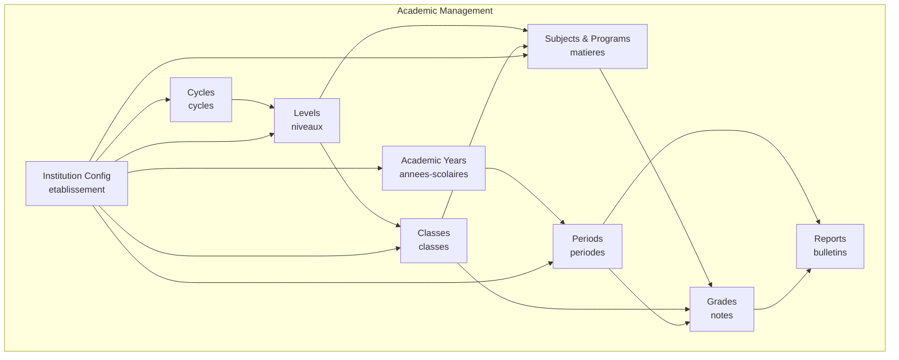
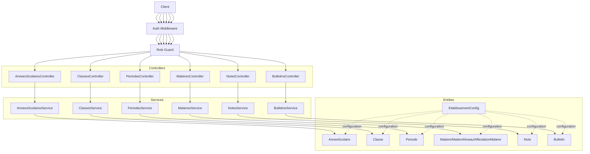
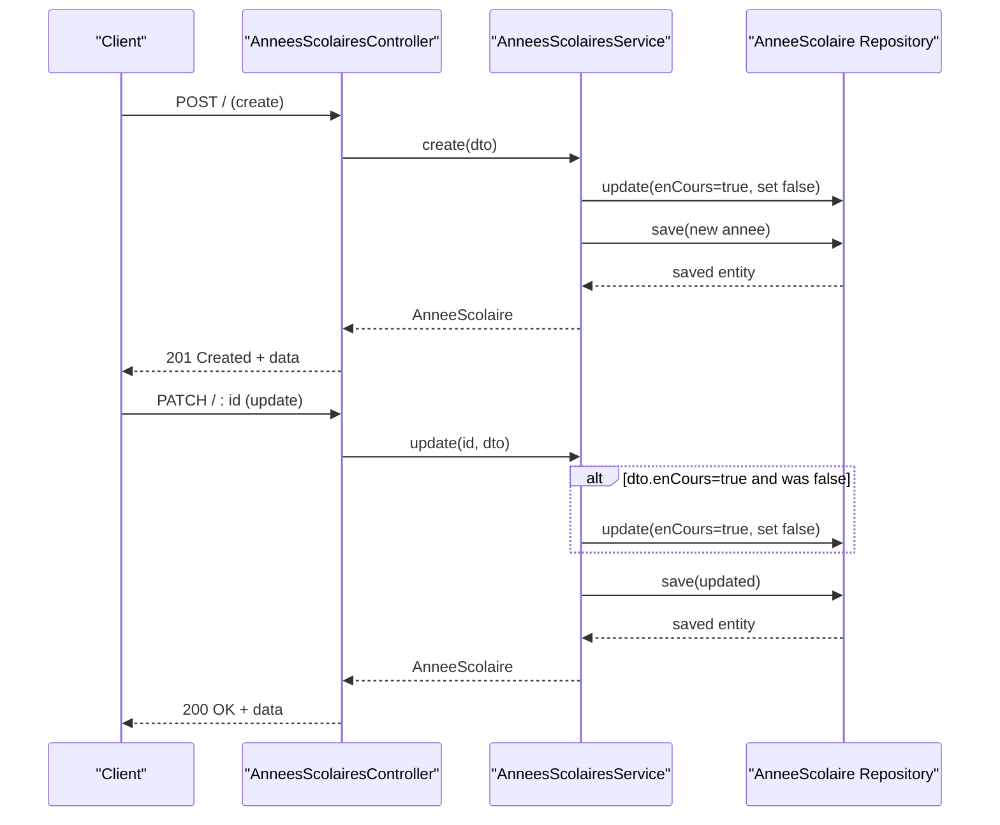
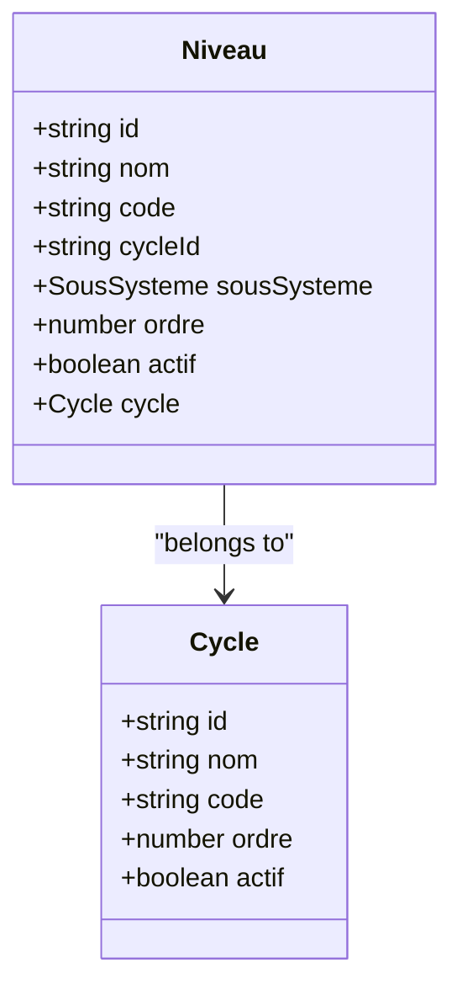
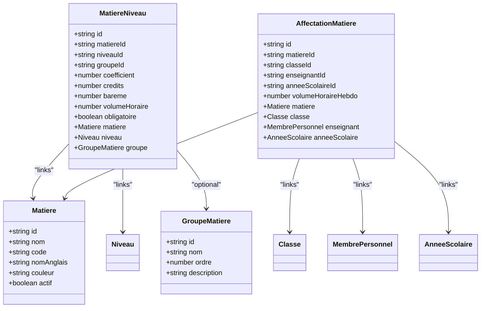
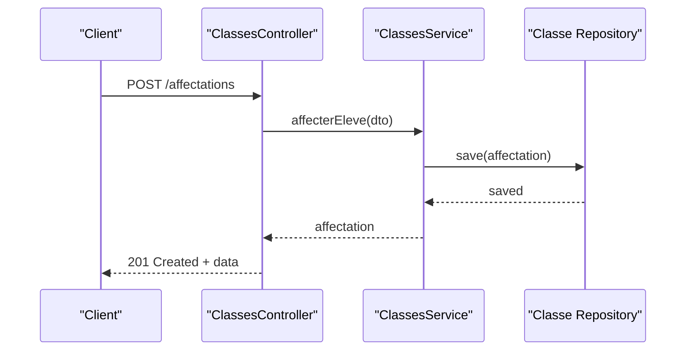
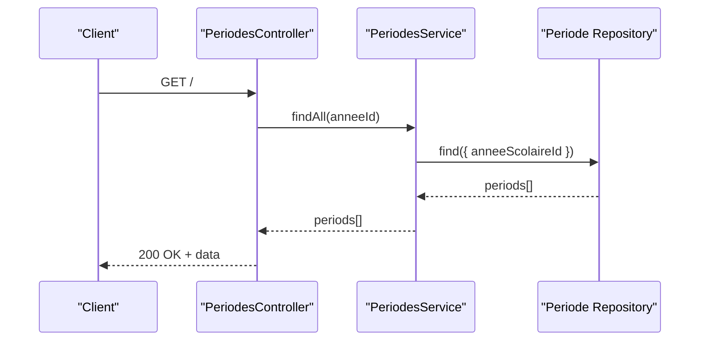
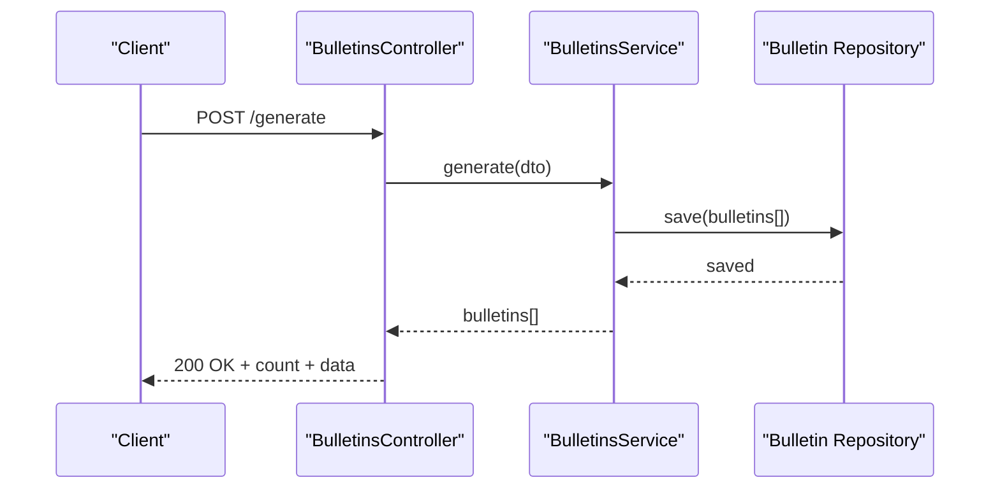
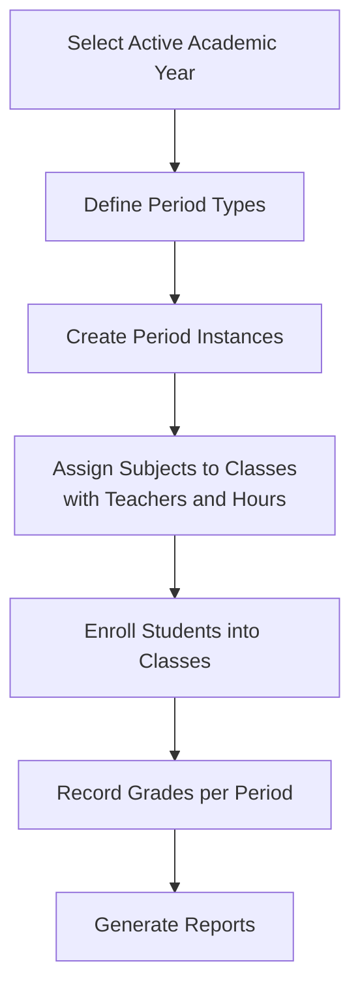
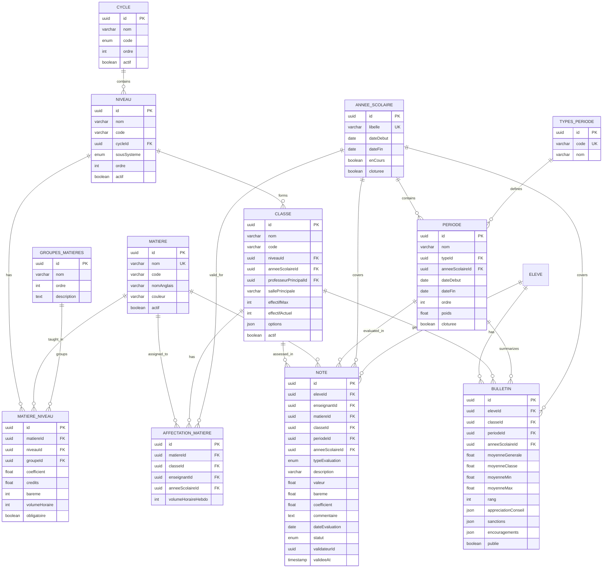

# Academic Modules

<cite>
**Referenced Files in This Document**
- [annee-scolaire.entity.ts](file://backend/src/modules/annees-scolaires/entities/annee-scolaire.entity.ts)
- [annees-scolaires.controller.ts](file://backend/src/modules/annees-scolaires/controllers/annees-scolaires.controller.ts)
- [annees-scolaires.service.ts](file://backend/src/modules/annees-scolaires/services/annees-scolaires.service.ts)
- [cycle.entity.ts](file://backend/src/modules/cycles/entities/cycle.entity.ts)
- [niveau.entity.ts](file://backend/src/modules/niveaux/entities/niveau.entity.ts)
- [matiere.entity.ts](file://backend/src/modules/matieres/entities/matiere.entity.ts)
- [affectation-matiere.entity.ts](file://backend/src/modules/matieres/entities/affectation-matiere.entity.ts)
- [matiere-niveau.entity.ts](file://backend/src/modules/matieres/entities/matiere-niveau.entity.ts)
- [classe.entity.ts](file://backend/src/modules/classes/entities/classe.entity.ts)
- [classes.controller.ts](file://backend/src/modules/classes/controllers/classes.controller.ts)
- [periode.entity.ts](file://backend/src/modules/periodes/entities/periode.entity.ts)
- [periodes.controller.ts](file://backend/src/modules/periodes/controllers/periodes.controller.ts)
- [bulletin.entity.ts](file://backend/src/modules/bulletins/entities/bulletin.entity.ts)
- [bulletins.controller.ts](file://backend/src/modules/bulletins/controllers/bulletins.controller.ts)
- [note.entity.ts](file://backend/src/modules/notes/entities/note.entity.ts)
- [notes.controller.ts](file://backend/src/modules/notes/controllers/notes.controller.ts)
- [etablissement.entity.ts](file://backend/src/modules/etablissement/entities/etablissement.entity.ts)
</cite>

## Table of Contents
1. [Introduction](#introduction)
2. [Project Structure](#project-structure)
3. [Core Components](#core-components)
4. [Architecture Overview](#architecture-overview)
5. [Detailed Component Analysis](#detailed-component-analysis)
6. [Dependency Analysis](#dependency-analysis)
7. [Performance Considerations](#performance-considerations)
8. [Troubleshooting Guide](#troubleshooting-guide)
9. [Conclusion](#conclusion)

## Introduction
This document describes the academic modules that implement the core educational management functionality. It covers academic year management, curriculum structure via cycles and levels, subject management with teaching assignments, class administration, academic periods, and grading systems. It also explains the hierarchical relationships among academic years, cycles, levels, subjects, and classes, and documents the bulletin generation system and grade recording processes. Finally, it outlines entity relationships, service implementations, and controller endpoints for each academic module.

## Project Structure
The academic domain is organized by feature modules under backend/src/modules. Each module encapsulates entities, DTOs, services, and controllers for a specific aspect of education management. The modules relevant to this documentation are:
- Academic years: annees-scolaires
- Curriculum: cycles, niveaux
- Subjects and programs: matieres
- Classes: classes
- Academic periods: periodes
- Grading and reports: notes, bulletins
- Institution configuration: etablissement

**Diagram sources**
- [annee-scolaire.entity.ts:15-40](file://backend/src/modules/annees-scolaires/entities/annee-scolaire.entity.ts#L15-L40)
- [cycle.entity.ts:17-39](file://backend/src/modules/cycles/entities/cycle.entity.ts#L17-L39)
- [niveau.entity.ts:20-53](file://backend/src/modules/niveaux/entities/niveau.entity.ts#L20-L53)
- [matiere.entity.ts:36-61](file://backend/src/modules/matieres/entities/matiere.entity.ts#L36-L61)
- [affectation-matiere.entity.ts:22-65](file://backend/src/modules/matieres/entities/affectation-matiere.entity.ts#L22-L65)
- [matiere-niveau.entity.ts:20-70](file://backend/src/modules/matieres/entities/matiere-niveau.entity.ts#L20-L70)
- [classe.entity.ts:21-75](file://backend/src/modules/classes/entities/classe.entity.ts#L21-L75)
- [periode.entity.ts:34-78](file://backend/src/modules/periodes/entities/periode.entity.ts#L34-L78)
- [note.entity.ts:45-141](file://backend/src/modules/notes/entities/note.entity.ts#L45-L141)
- [bulletin.entity.ts:23-92](file://backend/src/modules/bulletins/entities/bulletin.entity.ts#L23-L92)
- [etablissement.entity.ts:41-92](file://backend/src/modules/etablissement/entities/etablissement.entity.ts#L41-L92)

**Section sources**
- [annee-scolaire.entity.ts:15-40](file://backend/src/modules/annees-scolaires/entities/annee-scolaire.entity.ts#L15-L40)
- [cycle.entity.ts:17-39](file://backend/src/modules/cycles/entities/cycle.entity.ts#L17-L39)
- [niveau.entity.ts:20-53](file://backend/src/modules/niveaux/entities/niveau.entity.ts#L20-L53)
- [matiere.entity.ts:36-61](file://backend/src/modules/matieres/entities/matiere.entity.ts#L36-L61)
- [affectation-matiere.entity.ts:22-65](file://backend/src/modules/matieres/entities/affectation-matiere.entity.ts#L22-L65)
- [matiere-niveau.entity.ts:20-70](file://backend/src/modules/matieres/entities/matiere-niveau.entity.ts#L20-L70)
- [classe.entity.ts:21-75](file://backend/src/modules/classes/entities/classe.entity.ts#L21-L75)
- [periode.entity.ts:34-78](file://backend/src/modules/periodes/entities/periode.entity.ts#L34-L78)
- [note.entity.ts:45-141](file://backend/src/modules/notes/entities/note.entity.ts#L45-L141)
- [bulletin.entity.ts:23-92](file://backend/src/modules/bulletins/entities/bulletin.entity.ts#L23-L92)
- [etablissement.entity.ts:41-92](file://backend/src/modules/etablissement/entities/etablissement.entity.ts#L41-L92)

## Core Components
This section summarizes the primary components and their responsibilities across the academic modules.

- Academic Year Management
  - Entity: stores academic year label, start/end dates, current flag, and closure flag.
  - Service: handles creation, retrieval, activation/deactivation, updates, and deletion with validation and logging.
  - Controller: exposes endpoints for listing, fetching the active year, creating, updating, and deleting academic years with role-based access.

- Curriculum Structure (Cycles and Levels)
  - Cycle entity: defines school cycles (e.g., primary, middle, high school) with ordering and activity flag.
  - Level entity: defines grade levels within cycles, linked to cycle, subsystem, and ordering.

- Subject Management and Teaching Assignments
  - Subject entities: subject groups and subjects with attributes like color and activity.
  - Subject-Level program: links subjects to levels with coefficients, credits, scales, hours, and requirement flags.
  - Teaching assignment: links subjects, classes, teachers, and academic years with weekly hourly volumes.

- Class Administration
  - Class entity: represents classroom groups within a level and academic year, with tutor, room, capacity, current enrollment, and options.
  - Controller: supports listing classes filtered by level and year, CRUD operations, and student enrollment.

- Academic Periods
  - Period entity: defines period types (terms, semesters, sequences) and period instances with dates, order, weight, and closure flag.
  - Controller: manages types and periods, requiring an academic year identifier for listing periods.

- Grading System
  - Grade entity: captures evaluation type, value, scale, coefficient, comments, date, status, validator metadata, and computed normalized score.
  - Controller: supports bulk and individual grade operations, filtering, and validation.

- Report Generation (Bulletins)
  - Bulletin entity: aggregates computed averages, class statistics, rank, global appreciation, and sanctions/encouragements.
  - Controller: generates reports per class/period and retrieves student reports, with update capabilities.

- Institution Configuration
  - Institution configuration entity: holds school-wide settings including subsystem, cycle availability, and report preferences.

**Section sources**
- [annees-scolaires.service.ts:14-79](file://backend/src/modules/annees-scolaires/services/annees-scolaires.service.ts#L14-L79)
- [annees-scolaires.controller.ts:25-60](file://backend/src/modules/annees-scolaires/controllers/annees-scolaires.controller.ts#L25-L60)
- [cycle.entity.ts:17-39](file://backend/src/modules/cycles/entities/cycle.entity.ts#L17-L39)
- [niveau.entity.ts:20-53](file://backend/src/modules/niveaux/entities/niveau.entity.ts#L20-L53)
- [matiere.entity.ts:36-61](file://backend/src/modules/matieres/entities/matiere.entity.ts#L36-L61)
- [matiere-niveau.entity.ts:20-70](file://backend/src/modules/matieres/entities/matiere-niveau.entity.ts#L20-L70)
- [affectation-matiere.entity.ts:22-65](file://backend/src/modules/matieres/entities/affectation-matiere.entity.ts#L22-L65)
- [classe.entity.ts:21-75](file://backend/src/modules/classes/entities/classe.entity.ts#L21-L75)
- [classes.controller.ts:25-63](file://backend/src/modules/classes/controllers/classes.controller.ts#L25-L63)
- [periode.entity.ts:34-78](file://backend/src/modules/periodes/entities/periode.entity.ts#L34-L78)
- [periodes.controller.ts:25-73](file://backend/src/modules/periodes/controllers/periodes.controller.ts#L25-L73)
- [note.entity.ts:45-141](file://backend/src/modules/notes/entities/note.entity.ts#L45-L141)
- [notes.controller.ts:25-71](file://backend/src/modules/notes/controllers/notes.controller.ts#L25-L71)
- [bulletin.entity.ts:23-92](file://backend/src/modules/bulletins/entities/bulletin.entity.ts#L23-L92)
- [bulletins.controller.ts:25-46](file://backend/src/modules/bulletins/controllers/bulletins.controller.ts#L25-L46)
- [etablissement.entity.ts:41-92](file://backend/src/modules/etablissement/entities/etablissement.entity.ts#L41-L92)

## Architecture Overview
The academic modules follow a layered architecture:
- Entities define the persistent model with relationships.
- Services encapsulate business logic and enforce rules (e.g., activating one academic year at a time).
- Controllers expose REST endpoints with authentication and role-based authorization.
- DTOs validate incoming requests using schema-based validation.

**Diagram sources**
- [annees-scolaires.controller.ts:7-15](file://backend/src/modules/annees-scolaires/controllers/annees-scolaires.controller.ts#L7-L15)
- [classes.controller.ts:7-15](file://backend/src/modules/classes/controllers/classes.controller.ts#L7-L15)
- [periodes.controller.ts:7-15](file://backend/src/modules/periodes/controllers/periodes.controller.ts#L7-L15)
- [matieres.controller.ts:7-20](file://backend/src/modules/matieres/controllers/matieres.controller.ts#L7-L20)
- [notes.controller.ts:7-15](file://backend/src/modules/notes/controllers/notes.controller.ts#L7-L15)
- [bulletins.controller.ts:7-15](file://backend/src/modules/bulletins/controllers/bulletins.controller.ts#L7-L15)
- [annees-scolaires.service.ts:14-19](file://backend/src/modules/annees-scolaires/services/annees-scolaires.service.ts#L14-L19)
- [classe.entity.ts:21-75](file://backend/src/modules/classes/entities/classe.entity.ts#L21-L75)
- [periode.entity.ts:34-78](file://backend/src/modules/periodes/entities/periode.entity.ts#L34-L78)
- [matiere-niveau.entity.ts:20-70](file://backend/src/modules/matieres/entities/matiere-niveau.entity.ts#L20-L70)
- [affectation-matiere.entity.ts:22-65](file://backend/src/modules/matieres/entities/affectation-matiere.entity.ts#L22-L65)
- [note.entity.ts:45-141](file://backend/src/modules/notes/entities/note.entity.ts#L45-L141)
- [bulletin.entity.ts:23-92](file://backend/src/modules/bulletins/entities/bulletin.entity.ts#L23-L92)
- [etablissement.entity.ts:41-92](file://backend/src/modules/etablissement/entities/etablissement.entity.ts#L41-L92)

## Detailed Component Analysis

### Academic Year Management
- Responsibilities
  - Maintain academic year lifecycle: create, activate, update, close, and delete.
  - Ensure only one active academic year exists at a time.
  - Provide listing and retrieval of active year.

- Entities and Relationships
  - Academic year entity stores label, start/end dates, current flag, and closure flag.

- Services and Business Rules
  - Creation: sets current flag off others if newly created year is marked current.
  - Updates: toggles other years’ current flag when activating a specific year.
  - Deletion: prevents deletion of active year.

- Controllers and Endpoints
  - GET /: list all academic years ordered by start date descending.
  - GET /active: fetch currently active academic year.
  - POST /: create a new academic year (admin/super admin).
  - PATCH /: update an academic year (admin/super admin).
  - DELETE /: remove an academic year (admin/super admin).

**Diagram sources**
- [annees-scolaires.controller.ts:39-53](file://backend/src/modules/annees-scolaires/controllers/annees-scolaires.controller.ts#L39-L53)
- [annees-scolaires.service.ts:21-67](file://backend/src/modules/annees-scolaires/services/annees-scolaires.service.ts#L21-L67)

**Section sources**
- [annee-scolaire.entity.ts:15-40](file://backend/src/modules/annees-scolaires/entities/annee-scolaire.entity.ts#L15-L40)
- [annees-scolaires.service.ts:21-76](file://backend/src/modules/annees-scolaires/services/annees-scolaires.service.ts#L21-L76)
- [annees-scolaires.controller.ts:25-60](file://backend/src/modules/annees-scolaires/controllers/annees-scolaires.controller.ts#L25-L60)

### Curriculum: Cycles and Levels
- Responsibilities
  - Define school cycles (e.g., primary, middle, high school) and levels within cycles.
  - Support ordering and activity flags for both.

- Entities and Relationships
  - Cycle entity: code, name, order, and activity.
  - Level entity: name/code, cycle linkage, subsystem, order, and activity.

**Diagram sources**
- [cycle.entity.ts:17-39](file://backend/src/modules/cycles/entities/cycle.entity.ts#L17-L39)
- [niveau.entity.ts:20-53](file://backend/src/modules/niveaux/entities/niveau.entity.ts#L20-L53)

**Section sources**
- [cycle.entity.ts:17-39](file://backend/src/modules/cycles/entities/cycle.entity.ts#L17-L39)
- [niveau.entity.ts:20-53](file://backend/src/modules/niveaux/entities/niveau.entity.ts#L20-L53)

### Subject Management and Teaching Assignments
- Responsibilities
  - Manage subject groups and subjects.
  - Define subject programs per level with coefficients/credits, scales, hours, and requirement flags.
  - Assign subjects to classes with teachers and weekly hours for a given academic year.

- Entities and Relationships
  - Subject group and subject entities.
  - Subject-level program entity linking subject to level with grouping, weights, credits, and hours.
  - Teaching assignment entity linking subject, class, teacher, academic year, and weekly hours.

**Diagram sources**
- [matiere.entity.ts:18-61](file://backend/src/modules/matieres/entities/matiere.entity.ts#L18-L61)
- [matiere-niveau.entity.ts:20-70](file://backend/src/modules/matieres/entities/matiere-niveau.entity.ts#L20-L70)
- [affectation-matiere.entity.ts:22-65](file://backend/src/modules/matieres/entities/affectation-matiere.entity.ts#L22-L65)

**Section sources**
- [matiere.entity.ts:18-61](file://backend/src/modules/matieres/entities/matiere.entity.ts#L18-L61)
- [matiere-niveau.entity.ts:20-70](file://backend/src/modules/matieres/entities/matiere-niveau.entity.ts#L20-L70)
- [affectation-matiere.entity.ts:22-65](file://backend/src/modules/matieres/entities/affectation-matiere.entity.ts#L22-L65)

### Class Administration
- Responsibilities
  - Maintain class records within a level and academic year.
  - Track tutor, room, capacity, current enrollment, and options.
  - Support CRUD operations and student enrollment.

- Entities and Relationships
  - Class entity with level and academic year linkage and optional tutor.

- Controllers and Endpoints
  - GET /: list classes optionally filtered by level and academic year.
  - POST /: create a class (admin/super admin).
  - PATCH /: update a class (admin/super admin).
  - DELETE /: delete a class (admin/super admin).
  - POST /affectations: enroll a student (admin/super admin/chef etablissement/personnel).

**Diagram sources**
- [classes.controller.ts:57-63](file://backend/src/modules/classes/controllers/classes.controller.ts#L57-L63)

**Section sources**
- [classe.entity.ts:21-75](file://backend/src/modules/classes/entities/classe.entity.ts#L21-L75)
- [classes.controller.ts:25-63](file://backend/src/modules/classes/controllers/classes.controller.ts#L25-L63)

### Academic Periods
- Responsibilities
  - Define period types (e.g., trimester, semester, sequence) and period instances bound to an academic year.
  - Manage period order, weighting, and closure.

- Entities and Relationships
  - Period type entity and period entity with foreign keys to academic year and type.

- Controllers and Endpoints
  - GET /types: list period types.
  - POST /types: create a period type (admin/super admin).
  - GET /: list periods filtered by academic year.
  - POST /: create a period (admin/super admin).
  - PATCH /: update a period (admin/super admin).
  - DELETE /: delete a period (admin/super admin).

**Diagram sources**
- [periodes.controller.ts:42-49](file://backend/src/modules/periodes/controllers/periodes.controller.ts#L42-L49)

**Section sources**
- [periode.entity.ts:34-78](file://backend/src/modules/periodes/entities/periode.entity.ts#L34-L78)
- [periodes.controller.ts:25-73](file://backend/src/modules/periodes/controllers/periodes.controller.ts#L25-L73)

### Grading System
- Responsibilities
  - Record individual grades with evaluation type, value, scale, coefficient, comments, date, and status.
  - Normalize raw scores to a standard scale (e.g., out of 20) and support bulk operations.
  - Provide filtering and validation.

- Entities and Relationships
  - Grade entity with relationships to student, subject, class, period, academic year, and user (for auditing).

- Controllers and Endpoints
  - GET /: list grades with query filtering (authenticated).
  - GET /:id: retrieve a grade.
  - POST /: create a single grade (teacher/admin/chef etablissement).
  - POST /bulk: create multiple grades (teacher/admin/chef etablissement).
  - PATCH /:id: update a grade (teacher/admin/chef etablissement).
  - DELETE /:id: delete a grade (teacher/admin/chef etablissement).

**Diagram sources**
- [notes.controller.ts:42-56](file://backend/src/modules/notes/controllers/notes.controller.ts#L42-L56)
- [note.entity.ts:134-140](file://backend/src/modules/notes/entities/note.entity.ts#L134-L140)

**Section sources**
- [note.entity.ts:45-141](file://backend/src/modules/notes/entities/note.entity.ts#L45-L141)
- [notes.controller.ts:25-71](file://backend/src/modules/notes/controllers/notes.controller.ts#L25-L71)

### Report Generation (Bulletins)
- Responsibilities
  - Generate and manage student reports per period, compute averages, class statistics, and rank.
  - Store global appreciation and disciplinary actions.

- Entities and Relationships
  - Bulletin entity aggregates computed averages, class stats, rank, and global comments.

- Controllers and Endpoints
  - POST /generate: generate reports for a class/period (admin/super admin/chef etablissement).
  - GET /eleve/:eleveId: retrieve all reports for a student.
  - PATCH /:id: update a report (admin/super admin/chef etablissement).

**Diagram sources**
- [bulletins.controller.ts:25-31](file://backend/src/modules/bulletins/controllers/bulletins.controller.ts#L25-L31)

**Section sources**
- [bulletin.entity.ts:23-92](file://backend/src/modules/bulletins/entities/bulletin.entity.ts#L23-L92)
- [bulletins.controller.ts:25-46](file://backend/src/modules/bulletins/controllers/bulletins.controller.ts#L25-L46)

### Academic Calendar Management, Course Scheduling, and Student Enrollment Workflows
- Academic Calendar Management
  - Academic years define the school year boundaries.
  - Periods define the calendar segments (trimesters, semesters, sequences) within an academic year.
  - Period types are institution-configured and reused across academic years.

- Course Scheduling
  - Teaching assignments link subjects, classes, and teachers for a given academic year.
  - Weekly hours can be recorded per assignment to support scheduling.

- Student Enrollment Workflow
  - Students are enrolled into classes; the class maintains current enrollment and capacity.
  - Enrollment endpoints are exposed via the classes controller.

[No sources needed since this diagram shows conceptual workflow, not actual code structure]

## Dependency Analysis
This section maps dependencies among entities and services to clarify coupling and cohesion.

**Diagram sources**
- [annee-scolaire.entity.ts:15-40](file://backend/src/modules/annees-scolaires/entities/annee-scolaire.entity.ts#L15-L40)
- [periode.entity.ts:19-78](file://backend/src/modules/periodes/entities/periode.entity.ts#L19-L78)
- [cycle.entity.ts:17-39](file://backend/src/modules/cycles/entities/cycle.entity.ts#L17-L39)
- [niveau.entity.ts:20-53](file://backend/src/modules/niveaux/entities/niveau.entity.ts#L20-L53)
- [matiere.entity.ts:18-61](file://backend/src/modules/matieres/entities/matiere.entity.ts#L18-L61)
- [matiere-niveau.entity.ts:20-70](file://backend/src/modules/matieres/entities/matiere-niveau.entity.ts#L20-L70)
- [classe.entity.ts:21-75](file://backend/src/modules/classes/entities/classe.entity.ts#L21-L75)
- [affectation-matiere.entity.ts:22-65](file://backend/src/modules/matieres/entities/affectation-matiere.entity.ts#L22-L65)
- [note.entity.ts:45-141](file://backend/src/modules/notes/entities/note.entity.ts#L45-L141)
- [bulletin.entity.ts:23-92](file://backend/src/modules/bulletins/entities/bulletin.entity.ts#L23-L92)

**Section sources**
- [annee-scolaire.entity.ts:15-40](file://backend/src/modules/annees-scolaires/entities/annee-scolaire.entity.ts#L15-L40)
- [periode.entity.ts:19-78](file://backend/src/modules/periodes/entities/periode.entity.ts#L19-L78)
- [cycle.entity.ts:17-39](file://backend/src/modules/cycles/entities/cycle.entity.ts#L17-L39)
- [niveau.entity.ts:20-53](file://backend/src/modules/niveaux/entities/niveau.entity.ts#L20-L53)
- [matiere.entity.ts:18-61](file://backend/src/modules/matieres/entities/matiere.entity.ts#L18-L61)
- [matiere-niveau.entity.ts:20-70](file://backend/src/modules/matieres/entities/matiere-niveau.entity.ts#L20-L70)
- [classe.entity.ts:21-75](file://backend/src/modules/classes/entities/classe.entity.ts#L21-L75)
- [affectation-matiere.entity.ts:22-65](file://backend/src/modules/matieres/entities/affectation-matiere.entity.ts#L22-L65)
- [note.entity.ts:45-141](file://backend/src/modules/notes/entities/note.entity.ts#L45-L141)
- [bulletin.entity.ts:23-92](file://backend/src/modules/bulletins/entities/bulletin.entity.ts#L23-L92)

## Performance Considerations
- Indexing
  - Entities use database indexes on frequently queried columns (e.g., niveauId, anneeScolaireId, matiereId, periodeId) to optimize joins and filters.
- Normalized Scores
  - Grade normalization to a standard scale reduces computation overhead during report generation.
- Batch Operations
  - Bulk grade creation endpoints minimize round trips for teacher input.
- Logging and Auditing
  - Services log significant operations to aid debugging and monitoring.

[No sources needed since this section provides general guidance]

## Troubleshooting Guide
- Validation Errors
  - Controllers validate incoming DTOs and return structured errors with a validation error code.
- Not Found Errors
  - Services throw not found errors when requested entities are missing.
- Active Year Constraints
  - Deleting the active academic year is prevented by the service.
  - Activating a year automatically deactivates others.

**Section sources**
- [annees-scolaires.controller.ts:17-23](file://backend/src/modules/annees-scolaires/controllers/annees-scolaires.controller.ts#L17-L23)
- [annees-scolaires.service.ts:47-48](file://backend/src/modules/annees-scolaires/services/annees-scolaires.service.ts#L47-L48)
- [annees-scolaires.service.ts:71-74](file://backend/src/modules/annees-scolaires/services/annees-scolaires.service.ts#L71-L74)

## Conclusion
The academic modules provide a cohesive, layered architecture for managing academic years, curriculum structure, subjects and programs, classes, academic periods, grades, and reports. Clear entity relationships, robust services enforcing business rules, and role-based controllers enable secure and scalable educational administration. The design supports institutional configuration, standardized grading, and efficient report generation aligned with the chosen subsystem.