# Academic Modules

<cite>
**Referenced Files in This Document**
- [annee-scolaire.entity.ts](file://backend/src/modules/annees-scolaires/entities/annee-scolaire.entity.ts)
- [annees-scolaires.controller.ts](file://backend/src/modules/annees-scolaires/controllers/annees-scolaires.controller.ts)
- [annees-scolaires.service.ts](file://backend/src/modules/annees-scolaires/services/annees-scolaires.service.ts)
- [cycle.entity.ts](file://backend/src/modules/cycles/entities/cycle.entity.ts)
- [niveau.entity.ts](file://backend/src/modules/niveaux/entities/niveau.entity.ts)
- [matiere.entity.ts](file://backend/src/modules/matieres/entities/matiere.entity.ts)
- [affectation-matiere.entity.ts](file://backend/src/modules/matieres/entities/affectation-matiere.entity.ts)
- [matiere-niveau.entity.ts](file://backend/src/modules/matieres/entities/matiere-niveau.entity.ts)
- [classe.entity.ts](file://backend/src/modules/classes/entities/classe.entity.ts)
- [classes.controller.ts](file://backend/src/modules/classes/controllers/classes.controller.ts)
- [periode.entity.ts](file://backend/src/modules/periodes/entities/periode.entity.ts)
- [periodes.controller.ts](file://backend/src/modules/periodes/controllers/periodes.controller.ts)
- [bulletin.entity.ts](file://backend/src/modules/bulletins/entities/bulletin.entity.ts)
- [bulletins.controller.ts](file://backend/src/modules/bulletins/controllers/bulletins.controller.ts)
- [bulletins.service.ts](file://backend/src/modules/bulletins/services/bulletins.service.ts)
- [note.entity.ts](file://backend/src/modules/notes/entities/note.entity.ts)
- [notes.controller.ts](file://backend/src/modules/notes/controllers/notes.controller.ts)
- [etablissement.entity.ts](file://backend/src/modules/etablissement/entities/etablissement.entity.ts)
- [config.helper.ts](file://backend/src/modules/configuration/utils/config.helper.ts)
- [005-advanced-config-params.ts](file://backend/src/database/migrations/005-advanced-config-params.ts)
- [005-complete-config-params-100.ts](file://backend/src/database/migrations/005-complete-config-params-100.ts)
- [030-suivi-eleves.sql](file://backend/database/migrations/030-suivi-eleves.sql)
- [034-annee-scolaire-suivi.sql](file://backend/database/migrations/034-annee-scolaire-suivi.sql)
- [suivi-eleve.controller.ts](file://backend/src/modules/suivi-eleves/controllers/suivi-eleve.controller.ts)
- [suivi-eleve.service.ts](file://backend/src/modules/suivi-eleves/services/suivi-eleve.service.ts)
- [suivi-eleve.dto.ts](file://backend/src/modules/suivi-eleves/dto/suivi-eleve.dto.ts)
- [incident-eleve.entity.ts](file://backend/src/modules/suivi-eleves/entities/incident-eleve.entity.ts)
- [observation-eleve.entity.ts](file://backend/src/modules/suivi-eleves/entities/observation-eleve.entity.ts)
- [sanction-eleve.entity.ts](file://backend/src/modules/suivi-eleves/entities/sanction-eleve.entity.ts)
- [felicitation-eleve.entity.ts](file://backend/src/modules/suivi-eleves/entities/felicitation-eleve.entity.ts)
- [monitoring.controller.ts](file://backend/src/modules/monitoring/controllers/monitoring.controller.ts)
- [monitoring.service.ts](file://backend/src/modules/monitoring/services/monitoring.service.ts)
- [monitoring.dto.ts](file://backend/src/modules/monitoring/dto/monitoring.dto.ts)
</cite>

## Update Summary
**Changes Made**
- Added comprehensive student monitoring system with four core components: incidents, observations, sanctions, and honors
- Implemented academic year tracking across all monitoring entities with pedagogical context fields
- Enhanced existing services with pagination support for monitoring queries
- Added validation workflow integration for serious sanctions
- Integrated gamification system for academic honors
- Added system monitoring and maintenance capabilities

## Table of Contents
1. [Introduction](#introduction)
2. [Project Structure](#project-structure)
3. [Core Components](#core-components)
4. [Architecture Overview](#architecture-overview)
5. [Detailed Component Analysis](#detailed-component-analysis)
6. [Student Monitoring System](#student-monitoring-system)
7. [System Monitoring and Maintenance](#system-monitoring-and-maintenance)
8. [Configuration Parameters](#configuration-parameters)
9. [Dependency Analysis](#dependency-analysis)
10. [Performance Considerations](#performance-considerations)
11. [Troubleshooting Guide](#troubleshooting-guide)
12. [Conclusion](#conclusion)

## Introduction
This document describes the academic modules that implement the core educational management functionality. It covers academic year management, curriculum structure via cycles and levels, subject management with teaching assignments, class administration, academic periods, and grading systems. It also explains the hierarchical relationships among academic years, cycles, levels, subjects, and classes, and documents the enhanced bulletin generation system with customizable configuration parameters for grade calculation and template selection. Additionally, it details the comprehensive student monitoring system including academic progress tracking, behavioral observations, disciplinary actions, and academic honors, along with system monitoring capabilities for operational oversight.

## Project Structure
The academic domain is organized by feature modules under backend/src/modules. Each module encapsulates entities, DTOs, services, and controllers for a specific aspect of education management. The modules relevant to this documentation are:
- Academic years: annees-scolaires
- Curriculum: cycles, niveaux
- Subjects and programs: matieres
- Classes: classes
- Academic periods: periodes
- Grading and reports: notes, bulletins
- Student monitoring: suivi-eleves
- System monitoring: monitoring
- Institution configuration: etablissement

```mermaid
graph TB
subgraph "Academic Management"
AYS["Academic Years<br/>annees-scolaires"]
CYC["Cycles<br/>cycles"]
NV["Levels<br/>niveaux"]
MT["Subjects & Programs<br/>matieres"]
CL["Classes<br/>classes"]
PER["Periods<br/>periodes"]
GR["Grades<br/>notes"]
BL["Reports<br/>bulletins"]
SM["Student Monitoring<br/>suivi-eleves"]
SYS["System Monitoring<br/>monitoring"]
CFG["Institution Config<br/>etablissement"]
END
AYS --> PER
CYC --> NV
NV --> MT
NV --> CL
CL --> MT
MT --> GR
CL --> GR
PER --> GR
PER --> BL
GR --> BL
SM --> AYS
SM --> CL
SM --> PER
SYS --> CFG
CFG --> AYS
CFG --> CYC
CFG --> NV
CFG --> MT
CFG --> CL
CFG --> PER
CFG --> BL
CFG --> SM
```

**Diagram sources**
- [annee-scolaire.entity.ts:15-40](file://backend/src/modules/annees-scolaires/entities/annee-scolaire.entity.ts#L15-L40)
- [cycle.entity.ts:17-39](file://backend/src/modules/cycles/entities/cycle.entity.ts#L17-L39)
- [niveau.entity.ts:20-53](file://backend/src/modules/niveaux/entities/niveau.entity.ts#L20-L53)
- [matiere.entity.ts:36-61](file://backend/src/modules/matieres/entities/matiere.entity.ts#L36-L61)
- [affectation-matiere.entity.ts:22-65](file://backend/src/modules/matieres/entities/affectation-matiere.entity.ts#L22-L65)
- [matiere-niveau.entity.ts:20-70](file://backend/src/modules/matieres/entities/matiere-niveau.entity.ts#L20-L70)
- [classe.entity.ts:21-75](file://backend/src/modules/classes/entities/classe.entity.ts#L21-L75)
- [periode.entity.ts:34-78](file://backend/src/modules/periodes/entities/periode.entity.ts#L34-L78)
- [note.entity.ts:45-141](file://backend/src/modules/notes/entities/note.entity.ts#L45-L141)
- [bulletin.entity.ts:23-92](file://backend/src/modules/bulletins/entities/bulletin.entity.ts#L23-L92)
- [incident-eleve.entity.ts:1-200](file://backend/src/modules/suivi-eleves/entities/incident-eleve.entity.ts#L1-L200)
- [observation-eleve.entity.ts:1-200](file://backend/src/modules/suivi-eleves/entities/observation-eleve.entity.ts#L1-L200)
- [sanction-eleve.entity.ts:1-200](file://backend/src/modules/suivi-eleves/entities/sanction-eleve.entity.ts#L1-L200)
- [felicitation-eleve.entity.ts:1-200](file://backend/src/modules/suivi-eleves/entities/felicitation-eleve.entity.ts#L1-L200)
- [monitoring.controller.ts:1-71](file://backend/src/modules/monitoring/controllers/monitoring.controller.ts#L1-L71)
- [monitoring.service.ts:1-223](file://backend/src/modules/monitoring/services/monitoring.service.ts#L1-L223)

**Section sources**
- [annee-scolaire.entity.ts:15-40](file://backend/src/modules/annees-scolaires/entities/annee-scolaire.entity.ts#L15-L40)
- [cycle.entity.ts:17-39](file://backend/src/modules/cycles/entities/cycle.entity.ts#L17-L39)
- [niveau.entity.ts:20-53](file://backend/src/modules/niveaux/entities/niveau.entity.ts#L20-L53)
- [matiere.entity.ts:36-61](file://backend/src/modules/matieres/entities/matiere.entity.ts#L36-L61)
- [affectation-matiere.entity.ts:22-65](file://backend/src/modules/matieres/entities/affectation-matiere.entity.ts#L22-L65)
- [matiere-niveau.entity.ts:20-70](file://backend/src/modules/matieres/entities/matiere-niveau.entity.ts#L20-L70)
- [classe.entity.ts:21-75](file://backend/src/modules/classes/entities/classe.entity.ts#L21-L75)
- [periode.entity.ts:34-78](file://backend/src/modules/periodes/entities/periode.entity.ts#L34-L78)
- [note.entity.ts:45-141](file://backend/src/modules/notes/entities/note.entity.ts#L45-L141)
- [bulletin.entity.ts:23-92](file://backend/src/modules/bulletins/entities/bulletin.entity.ts#L23-L92)

## Core Components
This section summarizes the primary components and their responsibilities across the academic modules.

- Academic Year Management
  - Entity: stores academic year label, start/end dates, current flag, and closure flag.
  - Service: handles creation, retrieval, activation/deactivation, updates, and deletion with validation and logging.
  - Controller: exposes endpoints for listing, fetching the active year, creating, updating, and deleting academic years with role-based access.

- Curriculum Structure (Cycles and Levels)
  - Cycle entity: defines school cycles (e.g., primary, middle, high school) with ordering and activity flag.
  - Level entity: defines grade levels within cycles, linked to cycle, subsystem, and ordering.

- Subject Management and Teaching Assignments
  - Subject entities: subject groups and subjects with attributes like color and activity.
  - Subject-Level program: links subjects to levels with coefficients, credits, scales, hours, and requirement flags.
  - Teaching assignment: links subjects, classes, teachers, and academic years with weekly hourly volumes.

- Class Administration
  - Class entity: represents classroom groups within a level and academic year, with tutor, room, capacity, current enrollment, and options.
  - Controller: supports listing classes filtered by level and year, CRUD operations, and student enrollment.

- Academic Periods
  - Period entity: defines period types (terms, semesters, sequences) and period instances with dates, order, weight, and closure flag.
  - Controller: manages types and periods, requiring an academic year identifier for listing periods.

- Grading System
  - Grade entity: captures evaluation type, value, scale, coefficient, comments, date, status, validator metadata, and computed normalized score.
  - Controller: supports bulk and individual grade operations, filtering, and validation.

- Enhanced Report Generation (Bulletins)
  - Bulletin entity: aggregates computed averages, class statistics, rank, global appreciation, and sanctions/encouragements.
  - Controller: generates reports per class/period and retrieves student reports, with update capabilities.
  - **Enhanced**: Now supports customizable grade calculation methods, validation thresholds, ranking inclusion, coefficient display, and template selection through runtime configuration parameters.

- Student Monitoring System
  - **New**: Comprehensive monitoring system tracking academic progress, behavioral observations, disciplinary actions, and academic honors.
  - **New**: Academic year tracking across all monitoring entities with pedagogical context fields.
  - **New**: Validation workflow integration for serious sanctions requiring administrative approval.
  - **New**: Gamification integration for academic honors and rewards.

- System Monitoring and Maintenance
  - **New**: Health check endpoints for system status monitoring.
  - **New**: Metrics collection for CPU, memory, and database connectivity.
  - **New**: Application statistics including user counts and pending requests.
  - **New**: Maintenance mode management with configuration parameters.

- Institution Configuration
  - Institution configuration entity: holds school-wide settings including subsystem, cycle availability, and report preferences.

**Section sources**
- [annees-scolaires.service.ts:14-79](file://backend/src/modules/annees-scolaires/services/annees-scolaires.service.ts#L14-L79)
- [annees-scolaires.controller.ts:25-60](file://backend/src/modules/annees-scolaires/controllers/annees-scolaires.controller.ts#L25-L60)
- [cycle.entity.ts:17-39](file://backend/src/modules/cycles/entities/cycle.entity.ts#L17-L39)
- [niveau.entity.ts:20-53](file://backend/src/modules/niveaux/entities/niveau.entity.ts#L20-L53)
- [matiere.entity.ts:36-61](file://backend/src/modules/matieres/entities/matiere.entity.ts#L36-L61)
- [matiere-niveau.entity.ts:20-70](file://backend/src/modules/matieres/entities/matiere-niveau.entity.ts#L20-L70)
- [affectation-matiere.entity.ts:22-65](file://backend/src/modules/matieres/entities/affectation-matiere.entity.ts#L22-L65)
- [classe.entity.ts:21-75](file://backend/src/modules/classes/entities/classe.entity.ts#L21-L75)
- [classes.controller.ts:25-63](file://backend/src/modules/classes/controllers/classes.controller.ts#L25-L63)
- [periode.entity.ts:34-78](file://backend/src/modules/periodes/entities/periode.entity.ts#L34-L78)
- [periodes.controller.ts:25-73](file://backend/src/modules/periodes/controllers/periodes.controller.ts#L25-L73)
- [note.entity.ts:45-141](file://backend/src/modules/notes/entities/note.entity.ts#L45-L141)
- [notes.controller.ts:25-71](file://backend/src/modules/notes/controllers/notes.controller.ts#L25-L71)
- [bulletin.entity.ts:23-92](file://backend/src/modules/bulletins/entities/bulletin.entity.ts#L23-L92)
- [bulletins.controller.ts:25-46](file://backend/src/modules/bulletins/controllers/bulletins.controller.ts#L25-L46)
- [suivi-eleve.service.ts:70-86](file://backend/src/modules/suivi-eleves/services/suivi-eleve.service.ts#L70-L86)
- [monitoring.controller.ts:17-68](file://backend/src/modules/monitoring/controllers/monitoring.controller.ts#L17-L68)
- [etablissement.entity.ts:41-92](file://backend/src/modules/etablissement/entities/etablissement.entity.ts#L41-L92)

## Architecture Overview
The academic modules follow a layered architecture:
- Entities define the persistent model with relationships.
- Services encapsulate business logic and enforce rules (e.g., activating one academic year at a time).
- Controllers expose REST endpoints with authentication and role-based authorization.
- DTOs validate incoming requests using schema-based validation.
- **Enhanced**: Configuration parameters are managed through a centralized configuration system with runtime caching and validation.
- **Enhanced**: Student monitoring system integrates with validation workflows and gamification services.
- **Enhanced**: System monitoring provides operational insights and maintenance capabilities.

```mermaid
graph TB
Client["Client"]
Auth["Auth Middleware"]
Roles["Role Guard"]
subgraph "Controllers"
C_ays["AnneesScolairesController"]
C_cls["ClassesController"]
C_per["PeriodesController"]
C_mat["MatieresController"]
C_not["NotesController"]
C_bl["BulletinsController"]
C_sm["SuiviElevesController"]
C_sys["MonitoringController"]
end
subgraph "Services"
S_ays["AnneesScolairesService"]
S_cls["ClassesService"]
S_per["PeriodesService"]
S_mat["MatieresService"]
S_not["NotesService"]
S_bl["BulletinsService"]
S_sm["SuiviEleveService"]
S_sys["MonitoringService"]
end
subgraph "Entities"
E_ys["AnneeScolaire"]
E_cls["Classe"]
E_per["Periode"]
E_mat["Matiere/MatiereNiveau/AffectationMatiere"]
E_note["Note"]
E_bul["Bulletin"]
E_inc["IncidentEleve"]
E_obs["ObservationEleve"]
E_san["SanctionEleve"]
E_fel["FelicitationEleve"]
E_cfg["EtablissementConfig"]
end
subgraph "Integration Services"
Workflow["Validation Workflow Service"]
Gamification["Gamification Service"]
Audit["Audit Service"]
Config["Configuration Service"]
Cache["Quick Cache<br/>60s TTL"]
end
Client --> Auth --> Roles --> C_ays
Client --> Auth --> Roles --> C_cls
Client --> Auth --> Roles --> C_per
Client --> Auth --> Roles --> C_mat
Client --> Auth --> Roles --> C_not
Client --> Auth --> Roles --> C_bl
Client --> Auth --> Roles --> C_sm
Client --> Auth --> Roles --> C_sys
C_ays --> S_ays --> E_ys
C_cls --> S_cls --> E_cls
C_per --> S_per --> E_per
C_mat --> S_mat --> E_mat
C_not --> S_not --> E_note
C_bl --> S_bl --> E_bul
C_sm --> S_sm --> E_inc
C_sm --> S_sm --> E_obs
C_sm --> S_sm --> E_san
C_sm --> S_sm --> E_fel
C_sys --> S_sys --> S_sys
S_bl --> Config
S_sm --> Workflow
S_sm --> Gamification
S_sm --> Audit
E_cfg -. configuration .-> E_ys
E_cfg -. configuration .-> E_cls
E_cfg -. configuration .-> E_per
E_cfg -. configuration .-> E_mat
E_cfg -. configuration .-> E_note
E_cfg -. configuration .-> E_bul
E_cfg -. configuration .-> E_inc
E_cfg -. configuration .-> E_obs
E_cfg -. configuration .-> E_san
E_cfg -. configuration .-> E_fel
S_bl --> Config
Config --> Cache
```

**Diagram sources**
- [annees-scolaires.controller.ts:7-15](file://backend/src/modules/annees-scolaires/controllers/annees-scolaires.controller.ts#L7-L15)
- [classes.controller.ts:7-15](file://backend/src/modules/classes/controllers/classes.controller.ts#L7-L15)
- [periodes.controller.ts:7-15](file://backend/src/modules/periodes/controllers/periodes.controller.ts#L7-L15)
- [matieres.controller.ts:7-20](file://backend/src/modules/matieres/controllers/matieres.controller.ts#L7-L20)
- [notes.controller.ts:7-15](file://backend/src/modules/notes/controllers/notes.controller.ts#L7-L15)
- [bulletins.controller.ts:7-15](file://backend/src/modules/bulletins/controllers/bulletins.controller.ts#L7-L15)
- [suivi-eleve.controller.ts:1-200](file://backend/src/modules/suivi-eleves/controllers/suivi-eleve.controller.ts#L1-L200)
- [monitoring.controller.ts:7-15](file://backend/src/modules/monitoring/controllers/monitoring.controller.ts#L7-L15)
- [annees-scolaires.service.ts:14-19](file://backend/src/modules/annees-scolaires/services/annees-scolaires.service.ts#L14-L19)
- [classe.entity.ts:21-75](file://backend/src/modules/classes/entities/classe.entity.ts#L21-L75)
- [periode.entity.ts:34-78](file://backend/src/modules/periodes/entities/periode.entity.ts#L34-L78)
- [matiere-niveau.entity.ts:20-70](file://backend/src/modules/matieres/entities/matiere-niveau.entity.ts#L20-L70)
- [affectation-matiere.entity.ts:22-65](file://backend/src/modules/matieres/entities/affectation-matiere.entity.ts#L22-L65)
- [note.entity.ts:45-141](file://backend/src/modules/notes/entities/note.entity.ts#L45-L141)
- [bulletin.entity.ts:23-92](file://backend/src/modules/bulletins/entities/bulletin.entity.ts#L23-L92)
- [incident-eleve.entity.ts:1-200](file://backend/src/modules/suivi-eleves/entities/incident-eleve.entity.ts#L1-L200)
- [observation-eleve.entity.ts:1-200](file://backend/src/modules/suivi-eleves/entities/observation-eleve.entity.ts#L1-L200)
- [sanction-eleve.entity.ts:1-200](file://backend/src/modules/suivi-eleves/entities/sanction-eleve.entity.ts#L1-L200)
- [felicitation-eleve.entity.ts:1-200](file://backend/src/modules/suivi-eleves/entities/felicitation-eleve.entity.ts#L1-L200)
- [monitoring.service.ts:17-45](file://backend/src/modules/monitoring/services/monitoring.service.ts#L17-L45)
- [config.helper.ts:15-54](file://backend/src/modules/configuration/utils/config.helper.ts#L15-L54)

## Detailed Component Analysis

### Academic Year Management
- Responsibilities
  - Maintain academic year lifecycle: create, activate, update, close, and delete.
  - Ensure only one active academic year exists at a time.
  - Provide listing and retrieval of active year.

- Entities and Relationships
  - Academic year entity stores label, start/end dates, current flag, and closure flag.

- Services and Business Rules
  - Creation: sets current flag off others if newly created year is marked current.
  - Updates: toggles other years' current flag when activating a specific year.
  - Deletion: prevents deletion of active year.

- Controllers and Endpoints
  - GET /: list all academic years ordered by start date descending.
  - GET /active: fetch currently active academic year.
  - POST /: create a new academic year (admin/super admin).
  - PATCH /: update an academic year (admin/super admin).
  - DELETE /: remove an academic year (admin/super admin).

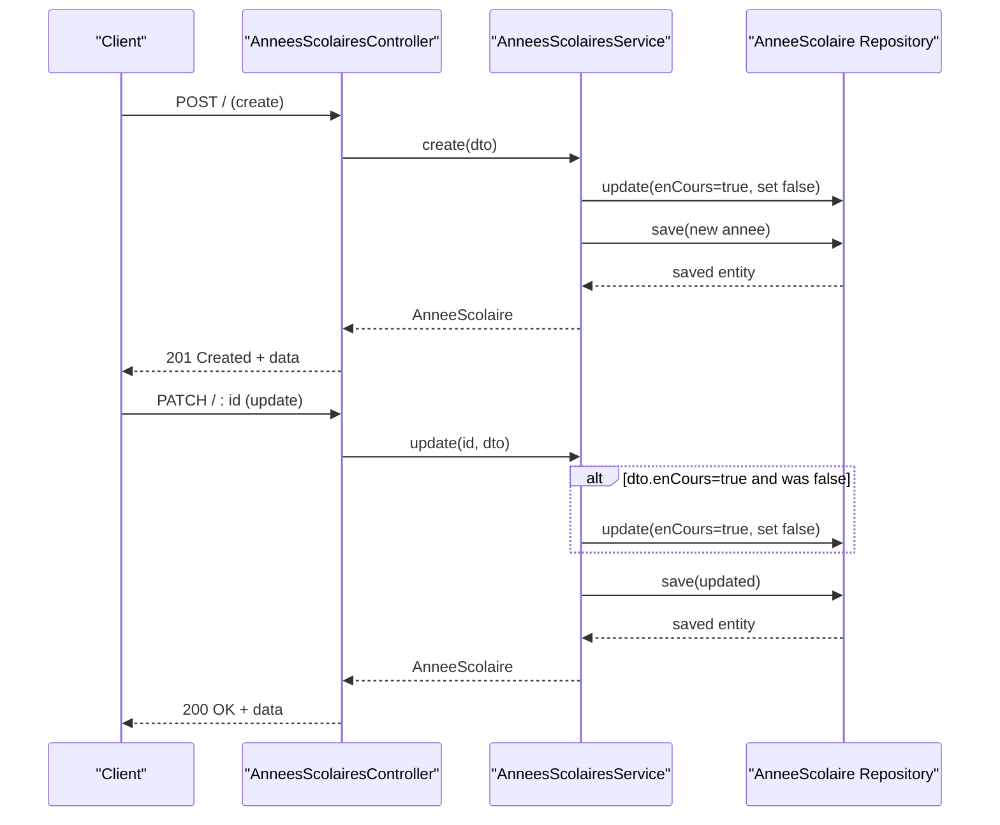

**Diagram sources**
- [annees-scolaires.controller.ts:39-53](file://backend/src/modules/annees-scolaires/controllers/annees-scolaires.controller.ts#L39-L53)
- [annees-scolaires.service.ts:21-67](file://backend/src/modules/annees-scolaires/services/annees-scolaires.service.ts#L21-L67)

**Section sources**
- [annee-scolaire.entity.ts:15-40](file://backend/src/modules/annees-scolaires/entities/annee-scolaire.entity.ts#L15-L40)
- [annees-scolaires.service.ts:21-76](file://backend/src/modules/annees-scolaires/services/annees-scolaires.service.ts#L21-L76)
- [annees-scolaires.controller.ts:25-60](file://backend/src/modules/annees-scolaires/controllers/annees-scolaires.controller.ts#L25-L60)

### Curriculum: Cycles and Levels
- Responsibilities
  - Define school cycles (e.g., primary, middle, high school) and levels within cycles.
  - Support ordering and activity flags for both.

- Entities and Relationships
  - Cycle entity: code, name, order, and activity.
  - Level entity: name/code, cycle linkage, subsystem, order, and activity.

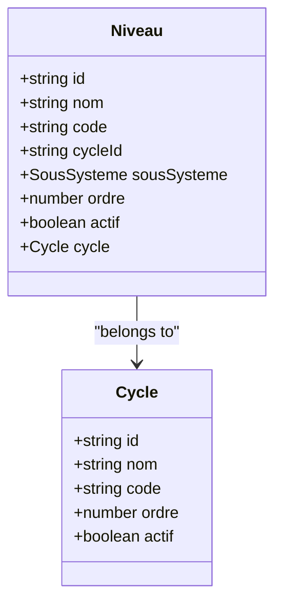

**Diagram sources**
- [cycle.entity.ts:17-39](file://backend/src/modules/cycles/entities/cycle.entity.ts#L17-L39)
- [niveau.entity.ts:20-53](file://backend/src/modules/niveaux/entities/niveau.entity.ts#L20-L53)

**Section sources**
- [cycle.entity.ts:17-39](file://backend/src/modules/cycles/entities/cycle.entity.ts#L17-L39)
- [niveau.entity.ts:20-53](file://backend/src/modules/niveaux/entities/niveau.entity.ts#L20-L53)

### Subject Management and Teaching Assignments
- Responsibilities
  - Manage subject groups and subjects.
  - Define subject programs per level with coefficients/credits, scales, hours, and requirement flags.
  - Assign subjects to classes with teachers and weekly hours for a given academic year.

- Entities and Relationships
  - Subject group and subject entities.
  - Subject-level program entity linking subject to level with grouping, weights, credits, and hours.
  - Teaching assignment entity linking subject, class, teacher, academic year, and weekly hours.

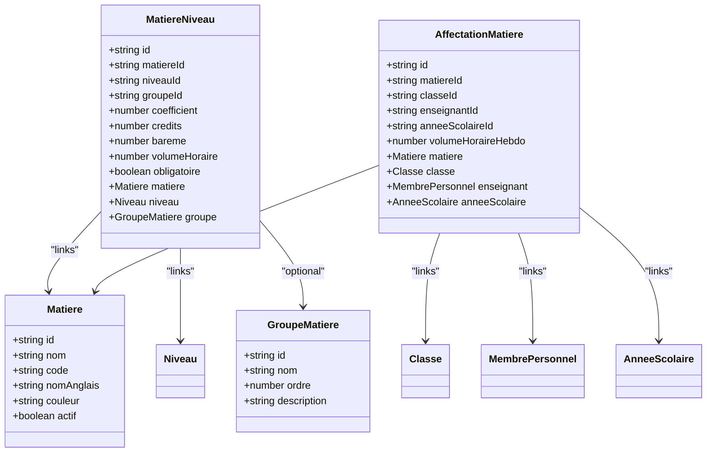

**Diagram sources**
- [matiere.entity.ts:18-61](file://backend/src/modules/matieres/entities/matiere.entity.ts#L18-L61)
- [matiere-niveau.entity.ts:20-70](file://backend/src/modules/matieres/entities/matiere-niveau.entity.ts#L20-L70)
- [affectation-matiere.entity.ts:22-65](file://backend/src/modules/matieres/entities/affectation-matiere.entity.ts#L22-L65)

**Section sources**
- [matiere.entity.ts:18-61](file://backend/src/modules/matieres/entities/matiere.entity.ts#L18-L61)
- [matiere-niveau.entity.ts:20-70](file://backend/src/modules/matieres/entities/matiere-niveau.entity.ts#L20-L70)
- [affectation-matiere.entity.ts:22-65](file://backend/src/modules/matieres/entities/affectation-matiere.entity.ts#L22-L65)

### Class Administration
- Responsibilities
  - Maintain class records within a level and academic year.
  - Track tutor, room, capacity, current enrollment, and options.
  - Support CRUD operations and student enrollment.

- Entities and Relationships
  - Class entity with level and academic year linkage and optional tutor.

- Controllers and Endpoints
  - GET /: list classes optionally filtered by level and academic year.
  - POST /: create a class (admin/super admin).
  - PATCH /: update a class (admin/super admin).
  - DELETE /: delete a class (admin/super admin).
  - POST /affectations: enroll a student (admin/super admin/chef etablissement/personnel).

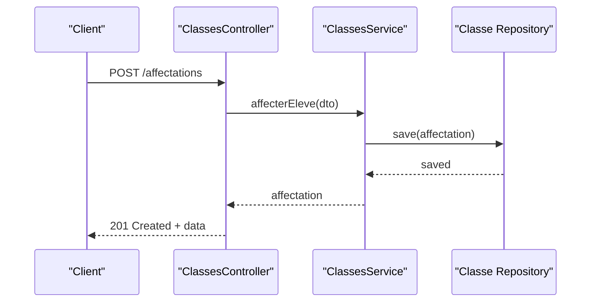

**Diagram sources**
- [classes.controller.ts:57-63](file://backend/src/modules/classes/controllers/classes.controller.ts#L57-L63)

**Section sources**
- [classe.entity.ts:21-75](file://backend/src/modules/classes/entities/classe.entity.ts#L21-L75)
- [classes.controller.ts:25-63](file://backend/src/modules/classes/controllers/classes.controller.ts#L25-L63)

### Academic Periods
- Responsibilities
  - Define period types (e.g., trimester, semester, sequence) and period instances bound to an academic year.
  - Manage period order, weighting, and closure.

- Entities and Relationships
  - Period type entity and period entity with foreign keys to academic year and type.

- Controllers and Endpoints
  - GET /types: list period types.
  - POST /types: create a period type (admin/super admin).
  - GET /: list periods filtered by academic year.
  - POST /: create a period (admin/super admin).
  - PATCH /: update a period (admin/super admin).
  - DELETE /: delete a period (admin/super admin).

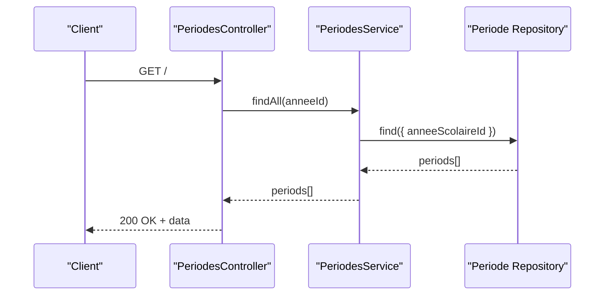

**Diagram sources**
- [periodes.controller.ts:42-49](file://backend/src/modules/periodes/controllers/periodes.controller.ts#L42-L49)

**Section sources**
- [periode.entity.ts:34-78](file://backend/src/modules/periodes/entities/periode.entity.ts#L34-L78)
- [periodes.controller.ts:25-73](file://backend/src/modules/periodes/controllers/periodes.controller.ts#L25-L73)

### Grading System
- Responsibilities
  - Record individual grades with evaluation type, value, scale, coefficient, comments, date, and status.
  - Normalize raw scores to a standard scale (e.g., out of 20) and support bulk operations.
  - Provide filtering and validation.

- Entities and Relationships
  - Grade entity with relationships to student, subject, class, period, academic year, and user (for auditing).

- Controllers and Endpoints
  - GET /: list grades with query filtering (authenticated).
  - GET /:id: retrieve a grade.
  - POST /: create a single grade (teacher/admin/chef etablissement).
  - POST /bulk: create multiple grades (teacher/admin/chef etablissement).
  - PATCH /:id: update a grade (teacher/admin/chef etablissement).
  - DELETE /:id: delete a grade (teacher/admin/chef etablissement).

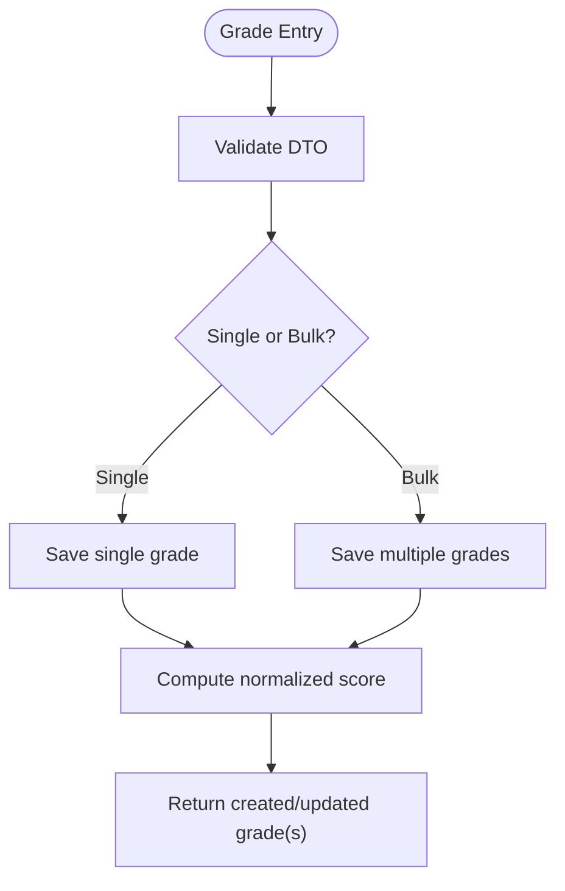

**Diagram sources**
- [notes.controller.ts:42-56](file://backend/src/modules/notes/controllers/notes.controller.ts#L42-L56)
- [note.entity.ts:134-140](file://backend/src/modules/notes/entities/note.entity.ts#L134-L140)

**Section sources**
- [note.entity.ts:45-141](file://backend/src/modules/notes/entities/note.entity.ts#L45-L141)
- [notes.controller.ts:25-71](file://backend/src/modules/notes/controllers/notes.controller.ts#L25-L71)

### Enhanced Report Generation (Bulletins)
- Responsibilities
  - Generate and manage student reports per period, compute averages, class statistics, and rank.
  - Store global appreciation and disciplinary actions.
  - **Enhanced**: Support customizable grade calculation methods, validation thresholds, ranking inclusion, coefficient display, and template selection through runtime configuration parameters.

- Entities and Relationships
  - Bulletin entity aggregates computed averages, class stats, rank, and global comments.
  - **Enhanced**: Supports additional fields for configuration-driven behavior including ranking inclusion, coefficient display, and template identification.

- Controllers and Endpoints
  - POST /generate: generate reports for a class/period (admin/super admin/chef etablissement).
  - GET /eleve/:eleveId: retrieve all reports for a student.
  - PATCH /:id: update a report (admin/super admin/chef etablissement).

- **Enhanced Configuration Parameters**
  - `bulletins.include_ranking`: Boolean - Include ranking/rank in generated bulletins
  - `bulletins.validation_threshold`: Number - Minimum passing grade threshold (out of 20)
  - `bulletins.calculation_method`: String - 'arithmetique' or 'ponderee' for average calculation
  - `bulletins.display_coefficients`: Boolean - Show subject coefficients on bulletins
  - `bulletins.show_appreciations`: Boolean - Include class council appreciation
  - `bulletins.template_id`: String - PDF template identifier for bulletin generation

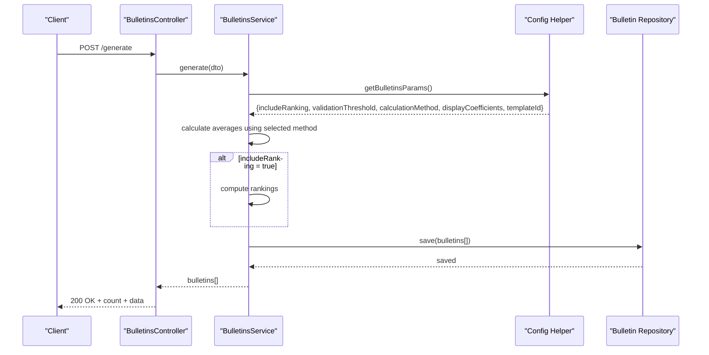

**Diagram sources**
- [bulletins.controller.ts:25-31](file://backend/src/modules/bulletins/controllers/bulletins.controller.ts#L25-L31)
- [bulletins.service.ts:30-39](file://backend/src/modules/bulletins/services/bulletins.service.ts#L30-L39)

**Section sources**
- [bulletin.entity.ts:23-92](file://backend/src/modules/bulletins/entities/bulletin.entity.ts#L23-L92)
- [bulletins.controller.ts:25-46](file://backend/src/modules/bulletins/controllers/bulletins.controller.ts#L25-L46)
- [bulletins.service.ts:30-39](file://backend/src/modules/bulletins/services/bulletins.service.ts#L30-L39)

### Academic Calendar Management, Course Scheduling, and Student Enrollment Workflows
- Academic Calendar Management
  - Academic years define the school year boundaries.
  - Periods define the calendar segments (trimesters, semesters, sequences) within an academic year.
  - Period types are institution-configured and reused across academic years.

- Course Scheduling
  - Teaching assignments link subjects, classes, and teachers for a given academic year.
  - Weekly hours can be recorded per assignment to support scheduling.

- Student Enrollment Workflow
  - Students are enrolled into classes; the class maintains current enrollment and capacity.
  - Enrollment endpoints are exposed via the classes controller.

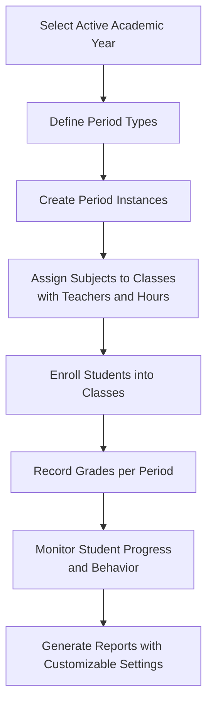

[No sources needed since this diagram shows conceptual workflow, not actual code structure]

## Student Monitoring System
**New Section**: The comprehensive student monitoring system tracks academic progress, behavioral observations, disciplinary actions, and academic honors across academic years with pedagogical context.

### Core Components

#### Incidents Disciplinaires
- **Entity**: Tracks disciplinary incidents with severity levels (MINEUR, MODERE, GRAVE, TRES_GRAVE)
- **Fields**: Date, type, description, location, witnesses, action taken, parent notification
- **Context**: Linked to academic year, school establishment, and involved parties
- **Status Tracking**: SIGNALE, SANCTIONNE, TRAITE

#### Observations Comportementales
- **Entity**: Records behavioral observations categorized as POSITIVE, NEGATIVE, or NEUTRE
- **Fields**: Observer, category, comment, impact points, parent visibility
- **Gamification**: Points can contribute to student gamification scores
- **Pedagogical Context**: Linked to academic year and school establishment

#### Sanctions Disciplinaires
- **Entity**: Formal disciplinary measures linked to specific incidents
- **Fields**: Type, status (PRONONCEE, EN_ATTENTE_VALIDATION), duration, measures
- **Validation Workflow**: Serious sanctions require administrative approval workflow
- **Decision Context**: Linked to decision-maker, academic year, and establishment

#### Félicitations et Récompenses
- **Entity**: Academic honors and recognition awards
- **Fields**: Type, motivation, bonus points, visibility settings for reports and parents
- **Gamification Integration**: Points contribute to student achievement badges
- **Academic Context**: Tracked per academic year for progress monitoring

### Academic Year Tracking
**Enhanced**: All monitoring entities now include academic year tracking with pedagogical context:
- **Year Filtering**: Queries can filter by specific academic year
- **Progress Monitoring**: Longitudinal tracking across multiple years
- **Statistical Analysis**: Year-over-year behavior trend analysis
- **Reporting Context**: Reports can be generated for specific academic periods

### Validation Workflow Integration
**Enhanced**: Serious sanctions trigger automated validation workflows:
- **Configuration**: `suivi-eleves.sanction.require_validation` controls workflow requirement
- **Level Configuration**: `suivi-eleves.sanction.validation_levels` determines approval hierarchy
- **Non-blocking**: Workflow creation failure doesn't prevent sanction creation
- **Status Management**: Automatic transition to EN_ATTENTE_VALIDATION for serious cases

### Gamification Integration
**Enhanced**: Academic honors integrate with gamification system:
- **Point Attribution**: Automatic point calculation based on honor type
- **Badge Achievement**: Recognition through student achievement badges
- **Progress Tracking**: Points contribute to overall student development metrics

### Service Enhancements
**Enhanced**: Monitoring services now support pagination and academic year filtering:
- **Pagination**: All monitoring queries support page/limit parameters
- **Year Context**: Academic year becomes mandatory filter for most operations
- **Relationship Loading**: Enhanced entity relationships for reporting and analytics
- **Performance**: Database indexes optimized for year-based queries

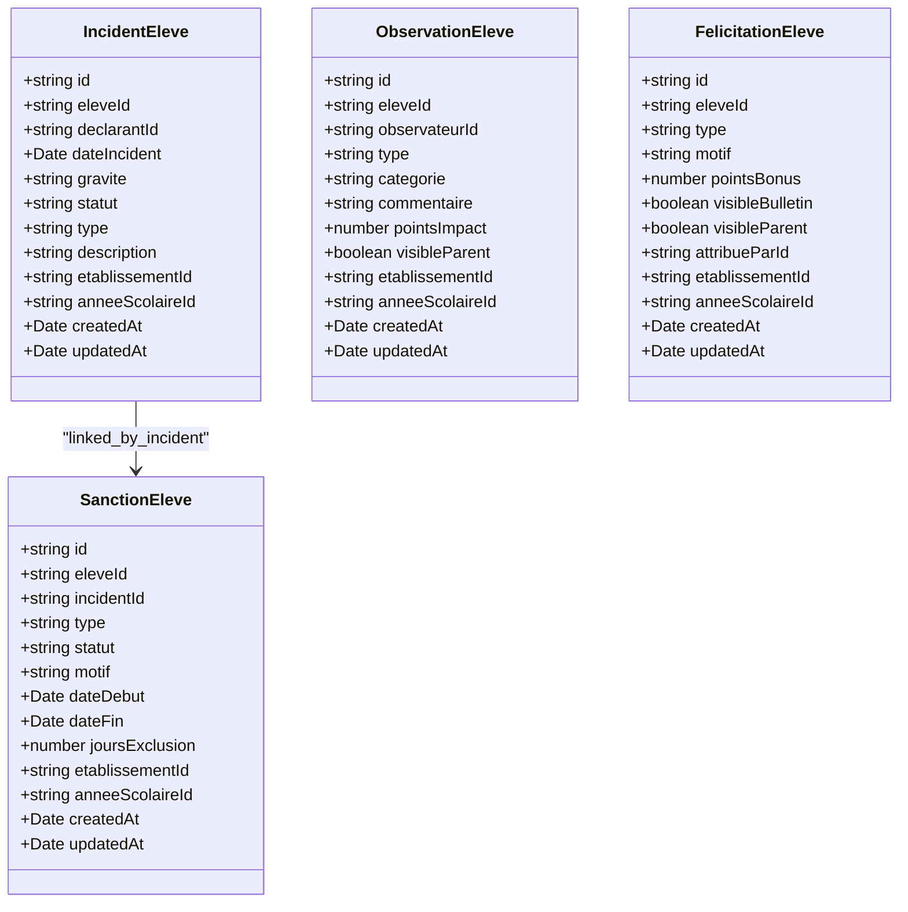

**Diagram sources**
- [incident-eleve.entity.ts:1-200](file://backend/src/modules/suivi-eleves/entities/incident-eleve.entity.ts#L1-L200)
- [observation-eleve.entity.ts:1-200](file://backend/src/modules/suivi-eleves/entities/observation-eleve.entity.ts#L1-L200)
- [sanction-eleve.entity.ts:1-200](file://backend/src/modules/suivi-eleves/entities/sanction-eleve.entity.ts#L1-L200)
- [felicitation-eleve.entity.ts:1-200](file://backend/src/modules/suivi-eleves/entities/felicitation-eleve.entity.ts#L1-L200)

**Section sources**
- [030-suivi-eleves.sql:13-112](file://backend/database/migrations/030-suivi-eleves.sql#L13-L112)
- [034-annee-scolaire-suivi.sql:406-428](file://backend/database/migrations/034-annee-scolaire-suivi.sql#L406-L428)
- [suivi-eleve.service.ts:44-86](file://backend/src/modules/suivi-eleves/services/suivi-eleve.service.ts#L44-L86)
- [suivi-eleve.service.ts:131-187](file://backend/src/modules/suivi-eleves/services/suivi-eleve.service.ts#L131-L187)
- [suivi-eleve.service.ts:190-200](file://backend/src/modules/suivi-eleves/services/suivi-eleve.service.ts#L190-L200)

## System Monitoring and Maintenance
**New Section**: Comprehensive system monitoring capabilities for operational oversight and maintenance management.

### Health Check System
- **Endpoint**: GET `/monitoring/health` - Public health status endpoint
- **Status Levels**: ok, degraded, down with detailed component status
- **Checks**: Database connectivity, memory availability, uptime verification
- **Response**: Structured JSON with status and component details

### System Metrics Collection
- **CPU Metrics**: Core count, model, load averages
- **Memory Metrics**: Total, used, free, heap usage, external memory
- **Database Status**: Connection state, driver information
- **Application Info**: Version, Node.js version, environment, process ID

### Application Statistics
- **User Analytics**: Total users, active users, role distribution
- **Request Monitoring**: Pending requests, total request count
- **Module Tracking**: Active modules, total modules
- **Real-time Data**: Live statistics for operational insights

### Maintenance Mode Management
- **Endpoints**: GET/POST `/monitoring/maintenance` - Maintenance mode control
- **Configuration**: Uses `system.maintenance_mode` parameter for persistence
- **Access Control**: Super admin only operations
- **Logging**: Comprehensive audit trail for maintenance activities

### Log Management
- **Endpoint**: GET `/monitoring/logs` - Recent system logs
- **Pagination**: Configurable limit with min/max bounds (1-1000)
- **Future Enhancement**: File-based or database-backed log storage
- **Security**: Admin-only access with proper authentication

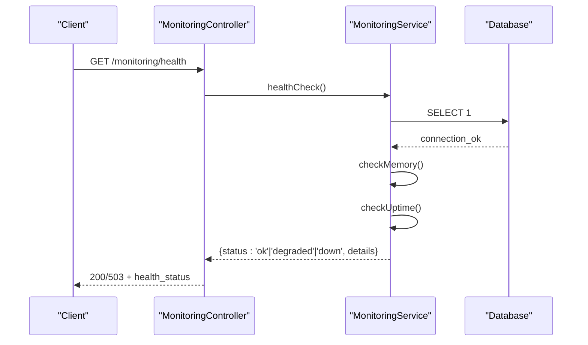

**Diagram sources**
- [monitoring.controller.ts:17-26](file://backend/src/modules/monitoring/controllers/monitoring.controller.ts#L17-L26)
- [monitoring.service.ts:169-199](file://backend/src/modules/monitoring/services/monitoring.service.ts#L169-L199)

**Section sources**
- [monitoring.controller.ts:17-68](file://backend/src/modules/monitoring/controllers/monitoring.controller.ts#L17-L68)
- [monitoring.service.ts:17-223](file://backend/src/modules/monitoring/services/monitoring.service.ts#L17-L223)
- [monitoring.dto.ts:14-29](file://backend/src/modules/monitoring/dto/monitoring.dto.ts#L14-L29)

## Configuration Parameters
The bulletin generation system now supports six runtime configuration parameters that control various aspects of report generation:

### Bulletins Module Configuration Parameters

| Parameter | Type | Default | Description |
|-----------|------|---------|-------------|
| `bulletins.include_ranking` | Boolean | `true` | Include ranking/rank in generated bulletins |
| `bulletins.validation_threshold` | Number | `10` | Minimum passing grade threshold (out of 20) |
| `bulletins.calculation_method` | String | `'ponderee'` | `'arithmetique'` or `'ponderee'` for average calculation |
| `bulletins.display_coefficients` | Boolean | `true` | Show subject coefficients on bulletins |
| `bulletins.show_appreciations` | Boolean | `true` | Include class council appreciation |
| `bulletins.template_id` | String | `'default'` | PDF template identifier for bulletin generation |

### Student Monitoring Configuration Parameters
**New**: Configuration parameters for the student monitoring system:

| Parameter | Type | Default | Description |
|-----------|------|---------|-------------|
| `suivi-eleves.sanction.require_validation` | Boolean | `false` | Require validation workflow for serious sanctions |
| `suivi-eleves.sanction.validation_levels` | Number | `2` | Number of approval levels for validation workflow |
| `suivi-eleves.gamification.enabled` | Boolean | `true` | Enable gamification points for honors |
| `suivi-eleves.parent_visibility.default` | Boolean | `false` | Default parent visibility for observations |

### System Configuration Parameters
**New**: System-wide configuration parameters:

| Parameter | Type | Default | Description |
|-----------|------|---------|-------------|
| `system.maintenance_mode` | Boolean | `false` | Enable/disable system maintenance mode |
| `system.monitoring.enabled` | Boolean | `true` | Enable/disable system monitoring endpoints |
| `system.log_level` | String | `'info'` | Logging verbosity level |

### Configuration Implementation Details

The configuration system uses a centralized approach with:
- **Runtime Caching**: Quick cache with 60-second TTL for frequent parameter access
- **Type Safety**: Strong typing with automatic conversion for different parameter types
- **Validation**: Built-in validation for numeric ranges and format constraints
- **Module Organization**: Parameters organized by module (bulletins, eleves, etablissement, systeme)

**Section sources**
- [config.helper.ts:15-54](file://backend/src/modules/configuration/utils/config.helper.ts#L15-L54)
- [005-advanced-config-params.ts:21-97](file://backend/src/database/migrations/005-advanced-config-params.ts#L21-L97)
- [005-complete-config-params-100.ts:52-129](file://backend/src/database/migrations/005-complete-config-params-100.ts#L52-L129)

## Dependency Analysis
This section maps dependencies among entities and services to clarify coupling and cohesion.

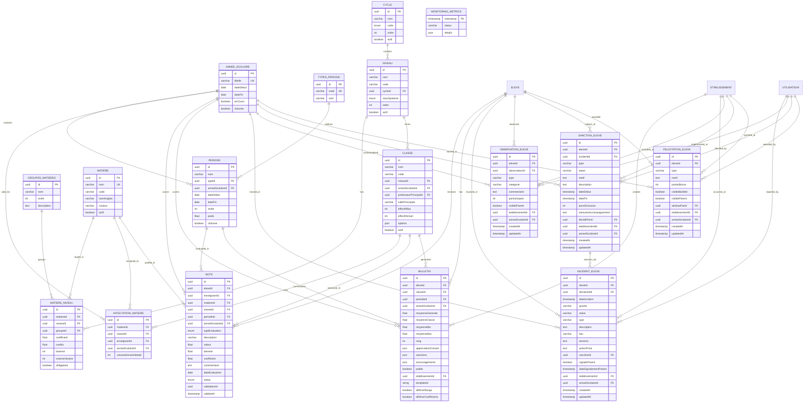

**Diagram sources**
- [annee-scolaire.entity.ts:15-40](file://backend/src/modules/annees-scolaires/entities/annee-scolaire.entity.ts#L15-L40)
- [periode.entity.ts:19-78](file://backend/src/modules/periodes/entities/periode.entity.ts#L19-L78)
- [cycle.entity.ts:17-39](file://backend/src/modules/cycles/entities/cycle.entity.ts#L17-L39)
- [niveau.entity.ts:20-53](file://backend/src/modules/niveaux/entities/niveau.entity.ts#L20-L53)
- [matiere.entity.ts:18-61](file://backend/src/modules/matieres/entities/matiere.entity.ts#L18-L61)
- [matiere-niveau.entity.ts:20-70](file://backend/src/modules/matieres/entities/matiere-niveau.entity.ts#L20-L70)
- [classe.entity.ts:21-75](file://backend/src/modules/classes/entities/classe.entity.ts#L21-L75)
- [affectation-matiere.entity.ts:22-65](file://backend/src/modules/matieres/entities/affectation-matiere.entity.ts#L22-L65)
- [note.entity.ts:45-141](file://backend/src/modules/notes/entities/note.entity.ts#L45-L141)
- [bulletin.entity.ts:23-92](file://backend/src/modules/bulletins/entities/bulletin.entity.ts#L23-L92)
- [incident-eleve.entity.ts:1-200](file://backend/src/modules/suivi-eleves/entities/incident-eleve.entity.ts#L1-L200)
- [observation-eleve.entity.ts:1-200](file://backend/src/modules/suivi-eleves/entities/observation-eleve.entity.ts#L1-L200)
- [sanction-eleve.entity.ts:1-200](file://backend/src/modules/suivi-eleves/entities/sanction-eleve.entity.ts#L1-L200)
- [felicitation-eleve.entity.ts:1-200](file://backend/src/modules/suivi-eleves/entities/felicitation-eleve.entity.ts#L1-L200)

**Section sources**
- [annee-scolaire.entity.ts:15-40](file://backend/src/modules/annees-scolaires/entities/annee-scolaire.entity.ts#L15-L40)
- [periode.entity.ts:19-78](file://backend/src/modules/periodes/entities/periode.entity.ts#L19-L78)
- [cycle.entity.ts:17-39](file://backend/src/modules/cycles/entities/cycle.entity.ts#L17-L39)
- [niveau.entity.ts:20-53](file://backend/src/modules/niveaux/entities/niveau.entity.ts#L20-L53)
- [matiere.entity.ts:18-61](file://backend/src/modules/matieres/entities/matiere.entity.ts#L18-L61)
- [matiere-niveau.entity.ts:20-70](file://backend/src/modules/matieres/entities/matiere-niveau.entity.ts#L20-L70)
- [classe.entity.ts:21-75](file://backend/src/modules/classes/entities/classe.entity.ts#L21-L75)
- [affectation-matiere.entity.ts:22-65](file://backend/src/modules/matieres/entities/affectation-matiere.entity.ts#L22-L65)
- [note.entity.ts:45-141](file://backend/src/modules/notes/entities/note.entity.ts#L45-L141)
- [bulletin.entity.ts:23-92](file://backend/src/modules/bulletins/entities/bulletin.entity.ts#L23-L92)

## Performance Considerations
- Indexing
  - Entities use database indexes on frequently queried columns (e.g., niveauId, anneeScolaireId, matiereId, periodeId) to optimize joins and filters.
  - **Enhanced**: New monitoring entities include academic year and establishment indexes for improved query performance.
- Normalized Scores
  - Grade normalization to a standard scale reduces computation overhead during report generation.
- Batch Operations
  - Bulk grade creation endpoints minimize round trips for teacher input.
- Logging and Auditing
  - Services log significant operations to aid debugging and monitoring.
- **Enhanced**: Configuration Parameter Caching
  - Quick cache with 60-second TTL for frequently accessed configuration parameters reduces database load.
  - Automatic type conversion and validation improve performance and reliability.
- **Enhanced**: Pagination Implementation
  - All monitoring queries now support pagination with take/skip for better performance on large datasets.
- **Enhanced**: Database Optimization
  - New indexes on monitoring entities (eleve_id, anneeScolaireId, etablissement_id) improve query performance for year-based filtering.

[No sources needed since this section provides general guidance]

## Troubleshooting Guide
- Validation Errors
  - Controllers validate incoming DTOs and return structured errors with a validation error code.
- Not Found Errors
  - Services throw not found errors when requested entities are missing.
- Active Year Constraints
  - Deleting the active academic year is prevented by the service.
  - Activating a year automatically deactivates others.
- **Enhanced**: Configuration Parameter Issues
  - Invalid parameter values are automatically validated and rejected with appropriate error messages.
  - Default values are used when configuration parameters are missing or invalid.
  - Cache invalidation ensures configuration changes take effect immediately.
- **Enhanced**: Monitoring System Issues
  - Health check failures indicate database connectivity or memory issues.
  - Maintenance mode prevents normal operations until disabled.
  - Validation workflow failures for sanctions are non-blocking but may delay processing.
- **Enhanced**: Student Monitoring Data Integrity
  - Academic year filtering ensures data isolation between school years.
  - Missing pagination in monitoring queries may cause performance issues.
  - Gamification point attribution requires proper configuration.

**Section sources**
- [annees-scolaires.controller.ts:17-23](file://backend/src/modules/annees-scolaires/controllers/annees-scolaires.controller.ts#L17-L23)
- [annees-scolaires.service.ts:47-48](file://backend/src/modules/annees-scolaires/services/annees-scolaires.service.ts#L47-L48)
- [annees-scolaires.service.ts:71-74](file://backend/src/modules/annees-scolaires/services/annees-scolaires.service.ts#L71-L74)
- [config.helper.ts:15-54](file://backend/src/modules/configuration/utils/config.helper.ts#L15-L54)
- [monitoring.service.ts:169-199](file://backend/src/modules/monitoring/services/monitoring.service.ts#L169-L199)
- [suivi-eleve.service.ts:70-86](file://backend/src/modules/suivi-eleves/services/suivi-eleve.service.ts#L70-L86)

## Conclusion
The academic modules provide a cohesive, layered architecture for managing academic years, curriculum structure, subjects and programs, classes, academic periods, grades, and reports. The enhanced bulletin generation system now offers extensive customization through six runtime configuration parameters, enabling institutions to tailor grade calculation methods, validation thresholds, ranking inclusion, coefficient display, and template selection according to their specific requirements.

**Major Enhancements**:
- **Comprehensive Student Monitoring**: Complete behavioral tracking system with incidents, observations, sanctions, and honors
- **Academic Year Context**: All monitoring entities now track academic year progression with pedagogical context
- **Validation Workflows**: Automated approval processes for serious disciplinary actions
- **Gamification Integration**: Point-based recognition system for academic achievements
- **System Monitoring**: Health checks, metrics collection, and maintenance capabilities
- **Enhanced Pagination**: Proper pagination support for monitoring queries
- **Performance Optimization**: Database indexing and caching improvements

The addition of the student monitoring system creates a holistic educational management platform that tracks not just academic performance but also behavioral development and character building. The integration with validation workflows ensures proper governance of serious disciplinary actions, while gamification encourages positive behavior and academic excellence. System monitoring capabilities provide operational insights and maintenance tools essential for production environments.

Clear entity relationships, robust services enforcing business rules, role-based controllers, and a centralized configuration system enable secure, scalable, and flexible educational administration. The design supports institutional configuration, standardized grading, efficient report generation, comprehensive student monitoring, and operational oversight aligned with the chosen subsystem while maintaining backward compatibility and extensibility.