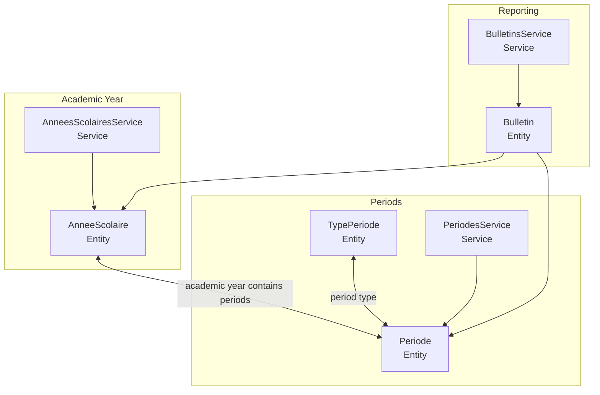
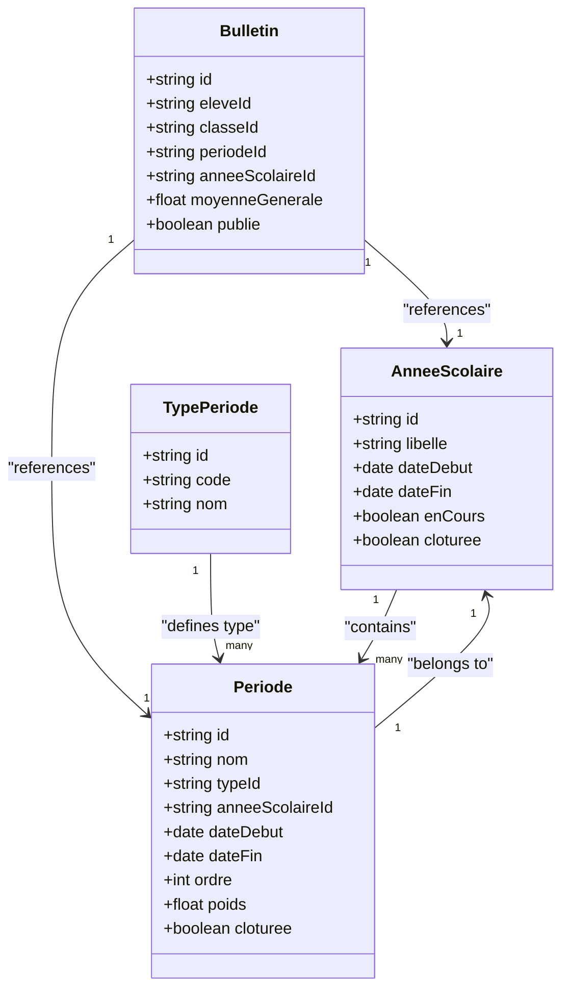
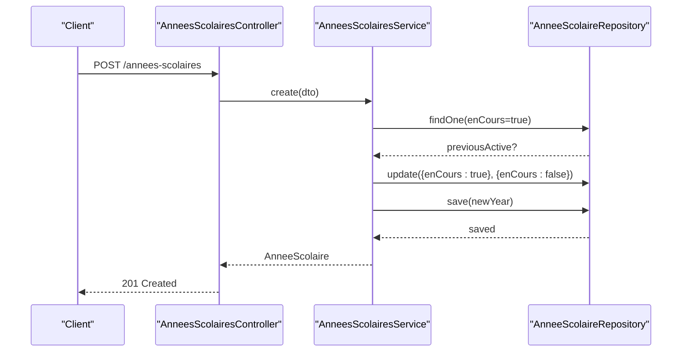
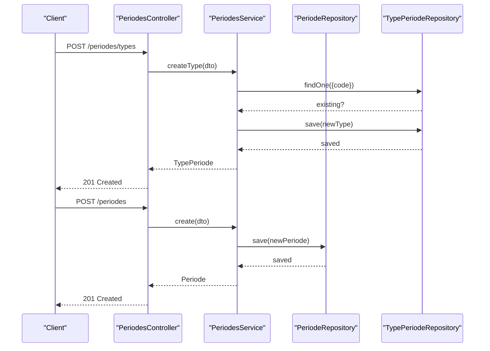
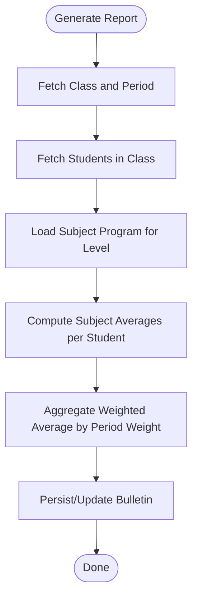
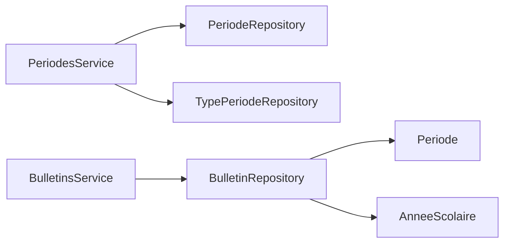

# Academic Periods & Scheduling

<cite>
**Referenced Files in This Document**
- [periode.entity.ts](file://backend/src/modules/periodes/entities/periode.entity.ts)
- [periodes.service.ts](file://backend/src/modules/periodes/services/periodes.service.ts)
- [periodes.controller.ts](file://backend/src/modules/periodes/controllers/periodes.controller.ts)
- [periodes.dto.ts](file://backend/src/modules/periodes/dto/periodes.dto.ts)
- [annee-scolaire.entity.ts](file://backend/src/modules/annees-scolaires/entities/annee-scolaire.entity.ts)
- [annees-scolaires.service.ts](file://backend/src/modules/annees-scolaires/services/annees-scolaires.service.ts)
- [annee-scolaire.dto.ts](file://backend/src/modules/annees-scolaires/dto/annee-scolaire.dto.ts)
- [bulletin.entity.ts](file://backend/src/modules/bulletins/entities/bulletin.entity.ts)
- [bulletins.service.ts](file://backend/src/modules/bulletins/services/bulletins.service.ts)
</cite>

## Table of Contents
1. [Introduction](#introduction)
2. [Project Structure](#project-structure)
3. [Core Components](#core-components)
4. [Architecture Overview](#architecture-overview)
5. [Detailed Component Analysis](#detailed-component-analysis)
6. [Dependency Analysis](#dependency-analysis)
7. [Performance Considerations](#performance-considerations)
8. [Troubleshooting Guide](#troubleshooting-guide)
9. [Conclusion](#conclusion)
10. [Appendices](#appendices)

## Introduction
This document describes the academic periods and scheduling system, focusing on how academic years define the overarching timeframe and how periods (such as trimesters, semesters, and custom terms) are structured within those years. It documents the period entity model, the relationship with academic years, and how scheduling integrates with assessment and reporting cycles. It also outlines the service layer for period management, date validation, and closure controls, and provides practical examples for defining academic periods, handling overlaps, and transitioning between periods. Finally, it explains how different academic calendar systems can be accommodated and how holidays can be integrated conceptually.

## Project Structure
The scheduling system spans three main areas:
- Academic year management: defines the school year boundaries and current status.
- Period management: defines period types and individual periods within a year, including ordering and weighting.
- Reporting linkage: connects periods to report generation (bulletins), ensuring assessments align with the appropriate period.

**Diagram sources**
- [annee-scolaire.entity.ts:15-40](file://backend/src/modules/annees-scolaires/entities/annee-scolaire.entity.ts#L15-L40)
- [annees-scolaires.service.ts:14-79](file://backend/src/modules/annees-scolaires/services/annees-scolaires.service.ts#L14-L79)
- [periode.entity.ts:19-78](file://backend/src/modules/periodes/entities/periode.entity.ts#L19-L78)
- [periodes.service.ts:14-82](file://backend/src/modules/periodes/services/periodes.service.ts#L14-L82)
- [bulletin.entity.ts:23-92](file://backend/src/modules/bulletins/entities/bulletin.entity.ts#L23-L92)
- [bulletins.service.ts:19-120](file://backend/src/modules/bulletins/services/bulletins.service.ts#L19-L120)

**Section sources**
- [annee-scolaire.entity.ts:15-40](file://backend/src/modules/annees-scolaires/entities/annee-scolaire.entity.ts#L15-L40)
- [annees-scolaires.service.ts:14-79](file://backend/src/modules/annees-scolaires/services/annees-scolaires.service.ts#L14-L79)
- [periode.entity.ts:19-78](file://backend/src/modules/periodes/entities/periode.entity.ts#L19-L78)
- [periodes.service.ts:14-82](file://backend/src/modules/periodes/services/periodes.service.ts#L14-L82)
- [bulletin.entity.ts:23-92](file://backend/src/modules/bulletins/entities/bulletin.entity.ts#L23-L92)
- [bulletins.service.ts:19-120](file://backend/src/modules/bulletins/services/bulletins.service.ts#L19-L120)

## Core Components
- Academic Year (AnneeScolaire)
  - Defines the school year label, start/end dates, current status, and closure flag.
  - Ensures only one active year at a time and prevents deletion of active years.
- Period Types (TypePeriode)
  - Defines canonical period types (e.g., trimesters, semesters, sequences, terms) with unique codes and display names.
- Periods (Periode)
  - Represents a specific period instance within an academic year, with start/end dates, ordering, weighting, and closure flag.
  - Links to both the academic year and the period type.
- Reporting (Bulletin)
  - Associates reports with a specific period and academic year, enabling grade aggregation per period.

Key operational capabilities:
- Create/update/delete academic years and periods with validation.
- Enforce closure semantics: closed periods cannot be deleted; closed years cannot be deleted.
- Order periods consistently using ordinal and weight attributes for annual calculations.

**Section sources**
- [annee-scolaire.entity.ts:15-40](file://backend/src/modules/annees-scolaires/entities/annee-scolaire.entity.ts#L15-L40)
- [annees-scolaires.service.ts:14-79](file://backend/src/modules/annees-scolaires/services/annees-scolaires.service.ts#L14-L79)
- [periode.entity.ts:19-78](file://backend/src/modules/periodes/entities/periode.entity.ts#L19-L78)
- [periodes.service.ts:14-82](file://backend/src/modules/periodes/services/periodes.service.ts#L14-L82)
- [bulletin.entity.ts:23-92](file://backend/src/modules/bulletins/entities/bulletin.entity.ts#L23-L92)
- [bulletins.service.ts:19-120](file://backend/src/modules/bulletins/services/bulletins.service.ts#L19-L120)

## Architecture Overview
The system follows a layered architecture:
- Entities define domain models and relationships.
- Services encapsulate business logic for creation, updates, validations, and constraints.
- Controllers expose REST endpoints with middleware for authentication and authorization.
- DTOs and Zod schemas validate inputs and enforce constraints.

**Diagram sources**
- [annee-scolaire.entity.ts:15-40](file://backend/src/modules/annees-scolaires/entities/annee-scolaire.entity.ts#L15-L40)
- [periode.entity.ts:19-78](file://backend/src/modules/periodes/entities/periode.entity.ts#L19-L78)
- [bulletin.entity.ts:23-92](file://backend/src/modules/bulletins/entities/bulletin.entity.ts#L23-L92)

## Detailed Component Analysis

### Academic Year Management
- Responsibilities
  - Create academic years with enforced uniqueness of the label and optional activation.
  - Deactivate other active years when a new year is marked as active.
  - Retrieve all years ordered by start date, find the active year, and update properties including closure.
  - Prevent deletion of active years.
- Validation and Constraints
  - Uses Zod schemas to validate creation and updates.
  - Maintains single active year invariant.
- Operational Notes
  - Closure flag allows marking a year as closed for archival or policy reasons.

**Diagram sources**
- [annees-scolaires.service.ts:21-35](file://backend/src/modules/annees-scolaires/services/annees-scolaires.service.ts#L21-L35)

**Section sources**
- [annees-scolaires.service.ts:14-79](file://backend/src/modules/annees-scolaires/services/annees-scolaires.service.ts#L14-L79)
- [annee-scolaire.dto.ts:9-18](file://backend/src/modules/annees-scolaires/dto/annee-scolaire.dto.ts#L9-L18)
- [annee-scolaire.entity.ts:15-40](file://backend/src/modules/annees-scolaires/entities/annee-scolaire.entity.ts#L15-L40)

### Period Types and Period Instances
- Responsibilities
  - Manage canonical period types (e.g., trimester, semester, sequence, term) with unique codes.
  - Create, list, update, and delete periods within an academic year.
  - Enforce period closure semantics: closed periods cannot be deleted.
  - Order periods by start date and ordinal for consistent reporting.
- Validation and Constraints
  - Zod schemas validate inputs for period creation and updates, including date formats and numeric bounds.
  - Unique code constraint on period types prevents ambiguity.
- Operational Notes
  - Weighting supports weighted averages across periods for annual computations.
  - Ordinal ordering ensures predictable processing and display.

**Diagram sources**
- [periodes.controller.ts:25-39](file://backend/src/modules/periodes/controllers/periodes.controller.ts#L25-L39)
- [periodes.service.ts:25-47](file://backend/src/modules/periodes/services/periodes.service.ts#L25-L47)
- [periodes.dto.ts:9-26](file://backend/src/modules/periodes/dto/periodes.dto.ts#L9-L26)

**Section sources**
- [periode.entity.ts:19-78](file://backend/src/modules/periodes/entities/periode.entity.ts#L19-L78)
- [periodes.service.ts:14-82](file://backend/src/modules/periodes/services/periodes.service.ts#L14-L82)
- [periodes.controller.ts:17-76](file://backend/src/modules/periodes/controllers/periodes.controller.ts#L17-L76)
- [periodes.dto.ts:9-30](file://backend/src/modules/periodes/dto/periodes.dto.ts#L9-L30)

### Scheduling Logic for Assessments and Reporting Cycles
- Relationship to Reporting
  - Bulletins are generated per student/class/period, linking to a specific period and academic year.
  - This ensures assessments and grades are aligned with the intended reporting cycle.
- Annual Aggregation
  - Period weights enable weighted averages across multiple periods for annual grades.
- Ordering and Consistency
  - Periods are ordered by start date and ordinal, supporting predictable report generation and ranking.

**Diagram sources**
- [bulletins.service.ts:26-101](file://backend/src/modules/bulletins/services/bulletins.service.ts#L26-L101)
- [bulletin.entity.ts:23-92](file://backend/src/modules/bulletins/entities/bulletin.entity.ts#L23-L92)

**Section sources**
- [bulletins.service.ts:19-120](file://backend/src/modules/bulletins/services/bulletins.service.ts#L19-L120)
- [bulletin.entity.ts:23-92](file://backend/src/modules/bulletins/entities/bulletin.entity.ts#L23-L92)

### Examples and Use Cases

- Define Academic Period Types
  - Create canonical types such as trimester, semester, sequence, and term using the types endpoint.
  - Ensure unique codes to avoid ambiguity in period definitions.

- Define Academic Periods Within a Year
  - Create periods with meaningful names, associate them with a type and an academic year, set start/end dates, and assign order and weight.
  - Use the listing endpoint filtered by academic year to review and reorder periods.

- Managing Overlapping Schedules
  - The current model does not enforce non-overlapping constraints at the service level. To prevent overlaps:
    - Add a pre-save validation that checks for date intersections within the same academic year and type.
    - Optionally introduce a “conflict” flag or raise a validation error when overlaps are detected.

- Handling Period Transitions
  - Close a period by setting the closure flag when assessments and reporting are finalized.
  - Prevent deletion of closed periods to maintain historical integrity.
  - Transition to the next period by activating the subsequent period in the academic year.

- Academic Calendar Systems and Holidays
  - The current model focuses on date ranges and closure flags. To integrate diverse calendar systems:
    - Store calendar metadata at the academic year level (e.g., calendar type, default holidays).
    - Extend the period entity to optionally reference calendar-specific attributes (e.g., holiday IDs).
    - Provide utilities to compute effective teaching days and adjust reporting windows accordingly.

[No sources needed since this subsection provides general guidance]

## Dependency Analysis
- Cohesion and Coupling
  - PeriodesService depends on TypePeriode and Periode repositories; it encapsulates validation and business rules.
  - BulletinsService depends on Periode and Academic Year entities indirectly via relations stored in the Bulletin entity, ensuring reports are bound to the correct period/year.
- External Dependencies
  - TypeORM for persistence and relations.
  - Zod for runtime validation.
- Potential Circular Dependencies
  - None observed among the analyzed modules; entities are referenced but not imported in a circular manner.

**Diagram sources**
- [periodes.service.ts:14-21](file://backend/src/modules/periodes/services/periodes.service.ts#L14-L21)
- [bulletins.service.ts:19-24](file://backend/src/modules/bulletins/services/bulletins.service.ts#L19-L24)

**Section sources**
- [periodes.service.ts:14-82](file://backend/src/modules/periodes/services/periodes.service.ts#L14-L82)
- [bulletins.service.ts:19-120](file://backend/src/modules/bulletins/services/bulletins.service.ts#L19-L120)

## Performance Considerations
- Indexing
  - Periode and PeriodeType entities use composite indexes on academic year and type identifiers, improving lookup performance for period queries.
- Query Patterns
  - Listing periods by academic year with ordering by start date and ordinal is efficient with proper indexing.
- Reporting
  - Generating reports per period and class involves iterating students and subjects; caching subject programs and minimizing repeated queries can improve throughput.

[No sources needed since this section provides general guidance]

## Troubleshooting Guide
- Common Errors and Resolutions
  - Duplicate period type code: Ensure unique codes when creating types.
  - Attempt to delete a closed period: Set the closure flag appropriately and avoid deletion of closed periods.
  - Attempt to delete an active academic year: Activate another year before deleting the active one.
  - Validation failures: Verify date formats and numeric constraints match the Zod schemas.
- Logging and Auditing
  - Service methods log creation and deletion events for traceability.

**Section sources**
- [periodes.service.ts:25-31](file://backend/src/modules/periodes/services/periodes.service.ts#L25-L31)
- [periodes.service.ts:74-79](file://backend/src/modules/periodes/services/periodes.service.ts#L74-L79)
- [annees-scolaires.service.ts:69-76](file://backend/src/modules/annees-scolaires/services/annees-scolaires.service.ts#L69-L76)
- [periodes.dto.ts:9-30](file://backend/src/modules/periodes/dto/periodes.dto.ts#L9-L30)
- [annee-scolaire.dto.ts:9-18](file://backend/src/modules/annees-scolaires/dto/annee-scolaire.dto.ts#L9-L18)

## Conclusion
The academic periods and scheduling system provides a robust foundation for organizing assessment and reporting cycles around academic years. By modeling period types and instances with clear ordering and weighting, and by linking reports to specific periods, the system supports accurate grading and annual computation. Extending the model to enforce non-overlapping periods, integrate calendar systems, and manage holidays would further strengthen its applicability across diverse educational contexts.

## Appendices

### API Endpoints Summary
- Academic Years
  - GET /annees-scolaires: List academic years.
  - GET /annees-scolaires/active: Get the active academic year.
  - POST /annees-scolaires: Create an academic year (optionally activate).
  - PATCH /annees-scolaires/:id: Update an academic year (including closure).
  - DELETE /annees-scolaires/:id: Delete an academic year (not active).
- Period Types
  - GET /periodes/types: List period types.
  - POST /periodes/types: Create a period type (unique code).
- Periods
  - GET /periodes?anneeId=:id: List periods for an academic year.
  - POST /periodes: Create a period within an academic year.
  - PATCH /periodes/:id: Update a period (including closure).
  - DELETE /periodes/:id: Delete a period (not closed).

**Section sources**
- [annees-scolaires.service.ts:37-67](file://backend/src/modules/annees-scolaires/services/annees-scolaires.service.ts#L37-L67)
- [periodes.controller.ts:25-76](file://backend/src/modules/periodes/controllers/periodes.controller.ts#L25-L76)