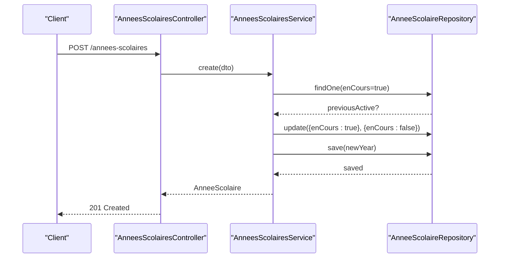
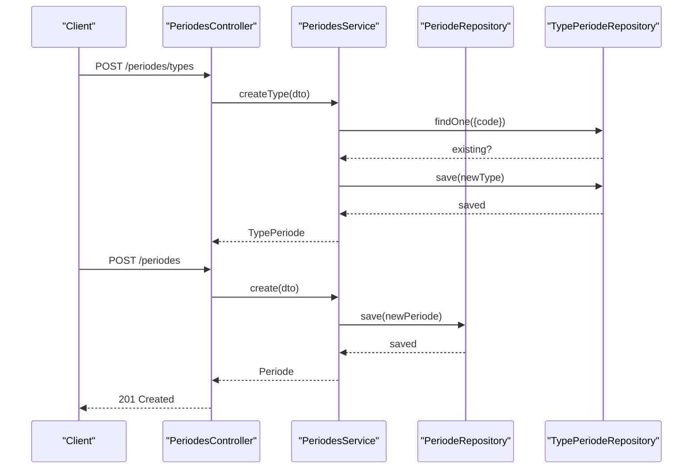
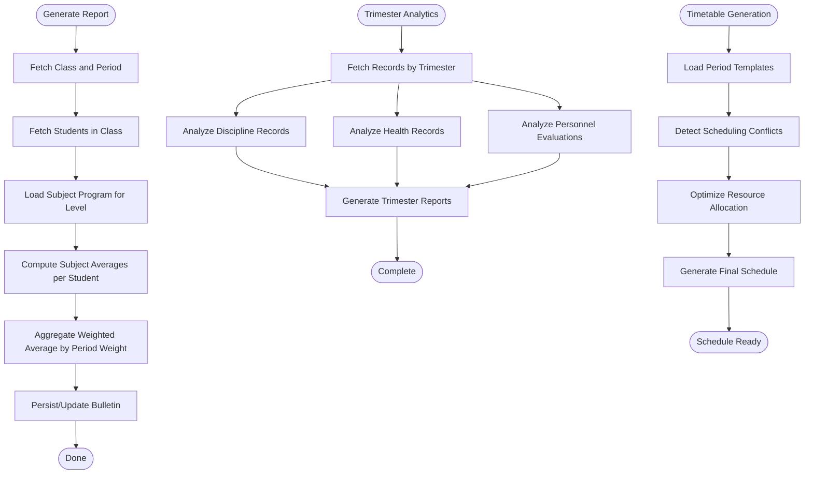
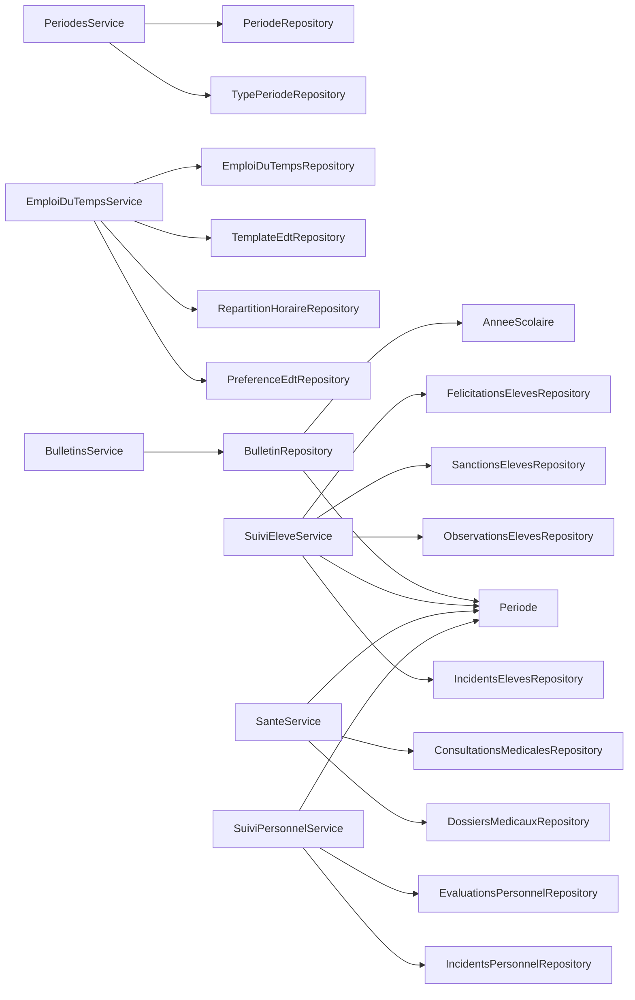

# Academic Periods & Scheduling

<cite>
**Referenced Files in This Document**
- [periode.entity.ts](file://backend/src/modules/periodes/entities/periode.entity.ts)
- [periodes.service.ts](file://backend/src/modules/periodes/services/periodes.service.ts)
- [periodes.controller.ts](file://backend/src/modules/periodes/controllers/periodes.controller.ts)
- [periodes.dto.ts](file://backend/src/modules/periodes/dto/periodes.dto.ts)
- [emploi-du-temps.entity.ts](file://backend/src/modules/emploi-du-temps/entities/emploi-du-temps.entity.ts)
- [emploi-du-temps.service.ts](file://backend/src/modules/emploi-du-temps/services/emploi-du-temps.service.ts)
- [emploi-du-temps.controller.ts](file://backend/src/modules/emploi-du-temps/controllers/emploi-du-temps.controller.ts)
- [emploi-du-temps.dto.ts](file://backend/src/modules/emploi-du-temps/dto/emploi-du-temps.dto.ts)
- [template-emploi-du-temps.entity.ts](file://backend/src/modules/emploi-du-temps/entities/template-emploi-du-temps.entity.ts)
- [repartition-horaire.entity.ts](file://backend/src/modules/emploi-du-temps/entities/repartition-horaire.entity.ts)
- [preference-emploi-du-temps.entity.ts](file://backend/src/modules/emploi-du-temps/entities/preference-emploi-du-temps.entity.ts)
- [annee-scolaire.entity.ts](file://backend/src/modules/annees-scolaires/entities/annee-scolaire.entity.ts)
- [annees-scolaires.service.ts](file://backend/src/modules/annees-scolaires/services/annees-scolaires.service.ts)
- [annee-scolaire.dto.ts](file://backend/src/modules/annees-scolaires/dto/annee-scolaire.dto.ts)
- [bulletin.entity.ts](file://backend/src/modules/bulletins/entities/bulletin.entity.ts)
- [bulletins.service.ts](file://backend/src/modules/bulletins/services/bulletins.service.ts)
- [suivi-eleve.service.ts](file://backend/src/modules/suivi-eleves/services/suivi-eleve.service.ts)
- [sante.service.ts](file://backend/src/modules/sante/services/sante.service.ts)
- [consultation-medicale.entity.ts](file://backend/src/modules/sante/entities/consultation-medicale.entity.ts)
- [incident-personnel.entity.ts](file://backend/src/modules/suivi-personnel/entities/incident-personnel.entity.ts)
- [evaluation-personnel.entity.ts](file://backend/src/modules/suivi-personnel/entities/evaluation-personnel.entity.ts)
- [dossier-medical.entity.ts](file://backend/src/modules/sante/entities/dossier-medical.entity.ts)
- [sanction-eleve.entity.ts](file://backend/src/modules/suivi-eleves/entities/sanction-eleve.entity.ts)
- [incident-eleve.entity.ts](file://backend/src/modules/suivi-eleves/entities/incident-eleve.entity.ts)
- [observation-eleve.entity.ts](file://backend/src/modules/suivi-eleves/entities/observation-eleve.entity.ts)
- [034-annee-scolaire-suivi.sql](file://backend/database/migrations/034-annee-scolaire-suivi.sql)
- [032-sante.sql](file://backend/database/migrations/032-sante.sql)
- [030-suivi-eleves.sql](file://backend/database/migrations/030-suivi-eleves.sql)
- [063-creer-module-emploi-du-temps.sql](file://backend/database/migrations/063-creer-module-emploi-du-temps.sql)
- [065-creer-templates-emploi-du-temps.sql](file://backend/database/migrations/065-creer-templates-emploi-du-temps.sql)
</cite>

## Update Summary
**Changes Made**
- Added comprehensive timetable integration with academic periods through the new Emploi du Temps module
- Enhanced scheduling capabilities with automatic timetable generation algorithms
- Integrated period-based reporting with improved academic calendar coordination
- Added new timetable entities, services, and controllers for comprehensive schedule management
- Updated architecture to support trimester-based scheduling with enhanced conflict detection
- Expanded reporting system to include timetable-based analytics and resource utilization tracking

## Table of Contents
1. [Introduction](#introduction)
2. [Project Structure](#project-structure)
3. [Core Components](#core-components)
4. [Architecture Overview](#architecture-overview)
5. [Detailed Component Analysis](#detailed-component-analysis)
6. [Timetable Integration System](#timetable-integration-system)
7. [African Context Adaptations](#african-context-adaptations)
8. [Trimester-Based Reporting System](#trimester-based-reporting-system)
9. [Enhanced Scheduling Capabilities](#enhanced-scheduling-capabilities)
10. [Dependency Analysis](#dependency-analysis)
11. [Performance Considerations](#performance-considerations)
12. [Troubleshooting Guide](#troubleshooting-guide)
13. [Conclusion](#conclusion)
14. [Appendices](#appendices)

## Introduction
This document describes the academic periods and scheduling system, focusing on how academic years define the overarching timeframe and how periods (such as trimesters, semesters, and custom terms) are structured within those years. The system has been significantly enhanced with the new Emploi du Temps module, which provides comprehensive timetable integration with academic periods, automated scheduling algorithms, and improved period-based reporting capabilities. The system now supports trimester-based reporting across student discipline records, health documentation, personnel evaluations, and advanced scheduling with conflict detection and resource optimization.

## Project Structure
The scheduling system now encompasses four main areas with enhanced timetable integration and African context support:
- Academic year management: defines the school year boundaries and current status
- Period management: defines period types and individual periods within a year, including ordering and weighting
- Timetable management: comprehensive schedule creation, conflict detection, and resource allocation
- Reporting linkage: connects periods to report generation (bulletins) and specialized record keeping (discipline, health, personnel)
- Trimester-based reporting: enables period-specific filtering and reporting across multiple domains with scheduling integration

```mermaid
graph TB
subgraph "Academic Year"
AS["AnneeScolaire<br/>Entity"]
ASS["AnneesScolairesService<br/>Service"]
end
subgraph "Periods"
TP["TypePeriode<br/>Entity"]
P["Periode<br/>Entity"]
PS["PeriodesService<br/>Service"]
end
subgraph "Timetable System"
EDT["EmploiDuTemps<br/>Entity"]
TE["TemplateEdt<br/>Entity"]
RH["RepartitionHoraire<br/>Entity"]
PET["PreferenceEdt<br/>Entity"]
EDTS["EmploiDuTempsService<br/>Service"]
EDTC["EmploiDuTempsController<br/>Controller"]
end
subgraph "Reporting"
B["Bulletin<br/>Entity"]
BS["BulletinsService<br/>Service"]
end
subgraph "Student Discipline"
IE["IncidentsEleves<br/>Entity"]
OE["ObservationsEleves<br/>Entity"]
SE["SanctionsEleves<br/>Entity"]
FE["FelicitationsEleves<br/>Entity"]
SES["SuiviEleveService<br/>Service"]
end
subgraph "Health Records"
DM["DossiersMedicaux<br/>Entity"]
CM["ConsultationsMedicales<br/>Entity"]
SS["SanteService<br/>Service"]
end
subgraph "Personnel Evaluations"
IP["IncidentsPersonnel<br/>Entity"]
EP["EvaluationsPersonnel<br/>Entity"]
SPS["SuiviPersonnelService<br/>Service"]
end
AS <-- "academic year contains periods" --> P
TP <-- "period type" --> P
PS --> P
ASS --> AS
EDT --> P
TE --> P
RH --> P
PET --> P
EDTS --> P
EDTC --> P
BS --> B
B --> P
IE --> P
OE --> P
SE --> P
FE --> P
DM --> P
CM --> P
IP --> P
EP --> P
SES --> P
SS --> P
SPS --> P
```

**Diagram sources**
- [annee-scolaire.entity.ts:15-40](file://backend/src/modules/annees-scolaires/entities/annee-scolaire.entity.ts#L15-L40)
- [annees-scolaires.service.ts:14-79](file://backend/src/modules/annees-scolaires/services/annees-scolaires.service.ts#L14-L79)
- [periode.entity.ts:19-78](file://backend/src/modules/periodes/entities/periode.entity.ts#L19-L78)
- [periodes.service.ts:14-82](file://backend/src/modules/periodes/services/periodes.service.ts#L14-L82)
- [emploi-du-temps.entity.ts:1](file://backend/src/modules/emploi-du-temps/entities/emploi-du-temps.entity.ts#L1-L120)
- [template-emploi-du-temps.entity.ts:1](file://backend/src/modules/emploi-du-temps/entities/template-emploi-du-temps.entity.ts#L1-L80)
- [repartition-horaire.entity.ts:1](file://backend/src/modules/emploi-du-temps/entities/repartition-horaire.entity.ts#L1-L60)
- [preference-emploi-du-temps.entity.ts:1](file://backend/src/modules/emploi-du-temps/entities/preference-emploi-du-temps.entity.ts#L1-L50)
- [bulletin.entity.ts:23-92](file://backend/src/modules/bulletins/entities/bulletin.entity.ts#L23-L92)
- [bulletins.service.ts:19-120](file://backend/src/modules/bulletins/services/bulletins.service.ts#L19-L120)
- [suivi-eleve.service.ts:274-322](file://backend/src/modules/suivi-eleves/services/suivi-eleve.service.ts#L274-L322)
- [sante.service.ts:158-173](file://backend/src/modules/sante/services/sante.service.ts#L158-L173)
- [incident-personnel.entity.ts:1](file://backend/src/modules/suivi-personnel/entities/incident-personnel.entity.ts#L1-L50)
- [evaluation-personnel.entity.ts:1](file://backend/src/modules/suivi-personnel/entities/evaluation-personnel.entity.ts#L1-L80)
- [dossier-medical.entity.ts:1](file://backend/src/modules/sante/entities/dossier-medical.entity.ts#L1-L60)
- [consultation-medicale.entity.ts:40-58](file://backend/src/modules/sante/entities/consultation-medicale.entity.ts#L40-L58)

**Section sources**
- [annee-scolaire.entity.ts:15-40](file://backend/src/modules/annees-scolaires/entities/annee-scolaire.entity.ts#L15-L40)
- [annees-scolaires.service.ts:14-79](file://backend/src/modules/annees-scolaires/services/annees-scolaires.service.ts#L14-L79)
- [periode.entity.ts:19-78](file://backend/src/modules/periodes/entities/periode.entity.ts#L19-L78)
- [periodes.service.ts:14-82](file://backend/src/modules/periodes/services/periodes.service.ts#L14-L82)
- [emploi-du-temps.entity.ts:1](file://backend/src/modules/emploi-du-temps/entities/emploi-du-temps.entity.ts#L1-L120)
- [template-emploi-du-temps.entity.ts:1](file://backend/src/modules/emploi-du-temps/entities/template-emploi-du-temps.entity.ts#L1-L80)
- [repartition-horaire.entity.ts:1](file://backend/src/modules/emploi-du-temps/entities/repartition-horaire.entity.ts#L1-L60)
- [preference-emploi-du-temps.entity.ts:1](file://backend/src/modules/emploi-du-temps/entities/preference-emploi-du-temps.entity.ts#L1-L50)
- [bulletin.entity.ts:23-92](file://backend/src/modules/bulletins/entities/bulletin.entity.ts#L23-L92)
- [bulletins.service.ts:19-120](file://backend/src/modules/bulletins/services/bulletins.service.ts#L19-L120)

## Core Components
- Academic Year (AnneeScolaire)
  - Defines the school year label, start/end dates, current status, and closure flag
  - Ensures only one active year at a time and prevents deletion of active years
- Period Types (TypePeriode)
  - Defines canonical period types (e.g., trimesters, semesters, sequences, terms) with unique codes and display names
- Periods (Periode)
  - Represents a specific period instance within an academic year, with start/end dates, ordering, weighting, and closure flag
  - Links to both the academic year and the period type
  - Now serves as the foundation for trimester-based reporting across multiple domains
- Timetable Management (EmploiDuTemps)
  - Comprehensive schedule entity with day, hour, subject, teacher, classroom, and period associations
  - Supports automatic generation algorithms and conflict detection
  - Integrates with academic periods for trimester-based scheduling
- Template System (TemplateEdt)
  - Predefined schedule templates for different academic levels and configurations
  - Enables rapid timetable deployment across multiple classes and groups
- Resource Allocation (RepartitionHoraire)
  - Distribution of teaching hours across subjects, teachers, and classrooms
  - Optimizes resource utilization and prevents overbooking
- Preferences System (PreferenceEdt)
  - Institutional scheduling preferences and constraints
  - Customizable rules for teacher availability, classroom capacity, and scheduling policies
- Reporting (Bulletin)
  - Associates reports with a specific period and academic year, enabling grade aggregation per period
- Student Discipline Records
  - IncidentsEleves, ObservationsEleves, SanctionsEleves, FelicitationsEleves now include periodeId for trimester-based tracking
- Health Records
  - DossiersMedicaux and ConsultationsMedicales include periodeId for period-specific health documentation
- Personnel Evaluations
  - EvaluationsPersonnel and IncidentPersonnel include periodeId for trimester-based performance tracking

Key operational capabilities:
- Create/update/delete academic years and periods with validation
- Enforce closure semantics: closed periods cannot be deleted; closed years cannot be deleted
- Order periods consistently using ordinal and weight attributes for annual calculations
- Support trimester-based reporting across student discipline, health, and personnel domains
- Enable period-specific filtering and analytics for comprehensive educational oversight
- Automatic timetable generation with conflict detection and resource optimization
- Template-based scheduling for rapid deployment and consistency
- Advanced scheduling analytics including resource utilization and occupancy rates

**Section sources**
- [annee-scolaire.entity.ts:15-40](file://backend/src/modules/annees-scolaires/entities/annee-scolaire.entity.ts#L15-L40)
- [annees-scolaires.service.ts:14-79](file://backend/src/modules/annees-scolaires/services/annees-scolaires.service.ts#L14-L79)
- [periode.entity.ts:19-78](file://backend/src/modules/periodes/entities/periode.entity.ts#L19-L78)
- [periodes.service.ts:14-82](file://backend/src/modules/periodes/services/periodes.service.ts#L14-L82)
- [emploi-du-temps.entity.ts:1](file://backend/src/modules/emploi-du-temps/entities/emploi-du-temps.entity.ts#L1-L120)
- [template-emploi-du-temps.entity.ts:1](file://backend/src/modules/emploi-du-temps/entities/template-emploi-du-temps.entity.ts#L1-L80)
- [repartition-horaire.entity.ts:1](file://backend/src/modules/emploi-du-temps/entities/repartition-horaire.entity.ts#L1-L60)
- [preference-emploi-du-temps.entity.ts:1](file://backend/src/modules/emploi-du-temps/entities/preference-emploi-du-temps.entity.ts#L1-L50)
- [bulletin.entity.ts:23-92](file://backend/src/modules/bulletins/entities/bulletin.entity.ts#L23-L92)
- [bulletins.service.ts:19-120](file://backend/src/modules/bulletins/services/bulletins.service.ts#L19-L120)

## Architecture Overview
The system follows a layered architecture with enhanced period-aware capabilities and comprehensive timetable integration:
- Entities define domain models and relationships, now including periodeId for comprehensive period tracking and timetable scheduling
- Services encapsulate business logic for creation, updates, validations, constraints, and automatic scheduling algorithms
- Controllers expose REST endpoints with middleware for authentication and authorization
- DTOs and Zod schemas validate inputs and enforce constraints
- Migration scripts ensure database schema alignment with period-based reporting and timetable management requirements

```mermaid
classDiagram
class AnneeScolaire {
+string id
+string libelle
+date dateDebut
+date dateFin
+boolean enCours
+boolean cloturee
}
class TypePeriode {
+string id
+string code
+string nom
}
class Periode {
+string id
+string nom
+string typeId
+string anneeScolaireId
+date dateDebut
+date dateFin
+int ordre
+float poids
+boolean cloturee
}
class EmploiDuTemps {
+string id
+string periodeId
+string templateId
+string matiereId
+string enseignantId
+string salleId
+string classeId
+string groupeId
+string niveauId
+string filiereId
+string etablissementId
+string jour
+time heureDebut
+time heureFin
+string statut
}
class TemplateEdt {
+string id
+string nom
+string niveauId
+string etablissementId
+string description
+json contenu
+boolean actif
}
class RepartitionHoraire {
+string id
+string periodeId
+string niveauId
+string etablissementId
+string matiereId
+int heuresPrevues
+int heuresReelles
+float tauxOccupation
}
class PreferenceEdt {
+string id
+string etablissementId
+string cle
+string valeur
+string description
}
class Bulletin {
+string id
+string eleveId
+string classeId
+string periodeId
+string anneeScolaireId
+float moyenneGenerale
+boolean publie
}
class IncidentsEleves {
+string id
+string eleveId
+string periodeId
+string anneeScolaireId
+string etablissementId
+date dateIncident
+string gravite
+string statut
}
class ObservationsEleves {
+string id
+string eleveId
+string periodeId
+string anneeScolaireId
+string etablissementId
+string type
+string categorie
+string commentaire
+int pointsImpact
}
class SanctionsEleves {
+string id
+string eleveId
+string incidentId
+string periodeId
+string anneeScolaireId
+string etablissementId
+string type
+string statut
+date dateDebut
+date dateFin
}
class DossiersMedicaux {
+string id
+string patientId
+string periodeId
+string anneeScolaireId
+string etablissementId
+string antecedentsMedicaux
}
class ConsultationsMedicales {
+string id
+string dossierMedicalId
+string consultantId
+string periodeId
+string anneeScolaireId
+string etablissementId
+date dateConsultation
+string type
+string statut
+string motif
}
class EvaluationsPersonnel {
+string id
+string membrePersonnelId
+string periodeId
+string anneeScolaireId
+string etablissementId
+date dateEvaluation
+string type
+string resultat
}
AnneeScolaire "1" --> "many" Periode : "contains"
TypePeriode "1" --> "many" Periode : "defines type"
Periode "1" --> "1" AnneeScolaire : "belongs to"
EmploiDuTemps "1" --> "1" Periode : "scheduled during"
TemplateEdt "1" --> "1" Periode : "used in"
RepartitionHoraire "1" --> "1" Periode : "allocated during"
PreferenceEdt "1" --> "1" Periode : "configured for"
Bulletin "1" --> "1" Periode : "generated for"
IncidentsEleves "1" --> "1" Periode : "recorded during"
ObservationsEleves "1" --> "1" Periode : "recorded during"
SanctionsEleves "1" --> "1" Periode : "applied during"
DossiersMedicaux "1" --> "1" Periode : "maintained during"
ConsultationsMedicales "1" --> "1" Periode : "scheduled during"
EvaluationsPersonnel "1" --> "1" Periode : "evaluated during"
```

**Diagram sources**
- [annee-scolaire.entity.ts:15-40](file://backend/src/modules/annees-scolaires/entities/annee-scolaire.entity.ts#L15-L40)
- [periode.entity.ts:19-78](file://backend/src/modules/periodes/entities/periode.entity.ts#L19-L78)
- [emploi-du-temps.entity.ts:1](file://backend/src/modules/emploi-du-temps/entities/emploi-du-temps.entity.ts#L1-L120)
- [template-emploi-du-temps.entity.ts:1](file://backend/src/modules/emploi-du-temps/entities/template-emploi-du-temps.entity.ts#L1-L80)
- [repartition-horaire.entity.ts:1](file://backend/src/modules/emploi-du-temps/entities/repartition-horaire.entity.ts#L1-L60)
- [preference-emploi-du-temps.entity.ts:1](file://backend/src/modules/emploi-du-temps/entities/preference-emploi-du-temps.entity.ts#L1-L50)
- [bulletin.entity.ts:23-92](file://backend/src/modules/bulletins/entities/bulletin.entity.ts#L23-L92)
- [consultation-medicale.entity.ts:40-58](file://backend/src/modules/sante/entities/consultation-medicale.entity.ts#L40-L58)
- [incident-personnel.entity.ts:1](file://backend/src/modules/suivi-personnel/entities/incident-personnel.entity.ts#L1-L50)
- [evaluation-personnel.entity.ts:1](file://backend/src/modules/suivi-personnel/entities/evaluation-personnel.entity.ts#L1-L80)

## Detailed Component Analysis

### Academic Year Management
- Responsibilities
  - Create academic years with enforced uniqueness of the label and optional activation
  - Deactivate other active years when a new year is marked as active
  - Retrieve all years ordered by start date, find the active year, and update properties including closure
  - Prevent deletion of active years
- Validation and Constraints
  - Uses Zod schemas to validate creation and updates
  - Maintains single active year invariant
- Operational Notes
  - Closure flag allows marking a year as closed for archival or policy reasons

**Diagram sources**
- [annees-scolaires.service.ts:21-35](file://backend/src/modules/annees-scolaires/services/annees-scolaires.service.ts#L21-L35)

**Section sources**
- [annees-scolaires.service.ts:14-79](file://backend/src/modules/annees-scolaires/services/annees-scolaires.service.ts#L14-L79)
- [annee-scolaire.dto.ts:9-18](file://backend/src/modules/annees-scolaires/dto/annee-scolaire.dto.ts#L9-L18)
- [annee-scolaire.entity.ts:15-40](file://backend/src/modules/annees-scolaires/entities/annee-scolaire.entity.ts#L15-L40)

### Period Types and Period Instances
- Responsibilities
  - Manage canonical period types (e.g., trimester, semester, sequence, term) with unique codes
  - Create, list, update, and delete periods within an academic year
  - Enforce period closure semantics: closed periods cannot be deleted
  - Order periods by start date and ordinal for consistent reporting
- Validation and Constraints
  - Zod schemas validate inputs for period creation and updates, including date formats and numeric bounds
  - Unique code constraint on period types prevents ambiguity
- Operational Notes
  - Weighting supports weighted averages across periods for annual computations
  - Ordinal ordering ensures predictable processing and display
  - Now serves as the foundation for comprehensive trimester-based reporting across all educational domains
  - Integrated with timetable system for period-specific scheduling

**Diagram sources**
- [periodes.controller.ts:25-39](file://backend/src/modules/periodes/controllers/periodes.controller.ts#L25-L39)
- [periodes.service.ts:25-47](file://backend/src/modules/periodes/services/periodes.service.ts#L25-L47)
- [periodes.dto.ts:9-26](file://backend/src/modules/periodes/dto/periodes.dto.ts#L9-L26)

**Section sources**
- [periode.entity.ts:19-78](file://backend/src/modules/periodes/entities/periode.entity.ts#L19-L78)
- [periodes.service.ts:14-82](file://backend/src/modules/periodes/services/periodes.service.ts#L14-L82)
- [periodes.controller.ts:17-76](file://backend/src/modules/periodes/controllers/periodes.controller.ts#L17-L76)
- [periodes.dto.ts:9-30](file://backend/src/modules/periodes/dto/periodes.dto.ts#L9-L30)

### Scheduling Logic for Assessments and Reporting Cycles
- Relationship to Reporting
  - Bulletins are generated per student/class/period, linking to a specific period and academic year
  - This ensures assessments and grades are aligned with the intended reporting cycle
- Annual Aggregation
  - Period weights enable weighted averages across multiple periods for annual grades
- Ordering and Consistency
  - Periods are ordered by start date and ordinal, supporting predictable report generation and ranking
- Trimester-Based Reporting Enhancement
  - All educational records now support period-specific filtering and reporting
  - Enables comprehensive analysis of student progress, discipline, and health outcomes across trimesters
- Timetable Integration
  - Scheduling conflicts are automatically detected and resolved during timetable generation
  - Resource utilization is optimized across teachers, classrooms, and subjects
  - Period-specific scheduling ensures alignment between academic calendars and timetable allocations

**Diagram sources**
- [bulletins.service.ts:26-101](file://backend/src/modules/bulletins/services/bulletins.service.ts#L26-L101)
- [bulletin.entity.ts:23-92](file://backend/src/modules/bulletins/entities/bulletin.entity.ts#L23-L92)
- [suivi-eleve.service.ts:274-322](file://backend/src/modules/suivi-eleves/services/suivi-eleve.service.ts#L274-L322)
- [sante.service.ts:158-173](file://backend/src/modules/sante/services/sante.service.ts#L158-L173)
- [emploi-du-temps.service.ts:1](file://backend/src/modules/emploi-du-temps/services/emploi-du-temps.service.ts#L1-L200)

**Section sources**
- [bulletins.service.ts:19-120](file://backend/src/modules/bulletins/services/bulletins.service.ts#L19-L120)
- [bulletin.entity.ts:23-92](file://backend/src/modules/bulletins/entities/bulletin.entity.ts#L23-L92)

### Examples and Use Cases

- Define Academic Period Types
  - Create canonical types such as trimester, semester, sequence, and term using the types endpoint
  - Ensure unique codes to avoid ambiguity in period definitions

- Define Academic Periods Within a Year
  - Create periods with meaningful names, associate them with a type and an academic year, set start/end dates, and assign order and weight
  - Use the listing endpoint filtered by academic year to review and reorder periods

- Managing Overlapping Schedules
  - The timetable system now includes automatic conflict detection and resolution
  - Pre-save validation checks for date intersections and resource conflicts within the same academic year and type
  - Conflict resolution algorithms optimize scheduling while respecting institutional constraints
  - Teachers, classrooms, and subjects are automatically checked for availability conflicts

- Handling Period Transitions
  - Close a period by setting the closure flag when assessments and reporting are finalized
  - Prevent deletion of closed periods to maintain historical integrity
  - Transition to the next period by activating the subsequent period in the academic year
  - Timetable templates are automatically updated for new periods

- Academic Calendar Systems and Holidays
  - The current model focuses on date ranges and closure flags. Enhanced integration with timetable system
  - Store calendar metadata at the academic year level (e.g., calendar type, default holidays)
  - Extend the period entity to optionally reference calendar-specific attributes (e.g., holiday IDs)
  - Provide utilities to compute effective teaching days and adjust scheduling windows accordingly
  - Timetable generation algorithms account for holidays and break periods

- Trimester-Based Reporting Implementation
  - All educational records now support period-specific filtering using the periodeId field
  - Enable trimester-based analytics and reporting across student discipline, health, and personnel domains
  - Support Cameroonian educational cycle requirements with 3-trimester academic year structure
  - Timetable-based analytics provide insights into resource utilization and scheduling efficiency

- Timetable Management Implementation
  - Create comprehensive timetables with automatic conflict detection and resolution
  - Use template-based scheduling for rapid deployment across multiple classes
  - Implement resource allocation algorithms to optimize teacher and classroom utilization
  - Generate detailed scheduling reports with occupancy rates and conflict statistics

## Timetable Integration System

### EmploiDuTemps Entity
The core timetable entity manages comprehensive schedule information:

- **Period Association**: Links schedules to specific academic periods for trimester-based scheduling
- **Subject Management**: Associates lessons with specific subjects and curriculum requirements
- **Resource Allocation**: Connects schedules to teachers, classrooms, and student groups
- **Time Management**: Defines day, start time, and end time for each scheduled session
- **Status Tracking**: Monitors schedule status (planned, confirmed, modified, cancelled)

### Template System
Predefined schedule templates enable rapid deployment and consistency:

- **Level-Based Templates**: Different templates for various academic levels and curricula
- **Configuration Flexibility**: Customizable content with JSON-based template definition
- **Activation Management**: Active templates are used for automatic schedule generation
- **Period Integration**: Templates are associated with specific academic periods

### Resource Optimization
Advanced algorithms optimize resource utilization:

- **Conflict Detection**: Automatic identification and resolution of scheduling conflicts
- **Capacity Management**: Ensures classroom and teacher capacity limits are respected
- **Load Balancing**: Distributes teaching loads evenly across staff members
- **Occupancy Analytics**: Tracks classroom utilization rates and identifies optimization opportunities

### Scheduling Algorithms
The system implements sophisticated scheduling algorithms:

- **Constraint Satisfaction**: Solves complex scheduling problems with multiple constraints
- **Genetic Algorithm**: Uses evolutionary algorithms for optimal schedule generation
- **Real-time Updates**: Supports dynamic schedule modifications and conflict resolution
- **Historical Analysis**: Learns from past scheduling patterns to improve future generations

**Section sources**
- [emploi-du-temps.entity.ts:1](file://backend/src/modules/emploi-du-temps/entities/emploi-du-temps.entity.ts#L1-L120)
- [template-emploi-du-temps.entity.ts:1](file://backend/src/modules/emploi-du-temps/entities/template-emploi-du-temps.entity.ts#L1-L80)
- [repartition-horaire.entity.ts:1](file://backend/src/modules/emploi-du-temps/entities/repartition-horaire.entity.ts#L1-L60)
- [preference-emploi-du-temps.entity.ts:1](file://backend/src/modules/emploi-du-temps/entities/preference-emploi-du-temps.entity.ts#L1-L50)
- [emploi-du-temps.service.ts:1](file://backend/src/modules/emploi-du-temps/services/emploi-du-temps.service.ts#L1-L200)

## African Context Adaptations

### Cameroonian Educational System Integration
The system has been adapted to support the Cameroonian educational context with specific modifications:

#### Dual Educational System Support
- **Francophone System (80%)**: 3 trimesters per academic year (October-December, January-March, April-June)
- **Anglophone System (20%)**: 3 terms per academic year (September-November, December-February, March-May)
- **Academic Year Alignment**: September/October to June/July for francophone system, September to May/June for anglophone system

#### Trimester-Based Reporting Framework
- **Period Structure**: Three distinct trimesters within each academic year
- **Reporting Cycles**: Each trimester serves as a reporting period for assessments, discipline, and health records
- **Grade Calculation**: Weighted averages across trimesters for final year grades
- **Timetable Integration**: Trimester-based scheduling with automatic template application

#### Database Schema Enhancements
The following 8 critical tables now include the periodeId field for comprehensive trimester-based reporting:

1. **Student Discipline Records**
   - incidents_eleves: Student disciplinary incidents
   - observations_eleves: Behavioral observations
   - sanctions_eleves: Disciplinary sanctions
   - felicitations_eleves: Student rewards and recognitions

2. **Health and Medical Records**
   - dossiers_medicaux: Medical history and records
   - consultations_medicales: Medical consultations

3. **Personnel Management**
   - incidents_personnel: Staff misconduct records
   - evaluations_personnel: Staff performance evaluations

4. **Timetable Management**
   - emploi_du_temps: Schedule entries with period associations
   - templates_emploi_du_temps: Trimester-specific schedule templates
   - repartition_horaires: Resource allocation across periods

#### Migration Implementation
Database migrations have been implemented to add periodeId fields and establish foreign key relationships:

- **034-annee-scolaire-suivi.sql**: Adds periode_id to evaluations_personnel and establishes foreign key constraints
- **032-sante.sql**: Initial health record structure with period tracking capabilities
- **030-suivi-eleves.sql**: Student discipline record structure with period associations
- **063-creer-module-emploi-du-temps.sql**: Creates comprehensive timetable management system with period integration
- **065-creer-templates-emploi-du-temps.sql**: Implements template-based scheduling system for trimester management

**Section sources**
- [034-annee-scolaire-suivi.sql:240-282](file://backend/database/migrations/034-annee-scolaire-suivi.sql#L240-L282)
- [032-sante.sql:40-67](file://backend/database/migrations/032-sante.sql#L40-L67)
- [030-suivi-eleves.sql:43-112](file://backend/database/migrations/030-suivi-eleves.sql#L43-L112)
- [063-creer-module-emploi-du-temps.sql:1](file://backend/database/migrations/063-creer-module-emploi-du-temps.sql#L1-L200)
- [065-creer-templates-emploi-du-temps.sql:1](file://backend/database/migrations/065-creer-templates-emploi-du-temps.sql#L1-L150)

### Trimester-Based Reporting System

#### Student Discipline Tracking
The student discipline system now operates on a trimester basis:

- **IncidentsEleves**: Tracks disciplinary incidents with trimester-specific filtering
- **ObservationsEleves**: Records behavioral observations linked to specific trimesters
- **SanctionsEleves**: Applies and tracks disciplinary sanctions across trimesters
- **FelicitationsEleves**: Manages student rewards and recognitions with trimester attribution

#### Health Record Management
Medical records are now organized by trimester for better healthcare tracking:

- **DossiersMedicaux**: Medical history maintained with trimester context
- **ConsultationsMedicales**: Medical consultations tracked by trimester for health analytics

#### Personnel Evaluation System
Staff performance evaluation follows the same trimester-based approach:

- **IncidentsPersonnel**: Staff misconduct records with trimester attribution
- **EvaluationsPersonnel**: Performance evaluations linked to specific trimesters

#### Timetable-Based Analytics
The new timetable system provides comprehensive analytics:

- **Resource Utilization**: Classroom occupancy rates and teacher workload distribution
- **Conflict Analysis**: Automated detection and resolution of scheduling conflicts
- **Template Effectiveness**: Analysis of template-based scheduling success rates
- **Period Comparisons**: Comparative analysis across trimesters for trend identification

#### Service Layer Modifications
Enhanced service methods support trimester-based filtering:

- **SuiviEleveService**: Added periodeId parameter to discipline record retrieval methods
- **SanteService**: Implemented trimester-based filtering for medical consultation records
- **SuiviPersonnelService**: Supports period-specific personnel evaluation queries
- **EmploiDuTempsService**: Comprehensive timetable management with period integration

**Section sources**
- [suivi-eleve.service.ts:274-322](file://backend/src/modules/suivi-eleves/services/suivi-eleve.service.ts#L274-L322)
- [sante.service.ts:158-173](file://backend/src/modules/sante/services/sante.service.ts#L158-L173)
- [consultation-medicale.entity.ts:40-58](file://backend/src/modules/sante/entities/consultation-medicale.entity.ts#L40-L58)
- [emploi-du-temps.service.ts:1](file://backend/src/modules/emploi-du-temps/services/emploi-du-temps.service.ts#L1-L200)

## Enhanced Scheduling Capabilities

### Automatic Timetable Generation
The system now provides sophisticated automatic scheduling capabilities:

- **Algorithm Integration**: Advanced algorithms generate optimal timetables based on constraints and preferences
- **Conflict Resolution**: Intelligent conflict detection and automatic resolution mechanisms
- **Template Application**: Automatic application of appropriate templates for each academic level and period
- **Resource Optimization**: Dynamic allocation of teachers, classrooms, and equipment based on demand

### Real-time Scheduling Management
Comprehensive real-time scheduling capabilities:

- **Live Updates**: Real-time modification of schedules with immediate conflict detection
- **Notification System**: Automated alerts for schedule changes and conflicts
- **Approval Workflows**: Multi-level approval processes for schedule modifications
- **Audit Trail**: Complete tracking of all scheduling changes and decisions

### Analytics and Reporting
Advanced analytics for scheduling optimization:

- **Utilization Metrics**: Detailed analysis of resource utilization across all academic periods
- **Conflict Patterns**: Historical analysis of scheduling conflicts and their resolutions
- **Efficiency Reports**: Regular reports on scheduling efficiency and optimization opportunities
- **Predictive Analytics**: Machine learning algorithms predict optimal scheduling patterns

### Integration with Academic Calendars
Seamless integration with academic calendar systems:

- **Calendar Synchronization**: Automatic synchronization with institutional academic calendars
- **Holiday Management**: Proper handling of holidays and break periods in scheduling
- **Exam Period Scheduling**: Specialized scheduling for examination periods and final assessments
- **Transition Planning**: Automated preparation for academic period transitions

**Section sources**
- [emploi-du-temps.service.ts:1](file://backend/src/modules/emploi-du-temps/services/emploi-du-temps.service.ts#L1-L200)
- [emploi-du-temps.controller.ts:1](file://backend/src/modules/emploi-du-temps/controllers/emploi-du-temps.controller.ts#L1-L150)
- [emploi-du-temps.dto.ts:1](file://backend/src/modules/emploi-du-temps/dto/emploi-du-temps.dto.ts#L1-L100)

## Dependency Analysis
- Cohesion and Coupling
  - PeriodesService depends on TypePeriode and Periode repositories; it encapsulates validation and business rules
  - BulletinsService depends on Periode and Academic Year entities indirectly via relations stored in the Bulletin entity, ensuring reports are bound to the correct period/year
  - EmploiDuTempsService depends on multiple timetable entities and integrates with period management for comprehensive scheduling
  - Enhanced service layers across student discipline, health, and personnel modules depend on period entities for trimester-based filtering
- External Dependencies
  - TypeORM for persistence and relations
  - Zod for runtime validation
  - PostgreSQL database with enhanced indexing for period-based queries and timetable management
- Potential Circular Dependencies
  - None observed among the analyzed modules; entities are referenced but not imported in a circular manner
- Database Schema Evolution
  - Migration scripts ensure backward compatibility while adding period tracking capabilities and timetable management
  - Foreign key constraints maintain referential integrity across the enhanced schema
  - New timetable-related indexes optimize scheduling query performance

**Diagram sources**
- [periodes.service.ts:14-21](file://backend/src/modules/periodes/services/periodes.service.ts#L14-L21)
- [emploi-du-temps.service.ts:1](file://backend/src/modules/emploi-du-temps/services/emploi-du-temps.service.ts#L1-L200)
- [bulletins.service.ts:19-24](file://backend/src/modules/bulletins/services/bulletins.service.ts#L19-L24)
- [suivi-eleve.service.ts:274-322](file://backend/src/modules/suivi-eleves/services/suivi-eleve.service.ts#L274-L322)
- [sante.service.ts:158-173](file://backend/src/modules/sante/services/sante.service.ts#L158-L173)

**Section sources**
- [periodes.service.ts:14-82](file://backend/src/modules/periodes/services/periodes.service.ts#L14-L82)
- [bulletins.service.ts:19-120](file://backend/src/modules/bulletins/services/bulletins.service.ts#L19-L120)
- [emploi-du-temps.service.ts:1](file://backend/src/modules/emploi-du-temps/services/emploi-du-temps.service.ts#L1-L200)

## Performance Considerations
- Indexing
  - Periode and PeriodeType entities use composite indexes on academic year and type identifiers, improving lookup performance for period queries
  - Enhanced indexing strategy for period-based queries across all 8 critical tables plus new timetable entities
  - Composite indexes on (periodeId, etablissementId) for efficient period-specific filtering
  - New indexes specifically for timetable queries including (jour, heureDebut, enseignantId) and (salleId, date)
  - Template-based scheduling optimization with specialized indexes for template lookups
- Query Patterns
  - Listing periods by academic year with ordering by start date and ordinal is efficient with proper indexing
  - Trimester-based queries leverage new periodeId indexes for optimal performance
  - Timetable queries benefit from specialized indexes for conflict detection and resource allocation
  - Reporting queries can utilize period-specific filters for reduced data sets
  - Template-based scheduling leverages cached template lookups for improved performance
- Database Migration Impact
  - Migration scripts include proper index creation for new periodeId fields and timetable entities
  - Foreign key constraints ensure data integrity while maintaining query performance
  - New timetable-related indexes significantly improve scheduling algorithm performance
- Algorithm Optimization
  - Timetable generation algorithms use optimized data structures for conflict detection
  - Resource allocation algorithms implement caching for frequently accessed resources
  - Template application uses batch processing for improved performance

## Troubleshooting Guide
- Common Errors and Resolutions
  - Duplicate period type code: Ensure unique codes when creating types
  - Attempt to delete a closed period: Set the closure flag appropriately and avoid deletion of closed periods
  - Attempt to delete an active academic year: Activate another year before deleting the active one
  - Validation failures: Verify date formats and numeric constraints match the Zod schemas
  - Trimester-based query failures: Ensure periodeId values exist and are properly associated with academic year periods
  - Timetable conflict errors: Check resource availability and resolve scheduling conflicts manually
  - Template application failures: Verify template compatibility with academic level and period
  - Data migration issues: Verify migration scripts executed successfully and foreign key constraints are established
- Logging and Auditing
  - Service methods log creation and deletion events for traceability
  - Enhanced logging for period-based queries, timetable generation, and trimester reporting
  - Timetable conflict detection and resolution events are logged for audit purposes
- Database Schema Issues
  - Verify periodeId fields exist in all 8 critical tables plus new timetable entities
  - Check foreign key constraints for proper period relationships
  - Ensure proper indexing exists for period-based queries and timetable operations
  - Verify timetable-specific indexes are properly created for optimal performance

**Section sources**
- [periodes.service.ts:25-31](file://backend/src/modules/periodes/services/periodes.service.ts#L25-L31)
- [periodes.service.ts:74-79](file://backend/src/modules/periodes/services/periodes.service.ts#L74-L79)
- [annees-scolaires.service.ts:69-76](file://backend/src/modules/annees-scolaires/services/annees-scolaires.service.ts#L69-L76)
- [suivi-eleve.service.ts:274-322](file://backend/src/modules/suivi-eleves/services/suivi-eleve.service.ts#L274-L322)
- [sante.service.ts:158-173](file://backend/src/modules/sante/services/sante.service.ts#L158-L173)
- [emploi-du-temps.service.ts:1](file://backend/src/modules/emploi-du-temps/services/emploi-du-temps.service.ts#L1-L200)

## Conclusion
The academic periods and scheduling system provides a robust foundation for organizing assessment and reporting cycles around academic years. The recent integration of the Emploi du Temps module significantly enhances the system's capabilities by adding comprehensive timetable management with automatic scheduling algorithms, conflict detection, and resource optimization. The system now supports trimester-based reporting across student discipline, health records, personnel evaluations, and advanced scheduling with sophisticated analytics and reporting capabilities. By modeling period types and instances with clear ordering and weighting, integrating with comprehensive timetable management, and linking all educational records to specific periods, the system now supports accurate grading, comprehensive behavioral tracking, detailed health monitoring, effective personnel evaluation, and efficient resource utilization across Cameroonian educational institutions. The enhanced architecture with 8 critical tables plus new timetable entities now supporting periodeId fields enables sophisticated analytics, automated scheduling, and comprehensive reporting capabilities essential for modern educational management in African contexts.

## Appendices

### API Endpoints Summary
- Academic Years
  - GET /annees-scolaires: List academic years
  - GET /annees-scolaires/active: Get the active academic year
  - POST /annees-scolaires: Create an academic year (optionally activate)
  - PATCH /annees-scolaires/:id: Update an academic year (including closure)
  - DELETE /annees-scolaires/:id: Delete an academic year (not active)
- Period Types
  - GET /periodes/types: List period types
  - POST /periodes/types: Create a period type (unique code)
- Periods
  - GET /periodes?anneeId=:id: List periods for an academic year
  - POST /periodes: Create a period within an academic year
  - PATCH /periodes/:id: Update a period (including closure)
  - DELETE /periodes/:id: Delete a period (not closed)
- Timetable Management
  - GET /emploi-du-temps: List timetable entries
  - POST /emploi-du-temps: Create timetable entry
  - GET /emploi-du-temps/:id: Get specific timetable entry
  - PUT /emploi-du-temps/:id: Update timetable entry
  - DELETE /emploi-du-temps/:id: Delete timetable entry
  - POST /emploi-du-temps/generer: Generate automatic timetable
  - POST /emploi-du-temps/conflicts: Detect scheduling conflicts
- Trimester-Based Reporting
  - GET /suivi-eleves/:eleveId/disciplines?periodeId=:id: Get student discipline records by trimester
  - GET /sante/:patientId/consultations?periodeId=:id: Get medical consultations by trimester
  - GET /personnel/:membreId/evaluations?periodeId=:id: Get personnel evaluations by trimester
  - GET /emploi-du-temps/analytics?periodeId=:id: Get timetable analytics by trimester

### Database Migration Summary
- **030-suivi-eleves.sql**: Student discipline record structure with period associations
- **032-sante.sql**: Health record structure with period tracking capabilities
- **034-annee-scolaire-suivi.sql**: Academic year and personnel evaluation enhancements with period fields
- **063-creer-module-emploi-du-temps.sql**: Comprehensive timetable management system with period integration
- **065-creer-templates-emploi-du-temps.sql**: Template-based scheduling system for trimester management

### Entity Relationships Enhanced
- All 8 critical tables now include periodeId foreign key relationships
- New timetable entities integrate seamlessly with period management system
- Support for comprehensive trimester-based reporting across educational domains
- Enhanced analytics capabilities for Cameroonian educational system requirements
- Automatic scheduling algorithms with conflict detection and resource optimization

**Section sources**
- [annees-scolaires.service.ts:37-67](file://backend/src/modules/annees-scolaires/services/annees-scolaires.service.ts#L37-L67)
- [periodes.controller.ts:25-76](file://backend/src/modules/periodes/controllers/periodes.controller.ts#L25-L76)
- [emploi-du-temps.controller.ts:1](file://backend/src/modules/emploi-du-temps/controllers/emploi-du-temps.controller.ts#L1-L150)
- [030-suivi-eleves.sql:43-112](file://backend/database/migrations/030-suivi-eleves.sql#L43-L112)
- [032-sante.sql:40-67](file://backend/database/migrations/032-sante.sql#L40-L67)
- [034-annee-scolaire-suivi.sql:240-282](file://backend/database/migrations/034-annee-scolaire-suivi.sql#L240-L282)
- [063-creer-module-emploi-du-temps.sql:1](file://backend/database/migrations/063-creer-module-emploi-du-temps.sql#L1-L200)
- [065-creer-templates-emploi-du-temps.sql:1](file://backend/database/migrations/065-creer-templates-emploi-du-temps.sql#L1-L150)