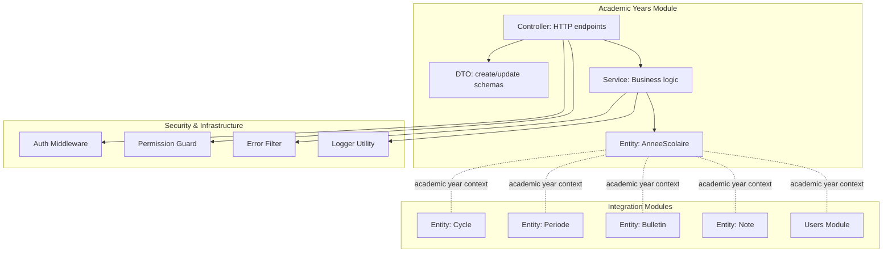
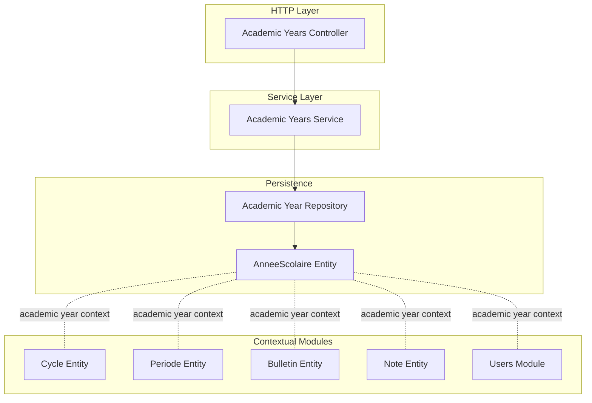
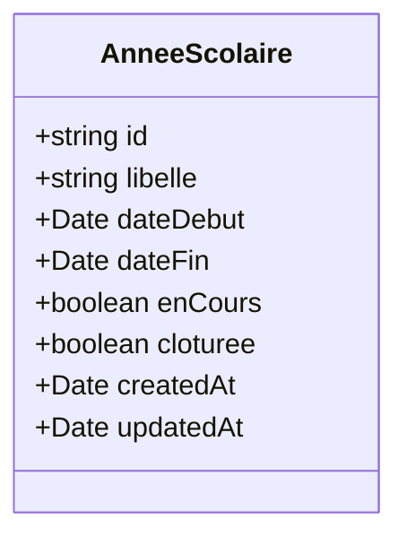
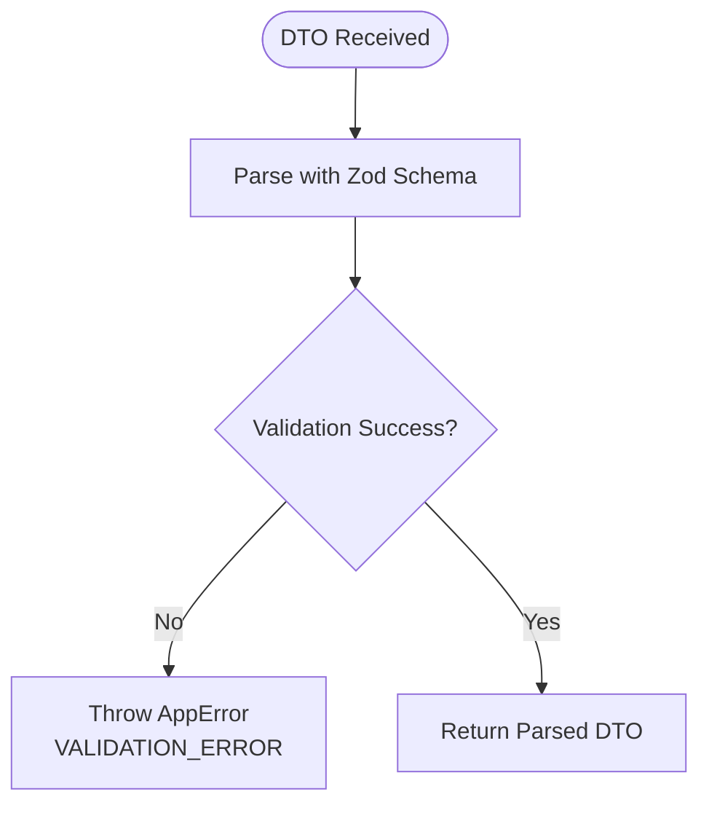
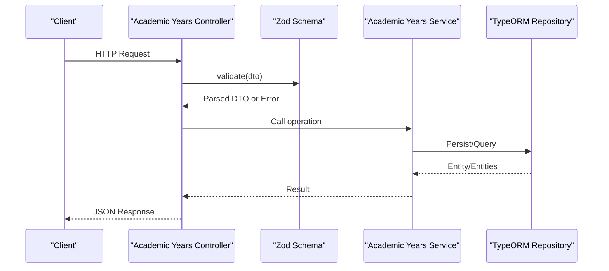
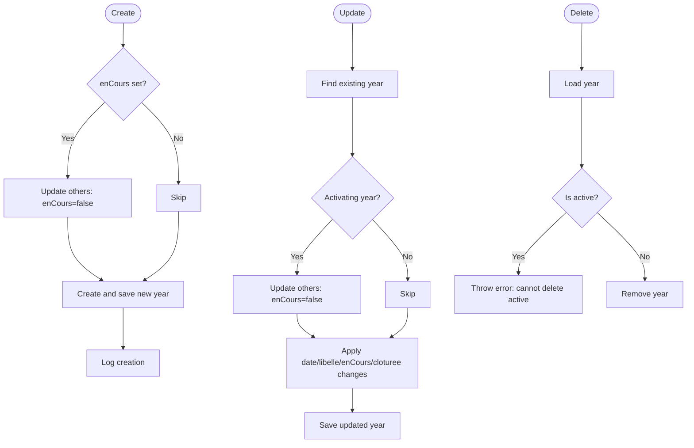
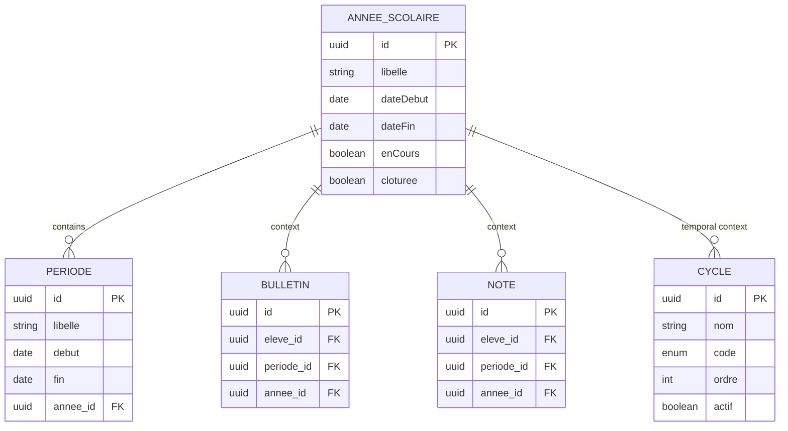
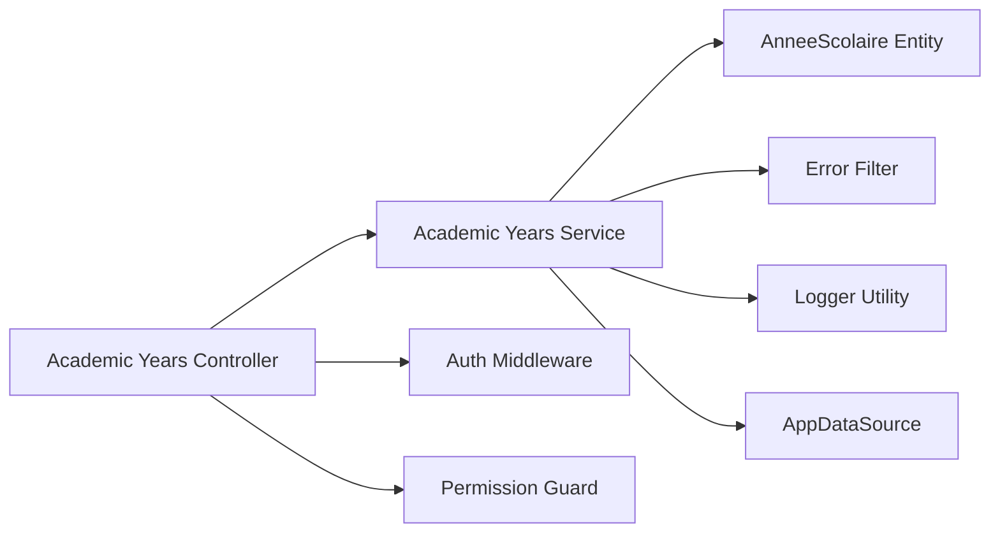

# Academic Years Management

<cite>
**Referenced Files in This Document**
- [annee-scolaire.entity.ts](file://backend/src/modules/annees-scolaires/entities/annee-scolaire.entity.ts)
- [annee-scolaire.dto.ts](file://backend/src/modules/annees-scolaires/dto/annee-scolaire.dto.ts)
- [annees-scolaires.controller.ts](file://backend/src/modules/annees-scolaires/controllers/annees-scolaires.controller.ts)
- [annees-scolaires.service.ts](file://backend/src/modules/annees-scolaires/services/annees-scolaires.service.ts)
- [app.ts](file://backend/src/app.ts)
- [index.ts](file://backend/src/modules/annees-scolaires/index.ts)
- [cycle.entity.ts](file://backend/src/modules/cycles/entities/cycle.entity.ts)
- [periode.entity.ts](file://backend/src/modules/periodes/entities/periode.entity.ts)
- [bulletin.entity.ts](file://backend/src/modules/bulletins/entities/bulletin.entity.ts)
- [note.entity.ts](file://backend/src/modules/notes/entities/note.entity.ts)
- [utilisateurs.controller.ts](file://backend/src/modules/utilisateurs/controllers/utilisateurs.controller.ts)
- [auth.middleware.ts](file://backend/src/modules/auth/middlewares/auth.middleware.ts)
- [permission.guard.ts](file://backend/src/modules/auth/guards/permission.guard.ts)
- [error.filter.ts](file://backend/src/common/filters/error.filter.ts)
- [logger.util.ts](file://backend/src/common/utils/logger.util.ts)
</cite>

## Table of Contents
1. [Introduction](#introduction)
2. [Project Structure](#project-structure)
3. [Core Components](#core-components)
4. [Architecture Overview](#architecture-overview)
5. [Detailed Component Analysis](#detailed-component-analysis)
6. [Dependency Analysis](#dependency-analysis)
7. [Performance Considerations](#performance-considerations)
8. [Troubleshooting Guide](#troubleshooting-guide)
9. [Conclusion](#conclusion)
10. [Appendices](#appendices)

## Introduction
This document provides comprehensive documentation for the Academic Years Management system within the eLISAschool platform. It explains the academic year entity structure, CRUD operations via controller endpoints, DTO validation rules, and service layer implementation. It also details relationships with other academic modules and how academic years serve as the foundational framework for all educational processes. Practical examples demonstrate creating new academic years, managing year transitions, handling concurrent academic periods, timezone considerations, leap year handling, and internationalization support for academic calendars.

## Project Structure
The academic years module follows a clean architecture pattern with clear separation of concerns:
- Entities define the persistent model for academic years
- DTOs encapsulate validation rules for creation and updates
- Controllers expose REST endpoints with authentication and authorization
- Services implement business logic and handle persistence
- Integration points connect with other modules (cycles, periods, grades, etc.)

**Diagram sources**
- [annee-scolaire.entity.ts:15-40](file://backend/src/modules/annees-scolaires/entities/annee-scolaire.entity.ts#L15-L40)
- [annee-scolaire.dto.ts:9-21](file://backend/src/modules/annees-scolaires/dto/annee-scolaire.dto.ts#L9-L21)
- [annees-scolaires.controller.ts:7-63](file://backend/src/modules/annees-scolaires/controllers/annees-scolaires.controller.ts#L7-L63)
- [annees-scolaires.service.ts:14-79](file://backend/src/modules/annees-scolaires/services/annees-scolaires.service.ts#L14-L79)
- [cycle.entity.ts:17-39](file://backend/src/modules/cycles/entities/cycle.entity.ts#L17-L39)
- [periode.entity.ts](file://backend/src/modules/periodes/entities/periode.entity.ts)
- [bulletin.entity.ts](file://backend/src/modules/bulletins/entities/bulletin.entity.ts)
- [note.entity.ts](file://backend/src/modules/notes/entities/note.entity.ts)
- [auth.middleware.ts](file://backend/src/modules/auth/middlewares/auth.middleware.ts)
- [permission.guard.ts](file://backend/src/modules/auth/guards/permission.guard.ts)
- [error.filter.ts](file://backend/src/common/filters/error.filter.ts)
- [logger.util.ts](file://backend/src/common/utils/logger.util.ts)

**Section sources**
- [annee-scolaire.entity.ts:15-40](file://backend/src/modules/annees-scolaires/entities/annee-scolaire.entity.ts#L15-L40)
- [annee-scolaire.dto.ts:9-21](file://backend/src/modules/annees-scolaires/dto/annee-scolaire.dto.ts#L9-L21)
- [annees-scolaires.controller.ts:7-63](file://backend/src/modules/annees-scolaires/controllers/annees-scolaires.controller.ts#L7-L63)
- [annees-scolaires.service.ts:14-79](file://backend/src/modules/annees-scolaires/services/annees-scolaires.service.ts#L14-L79)

## Core Components
This section documents the core building blocks of the academic years management system.

### Academic Year Entity
The academic year entity defines the persistent representation of an academic year with the following attributes:
- Unique identifier (UUID)
- Label formatted as "YYYY-YYYY"
- Start and end dates
- Status flags: current and closed
- Audit timestamps for creation and updates

Key characteristics:
- Unique label constraint ensures no overlapping academic years
- Boolean flags manage current year selection and closure state
- Date fields support precise academic period boundaries

**Section sources**
- [annee-scolaire.entity.ts:15-40](file://backend/src/modules/annees-scolaires/entities/annee-scolaire.entity.ts#L15-L40)

### DTO Validation Rules
Two Zod schemas define validation for academic year operations:
- Creation schema validates label format, date formats, and optional current flag
- Update schema extends creation with optional closure flag and partial updates

Validation behaviors:
- Label must match "YYYY-YYYY" format
- Dates accept ISO datetime or "YYYY-MM-DD" formats
- Partial updates are supported for selective field modifications

**Section sources**
- [annee-scolaire.dto.ts:9-21](file://backend/src/modules/annees-scolaires/dto/annee-scolaire.dto.ts#L9-L21)

### Controller Endpoints
The controller exposes REST endpoints secured with authentication and role-based authorization:
- GET /: List all academic years ordered by start date descending
- GET /active: Retrieve the currently active academic year
- POST /: Create a new academic year (ADMIN/SUPER_ADMIN)
- PATCH /: Update an existing academic year (ADMIN/SUPER_ADMIN)
- DELETE /: Remove an academic year (ADMIN/SUPER_ADMIN)

Security enforcement:
- Authentication middleware required for all endpoints
- Permission guard restricts write operations to administrative roles
- Centralized error handling via application error filter

**Section sources**
- [annees-scolaires.controller.ts:25-62](file://backend/src/modules/annees-scolaires/controllers/annees-scolaires.controller.ts#L25-L62)
- [auth.middleware.ts](file://backend/src/modules/auth/middlewares/auth.middleware.ts)
- [permission.guard.ts](file://backend/src/modules/auth/guards/permission.guard.ts)
- [error.filter.ts](file://backend/src/common/filters/error.filter.ts)

### Service Layer Implementation
The service layer implements business logic with the following operations:
- Create: Handles current year deactivation when enabling a new year
- Find All: Returns academic years sorted by start date descending
- Find Active: Retrieves the current academic year
- Find One: Validates existence and throws appropriate errors
- Update: Manages transitions, date updates, and closure state
- Delete: Prevents deletion of active academic years

Persistence and logging:
- TypeORM repository manages persistence
- Structured logging for audit trails
- Centralized error throwing for invalid states

**Section sources**
- [annees-scolaires.service.ts:21-76](file://backend/src/modules/annees-scolaires/services/annees-scolaires.service.ts#L21-L76)
- [logger.util.ts](file://backend/src/common/utils/logger.util.ts)

## Architecture Overview
The academic years module integrates tightly with the broader eLISAschool ecosystem. Academic years serve as the temporal foundation for cycles, periods, reports, and grading systems.

**Diagram sources**
- [annees-scolaires.controller.ts:7-15](file://backend/src/modules/annees-scolaires/controllers/annees-scolaires.controller.ts#L7-L15)
- [annees-scolaires.service.ts:14-19](file://backend/src/modules/annees-scolaires/services/annees-scolaires.service.ts#L14-L19)
- [annee-scolaire.entity.ts:15-40](file://backend/src/modules/annees-scolaires/entities/annee-scolaire.entity.ts#L15-L40)
- [cycle.entity.ts:17-39](file://backend/src/modules/cycles/entities/cycle.entity.ts#L17-L39)
- [periode.entity.ts](file://backend/src/modules/periodes/entities/periode.entity.ts)
- [bulletin.entity.ts](file://backend/src/modules/bulletins/entities/bulletin.entity.ts)
- [note.entity.ts](file://backend/src/modules/notes/entities/note.entity.ts)

## Detailed Component Analysis

### Academic Year Entity Analysis
The entity encapsulates the academic year lifecycle with robust constraints and metadata.

**Diagram sources**
- [annee-scolaire.entity.ts:15-40](file://backend/src/modules/annees-scolaires/entities/annee-scolaire.entity.ts#L15-L40)

**Section sources**
- [annee-scolaire.entity.ts:15-40](file://backend/src/modules/annees-scolaires/entities/annee-scolaire.entity.ts#L15-L40)

### DTO Validation Analysis
Validation schemas ensure data integrity and consistent formats across operations.

**Diagram sources**
- [annee-scolaire.dto.ts:9-21](file://backend/src/modules/annees-scolaires/dto/annee-scolaire.dto.ts#L9-L21)
- [annees-scolaires.controller.ts:17-23](file://backend/src/modules/annees-scolaires/controllers/annees-scolaires.controller.ts#L17-L23)
- [error.filter.ts](file://backend/src/common/filters/error.filter.ts)

**Section sources**
- [annee-scolaire.dto.ts:9-21](file://backend/src/modules/annees-scolaires/dto/annee-scolaire.dto.ts#L9-L21)
- [annees-scolaires.controller.ts:17-23](file://backend/src/modules/annees-scolaires/controllers/annees-scolaires.controller.ts#L17-L23)

### Controller Endpoint Flow
The controller orchestrates requests, applies validation, and delegates to the service layer.

**Diagram sources**
- [annees-scolaires.controller.ts:25-62](file://backend/src/modules/annees-scolaires/controllers/annees-scolaires.controller.ts#L25-L62)
- [annees-scolaires.service.ts:21-76](file://backend/src/modules/annees-scolaires/services/annees-scolaires.service.ts#L21-L76)

**Section sources**
- [annees-scolaires.controller.ts:25-62](file://backend/src/modules/annees-scolaires/controllers/annees-scolaires.controller.ts#L25-L62)
- [annees-scolaires.service.ts:21-76](file://backend/src/modules/annees-scolaires/services/annees-scolaires.service.ts#L21-L76)

### Service Operation Details
The service layer implements business rules for academic year management.

**Diagram sources**
- [annees-scolaires.service.ts:21-76](file://backend/src/modules/annees-scolaires/services/annees-scolaires.service.ts#L21-L76)

**Section sources**
- [annees-scolaires.service.ts:21-76](file://backend/src/modules/annees-scolaires/services/annees-scolaires.service.ts#L21-L76)

### Relationship with Academic Modules
Academic years underpin all educational processes by providing temporal context:
- Cycles: Academic year context influences cycle scheduling and progression
- Periods: Academic year boundaries define period start/end dates
- Reports and Grades: Academic year determines reporting periods and grade calculations
- Users: Academic year context affects user enrollment and permissions

**Diagram sources**
- [annee-scolaire.entity.ts:15-40](file://backend/src/modules/annees-scolaires/entities/annee-scolaire.entity.ts#L15-L40)
- [cycle.entity.ts:17-39](file://backend/src/modules/cycles/entities/cycle.entity.ts#L17-L39)
- [periode.entity.ts](file://backend/src/modules/periodes/entities/periode.entity.ts)
- [bulletin.entity.ts](file://backend/src/modules/bulletins/entities/bulletin.entity.ts)
- [note.entity.ts](file://backend/src/modules/notes/entities/note.entity.ts)

**Section sources**
- [cycle.entity.ts:17-39](file://backend/src/modules/cycles/entities/cycle.entity.ts#L17-L39)
- [periode.entity.ts](file://backend/src/modules/periodes/entities/periode.entity.ts)
- [bulletin.entity.ts](file://backend/src/modules/bulletins/entities/bulletin.entity.ts)
- [note.entity.ts](file://backend/src/modules/notes/entities/note.entity.ts)

## Dependency Analysis
The academic years module exhibits low coupling and high cohesion, integrating with security and infrastructure layers while maintaining clear boundaries.

**Diagram sources**
- [annees-scolaires.controller.ts:7-15](file://backend/src/modules/annees-scolaires/controllers/annees-scolaires.controller.ts#L7-L15)
- [annees-scolaires.service.ts:7-19](file://backend/src/modules/annees-scolaires/services/annees-scolaires.service.ts#L7-L19)
- [auth.middleware.ts](file://backend/src/modules/auth/middlewares/auth.middleware.ts)
- [permission.guard.ts](file://backend/src/modules/auth/guards/permission.guard.ts)
- [error.filter.ts](file://backend/src/common/filters/error.filter.ts)
- [logger.util.ts](file://backend/src/common/utils/logger.util.ts)

**Section sources**
- [annees-scolaires.controller.ts:7-15](file://backend/src/modules/annees-scolaires/controllers/annees-scolaires.controller.ts#L7-L15)
- [annees-scolaires.service.ts:7-19](file://backend/src/modules/annees-scolaires/services/annees-scolaires.service.ts#L7-L19)

## Performance Considerations
- Indexing: Ensure database indexes on academic year label, start date, and current flag for efficient queries
- Pagination: For large datasets, implement pagination in list endpoints
- Caching: Cache the active academic year to reduce database load
- Batch Operations: Minimize concurrent writes during year transitions
- Timezone Handling: Store dates as UTC with explicit timezone conversion at presentation layer

## Troubleshooting Guide
Common issues and resolutions:
- Validation Errors: Occur when label format or date formats are invalid; ensure "YYYY-YYYY" label and valid date formats
- Active Year Conflicts: Cannot enable a new current year while another exists; the system automatically deactivates others
- Deletion Failures: Cannot delete an active academic year; deactivate it first
- Concurrency: Year transitions are atomic; avoid simultaneous enable/disable operations
- Logging: Use structured logs for audit trails and debugging

**Section sources**
- [error.filter.ts](file://backend/src/common/filters/error.filter.ts)
- [logger.util.ts](file://backend/src/common/utils/logger.util.ts)
- [annees-scolaires.service.ts:21-76](file://backend/src/modules/annees-scolaires/services/annees-scolaires.service.ts#L21-L76)

## Conclusion
The Academic Years Management system provides a robust, secure, and extensible foundation for the eLISAschool platform. Its clean architecture, strong validation, and integration with other modules ensure reliable academic process orchestration. By adhering to the documented patterns and best practices, administrators can confidently manage academic years, transitions, and associated educational workflows.

## Appendices

### Example Workflows

#### Creating a New Academic Year
Steps:
1. Prepare DTO with label in "YYYY-YYYY" format and valid start/end dates
2. Send POST request to create endpoint
3. If enabling as current year, system automatically deactivates others
4. Verify response and log creation

**Section sources**
- [annees-scolaires.controller.ts:39-45](file://backend/src/modules/annees-scolaires/controllers/annees-scolaires.controller.ts#L39-L45)
- [annees-scolaires.service.ts:21-35](file://backend/src/modules/annees-scolaires/services/annees-scolaires.service.ts#L21-L35)

#### Managing Year Transitions
Steps:
1. Enable new academic year (sets current flag)
2. System deactivates previously active year
3. Update related periods and reports to align with new academic year
4. Monitor logs for successful transition

**Section sources**
- [annees-scolaires.service.ts:22-25](file://backend/src/modules/annees-scolaires/services/annees-scolaires.service.ts#L22-L25)
- [annees-scolaires.service.ts:54-57](file://backend/src/modules/annees-scolaires/services/annees-scolaires.service.ts#L54-L57)

#### Handling Concurrent Academic Periods
Guidelines:
- Academic years define boundaries for periods
- Ensure period dates fall within academic year dates
- Use academic year context when creating/updating periods
- Validate overlap constraints at the period level

**Section sources**
- [annee-scolaire.entity.ts:23-27](file://backend/src/modules/annees-scolaires/entities/annee-scolaire.entity.ts#L23-L27)
- [periode.entity.ts](file://backend/src/modules/periodes/entities/periode.entity.ts)

#### Timezone Considerations
Recommendations:
- Store dates as UTC in the database
- Convert to user's timezone at presentation layer
- Use server-side timezone configuration for consistent behavior
- Validate date inputs against expected timezone

#### Leap Year Handling
Notes:
- Academic year boundaries automatically handle leap years
- February 29th inclusion respects calendar rules
- No special handling required in business logic

#### Internationalization Support
Approach:
- Present dates in user-preferred locale
- Maintain standardized internal formats
- Support multiple calendar systems if required
- Localize labels and messages consistently