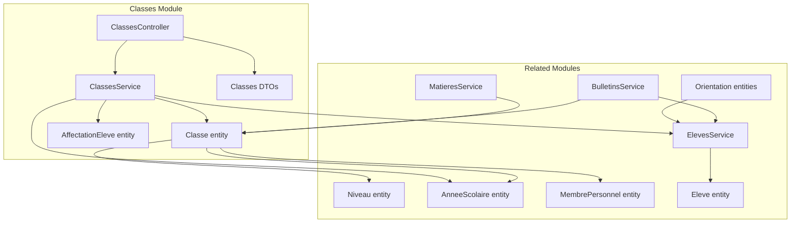
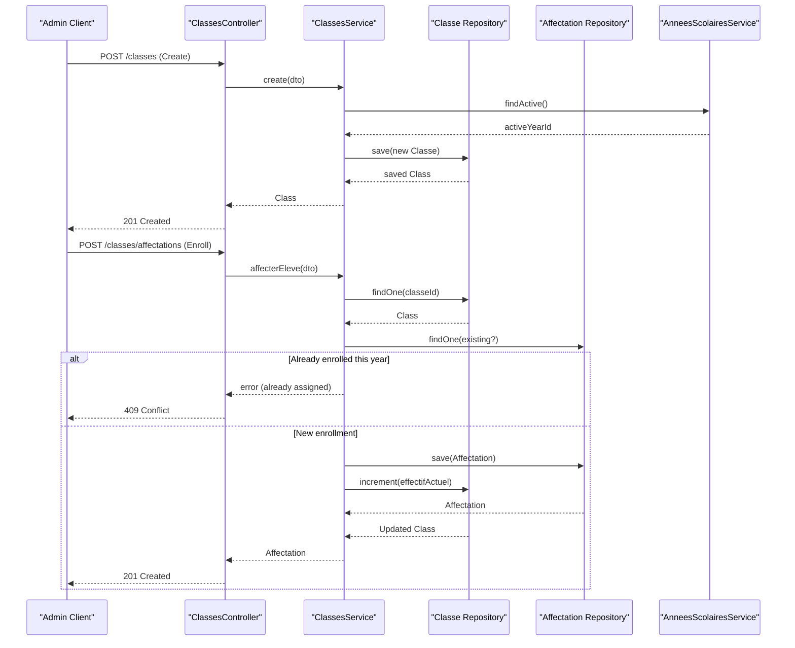
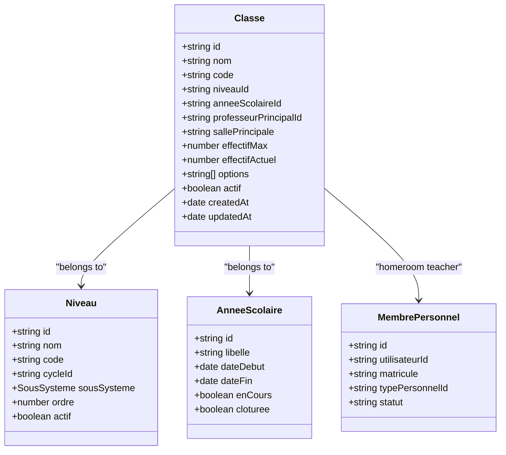
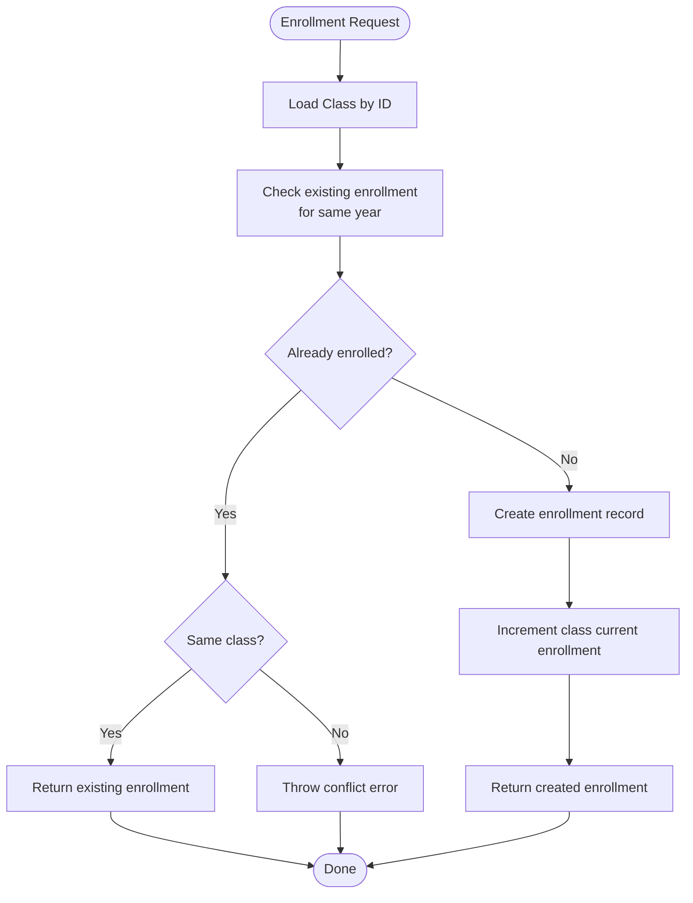
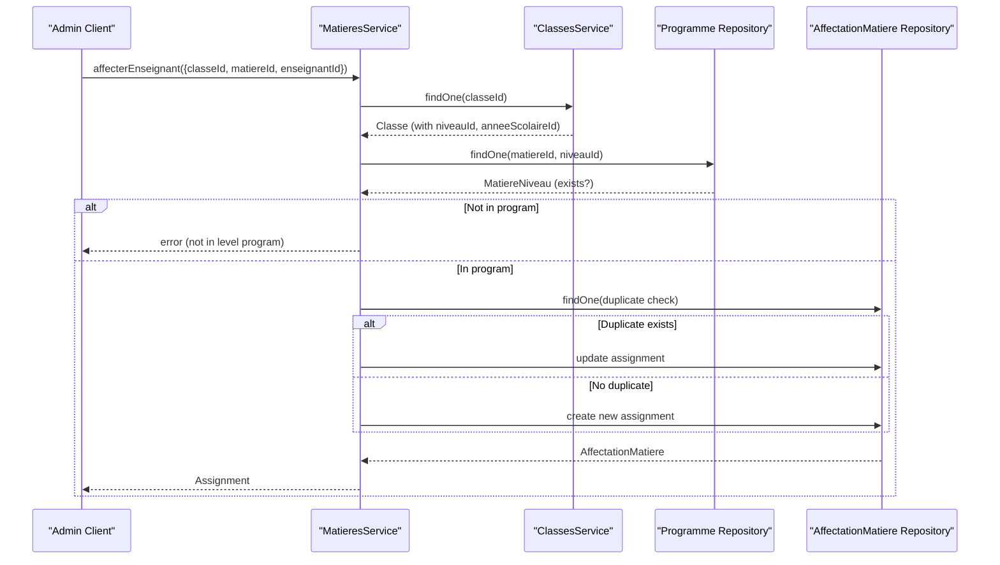
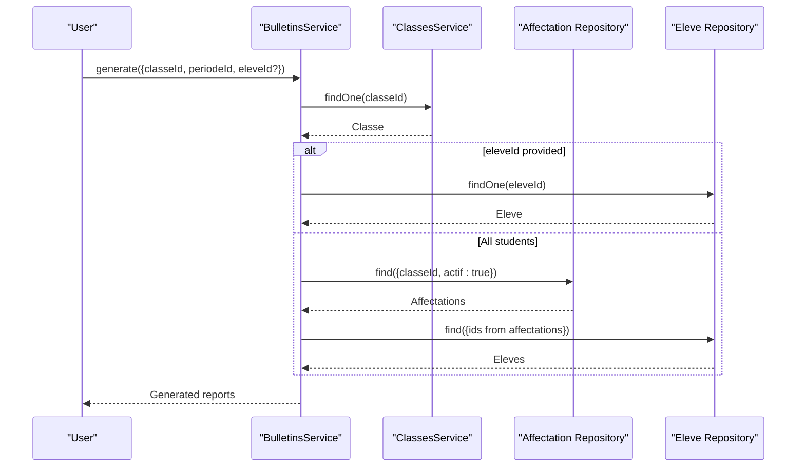
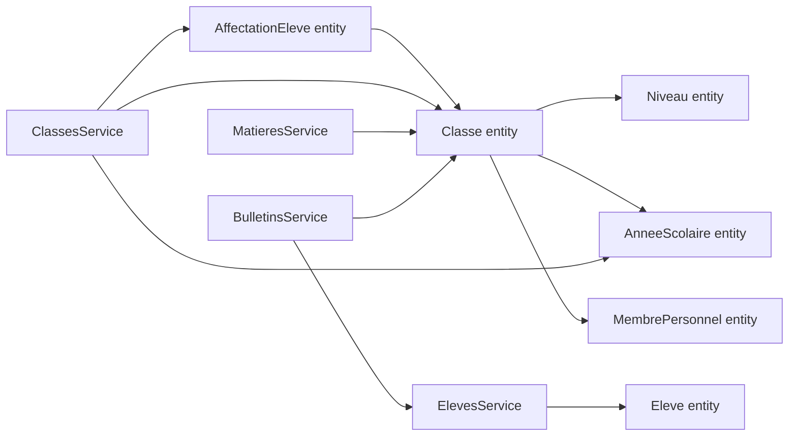

# Class Administration

<cite>
**Referenced Files in This Document**
- [classe.entity.ts](file://backend/src/modules/classes/entities/classe.entity.ts)
- [affectation-eleve.entity.ts](file://backend/src/modules/classes/entities/affectation-eleve.entity.ts)
- [classes.controller.ts](file://backend/src/modules/classes/controllers/classes.controller.ts)
- [classes.service.ts](file://backend/src/modules/classes/services/classes.service.ts)
- [classes.dto.ts](file://backend/src/modules/classes/dto/classes.dto.ts)
- [niveau.entity.ts](file://backend/src/modules/niveaux/entities/niveau.entity.ts)
- [annee-scolaire.entity.ts](file://backend/src/modules/annees-scolaires/entities/annee-scolaire.entity.ts)
- [personnel.entity.ts](file://backend/src/modules/personnel/entities/personnel.entity.ts)
- [matieres.service.ts](file://backend/src/modules/matieres/services/matieres.service.ts)
- [bulletins.service.ts](file://backend/src/modules/bulletins/services/bulletins.service.ts)
- [eleves.service.ts](file://backend/src/modules/eleves/services/eleves.service.ts)
- [eleve.entity.ts](file://backend/src/modules/eleves/entities/eleve.entity.ts)
- [orientation.entity.ts](file://backend/src/modules/orientation/entities/orientation.entity.ts)
</cite>

## Table of Contents
1. [Introduction](#introduction)
2. [Project Structure](#project-structure)
3. [Core Components](#core-components)
4. [Architecture Overview](#architecture-overview)
5. [Detailed Component Analysis](#detailed-component-analysis)
6. [Dependency Analysis](#dependency-analysis)
7. [Performance Considerations](#performance-considerations)
8. [Troubleshooting Guide](#troubleshooting-guide)
9. [Conclusion](#conclusion)
10. [Appendices](#appendices)

## Introduction
This document describes the Class Administration system, focusing on the class entity model, relationships with students and teachers, and the service layer that supports class creation, student enrollment, and class roster maintenance. It also outlines integration points with the academic calendar, grade levels, staff assignments, and subject allocation. Special education and bilingual/multilingual considerations are addressed alongside practical workflows such as creating class groups, managing admissions, handling transfers, and coordinating with grading/report systems.

## Project Structure
The Class Administration module is organized around three layers:
- Entities: define the persistent structures for classes, student enrollments, and related academic metadata.
- Services: encapsulate business logic for class lifecycle, enrollment, and administrative operations.
- Controllers and DTOs: handle HTTP requests, validation, and role-based access for administrative actions.

**Diagram sources**
- [classe.entity.ts:21-75](file://backend/src/modules/classes/entities/classe.entity.ts#L21-L75)
- [affectation-eleve.entity.ts:26-59](file://backend/src/modules/classes/entities/affectation-eleve.entity.ts#L26-L59)
- [classes.service.ts:15-116](file://backend/src/modules/classes/services/classes.service.ts#L15-L116)
- [classes.controller.ts:14-66](file://backend/src/modules/classes/controllers/classes.controller.ts#L14-L66)
- [classes.dto.ts:9-31](file://backend/src/modules/classes/dto/classes.dto.ts#L9-L31)
- [niveau.entity.ts:20-53](file://backend/src/modules/niveaux/entities/niveau.entity.ts#L20-L53)
- [annee-scolaire.entity.ts:15-40](file://backend/src/modules/annees-scolaires/entities/annee-scolaire.entity.ts#L15-L40)
- [personnel.entity.ts:38-78](file://backend/src/modules/personnel/entities/personnel.entity.ts#L38-L78)
- [matieres.service.ts:95-129](file://backend/src/modules/matieres/services/matieres.service.ts#L95-L129)
- [bulletins.service.ts:26-47](file://backend/src/modules/bulletins/services/bulletins.service.ts#L26-L47)
- [eleves.service.ts:14-78](file://backend/src/modules/eleves/services/eleves.service.ts#L14-L78)
- [eleve.entity.ts:21-58](file://backend/src/modules/eleves/entities/eleve.entity.ts#L21-L58)
- [orientation.entity.ts:20-142](file://backend/src/modules/orientation/entities/orientation.entity.ts#L20-L142)

**Section sources**
- [classe.entity.ts:1-76](file://backend/src/modules/classes/entities/classe.entity.ts#L1-L76)
- [affectation-eleve.entity.ts:1-60](file://backend/src/modules/classes/entities/affectation-eleve.entity.ts#L1-L60)
- [classes.controller.ts:1-67](file://backend/src/modules/classes/controllers/classes.controller.ts#L1-L67)
- [classes.service.ts:1-117](file://backend/src/modules/classes/services/classes.service.ts#L1-L117)
- [classes.dto.ts:1-32](file://backend/src/modules/classes/dto/classes.dto.ts#L1-L32)
- [niveau.entity.ts:1-54](file://backend/src/modules/niveaux/entities/niveau.entity.ts#L1-L54)
- [annee-scolaire.entity.ts:1-41](file://backend/src/modules/annees-scolaires/entities/annee-scolaire.entity.ts#L1-L41)
- [personnel.entity.ts:1-79](file://backend/src/modules/personnel/entities/personnel.entity.ts#L1-L79)
- [matieres.service.ts:64-132](file://backend/src/modules/matieres/services/matieres.service.ts#L64-L132)
- [bulletins.service.ts:1-48](file://backend/src/modules/bulletins/services/bulletins.service.ts#L1-L48)
- [eleves.service.ts:1-78](file://backend/src/modules/eleves/services/eleves.service.ts#L1-L78)
- [eleve.entity.ts:1-58](file://backend/src/modules/eleves/entities/eleve.entity.ts#L1-L58)
- [orientation.entity.ts:1-142](file://backend/src/modules/orientation/entities/orientation.entity.ts#L1-L142)

## Core Components
- Class entity: captures class identity, academic level, school year, homeroom teacher, room assignment, capacity limits, current enrollment, optional program tracks (e.g., bilingual), and activity flag.
- Student enrollment entity: records student-class-year associations, effective dates, and active status.
- Service layer: orchestrates class creation, retrieval, updates, deletions, and student enrollment with validation and constraints.
- Controller and DTOs: enforce role-based access and input validation for administrative operations.

Key capabilities:
- Create class groups linked to a grade level and active academic year.
- Manage student admissions with duplication checks per year.
- Maintain class rosters and capacity limits.
- Coordinate with subject allocation and reporting systems.

**Section sources**
- [classe.entity.ts:24-75](file://backend/src/modules/classes/entities/classe.entity.ts#L24-L75)
- [affectation-eleve.entity.ts:30-59](file://backend/src/modules/classes/entities/affectation-eleve.entity.ts#L30-L59)
- [classes.service.ts:24-113](file://backend/src/modules/classes/services/classes.service.ts#L24-L113)
- [classes.controller.ts:25-63](file://backend/src/modules/classes/controllers/classes.controller.ts#L25-L63)
- [classes.dto.ts:9-31](file://backend/src/modules/classes/dto/classes.dto.ts#L9-L31)

## Architecture Overview
The Class Administration system follows a layered architecture:
- Presentation: Express routes guarded by authentication and role middleware.
- Application: Service methods encapsulate business rules and data access.
- Domain: Entities represent persisted data and relationships.
- Integrations: Services interact with academic calendar, grade levels, staff, subjects, and student records.

**Diagram sources**
- [classes.controller.ts:34-63](file://backend/src/modules/classes/controllers/classes.controller.ts#L34-L63)
- [classes.service.ts:24-113](file://backend/src/modules/classes/services/classes.service.ts#L24-L113)
- [annee-scolaire.entity.ts:15-40](file://backend/src/modules/annees-scolaires/entities/annee-scolaire.entity.ts#L15-L40)

**Section sources**
- [classes.controller.ts:17-63](file://backend/src/modules/classes/controllers/classes.controller.ts#L17-L63)
- [classes.service.ts:15-116](file://backend/src/modules/classes/services/classes.service.ts#L15-L116)

## Detailed Component Analysis

### Class Entity Model
The Class entity defines the core attributes and relationships:
- Identity: UUID primary key, name/code for grouping.
- Academic context: links to grade level and academic year.
- Administrative details: homeroom teacher, main room, capacity limits, current enrollment, and flags.
- Options: program tracks such as bilingual or specialized streams.

**Diagram sources**
- [classe.entity.ts:21-75](file://backend/src/modules/classes/entities/classe.entity.ts#L21-L75)
- [niveau.entity.ts:20-53](file://backend/src/modules/niveaux/entities/niveau.entity.ts#L20-L53)
- [annee-scolaire.entity.ts:15-40](file://backend/src/modules/annees-scolaires/entities/annee-scolaire.entity.ts#L15-L40)
- [personnel.entity.ts:38-78](file://backend/src/modules/personnel/entities/personnel.entity.ts#L38-L78)

**Section sources**
- [classe.entity.ts:24-75](file://backend/src/modules/classes/entities/classe.entity.ts#L24-L75)
- [niveau.entity.ts:22-53](file://backend/src/modules/niveaux/entities/niveau.entity.ts#L22-L53)
- [annee-scolaire.entity.ts:16-40](file://backend/src/modules/annees-scolaires/entities/annee-scolaire.entity.ts#L16-L40)
- [personnel.entity.ts:40-78](file://backend/src/modules/personnel/entities/personnel.entity.ts#L40-L78)

### Student Enrollment and Roster Maintenance
Student enrollment is managed via the enrollment entity and service methods:
- Prevent duplicate enrollments in the same academic year.
- Increment current enrollment when a student is added.
- Support filtering by class and active status for reporting and grading.

**Diagram sources**
- [classes.service.ts:80-113](file://backend/src/modules/classes/services/classes.service.ts#L80-L113)
- [affectation-eleve.entity.ts:30-59](file://backend/src/modules/classes/entities/affectation-eleve.entity.ts#L30-L59)

**Section sources**
- [classes.service.ts:78-113](file://backend/src/modules/classes/services/classes.service.ts#L78-L113)
- [affectation-eleve.entity.ts:30-59](file://backend/src/modules/classes/entities/affectation-eleve.entity.ts#L30-L59)

### Subject Allocation and Teacher Assignments
Subject allocation integrates with class-level academic programs:
- Verify that the subject is part of the grade-level curriculum.
- Assign teachers to classes for specific subjects and academic years.
- Support weekly workload adjustments.

**Diagram sources**
- [matieres.service.ts:95-129](file://backend/src/modules/matieres/services/matieres.service.ts#L95-L129)
- [classes.service.ts:52-59](file://backend/src/modules/classes/services/classes.service.ts#L52-L59)

**Section sources**
- [matieres.service.ts:93-129](file://backend/src/modules/matieres/services/matieres.service.ts#L93-L129)
- [classes.service.ts:52-59](file://backend/src/modules/classes/services/classes.service.ts#L52-L59)

### Reporting and Class Rosters
Class rosters feed into report generation:
- Retrieve a class and optionally filter students by active enrollment.
- Generate reports for individual students or entire classes.

**Diagram sources**
- [bulletins.service.ts:26-47](file://backend/src/modules/bulletins/services/bulletins.service.ts#L26-L47)
- [classes.service.ts:52-59](file://backend/src/modules/classes/services/classes.service.ts#L52-L59)
- [affectation-eleve.entity.ts:30-59](file://backend/src/modules/classes/entities/affectation-eleve.entity.ts#L30-L59)
- [eleves.service.ts:14-78](file://backend/src/modules/eleves/services/eleves.service.ts#L14-L78)

**Section sources**
- [bulletins.service.ts:26-47](file://backend/src/modules/bulletins/services/bulletins.service.ts#L26-L47)
- [eleves.service.ts:30-47](file://backend/src/modules/eleves/services/eleves.service.ts#L30-L47)

### Examples and Workflows

- Creating a class group:
  - Use the create endpoint with a grade level and optional academic year; if not provided, the active year is resolved automatically.
  - Set capacity and optional program options (e.g., bilingual).
  - Assign a homeroom teacher if available.

- Managing student admissions:
  - Enroll a student into a class for the current academic year; the system prevents duplicates within the same year.
  - On successful enrollment, the class’s current enrollment is incremented.

- Handling class transfers:
  - The enrollment service prevents overlapping enrollments in the same year. To transfer, remove the old enrollment (mark inactive) and create a new enrollment in the target class. This pattern ensures data integrity and avoids conflicts.

- Coordinating with timetable systems:
  - Subject allocations link classes to specific subjects and teachers, enabling scheduling systems to derive weekly timetables from class-subject-teacher mappings.

- Special education and multilingual programs:
  - Program options on the class entity can encode specialized tracks (e.g., bilingual).
  - Orientation profiles capture interests and aptitudes that can inform class placement decisions.

**Section sources**
- [classes.controller.ts:34-40](file://backend/src/modules/classes/controllers/classes.controller.ts#L34-L40)
- [classes.service.ts:24-35](file://backend/src/modules/classes/services/classes.service.ts#L24-L35)
- [classes.dto.ts:9-19](file://backend/src/modules/classes/dto/classes.dto.ts#L9-L19)
- [classes.service.ts:80-113](file://backend/src/modules/classes/services/classes.service.ts#L80-L113)
- [matieres.service.ts:95-129](file://backend/src/modules/matieres/services/matieres.service.ts#L95-L129)
- [orientation.entity.ts:23-29](file://backend/src/modules/orientation/entities/orientation.entity.ts#L23-L29)

## Dependency Analysis
The Class Administration module depends on:
- Grade levels and academic years for contextualization.
- Staff records for homeroom teacher assignments.
- Student records for enrollment and reporting.
- Subject allocation for teacher-class-subject coordination.

**Diagram sources**
- [classe.entity.ts:21-75](file://backend/src/modules/classes/entities/classe.entity.ts#L21-L75)
- [affectation-eleve.entity.ts:26-59](file://backend/src/modules/classes/entities/affectation-eleve.entity.ts#L26-L59)
- [classes.service.ts:15-22](file://backend/src/modules/classes/services/classes.service.ts#L15-L22)
- [niveau.entity.ts:20-53](file://backend/src/modules/niveaux/entities/niveau.entity.ts#L20-L53)
- [annee-scolaire.entity.ts:15-40](file://backend/src/modules/annees-scolaires/entities/annee-scolaire.entity.ts#L15-L40)
- [personnel.entity.ts:38-78](file://backend/src/modules/personnel/entities/personnel.entity.ts#L38-L78)
- [matieres.service.ts:95-129](file://backend/src/modules/matieres/services/matieres.service.ts#L95-L129)
- [bulletins.service.ts:26-47](file://backend/src/modules/bulletins/services/bulletins.service.ts#L26-L47)
- [eleves.service.ts:14-78](file://backend/src/modules/eleves/services/eleves.service.ts#L14-L78)
- [eleve.entity.ts:21-58](file://backend/src/modules/eleves/entities/eleve.entity.ts#L21-L58)

**Section sources**
- [classes.service.ts:15-22](file://backend/src/modules/classes/services/classes.service.ts#L15-L22)
- [matieres.service.ts:95-129](file://backend/src/modules/matieres/services/matieres.service.ts#L95-L129)
- [bulletins.service.ts:26-47](file://backend/src/modules/bulletins/services/bulletins.service.ts#L26-L47)

## Performance Considerations
- Indexing: Entities use database indexes on frequently filtered columns (e.g., niveauId, anneeScolaireId, eleveId, classeId). This improves query performance for class lists, enrollments, and reporting.
- Aggregation updates: Current enrollment is updated atomically via increments, minimizing race conditions during concurrent enrollments.
- Relations: Eager loading of related entities (grade level, academic year, homeroom teacher) reduces round-trips in common queries.
- Validation: DTO schemas ensure early rejection of invalid inputs, reducing downstream errors.

[No sources needed since this section provides general guidance]

## Troubleshooting Guide
Common issues and resolutions:
- No active academic year: Creation requires an active year; ensure the academic year is set before creating classes.
- Class deletion fails: Cannot delete a class that still has active enrollments; remove or deactivate enrollments first.
- Duplicate enrollment: Enrolling the same student twice in the same academic year is blocked; adjust existing enrollment or wait until the next year.
- Subject assignment errors: Ensure the subject is included in the grade-level program before assigning a teacher.

**Section sources**
- [classes.service.ts:24-35](file://backend/src/modules/classes/services/classes.service.ts#L24-L35)
- [classes.service.ts:68-76](file://backend/src/modules/classes/services/classes.service.ts#L68-L76)
- [classes.service.ts:92-98](file://backend/src/modules/classes/services/classes.service.ts#L92-L98)
- [matieres.service.ts:98-104](file://backend/src/modules/matieres/services/matieres.service.ts#L98-L104)

## Conclusion
The Class Administration system provides a robust foundation for managing class groups, student enrollments, and teacher-subject allocations. Its entity model supports capacity limits, program options, and academic context, while the service layer enforces business rules and integrates with broader modules for reporting and orientation. The documented workflows enable administrators to create class groups, manage admissions and transfers, coordinate with timetable systems, and accommodate special education and multilingual needs.

[No sources needed since this section summarizes without analyzing specific files]

## Appendices

### API Endpoints Overview
- GET /classes: List classes with optional filters by grade level and academic year.
- POST /classes: Create a class group (admin/super admin).
- PATCH /classes/:id: Update class details (admin/super admin).
- DELETE /classes/:id: Delete a class (admin/super admin).
- POST /classes/affectations: Enroll a student (admin/super admin, personnel, principal).

**Section sources**
- [classes.controller.ts:25-63](file://backend/src/modules/classes/controllers/classes.controller.ts#L25-L63)

### Data Model Notes
- Class options: Use the options array to encode program tracks (e.g., bilingual, artistic).
- Capacity management: effectifMax and effectifActuel track capacity and current enrollment.
- Academic context: Classes are bound to a grade level and academic year, ensuring temporal correctness.

**Section sources**
- [classe.entity.ts:58-68](file://backend/src/modules/classes/entities/classe.entity.ts#L58-L68)
- [niveau.entity.ts:26-43](file://backend/src/modules/niveaux/entities/niveau.entity.ts#L26-L43)
- [annee-scolaire.entity.ts:20-33](file://backend/src/modules/annees-scolaires/entities/annee-scolaire.entity.ts#L20-L33)