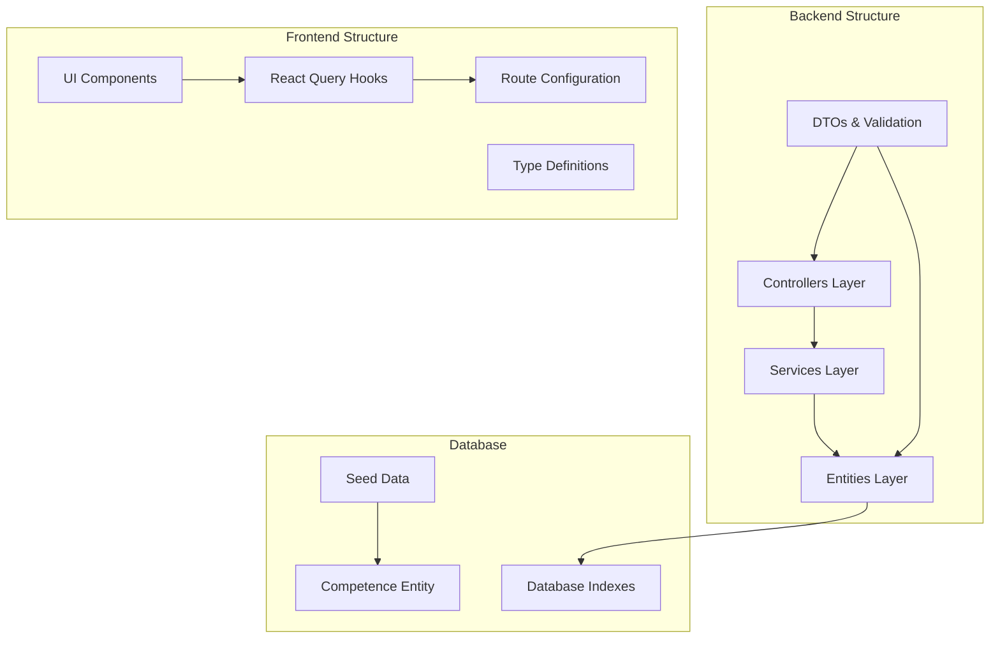
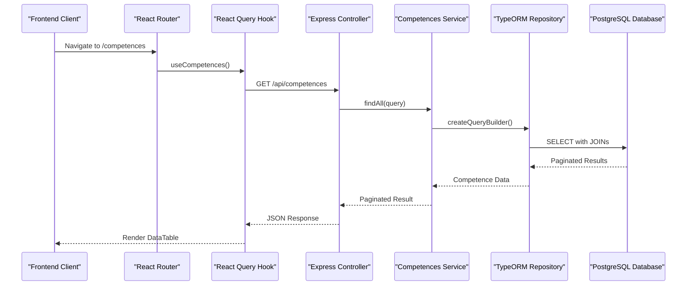
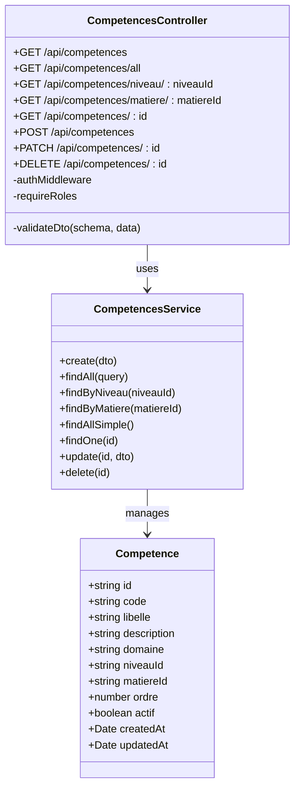
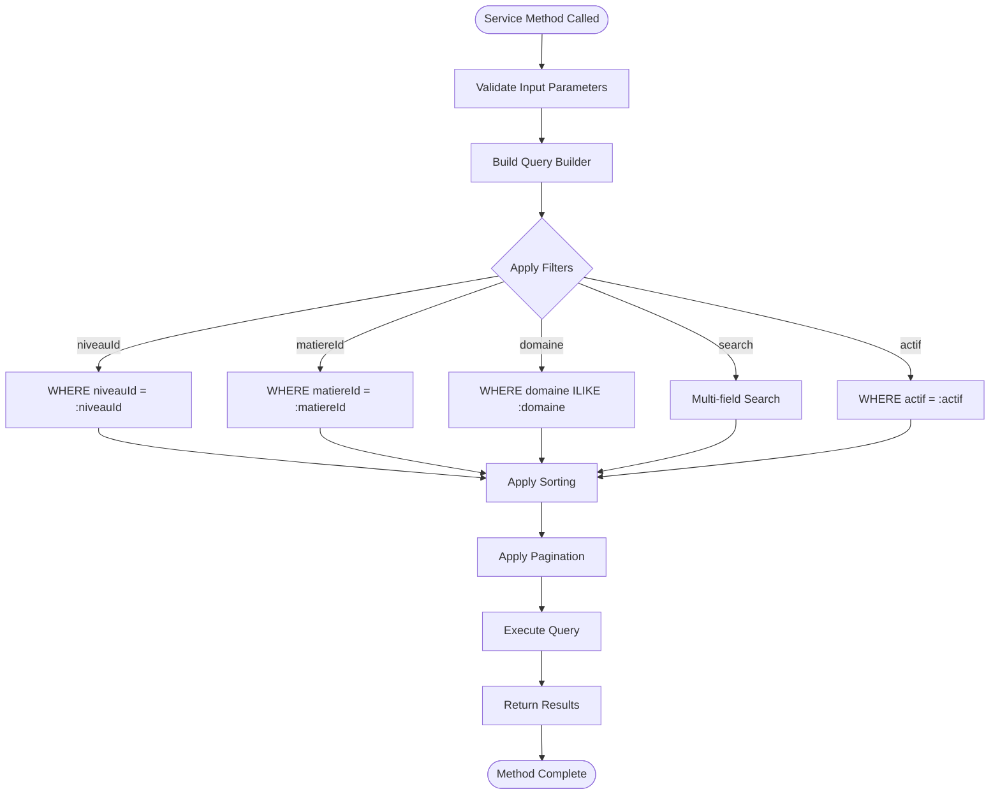
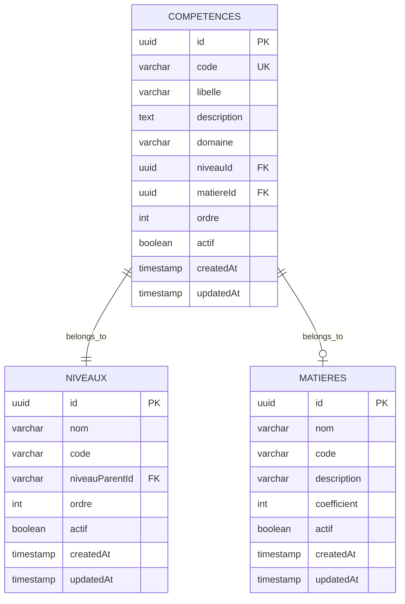
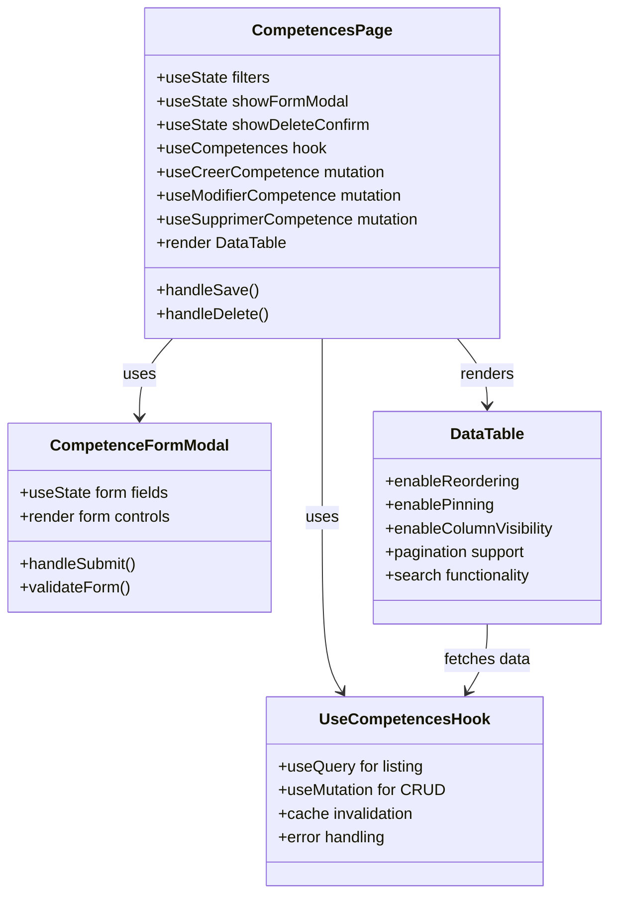

# Competences Module

<cite>
**Referenced Files in This Document**
- [competences.controller.ts](file://backend/src/modules/competences/controllers/competences.controller.ts)
- [competences.service.ts](file://backend/src/modules/competences/services/competences.service.ts)
- [competence.entity.ts](file://backend/src/modules/competences/entities/competence.entity.ts)
- [competence.dto.ts](file://backend/src/modules/competences/dto/competence.dto.ts)
- [use-competences.ts](file://frontend/src/features/competences/hooks/use-competences.ts)
- [competences-page.tsx](file://frontend/src/features/competences/components/competences-page.tsx)
- [routes/_auth.competences.tsx](file://frontend/src/routes/_auth.competences.tsx)
- [seed-specialites-competences.ts](file://backend/src/database/seeds/seed-specialites-competences.ts)
</cite>

## Table of Contents
1. [Introduction](#introduction)
2. [Project Structure](#project-structure)
3. [Core Components](#core-components)
4. [Architecture Overview](#architecture-overview)
5. [Detailed Component Analysis](#detailed-component-analysis)
6. [API Endpoints](#api-endpoints)
7. [Data Model](#data-model)
8. [Frontend Implementation](#frontend-implementation)
9. [Permissions and Security](#permissions-and-security)
10. [Performance Considerations](#performance-considerations)
11. [Troubleshooting Guide](#troubleshooting-guide)
12. [Conclusion](#conclusion)

## Introduction

The Competences Module is a core component of the eLISAschool educational management system that implements the Approach by Competencies (APC) framework. This module manages educational competencies within the curriculum, enabling schools to define, organize, and track student competencies across different subjects and academic levels. The module supports the official educational programs and provides comprehensive CRUD operations for competency management.

The module follows the MINESEC (Ministry of National Education) standards for competency-based education, allowing educators to create structured learning objectives that align with national curriculum requirements. It supports both subject-specific competencies and cross-curricular competencies, providing flexibility for diverse educational approaches.

## Project Structure

The Competences Module is organized following a clean architecture pattern with clear separation of concerns:

**Diagram sources**
- [competences.controller.ts:1-112](file://backend/src/modules/competences/controllers/competences.controller.ts#L1-L112)
- [competences.service.ts:1-124](file://backend/src/modules/competences/services/competences.service.ts#L1-L124)
- [competence.entity.ts:1-71](file://backend/src/modules/competences/entities/competence.entity.ts#L1-L71)

**Section sources**
- [competences.controller.ts:1-112](file://backend/src/modules/competences/controllers/competences.controller.ts#L1-L112)
- [competences.service.ts:1-124](file://backend/src/modules/competences/services/competences.service.ts#L1-L124)
- [competence.entity.ts:1-71](file://backend/src/modules/competences/entities/competence.entity.ts#L1-L71)

## Core Components

The module consists of four primary layers that work together to provide comprehensive competency management functionality:

### Backend Components

**Controllers**: Handle HTTP requests and coordinate between services and DTO validation
**Services**: Implement business logic and database operations with TypeORM
**Entities**: Define the data model and relationships with database schema
**DTOs**: Provide input validation and type safety using Zod schemas

### Frontend Components

**Hooks**: Manage React Query integration for data fetching and caching
**Components**: Provide user interface for competency management
**Routes**: Handle routing and permission-based access control

**Section sources**
- [competences.controller.ts:1-112](file://backend/src/modules/competences/controllers/competences.controller.ts#L1-L112)
- [competences.service.ts:1-124](file://backend/src/modules/competences/services/competences.service.ts#L1-L124)
- [competence.entity.ts:1-71](file://backend/src/modules/competences/entities/competence.entity.ts#L1-L71)
- [use-competences.ts:1-223](file://frontend/src/features/competences/hooks/use-competences.ts#L1-L223)

## Architecture Overview

The Competences Module follows a layered architecture pattern with clear separation between presentation, business logic, and data access layers:

**Diagram sources**
- [routes/_auth.competences.tsx:1-26](file://frontend/src/routes/_auth.competences.tsx#L1-L26)
- [use-competences.ts:82-104](file://frontend/src/features/competences/hooks/use-competences.ts#L82-L104)
- [competences.controller.ts:23-29](file://backend/src/modules/competences/controllers/competences.controller.ts#L23-L29)
- [competences.service.ts:37-75](file://backend/src/modules/competences/services/competences.service.ts#L37-L75)

The architecture ensures scalability through:
- **Separation of Concerns**: Clear boundaries between layers
- **Type Safety**: Strong typing throughout the stack
- **Validation**: Input validation at multiple layers
- **Caching**: Efficient data fetching with React Query
- **Pagination**: Optimized database queries for large datasets

## Detailed Component Analysis

### Backend Controller Implementation

The controller layer provides comprehensive HTTP endpoint management with proper authentication and authorization:

**Diagram sources**
- [competences.controller.ts:19-108](file://backend/src/modules/competences/controllers/competences.controller.ts#L19-L108)
- [competences.service.ts:17-121](file://backend/src/modules/competences/services/competences.service.ts#L17-L121)
- [competence.entity.ts:29-70](file://backend/src/modules/competences/entities/competence.entity.ts#L29-L70)

**Section sources**
- [competences.controller.ts:1-112](file://backend/src/modules/competences/controllers/competences.controller.ts#L1-L112)
- [competences.service.ts:1-124](file://backend/src/modules/competences/services/competences.service.ts#L1-L124)

### Service Layer Business Logic

The service layer implements sophisticated filtering, sorting, and pagination logic:

**Diagram sources**
- [competences.service.ts:37-75](file://backend/src/modules/competences/services/competences.service.ts#L37-L75)

**Section sources**
- [competences.service.ts:37-121](file://backend/src/modules/competences/services/competences.service.ts#L37-L121)

### Data Model and Relationships

The competency data model supports complex educational relationships:

**Diagram sources**
- [competence.entity.ts:25-70](file://backend/src/modules/competences/entities/competence.entity.ts#L25-L70)

**Section sources**
- [competence.entity.ts:1-71](file://backend/src/modules/competences/entities/competence.entity.ts#L1-L71)

### Frontend Implementation

The frontend provides a comprehensive user interface with advanced features:

**Diagram sources**
- [competences-page.tsx:57-317](file://frontend/src/features/competences/components/competences-page.tsx#L57-L317)
- [use-competences.ts:82-223](file://frontend/src/features/competences/hooks/use-competences.ts#L82-L223)

**Section sources**
- [competences-page.tsx:1-532](file://frontend/src/features/competences/components/competences-page.tsx#L1-L532)
- [use-competences.ts:1-223](file://frontend/src/features/competences/hooks/use-competences.ts#L1-L223)

## API Endpoints

The module exposes a comprehensive REST API for competency management:

| Endpoint | Method | Description | Authentication | Authorization |
|----------|--------|-------------|----------------|---------------|
| `/api/competences` | GET | List competencies with pagination and filters | Required | None |
| `/api/competences/all` | GET | Get all active competencies | Required | None |
| `/api/competences/niveau/:niveauId` | GET | Get competencies by level | Required | None |
| `/api/competences/matiere/:matiereId` | GET | Get competencies by subject | Required | None |
| `/api/competences/:id` | GET | Get single competency | Required | None |
| `/api/competences` | POST | Create new competency | Required | Admin/Super Admin |
| `/api/competences/:id` | PATCH | Update competency | Required | Admin/Super Admin |
| `/api/competences/:id` | DELETE | Delete competency | Required | Admin/Super Admin |

**Section sources**
- [competences.controller.ts:19-108](file://backend/src/modules/competences/controllers/competences.controller.ts#L19-L108)

## Data Model

The competency entity defines the core data structure with comprehensive relationships:

### Core Fields

| Field | Type | Constraints | Description |
|-------|------|-------------|-------------|
| `id` | UUID | Primary Key | Unique identifier |
| `code` | String (50) | Unique, Required | Standardized competency code |
| `libelle` | String (200) | Required | Human-readable competency name |
| `description` | Text | Optional | Detailed competency description |
| `domaine` | String (100) | Required | Educational domain (Mathematics, Sciences, etc.) |
| `niveauId` | UUID | Required | Level association |
| `matiereId` | UUID | Optional | Subject association (nullable) |
| `ordre` | Integer | Default: 1 | Display ordering |
| `actif` | Boolean | Default: true | Active/inactive status |
| `createdAt` | Timestamp | Auto-generated | Creation timestamp |
| `updatedAt` | Timestamp | Auto-generated | Last update timestamp |

### Database Indexes

The entity includes strategic indexes for optimal query performance:
- Single column indexes on `niveauId` and `matiereId`
- Composite index on `(niveauId, matiereId)`
- Unique constraint on `code` field

**Section sources**
- [competence.entity.ts:33-69](file://backend/src/modules/competences/entities/competence.entity.ts#L33-L69)

## Frontend Implementation

The frontend implementation leverages modern React patterns with comprehensive state management:

### Component Features

**Data Management**: Uses React Query for efficient data fetching, caching, and synchronization
**Form Handling**: Implements controlled components with real-time validation
**UI Components**: Utilizes custom DataTable with advanced features like reordering and pinning
**Permission System**: Integrates with the application's role-based access control

### User Interface Elements

**DataTable Configuration**:
- Column reordering and pinning capabilities
- Advanced search and filtering
- Pagination with configurable limits
- Responsive design for various screen sizes

**Form Features**:
- Real-time validation with user feedback
- Domain dropdown with predefined values
- Dynamic field visibility based on selections
- Loading states during API operations

**Section sources**
- [competences-page.tsx:57-317](file://frontend/src/features/competences/components/competences-page.tsx#L57-L317)
- [use-competences.ts:82-223](file://frontend/src/features/competences/hooks/use-competences.ts#L82-L223)

## Permissions and Security

The module implements robust security measures:

### Authentication Requirements
- All endpoints require authentication via JWT tokens
- Middleware validates user session and tenant context
- Automatic tenant isolation for multi-organization support

### Authorization Controls
- Administrative actions restricted to ADMIN and SUPER_ADMIN roles
- Permission-based UI element visibility
- Route-level protection using TanStack Router guards

### Input Validation
- Comprehensive DTO validation using Zod schemas
- Server-side validation for all CRUD operations
- Error handling with specific error codes and messages

**Section sources**
- [competences.controller.ts:12-14](file://backend/src/modules/competences/controllers/competences.controller.ts#L12-L14)
- [routes/_auth.competences.tsx:13-16](file://frontend/src/routes/_auth.competences.tsx#L13-L16)

## Performance Considerations

The module is designed with performance optimization in mind:

### Database Optimization
- Strategic indexing for frequently queried fields
- Efficient JOIN operations with lazy loading
- Pagination support for large datasets
- Query builder optimization for complex filters

### Frontend Performance
- React Query caching with intelligent invalidation
- Memoization of computed values
- Lazy loading of heavy components
- Debounced search operations

### Scalability Features
- Cursor-based pagination for infinite scrolling
- Batch operations for bulk updates
- Efficient data serialization
- CDN-ready static assets

## Troubleshooting Guide

### Common Issues and Solutions

**Authentication Problems**
- Verify JWT token validity and expiration
- Check tenant middleware configuration
- Ensure proper session management

**Authorization Errors (403)**
- Confirm user role assignments
- Verify permission grants for competency operations
- Check route guard configurations

**Database Connection Issues**
- Validate PostgreSQL connectivity
- Check migration status completion
- Review connection pool configuration

**Performance Issues**
- Monitor query execution times
- Analyze database index usage
- Review pagination parameters

### Debugging Tools

**Backend Debugging**
- Enable detailed logging for development
- Use database query logs
- Monitor TypeORM performance metrics

**Frontend Debugging**
- React DevTools inspection
- Network tab analysis
- Console error tracking

**Section sources**
- [competences.service.ts:24-35](file://backend/src/modules/competences/services/competences.service.ts#L24-L35)
- [use-competences.ts:175-221](file://frontend/src/features/competences/hooks/use-competences.ts#L175-L221)

## Conclusion

The Competences Module represents a comprehensive solution for competency-based education management within the eLISAschool ecosystem. The module successfully implements the APC framework while maintaining high standards for security, performance, and maintainability.

Key achievements include:
- **Complete Feature Coverage**: Full CRUD operations with advanced filtering
- **Robust Architecture**: Clean separation of concerns with proper validation
- **User Experience**: Intuitive interface with powerful data management tools
- **Security Implementation**: Comprehensive authentication and authorization
- **Performance Optimization**: Database and frontend performance considerations

The module serves as a foundation for advanced educational features including assessment systems, curriculum mapping, and student progress tracking. Its modular design allows for future enhancements while maintaining backward compatibility and system stability.