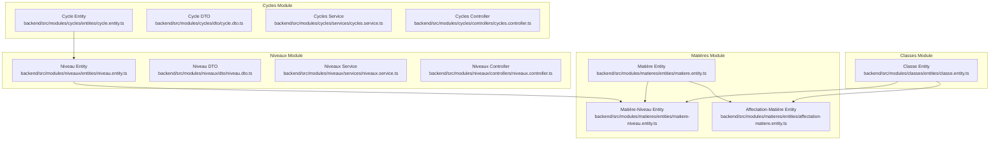
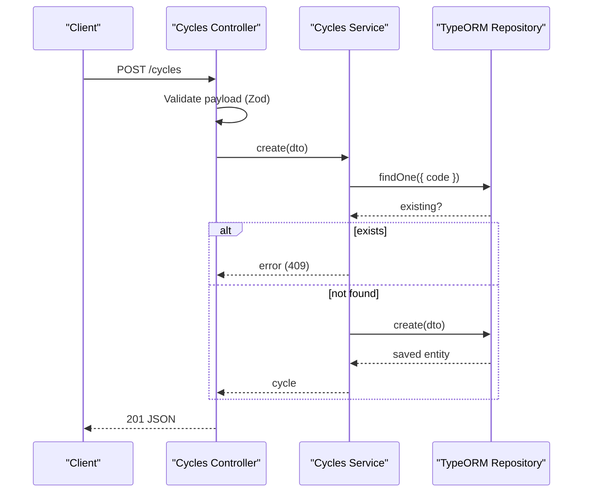
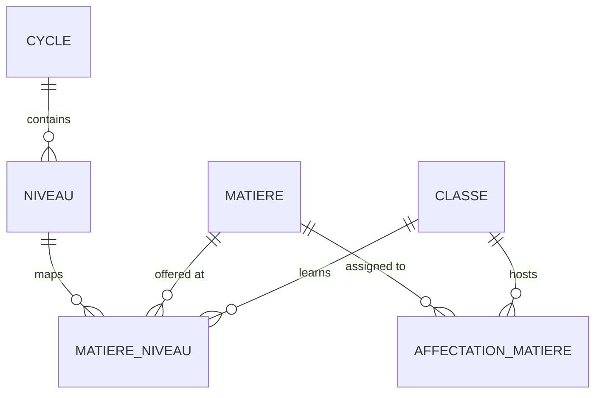
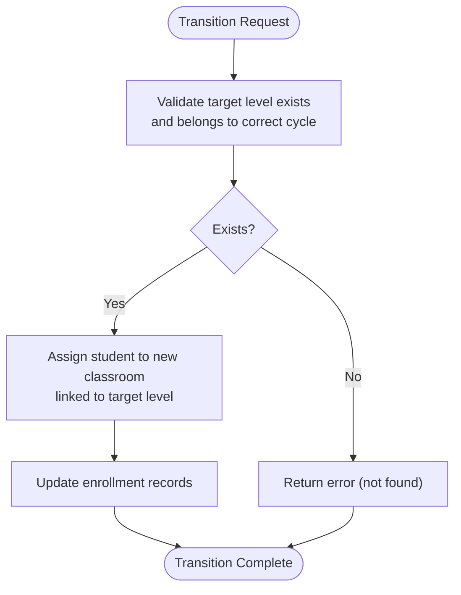
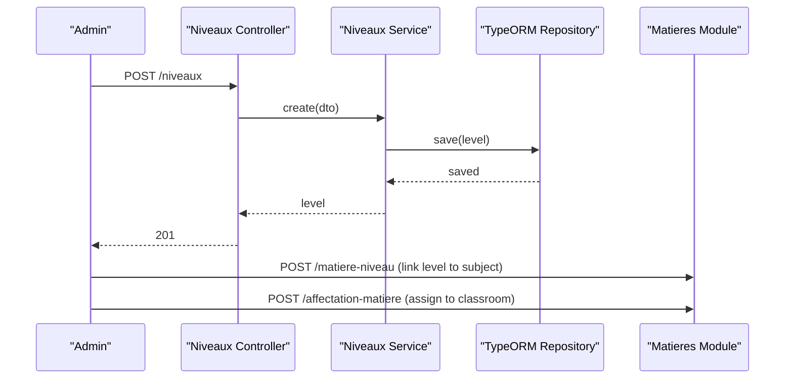
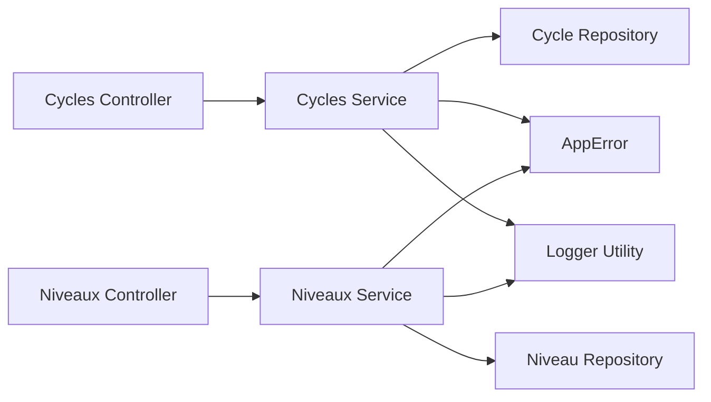

# Curriculum Structure (Cycles & Levels)

<cite>
**Referenced Files in This Document**
- [cycle.entity.ts](file://backend/src/modules/cycles/entities/cycle.entity.ts)
- [cycle.dto.ts](file://backend/src/modules/cycles/dto/cycle.dto.ts)
- [cycles.service.ts](file://backend/src/modules/cycles/services/cycles.service.ts)
- [cycles.controller.ts](file://backend/src/modules/cycles/controllers/cycles.controller.ts)
- [niveau.entity.ts](file://backend/src/modules/niveaux/entities/niveau.entity.ts)
- [niveau.dto.ts](file://backend/src/modules/niveaux/dto/niveau.dto.ts)
- [niveaux.service.ts](file://backend/src/modules/niveaux/services/niveaux.service.ts)
- [niveaux.controller.ts](file://backend/src/modules/niveaux/controllers/niveaux.controller.ts)
- [etablissement.entity.ts](file://backend/src/modules/etablissement/entities/etablissement.entity.ts)
- [matiere.entity.ts](file://backend/src/modules/matieres/entities/matiere.entity.ts)
- [matiere-niveau.entity.ts](file://backend/src/modules/matieres/entities/matiere-niveau.entity.ts)
- [affectation-matiere.entity.ts](file://backend/src/modules/matieres/entities/affectation-matiere.entity.ts)
- [classe.entity.ts](file://backend/src/modules/classes/entities/classe.entity.ts)
</cite>

## Table of Contents
1. [Introduction](#introduction)
2. [Project Structure](#project-structure)
3. [Core Components](#core-components)
4. [Architecture Overview](#architecture-overview)
5. [Detailed Component Analysis](#detailed-component-analysis)
6. [Dependency Analysis](#dependency-analysis)
7. [Performance Considerations](#performance-considerations)
8. [Troubleshooting Guide](#troubleshooting-guide)
9. [Conclusion](#conclusion)
10. [Appendices](#appendices)

## Introduction
This document explains the curriculum structure management focused on cycles and levels. It covers the hierarchical relationship between cycles (e.g., Primary, Secondary) and levels (e.g., Grade 1–6, Grade 7–9), entity relationships, validation rules, service implementations, and controller endpoints. It also details how to define curriculum structures, handle level transitions, integrate with subject offerings, and support multi-grade classroom scenarios and flexible curriculum designs.

## Project Structure
The curriculum structure spans three main modules:
- Cycles: Defines broad educational stages (e.g., Primary, Secondary).
- Niveaux: Defines granular levels within cycles (e.g., Grade 1, Grade 2).
- Matières: Defines subjects and their mapping to levels and classrooms.



**Diagram sources**
- [cycle.entity.ts:17-39](file://backend/src/modules/cycles/entities/cycle.entity.ts#L17-L39)
- [niveau.entity.ts:20-53](file://backend/src/modules/niveaux/entities/niveau.entity.ts#L20-L53)
- [matiere.entity.ts](file://backend/src/modules/matieres/entities/matiere.entity.ts)
- [matiere-niveau.entity.ts](file://backend/src/modules/matieres/entities/matiere-niveau.entity.ts)
- [affectation-matiere.entity.ts](file://backend/src/modules/matieres/entities/affectation-matiere.entity.ts)
- [classe.entity.ts](file://backend/src/modules/classes/entities/classe.entity.ts)

**Section sources**
- [cycle.entity.ts:17-39](file://backend/src/modules/cycles/entities/cycle.entity.ts#L17-L39)
- [niveau.entity.ts:20-53](file://backend/src/modules/niveaux/entities/niveau.entity.ts#L20-L53)
- [matiere.entity.ts](file://backend/src/modules/matieres/entities/matiere.entity.ts)
- [matiere-niveau.entity.ts](file://backend/src/modules/matieres/entities/matiere-niveau.entity.ts)
- [affectation-matiere.entity.ts](file://backend/src/modules/matieres/entities/affectation-matiere.entity.ts)
- [classe.entity.ts](file://backend/src/modules/classes/entities/classe.entity.ts)

## Core Components
- Cycle entity defines a school cycle with a unique code, display name, order, and activation flag. It is referenced by multiple levels.
- Niveau entity defines a specific grade/level within a cycle, with ordering, subsystem, and activation flags. It belongs to a single cycle.
- Matière entities model subjects and their mapping to levels and classrooms via junction and assignment entities.
- Controllers expose endpoints for CRUD operations on cycles and levels with role-based access and validation.
- Services encapsulate persistence logic and enforce uniqueness and existence checks.

Key capabilities:
- Define curriculum cycles and levels with strict validation.
- Enforce ordering within cycles and across cycles.
- Support multiple subsystems (e.g., French-speaking, English-speaking, bilingual).
- Integrate with subject offerings and classroom assignments.

**Section sources**
- [cycle.entity.ts:17-39](file://backend/src/modules/cycles/entities/cycle.entity.ts#L17-L39)
- [cycle.dto.ts:10-15](file://backend/src/modules/cycles/dto/cycle.dto.ts#L10-L15)
- [cycles.service.ts:21-31](file://backend/src/modules/cycles/services/cycles.service.ts#L21-L31)
- [niveau.entity.ts:20-53](file://backend/src/modules/niveaux/entities/niveau.entity.ts#L20-L53)
- [niveau.dto.ts:10-17](file://backend/src/modules/niveaux/dto/niveau.dto.ts#L10-L17)
- [niveaux.service.ts:21-26](file://backend/src/modules/niveaux/services/niveaux.service.ts#L21-L26)
- [etablissement.entity.ts:17-36](file://backend/src/modules/etablissement/entities/etablissement.entity.ts#L17-L36)

## Architecture Overview
The curriculum architecture follows a layered pattern:
- Entities define domain models and relationships.
- DTOs validate and sanitize request payloads.
- Services encapsulate business logic and persistence.
- Controllers handle HTTP requests, apply middleware, and return standardized responses.



**Diagram sources**
- [cycles.controller.ts:32-38](file://backend/src/modules/cycles/controllers/cycles.controller.ts#L32-L38)
- [cycles.service.ts:21-31](file://backend/src/modules/cycles/services/cycles.service.ts#L21-L31)

**Section sources**
- [cycles.controller.ts:17-23](file://backend/src/modules/cycles/controllers/cycles.controller.ts#L17-L23)
- [cycles.service.ts:14-19](file://backend/src/modules/cycles/services/cycles.service.ts#L14-L19)
- [niveaux.controller.ts:17-23](file://backend/src/modules/niveaux/controllers/niveaux.controller.ts#L17-L23)
- [niveaux.service.ts:14-19](file://backend/src/modules/niveaux/services/niveaux.service.ts#L14-L19)

## Detailed Component Analysis

### Cycle Management
- Entity fields: UUID primary key, name, code (from school cycle enum), order, activation flag, timestamps.
- Validation: Name length bounds, code must match predefined cycle enum, order must be positive integer, activation defaults to true.
- Service logic: Prevent duplicate cycle codes, fetch all by ascending order, update safely, delete after existence check.
- Controller endpoints: GET /cycles, POST /cycles (admin/super admin), PATCH /cycles/:id, DELETE /cycles/:id.

```mermaid
classDiagram
class Cycle {
+string id
+string nom
+CycleScolaire code
+number ordre
+boolean actif
+date createdAt
+date updatedAt
}
class CycleScolaire {
<<enum>>
"MATERNELLE"
"PRIMAIRE"
"COLLEGE"
"LYCEE"
}
Cycle --> CycleScolaire : "uses"
```

**Diagram sources**
- [cycle.entity.ts:17-39](file://backend/src/modules/cycles/entities/cycle.entity.ts#L17-L39)
- [etablissement.entity.ts:31-36](file://backend/src/modules/etablissement/entities/etablissement.entity.ts#L31-L36)

**Section sources**
- [cycle.entity.ts:17-39](file://backend/src/modules/cycles/entities/cycle.entity.ts#L17-L39)
- [cycle.dto.ts:10-15](file://backend/src/modules/cycles/dto/cycle.dto.ts#L10-L15)
- [cycles.service.ts:21-31](file://backend/src/modules/cycles/services/cycles.service.ts#L21-L31)
- [cycles.controller.ts:25-38](file://backend/src/modules/cycles/controllers/cycles.controller.ts#L25-L38)

### Level Management
- Entity fields: UUID primary key, name, optional code, cycleId foreign key, cycle relation, subsystem enum, order within cycle, activation flag, timestamps.
- Validation: Name length bounds, optional code, cycleId required, subsystem enum, order must be positive integer, activation defaults to true.
- Service logic: Create, list with optional cycle filter and relations, update safely, delete after existence check.
- Controller endpoints: GET /niveaux?cycleId=..., POST /niveaux, PATCH /niveaux/:id, DELETE /niveaux/:id.

```mermaid
classDiagram
class Niveau {
+string id
+string nom
+string code
+string cycleId
+SousSysteme sousSysteme
+number ordre
+boolean actif
+date createdAt
+date updatedAt
+Cycle cycle
}
class Cycle {
+string id
+string nom
+CycleScolaire code
+number ordre
+boolean actif
}
class SousSysteme {
<<enum>>
"FRANCOPHONE"
"ANGLOPHONE"
"BICULTUREL"
}
Niveau --> Cycle : "belongs to"
Niveau --> SousSysteme : "uses"
```

**Diagram sources**
- [niveau.entity.ts:20-53](file://backend/src/modules/niveaux/entities/niveau.entity.ts#L20-L53)
- [etablissement.entity.ts:17-21](file://backend/src/modules/etablissement/entities/etablissement.entity.ts#L17-L21)

**Section sources**
- [niveau.entity.ts:20-53](file://backend/src/modules/niveaux/entities/niveau.entity.ts#L20-L53)
- [niveau.dto.ts:10-17](file://backend/src/modules/niveaux/dto/niveau.dto.ts#L10-L17)
- [niveaux.service.ts:21-32](file://backend/src/modules/niveaux/services/niveaux.service.ts#L21-L32)
- [niveaux.controller.ts:25-39](file://backend/src/modules/niveaux/controllers/niveaux.controller.ts#L25-L39)

### Subject Offerings and Curriculum Mapping
Subject offerings are mapped to levels and classrooms:
- Matière entity: subject definition.
- Matière-Niveau entity: links subjects to levels (many-to-many).
- Affectation-Matière entity: assigns subjects to classrooms with teacher and period details.
- Classe entity: classroom grouping students and linking to levels and subjects.



**Diagram sources**
- [cycle.entity.ts:17-39](file://backend/src/modules/cycles/entities/cycle.entity.ts#L17-L39)
- [niveau.entity.ts:20-53](file://backend/src/modules/niveaux/entities/niveau.entity.ts#L20-L53)
- [matiere.entity.ts](file://backend/src/modules/matieres/entities/matiere.entity.ts)
- [matiere-niveau.entity.ts](file://backend/src/modules/matieres/entities/matiere-niveau.entity.ts)
- [affectation-matiere.entity.ts](file://backend/src/modules/matieres/entities/affectation-matiere.entity.ts)
- [classe.entity.ts](file://backend/src/modules/classes/entities/classe.entity.ts)

**Section sources**
- [matiere.entity.ts](file://backend/src/modules/matieres/entities/matiere.entity.ts)
- [matiere-niveau.entity.ts](file://backend/src/modules/matieres/entities/matiere-niveau.entity.ts)
- [affectation-matiere.entity.ts](file://backend/src/modules/matieres/entities/affectation-matiere.entity.ts)
- [classe.entity.ts](file://backend/src/modules/classes/entities/classe.entity.ts)

### Controller Endpoints for Curriculum Tracks and Academic Pathways
- Cycles:
  - GET /cycles: List all cycles ordered by ascending order.
  - POST /cycles: Create a new cycle (requires admin or super admin).
  - PATCH /cycles/:id: Update a cycle.
  - DELETE /cycles/:id: Delete a cycle.
- Niveaux:
  - GET /niveaux?cycleId={id}: List levels filtered by cycle, ordered by cycle and level order.
  - POST /niveaux: Create a new level.
  - PATCH /niveaux/:id: Update a level.
  - DELETE /niveaux/:id: Delete a level.

Access control:
- Authentication middleware applied to all endpoints.
- Authorization requires ADMIN or SUPER_ADMIN roles for write operations.

Validation:
- Zod schemas validate payloads and raise structured errors on failure.

**Section sources**
- [cycles.controller.ts:25-53](file://backend/src/modules/cycles/controllers/cycles.controller.ts#L25-L53)
- [niveaux.controller.ts:25-54](file://backend/src/modules/niveaux/controllers/niveaux.controller.ts#L25-L54)
- [cycle.dto.ts:10-15](file://backend/src/modules/cycles/dto/cycle.dto.ts#L10-L15)
- [niveau.dto.ts:10-17](file://backend/src/modules/niveaux/dto/niveau.dto.ts#L10-L17)

### Defining Curriculum Structures
To define a curriculum:
- Create cycles with distinct codes and ascending order to represent stages (e.g., Primary, Secondary).
- Create levels within each cycle with ascending order to represent grades.
- Assign subsystems per level to reflect language-of-instruction policies.
- Link subjects to levels via Matière-Niveau to build academic pathways.

Example workflow:
- POST /cycles with code=PRIMAIRE, nom="Primary", ordre=1.
- POST /niveaux with cycleId=primary-id, nom="Grade 1", ordre=1, sousSysteme=FRANCOPHONE.
- POST /niveaux with cycleId=primary-id, nom="Grade 2", ordre=2, sousSysteme=FRANCOPHONE.
- POST /niveaux with cycleId=secondary-id, nom="Grade 7", ordre=1, sousSysteme=FRANCOPHONE.

**Section sources**
- [cycle.dto.ts:10-15](file://backend/src/modules/cycles/dto/cycle.dto.ts#L10-L15)
- [niveau.dto.ts:10-17](file://backend/src/modules/niveaux/dto/niveau.dto.ts#L10-L17)
- [etablissement.entity.ts:17-21](file://backend/src/modules/etablissement/entities/etablissement.entity.ts#L17-L21)

### Handling Level Transitions
Level transitions occur when students move from one level to another within the same cycle or across cycles:
- Maintain ascending order within cycles to ensure logical progression.
- Use the cycleId to constrain transitions to valid levels.
- Combine with classroom assignments to manage cohort movement.



**Diagram sources**
- [niveaux.service.ts:34-38](file://backend/src/modules/niveaux/services/niveaux.service.ts#L34-L38)
- [classe.entity.ts](file://backend/src/modules/classes/entities/classe.entity.ts)

**Section sources**
- [niveaux.service.ts:34-38](file://backend/src/modules/niveaux/services/niveaux.service.ts#L34-L38)

### Integrating with Subject Offerings
Integrate curriculum levels with subjects:
- Use Matière-Niveau to map subjects to levels.
- Use Affectation-Matière to assign subjects to classrooms and periods.
- Use Classe to group students by level and track subject load.



**Diagram sources**
- [niveaux.controller.ts:33-37](file://backend/src/modules/niveaux/controllers/niveaux.controller.ts#L33-L37)
- [niveaux.service.ts:21-26](file://backend/src/modules/niveaux/services/niveaux.service.ts#L21-L26)
- [matiere-niveau.entity.ts](file://backend/src/modules/matieres/entities/matiere-niveau.entity.ts)
- [affectation-matiere.entity.ts](file://backend/src/modules/matieres/entities/affectation-matiere.entity.ts)

**Section sources**
- [niveaux.controller.ts:33-37](file://backend/src/modules/niveaux/controllers/niveaux.controller.ts#L33-L37)
- [niveaux.service.ts:21-26](file://backend/src/modules/niveaux/services/niveaux.service.ts#L21-L26)
- [matiere-niveau.entity.ts](file://backend/src/modules/matieres/entities/matiere-niveau.entity.ts)
- [affectation-matiere.entity.ts](file://backend/src/modules/matieres/entities/affectation-matiere.entity.ts)

### Multi-Grade Classroom Scenarios and Flexible Designs
- Multi-grade classrooms can be modeled by assigning multiple levels to a single classroom via subject mappings.
- Flexible curriculum designs can leverage subsystems (e.g., bilingual) and allow different ordering within cycles to reflect diverse educational tracks.
- Use the cycle order to define major academic pathways (e.g., general vs. specialized tracks) while keeping level orders coherent within each track.

**Section sources**
- [niveau.entity.ts:39-43](file://backend/src/modules/niveaux/entities/niveau.entity.ts#L39-L43)
- [etablissement.entity.ts:17-21](file://backend/src/modules/etablissement/entities/etablissement.entity.ts#L17-L21)

## Dependency Analysis
- Cycles and Niveaux share a parent-child relationship via foreign keys and relations.
- Matières integrates with Niveaux and Classes through dedicated entities.
- Controllers depend on Services and DTOs for validation and authorization.
- Services depend on repositories and centralized error handling.



**Diagram sources**
- [cycles.controller.ts:7-12](file://backend/src/modules/cycles/controllers/cycles.controller.ts#L7-L12)
- [niveaux.controller.ts:7-12](file://backend/src/modules/niveaux/controllers/niveaux.controller.ts#L7-L12)
- [cycles.service.ts:7-12](file://backend/src/modules/cycles/services/cycles.service.ts#L7-L12)
- [niveaux.service.ts:7-12](file://backend/src/modules/niveaux/services/niveaux.service.ts#L7-L12)

**Section sources**
- [cycles.controller.ts:7-12](file://backend/src/modules/cycles/controllers/cycles.controller.ts#L7-L12)
- [niveaux.controller.ts:7-12](file://backend/src/modules/niveaux/controllers/niveaux.controller.ts#L7-L12)
- [cycles.service.ts:7-12](file://backend/src/modules/cycles/services/cycles.service.ts#L7-L12)
- [niveaux.service.ts:7-12](file://backend/src/modules/niveaux/services/niveaux.service.ts#L7-L12)

## Performance Considerations
- Indexing: Niveau entity includes an index on cycleId to optimize filtering by cycle.
- Ordering: Queries sort by cycle and level order to maintain predictable traversal.
- Relations: Lazy loading via relations reduces payload sizes when not needed.
- Validation: Centralized Zod schemas prevent redundant validation logic and improve consistency.

**Section sources**
- [niveau.entity.ts:21-31](file://backend/src/modules/niveaux/entities/niveau.entity.ts#L21-L31)

## Troubleshooting Guide
Common issues and resolutions:
- Duplicate cycle code: Creation fails with a conflict error; ensure unique cycle codes.
- Not found errors: Fetch/update/delete on non-existent entities trigger not found errors.
- Validation errors: Malformed payloads produce structured validation errors; review DTO constraints.
- Access denied: Write operations require ADMIN or SUPER_ADMIN roles.

Operational logging:
- Services log creation and deletion events for auditability.

**Section sources**
- [cycles.service.ts:22-25](file://backend/src/modules/cycles/services/cycles.service.ts#L22-L25)
- [cycles.service.ts](file://backend/src/modules/cycles/services/cycles.service.ts#L39)
- [niveaux.service.ts](file://backend/src/modules/niveaux/services/niveaux.service.ts#L36)
- [cycles.controller.ts:17-23](file://backend/src/modules/cycles/controllers/cycles.controller.ts#L17-L23)
- [niveaux.controller.ts:17-23](file://backend/src/modules/niveaux/controllers/niveaux.controller.ts#L17-L23)

## Conclusion
The curriculum structure module provides a robust foundation for managing educational cycles and levels. With strict validation, clear entity relationships, and integrated subject mapping, it supports diverse educational tracks, multi-grade classrooms, and flexible subsystem designs. The controller endpoints and service layers ensure secure, auditable, and scalable operations.

## Appendices
- Enumerations used:
  - CycleScolaire: MATERNELLE, PRIMAIRE, COLLEGE, LYCEE.
  - SousSysteme: FRANCOPHONE, ANGLOPHONE, BICULTUREL.

**Section sources**
- [etablissement.entity.ts:17-36](file://backend/src/modules/etablissement/entities/etablissement.entity.ts#L17-L36)