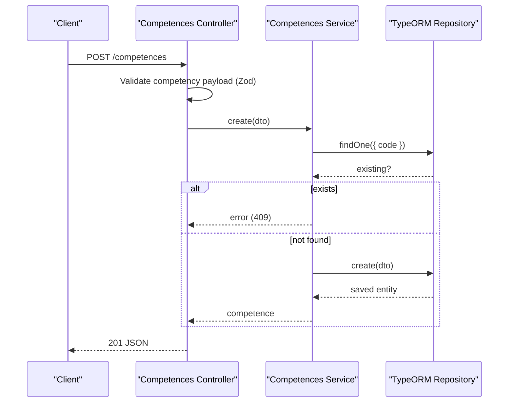
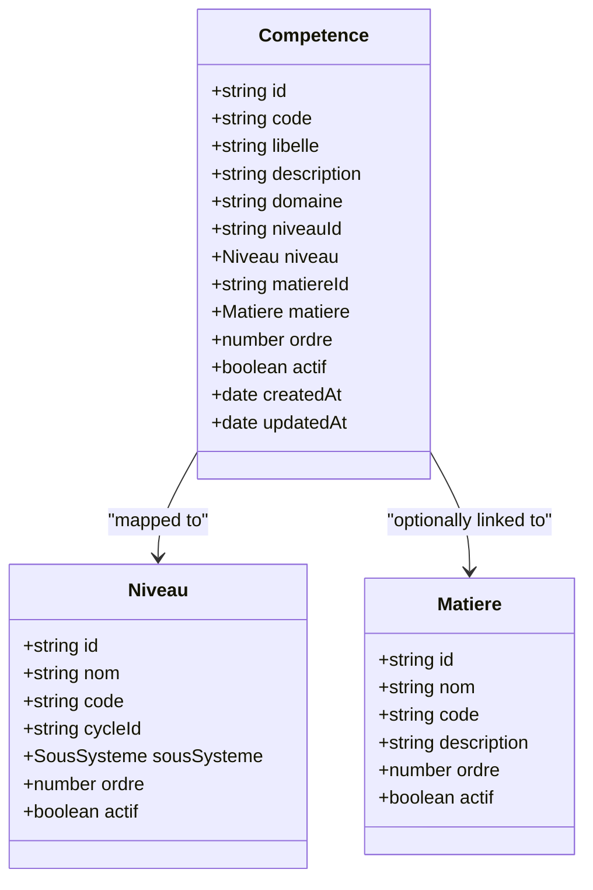
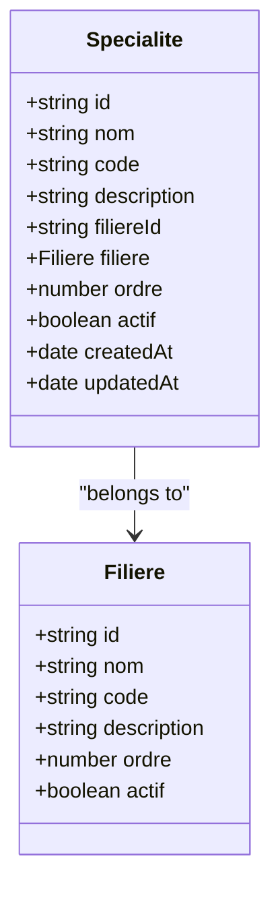
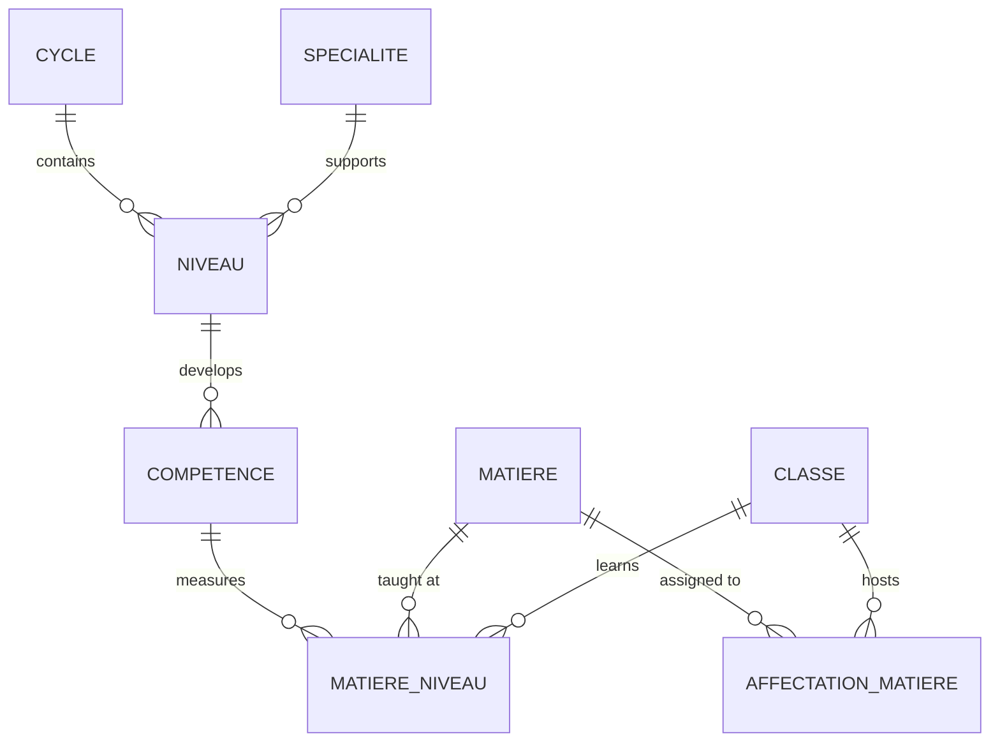
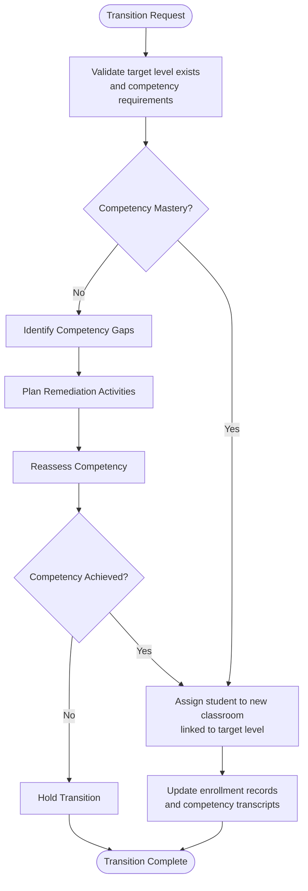
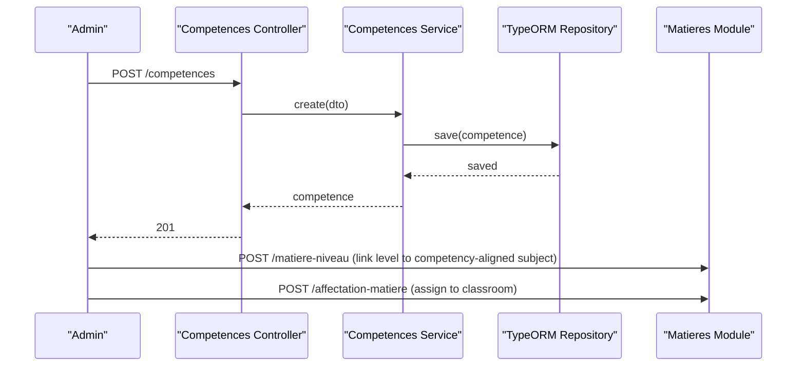
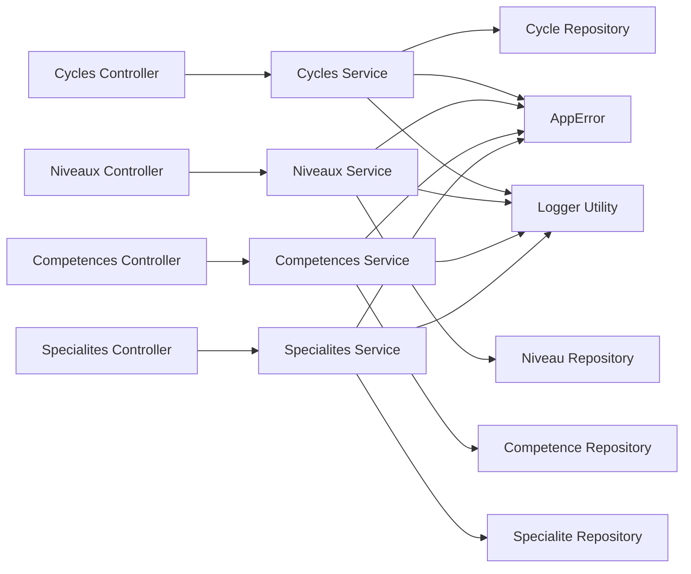

# Curriculum Structure (Cycles & Levels)

<cite>
**Referenced Files in This Document**
- [cycle.entity.ts](file://backend/src/modules/cycles/entities/cycle.entity.ts)
- [cycle.dto.ts](file://backend/src/modules/cycles/dto/cycle.dto.ts)
- [cycles.service.ts](file://backend/src/modules/cycles/services/cycles.service.ts)
- [cycles.controller.ts](file://backend/src/modules/cycles/controllers/cycles.controller.ts)
- [niveau.entity.ts](file://backend/src/modules/niveaux/entities/niveau.entity.ts)
- [niveau.dto.ts](file://backend/src/modules/niveaux/dto/niveau.dto.ts)
- [niveaux.service.ts](file://backend/src/modules/niveaux/services/niveaux.service.ts)
- [niveaux.controller.ts](file://backend/src/modules/niveaux/controllers/niveaux.controller.ts)
- [competence.entity.ts](file://backend/src/modules/competences/entities/competence.entity.ts)
- [competence.dto.ts](file://backend/src/modules/competences/dto/competence.dto.ts)
- [competences.service.ts](file://backend/src/modules/competences/services/competences.service.ts)
- [competences.controller.ts](file://backend/src/modules/competences/controllers/competences.controller.ts)
- [specialite.entity.ts](file://backend/src/modules/specialites/entities/specialite.entity.ts)
- [specialite.dto.ts](file://backend/src/modules/specialites/dto/specialite.dto.ts)
- [specialites.service.ts](file://backend/src/modules/specialites/services/specialites.service.ts)
- [specialites.controller.ts](file://backend/src/modules/specialites/controllers/specialites.controller.ts)
- [etablissement.entity.ts](file://backend/src/modules/etablissement/entities/etablissement.entity.ts)
- [matiere.entity.ts](file://backend/src/modules/matieres/entities/matiere.entity.ts)
- [matiere-niveau.entity.ts](file://backend/src/modules/matieres/entities/matiere-niveau.entity.ts)
- [affectation-matiere.entity.ts](file://backend/src/modules/matieres/entities/affectation-matiere.entity.ts)
- [classe.entity.ts](file://backend/src/modules/classes/entities/classe.entity.ts)
- [054-refonte-structure-academique-v2.sql](file://backend/database/migrations/054-refonte-structure-academique-v2.sql)
- [seed-specialites-competences.ts](file://backend/src/database/seeds/seed-specialites-competences.ts)
</cite>

## Update Summary
**Changes Made**
- Removed references to types-cycles system and replaced with competency-based learning approach
- Added new Competences module for competency-based curriculum management
- Added Specialites module for technical specialization options
- Updated cycle entity to include competency-related attributes (description, duration, diploma)
- Revised architecture diagrams to reflect competency-based learning paradigm
- Updated controller endpoints to support new competency and specialization workflows

## Table of Contents
1. [Introduction](#introduction)
2. [Project Structure](#project-structure)
3. [Core Components](#core-components)
4. [Architecture Overview](#architecture-overview)
5. [Detailed Component Analysis](#detailed-component-analysis)
6. [Competency-Based Learning Approach](#competency-based-learning-approach)
7. [Technical Specializations](#technical-specializations)
8. [Dependency Analysis](#dependency-analysis)
9. [Performance Considerations](#performance-considerations)
10. [Troubleshooting Guide](#troubleshooting-guide)
11. [Conclusion](#conclusion)
12. [Appendices](#appendices)

## Introduction
This document explains the curriculum structure management focused on cycles and levels within a competency-based learning framework. The system has evolved from the previous types-cycles approach to support modern pedagogical methodologies aligned with the MINESEC curriculum standards. It covers the hierarchical relationship between cycles (e.g., Maternelle, Primaire, Secondaire), levels (e.g., Grade 1-6, Grade 7-9), and the integration of competency-based learning with technical specializations.

**Updated** The system now emphasizes competency-based learning (APC) with integrated specializations for technical education tracks, replacing the previous types-cycles classification system.

## Project Structure
The curriculum structure spans four main modules supporting competency-based learning:
- Cycles: Defines broad educational stages with competency attributes
- Niveaux: Defines granular levels within cycles
- Competences: Manages competency-based learning objectives
- Specialites: Handles technical specialization options

```mermaid
graph TB
subgraph "Cycles Module"
CY["Cycle Entity<br/>backend/src/modules/cycles/entities/cycle.entity.ts"]
D1["Cycle DTO<br/>backend/src/modules/cycles/dto/cycle.dto.ts"]
S1["Cycles Service<br/>backend/src/modules/cycles/services/cycles.service.ts"]
C1["Cycles Controller<br/>backend/src/modules/cycles/controllers/cycles.controller.ts"]
end
subgraph "Niveaux Module"
NV["Niveau Entity<br/>backend/src/modules/niveaux/entities/niveau.entity.ts"]
D2["Niveau DTO<br/>backend/src/modules/niveaux/dto/niveau.dto.ts"]
S2["Niveaux Service<br/>backend/src/modules/niveaux/services/niveaux.service.ts"]
C2["Niveaux Controller<br/>backend/src/modules/niveaux/controllers/niveaux.controller.ts"]
end
subgraph "Competences Module"
COMP["Competence Entity<br/>backend/src/modules/competences/entities/competence.entity.ts"]
D3["Competence DTO<br/>backend/src/modules/competences/dto/competence.dto.ts"]
S3["Competences Service<br/>backend/src/modules/competences/services/competences.service.ts"]
C3["Competences Controller<br/>backend/src/modules/competences/controllers/competences.controller.ts"]
end
subgraph "Specialites Module"
SPEC["Specialite Entity<br/>backend/src/modules/specialites/entities/specialite.entity.ts"]
D4["Specialite DTO<br/>backend/src/modules/specialites/dto/specialite.dto.ts"]
S4["Specialites Service<br/>backend/src/modules/specialites/services/specialites.service.ts"]
C4["Specialites Controller<br/>backend/src/modules/specialites/controllers/specialites.controller.ts"]
end
subgraph "Matières Module"
M["Matière Entity<br/>backend/src/modules/matieres/entities/matiere.entity.ts"]
MN["Matière-Niveau Entity<br/>backend/src/modules/matieres/entities/matiere-niveau.entity.ts"]
AM["Affectation-Matière Entity<br/>backend/src/modules/matieres/entities/affectation-matiere.entity.ts"]
end
subgraph "Classes Module"
CL["Classe Entity<br/>backend/src/modules/classes/entities/classe.entity.ts"]
end
CY --> NV
NV --> COMP
COMP --> MN
M --> MN
M --> AM
CL --> MN
CL --> AM
SPEC --> NV
```



**Diagram sources**
- [cycle.entity.ts:18-52](file://backend/src/modules/cycles/entities/cycle.entity.ts#L18-L52)
- [niveau.entity.ts:20-53](file://backend/src/modules/niveaux/entities/niveau.entity.ts#L20-L53)
- [competence.entity.ts:25-70](file://backend/src/modules/competences/entities/competence.entity.ts#L25-L70)
- [specialite.entity.ts:24-57](file://backend/src/modules/specialites/entities/specialite.entity.ts#L24-L57)
- [matiere.entity.ts](file://backend/src/modules/matieres/entities/matiere.entity.ts)
- [matiere-niveau.entity.ts](file://backend/src/modules/matieres/entities/matiere-niveau.entity.ts)
- [affectation-matiere.entity.ts](file://backend/src/modules/matieres/entities/affectation-matiere.entity.ts)
- [classe.entity.ts](file://backend/src/modules/classes/entities/classe.entity.ts)

**Section sources**
- [cycle.entity.ts:18-52](file://backend/src/modules/cycles/entities/cycle.entity.ts#L18-L52)
- [niveau.entity.ts:20-53](file://backend/src/modules/niveaux/entities/niveau.entity.ts#L20-L53)
- [competence.entity.ts:25-70](file://backend/src/modules/competences/entities/competence.entity.ts#L25-L70)
- [specialite.entity.ts:24-57](file://backend/src/modules/specialites/entities/specialite.entity.ts#L24-L57)
- [matiere.entity.ts](file://backend/src/modules/matieres/entities/matiere.entity.ts)
- [matiere-niveau.entity.ts](file://backend/src/modules/matieres/entities/matiere-niveau.entity.ts)
- [affectation-matiere.entity.ts](file://backend/src/modules/matieres/entities/affectation-matiere.entity.ts)
- [classe.entity.ts](file://backend/src/modules/classes/entities/classe.entity.ts)

## Core Components
- **Cycle entity**: Enhanced with competency attributes including description, duration in years, and sanctioning diploma
- **Niveau entity**: Defines specific grade/level within cycles with competency alignment
- **Competence entity**: Manages competency-based learning objectives linked to levels and subjects
- **Specialite entity**: Handles technical specialization options within educational tracks
- **Controllers**: Expose endpoints for CRUD operations with competency-based validation
- **Services**: Encapsulate persistence logic with competency and specialization workflows

**Updated** The core components now support competency-based learning with integrated technical specializations, replacing the previous types-cycles classification system.

Key capabilities:
- Define competency-based curriculum cycles with detailed attributes
- Manage competency frameworks aligned with MINESEC standards
- Support technical specializations for vocational education tracks
- Enable competency mapping to subjects and learning outcomes
- Facilitate multi-track educational pathways with competency validation

**Section sources**
- [cycle.entity.ts:29-39](file://backend/src/modules/cycles/entities/cycle.entity.ts#L29-L39)
- [competence.entity.ts:33-43](file://backend/src/modules/competences/entities/competence.entity.ts#L33-L43)
- [specialite.entity.ts:30-37](file://backend/src/modules/specialites/entities/specialite.entity.ts#L30-L37)
- [054-refonte-structure-academique-v2.sql:17-24](file://backend/database/migrations/054-refonte-structure-academique-v2.sql#L17-L24)

## Architecture Overview
The competency-based curriculum architecture follows a layered pattern with competency integration:
- **Entities**: Define domain models with competency attributes and relationships
- **DTOs**: Validate and sanitize request payloads with competency validation
- **Services**: Encapsulate business logic with competency and specialization workflows
- **Controllers**: Handle HTTP requests with competency-based access control



**Diagram sources**
- [competences.controller.ts:32-38](file://backend/src/modules/competences/controllers/competences.controller.ts#L32-L38)
- [competences.service.ts:21-31](file://backend/src/modules/competences/services/competences.service.ts#L21-L31)

**Section sources**
- [competences.controller.ts:17-23](file://backend/src/modules/competences/controllers/competences.controller.ts#L17-L23)
- [competences.service.ts:14-19](file://backend/src/modules/competences/services/competences.service.ts#L14-L19)
- [niveaux.controller.ts:17-23](file://backend/src/modules/niveaux/controllers/niveaux.controller.ts#L17-L23)
- [niveaux.service.ts:14-19](file://backend/src/modules/niveaux/services/niveaux.service.ts#L14-L19)

## Detailed Component Analysis

### Cycle Management with Competency Attributes
- **Enhanced entity fields**: UUID primary key, name, code, description, duration in years, sanctioning diploma, order, activation flag, timestamps
- **Validation**: Name length bounds, code uniqueness, description optional, duration numeric, diploma optional
- **Service logic**: Prevent duplicate cycle codes, fetch all by ascending order, update safely, delete after existence check
- **Controller endpoints**: GET /cycles, POST /cycles, PATCH /cycles/:id, DELETE /cycles/:id

**Updated** Cycles now include competency-related attributes: description for cycle purpose, dureeAnnees for duration, and diplomeSanctionnant for certification outcomes.

```mermaid
classDiagram
class Cycle {
+string id
+string nom
+string code
+string description
+number dureeAnnees
+string diplomeSanctionnant
+number ordre
+boolean actif
+date createdAt
+date updatedAt
}
class CycleScolaire {
<<enum>>
"MATERNELLE"
"PRIMAIRE"
"COLLEGE"
"LYCEE"
}
Cycle --> CycleScolaire : "uses"
```

**Diagram sources**
- [cycle.entity.ts:18-52](file://backend/src/modules/cycles/entities/cycle.entity.ts#L18-L52)
- [etablissement.entity.ts:31-36](file://backend/src/modules/etablissement/entities/etablissement.entity.ts#L31-L36)

**Section sources**
- [cycle.entity.ts:29-39](file://backend/src/modules/cycles/entities/cycle.entity.ts#L29-L39)
- [cycle.dto.ts:16-18](file://backend/src/modules/cycles/dto/cycle.dto.ts#L16-L18)
- [cycles.service.ts:21-31](file://backend/src/modules/cycles/services/cycles.service.ts#L21-L31)
- [cycles.controller.ts:25-38](file://backend/src/modules/cycles/controllers/cycles.controller.ts#L25-L38)

### Level Management with Competency Alignment
- **Entity fields**: UUID primary key, name, optional code, cycleId foreign key, cycle relation, subsystem enum, order within cycle, activation flag, timestamps
- **Validation**: Name length bounds, optional code, cycleId required, subsystem enum, order must be positive integer, activation defaults to true
- **Service logic**: Create, list with optional cycle filter and relations, update safely, delete after existence check
- **Controller endpoints**: GET /niveaux?cycleId=..., POST /niveaux, PATCH /niveaux/:id, DELETE /niveaux/:id

```mermaid
classDiagram
class Niveau {
+string id
+string nom
+string code
+string cycleId
+SousSysteme sousSysteme
+number ordre
+boolean actif
+date createdAt
+date updatedAt
+Cycle cycle
}
class Cycle {
+string id
+string nom
+string code
+string description
+number dureeAnnees
+string diplomeSanctionnant
+number ordre
+boolean actif
}
class SousSysteme {
<<enum>>
"FRANCOPHONE"
"ANGLOPHONE"
"BICULTUREL"
}
Niveau --> Cycle : "belongs to"
Niveau --> SousSysteme : "uses"
```

**Diagram sources**
- [niveau.entity.ts:20-53](file://backend/src/modules/niveaux/entities/niveau.entity.ts#L20-L53)
- [etablissement.entity.ts:17-21](file://backend/src/modules/etablissement/entities/etablissement.entity.ts#L17-L21)

**Section sources**
- [niveau.entity.ts:20-53](file://backend/src/modules/niveaux/entities/niveau.entity.ts#L20-L53)
- [niveau.dto.ts:10-17](file://backend/src/modules/niveaux/dto/niveau.dto.ts#L10-L17)
- [niveaux.service.ts:21-32](file://backend/src/modules/niveaux/services/niveaux.service.ts#L21-L32)
- [niveaux.controller.ts:25-39](file://backend/src/modules/niveaux/controllers/niveaux.controller.ts#L25-L39)

### Competency-Based Learning Framework
- **Entity fields**: UUID primary key, unique code, label, optional description, domain, levelId foreign key, optional subjectId, order, activation flag, timestamps
- **Validation**: Code uniqueness, label length bounds, domain required, levelId required, order must be positive integer
- **Service logic**: Create competency definitions, link to levels and subjects, manage competency hierarchies
- **Controller endpoints**: GET /competences, GET /competences/all, GET /competences/niveau/:id, GET /competences/matiere/:id, GET /competences/:id, POST /competences, PATCH /competences/:id, DELETE /competences/:id

**New** The Competences module manages competency-based learning objectives aligned with MINESEC standards, enabling competency tracking and assessment.



**Diagram sources**
- [competence.entity.ts:25-70](file://backend/src/modules/competences/entities/competence.entity.ts#L25-L70)
- [niveau.entity.ts:20-53](file://backend/src/modules/niveaux/entities/niveau.entity.ts#L20-L53)
- [matiere.entity.ts](file://backend/src/modules/matieres/entities/matiere.entity.ts)

**Section sources**
- [competence.entity.ts:33-43](file://backend/src/modules/competences/entities/competence.entity.ts#L33-L43)
- [competence.dto.ts:10-17](file://backend/src/modules/competences/dto/competence.dto.ts#L10-L17)
- [competences.service.ts:21-32](file://backend/src/modules/competences/services/competences.service.ts#L21-L32)
- [competences.controller.ts:25-54](file://backend/src/modules/competences/controllers/competences.controller.ts#L25-L54)

### Technical Specializations
- **Entity fields**: UUID primary key, name, code, optional description, filiereId foreign key, order, activation flag, timestamps
- **Validation**: Name length bounds, code uniqueness, description optional, filiereId required, order must be positive integer
- **Service logic**: Create specializations, link to technical tracks, manage specialization hierarchies
- **Controller endpoints**: GET /specialites, GET /specialites/filiere/:id, GET /specialites/:id, POST /specialites, PATCH /specialites/:id, DELETE /specialites/:id

**New** The Specialites module handles technical specialization options within vocational education tracks, supporting industry-aligned training programs.



**Diagram sources**
- [specialite.entity.ts:24-57](file://backend/src/modules/specialites/entities/specialite.entity.ts#L24-L57)

**Section sources**
- [specialite.entity.ts:30-37](file://backend/src/modules/specialites/entities/specialite.entity.ts#L30-L37)
- [specialite.dto.ts:10-17](file://backend/src/modules/specialites/dto/specialite.dto.ts#L10-L17)
- [specialites.service.ts:21-32](file://backend/src/modules/specialites/services/specialites.service.ts#L21-L32)
- [specialites.controller.ts:25-54](file://backend/src/modules/specialites/controllers/specialites.controller.ts#L25-L54)

### Subject Offerings and Curriculum Mapping
Subject offerings are mapped to levels and competencies:
- **Matière entity**: subject definition with competency alignment
- **Matière-Niveau entity**: links subjects to levels (many-to-many)
- **Affectation-Matière entity**: assigns subjects to classrooms with teacher and period details
- **Classe entity**: classroom grouping students and linking to levels and subjects



**Diagram sources**
- [cycle.entity.ts:18-52](file://backend/src/modules/cycles/entities/cycle.entity.ts#L18-L52)
- [niveau.entity.ts:20-53](file://backend/src/modules/niveaux/entities/niveau.entity.ts#L20-L53)
- [competence.entity.ts:25-70](file://backend/src/modules/competences/entities/competence.entity.ts#L25-L70)
- [specialite.entity.ts:24-57](file://backend/src/modules/specialites/entities/specialite.entity.ts#L24-L57)
- [matiere.entity.ts](file://backend/src/modules/matieres/entities/matiere.entity.ts)
- [matiere-niveau.entity.ts](file://backend/src/modules/matieres/entities/matiere-niveau.entity.ts)
- [affectation-matiere.entity.ts](file://backend/src/modules/matieres/entities/affectation-matiere.entity.ts)
- [classe.entity.ts](file://backend/src/modules/classes/entities/classe.entity.ts)

**Section sources**
- [matiere.entity.ts](file://backend/src/modules/matieres/entities/matiere.entity.ts)
- [matiere-niveau.entity.ts](file://backend/src/modules/matieres/entities/matiere-niveau.entity.ts)
- [affectation-matiere.entity.ts](file://backend/src/modules/matieres/entities/affectation-matiere.entity.ts)
- [classe.entity.ts](file://backend/src/modules/classes/entities/classe.entity.ts)

### Controller Endpoints for Competency-Based Curriculum
- **Cycles**:
  - GET /cycles: List all cycles ordered by ascending order
  - POST /cycles: Create a new cycle with competency attributes
  - PATCH /cycles/:id: Update a cycle
  - DELETE /cycles/:id: Delete a cycle
- **Niveaux**:
  - GET /niveaux?cycleId={id}: List levels filtered by cycle, ordered by cycle and level order
  - POST /niveaux: Create a new level
  - PATCH /niveaux/:id: Update a level
  - DELETE /niveaux/:id: Delete a level
- **Competences**:
  - GET /competences: List all competencies with pagination
  - GET /competences/all: List all competencies without pagination
  - GET /competences/niveau/:id: List competencies by level
  - GET /competences/matiere/:id: List competencies by subject
  - GET /competences/:id: Get competency detail
  - POST /competences: Create a new competency (requires admin)
  - PATCH /competences/:id: Update a competency
  - DELETE /competences/:id: Delete a competency
- **Specialites**:
  - GET /specialites: List all specializations with pagination
  - GET /specialites/filiere/:id: List specializations by technical track
  - GET /specialites/:id: Get specialization detail
  - POST /specialites: Create a new specialization (requires admin)
  - PATCH /specialites/:id: Update a specialization
  - DELETE /specialites/:id: Delete a specialization

**Updated** New endpoints support competency-based learning with specialized technical tracks, replacing the previous types-cycles management approach.

Access control:
- Authentication middleware applied to all endpoints
- Authorization requires ADMIN or SUPER_ADMIN roles for write operations

Validation:
- Zod schemas validate payloads and raise structured errors on failure

**Section sources**
- [cycles.controller.ts:25-53](file://backend/src/modules/cycles/controllers/cycles.controller.ts#L25-L53)
- [niveaux.controller.ts:25-54](file://backend/src/modules/niveaux/controllers/niveaux.controller.ts#L25-L54)
- [competences.controller.ts:25-103](file://backend/src/modules/competences/controllers/competences.controller.ts#L25-L103)
- [specialites.controller.ts:25-103](file://backend/src/modules/specialites/controllers/specialites.controller.ts#L25-L103)
- [cycle.dto.ts:16-18](file://backend/src/modules/cycles/dto/cycle.dto.ts#L16-L18)
- [niveau.dto.ts:10-17](file://backend/src/modules/niveaux/dto/niveau.dto.ts#L10-L17)
- [competence.dto.ts:10-17](file://backend/src/modules/competences/dto/competence.dto.ts#L10-L17)
- [specialite.dto.ts:10-17](file://backend/src/modules/specialites/dto/specialite.dto.ts#L10-L17)

### Defining Competency-Based Curriculum Structures
To define a competency-based curriculum:
- Create cycles with competency attributes (description, duration, diploma) to represent educational stages
- Create levels within each cycle with ascending order to represent grade progression
- Define competencies aligned with MINESEC standards linking to specific levels and subjects
- Establish technical specializations for vocational tracks
- Assign subsystems per level to reflect language-of-instruction policies

**Updated** The curriculum definition now emphasizes competency outcomes with technical specialization options, replacing the previous types-cycles classification system.

Example workflow:
- POST /cycles with code=PRIMAIRE, nom="Primary", description="Elementary education cycle", dureeAnnees=6, diplomeSanctionnant="CEP"
- POST /niveaux with cycleId=primary-id, nom="Grade 1", ordre=1, sousSysteme=FRANCOPHONE
- POST /competences with code=MATH_01, libelle="Solve linear equations", domaine="Mathematics", niveauId=grade1-id
- POST /specialites with code=F1_MA, nom="Automotive Maintenance", filiereId=filiere-tech-id

**Section sources**
- [cycle.dto.ts:16-18](file://backend/src/modules/cycles/dto/cycle.dto.ts#L16-L18)
- [niveau.dto.ts:10-17](file://backend/src/modules/niveaux/dto/niveau.dto.ts#L10-L17)
- [competence.dto.ts:10-17](file://backend/src/modules/competences/dto/competence.dto.ts#L10-L17)
- [specialite.dto.ts:10-17](file://backend/src/modules/specialites/dto/specialite.dto.ts#L10-L17)
- [etablissement.entity.ts:17-21](file://backend/src/modules/etablissement/entities/etablissement.entity.ts#L17-L21)

### Handling Level Transitions with Competency Tracking
Level transitions occur with competency validation and progress tracking:
- Maintain ascending order within cycles to ensure logical progression
- Use the cycleId to constrain transitions to valid levels
- Track competency mastery during transitions
- Combine with classroom assignments to manage cohort movement
- Monitor competency gaps and remediation needs

**Updated** Transitions now include competency validation to ensure students meet learning outcomes before advancement.



**Diagram sources**
- [niveaux.service.ts:34-38](file://backend/src/modules/niveaux/services/niveaux.service.ts#L34-L38)
- [competence.entity.ts:33-43](file://backend/src/modules/competences/entities/competence.entity.ts#L33-L43)
- [classe.entity.ts](file://backend/src/modules/classes/entities/classe.entity.ts)

**Section sources**
- [niveaux.service.ts:34-38](file://backend/src/modules/niveaux/services/niveaux.service.ts#L34-L38)
- [competence.entity.ts:33-43](file://backend/src/modules/competences/entities/competence.entity.ts#L33-L43)

### Integrating with Competency-Based Subject Offerings
Integrate curriculum levels with competency-based subjects:
- Use Matière-Niveau to map subjects to levels with competency alignment
- Use Affectation-Matière to assign subjects to classrooms and periods
- Use Classe to group students by level and track competency progress
- Leverage competences for assessment and reporting

**Updated** Integration now emphasizes competency alignment in subject offerings and assessment.



**Diagram sources**
- [competences.controller.ts:33-37](file://backend/src/modules/competences/controllers/competences.controller.ts#L33-L37)
- [competences.service.ts:21-26](file://backend/src/modules/competences/services/competences.service.ts#L21-L26)
- [matiere-niveau.entity.ts](file://backend/src/modules/matieres/entities/matiere-niveau.entity.ts)
- [affectation-matiere.entity.ts](file://backend/src/modules/matieres/entities/affectation-matiere.entity.ts)

**Section sources**
- [competences.controller.ts:33-37](file://backend/src/modules/competences/controllers/competences.controller.ts#L33-L37)
- [competences.service.ts:21-26](file://backend/src/modules/competences/services/competences.service.ts#L21-L26)
- [matiere-niveau.entity.ts](file://backend/src/modules/matieres/entities/matiere-niveau.entity.ts)
- [affectation-matiere.entity.ts](file://backend/src/modules/matieres/entities/affectation-matiere.entity.ts)

### Multi-Grade Classroom Scenarios and Flexible Design
- Multi-grade classrooms can be modeled by assigning multiple levels to a single classroom via competency-aligned subject mappings
- Flexible curriculum designs can leverage subsystems (e.g., bilingual) and allow different competency development timelines
- Technical specializations enable diverse career pathways while maintaining competency standards
- Use competency frameworks to define major academic tracks while keeping level progression coherent

**Updated** Multi-grade scenarios now support competency-based tracking with technical specialization options.

**Section sources**
- [niveau.entity.ts:39-43](file://backend/src/modules/niveaux/entities/niveau.entity.ts#L39-L43)
- [competence.entity.ts:33-43](file://backend/src/modules/competences/entities/competence.entity.ts#L33-L43)
- [specialite.entity.ts:30-37](file://backend/src/modules/specialites/entities/specialite.entity.ts#L30-L37)
- [etablissement.entity.ts:17-21](file://backend/src/modules/etablissement/entities/etablissement.entity.ts#L17-L21)

## Competency-Based Learning Approach
The system now implements a comprehensive competency-based learning framework aligned with MINESEC standards:

### Core Competency Framework
- **Competency Codes**: Unique identifiers (e.g., MATH_01, SCI_02) for tracking and assessment
- **Learning Domains**: Mathematics, Sciences, Languages, History-Geography, Arts, Technology
- **Competency Alignment**: Direct mapping between competencies and educational levels
- **Assessment Integration**: Competency-based evaluation replacing traditional grading systems

### Implementation Details
- **Seed Data**: Comprehensive competency frameworks seeded from MINESEC programs
- **API Integration**: Competency data accessible through RESTful endpoints
- **Progress Tracking**: Student competency mastery monitoring and reporting
- **Curriculum Mapping**: Competencies integrated into subject offerings and learning pathways

**New** The competency-based approach replaces traditional grade-focused assessment with competency mastery tracking, supporting personalized learning and competency validation.

**Section sources**
- [competence.entity.ts:33-43](file://backend/src/modules/competences/entities/competence.entity.ts#L33-L43)
- [seed-specialites-competences.ts:37-120](file://backend/src/database/seeds/seed-specialites-competences.ts#L37-L120)
- [054-refonte-structure-academique-v2.sql:64-76](file://backend/database/migrations/054-refonte-structure-academique-v2.sql#L64-L76)

## Technical Specializations
The system supports technical and vocational specializations within the competency framework:

### Specialization Categories
- **Engineering Technologies**: Mechanical Engineering, Electrical Engineering, Civil Engineering
- **Industrial Technologies**: Manufacturing, Metallurgy, Chemical Processing
- **Business Technologies**: Accounting, Finance, Marketing, Human Resources
- **Creative Technologies**: Graphic Design, Fine Arts, Culinary Arts
- **Hospitality Technologies**: Hotel Management, Restaurant Operations, Tourism

### Implementation Features
- **Specialization Codes**: Unique identifiers for technical programs (e.g., MA, EI, CG)
- **Curriculum Alignment**: Specializations aligned with national technical education standards
- **Industry Partnerships**: Curriculum designed for industry certification and employment readiness
- **Competency Integration**: Technical competencies mapped to specialization requirements

**New** Technical specializations provide structured pathways for vocational education with competency-based assessment and industry-aligned training programs.

**Section sources**
- [specialite.entity.ts:30-37](file://backend/src/modules/specialites/entities/specialite.entity.ts#L30-L37)
- [seed-specialites-competences.ts:61-109](file://backend/src/database/seeds/seed-specialites-competences.ts#L61-L109)
- [054-refonte-structure-academique-v2.sql:45-57](file://backend/database/migrations/054-refonte-structure-academique-v2.sql#L45-L57)

## Dependency Analysis
- Cycles, Niveaux, and Competences share relationships through competency alignment
- Specialites integrates with Niveaux through technical track relationships
- Matières integrates with Niveaux and Classes through competency-aligned mappings
- Controllers depend on Services and DTOs for validation and authorization
- Services depend on repositories and centralized error handling

**Updated** Dependencies now emphasize competency relationships and technical specialization connections.



**Diagram sources**
- [cycles.controller.ts:7-12](file://backend/src/modules/cycles/controllers/cycles.controller.ts#L7-L12)
- [niveaux.controller.ts:7-12](file://backend/src/modules/niveaux/controllers/niveaux.controller.ts#L7-L12)
- [competences.controller.ts:7-12](file://backend/src/modules/competences/controllers/competences.controller.ts#L7-L12)
- [specialites.controller.ts:7-12](file://backend/src/modules/specialites/controllers/specialites.controller.ts#L7-L12)
- [cycles.service.ts:7-12](file://backend/src/modules/cycles/services/cycles.service.ts#L7-L12)
- [niveaux.service.ts:7-12](file://backend/src/modules/niveaux/services/niveaux.service.ts#L7-L12)
- [competences.service.ts:7-12](file://backend/src/modules/competences/services/competences.service.ts#L7-L12)
- [specialites.service.ts:7-12](file://backend/src/modules/specialites/services/specialites.service.ts#L7-L12)

**Section sources**
- [cycles.controller.ts:7-12](file://backend/src/modules/cycles/controllers/cycles.controller.ts#L7-L12)
- [niveaux.controller.ts:7-12](file://backend/src/modules/niveaux/controllers/niveaux.controller.ts#L7-L12)
- [competences.controller.ts:7-12](file://backend/src/modules/competences/controllers/competences.controller.ts#L7-L12)
- [specialites.controller.ts:7-12](file://backend/src/modules/specialites/controllers/specialites.controller.ts#L7-L12)
- [cycles.service.ts:7-12](file://backend/src/modules/cycles/services/cycles.service.ts#L7-L12)
- [niveaux.service.ts:7-12](file://backend/src/modules/niveaux/services/niveaux.service.ts#L7-L12)
- [competences.service.ts:7-12](file://backend/src/modules/competences/services/competences.service.ts#L7-L12)
- [specialites.service.ts:7-12](file://backend/src/modules/specialites/services/specialites.service.ts#L7-L12)

## Performance Considerations
- **Indexing**: Niveau entity includes indexes on cycleId and level relationships
- **Competency Indexes**: Competence entity includes composite indexes for level-subject combinations
- **Specialization Indexes**: Specialite entity includes indexes on filiereId for performance
- **Ordering**: Queries sort by cycle, level, and competency order to maintain predictable traversal
- **Relations**: Lazy loading via relations reduces payload sizes when not needed
- **Validation**: Centralized Zod schemas prevent redundant validation logic and improve consistency

**Updated** Performance considerations now include competency and specialization indexing strategies.

**Section sources**
- [niveau.entity.ts:21-31](file://backend/src/modules/niveaux/entities/niveau.entity.ts#L21-L31)
- [competence.entity.ts:26-28](file://backend/src/modules/competences/entities/competence.entity.ts#L26-L28)
- [specialite.entity.ts:25](file://backend/src/modules/specialites/entities/specialite.entity.ts#L25)

## Troubleshooting Guide
Common issues and resolutions:
- **Duplicate cycle code**: Creation fails with a conflict error; ensure unique cycle codes
- **Not found errors**: Fetch/update/delete on non-existent entities trigger not found errors
- **Validation errors**: Malformed payloads produce structured validation errors; review DTO constraints
- **Access denied**: Write operations require ADMIN or SUPER_ADMIN roles
- **Competency conflicts**: Duplicate competency codes cause creation failures; ensure unique competency identifiers
- **Specialization mapping**: Missing filiereId causes foreign key constraint violations; verify technical track associations

**Updated** Troubleshooting now includes competency and specialization-specific issues.

Operational logging:
- Services log creation and deletion events for auditability
- Competency and specialization operations tracked for compliance monitoring

**Section sources**
- [cycles.service.ts:22-25](file://backend/src/modules/cycles/services/cycles.service.ts#L22-L25)
- [competences.service.ts:39](file://backend/src/modules/competences/services/competences.service.ts#L39)
- [specialites.service.ts:36](file://backend/src/modules/specialites/services/specialites.service.ts#L36)
- [cycles.controller.ts:17-23](file://backend/src/modules/cycles/controllers/cycles.controller.ts#L17-L23)
- [competences.controller.ts:17-23](file://backend/src/modules/competences/controllers/competences.controller.ts#L17-L23)
- [specialites.controller.ts:17-23](file://backend/src/modules/specialites/controllers/specialites.controller.ts#L17-L23)

## Conclusion
The competency-based curriculum structure module provides a robust foundation for modern educational management. With enhanced cycle attributes, integrated competency frameworks, and technical specialization options, it supports diverse educational tracks, competency-based assessment, and flexible technical pathways. The controller endpoints and service layers ensure secure, auditable, and scalable operations aligned with contemporary pedagogical standards.

**Updated** The system now emphasizes competency-based learning with technical specialization support, replacing the previous types-cycles classification system while maintaining comprehensive educational management capabilities.

## Appendices
- **Enumerations used**:
  - CycleScolaire: MATERNELLE, PRIMAIRE, COLLEGE, LYCEE
  - SousSysteme: FRANCOPHONE, ANGLOPHONE, BICULTUREL
- **Competency Domains**: Mathematics, Sciences, Languages, History-Geography, Arts, Technology
- **Specialization Categories**: Engineering, Industrial, Business, Creative, Hospitality technologies

**Section sources**
- [etablissement.entity.ts:17-36](file://backend/src/modules/etablissement/entities/etablissement.entity.ts#L17-L36)
- [competence.entity.ts:42](file://backend/src/modules/competences/entities/competence.entity.ts#L42)
- [specialite.entity.ts:30-31](file://backend/src/modules/specialites/entities/specialite.entity.ts#L30-L31)