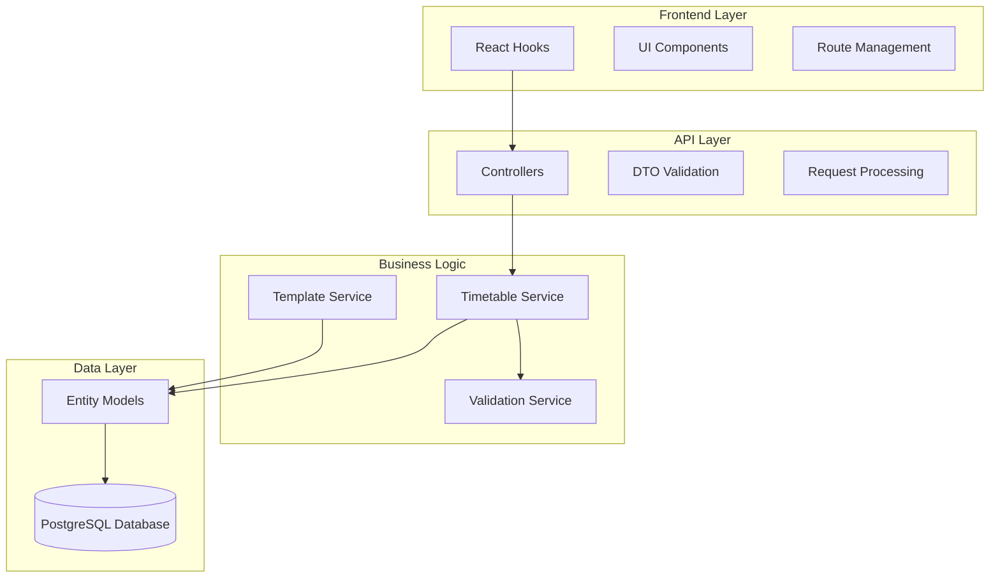
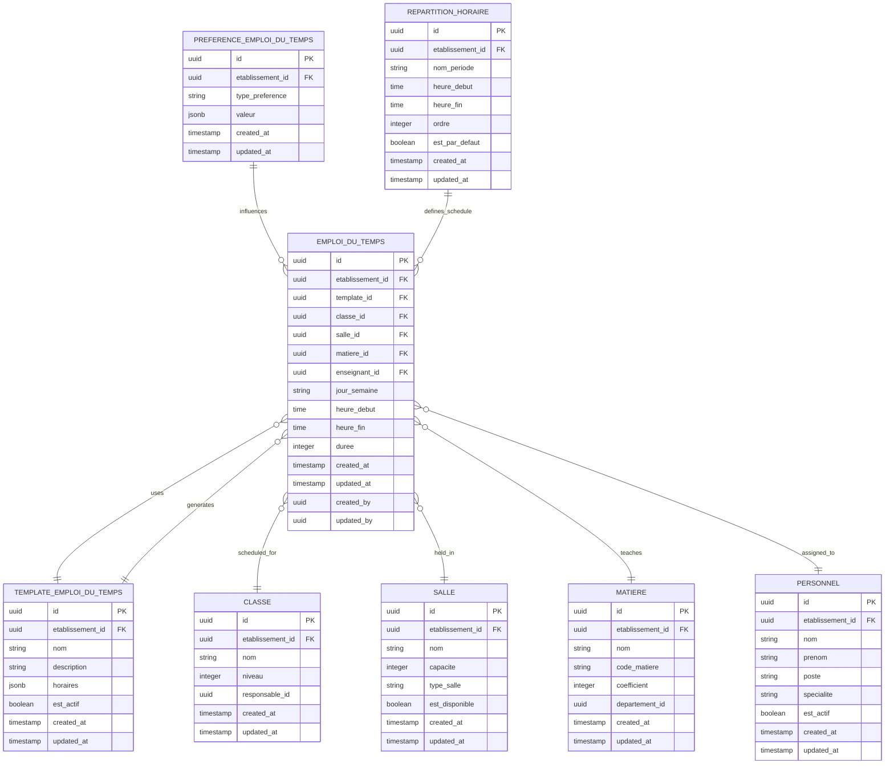
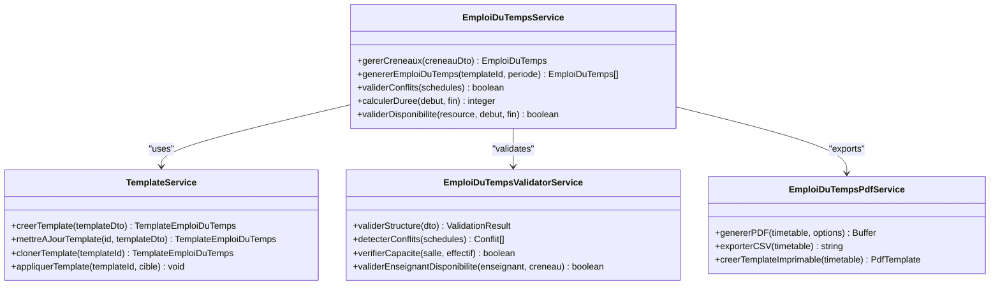
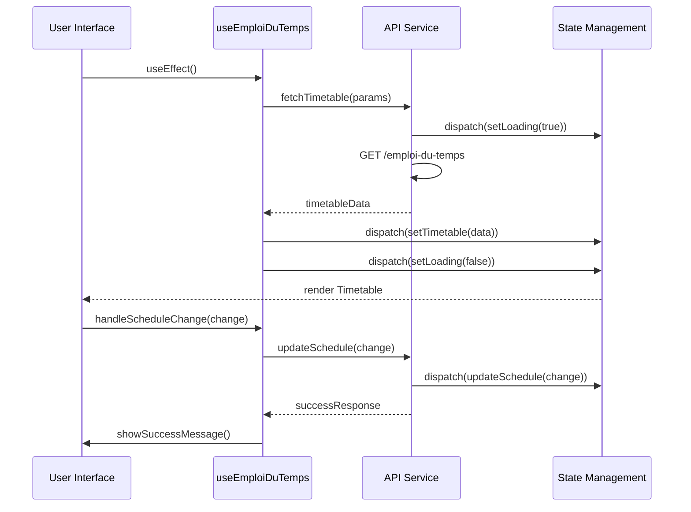
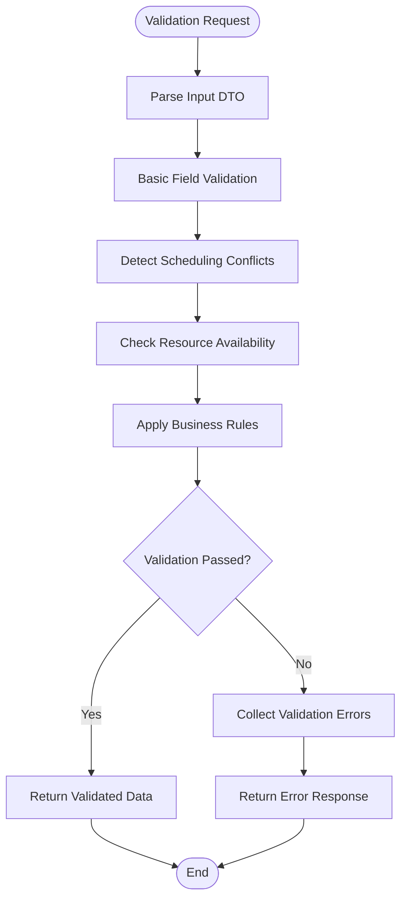
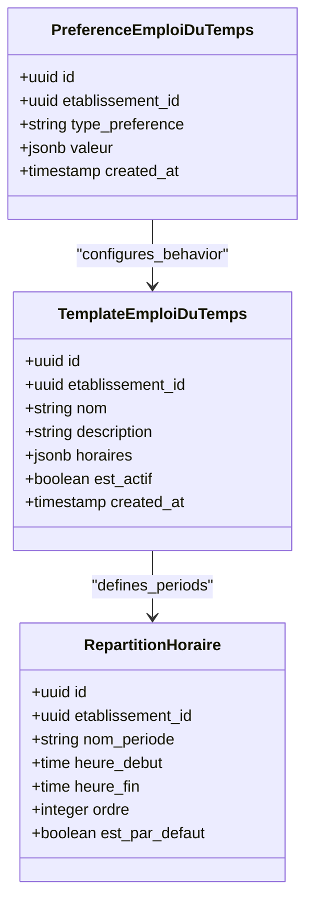

# Emploi du Temps Module

<cite>
**Referenced Files in This Document**
- [063-creer-module-emploi-du-temps.sql](file://backend/database/migrations/063-creer-module-emploi-du-temps.sql)
- [065-creer-templates-emploi-du-temps.sql](file://backend/database/migrations/065-creer-templates-emploi-du-temps.sql)
- [seed-emploi-du-temps.ts](file://backend/database/seeds/seed-emploi-du-temps.ts)
- [emploi-du-temps.controller.ts](file://backend/src/modules/emploi-du-temps/controllers/emploi-du-temps.controller.ts)
- [repartition-horaire.controller.ts](file://backend/src/modules/emploi-du-temps/controllers/repartition-horaire.controller.ts)
- [emploi-du-temps.dto.ts](file://backend/src/modules/emploi-du-temps/dto/emploi-du-temps.dto.ts)
- [emploi-du-temps.entity.ts](file://backend/src/modules/emploi-du-temps/entities/emploi-du-temps.entity.ts)
- [preference-emploi-du-temps.entity.ts](file://backend/src/modules/emploi-du-temps/entities/preference-emploi-du-temps.entity.ts)
- [template-emploi-du-temps.entity.ts](file://backend/src/modules/emploi-du-temps/entities/template-emploi-du-temps.entity.ts)
- [repartition-horaire.entity.ts](file://backend/src/modules/emploi-du-temps/entities/repartition-horaire.entity.ts)
- [emploi-du-temps-validator.service.ts](file://backend/src/modules/emploi-du-temps/services/emploi-du-temps-validator.service.ts)
- [emploi-du-temps.pdf.ts](file://backend/src/modules/emploi-du-temps/services/emploi-du-temps.pdf.ts)
- [emploi-du-temps.service.ts](file://backend/src/modules/emploi-du-temps/services/emploi-du-temps.service.ts)
- [template.service.ts](file://backend/src/modules/emploi-du-temps/services/template.service.ts)
- [use-emploi-du-temps.ts](file://frontend/src/features/emploi-du-temps/hooks/use-emploi-du-temps.ts)
- [activer-emploi-du-temps.sh](file://scripts/activer-emploi-du-temps.sh)
</cite>

## Table of Contents
1. [Introduction](#introduction)
2. [Module Architecture](#module-architecture)
3. [Database Schema](#database-schema)
4. [Backend Services](#backend-services)
5. [Frontend Implementation](#frontend-implementation)
6. [API Endpoints](#api-endpoints)
7. [Validation and PDF Generation](#validation-and-pdf-generation)
8. [Template Management](#template-management)
9. [Integration and Activation](#integration-and-activation)
10. [Troubleshooting Guide](#troubleshooting-guide)

## Introduction

The Emploi du Temps (Timetable) module is a comprehensive scheduling system integrated into the eLISAschool educational management platform. This module enables schools to manage academic timetables, teacher schedules, classroom allocations, and student class schedules efficiently. The system supports multiple institutions (multi-tenant) and provides flexible template-based scheduling capabilities.

The module was introduced in migration 063 and enhanced with template functionality in migration 065, representing a significant addition to the school management ecosystem. It integrates seamlessly with the existing academic structure and provides robust validation mechanisms for schedule conflicts.

## Module Architecture

The Emploi du Temps module follows a layered architecture pattern with clear separation of concerns:



**Diagram sources**
- [emploi-du-temps.controller.ts](file://backend/src/modules/emploi-du-temps/controllers/emploi-du-temps.controller.ts)
- [emploi-du-temps.service.ts](file://backend/src/modules/emploi-du-temps/services/emploi-du-temps.service.ts)
- [emploi-du-temps.entity.ts](file://backend/src/modules/emploi-du-temps/entities/emploi-du-temps.entity.ts)

The architecture ensures scalability, maintainability, and multi-tenancy support through proper separation of frontend presentation, backend business logic, and data persistence layers.

**Section sources**
- [emploi-du-temps.controller.ts](file://backend/src/modules/emploi-du-temps/controllers/emploi-du-temps.controller.ts)
- [emploi-du-temps.service.ts](file://backend/src/modules/emploi-du-temps/services/emploi-du-temps.service.ts)

## Database Schema

The Emploi du Temps module utilizes a comprehensive database schema designed to handle complex scheduling requirements across multiple academic institutions.



**Diagram sources**
- [emploi-du-temps.entity.ts](file://backend/src/modules/emploi-du-temps/entities/emploi-du-temps.entity.ts)
- [template-emploi-du-temps.entity.ts](file://backend/src/modules/emploi-du-temps/entities/template-emploi-du-temps.entity.ts)
- [preference-emploi-du-temps.entity.ts](file://backend/src/modules/emploi-du-temps/entities/preference-emploi-du-temps.entity.ts)
- [repartition-horaire.entity.ts](file://backend/src/modules/emploi-du-temps/entities/repartition-horaire.entity.ts)

The schema supports complex relationships including multi-tenancy through institution-specific UUIDs, flexible scheduling with template-based generation, and comprehensive validation through foreign key constraints.

**Section sources**
- [063-creer-module-emploi-du-temps.sql](file://backend/database/migrations/063-creer-module-emploi-du-temps.sql)
- [065-creer-templates-emploi-du-temps.sql](file://backend/database/migrations/065-creer-templates-emploi-du-temps.sql)

## Backend Services

The backend services layer provides comprehensive functionality for timetable management, including creation, validation, conflict detection, and PDF generation capabilities.

### Core Service Architecture



**Diagram sources**
- [emploi-du-temps.service.ts](file://backend/src/modules/emploi-du-temps/services/emploi-du-temps.service.ts)
- [template.service.ts](file://backend/src/modules/emploi-du-temps/services/template.service.ts)
- [emploi-du-temps-validator.service.ts](file://backend/src/modules/emploi-du-temps/services/emploi-du-temps-validator.service.ts)
- [emploi-du-temps.pdf.ts](file://backend/src/modules/emploi-du-temps/services/emploi-du-temps.pdf.ts)

### Service Responsibilities

The EmploiDuTempsService handles primary timetable operations including schedule creation, modification, and retrieval. It coordinates with other services to ensure data integrity and business rule compliance.

The TemplateService manages template-based scheduling, allowing administrators to create reusable schedule patterns that can be applied across different classes, teachers, or periods.

The EmploiDuTempsValidatorService performs comprehensive validation checks including conflict detection, resource availability verification, and business rule enforcement.

The EmploiDuTempsPdfService provides export capabilities for generating printable timetables in various formats.

**Section sources**
- [emploi-du-temps.service.ts](file://backend/src/modules/emploi-du-temps/services/emploi-du-temps.service.ts)
- [template.service.ts](file://backend/src/modules/emploi-du-temps/services/template.service.ts)
- [emploi-du-temps-validator.service.ts](file://backend/src/modules/emploi-du-temps/services/emploi-du-temps-validator.service.ts)
- [emploi-du-temps.pdf.ts](file://backend/src/modules/emploi-du-temps/services/emploi-du-temps.pdf.ts)

## Frontend Implementation

The frontend implementation provides a comprehensive user interface for timetable management with React hooks, TypeScript integration, and responsive design principles.

### Hook-Based Architecture



**Diagram sources**
- [use-emploi-du-temps.ts](file://frontend/src/features/emploi-du-temps/hooks/use-emploi-du-temps.ts)

The frontend hook system provides centralized state management for timetable data, automatic loading states, error handling, and real-time updates. The implementation follows React best practices with proper TypeScript typing and async/await patterns.

### Component Integration

The frontend integrates with the existing eLISAschool component library, utilizing shared UI components for forms, modals, and data displays. The timetable interface supports drag-and-drop functionality, real-time collaboration features, and mobile-responsive design.

**Section sources**
- [use-emploi-du-temps.ts](file://frontend/src/features/emploi-du-temps/hooks/use-emploi-du-temps.ts)

## API Endpoints

The Emploi du Temps module exposes RESTful APIs for comprehensive timetable management operations across multiple HTTP methods and endpoints.

### Primary Endpoints

| Endpoint | Method | Description | Authentication |
|----------|--------|-------------|----------------|
| `/emploi-du-temps` | GET | Retrieve all timetables for current institution | Required |
| `/emploi-du-temps` | POST | Create new timetable entry | Required |
| `/emploi-du-temps/:id` | GET | Get specific timetable by ID | Required |
| `/emploi-du-temps/:id` | PUT | Update timetable entry | Required |
| `/emploi-du-temps/:id` | DELETE | Remove timetable entry | Required |
| `/emploi-du-temps/generate` | POST | Generate timetable from template | Required |
| `/emploi-du-temps/conflicts` | POST | Detect scheduling conflicts | Required |
| `/emploi-du-temps/pdf` | POST | Export timetable to PDF | Required |

### Advanced Operations

| Endpoint | Method | Description | Authentication |
|----------|--------|-------------|----------------|
| `/emploi-du-temps/templates` | GET | List available templates | Required |
| `/emploi-du-temps/templates` | POST | Create new template | Required |
| `/emploi-du-temps/templates/:id` | GET | Get template details | Required |
| `/emploi-du-temps/templates/:id` | PUT | Update template | Required |
| `/emploi-du-temps/templates/:id` | DELETE | Delete template | Required |
| `/emploi-du-temps/preferences` | GET | Get scheduling preferences | Required |
| `/emploi-du-temps/preferences` | POST | Set scheduling preferences | Required |

### Request and Response Patterns

The API follows consistent patterns for request validation, response formatting, and error handling. All endpoints return standardized JSON responses with appropriate HTTP status codes and error messages.

**Section sources**
- [emploi-du-temps.controller.ts](file://backend/src/modules/emploi-du-temps/controllers/emploi-du-temps.controller.ts)
- [repartition-horaire.controller.ts](file://backend/src/modules/emploi-du-temps/controllers/repartition-horaire.controller.ts)

## Validation and PDF Generation

The module implements comprehensive validation mechanisms and PDF generation capabilities to ensure data integrity and provide professional output formats.

### Validation Workflow



**Diagram sources**
- [emploi-du-temps-validator.service.ts](file://backend/src/modules/emploi-du-temps/services/emploi-du-temps-validator.service.ts)

The validation system performs multi-layered checks including field format validation, logical consistency verification, resource capacity assessment, and institutional policy compliance.

### PDF Generation Pipeline

The PDF generation service creates professional timetable documents with customizable layouts, institutional branding, and export-friendly formats suitable for printing and digital distribution.

**Section sources**
- [emploi-du-temps-validator.service.ts](file://backend/src/modules/emploi-du-temps/services/emploi-du-temps-validator.service.ts)
- [emploi-du-temps.pdf.ts](file://backend/src/modules/emploi-du-temps/services/emploi-du-temps.pdf.ts)

## Template Management

Template-based scheduling represents a core feature of the Emploi du Temps module, enabling administrators to create reusable schedule patterns that can be applied across multiple scenarios.

### Template Architecture



**Diagram sources**
- [template-emploi-du-temps.entity.ts](file://backend/src/modules/emploi-du-temps/entities/template-emploi-du-temps.entity.ts)
- [preference-emploi-du-temps.entity.ts](file://backend/src/modules/emploi-du-temps/entities/preference-emploi-du-temps.entity.ts)
- [repartition-horaire.entity.ts](file://backend/src/modules/emploi-du-temps/entities/repartition-horaire.entity.ts)

### Template Application Process

Templates can be applied to generate complete timetables for classes, teachers, or entire institutions. The system supports template cloning, customization, and batch application operations.

**Section sources**
- [template.service.ts](file://backend/src/modules/emploi-du-temps/services/template.service.ts)
- [template-emploi-du-temps.entity.ts](file://backend/src/modules/emploi-du-temps/entities/template-emploi-du-temps.entity.ts)

## Integration and Activation

The Emploi du Temps module requires specific activation procedures and integration steps to ensure proper deployment and functionality within the eLISAschool ecosystem.

### Activation Script

The activation process involves several coordinated steps managed through the dedicated shell script:

```bash
#!/bin/bash
# Activation script for Emploi du Temps module

echo "Activating Emploi du Temps module..."
echo "Step 1: Running database migrations"

# Apply timetable-related migrations
npm run migrate -- --migrations=063,065

echo "Step 2: Seeding timetable data"
npm run seed -- --seed=seed-emploi-du-temps

echo "Step 3: Updating module permissions"
npm run update-permissions -- --module=emploi-du-temps

echo "Step 4: Restarting services"
npm run restart-services

echo "Emploi du Temps module activated successfully!"
```

### Integration Requirements

The module integrates with existing eLISAschool infrastructure including:

- Multi-tenant architecture support
- Role-based access control integration
- Audit logging and compliance features
- Notification system integration
- Reporting and analytics capabilities

**Section sources**
- [activer-emploi-du-temps.sh](file://scripts/activer-emploi-du-temps.sh)

## Troubleshooting Guide

Common issues and solutions for the Emploi du Temps module:

### Database Migration Issues

**Problem**: Migration fails during installation
**Solution**: Check database connectivity and run individual migrations with verbose logging

**Problem**: Template data not loading
**Solution**: Verify seed data integrity and re-run seeding process

### API Integration Problems

**Problem**: 403 Forbidden errors accessing timetable endpoints
**Solution**: Verify user permissions and role assignments for timetable module

**Problem**: Validation errors on schedule creation
**Solution**: Review validation rules and ensure all required fields are properly populated

### Performance Issues

**Problem**: Slow timetable loading times
**Solution**: Check database indexes and optimize queries for large datasets

**Problem**: Memory leaks in frontend components
**Solution**: Implement proper cleanup in React hooks and component unmounting

### PDF Generation Failures

**Problem**: PDF export errors
**Solution**: Verify PDF generation dependencies and file system permissions

**Section sources**
- [emploi-du-temps.controller.ts](file://backend/src/modules/emploi-du-temps/controllers/emploi-du-temps.controller.ts)
- [emploi-du-temps.service.ts](file://backend/src/modules/emploi-du-temps/services/emploi-du-temps.service.ts)