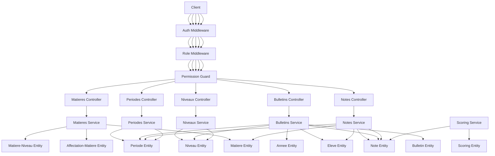
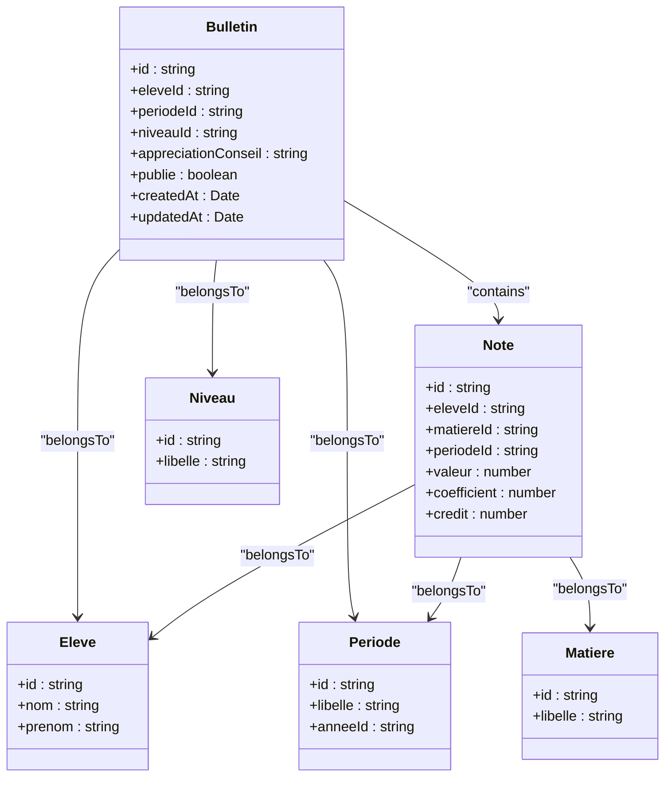
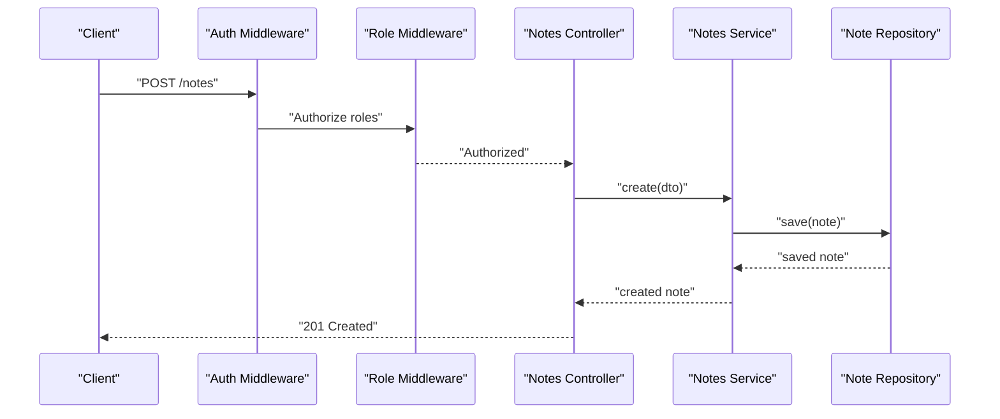
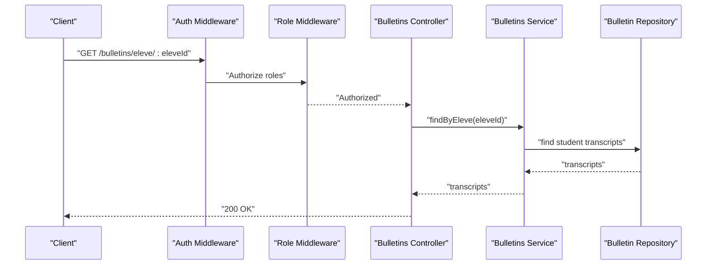
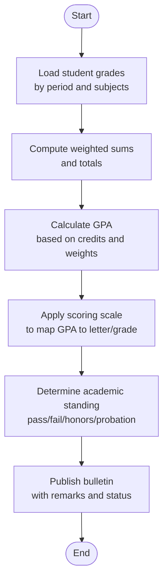
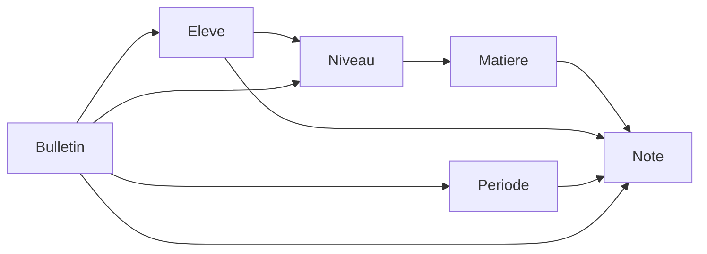
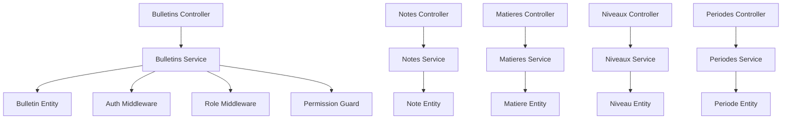

# Grading System & Bulletins

<cite>
**Referenced Files in This Document**
- [bulletins.controller.ts](file://backend/src/modules/bulletins/controllers/bulletins.controller.ts)
- [bulletins.dto.ts](file://backend/src/modules/bulletins/dto/bulletins.dto.ts)
- [bulletin.entity.ts](file://backend/src/modules/bulletins/entities/bulletin.entity.ts)
- [bulletins.service.ts](file://backend/src/modules/bulletins/services/bulletins.service.ts)
- [notes.controller.ts](file://backend/src/modules/notes/controllers/notes.controller.ts)
- [note.dto.ts](file://backend/src/modules/notes/dto/note.dto.ts)
- [note.entity.ts](file://backend/src/modules/notes/entities/note.entity.ts)
- [notes.service.ts](file://backend/src/modules/notes/services/notes.service.ts)
- [matieres.controller.ts](file://backend/src/modules/matieres/controllers/matieres.controller.ts)
- [matieres.dto.ts](file://backend/src/modules/matieres/dto/matieres.dto.ts)
- [matiere.entity.ts](file://backend/src/modules/matieres/entities/matiere.entity.ts)
- [affectation-matiere.entity.ts](file://backend/src/modules/matieres/entities/affectation-matiere.entity.ts)
- [matiere-niveau.entity.ts](file://backend/src/modules/matieres/entities/matiere-niveau.entity.ts)
- [matieres.service.ts](file://backend/src/modules/matieres/services/matieres.service.ts)
- [niveaux.controller.ts](file://backend/src/modules/niveaux/controllers/niveaux.controller.ts)
- [niveau.entity.ts](file://backend/src/modules/niveaux/entities/niveau.entity.ts)
- [niveaux.service.ts](file://backend/src/modules/niveaux/services/niveaux.service.ts)
- [periodes.controller.ts](file://backend/src/modules/periodes/controllers/periodes.controller.ts)
- [periode.entity.ts](file://backend/src/modules/periodes/entities/periode.entity.ts)
- [periodes.service.ts](file://backend/src/modules/periodes/services/periodes.service.ts)
- [scoring.entity.ts](file://backend/src/modules/scoring/entities/scoring.entity.ts)
- [scoring.service.ts](file://backend/src/modules/scoring/services/scoring.service.ts)
- [eleves.controller.ts](file://backend/src/modules/eleves/controllers/eleves.controller.ts)
- [eleve.entity.ts](file://backend/src/modules/eleves/entities/eleve.entity.ts)
- [eleves.service.ts](file://backend/src/modules/eleves/services/eleves.service.ts)
- [annee-scolaire.entity.ts](file://backend/src/modules/annees-scolaires/entities/annee-scolaire.entity.ts)
- [annees-scolaires.service.ts](file://backend/src/modules/annees-scolaires/services/annees-scolaires.service.ts)
- [auth.middleware.ts](file://backend/src/modules/auth/middlewares/auth.middleware.ts)
- [role.middleware.ts](file://backend/src/modules/auth/middlewares/role.middleware.ts)
- [permission.guard.ts](file://backend/src/modules/auth/guards/permission.guard.ts)
- [index.ts](file://backend/src/modules/bulletins/index.ts)
- [index.ts](file://backend/src/modules/notes/index.ts)
- [index.ts](file://backend/src/modules/matieres/index.ts)
- [index.ts](file://backend/src/modules/niveaux/index.ts)
- [index.ts](file://backend/src/modules/periodes/index.ts)
- [index.ts](file://backend/src/modules/scoring/index.ts)
- [index.ts](file://backend/src/modules/eleves/index.ts)
- [index.ts](file://backend/src/modules/annees-scolaires/index.ts)
</cite>

## Table of Contents
1. [Introduction](#introduction)
2. [Project Structure](#project-structure)
3. [Core Components](#core-components)
4. [Architecture Overview](#architecture-overview)
5. [Detailed Component Analysis](#detailed-component-analysis)
6. [Dependency Analysis](#dependency-analysis)
7. [Performance Considerations](#performance-considerations)
8. [Troubleshooting Guide](#troubleshooting-guide)
9. [Conclusion](#conclusion)
10. [Appendices](#appendices)

## Introduction
This document describes the grading system and bulletin generation capabilities implemented in the backend. It explains the hierarchical relationships among grades, subjects, periods, levels, and student records, and documents the bulletin entity structure used for report card generation. It also outlines grade calculation algorithms, academic performance tracking, and the service layer responsible for grade recording, transcript generation, and academic evaluation. Examples of workflows are included for grade entry, bulletin compilation, GPA calculations, and academic standing determination. Special attention is given to weighted grading systems, credit hour calculations, and international grading standards.

## Project Structure
The grading and bulletin subsystem is organized around several core modules:
- Notes: stores individual grade entries per subject and student.
- Matières: manages subjects and their association to levels and teachers.
- Niveaux: defines educational levels and tracks level-specific curriculum.
- Périodes: defines academic periods (terms/trimesters/semesters).
- Bulletins: compiles student records into official transcripts.
- Scoring: defines grading scales and conversion rules.
- Élèves: maintains student profiles and enrollment.
- Année scolaire: defines academic year boundaries.

```mermaid
graph TB
subgraph "Grades"
Notes["Notes Module<br/>Entities: note.entity.ts<br/>Services: notes.service.ts<br/>Controllers: notes.controller.ts"]
end
subgraph "Subjects"
Matieres["Matieres Module<br/>Entities: matiere.entity.ts<br/>Affectation: affectation-matiere.entity.ts<br/>Niveau Link: matiere-niveau.entity.ts<br/>Services: matieres.service.ts<br/>Controllers: matieres.controller.ts"]
end
subgraph "Levels"
Niveaux["Niveaux Module<br/>Entities: niveau.entity.ts<br/>Services: niveaux.service.ts<br/>Controllers: niveaux.controller.ts"]
end
subgraph "Periods"
Periodes["Périodes Module<br/>Entities: periode.entity.ts<br/>Services: periodes.service.ts<br/>Controllers: periodes.controller.ts"]
end
subgraph "Transcripts"
Bulletins["Bulletins Module<br/>Entities: bulletin.entity.ts<br/>Services: bulletins.service.ts<br/>Controllers: bulletins.controller.ts"]
end
subgraph "Scoring"
Scoring["Scoring Module<br/>Entities: scoring.entity.ts<br/>Services: scoring.service.ts"]
end
subgraph "Students"
Eleves["Élèves Module<br/>Entities: eleve.entity.ts<br/>Services: eleves.service.ts<br/>Controllers: eleves.controller.ts"]
end
subgraph "Academic Year"
Annee["Année Scolaire Module<br/>Entities: annee-scolaire.entity.ts<br/>Services: annees-scolaires.service.ts"]
end
Notes --> Matieres
Notes --> Periodes
Notes --> Eleves
Matieres --> Niveaux
Bulletins --> Notes
Bulletins --> Eleves
Bulletins --> Periodes
Bulletins --> Niveaux
Scoring --> Notes
Eleves --> Annee
```

**Diagram sources**
- [bulletins.controller.ts:33-49](file://backend/src/modules/bulletins/controllers/bulletins.controller.ts#L33-L49)
- [bulletins.service.ts](file://backend/src/modules/bulletins/services/bulletins.service.ts)
- [bulletin.entity.ts](file://backend/src/modules/bulletins/entities/bulletin.entity.ts)
- [notes.controller.ts](file://backend/src/modules/notes/controllers/notes.controller.ts)
- [notes.service.ts](file://backend/src/modules/notes/services/notes.service.ts)
- [note.entity.ts](file://backend/src/modules/notes/entities/note.entity.ts)
- [matieres.controller.ts](file://backend/src/modules/matieres/controllers/matieres.controller.ts)
- [matieres.service.ts](file://backend/src/modules/matieres/services/matieres.service.ts)
- [matiere.entity.ts](file://backend/src/modules/matieres/entities/matiere.entity.ts)
- [affectation-matiere.entity.ts](file://backend/src/modules/matieres/entities/affectation-matiere.entity.ts)
- [matiere-niveau.entity.ts](file://backend/src/modules/matieres/entities/matiere-niveau.entity.ts)
- [niveaux.controller.ts](file://backend/src/modules/niveaux/controllers/niveaux.controller.ts)
- [niveaux.service.ts](file://backend/src/modules/niveaux/services/niveaux.service.ts)
- [niveau.entity.ts](file://backend/src/modules/niveaux/entities/niveau.entity.ts)
- [periodes.controller.ts](file://backend/src/modules/periodes/controllers/periodes.controller.ts)
- [periodes.service.ts](file://backend/src/modules/periodes/services/periodes.service.ts)
- [periode.entity.ts](file://backend/src/modules/periodes/entities/periode.entity.ts)
- [scoring.entity.ts](file://backend/src/modules/scoring/entities/scoring.entity.ts)
- [scoring.service.ts](file://backend/src/modules/scoring/services/scoring.service.ts)
- [eleves.controller.ts](file://backend/src/modules/eleves/controllers/eleves.controller.ts)
- [eleves.service.ts](file://backend/src/modules/eleves/services/eleves.service.ts)
- [eleve.entity.ts](file://backend/src/modules/eleves/entities/eleve.entity.ts)
- [annee-scolaire.entity.ts](file://backend/src/modules/annees-scolaires/entities/annee-scolaire.entity.ts)
- [annees-scolaires.service.ts](file://backend/src/modules/annees-scolaires/services/annees-scolaires.service.ts)

**Section sources**
- [bulletins.controller.ts:33-49](file://backend/src/modules/bulletins/controllers/bulletins.controller.ts#L33-L49)
- [bulletins.service.ts](file://backend/src/modules/bulletins/services/bulletins.service.ts)
- [bulletin.entity.ts](file://backend/src/modules/bulletins/entities/bulletin.entity.ts)
- [notes.controller.ts](file://backend/src/modules/notes/controllers/notes.controller.ts)
- [notes.service.ts](file://backend/src/modules/notes/services/notes.service.ts)
- [note.entity.ts](file://backend/src/modules/notes/entities/note.entity.ts)
- [matieres.controller.ts](file://backend/src/modules/matieres/controllers/matieres.controller.ts)
- [matieres.service.ts](file://backend/src/modules/matieres/services/matieres.service.ts)
- [matiere.entity.ts](file://backend/src/modules/matieres/entities/matiere.entity.ts)
- [affectation-matiere.entity.ts](file://backend/src/modules/matieres/entities/affectation-matiere.entity.ts)
- [matiere-niveau.entity.ts](file://backend/src/modules/matieres/entities/matiere-niveau.entity.ts)
- [niveaux.controller.ts](file://backend/src/modules/niveaux/controllers/niveaux.controller.ts)
- [niveaux.service.ts](file://backend/src/modules/niveaux/services/niveaux.service.ts)
- [niveau.entity.ts](file://backend/src/modules/niveaux/entities/niveau.entity.ts)
- [periodes.controller.ts](file://backend/src/modules/periodes/controllers/periodes.controller.ts)
- [periodes.service.ts](file://backend/src/modules/periodes/services/periodes.service.ts)
- [periode.entity.ts](file://backend/src/modules/periodes/entities/periode.entity.ts)
- [scoring.entity.ts](file://backend/src/modules/scoring/entities/scoring.entity.ts)
- [scoring.service.ts](file://backend/src/modules/scoring/services/scoring.service.ts)
- [eleves.controller.ts](file://backend/src/modules/eleves/controllers/eleves.controller.ts)
- [eleves.service.ts](file://backend/src/modules/eleves/services/eleves.service.ts)
- [eleve.entity.ts](file://backend/src/modules/eleves/entities/eleve.entity.ts)
- [annee-scolaire.entity.ts](file://backend/src/modules/annees-scolaires/entities/annee-scolaire.entity.ts)
- [annees-scolaires.service.ts](file://backend/src/modules/annees-scolaires/services/annees-scolaires.service.ts)

## Core Components
- Notes: Stores raw grade entries linked to students, subjects, and periods. Supports CRUD operations and validation via DTOs.
- Matières: Manages subjects and their relationships to levels and teachers, enabling curriculum alignment.
- Niveaux: Defines educational levels and supports level-specific subject mapping.
- Périodes: Defines academic periods and provides period-scoped aggregation for grades.
- Bulletins: Compiles student records into official transcripts, aggregating grades and computing averages.
- Scoring: Provides grading scale definitions and conversion rules for GPA and letter grades.
- Élèves: Maintains student identities and enrollment records.
- Année Scolaire: Defines academic year boundaries used for period validation and transcript closure.

**Section sources**
- [note.entity.ts](file://backend/src/modules/notes/entities/note.entity.ts)
- [note.dto.ts](file://backend/src/modules/notes/dto/note.dto.ts)
- [notes.service.ts](file://backend/src/modules/notes/services/notes.service.ts)
- [matiere.entity.ts](file://backend/src/modules/matieres/entities/matiere.entity.ts)
- [affectation-matiere.entity.ts](file://backend/src/modules/matieres/entities/affectation-matiere.entity.ts)
- [matiere-niveau.entity.ts](file://backend/src/modules/matieres/entities/matiere-niveau.entity.ts)
- [niveau.entity.ts](file://backend/src/modules/niveaux/entities/niveau.entity.ts)
- [periode.entity.ts](file://backend/src/modules/periodes/entities/periode.entity.ts)
- [bulletin.entity.ts](file://backend/src/modules/bulletins/entities/bulletin.entity.ts)
- [scoring.entity.ts](file://backend/src/modules/scoring/entities/scoring.entity.ts)
- [eleve.entity.ts](file://backend/src/modules/eleves/entities/eleve.entity.ts)
- [annee-scolaire.entity.ts](file://backend/src/modules/annees-scolaires/entities/annee-scolaire.entity.ts)

## Architecture Overview
The system follows a layered architecture:
- Controllers handle HTTP requests and delegate to services.
- Services orchestrate domain logic, enforce permissions, and coordinate repositories.
- Entities define the persistent model and relationships.
- DTOs validate and sanitize inputs.
- Guards and middlewares secure endpoints and enforce roles.



**Diagram sources**
- [bulletins.controller.ts:33-49](file://backend/src/modules/bulletins/controllers/bulletins.controller.ts#L33-L49)
- [notes.controller.ts](file://backend/src/modules/notes/controllers/notes.controller.ts)
- [matieres.controller.ts](file://backend/src/modules/matieres/controllers/matieres.controller.ts)
- [niveaux.controller.ts](file://backend/src/modules/niveaux/controllers/niveaux.controller.ts)
- [periodes.controller.ts](file://backend/src/modules/periodes/controllers/periodes.controller.ts)
- [bulletins.service.ts](file://backend/src/modules/bulletins/services/bulletins.service.ts)
- [notes.service.ts](file://backend/src/modules/notes/services/notes.service.ts)
- [matieres.service.ts](file://backend/src/modules/matieres/services/matieres.service.ts)
- [niveaux.service.ts](file://backend/src/modules/niveaux/services/niveaux.service.ts)
- [periodes.service.ts](file://backend/src/modules/periodes/services/periodes.service.ts)
- [scoring.service.ts](file://backend/src/modules/scoring/services/scoring.service.ts)
- [bulletin.entity.ts](file://backend/src/modules/bulletins/entities/bulletin.entity.ts)
- [note.entity.ts](file://backend/src/modules/notes/entities/note.entity.ts)
- [matiere.entity.ts](file://backend/src/modules/matieres/entities/matiere.entity.ts)
- [affectation-matiere.entity.ts](file://backend/src/modules/matieres/entities/affectation-matiere.entity.ts)
- [matiere-niveau.entity.ts](file://backend/src/modules/matieres/entities/matiere-niveau.entity.ts)
- [niveau.entity.ts](file://backend/src/modules/niveaux/entities/niveau.entity.ts)
- [periode.entity.ts](file://backend/src/modules/periodes/entities/periode.entity.ts)
- [scoring.entity.ts](file://backend/src/modules/scoring/entities/scoring.entity.ts)
- [eleve.entity.ts](file://backend/src/modules/eleves/entities/eleve.entity.ts)
- [annee-scolaire.entity.ts](file://backend/src/modules/annees-scolaires/entities/annee-scolaire.entity.ts)
- [auth.middleware.ts](file://backend/src/modules/auth/middlewares/auth.middleware.ts)
- [role.middleware.ts](file://backend/src/modules/auth/middlewares/role.middleware.ts)
- [permission.guard.ts](file://backend/src/modules/auth/guards/permission.guard.ts)

## Detailed Component Analysis

### Bulletin Entity and Report Card Generation
The bulletin entity aggregates student performance across subjects and periods. It encapsulates:
- Student identity
- Period and level references
- Subject grades and computed averages
- Academic standing and remarks



**Diagram sources**
- [bulletin.entity.ts](file://backend/src/modules/bulletins/entities/bulletin.entity.ts)
- [note.entity.ts](file://backend/src/modules/notes/entities/note.entity.ts)
- [eleve.entity.ts](file://backend/src/modules/eleves/entities/eleve.entity.ts)
- [periode.entity.ts](file://backend/src/modules/periodes/entities/periode.entity.ts)
- [niveau.entity.ts](file://backend/src/modules/niveaux/entities/niveau.entity.ts)
- [matiere.entity.ts](file://backend/src/modules/matieres/entities/matiere.entity.ts)

**Section sources**
- [bulletin.entity.ts](file://backend/src/modules/bulletins/entities/bulletin.entity.ts)
- [bulletins.dto.ts:9-18](file://backend/src/modules/bulletins/dto/bulletins.dto.ts#L9-L18)
- [bulletins.controller.ts:33-49](file://backend/src/modules/bulletins/controllers/bulletins.controller.ts#L33-L49)
- [bulletins.service.ts](file://backend/src/modules/bulletins/services/bulletins.service.ts)

### Grade Recording Workflow (Notes)
Grade entry is handled by the notes module. The workflow includes:
- Validation of inputs via DTOs
- Persistence of grade records linked to student, subject, and period
- Optional coefficient and credit-hour support for weighted calculations



**Diagram sources**
- [notes.controller.ts](file://backend/src/modules/notes/controllers/notes.controller.ts)
- [note.dto.ts](file://backend/src/modules/notes/dto/note.dto.ts)
- [notes.service.ts](file://backend/src/modules/notes/services/notes.service.ts)
- [note.entity.ts](file://backend/src/modules/notes/entities/note.entity.ts)
- [auth.middleware.ts](file://backend/src/modules/auth/middlewares/auth.middleware.ts)
- [role.middleware.ts](file://backend/src/modules/auth/middlewares/role.middleware.ts)

**Section sources**
- [notes.controller.ts](file://backend/src/modules/notes/controllers/notes.controller.ts)
- [note.dto.ts](file://backend/src/modules/notes/dto/note.dto.ts)
- [notes.service.ts](file://backend/src/modules/notes/services/notes.service.ts)
- [note.entity.ts](file://backend/src/modules/notes/entities/note.entity.ts)

### Bulletin Compilation and Transcript Generation
The bulletin service compiles grades into a structured transcript:
- Filters grades by student, period, and optional subject
- Aggregates subject averages using coefficients and credits
- Computes overall GPA and determines academic standing
- Applies remarks and publication controls



**Diagram sources**
- [bulletins.controller.ts:33-38](file://backend/src/modules/bulletins/controllers/bulletins.controller.ts#L33-L38)
- [bulletins.service.ts](file://backend/src/modules/bulletins/services/bulletins.service.ts)
- [bulletin.entity.ts](file://backend/src/modules/bulletins/entities/bulletin.entity.ts)
- [auth.middleware.ts](file://backend/src/modules/auth/middlewares/auth.middleware.ts)
- [role.middleware.ts](file://backend/src/modules/auth/middlewares/role.middleware.ts)

**Section sources**
- [bulletins.controller.ts:33-38](file://backend/src/modules/bulletins/controllers/bulletins.controller.ts#L33-L38)
- [bulletins.service.ts](file://backend/src/modules/bulletins/services/bulletins.service.ts)
- [bulletins.dto.ts:9-18](file://backend/src/modules/bulletins/dto/bulletins.dto.ts#L9-L18)

### Academic Standing Determination and GPA Calculation
Academic standing and GPA are derived from aggregated grades:
- Weighted average computation using coefficients and credits
- Conversion to letter grades or numeric scales via scoring rules
- Determination of honors, passing status, and probation thresholds



**Diagram sources**
- [scoring.entity.ts](file://backend/src/modules/scoring/entities/scoring.entity.ts)
- [scoring.service.ts](file://backend/src/modules/scoring/services/scoring.service.ts)
- [bulletin.entity.ts](file://backend/src/modules/bulletins/entities/bulletin.entity.ts)
- [note.entity.ts](file://backend/src/modules/notes/entities/note.entity.ts)

**Section sources**
- [scoring.entity.ts](file://backend/src/modules/scoring/entities/scoring.entity.ts)
- [scoring.service.ts](file://backend/src/modules/scoring/services/scoring.service.ts)
- [bulletin.entity.ts](file://backend/src/modules/bulletins/entities/bulletin.entity.ts)
- [note.entity.ts](file://backend/src/modules/notes/entities/note.entity.ts)

### Hierarchical Relationships: Grades, Subjects, Levels, and Students
The system enforces a strict hierarchy:
- Students are enrolled in levels.
- Levels define subject offerings.
- Teachers are assigned to subjects.
- Grades are recorded against subjects within periods for each student.
- Bulletins compile these records into transcripts.



**Diagram sources**
- [eleve.entity.ts](file://backend/src/modules/eleves/entities/eleve.entity.ts)
- [niveau.entity.ts](file://backend/src/modules/niveaux/entities/niveau.entity.ts)
- [matiere.entity.ts](file://backend/src/modules/matieres/entities/matiere.entity.ts)
- [affectation-matiere.entity.ts](file://backend/src/modules/matieres/entities/affectation-matiere.entity.ts)
- [matiere-niveau.entity.ts](file://backend/src/modules/matieres/entities/matiere-niveau.entity.ts)
- [note.entity.ts](file://backend/src/modules/notes/entities/note.entity.ts)
- [periode.entity.ts](file://backend/src/modules/periodes/entities/periode.entity.ts)
- [bulletin.entity.ts](file://backend/src/modules/bulletins/entities/bulletin.entity.ts)

**Section sources**
- [eleve.entity.ts](file://backend/src/modules/eleves/entities/eleve.entity.ts)
- [niveau.entity.ts](file://backend/src/modules/niveaux/entities/niveau.entity.ts)
- [matiere.entity.ts](file://backend/src/modules/matieres/entities/matiere.entity.ts)
- [affectation-matiere.entity.ts](file://backend/src/modules/matieres/entities/affectation-matiere.entity.ts)
- [matiere-niveau.entity.ts](file://backend/src/modules/matieres/entities/matiere-niveau.entity.ts)
- [note.entity.ts](file://backend/src/modules/notes/entities/note.entity.ts)
- [periode.entity.ts](file://backend/src/modules/periodes/entities/periode.entity.ts)
- [bulletin.entity.ts](file://backend/src/modules/bulletins/entities/bulletin.entity.ts)

## Dependency Analysis
Key dependencies and relationships:
- Controllers depend on services for business logic.
- Services depend on repositories and DTOs for validation.
- Entities define relationships and foreign keys.
- Guards and middlewares protect endpoints.



**Diagram sources**
- [bulletins.controller.ts:33-49](file://backend/src/modules/bulletins/controllers/bulletins.controller.ts#L33-L49)
- [notes.controller.ts](file://backend/src/modules/notes/controllers/notes.controller.ts)
- [matieres.controller.ts](file://backend/src/modules/matieres/controllers/matieres.controller.ts)
- [niveaux.controller.ts](file://backend/src/modules/niveaux/controllers/niveaux.controller.ts)
- [periodes.controller.ts](file://backend/src/modules/periodes/controllers/periodes.controller.ts)
- [bulletins.service.ts](file://backend/src/modules/bulletins/services/bulletins.service.ts)
- [notes.service.ts](file://backend/src/modules/notes/services/notes.service.ts)
- [matieres.service.ts](file://backend/src/modules/matieres/services/matieres.service.ts)
- [niveaux.service.ts](file://backend/src/modules/niveaux/services/niveaux.service.ts)
- [periodes.service.ts](file://backend/src/modules/periodes/services/periodes.service.ts)
- [bulletin.entity.ts](file://backend/src/modules/bulletins/entities/bulletin.entity.ts)
- [note.entity.ts](file://backend/src/modules/notes/entities/note.entity.ts)
- [matiere.entity.ts](file://backend/src/modules/matieres/entities/matiere.entity.ts)
- [niveau.entity.ts](file://backend/src/modules/niveaux/entities/niveau.entity.ts)
- [periode.entity.ts](file://backend/src/modules/periodes/entities/periode.entity.ts)
- [auth.middleware.ts](file://backend/src/modules/auth/middlewares/auth.middleware.ts)
- [role.middleware.ts](file://backend/src/modules/auth/middlewares/role.middleware.ts)
- [permission.guard.ts](file://backend/src/modules/auth/guards/permission.guard.ts)

**Section sources**
- [bulletins.controller.ts:33-49](file://backend/src/modules/bulletins/controllers/bulletins.controller.ts#L33-L49)
- [notes.controller.ts](file://backend/src/modules/notes/controllers/notes.controller.ts)
- [matieres.controller.ts](file://backend/src/modules/matieres/controllers/matieres.controller.ts)
- [niveaux.controller.ts](file://backend/src/modules/niveaux/controllers/niveaux.controller.ts)
- [periodes.controller.ts](file://backend/src/modules/periodes/controllers/periodes.controller.ts)
- [bulletins.service.ts](file://backend/src/modules/bulletins/services/bulletins.service.ts)
- [notes.service.ts](file://backend/src/modules/notes/services/notes.service.ts)
- [matieres.service.ts](file://backend/src/modules/matieres/services/matieres.service.ts)
- [niveaux.service.ts](file://backend/src/modules/niveaux/services/niveaux.service.ts)
- [periodes.service.ts](file://backend/src/modules/periodes/services/periodes.service.ts)
- [auth.middleware.ts](file://backend/src/modules/auth/middlewares/auth.middleware.ts)
- [role.middleware.ts](file://backend/src/modules/auth/middlewares/role.middleware.ts)
- [permission.guard.ts](file://backend/src/modules/auth/guards/permission.guard.ts)

## Performance Considerations
- Batch operations: Prefer batch creation and updates for grades and bulletins to reduce round trips.
- Indexing: Ensure foreign keys (student, subject, period, level) are indexed for efficient joins.
- Caching: Cache frequently accessed configurations (scoring scales, subject lists) to minimize repeated reads.
- Pagination: Implement pagination for large-scale bulletin retrieval and student lists.
- Asynchronous processing: Offload heavy computations (GPA recalculations) to background jobs.

## Troubleshooting Guide
Common issues and resolutions:
- Unauthorized access: Verify middleware and guard configuration for protected routes.
- Invalid DTO inputs: Ensure DTO validation schemas are enforced before persistence.
- Missing relationships: Confirm that student, subject, and period IDs exist before creating grade records.
- Duplicate entries: Implement upsert logic to avoid duplicate grade entries for the same student-subject-period combination.
- Publication errors: Check bulletin publication flags and permissions before generating transcripts.

**Section sources**
- [auth.middleware.ts](file://backend/src/modules/auth/middlewares/auth.middleware.ts)
- [role.middleware.ts](file://backend/src/modules/auth/middlewares/role.middleware.ts)
- [permission.guard.ts](file://backend/src/modules/auth/guards/permission.guard.ts)
- [bulletins.dto.ts:9-18](file://backend/src/modules/bulletins/dto/bulletins.dto.ts#L9-L18)
- [note.dto.ts](file://backend/src/modules/notes/dto/note.dto.ts)

## Conclusion
The grading and bulletin system integrates tightly with subjects, levels, periods, and students to produce accurate and publishable transcripts. The service layer orchestrates grade recording, aggregation, and evaluation, while DTOs and guards ensure data integrity and security. Weighted averages, credit hours, and international grading scales can be supported through the scoring module and entity designs.

## Appendices

### Example Workflows

- Grade Entry Workflow
  - Validate DTO inputs for student, subject, period, value, coefficient, and credits.
  - Persist the grade record and trigger dependent recalculations if needed.
  - Reference: [notes.controller.ts](file://backend/src/modules/notes/controllers/notes.controller.ts), [notes.service.ts](file://backend/src/modules/notes/services/notes.service.ts), [note.dto.ts](file://backend/src/modules/notes/dto/note.dto.ts), [note.entity.ts](file://backend/src/modules/notes/entities/note.entity.ts)

- Bulletin Compilation Workflow
  - Retrieve grades for a student and period.
  - Aggregate subject averages using coefficients and credits.
  - Compute overall GPA and apply scoring scale.
  - Generate bulletin with remarks and publish flag.
  - Reference: [bulletins.controller.ts:33-38](file://backend/src/modules/bulletins/controllers/bulletins.controller.ts#L33-L38), [bulletins.service.ts](file://backend/src/modules/bulletins/services/bulletins.service.ts), [bulletin.entity.ts](file://backend/src/modules/bulletins/entities/bulletin.entity.ts), [scoring.entity.ts](file://backend/src/modules/scoring/entities/scoring.entity.ts)

- Academic Standing Determination
  - Apply thresholds from scoring rules to determine pass/fail/honors.
  - Update bulletin with academic standing and remarks.
  - Reference: [scoring.service.ts](file://backend/src/modules/scoring/services/scoring.service.ts), [bulletin.entity.ts](file://backend/src/modules/bulletins/entities/bulletin.entity.ts)

- International Grading Standards
  - Configure scoring scales to align with national or international standards (e.g., 4.0 scale, percentage bands).
  - Convert internal GPA to external equivalents during export or reporting.
  - Reference: [scoring.entity.ts](file://backend/src/modules/scoring/entities/scoring.entity.ts), [scoring.service.ts](file://backend/src/modules/scoring/services/scoring.service.ts)