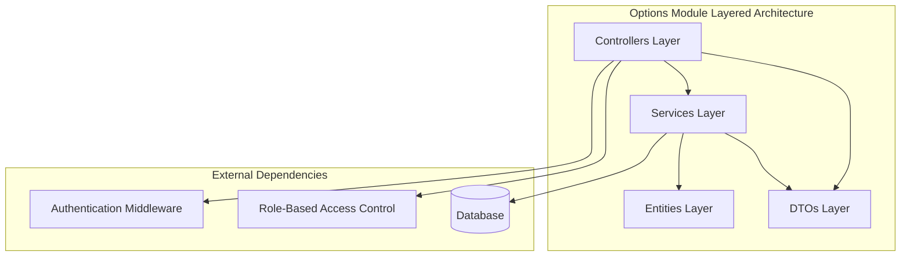
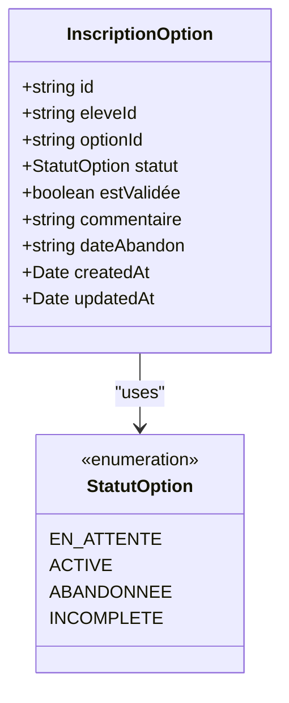
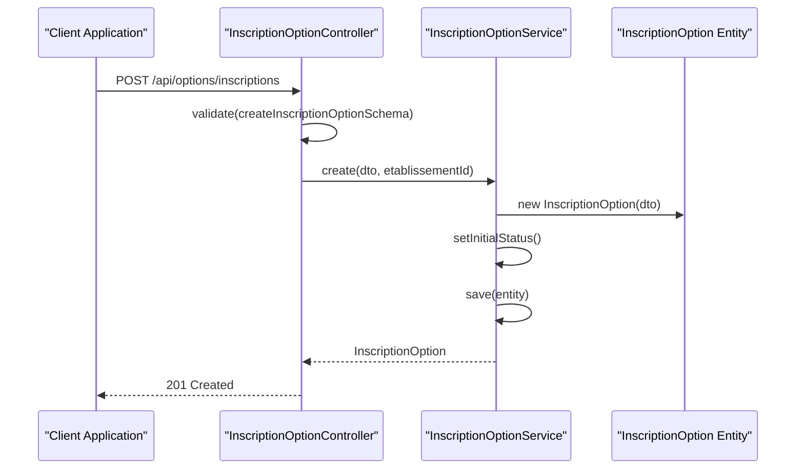
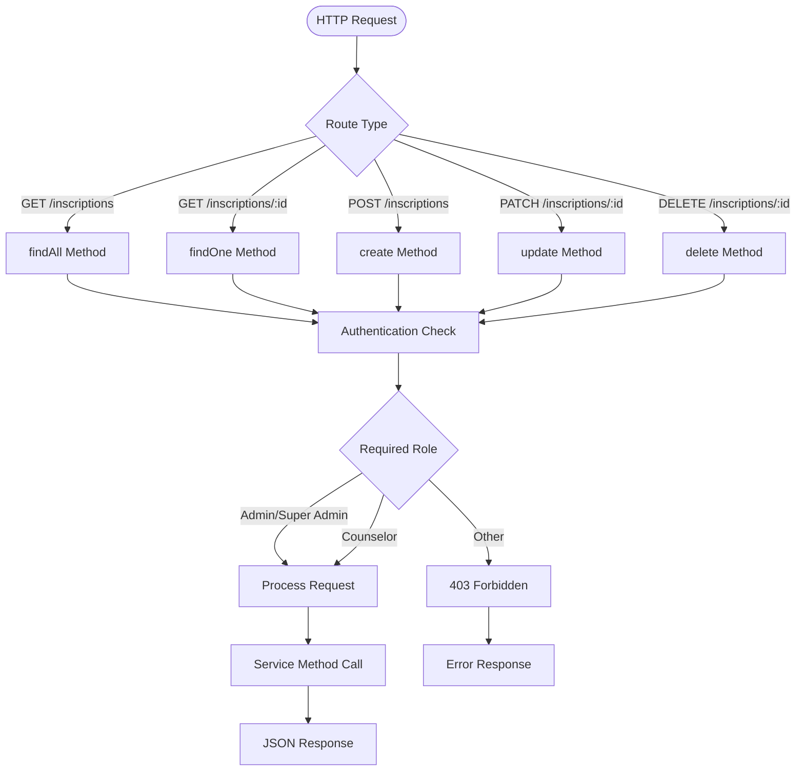
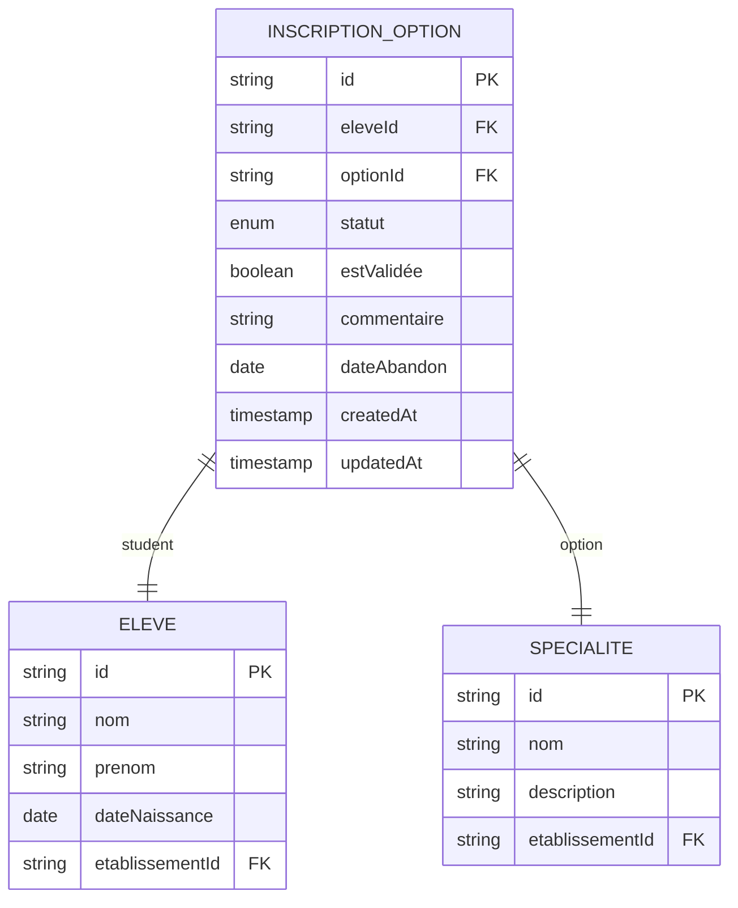
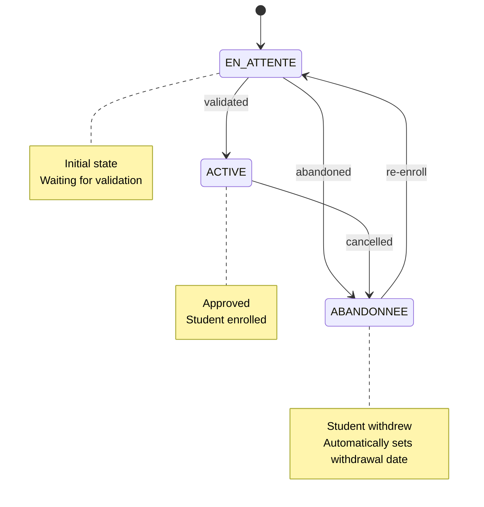
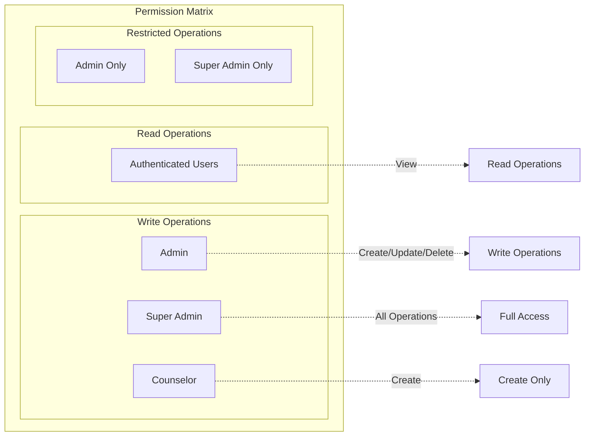
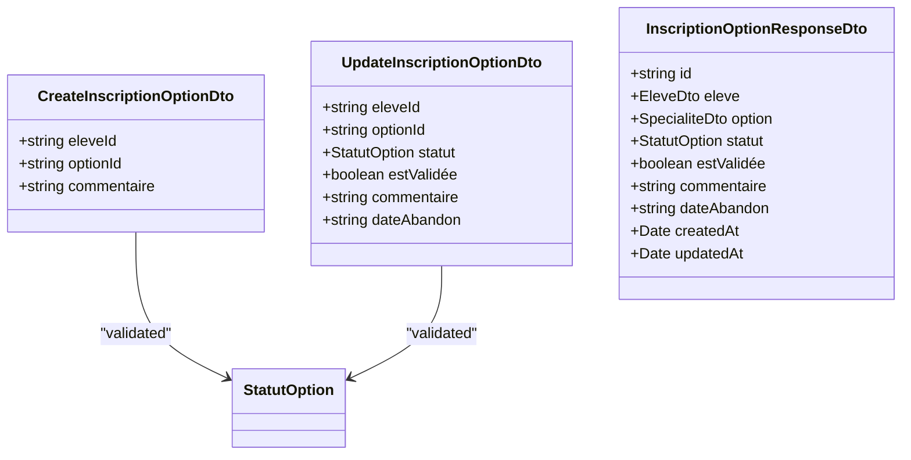
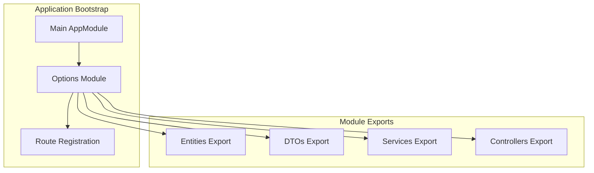

# Options (Specializations) Module

<cite>
**Referenced Files in This Document**
- [index.ts](file://backend/src/modules/options/index.ts)
- [inscription-option.controller.ts](file://backend/src/modules/options/controllers/inscription-option.controller.ts)
- [inscription-option.service.ts](file://backend/src/modules/options/services/inscription-option.service.ts)
- [inscription-option.dto.ts](file://backend/src/modules/options/dto/inscription-option.dto.ts)
- [inscription-option.entity.ts](file://backend/src/modules/options/entities/inscription-option.entity.ts)
- [index.ts](file://backend/src/modules/options/controllers/index.ts)
- [index.ts](file://backend/src/modules/options/services/index.ts)
- [index.ts](file://backend/src/modules/options/entities/index.ts)
</cite>

## Table of Contents
1. [Introduction](#introduction)
2. [Module Architecture](#module-architecture)
3. [Core Components](#core-components)
4. [Entity Relationship Analysis](#entity-relationship-analysis)
5. [API Endpoints](#api-endpoints)
6. [Business Logic Implementation](#business-logic-implementation)
7. [Security and Permissions](#security-and-permissions)
8. [Data Validation and DTOs](#data-validation-and-dtos)
9. [Integration Points](#integration-points)
10. [Performance Considerations](#performance-considerations)
11. [Troubleshooting Guide](#troubleshooting-guide)
12. [Conclusion](#conclusion)

## Introduction

The Options (Specializations) module in the eLISAschool project is designed to manage optional subjects or specializations for students. This module provides comprehensive functionality for student enrollment in elective courses, tracking enrollment status, and managing the validation process for specializations. The module follows a clean architecture pattern with clear separation of concerns between controllers, services, DTOs, and entities.

The module specifically focuses on the `InscriptionOption` entity, which represents student enrollments in optional subjects. It supports CRUD operations with additional business logic for enrollment validation, status management, and administrative approval processes.

## Module Architecture

The Options module follows a layered architecture pattern typical of NestJS applications:

**Diagram sources**
- [index.ts:1-20](file://backend/src/modules/options/index.ts#L1-L20)
- [inscription-option.controller.ts:29-88](file://backend/src/modules/options/controllers/inscription-option.controller.ts#L29-L88)

The module is structured with separate concerns:

- **Controllers**: Handle HTTP requests and responses
- **Services**: Contain business logic and orchestrate operations
- **Entities**: Define data structures and database relationships
- **DTOs**: Handle data transfer and validation
- **Index files**: Export module functionality

**Section sources**
- [index.ts:1-20](file://backend/src/modules/options/index.ts#L1-L20)
- [index.ts:1-7](file://backend/src/modules/options/controllers/index.ts#L1-L7)
- [index.ts:1-7](file://backend/src/modules/options/services/index.ts#L1-L7)
- [index.ts:1-7](file://backend/src/modules/options/entities/index.ts#L1-L7)

## Core Components

### Entity Layer

The module defines a single primary entity: `InscriptionOption`. This entity represents the enrollment relationship between students and optional subjects.

**Diagram sources**
- [inscription-option.entity.ts](file://backend/src/modules/options/entities/inscription-option.entity.ts)

### Service Layer

The service layer implements the core business logic for managing student enrollments:

**Diagram sources**
- [inscription-option.controller.ts:54-63](file://backend/src/modules/options/controllers/inscription-option.controller.ts#L54-L63)
- [inscription-option.service.ts:120-148](file://backend/src/modules/options/services/inscription-option.service.ts#L120-L148)

**Section sources**
- [inscription-option.service.ts:120-168](file://backend/src/modules/options/services/inscription-option.service.ts#L120-L168)

### Controller Layer

The controller layer handles HTTP routing and request/response management:

**Diagram sources**
- [inscription-option.controller.ts:33-84](file://backend/src/modules/options/controllers/inscription-option.controller.ts#L33-L84)

**Section sources**
- [inscription-option.controller.ts:29-88](file://backend/src/modules/options/controllers/inscription-option.controller.ts#L29-L88)

## Entity Relationship Analysis

The Options module maintains relationships with other core entities in the eLISAschool system:

**Diagram sources**
- [inscription-option.entity.ts](file://backend/src/modules/options/entities/inscription-option.entity.ts)

The entity relationships support:
- Student enrollment tracking
- Specialization course management
- Status monitoring and validation
- Administrative oversight capabilities

## API Endpoints

The module exposes a RESTful API with comprehensive CRUD operations:

| Method | Endpoint | Description | Required Roles |
|--------|----------|-------------|----------------|
| GET | `/api/options/inscriptions` | List all student enrollments | Authenticated |
| GET | `/api/options/inscriptions/:id` | Get enrollment details | Authenticated |
| POST | `/api/options/inscriptions` | Create new enrollment | Admin, Super Admin, Counselor |
| PATCH | `/api/options/inscriptions/:id` | Update enrollment | Admin, Super Admin |
| DELETE | `/api/options/inscriptions/:id` | Cancel enrollment | Admin, Super Admin |

**Section sources**
- [inscription-option.controller.ts:33-84](file://backend/src/modules/options/controllers/inscription-option.controller.ts#L33-L84)

## Business Logic Implementation

### Enrollment Status Management

The service implements sophisticated status management for enrollments:

**Diagram sources**
- [inscription-option.service.ts:135-168](file://backend/src/modules/options/services/inscription-option.service.ts#L135-L168)

### Validation Workflow

The module implements a two-tier validation process:

1. **Administrative Validation**: Requires role-based permissions
2. **Automatic Status Updates**: Based on enrollment actions

**Section sources**
- [inscription-option.service.ts:150-168](file://backend/src/modules/options/services/inscription-option.service.ts#L150-L168)

## Security and Permissions

### Role-Based Access Control

The module implements granular permission controls:

**Diagram sources**
- [inscription-option.controller.ts:54-84](file://backend/src/modules/options/controllers/inscription-option.controller.ts#L54-L84)

**Section sources**
- [inscription-option.controller.ts:54-84](file://backend/src/modules/options/controllers/inscription-option.controller.ts#L54-L84)

## Data Validation and DTOs

### DTO Structure

The module uses TypeScript DTOs for data validation and transfer:

**Diagram sources**
- [inscription-option.dto.ts](file://backend/src/modules/options/dto/inscription-option.dto.ts)

**Section sources**
- [inscription-option.dto.ts](file://backend/src/modules/options/dto/inscription-option.dto.ts)

## Integration Points

### Module Registration

The Options module integrates seamlessly with the main application:

**Diagram sources**
- [index.ts:8-20](file://backend/src/modules/options/index.ts#L8-L20)

### Database Integration

The module leverages TypeORM for database operations with proper entity relationships and indexing strategies.

**Section sources**
- [index.ts:1-20](file://backend/src/modules/options/index.ts#L1-L20)

## Performance Considerations

### Query Optimization

The service layer implements efficient database queries with appropriate indexing:

- **Composite Indexes**: On frequently queried fields like `eleveId` and `statut`
- **Pagination Support**: Built-in pagination for large enrollment lists
- **Lazy Loading**: Optimized entity loading to reduce memory usage

### Caching Strategies

Consider implementing caching for:
- Frequently accessed enrollment statistics
- Common query results for dashboard views
- User-specific enrollment data

## Troubleshooting Guide

### Common Issues and Solutions

**Issue**: 403 Forbidden errors when accessing enrollment endpoints
- **Cause**: Insufficient role permissions
- **Solution**: Verify user roles include Admin, Super Admin, or Counselor

**Issue**: Enrollment status not updating correctly
- **Cause**: Missing validation workflow completion
- **Solution**: Ensure both administrative validation and status updates are processed

**Issue**: Duplicate enrollment records
- **Cause**: Missing unique constraints
- **Solution**: Implement unique composite keys for `(eleveId, optionId)`

**Issue**: Performance degradation with large datasets
- **Cause**: Missing database indexes
- **Solution**: Add appropriate indexes on frequently queried fields

**Section sources**
- [inscription-option.service.ts:135-168](file://backend/src/modules/options/services/inscription-option.service.ts#L135-L168)
- [inscription-option.controller.ts:54-84](file://backend/src/modules/options/controllers/inscription-option.controller.ts#L54-L84)

## Conclusion

The Options (Specializations) module provides a robust foundation for managing student enrollments in optional subjects within the eLISAschool ecosystem. The module demonstrates excellent architectural practices with clear separation of concerns, comprehensive security controls, and well-defined business logic.

Key strengths of the implementation include:
- Clean layered architecture following NestJS best practices
- Comprehensive role-based access control
- Sophisticated enrollment status management
- Proper data validation through DTOs
- Extensible design supporting future enhancements

The module serves as a model for other specialized modules within the eLISAschool platform, providing a scalable foundation for educational institution needs.