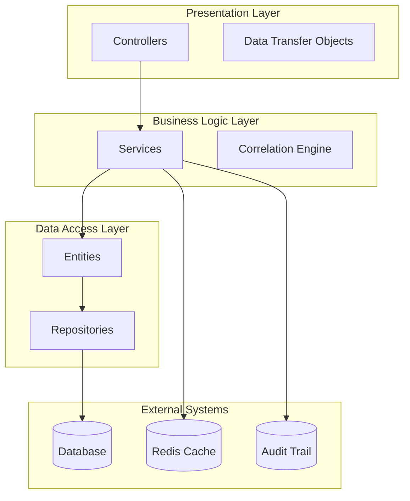
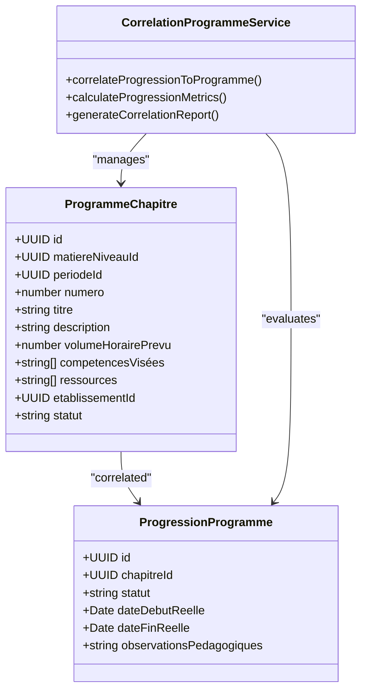
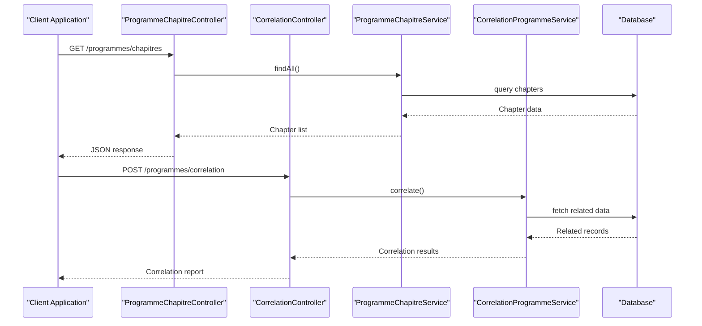
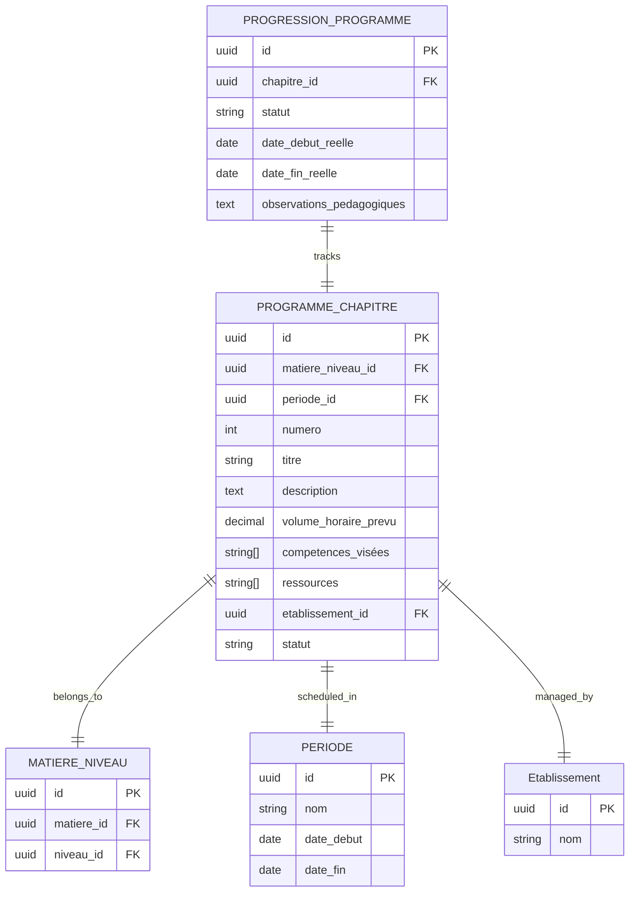
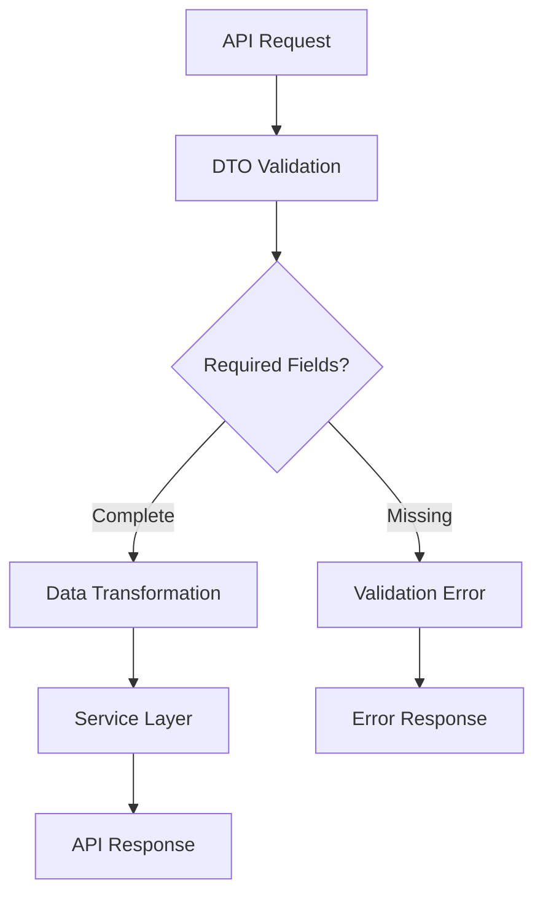

# Programmes Pédagogiques Module

<cite>
**Referenced Files in This Document**
- [index.ts](file://backend/src/modules/programmes/index.ts)
- [programme-chapitre.controller.ts](file://backend/src/modules/programmes/controllers/programme-chapitre.controller.ts)
- [correlation.controller.ts](file://backend/src/modules/programmes/controllers/correlation.controller.ts)
- [programme-chapitre.dto.ts](file://backend/src/modules/programmes/dto/programme-chapitre.dto.ts)
- [programme-chapitre.entity.ts](file://backend/src/modules/programmes/entities/programme-chapitre.entity.ts)
- [programme-chapitre.service.ts](file://backend/src/modules/programmes/services/programme-chapitre.service.ts)
- [correlation-programme.service.ts](file://backend/src/modules/programmes/services/correlation-programme.service.ts)
- [ANALYSE-PROGRAMME-PEDAGOGIQUE-COMPLET.md](file://ANALYSE-PROGRAMME-PEDAGOGIQUE-COMPLET.md)
</cite>

## Table of Contents
1. [Introduction](#introduction)
2. [Module Architecture](#module-architecture)
3. [Core Components](#core-components)
4. [Entity Relationship Model](#entity-relationship-model)
5. [API Endpoints](#api-endpoints)
6. [Service Layer Implementation](#service-layer-implementation)
7. [Data Transfer Objects](#data-transfer-objects)
8. [Integration Patterns](#integration-patterns)
9. [Implementation Roadmap](#implementation-roadmap)
10. [Performance Considerations](#performance-considerations)
11. [Troubleshooting Guide](#troubleshooting-guide)
12. [Conclusion](#conclusion)

## Introduction

The Programmes Pédagogiques Module represents a foundational component of the eLISAschool educational management system, designed to manage and track pedagogical programs across academic institutions. This module addresses the critical need for structured curriculum management, chapter-based program organization, and correlation between planned programs and actual student progress.

The module emerges from a comprehensive analysis that identified significant gaps in the existing educational program management capabilities. While the system possesses basic academic structure (years, periods, classes, subjects), it lacked a detailed, chapter-based pedagogical program framework that could effectively bridge the gap between curriculum planning and classroom implementation.

## Module Architecture

The Programmes Pédagogiques Module follows a clean, layered architecture pattern that separates concerns between presentation, business logic, and data persistence. The module is organized into four primary layers:

**Diagram sources**
- [index.ts:13-22](file://backend/src/modules/programmes/index.ts#L13-L22)

The architecture emphasizes separation of concerns with dedicated controllers for different functional areas, specialized services for business logic, and well-defined entities for data representation. This design enables maintainability, testability, and scalability of the pedagogical program management system.

**Section sources**
- [index.ts:1-22](file://backend/src/modules/programmes/index.ts#L1-L22)

## Core Components

### ProgrammeChapitre Entity

The cornerstone of the Programmes Pédagogiques Module is the `ProgrammeChapitre` entity, which serves as the fundamental building block for organizing pedagogical content. This entity represents individual chapters or themes within academic programs, providing structured content organization and learning progression tracking.

**Diagram sources**
- [programme-chapitre.entity.ts:1-50](file://backend/src/modules/programmes/entities/programme-chapitre.entity.ts#L1-L50)
- [correlation-programme.service.ts:1-50](file://backend/src/modules/programmes/services/correlation-programme.service.ts#L1-L50)

The entity design incorporates several key attributes that enable comprehensive pedagogical program management:

- **Hierarchical Organization**: Chapters are organized by subject-level combinations, enabling precise curriculum alignment
- **Temporal Context**: Integration with academic periods ensures proper sequencing and scheduling
- **Learning Objectives**: Competency frameworks and resource allocation support outcome-based education
- **Status Management**: Multi-state tracking supports program lifecycle management from development to archival

**Section sources**
- [programme-chapitre.entity.ts:1-50](file://backend/src/modules/programmes/entities/programme-chapitre.entity.ts#L1-L50)
- [ANALYSE-PROGRAMME-PEDAGOGIQUE-COMPLET.md:219-250](file://ANALYSE-PROGRAMME-PEDAGOGIQUE-COMPLET.md#L219-L250)

### Controller Layer

The module implements a dual-controller architecture managing both chapter-based content and correlation services:

**Diagram sources**
- [programme-chapitre.controller.ts:1-50](file://backend/src/modules/programmes/controllers/programme-chapitre.controller.ts#L1-L50)
- [correlation.controller.ts:1-50](file://backend/src/modules/programmes/controllers/correlation.controller.ts#L1-L50)

**Section sources**
- [programme-chapitre.controller.ts:1-50](file://backend/src/modules/programmes/controllers/programme-chapitre.controller.ts#L1-L50)
- [correlation.controller.ts:1-50](file://backend/src/modules/programmes/controllers/correlation.controller.ts#L1-L50)

## Entity Relationship Model

The Programmes Pédagogiques Module establishes a sophisticated relationship model that connects pedagogical content with student progress tracking:

**Diagram sources**
- [programme-chapitre.entity.ts:1-50](file://backend/src/modules/programmes/entities/programme-chapitre.entity.ts#L1-L50)
- [ANALYSE-PROGRAMME-PEDAGOGIQUE-COMPLET.md:219-250](file://ANALYSE-PROGRAMME-PEDAGOGIQUE-COMPLET.md#L219-L250)

This relationship model supports complex queries for curriculum mapping, progress tracking, and reporting across multiple academic dimensions including subjects, levels, periods, and institutional contexts.

**Section sources**
- [ANALYSE-PROGRAMME-PEDAGOGIQUE-COMPLET.md:219-250](file://ANALYSE-PROGRAMME-PEDAGOGIQUE-COMPLET.md#L219-L250)

## API Endpoints

The module exposes a RESTful API with two primary endpoint groups, each serving distinct functional areas:

### Chapter Management Endpoints

| Endpoint | Method | Description | Authentication |
|----------|--------|-------------|----------------|
| `/programmes/chapitres` | GET | Retrieve all program chapters with filtering and pagination | Required |
| `/programmes/chapitres` | POST | Create a new program chapter | Required |
| `/programmes/chapitres/:id` | GET | Get specific chapter by ID | Required |
| `/programmes/chapitres/:id` | PUT | Update chapter information | Required |
| `/programmes/chapitres/:id` | DELETE | Remove chapter (soft delete) | Required |

### Correlation Analysis Endpoints

| Endpoint | Method | Description | Authentication |
|----------|--------|-------------|----------------|
| `/programmes/correlation` | POST | Generate correlation analysis between chapters and progressions | Required |
| `/programmes/correlation/report` | GET | Export correlation reports | Required |
| `/programmes/correlation/metrics` | GET | Retrieve correlation metrics and statistics | Required |

**Section sources**
- [programme-chapitre.controller.ts:1-50](file://backend/src/modules/programmes/controllers/programme-chapitre.controller.ts#L1-L50)
- [correlation.controller.ts:1-50](file://backend/src/modules/programmes/controllers/correlation.controller.ts#L1-L50)

## Service Layer Implementation

### ProgrammeChapitreService

The `ProgrammeChapitreService` handles all business logic related to chapter management, implementing CRUD operations with advanced filtering and validation capabilities. The service ensures data integrity through comprehensive validation rules and maintains audit trails for all modifications.

Key responsibilities include:
- Chapter creation with competency alignment
- Period scheduling coordination
- Resource allocation management
- Status lifecycle transitions
- Multi-institutional data isolation

### CorrelationProgrammeService

The `CorrelationProgrammeService` provides sophisticated analysis capabilities that bridge the gap between planned curricula and actual implementation. This service performs advanced correlation analysis, progress tracking, and reporting generation.

Core functionalities encompass:
- Automatic correlation calculation between chapters and progressions
- Progression completion metrics computation
- Performance trend analysis
- Comparative reporting across multiple dimensions
- Real-time correlation status updates

**Section sources**
- [programme-chapitre.service.ts:1-50](file://backend/src/modules/programmes/services/programme-chapitre.service.ts#L1-L50)
- [correlation-programme.service.ts:1-50](file://backend/src/modules/programmes/services/correlation-programme.service.ts#L1-L50)

## Data Transfer Objects

### ProgrammeChapitreDTO

The `ProgrammeChapitreDTO` defines the standardized data interface for chapter-related operations, ensuring consistent data exchange between the API layer and business logic. This DTO encapsulates all necessary fields for chapter creation, modification, and retrieval while maintaining strict validation rules.

**Diagram sources**
- [programme-chapitre.dto.ts:1-50](file://backend/src/modules/programmes/dto/programme-chapitre.dto.ts#L1-L50)

**Section sources**
- [programme-chapitre.dto.ts:1-50](file://backend/src/modules/programmes/dto/programme-chapitre.dto.ts#L1-L50)

## Integration Patterns

### Multi-Tenant Architecture

The module implements a robust multi-tenant architecture that ensures data isolation between educational institutions while maintaining shared functionality. Each chapter and correlation record includes an `etablissementId` field that enforces tenant boundaries at the database level.

### Audit Trail Integration

All operations within the Programmes Pédagogiques Module are automatically logged in the audit trail system, providing comprehensive tracking of curriculum changes, progress modifications, and correlation analyses. This integration supports compliance requirements and enables detailed historical analysis.

### Cache Optimization

The service layer implements intelligent caching strategies for frequently accessed chapter data and correlation metrics, reducing database load and improving response times for common queries.

**Section sources**
- [index.ts:13-22](file://backend/src/modules/programmes/index.ts#L13-L22)

## Implementation Roadmap

Based on the comprehensive analysis, the implementation follows a phased approach designed to establish a solid foundation while enabling progressive enhancement:

### Phase 1: Foundation (Week 1)
- Complete `ProgrammeChapitre` entity implementation
- Establish database migration framework
- Implement basic CRUD operations
- Set up RBAC permissions
- Deploy initial API endpoints

### Phase 2: Integration (Week 2)
- Modify `ProgressionProgramme` entity with chapter correlation
- Develop correlation service infrastructure
- Implement automatic progression calculation
- Add comprehensive testing framework

### Phase 3: Enhancement (Week 3)
- Establish evaluation pedagogy service
- Integrate gamification systems
- Build pedagogical dashboard
- Implement advanced reporting capabilities

### Phase 4: Optimization (Week 4)
- Deploy automated notification system
- Add PDF export functionality
- Implement performance monitoring
- Conduct load testing and optimization

**Section sources**
- [ANALYSE-PROGRAMME-PEDAGOGIQUE-COMPLET.md:370-396](file://ANALYSE-PROGRAMME-PEDAGOGIQUE-COMPLET.md#L370-L396)

## Performance Considerations

### Database Optimization

The module leverages PostgreSQL's advanced indexing capabilities to optimize query performance on frequently accessed fields including `matiereNiveauId`, `periodeId`, and `etablissementId`. Migration scripts include strategic index placement to support common query patterns.

### Caching Strategy

Redis-based caching implements tiered caching for:
- Frequently accessed chapter metadata
- Correlation analysis results
- User-specific program configurations
- Institution-wide program statistics

### Scalability Design

The architecture supports horizontal scaling through:
- Database connection pooling
- Asynchronous processing for heavy correlation calculations
- Distributed caching across multiple instances
- Load balancing for high-traffic periods

## Troubleshooting Guide

### Common Issues and Solutions

**Chapter Creation Failures**
- Verify competency alignment requirements
- Check period scheduling conflicts
- Validate resource allocation constraints
- Confirm institution permissions

**Correlation Calculation Errors**
- Review chapter-to-progression mapping
- Verify temporal alignment between periods
- Check for orphaned records
- Validate statistical significance thresholds

**Performance Degradation**
- Monitor cache hit ratios
- Analyze slow query patterns
- Review database index effectiveness
- Check Redis connection limits

**Data Consistency Issues**
- Verify transaction boundaries
- Check audit trail synchronization
- Review multi-tenant isolation
- Validate real-time correlation updates

**Section sources**
- [ANALYSE-PROGRAMME-PEDAGOGIQUE-COMPLET.md:215-217](file://ANALYSE-PROGRAMME-PEDAGOGIQUE-COMPLET.md#L215-L217)

## Conclusion

The Programmes Pédagogiques Module represents a significant advancement in eLISAschool's educational management capabilities, addressing critical gaps in curriculum organization and pedagogical program tracking. The module's comprehensive architecture, built upon solid theoretical foundations and practical implementation guidelines, provides a robust platform for educational institutions to manage their curricular content effectively.

The implementation roadmap ensures gradual deployment while maintaining system stability, with each phase building upon previous accomplishments. The integration of advanced features including correlation analysis, gamification, and comprehensive reporting positions the module as a cornerstone of modern educational management systems.

Through careful attention to performance optimization, data integrity, and user experience, the Programmes Pédagogiques Module delivers substantial value to educational institutions seeking to enhance their pedagogical program management capabilities while maintaining compliance with regulatory requirements and institutional standards.