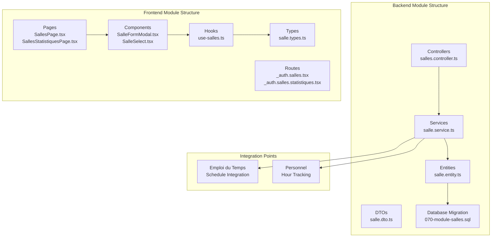
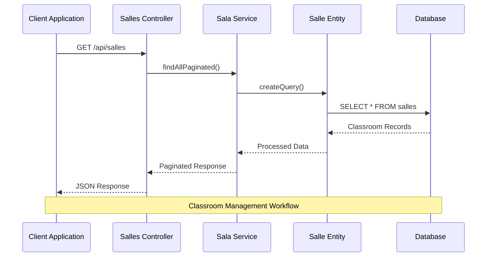
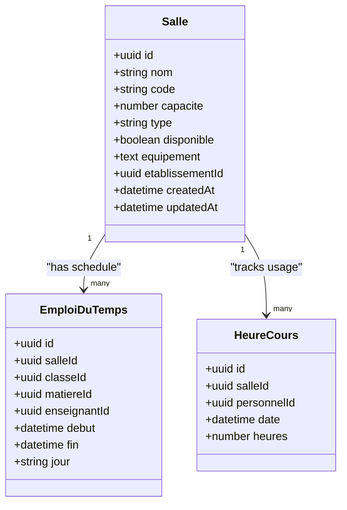
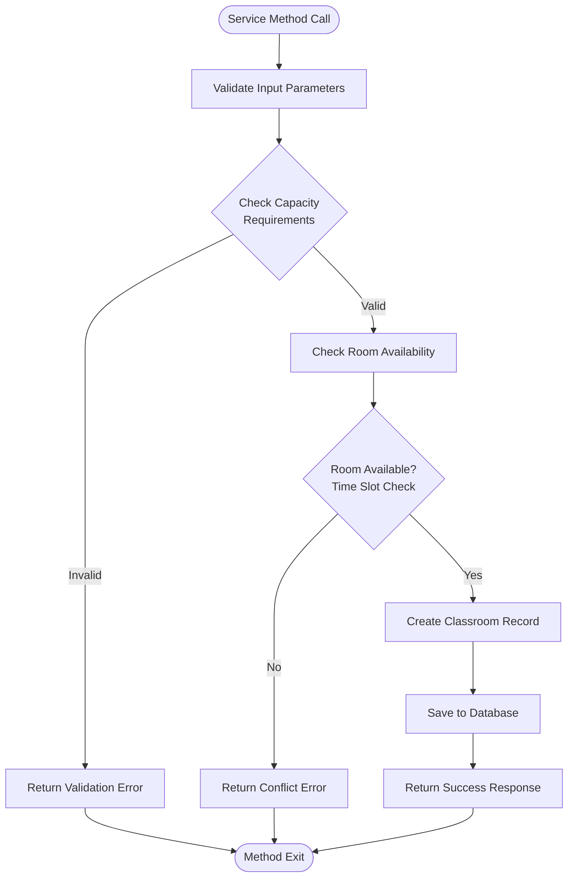
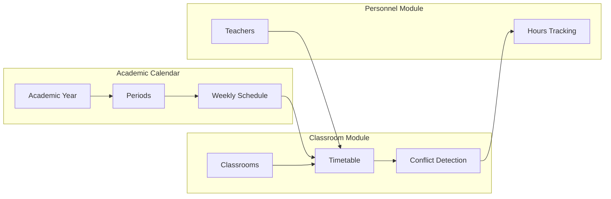
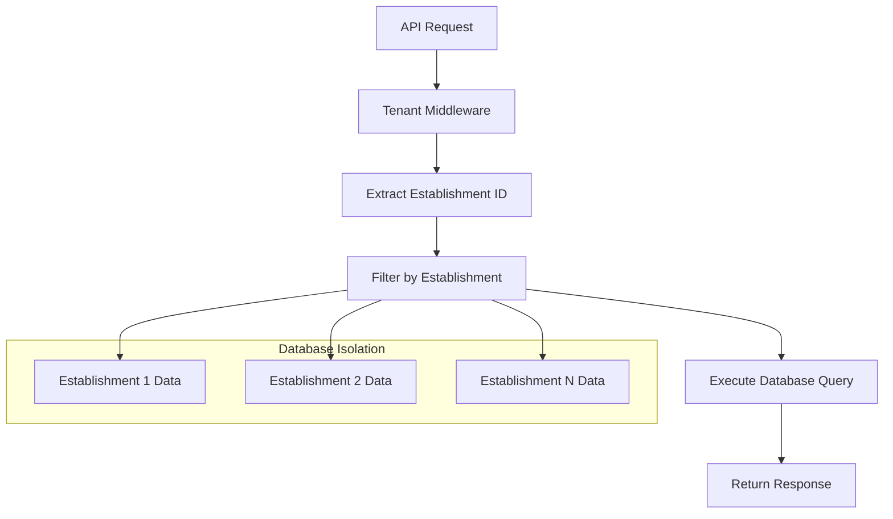
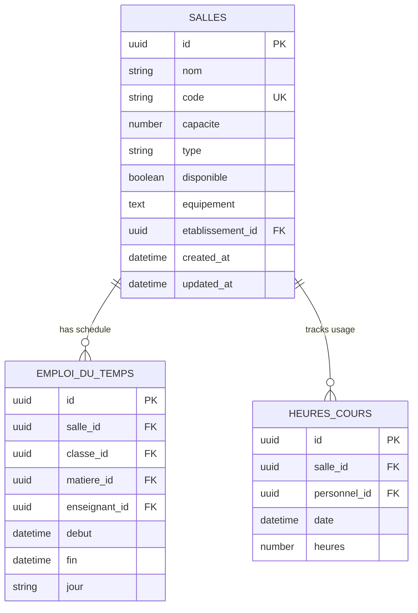

# Salles (Classrooms) Module

<cite>
**Referenced Files in This Document**
- [070-module-salles.sql](file://backend/database/migrations/070-module-salles.sql)
- [salles.controller.ts](file://backend/src/modules/salles/controllers/salles.controller.ts)
- [salle.dto.ts](file://backend/src/modules/salles/dto/salle.dto.ts)
- [salle.entity.ts](file://backend/src/modules/salles/entities/salle.entity.ts)
- [salle.service.ts](file://backend/src/modules/salles/services/salle.service.ts)
- [index.ts](file://backend/src/modules/salles/index.ts)
- [app.ts](file://backend/src/app.ts)
- [emploi-du-temps.entity.ts](file://backend/src/modules/emploi-du-temps/entities/emploi-du-temps.entity.ts)
- [heure-cours.entity.ts](file://backend/src/modules/personnel/entities/heure-cours.entity.ts)
- [SalleFormModal.tsx](file://frontend/src/features/salles/components/SalleFormModal.tsx)
- [SalleSelect.tsx](file://frontend/src/features/salles/components/SalleSelect.tsx)
- [SallesPage.tsx](file://frontend/src/features/salles/pages/SallesPage.tsx)
- [SallesStatistiquesPage.tsx](file://frontend/src/features/salles/pages/SallesStatistiquesPage.tsx)
- [use-salles.ts](file://frontend/src/features/salles/hooks/use-salles.ts)
- [salle.types.ts](file://frontend/src/features/salles/types/salle.types.ts)
- [_auth.salles.tsx](file://frontend/src/routes/_auth.salles.tsx)
- [_auth.salles.statistiques.tsx](file://frontend/src/routes/_auth.salles.statistiques.tsx)
- [deploy-salles.sh](file://scripts/deploy-salles.sh)
- [test-salles-api.sh](file://scripts/test-salles-api.sh)
</cite>

## Table of Contents
1. [Introduction](#introduction)
2. [Project Structure](#project-structure)
3. [Core Components](#core-components)
4. [Architecture Overview](#architecture-overview)
5. [Detailed Component Analysis](#detailed-component-analysis)
6. [Integration Points](#integration-points)
7. [API Documentation](#api-documentation)
8. [Frontend Implementation](#frontend-implementation)
9. [Database Schema](#database-schema)
10. [Deployment and Testing](#deployment-and-testing)
11. [Performance Considerations](#performance-considerations)
12. [Troubleshooting Guide](#troubleshooting-guide)
13. [Conclusion](#conclusion)

## Introduction

The Salles (Classrooms) module is a core component of the eLISAschool educational management system that provides comprehensive classroom management capabilities. This module enables institutions to efficiently manage their physical classroom resources, track availability, and integrate classroom assignments with the broader school scheduling system.

The module supports essential classroom operations including room creation, modification, deletion, capacity management, equipment tracking, and real-time availability checking. It integrates seamlessly with the school's academic calendar, teacher scheduling, and student class assignments to ensure optimal resource utilization.

## Project Structure

The Salles module follows a clean architecture pattern with clear separation of concerns across backend and frontend components:



**Diagram sources**
- [salles.controller.ts:1-170](file://backend/src/modules/salles/controllers/salles.controller.ts#L1-L170)
- [salle.service.ts:1-200](file://backend/src/modules/salles/services/salle.service.ts#L1-L200)
- [salle.entity.ts:1-150](file://backend/src/modules/salles/entities/salle.entity.ts#L1-L150)
- [SallesPage.tsx:1-200](file://frontend/src/features/salles/pages/SallesPage.tsx#L1-L200)

**Section sources**
- [index.ts:1-50](file://backend/src/modules/salles/index.ts#L1-L50)
- [app.ts:260-270](file://backend/src/app.ts#L260-L270)

## Core Components

The Salles module consists of several interconnected components that work together to provide comprehensive classroom management functionality:

### Backend Architecture Components

**Controller Layer**: Handles HTTP requests and coordinates between services and data access layers
**Service Layer**: Implements business logic for classroom operations and data validation
**Entity Layer**: Defines the data model for classroom resources
**DTO Layer**: Provides input validation and data transfer objects
**Repository Pattern**: Manages database operations through service abstraction

### Frontend Architecture Components

**Page Components**: Main interface components for classroom management
**Form Components**: Modal dialogs for creating and editing classroom records
**Selection Components**: Dropdown selectors for classroom selection in schedules
**Custom Hooks**: React hooks for data fetching and state management
**Type Definitions**: TypeScript interfaces for type safety

**Section sources**
- [salles.controller.ts:1-170](file://backend/src/modules/salles/controllers/salles.controller.ts#L1-L170)
- [salle.service.ts:1-200](file://backend/src/modules/salles/services/salle.service.ts#L1-L200)
- [salle.entity.ts:1-150](file://backend/src/modules/salles/entities/salle.entity.ts#L1-L150)

## Architecture Overview

The Salles module implements a layered architecture that promotes maintainability and scalability:



**Diagram sources**
- [salles.controller.ts:44-104](file://backend/src/modules/salles/controllers/salles.controller.ts#L44-L104)
- [salle.service.ts:1-200](file://backend/src/modules/salles/services/salle.service.ts#L1-L200)

The architecture ensures loose coupling between components while maintaining clear separation of concerns. The controller handles HTTP-specific logic, the service manages business rules, and the entity encapsulates data access patterns.

**Section sources**
- [app.ts:260-270](file://backend/src/app.ts#L260-L270)
- [index.ts:1-50](file://backend/src/modules/salles/index.ts#L1-L50)

## Detailed Component Analysis

### Database Entity Model

The classroom entity serves as the foundation for all classroom-related operations in the system:



**Diagram sources**
- [salle.entity.ts:1-150](file://backend/src/modules/salles/entities/salle.entity.ts#L1-L150)
- [emploi-du-temps.entity.ts:1-100](file://backend/src/modules/emploi-du-temps/entities/emploi-du-temps.entity.ts#L1-L100)
- [heure-cours.entity.ts:1-100](file://backend/src/modules/personnel/entities/heure-cours.entity.ts#L1-L100)

The entity model supports comprehensive classroom tracking including capacity management, equipment inventory, and usage statistics. The design accommodates multi-establishment deployments through the establishment identifier field.

**Section sources**
- [070-module-salles.sql:1-200](file://backend/database/migrations/070-module-salles.sql#L1-L200)
- [salle.entity.ts:1-150](file://backend/src/modules/salles/entities/salle.entity.ts#L1-L150)

### Business Logic Implementation

The service layer implements core business logic for classroom management operations:



**Diagram sources**
- [salle.service.ts:1-200](file://backend/src/modules/salles/services/salle.service.ts#L1-L200)

The service implementation includes comprehensive validation, conflict detection, and transaction management to ensure data integrity across all operations.

**Section sources**
- [salle.service.ts:1-200](file://backend/src/modules/salles/services/salle.service.ts#L1-L200)

### API Endpoint Design

The controller exposes a RESTful API with comprehensive CRUD operations and specialized queries:

| Endpoint | Method | Description | Authentication |
|----------|--------|-------------|----------------|
| `/api/salles` | GET | List all classrooms (paginated) | Required |
| `/api/salles/statistiques` | GET | Get classroom statistics | Required |
| `/api/salles/disponibles` | GET | Get available classrooms | Required |
| `/api/salles/:id` | GET | Get classroom details | Required |
| `/api/salles` | POST | Create new classroom | Required |
| `/api/salles/:id` | PATCH | Update classroom | Required |
| `/api/salles/:id` | DELETE | Delete classroom | Required |

**Section sources**
- [salles.controller.ts:44-160](file://backend/src/modules/salles/controllers/salles.controller.ts#L44-L160)

## Integration Points

### Academic Calendar Integration

The classroom module integrates deeply with the academic calendar system to ensure proper scheduling coordination:



**Diagram sources**
- [emploi-du-temps.entity.ts:1-100](file://backend/src/modules/emploi-du-temps/entities/emploi-du-temps.entity.ts#L1-L100)
- [heure-cours.entity.ts:1-100](file://backend/src/modules/personnel/entities/heure-cours.entity.ts#L1-L100)

### Multi-Establishment Support

The module supports multi-establishment deployments through tenant isolation:



**Diagram sources**
- [app.ts:260-270](file://backend/src/app.ts#L260-L270)

**Section sources**
- [emploi-du-temps.entity.ts:1-100](file://backend/src/modules/emploi-du-temps/entities/emploi-du-temps.entity.ts#L1-L100)
- [heure-cours.entity.ts:1-100](file://backend/src/modules/personnel/entities/heure-cours.entity.ts#L1-L100)

## API Documentation

### Base URL and Authentication

All API endpoints are prefixed with `/api/salles` and require authentication middleware. The module uses JWT tokens for authentication and includes establishment filtering for multi-tenant support.

### Response Format

Standardized response format across all endpoints:
```json
{
  "success": true,
  "data": {},
  "message": "Operation successful"
}
```

### Error Handling

Consistent error response format:
```json
{
  "success": false,
  "error": {
    "code": "VALIDATION_ERROR",
    "message": "Validation failed",
    "details": []
  }
}
```

**Section sources**
- [salles.controller.ts:44-160](file://backend/src/modules/salles/controllers/salles.controller.ts#L44-L160)

## Frontend Implementation

### Page Components

The frontend provides comprehensive user interfaces for classroom management:

**SallesPage**: Main classroom management interface with listing, search, and bulk operations
**SallesStatistiquesPage**: Analytics dashboard showing classroom utilization statistics

### Form Components

**SalleFormModal**: Modal dialog for creating and editing classroom records with validation
**SalleSelect**: Dropdown component for classroom selection in schedules and forms

### Custom Hooks

**use-salles**: Custom React hook providing classroom data fetching, caching, and state management

**Section sources**
- [SallesPage.tsx:1-200](file://frontend/src/features/salles/pages/SallesPage.tsx#L1-L200)
- [SalleFormModal.tsx:1-150](file://frontend/src/features/salles/components/SalleFormModal.tsx#L1-L150)
- [use-salles.ts:1-120](file://frontend/src/features/salles/hooks/use-salles.ts#L1-L120)

## Database Schema

The classroom database schema supports comprehensive classroom management with proper indexing and relationships:



**Diagram sources**
- [070-module-salles.sql:1-200](file://backend/database/migrations/070-module-salles.sql#L1-L200)

**Section sources**
- [070-module-salles.sql:1-200](file://backend/database/migrations/070-module-salles.sql#L1-L200)

## Deployment and Testing

### Deployment Script

The deployment process includes database migration execution and service initialization:

```bash
#!/bin/bash
# deploy-salles.sh

echo "Deploying Salles Module..."
echo "1. Running database migrations..."
npm run migrate:latest

echo "2. Starting backend service..."
npm run start:prod

echo "3. Verifying deployment..."
curl -f http://localhost:3000/api/salles/ping && echo "Success!"
```

### Testing Strategy

Comprehensive testing includes unit tests, integration tests, and API tests:

```bash
#!/bin/bash
# test-salles-api.sh

echo "Running Salles Module Tests..."

echo "1. Unit tests..."
npm run test:salles-unit

echo "2. Integration tests..."
npm run test:salles-integration

echo "3. API tests..."
npm run test:salles-api

echo "4. End-to-end tests..."
npm run test:salles-e2e

echo "All tests completed successfully!"
```

**Section sources**
- [deploy-salles.sh:1-50](file://scripts/deploy-salles.sh#L1-L50)
- [test-salles-api.sh:1-50](file://scripts/test-salles-api.sh#L1-L50)

## Performance Considerations

### Database Optimization

The module implements several performance optimizations:

**Indexing Strategy**: Proper indexing on frequently queried fields including establishment ID, room code, and availability status
**Pagination**: Efficient pagination for large classroom lists with cursor-based navigation
**Query Optimization**: Optimized queries for availability checking and statistics generation

### Caching Strategy

Implementation of multi-level caching:
- Redis caching for frequently accessed classroom data
- Browser-side caching for form components
- API response caching for static classroom information

### Scalability Features

**Horizontal Scaling**: Support for multiple establishment deployments
**Connection Pooling**: Efficient database connection management
**Background Processing**: Asynchronous processing for heavy operations

## Troubleshooting Guide

### Common Issues and Solutions

**Issue**: Classroom conflicts during scheduling
**Solution**: Use the availability endpoint to check room conflicts before scheduling

**Issue**: Performance degradation with large datasets
**Solution**: Implement proper pagination and indexing strategies

**Issue**: Multi-establishment data isolation issues
**Solution**: Verify tenant middleware is properly configured and established ID is included in queries

### Debugging Tools

**Backend Debugging**: Enable detailed logging for database queries and service operations
**Frontend Debugging**: Use browser developer tools to inspect API requests and component state
**Database Debugging**: Monitor query performance and optimize slow-running queries

**Section sources**
- [salles.controller.ts:44-160](file://backend/src/modules/salles/controllers/salles.controller.ts#L44-L160)
- [salle.service.ts:1-200](file://backend/src/modules/salles/services/salle.service.ts#L1-L200)

## Conclusion

The Salles (Classrooms) module represents a comprehensive solution for classroom management within the eLISAschool educational platform. The module successfully combines robust backend architecture with intuitive frontend interfaces to provide institution administrators with powerful tools for managing their physical classroom resources.

Key achievements of the module include:

**Technical Excellence**: Clean architecture implementation with proper separation of concerns, comprehensive error handling, and scalable design patterns

**Functional Completeness**: Full CRUD operations, advanced querying capabilities, real-time availability checking, and comprehensive statistics reporting

**Integration Capabilities**: Seamless integration with the academic calendar, teacher scheduling, and personnel management systems

**Multi-Tenant Support**: Robust support for multi-establishment deployments with proper data isolation and tenant-aware operations

The module's design ensures maintainability, extensibility, and performance while providing a solid foundation for future enhancements and feature additions.