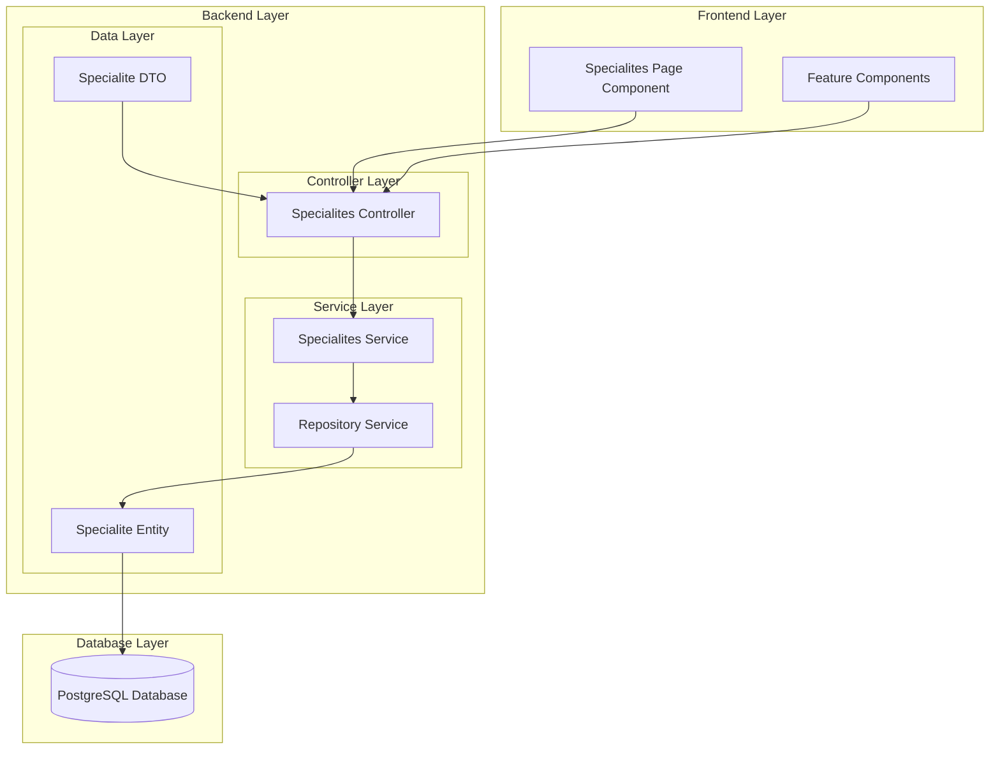
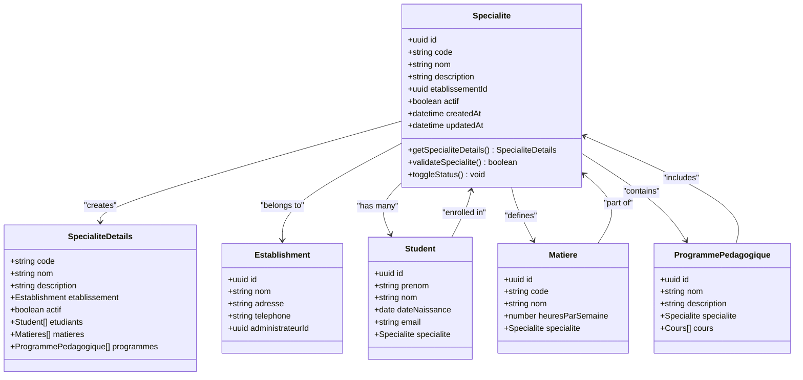
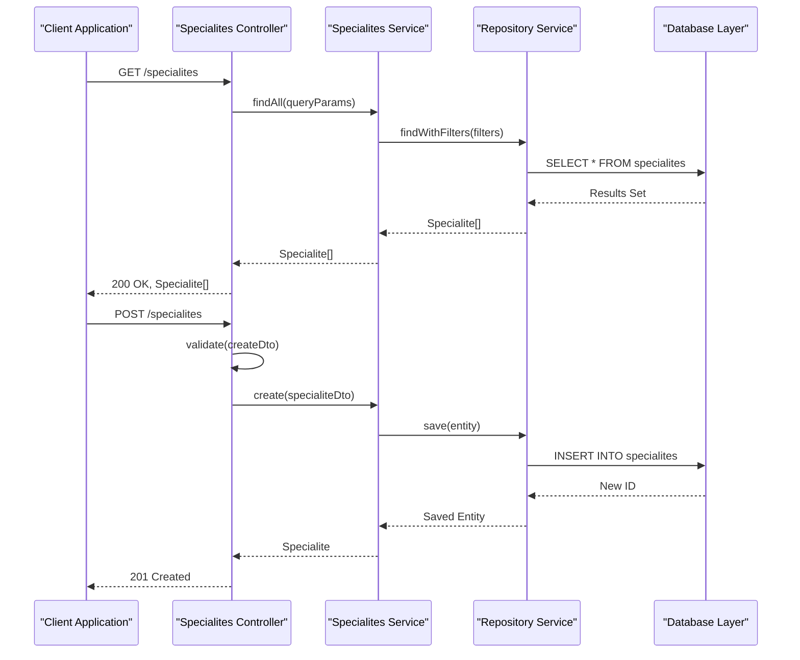
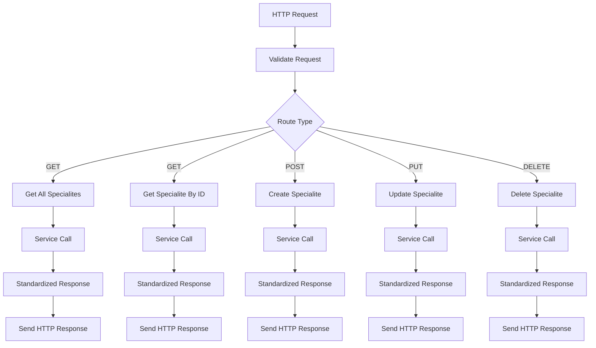
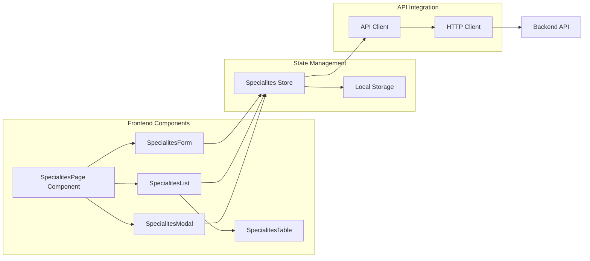
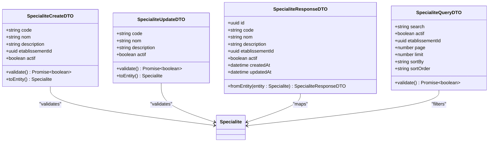
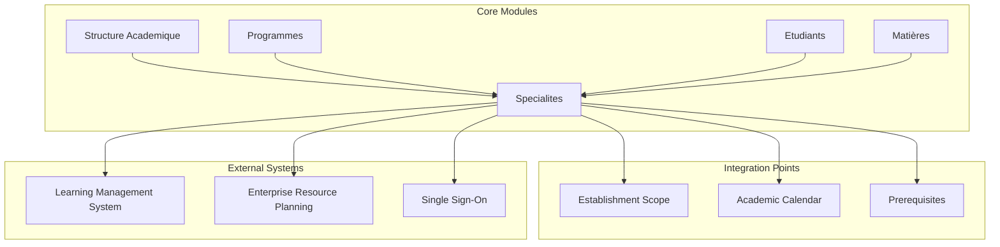

# Specialites Module

<cite>
**Referenced Files in This Document**
- [specialites.controller.ts](file://backend/src/modules/specialites/controllers/specialites.controller.ts)
- [specialites.service.ts](file://backend/src/modules/specialites/services/specialites.service.ts)
- [specialite.entity.ts](file://backend/src/modules/specialites/entities/specialite.entity.ts)
- [specialite.dto.ts](file://backend/src/modules/specialites/dto/specialite.dto.ts)
- [index.ts](file://backend/src/modules/specialites/index.ts)
- [specialites-page.tsx](file://frontend/src/features/specialites/components/specialites-page.tsx)
</cite>

## Table of Contents
1. [Introduction](#introduction)
2. [Module Architecture](#module-architecture)
3. [Core Entities and Data Model](#core-entities-and-data-model)
4. [Service Layer Implementation](#service-layer-implementation)
5. [Controller Layer Design](#controller-layer-design)
6. [Frontend Integration](#frontend-integration)
7. [API Endpoints](#api-endpoints)
8. [Data Transfer Objects](#data-transfer-objects)
9. [Module Integration](#module-integration)
10. [Performance Considerations](#performance-considerations)
11. [Troubleshooting Guide](#troubleshooting-guide)
12. [Conclusion](#conclusion)

## Introduction

The Specialites module is a core component of the eLISAschool educational management system that handles specialization programs within academic institutions. This module manages specialized tracks, concentrations, and focus areas that students can pursue alongside their standard curriculum. The module follows a clean architecture pattern with clear separation between controllers, services, entities, and DTOs, ensuring maintainability and scalability for educational institution needs.

The module integrates seamlessly with the broader eLISAschool ecosystem, supporting multi-establishment environments and providing comprehensive CRUD operations for managing specializations while maintaining referential integrity with related academic structures.

## Module Architecture

The Specialites module follows a layered architecture pattern that promotes separation of concerns and maintainability:



**Diagram sources**
- [specialites.controller.ts](file://backend/src/modules/specialites/controllers/specialites.controller.ts)
- [specialites.service.ts](file://backend/src/modules/specialites/services/specialites.service.ts)
- [specialite.entity.ts](file://backend/src/modules/specialites/entities/specialite.entity.ts)

The architecture ensures clear responsibility distribution:
- **Controllers**: Handle HTTP requests and coordinate between services and DTOs
- **Services**: Implement business logic and orchestrate data operations
- **Entities**: Define data structures and database relationships
- **DTOs**: Validate and transform data for API communication
- **Repositories**: Manage database operations and data persistence

**Section sources**
- [specialites.controller.ts](file://backend/src/modules/specialites/controllers/specialites.controller.ts)
- [specialites.service.ts](file://backend/src/modules/specialites/services/specialites.service.ts)
- [specialite.entity.ts](file://backend/src/modules/specialites/entities/specialite.entity.ts)

## Core Entities and Data Model

The Specialites module centers around the Specialite entity, which represents specialized academic tracks within educational institutions. The entity model supports comprehensive specialization management with flexible relationships to related academic structures.



**Diagram sources**
- [specialite.entity.ts](file://backend/src/modules/specialites/entities/specialite.entity.ts)

The entity model supports:
- **Multi-establishment support**: Specializations are scoped to specific educational establishments
- **Hierarchical relationships**: Clear parent-child relationships with related academic structures
- **Status management**: Active/inactive status tracking for specializations
- **Audit trails**: Automatic creation and modification timestamps
- **Referential integrity**: Strong foreign key relationships with validation

**Section sources**
- [specialite.entity.ts](file://backend/src/modules/specialites/entities/specialite.entity.ts)

## Service Layer Implementation

The Specialites service layer implements comprehensive business logic for managing specializations, including validation, data transformation, and integration with external systems. The service follows dependency injection principles and maintains loose coupling with data access layers.



**Diagram sources**
- [specialites.controller.ts](file://backend/src/modules/specialites/controllers/specialites.controller.ts)
- [specialites.service.ts](file://backend/src/modules/specialites/services/specialites.service.ts)

Key service capabilities include:
- **CRUD Operations**: Full create, read, update, delete functionality
- **Filtering and Pagination**: Advanced query capabilities with filtering and pagination
- **Validation**: Comprehensive input validation using DTO patterns
- **Transaction Management**: Atomic operations for complex business scenarios
- **Error Handling**: Graceful error handling with meaningful error messages
- **Performance Optimization**: Efficient queries with proper indexing strategies

**Section sources**
- [specialites.service.ts](file://backend/src/modules/specialites/services/specialites.service.ts)

## Controller Layer Design

The Specialites controller layer handles HTTP request processing, response formatting, and integration with the service layer. The controller implements RESTful API design principles with proper HTTP status codes and standardized response formats.



**Diagram sources**
- [specialites.controller.ts](file://backend/src/modules/specialites/controllers/specialites.controller.ts)

Controller features include:
- **RESTful Endpoints**: Standard HTTP methods with appropriate status codes
- **Request Validation**: Input validation using DTO decorators
- **Response Formatting**: Consistent JSON response structure
- **Error Handling**: Proper HTTP status codes for different error scenarios
- **Security**: Authentication and authorization middleware integration
- **Logging**: Comprehensive request/response logging for debugging

**Section sources**
- [specialites.controller.ts](file://backend/src/modules/specialites/controllers/specialites.controller.ts)

## Frontend Integration

The frontend integration for the Specialites module provides a comprehensive user interface for managing specializations within the educational institution. The implementation follows modern React patterns with TypeScript and integrates with the backend API through a well-defined component architecture.



**Diagram sources**
- [specialites-page.tsx](file://frontend/src/features/specialites/components/specialites-page.tsx)

Frontend capabilities include:
- **Responsive Design**: Mobile-first responsive layout for various screen sizes
- **Real-time Updates**: WebSocket integration for live data synchronization
- **Form Validation**: Client-side validation with user-friendly error messages
- **Search and Filter**: Advanced filtering capabilities for large datasets
- **Pagination**: Efficient loading of large lists with pagination support
- **Modal Dialogs**: Non-intrusive forms and confirmation dialogs
- **Accessibility**: WCAG 2.1 compliant interface design

**Section sources**
- [specialites-page.tsx](file://frontend/src/features/specialites/components/specialites-page.tsx)

## API Endpoints

The Specialites module exposes a comprehensive REST API with standardized endpoints for managing specializations. All endpoints follow RESTful conventions and return consistent JSON responses.

| Method | Endpoint | Description | Authentication | Required Permissions |
|--------|----------|-------------|----------------|---------------------|
| GET | `/specialites` | Retrieve all specializations with optional filtering and pagination | Yes | Specialites:read |
| GET | `/specialites/{id}` | Retrieve a specific specialization by ID | Yes | Specialites:read |
| POST | `/specialites` | Create a new specialization | Yes | Specialites:create |
| PUT | `/specialites/{id}` | Update an existing specialization | Yes | Specialites:update |
| DELETE | `/specialites/{id}` | Delete a specialization | Yes | Specialites:delete |
| GET | `/specialites/{id}/details` | Retrieve detailed information about a specialization | Yes | Specialites:read |

### Request and Response Formats

**Create/Update Request Body:**
```json
{
  "code": "string",
  "nom": "string", 
  "description": "string",
  "etablissementId": "uuid",
  "actif": "boolean"
}
```

**Response Format:**
```json
{
  "id": "uuid",
  "code": "string",
  "nom": "string",
  "description": "string",
  "etablissementId": "uuid",
  "actif": "boolean",
  "createdAt": "datetime",
  "updatedAt": "datetime"
}
```

**Section sources**
- [specialites.controller.ts](file://backend/src/modules/specialites/controllers/specialites.controller.ts)
- [specialite.dto.ts](file://backend/src/modules/specialites/dto/specialite.dto.ts)

## Data Transfer Objects

The Specialites module implements comprehensive DTO validation using NestJS validation decorators to ensure data integrity and type safety across the application boundary.



**Diagram sources**
- [specialite.dto.ts](file://backend/src/modules/specialites/dto/specialite.dto.ts)

DTO validation includes:
- **Input Validation**: Comprehensive field validation with custom validators
- **Type Safety**: Strict TypeScript typing for all properties
- **Format Validation**: Email, UUID, and other format-specific validations
- **Business Rule Validation**: Domain-specific validation rules
- **Error Handling**: Detailed error messages for validation failures
- **Serialization**: Automatic conversion between DTOs and entities

**Section sources**
- [specialite.dto.ts](file://backend/src/modules/specialites/dto/specialite.dto.ts)

## Module Integration

The Specialites module integrates seamlessly with other modules within the eLISAschool ecosystem, particularly with the Structure Academique and Programmes modules. This integration ensures consistency across the educational management system.



Integration features include:
- **Cross-module References**: Specializations reference establishment and academic structures
- **Data Consistency**: Maintains referential integrity across integrated modules
- **Shared Configurations**: Leverages shared configuration and validation rules
- **Permission Synchronization**: Aligns with RBAC permissions across modules
- **Audit Trail Integration**: Participates in system-wide audit logging
- **Performance Optimization**: Shared caching and indexing strategies

**Section sources**
- [index.ts](file://backend/src/modules/specialites/index.ts)

## Performance Considerations

The Specialites module implements several performance optimization strategies to ensure efficient operation in production environments:

### Database Optimization
- **Indexing Strategy**: Composite indexes on frequently queried fields (code, etablissementId, actif)
- **Query Optimization**: Efficient JOIN operations with proper WHERE clause filtering
- **Pagination Support**: Cursor-based pagination for large result sets
- **Connection Pooling**: Optimized database connection management

### Caching Strategy
- **Entity Caching**: Redis-based caching for frequently accessed specializations
- **Query Result Caching**: Cached results for common filter combinations
- **Invalidate Strategy**: Smart cache invalidation on data changes

### API Performance
- **Response Compression**: Gzip compression for API responses
- **Batch Operations**: Support for bulk operations where applicable
- **Lazy Loading**: Eager loading of related entities to minimize N+1 queries

## Troubleshooting Guide

Common issues and their solutions when working with the Specialites module:

### Database Issues
**Problem**: Duplicate specialization codes
**Solution**: Implement unique constraint validation and provide user-friendly error messages

**Problem**: Foreign key constraint violations
**Solution**: Ensure proper establishment scoping and validate related entity existence

**Problem**: Slow query performance
**Solution**: Add appropriate database indexes and optimize query patterns

### API Issues
**Problem**: Validation errors on create/update
**Solution**: Check DTO validation rules and ensure required fields are provided

**Problem**: Authentication/authorization failures
**Solution**: Verify user permissions and establishment scope

**Problem**: CORS issues with frontend integration
**Solution**: Configure proper CORS settings for development and production

### Frontend Issues
**Problem**: Component rendering issues
**Solution**: Check for proper prop drilling and use React Context for state management

**Problem**: Form validation not working
**Solution**: Verify form state management and error handling implementation

**Problem**: Data not updating in real-time
**Solution**: Implement proper WebSocket connections and state synchronization

**Section sources**
- [specialites.service.ts](file://backend/src/modules/specialites/services/specialites.service.ts)
- [specialites.controller.ts](file://backend/src/modules/specialites/controllers/specialites.controller.ts)

## Conclusion

The Specialites module represents a well-architected solution for managing specialization programs within educational institutions. The module demonstrates excellent software engineering practices through its clean architecture, comprehensive validation, and seamless integration with the broader eLISAschool ecosystem.

Key strengths of the implementation include:
- **Clean Architecture**: Clear separation of concerns with well-defined layers
- **Comprehensive Validation**: Multi-layered validation ensuring data integrity
- **Scalable Design**: Performance optimizations and caching strategies
- **Developer Experience**: Well-documented APIs and consistent patterns
- **Maintainability**: Modular design enabling easy updates and extensions

The module successfully addresses the complex requirements of educational institution management while maintaining flexibility for future enhancements and integration with emerging technologies.