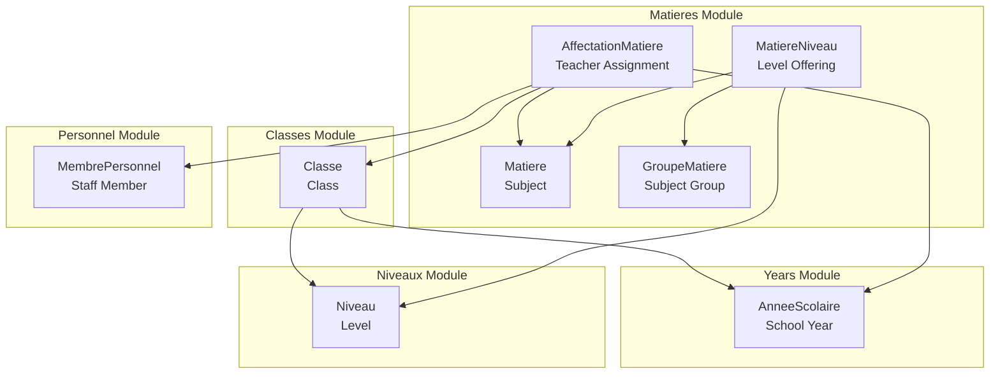
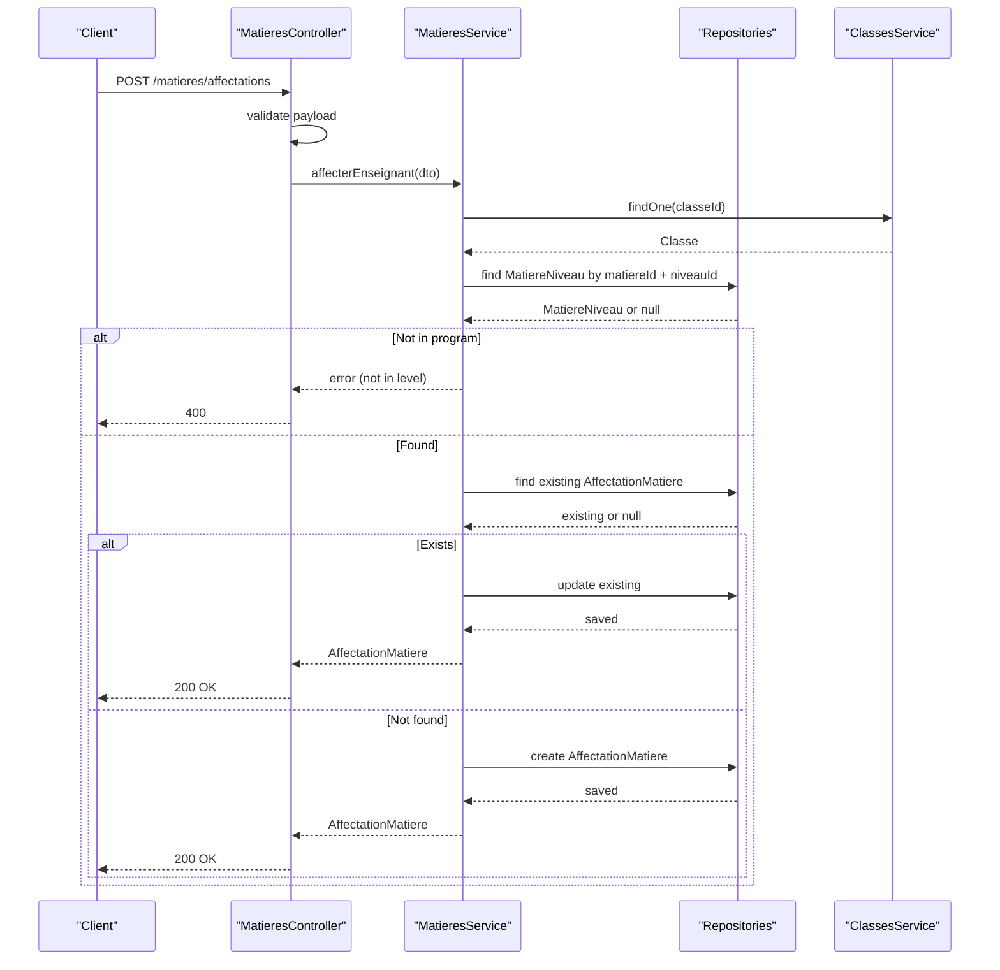
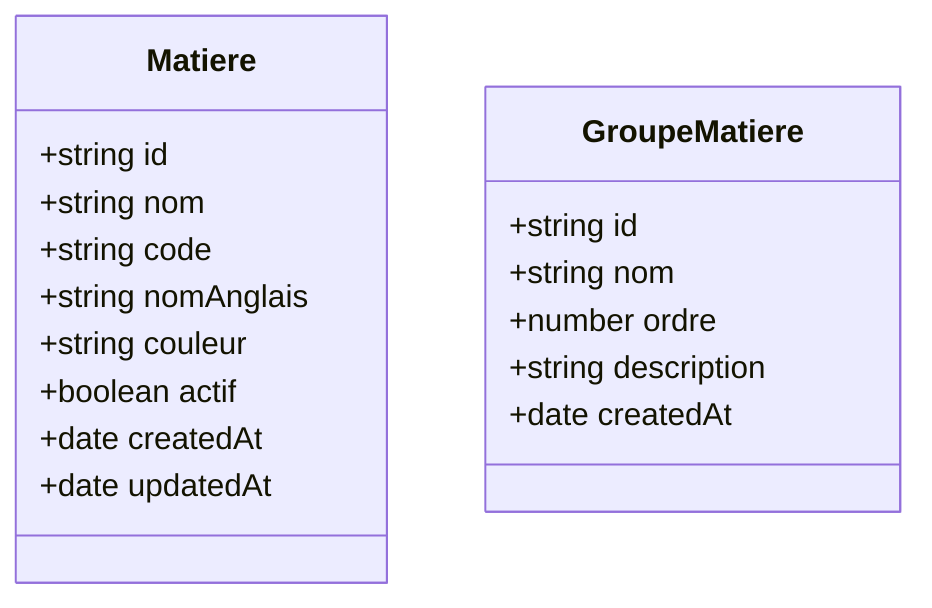
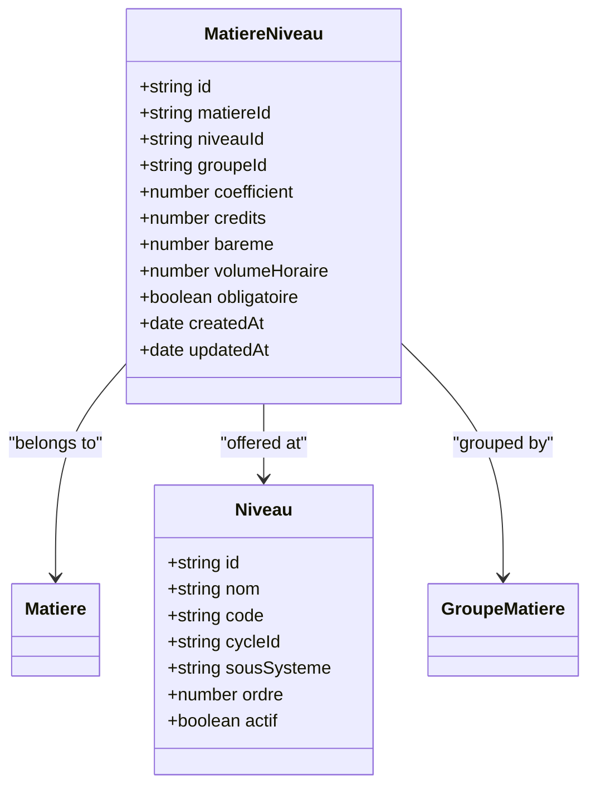
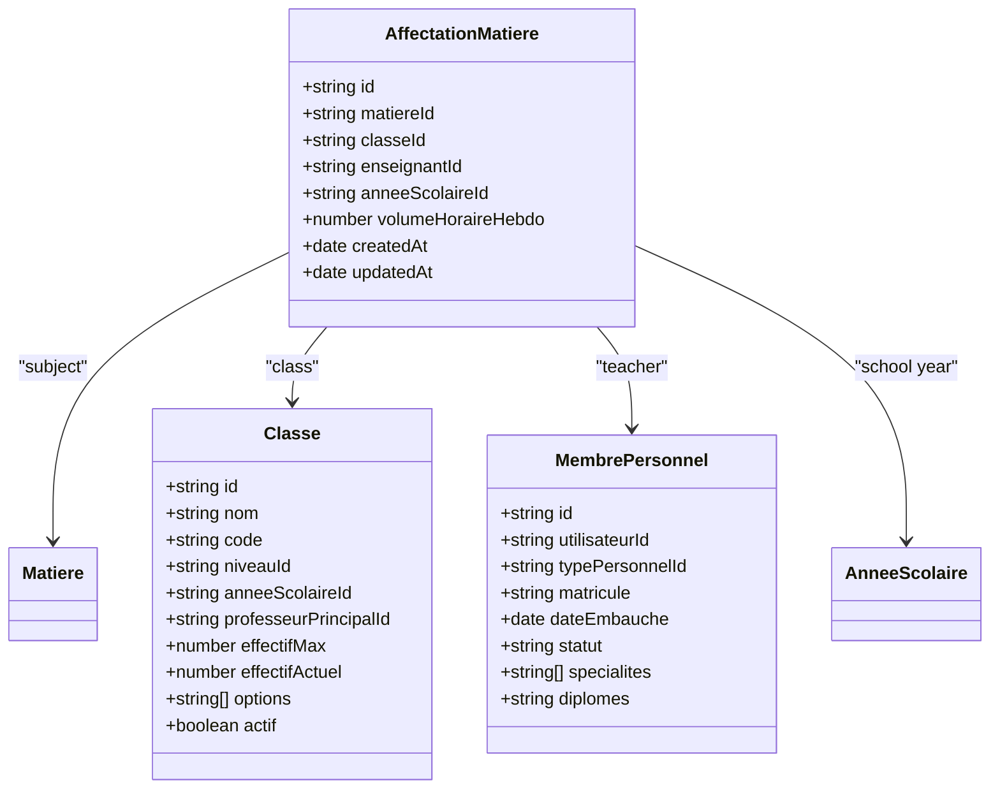
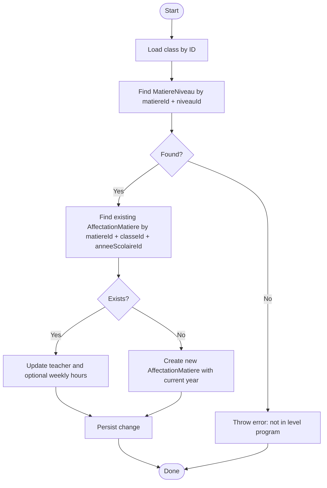
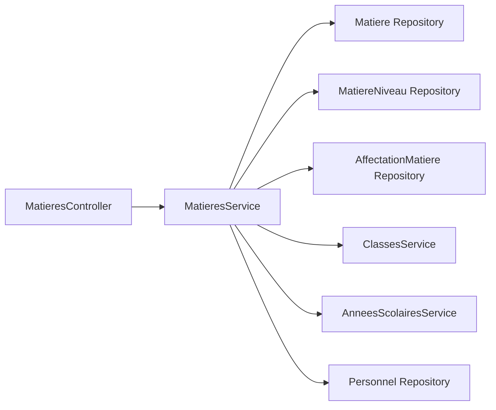

# Subjects & Teaching Assignments

<cite>
**Referenced Files in This Document**
- [matiere.entity.ts](file://backend/src/modules/matieres/entities/matiere.entity.ts)
- [affectation-matiere.entity.ts](file://backend/src/modules/matieres/entities/affectation-matiere.entity.ts)
- [matiere-niveau.entity.ts](file://backend/src/modules/matieres/entities/matiere-niveau.entity.ts)
- [matieres.service.ts](file://backend/src/modules/matieres/services/matieres.service.ts)
- [matieres.controller.ts](file://backend/src/modules/matieres/controllers/matieres.controller.ts)
- [matieres.dto.ts](file://backend/src/modules/matieres/dto/matieres.dto.ts)
- [niveau.entity.ts](file://backend/src/modules/niveaux/entities/niveau.entity.ts)
- [classe.entity.ts](file://backend/src/modules/classes/entities/classe.entity.ts)
- [annee-scolaire.entity.ts](file://backend/src/modules/annees-scolaires/entities/annee-scolaire.entity.ts)
- [personnel.entity.ts](file://backend/src/modules/personnel/entities/personnel.entity.ts)
- [niveaux.service.ts](file://backend/src/modules/niveaux/services/niveaux.service.ts)
- [niveaux.controller.ts](file://backend/src/modules/niveaux/controllers/niveaux.controller.ts)
</cite>

## Table of Contents
1. [Introduction](#introduction)
2. [Project Structure](#project-structure)
3. [Core Components](#core-components)
4. [Architecture Overview](#architecture-overview)
5. [Detailed Component Analysis](#detailed-component-analysis)
6. [Dependency Analysis](#dependency-analysis)
7. [Performance Considerations](#performance-considerations)
8. [Troubleshooting Guide](#troubleshooting-guide)
9. [Conclusion](#conclusion)
10. [Appendices](#appendices)

## Introduction
This document explains the subject management and teaching assignments system used to organize academic subjects, curricula by level, and teacher assignments to classes. It covers:
- Subject entity structure and grouping
- Level-specific subject offerings via the curriculum mapping entity
- Many-to-many relationships among subjects, teachers, and levels through dedicated association entities
- Service-layer logic for creating subject catalogs, assigning teachers, and validating curriculum mappings
- Practical examples for common workflows such as building subject catalogs, assigning teachers to classes, and handling prerequisites
- Guidance for multi-subject teaching and subject rotation scenarios

## Project Structure
The subject and teaching assignment domain is centered around three modules:
- Matières (Subjects): Entities for subjects, grouping, and curriculum mapping; controller and service for CRUD and assignments
- Niveaux (Levels): Entities and services for academic levels and cycles
- Classes (Classes): Entities linking levels to school year and class metadata

**Diagram sources**
- [matiere.entity.ts:36-61](file://backend/src/modules/matieres/entities/matiere.entity.ts#L36-L61)
- [matiere-niveau.entity.ts:20-70](file://backend/src/modules/matieres/entities/matiere-niveau.entity.ts#L20-L70)
- [affectation-matiere.entity.ts:22-65](file://backend/src/modules/matieres/entities/affectation-matiere.entity.ts#L22-L65)
- [niveau.entity.ts:20-53](file://backend/src/modules/niveaux/entities/niveau.entity.ts#L20-L53)
- [classe.entity.ts:21-75](file://backend/src/modules/classes/entities/classe.entity.ts#L21-L75)
- [personnel.entity.ts:38-78](file://backend/src/modules/personnel/entities/personnel.entity.ts#L38-L78)
- [annee-scolaire.entity.ts:15-40](file://backend/src/modules/annees-scolaires/entities/annee-scolaire.entity.ts#L15-L40)

**Section sources**
- [matiere.entity.ts:18-61](file://backend/src/modules/matieres/entities/matiere.entity.ts#L18-L61)
- [matiere-niveau.entity.ts:20-70](file://backend/src/modules/matieres/entities/matiere-niveau.entity.ts#L20-L70)
- [affectation-matiere.entity.ts:22-65](file://backend/src/modules/matieres/entities/affectation-matiere.entity.ts#L22-L65)
- [niveau.entity.ts:20-53](file://backend/src/modules/niveaux/entities/niveau.entity.ts#L20-L53)
- [classe.entity.ts:21-75](file://backend/src/modules/classes/entities/classe.entity.ts#L21-L75)
- [personnel.entity.ts:38-78](file://backend/src/modules/personnel/entities/personnel.entity.ts#L38-L78)
- [annee-scolaire.entity.ts:15-40](file://backend/src/modules/annees-scolaires/entities/annee-scolaire.entity.ts#L15-L40)

## Core Components
- Subject catalog: managed by the subject entity with optional grouping into subject groups
- Curriculum mapping: defines which subjects are offered at which levels, including weighting and hours
- Teacher assignment: links a teacher to a subject in a specific class for a given school year
- Level management: organizes academic levels within cycles and supports curriculum alignment

Key responsibilities:
- Create and manage subjects and subject groups
- Define and query level-specific subject offerings
- Validate and record teacher assignments per subject/class/year
- Enforce curriculum compliance during assignments

**Section sources**
- [matieres.service.ts:16-132](file://backend/src/modules/matieres/services/matieres.service.ts#L16-L132)
- [matieres.controller.ts:19-88](file://backend/src/modules/matieres/controllers/matieres.controller.ts#L19-L88)
- [matieres.dto.ts:9-50](file://backend/src/modules/matieres/dto/matieres.dto.ts#L9-L50)

## Architecture Overview
The system follows a layered architecture:
- Controllers expose REST endpoints for CRUD operations and assignments
- Services encapsulate business logic, validation, and cross-entity checks
- Entities define the data model and relationships
- DTOs validate and shape request payloads

**Diagram sources**
- [matieres.controller.ts:78-85](file://backend/src/modules/matieres/controllers/matieres.controller.ts#L78-L85)
- [matieres.service.ts:95-129](file://backend/src/modules/matieres/services/matieres.service.ts#L95-L129)

**Section sources**
- [matieres.controller.ts:19-88](file://backend/src/modules/matieres/controllers/matieres.controller.ts#L19-L88)
- [matieres.service.ts:16-132](file://backend/src/modules/matieres/services/matieres.service.ts#L16-L132)

## Detailed Component Analysis

### Subject Catalog Management
Subjects are represented by a dedicated entity with attributes for name, code, bilingual name, color, and activation flag. Optional grouping is supported via a subject group entity.

- Create subject: validates uniqueness of the subject name and persists the entity
- Update subject: updates attributes and persists changes
- Subject groups: create and list groups ordered by precedence

Operational notes:
- Validation ensures subject names are unique
- DTOs enforce field constraints and defaults

**Section sources**
- [matiere.entity.ts:36-61](file://backend/src/modules/matieres/entities/matiere.entity.ts#L36-L61)
- [matieres.service.ts:31-50](file://backend/src/modules/matieres/services/matieres.service.ts#L31-L50)
- [matieres.controller.ts:30-44](file://backend/src/modules/matieres/controllers/matieres.controller.ts#L30-L44)
- [matieres.dto.ts:9-17](file://backend/src/modules/matieres/dto/matieres.dto.ts#L9-L17)

### Level-Specific Subject Offerings (Curriculum Mapping)
Curriculum mapping ties subjects to levels and supports grouping, weighting, credits, grading scale, weekly hours, and requirement flags.

- Add subject to level: prevents duplicates and persists mapping
- Retrieve program by level: returns ordered subjects by group and name
- Update program: allows changing weights, credits, hours, and flags

Validation and ordering:
- Prevents duplicate subject-level entries
- Orders results by group order and subject name

**Section sources**
- [matiere-niveau.entity.ts:20-70](file://backend/src/modules/matieres/entities/matiere-niveau.entity.ts#L20-L70)
- [matieres.service.ts:66-91](file://backend/src/modules/matieres/services/matieres.service.ts#L66-L91)
- [matieres.controller.ts:62-76](file://backend/src/modules/matieres/controllers/matieres.controller.ts#L62-L76)
- [niveaux.service.ts:14-52](file://backend/src/modules/niveaux/services/niveaux.service.ts#L14-L52)

### Teacher Assignments to Classes
Assignments link a teacher to a subject within a class for a given school year. The service enforces curriculum compliance and handles updates.

Assignment workflow:
- Verify the subject is part of the class’s level program
- Ensure uniqueness of assignment by subject-class-year
- Update existing assignment or create a new one

**Diagram sources**
- [matieres.service.ts:95-129](file://backend/src/modules/matieres/services/matieres.service.ts#L95-L129)
- [affectation-matiere.entity.ts:22-65](file://backend/src/modules/matieres/entities/affectation-matiere.entity.ts#L22-L65)
- [classe.entity.ts:21-75](file://backend/src/modules/classes/entities/classe.entity.ts#L21-L75)
- [personnel.entity.ts:38-78](file://backend/src/modules/personnel/entities/personnel.entity.ts#L38-L78)

**Section sources**
- [affectation-matiere.entity.ts:22-65](file://backend/src/modules/matieres/entities/affectation-matiere.entity.ts#L22-L65)
- [matieres.service.ts:95-129](file://backend/src/modules/matieres/services/matieres.service.ts#L95-L129)
- [matieres.controller.ts:78-85](file://backend/src/modules/matieres/controllers/matieres.controller.ts#L78-L85)
- [matieres.dto.ts:38-43](file://backend/src/modules/matieres/dto/matieres.dto.ts#L38-L43)

### Multi-Subject Teaching Scenarios
- Current implementation enforces a single teacher per subject-class-year combination
- To support co-teaching or multiple subjects per teacher, adjust the uniqueness constraint and assignment logic accordingly

Recommendations:
- Relax uniqueness on subject-class-year to allow multiple assignments
- Introduce a composite key that includes teacher and subject for a class-year
- Extend DTOs and validation to handle multiple subject assignments

[No sources needed since this section provides general guidance]

### Subject Rotation Systems
- Assignments are bound to a specific school year; rotation across years requires re-assigning teachers for the new year
- Consider adding a rotation flag or template assignments to streamline annual reassignments

[No sources needed since this section provides general guidance]

## Dependency Analysis
The service layer coordinates repositories and external services to maintain referential integrity and enforce business rules.

- Controllers depend on Zod schemas for validation and roles for authorization
- Services depend on repositories and other module services for cross-entity checks
- Entities define foreign keys and indexes to optimize queries

**Diagram sources**
- [matieres.controller.ts:19-88](file://backend/src/modules/matieres/controllers/matieres.controller.ts#L19-L88)
- [matieres.service.ts:16-27](file://backend/src/modules/matieres/services/matieres.service.ts#L16-L27)

**Section sources**
- [matieres.controller.ts:19-88](file://backend/src/modules/matieres/controllers/matieres.controller.ts#L19-L88)
- [matieres.service.ts:16-27](file://backend/src/modules/matieres/services/matieres.service.ts#L16-L27)

## Performance Considerations
- Indexes on join columns improve lookup performance for assignments and curriculum mappings
- Ordering by group and subject name reduces UI rendering overhead
- Batch operations for curriculum updates can minimize round-trips
- Caching frequently accessed programs by level can reduce repeated queries

[No sources needed since this section provides general guidance]

## Troubleshooting Guide
Common issues and resolutions:
- Subject already exists: thrown when creating a subject with a duplicate name
- Program entry exists: thrown when adding a subject to a level that already has the subject
- Not in level program: thrown when attempting to assign a teacher to a subject not included in the class’s level program
- Not found errors: thrown when updating non-existent entities or retrieving missing records

Resolution steps:
- Verify subject and level identifiers
- Confirm the subject is mapped to the level before assignment
- Check school year context for assignments

**Section sources**
- [matieres.service.ts:32-33](file://backend/src/modules/matieres/services/matieres.service.ts#L32-L33)
- [matieres.service.ts:67-70](file://backend/src/modules/matieres/services/matieres.service.ts#L67-L70)
- [matieres.service.ts:86-87](file://backend/src/modules/matieres/services/matieres.service.ts#L86-L87)
- [matieres.service.ts:102-103](file://backend/src/modules/matieres/services/matieres.service.ts#L102-L103)

## Conclusion
The subject and teaching assignment system provides a robust foundation for managing academic subjects, curriculum mapping by level, and teacher assignments. Its modular design, explicit DTO validations, and service-layer checks ensure data integrity and curriculum compliance. Extending support for multi-subject teaching and rotation can be achieved by adjusting uniqueness constraints and adding templates or flags to streamline annual reassignments.

## Appendices

### API Endpoints Summary
- GET /matieres: List subjects
- POST /matieres: Create subject (admin roles)
- GET /matieres/groupes: List subject groups
- POST /matieres/groupes: Create group (admin roles)
- GET /matieres/programme/:niveauId: Get program by level
- POST /matieres/programme: Add subject to level (admin roles)
- POST /matieres/affectations: Assign teacher to subject/class (admin, super admin, principal roles)

**Section sources**
- [matieres.controller.ts:30-85](file://backend/src/modules/matieres/controllers/matieres.controller.ts#L30-L85)