# Administrative Modules

<cite>
**Referenced Files in This Document**
- [auth.controller.ts](file://backend/src/modules/auth/controllers/auth.controller.ts)
- [auth.service.ts](file://backend/src/modules/auth/services/auth.service.ts)
- [permission.guard.ts](file://backend/src/modules/auth/guards/permission.guard.ts)
- [role.middleware.ts](file://backend/src/modules/auth/middlewares/role.middleware.ts)
- [utilisateur.entity.ts](file://backend/src/modules/auth/entities/utilisateur.entity.ts)
- [profil-utilisateur.entity.ts](file://backend/src/modules/auth/entities/profil-utilisateur.entity.ts)
- [utilisateurs.controller.ts](file://backend/src/modules/utilisateurs/controllers/utilisateurs.controller.ts)
- [personnel.controller.ts](file://backend/src/modules/personnel/controllers/personnel.controller.ts)
- [etablissement.controller.ts](file://backend/src/modules/etablissement/controllers/etablissement.controller.ts)
- [configuration.controller.ts](file://backend/src/modules/configuration/controllers/configuration.controller.ts)
- [configuration-app.entity.ts](file://backend/src/modules/configuration/entities/configuration-app.entity.ts)
- [roles.enum.ts](file://shared/src/enums/roles.enum.ts)
- [cantine.service.ts](file://backend/src/modules/cantine/services/cantine.service.ts)
- [transport.service.ts](file://backend/src/modules/transport/services/transport.service.ts)
- [config.helper.ts](file://backend/src/modules/configuration/utils/config.helper.ts)
</cite>

## Update Summary
**Changes Made**
- Added new cantine debt limit validation feature with configuration parameter `cantine.max_debt`
- Enhanced transport module with real-time tracking capabilities using `transport.alert_delay_minutes`
- Updated configuration system documentation to include new parameter categories
- Expanded institutional management coverage to include operational module configurations

## Table of Contents
1. [Introduction](#introduction)
2. [Project Structure](#project-structure)
3. [Core Components](#core-components)
4. [Architecture Overview](#architecture-overview)
5. [Detailed Component Analysis](#detailed-component-analysis)
6. [Dependency Analysis](#dependency-analysis)
7. [Performance Considerations](#performance-considerations)
8. [Troubleshooting Guide](#troubleshooting-guide)
9. [Conclusion](#conclusion)

## Introduction
This document describes the administrative modules that govern institutional management, human resources, user administration, and system monitoring. It explains the centralized configuration system, staff management, user account administration, authentication and authorization mechanisms, and system monitoring capabilities. It also documents the administrative hierarchy, permission systems, audit trails, and institutional settings management, and details the integration between administrative functions and operational modules to ensure governance and compliance.

**Updated** Enhanced with new configuration-driven features including cantine debt limit validation and transport real-time tracking capabilities.

## Project Structure
The administrative domain spans several modules:
- Authentication and Authorization: Controllers, services, guards, and middleware for secure access and permission enforcement.
- Institutional Management: Controllers and entities for managing institution-wide settings and configuration.
- Human Resources: Controllers for managing staff types and members.
- User Administration: Controllers for managing users and profiles.
- Operational Modules: Enhanced with configuration-driven features for cantine management and transport tracking.
- Monitoring: Controllers and services for system monitoring.

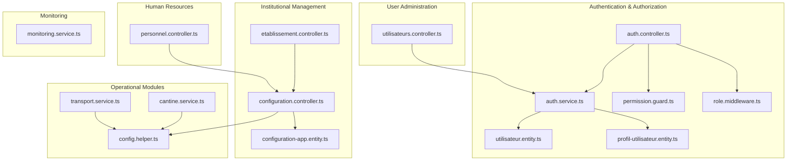

**Diagram sources**
- [auth.controller.ts:1-268](file://backend/src/modules/auth/controllers/auth.controller.ts#L1-L268)
- [auth.service.ts:1-485](file://backend/src/modules/auth/services/auth.service.ts#L1-L485)
- [permission.guard.ts:1-118](file://backend/src/modules/auth/guards/permission.guard.ts#L1-L118)
- [role.middleware.ts:1-152](file://backend/src/modules/auth/middlewares/role.middleware.ts#L1-L152)
- [utilisateur.entity.ts:1-143](file://backend/src/modules/auth/entities/utilisateur.entity.ts#L1-L143)
- [profil-utilisateur.entity.ts:1-105](file://backend/src/modules/auth/entities/profil-utilisateur.entity.ts#L1-L105)
- [etablissement.controller.ts:1-44](file://backend/src/modules/etablissement/controllers/etablissement.controller.ts#L1-L44)
- [configuration.controller.ts:1-411](file://backend/src/modules/configuration/controllers/configuration.controller.ts#L1-L411)
- [configuration-app.entity.ts:1-112](file://backend/src/modules/configuration/entities/configuration-app.entity.ts#L1-L112)
- [personnel.controller.ts:1-75](file://backend/src/modules/personnel/controllers/personnel.controller.ts#L1-L75)
- [utilisateurs.controller.ts:1-207](file://backend/src/modules/utilisateurs/controllers/utilisateurs.controller.ts#L1-L207)
- [cantine.service.ts:1-200](file://backend/src/modules/cantine/services/cantine.service.ts#L1-L200)
- [transport.service.ts:1-200](file://backend/src/modules/transport/services/transport.service.ts#L1-L200)
- [config.helper.ts:1-200](file://backend/src/modules/configuration/utils/config.helper.ts#L1-L200)

**Section sources**
- [auth.controller.ts:1-268](file://backend/src/modules/auth/controllers/auth.controller.ts#L1-L268)
- [auth.service.ts:1-485](file://backend/src/modules/auth/services/auth.service.ts#L1-L485)
- [permission.guard.ts:1-118](file://backend/src/modules/auth/guards/permission.guard.ts#L1-L118)
- [role.middleware.ts:1-152](file://backend/src/modules/auth/middlewares/role.middleware.ts#L1-L152)
- [utilisateur.entity.ts:1-143](file://backend/src/modules/auth/entities/utilisateur.entity.ts#L1-L143)
- [profil-utilisateur.entity.ts:1-105](file://backend/src/modules/auth/entities/profil-utilisateur.entity.ts#L1-L105)
- [etablissement.controller.ts:1-44](file://backend/src/modules/etablissement/controllers/etablissement.controller.ts#L1-L44)
- [configuration.controller.ts:1-411](file://backend/src/modules/configuration/controllers/configuration.controller.ts#L1-L411)
- [configuration-app.entity.ts:1-112](file://backend/src/modules/configuration/entities/configuration-app.entity.ts#L1-L112)
- [personnel.controller.ts:1-75](file://backend/src/modules/personnel/controllers/personnel.controller.ts#L1-L75)
- [utilisateurs.controller.ts:1-207](file://backend/src/modules/utilisateurs/controllers/utilisateurs.controller.ts#L1-L207)
- [cantine.service.ts:1-200](file://backend/src/modules/cantine/services/cantine.service.ts#L1-L200)
- [transport.service.ts:1-200](file://backend/src/modules/transport/services/transport.service.ts#L1-L200)
- [config.helper.ts:1-200](file://backend/src/modules/configuration/utils/config.helper.ts#L1-L200)

## Core Components
- Authentication and Authorization
  - Controllers expose endpoints for login, registration, token refresh, logout, password reset/change, email verification, and profile retrieval.
  - Services enforce security parameters from centralized configuration, manage tokens, and log audit events.
  - Guards and middlewares implement role-based and permission-based access checks, with a bypass for super administrators.

- Institutional Management
  - Controllers manage application configuration, module activation, parameter management, history, backups, cache invalidation, and exports.
  - Entities define application-wide settings including institution info, locale, theme, license, and active modules.
  - **Updated** Enhanced with operational module configuration support including cantine and transport parameters.

- Human Resources
  - Controllers manage staff types and members with role-restricted endpoints.

- User Administration
  - Controllers manage users and profiles with fine-grained access controls and status updates.

- Operational Modules
  - **New** Cantine module with debt limit validation using configurable `cantine.max_debt` parameter.
  - **New** Transport module with real-time tracking capabilities using configurable `transport.alert_delay_minutes` parameter.

- Monitoring
  - Controllers and services provide monitoring endpoints for system health and metrics.

**Section sources**
- [auth.controller.ts:55-264](file://backend/src/modules/auth/controllers/auth.controller.ts#L55-L264)
- [auth.service.ts:48-161](file://backend/src/modules/auth/services/auth.service.ts#L48-L161)
- [permission.guard.ts:44-88](file://backend/src/modules/auth/guards/permission.guard.ts#L44-L88)
- [role.middleware.ts:20-51](file://backend/src/modules/auth/middlewares/role.middleware.ts#L20-L51)
- [configuration.controller.ts:71-125](file://backend/src/modules/configuration/controllers/configuration.controller.ts#L71-L125)
- [configuration-app.entity.ts:21-108](file://backend/src/modules/configuration/entities/configuration-app.entity.ts#L21-L108)
- [personnel.controller.ts:25-71](file://backend/src/modules/personnel/controllers/personnel.controller.ts#L25-L71)
- [utilisateurs.controller.ts:47-203](file://backend/src/modules/utilisateurs/controllers/utilisateurs.controller.ts#L47-L203)
- [cantine.service.ts:33-43](file://backend/src/modules/cantine/services/cantine.service.ts#L33-L43)
- [transport.service.ts:123-137](file://backend/src/modules/transport/services/transport.service.ts#L123-L137)

## Architecture Overview
The administrative architecture follows layered modules with explicit separation of concerns:
- Controllers orchestrate requests and delegate to services.
- Services encapsulate business logic, integrate with repositories, and coordinate with audit/logging.
- Guards and middlewares enforce authorization policies.
- Entities model data and relationships.
- Shared enums define roles and permissions consistently across modules.
- **Updated** Configuration helper provides centralized parameter management for all modules.

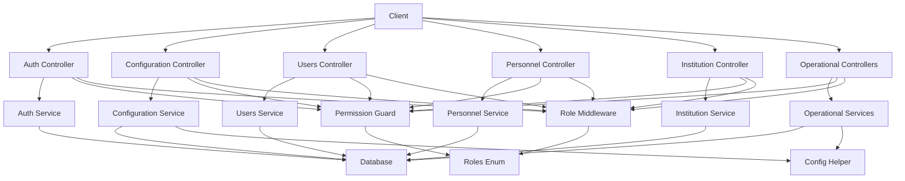

**Diagram sources**
- [auth.controller.ts:1-268](file://backend/src/modules/auth/controllers/auth.controller.ts#L1-L268)
- [configuration.controller.ts:1-411](file://backend/src/modules/configuration/controllers/configuration.controller.ts#L1-L411)
- [utilisateurs.controller.ts:1-207](file://backend/src/modules/utilisateurs/controllers/utilisateurs.controller.ts#L1-L207)
- [personnel.controller.ts:1-75](file://backend/src/modules/personnel/controllers/personnel.controller.ts#L1-L75)
- [etablissement.controller.ts:1-44](file://backend/src/modules/etablissement/controllers/etablissement.controller.ts#L1-L44)
- [auth.service.ts:1-485](file://backend/src/modules/auth/services/auth.service.ts#L1-L485)
- [roles.enum.ts](file://shared/src/enums/roles.enum.ts)
- [config.helper.ts:1-200](file://backend/src/modules/configuration/utils/config.helper.ts#L1-L200)

## Detailed Component Analysis

### Authentication and Authorization
- Endpoints
  - Login, register, refresh tokens, logout, logout-all, forgot password, reset password, change password, verify email, current user.
- Security parameters
  - Loaded from centralized configuration for login attempts, lockout duration, session duration, and password minimum length.
- Audit and logging
  - Successful and failed login attempts, password resets, logout actions, and access denials are logged.
- Tokens
  - Access tokens and refresh tokens with IP and User-Agent binding for refresh validation.

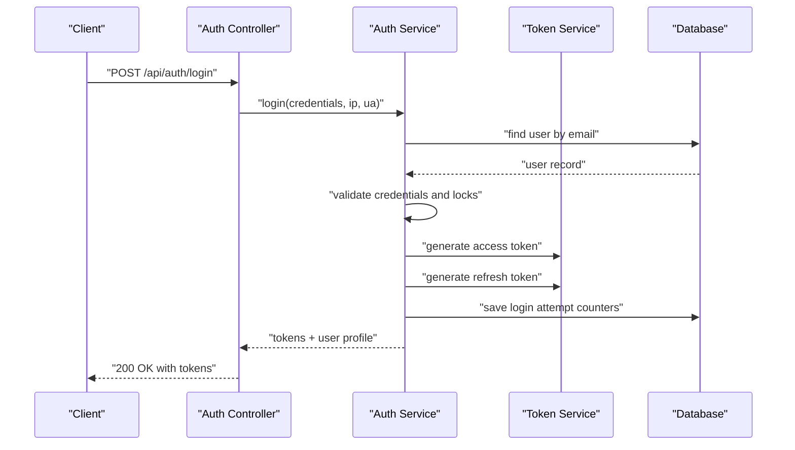

**Diagram sources**
- [auth.controller.ts:55-74](file://backend/src/modules/auth/controllers/auth.controller.ts#L55-L74)
- [auth.service.ts:61-161](file://backend/src/modules/auth/services/auth.service.ts#L61-L161)

**Section sources**
- [auth.controller.ts:55-264](file://backend/src/modules/auth/controllers/auth.controller.ts#L55-L264)
- [auth.service.ts:48-161](file://backend/src/modules/auth/services/auth.service.ts#L48-L161)

### Institutional Management
- Application configuration
  - Retrieve and update institution settings, license activation, and theme parameters.
- Module configuration
  - List, retrieve, update, and toggle modules per institution.
- Parameter management
  - CRUD operations on system parameters with categorization and bulk updates.
- **Updated** Operational module parameters including cantine and transport configurations.
- History and backups
  - Audit logs, restore from history, create and restore backups, invalidate caches, and export configuration.
- Listener integration
  - Emits change and restoration events to propagate configuration updates.

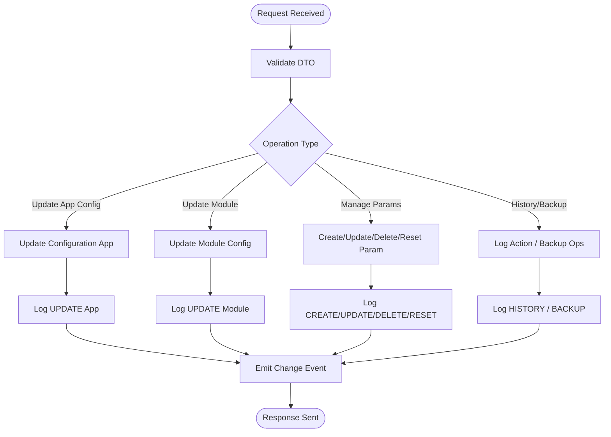

**Diagram sources**
- [configuration.controller.ts:99-125](file://backend/src/modules/configuration/controllers/configuration.controller.ts#L99-L125)
- [configuration.controller.ts:153-169](file://backend/src/modules/configuration/controllers/configuration.controller.ts#L153-L169)
- [configuration.controller.ts:238-267](file://backend/src/modules/configuration/controllers/configuration.controller.ts#L238-L267)
- [configuration.controller.ts:333-339](file://backend/src/modules/configuration/controllers/configuration.controller.ts#L333-L339)
- [configuration.controller.ts:360-366](file://backend/src/modules/configuration/controllers/configuration.controller.ts#L360-L366)

**Section sources**
- [configuration.controller.ts:71-125](file://backend/src/modules/configuration/controllers/configuration.controller.ts#L71-L125)
- [configuration.controller.ts:139-179](file://backend/src/modules/configuration/controllers/configuration.controller.ts#L139-L179)
- [configuration.controller.ts:184-313](file://backend/src/modules/configuration/controllers/configuration.controller.ts#L184-L313)
- [configuration.controller.ts:318-366](file://backend/src/modules/configuration/controllers/configuration.controller.ts#L318-L366)
- [configuration-app.entity.ts:21-108](file://backend/src/modules/configuration/entities/configuration-app.entity.ts#L21-L108)

### Human Resources
- Staff types
  - Retrieve types and create new types with role restrictions.
- Staff members
  - List, create, update, and delete staff members with role restrictions.

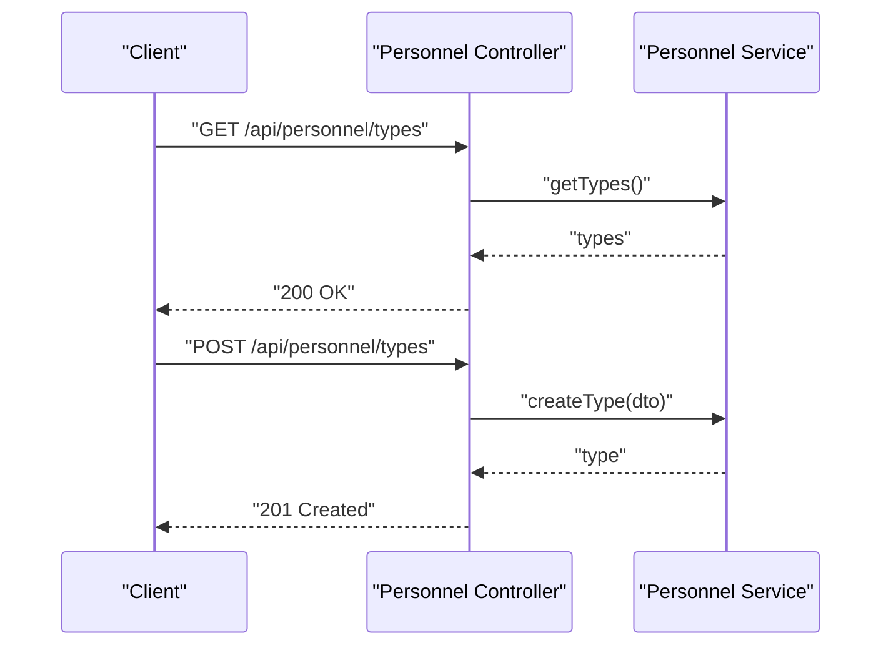

**Diagram sources**
- [personnel.controller.ts:26-39](file://backend/src/modules/personnel/controllers/personnel.controller.ts#L26-L39)

**Section sources**
- [personnel.controller.ts:25-71](file://backend/src/modules/personnel/controllers/personnel.controller.ts#L25-L71)

### User Administration
- Users
  - List users with pagination and filters, retrieve/update own profile, update any profile, change user status, and delete users.
- Profiles
  - Update personal profile with validation and role-based access checks.

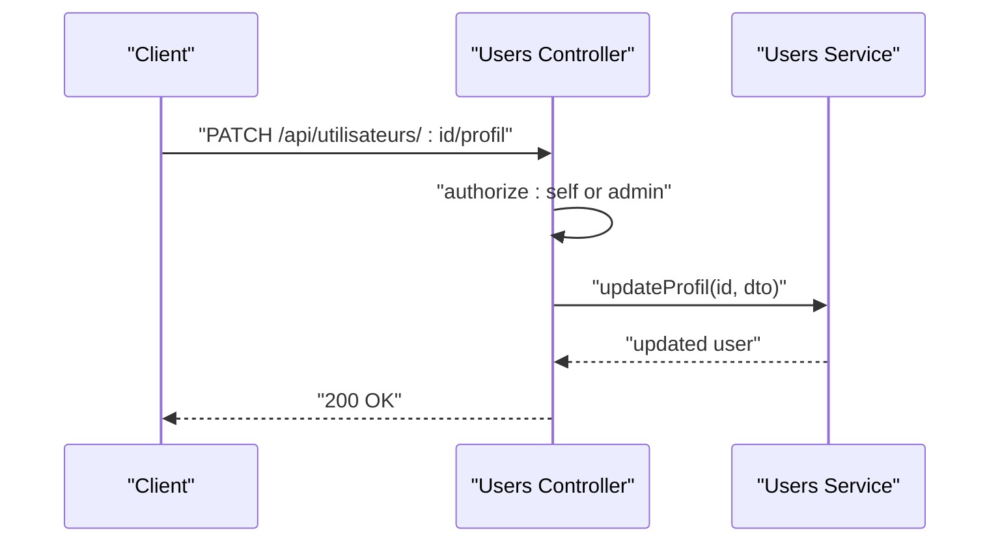

**Diagram sources**
- [utilisateurs.controller.ts:135-156](file://backend/src/modules/utilisateurs/controllers/utilisateurs.controller.ts#L135-L156)

**Section sources**
- [utilisateurs.controller.ts:47-203](file://backend/src/modules/utilisateurs/controllers/utilisateurs.controller.ts#L47-L203)

### Operational Modules Enhancement

#### Cantine Debt Limit Validation
- **New Feature** Configurable debt limit enforcement for student meal accounts.
- Parameter: `cantine.max_debt` with default value of 10,000 currency units.
- Validation Logic: Prevents students from exceeding configured maximum debt when making meal purchases.
- Currency Support: Automatically uses regional currency configuration.

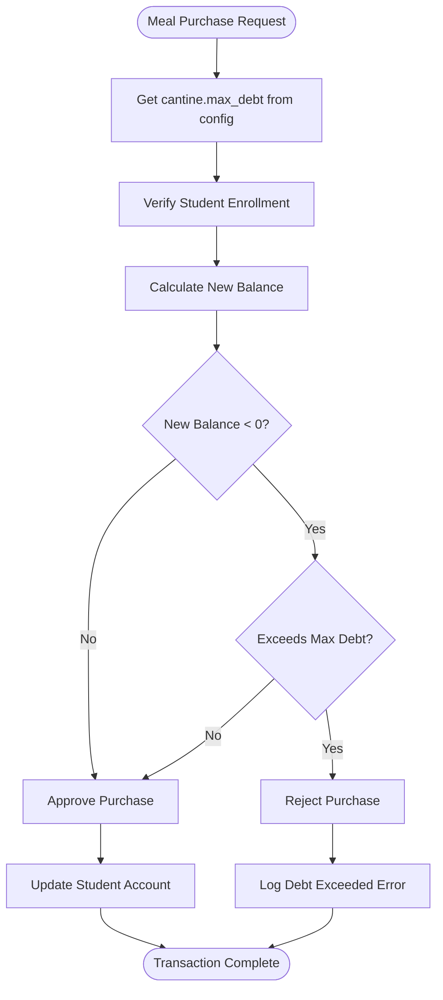

**Diagram sources**
- [cantine.service.ts:148-160](file://backend/src/modules/cantine/services/cantine.service.ts#L148-L160)

#### Transport Real-Time Tracking
- **New Feature** Real-time bus delay detection and alert system.
- Parameter: `transport.alert_delay_minutes` with configurable threshold for delay alerts.
- Delay Calculation: Compares current time with scheduled departure time to determine delays.
- Alert Generation: Automatically flags buses running behind schedule for operational monitoring.

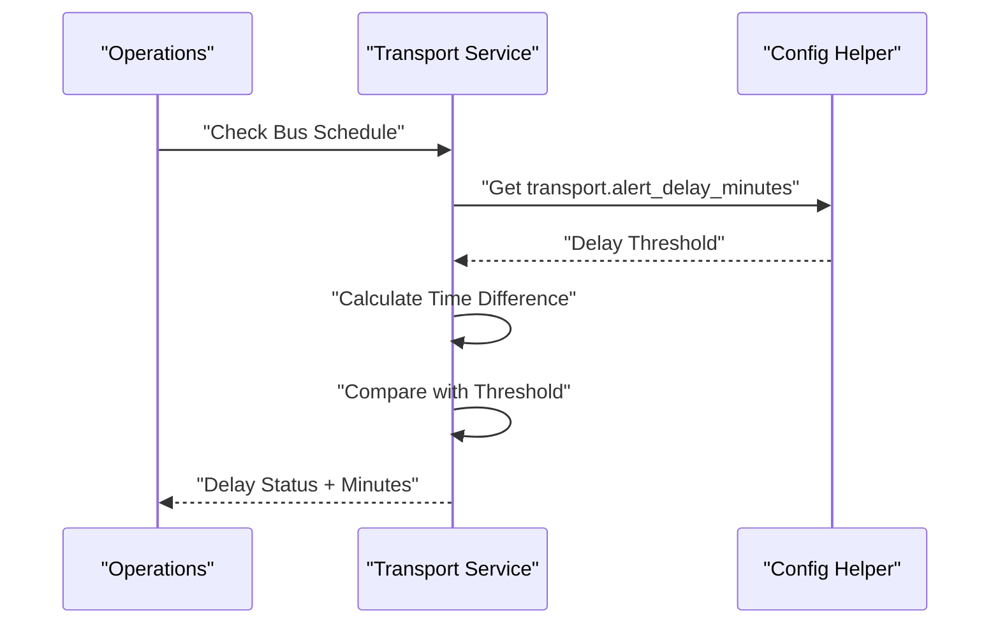

**Diagram sources**
- [transport.service.ts:123-137](file://backend/src/modules/transport/services/transport.service.ts#L123-L137)

**Section sources**
- [cantine.service.ts:33-43](file://backend/src/modules/cantine/services/cantine.service.ts#L33-L43)
- [cantine.service.ts:148-160](file://backend/src/modules/cantine/services/cantine.service.ts#L148-L160)
- [transport.service.ts:123-137](file://backend/src/modules/transport/services/transport.service.ts#L123-L137)
- [config.helper.ts:1-200](file://backend/src/modules/configuration/utils/config.helper.ts#L1-L200)

### Authorization and Permissions
- Role middleware
  - Enforces role-based access with a bypass for super administrators and logs denied access.
- Permission guard
  - Checks granular permissions per role, supports OR/AND semantics, and logs access denials.
- Shared roles and permissions
  - Centralized definitions ensure consistent policy enforcement across modules.

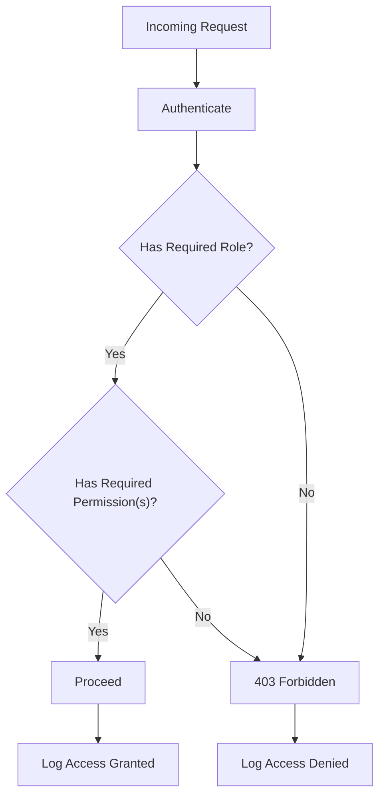

**Diagram sources**
- [role.middleware.ts:20-51](file://backend/src/modules/auth/middlewares/role.middleware.ts#L20-L51)
- [permission.guard.ts:44-88](file://backend/src/modules/auth/guards/permission.guard.ts#L44-L88)

**Section sources**
- [role.middleware.ts:20-107](file://backend/src/modules/auth/middlewares/role.middleware.ts#L20-L107)
- [permission.guard.ts:20-88](file://backend/src/modules/auth/guards/permission.guard.ts#L20-L88)
- [roles.enum.ts](file://shared/src/enums/roles.enum.ts)

### Entities and Data Model
- User entity
  - Core identity, credentials, role, status, verification tokens, login attempts, locks, and timestamps.
- Profile entity
  - Personal details linked to user via foreign key.
- Configuration app entity
  - Institution metadata, locale, theme, license, active modules, and versioning.
- **Updated** Operational configuration parameters integrated into centralized configuration system.

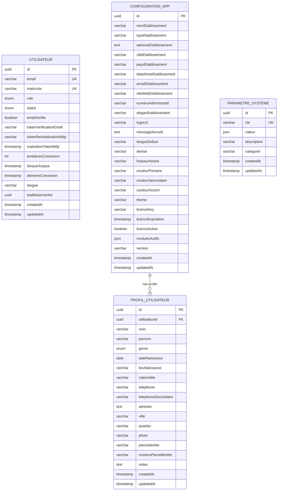

**Diagram sources**
- [utilisateur.entity.ts:51-140](file://backend/src/modules/auth/entities/utilisateur.entity.ts#L51-L140)
- [profil-utilisateur.entity.ts:33-102](file://backend/src/modules/auth/entities/profil-utilisateur.entity.ts#L33-L102)
- [configuration-app.entity.ts:21-108](file://backend/src/modules/configuration/entities/configuration-app.entity.ts#L21-L108)

**Section sources**
- [utilisateur.entity.ts:25-140](file://backend/src/modules/auth/entities/utilisateur.entity.ts#L25-L140)
- [profil-utilisateur.entity.ts:23-102](file://backend/src/modules/auth/entities/profil-utilisateur.entity.ts#L23-L102)
- [configuration-app.entity.ts:21-108](file://backend/src/modules/configuration/entities/configuration-app.entity.ts#L21-L108)

## Dependency Analysis
- Controllers depend on services for business logic and on guards/middlewares for authorization.
- Services depend on repositories and shared configuration helpers.
- Entities define relationships and constraints enforced by the ORM.
- Guards and middlewares rely on shared role and permission definitions.
- **Updated** Operational services depend on centralized configuration helper for parameter management.

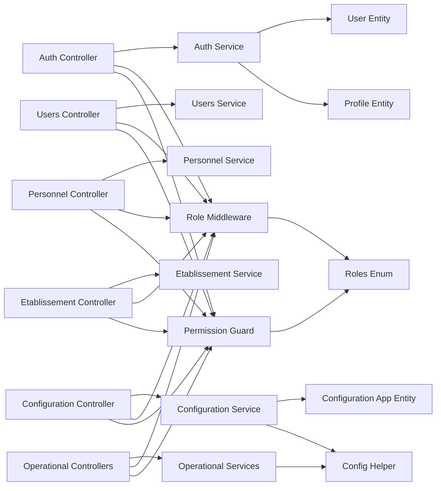

**Diagram sources**
- [auth.controller.ts:1-268](file://backend/src/modules/auth/controllers/auth.controller.ts#L1-L268)
- [configuration.controller.ts:1-411](file://backend/src/modules/configuration/controllers/configuration.controller.ts#L1-L411)
- [utilisateurs.controller.ts:1-207](file://backend/src/modules/utilisateurs/controllers/utilisateurs.controller.ts#L1-L207)
- [personnel.controller.ts:1-75](file://backend/src/modules/personnel/controllers/personnel.controller.ts#L1-L75)
- [etablissement.controller.ts:1-44](file://backend/src/modules/etablissement/controllers/etablissement.controller.ts#L1-L44)
- [auth.service.ts:1-485](file://backend/src/modules/auth/services/auth.service.ts#L1-L485)
- [utilisateur.entity.ts:1-143](file://backend/src/modules/auth/entities/utilisateur.entity.ts#L1-L143)
- [profil-utilisateur.entity.ts:1-105](file://backend/src/modules/auth/entities/profil-utilisateur.entity.ts#L1-L105)
- [configuration-app.entity.ts:1-112](file://backend/src/modules/configuration/entities/configuration-app.entity.ts#L1-L112)
- [role.middleware.ts:1-152](file://backend/src/modules/auth/middlewares/role.middleware.ts#L1-L152)
- [permission.guard.ts:1-118](file://backend/src/modules/auth/guards/permission.guard.ts#L1-L118)
- [roles.enum.ts](file://shared/src/enums/roles.enum.ts)
- [config.helper.ts:1-200](file://backend/src/modules/configuration/utils/config.helper.ts#L1-L200)

**Section sources**
- [auth.controller.ts:1-268](file://backend/src/modules/auth/controllers/auth.controller.ts#L1-L268)
- [configuration.controller.ts:1-411](file://backend/src/modules/configuration/controllers/configuration.controller.ts#L1-L411)
- [utilisateurs.controller.ts:1-207](file://backend/src/modules/utilisateurs/controllers/utilisateurs.controller.ts#L1-L207)
- [personnel.controller.ts:1-75](file://backend/src/modules/personnel/controllers/personnel.controller.ts#L1-L75)
- [etablissement.controller.ts:1-44](file://backend/src/modules/etablissement/controllers/etablissement.controller.ts#L1-L44)
- [auth.service.ts:1-485](file://backend/src/modules/auth/services/auth.service.ts#L1-L485)
- [utilisateur.entity.ts:1-143](file://backend/src/modules/auth/entities/utilisateur.entity.ts#L1-L143)
- [profil-utilisateur.entity.ts:1-105](file://backend/src/modules/auth/entities/profil-utilisateur.entity.ts#L1-L105)
- [configuration-app.entity.ts:1-112](file://backend/src/modules/configuration/entities/configuration-app.entity.ts#L1-L112)
- [role.middleware.ts:1-152](file://backend/src/modules/auth/middlewares/role.middleware.ts#L1-L152)
- [permission.guard.ts:1-118](file://backend/src/modules/auth/guards/permission.guard.ts#L1-L118)
- [roles.enum.ts](file://shared/src/enums/roles.enum.ts)
- [config.helper.ts:1-200](file://backend/src/modules/configuration/utils/config.helper.ts#L1-L200)

## Performance Considerations
- Centralized configuration parameters reduce repeated reads and enable dynamic tuning of security and behavior without redeployment.
- **Updated** Configuration helper caches frequently accessed parameters to minimize database queries.
- Token generation and refresh leverage IP/User-Agent binding to minimize replay risks and optimize session lifecycle.
- Bulk parameter updates reduce round-trips for administrative tasks.
- Audit logging is asynchronous and scoped to critical events to minimize overhead.
- **New** Operational module parameters are cached locally within service instances for optimal performance.

## Troubleshooting Guide
- Authentication failures
  - Incorrect credentials increase login attempts; after threshold, accounts are locked for configured duration.
  - Suspended or inactive accounts are rejected with appropriate messages.
- Authorization failures
  - Role and permission middleware return 403 with access denied logs; verify user role and permissions.
- Configuration operations
  - Validation errors surface structured field-level messages; ensure DTOs conform to schemas.
  - History and backup operations require appropriate permissions; confirm audit trail entries.
- **New** Cantine debt limit issues
  - Students unable to purchase meals may exceed configured `cantine.max_debt` limit; adjust parameter value as needed.
  - Verify currency configuration matches regional settings.
- **New** Transport delay detection problems
  - Buses not flagged as delayed despite being late; check `transport.alert_delay_minutes` configuration.
  - Timezone differences affecting delay calculations; ensure server timezone alignment.

**Section sources**
- [auth.service.ts:74-113](file://backend/src/modules/auth/services/auth.service.ts#L74-L113)
- [role.middleware.ts:32-44](file://backend/src/modules/auth/middlewares/role.middleware.ts#L32-L44)
- [permission.guard.ts:68-81](file://backend/src/modules/auth/guards/permission.guard.ts#L68-L81)
- [configuration.controller.ts:55-65](file://backend/src/modules/configuration/controllers/configuration.controller.ts#L55-L65)
- [cantine.service.ts:148-160](file://backend/src/modules/cantine/services/cantine.service.ts#L148-L160)
- [transport.service.ts:123-137](file://backend/src/modules/transport/services/transport.service.ts#L123-L137)

## Conclusion
The administrative modules provide a robust, configurable, and auditable foundation for institutional governance. Centralized configuration enables dynamic control of application behavior, while strict role and permission enforcement ensures least-privilege access. The integration across authentication, institutional settings, HR, and user administration promotes compliance and operational consistency.

**Updated** Recent enhancements include operational module configuration capabilities with cantine debt limit validation and transport real-time tracking, providing administrators with powerful tools to monitor and control critical school services while maintaining system integrity and compliance.