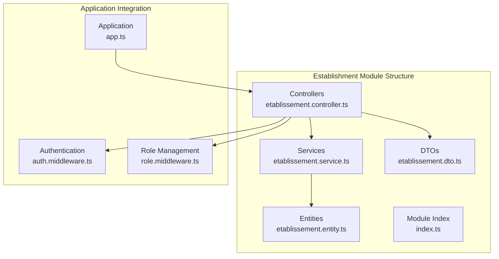
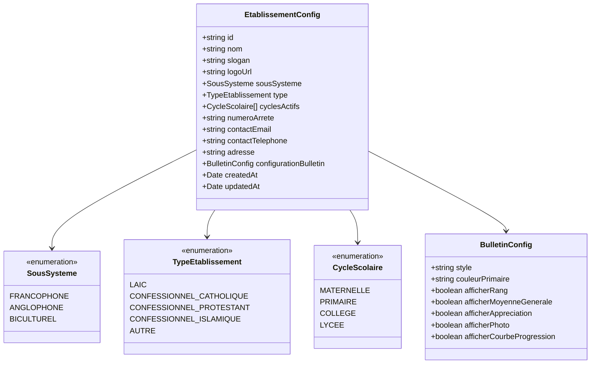
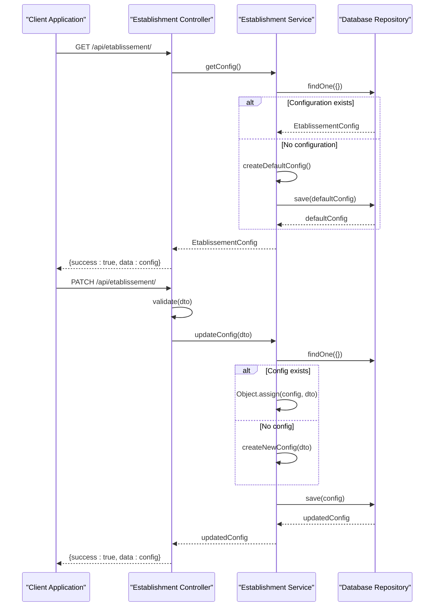
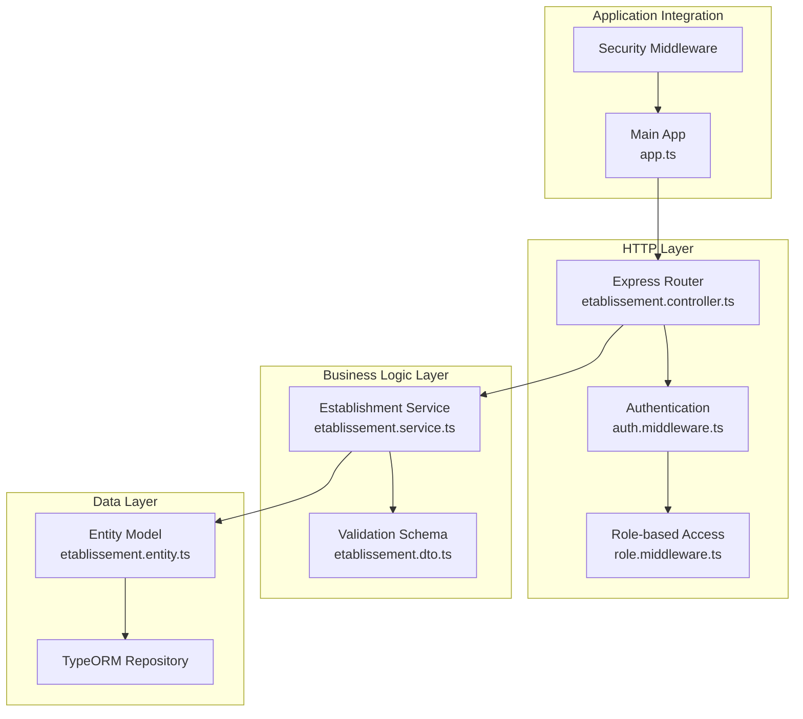
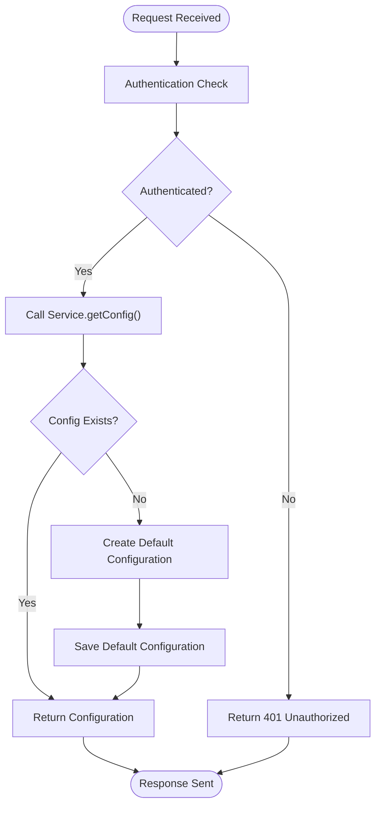
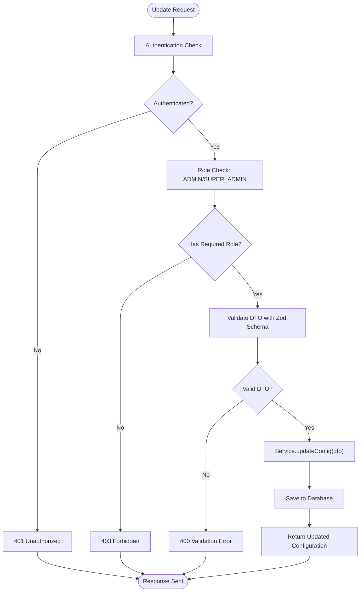
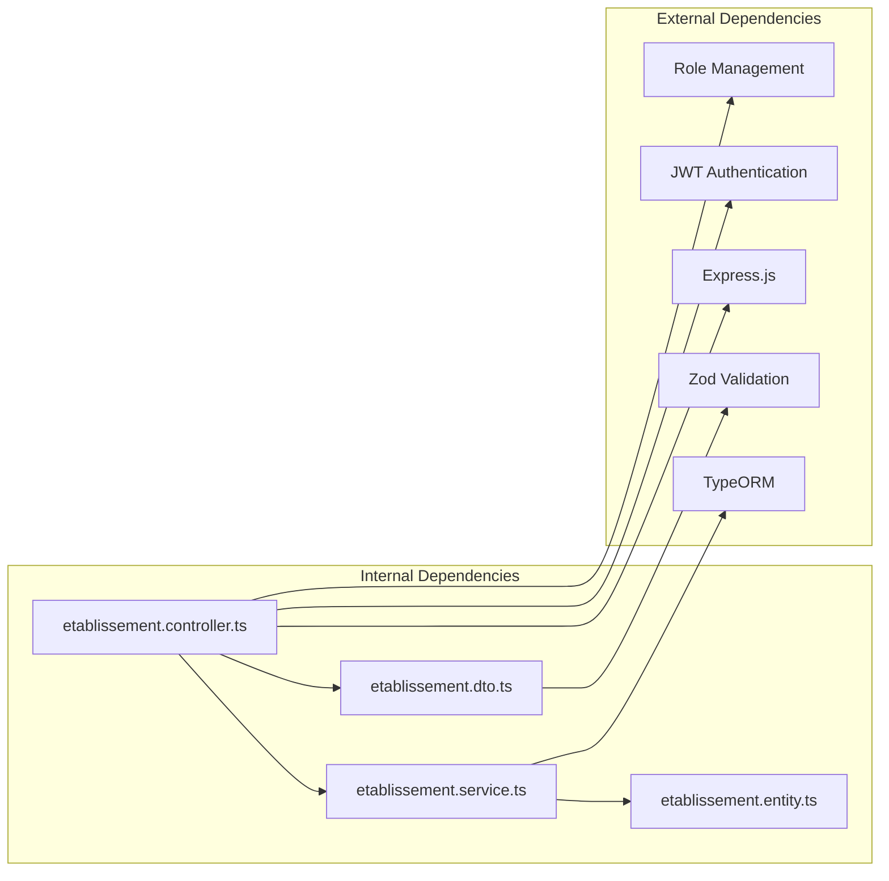

# Establishment Management

<cite>
**Referenced Files in This Document**
- [etablissement.controller.ts](file://backend/src/modules/etablissement/controllers/etablissement.controller.ts)
- [etablissement.dto.ts](file://backend/src/modules/etablissement/dto/etablissement.dto.ts)
- [etablissement.entity.ts](file://backend/src/modules/etablissement/entities/etablissement.entity.ts)
- [etablissement.service.ts](file://backend/src/modules/etablissement/services/etablissement.service.ts)
- [app.ts](file://backend/src/app.ts)
- [auth.middleware.ts](file://backend/src/modules/auth/middlewares/auth.middleware.ts)
- [role.middleware.ts](file://backend/src/modules/auth/middlewares/role.middleware.ts)
- [roles.enum.ts](file://shared/src/enums/roles.enum.ts)
</cite>

## Table of Contents
1. [Introduction](#introduction)
2. [Project Structure](#project-structure)
3. [Core Components](#core-components)
4. [Architecture Overview](#architecture-overview)
5. [Detailed Component Analysis](#detailed-component-analysis)
6. [Dependency Analysis](#dependency-analysis)
7. [Performance Considerations](#performance-considerations)
8. [Troubleshooting Guide](#troubleshooting-guide)
9. [Conclusion](#conclusion)

## Introduction

Establishment Management is a critical module in the eLISAschool educational management system that handles institutional configuration and administrative boundaries. This module manages the establishment entity model, including institutional properties, administrative hierarchies, and geographic information. It provides comprehensive CRUD functionality for establishment configuration while maintaining strict validation rules and business logic.

The module serves as the foundation for institutional context across all other modules in the system, enabling proper segregation of data and administration across different educational institutions. It supports multiple administrative systems (Francophone, Anglophone, Biculturel) and various establishment types (laic, confessionnel, etc.), making it adaptable to diverse educational contexts.

## Project Structure

The Establishment Management module follows a clean architecture pattern with clear separation of concerns:



**Diagram sources**
- [etablissement.controller.ts:1-44](file://backend/src/modules/etablissement/controllers/etablissement.controller.ts#L1-L44)
- [etablissement.service.ts:1-60](file://backend/src/modules/etablissement/services/etablissement.service.ts#L1-L60)
- [etablissement.entity.ts:1-93](file://backend/src/modules/etablissement/entities/etablissement.entity.ts#L1-L93)
- [app.ts:176](file://backend/src/app.ts#L176)

**Section sources**
- [etablissement.controller.ts:1-44](file://backend/src/modules/etablissement/controllers/etablissement.controller.ts#L1-L44)
- [etablissement.service.ts:1-60](file://backend/src/modules/etablissement/services/etablissement.service.ts#L1-L60)
- [etablissement.entity.ts:1-93](file://backend/src/modules/etablissement/entities/etablissement.entity.ts#L1-L93)
- [app.ts:176](file://backend/src/app.ts#L176)

## Core Components

### Establishment Entity Model

The establishment entity model defines the institutional configuration structure with comprehensive administrative capabilities:



**Diagram sources**
- [etablissement.entity.ts:17-36](file://backend/src/modules/etablissement/entities/etablissement.entity.ts#L17-L36)
- [etablissement.entity.ts:42-92](file://backend/src/modules/etablissement/entities/etablissement.entity.ts#L42-L92)

### Establishment Service Operations

The establishment service provides robust CRUD operations with comprehensive validation and business logic:



**Diagram sources**
- [etablissement.controller.ts:26-40](file://backend/src/modules/etablissement/controllers/etablissement.controller.ts#L26-L40)
- [etablissement.service.ts:24-56](file://backend/src/modules/etablissement/services/etablissement.service.ts#L24-L56)

**Section sources**
- [etablissement.service.ts:24-56](file://backend/src/modules/etablissement/services/etablissement.service.ts#L24-L56)
- [etablissement.controller.ts:26-40](file://backend/src/modules/etablissement/controllers/etablissement.controller.ts#L26-L40)

## Architecture Overview

The Establishment Management module integrates seamlessly with the broader eLISAschool architecture through a well-defined middleware stack and role-based access control system:



**Diagram sources**
- [app.ts:38](file://backend/src/app.ts#L38)
- [etablissement.controller.ts:8-12](file://backend/src/modules/etablissement/controllers/etablissement.controller.ts#L8-L12)
- [auth.middleware.ts:30-60](file://backend/src/modules/auth/middlewares/auth.middleware.ts#L30-L60)
- [role.middleware.ts:20-50](file://backend/src/modules/auth/middlewares/role.middleware.ts#L20-L50)

The architecture ensures proper separation of concerns with clear boundaries between presentation, business logic, and data persistence layers.

**Section sources**
- [app.ts:38](file://backend/src/app.ts#L38)
- [auth.middleware.ts:30-60](file://backend/src/modules/auth/middlewares/auth.middleware.ts#L30-L60)
- [role.middleware.ts:20-50](file://backend/src/modules/auth/middlewares/role.middleware.ts#L20-L50)

## Detailed Component Analysis

### Establishment Controller Endpoints

The establishment controller provides two primary endpoints with distinct security requirements:

#### GET /api/etablissement/ - Configuration Retrieval

The GET endpoint retrieves establishment configuration with public access considerations:



**Diagram sources**
- [etablissement.controller.ts:26-31](file://backend/src/modules/etablissement/controllers/etablissement.controller.ts#L26-L31)
- [etablissement.service.ts:24-34](file://backend/src/modules/etablissement/services/etablissement.service.ts#L24-L34)

#### PATCH /api/etablissement/ - Configuration Update

The PATCH endpoint requires administrative privileges and comprehensive validation:



**Diagram sources**
- [etablissement.controller.ts:34-40](file://backend/src/modules/etablissement/controllers/etablissement.controller.ts#L34-L40)
- [etablissement.service.ts:39-56](file://backend/src/modules/etablissement/services/etablissement.service.ts#L39-L56)

**Section sources**
- [etablissement.controller.ts:26-40](file://backend/src/modules/etablissement/controllers/etablissement.controller.ts#L26-L40)

### DTO Validation Schema

The establishment DTO implements comprehensive validation using Zod schema:

| Field | Type | Validation Rules | Description |
|-------|------|------------------|-------------|
| `nom` | string | min(3), max(255), optional | Institution name with length constraints |
| `slogan` | string | optional | Optional institution slogan |
| `logoUrl` | string | url(), optional, or empty string | Logo URL with validation or empty |
| `sousSysteme` | enum | nativeEnum(SousSysteme), optional | Administrative system type |
| `type` | enum | nativeEnum(TypeEtablissement), optional | Establishment type classification |
| `cyclesActifs` | array | nativeEnum(CycleScolaire[]), optional | Active academic cycles |
| `numeroArrete` | string | optional | Administrative decree number |
| `contactEmail` | string | email(), optional, or empty string | Contact email with validation |
| `contactTelephone` | string | optional | Contact phone number |
| `adresse` | string | optional | Complete address |
| `configurationBulletin` | object | optional | Report card configuration |

**Section sources**
- [etablissement.dto.ts:10-30](file://backend/src/modules/etablissement/dto/etablissement.dto.ts#L10-L30)

### Business Logic Implementation

The establishment service encapsulates all business logic with robust error handling and data validation:

#### Configuration Management Strategy

The service implements a singleton pattern with automatic configuration creation:

```mermaid
stateDiagram-v2
[*] --> CheckExists
CheckExists --> Exists{"Configuration Exists?"}
Exists --> |Yes| ReturnExisting["Return Existing Configuration"]
Exists --> |No| CreateDefault["Create Default Configuration"]
CreateDefault --> SaveDefault["Save to Database"]
SaveDefault --> ReturnCreated["Return Created Configuration"]
ReturnExisting --> [*]
ReturnCreated --> [*]
```

**Diagram sources**
- [etablissement.service.ts:24-34](file://backend/src/modules/etablissement/services/etablissement.service.ts#L24-L34)

#### Update Operation Safety Mechanisms

The update operation includes multiple safety checks:

1. **Existence Verification**: Ensures configuration exists before updates
2. **Partial Updates**: Allows selective field updates
3. **Enum Validation**: Validates academic cycle enumerations
4. **Logging**: Comprehensive audit trail for configuration changes

**Section sources**
- [etablissement.service.ts:39-56](file://backend/src/modules/etablissement/services/etablissement.service.ts#L39-L56)

## Dependency Analysis

The establishment module maintains loose coupling with external dependencies while providing strong internal cohesion:



**Diagram sources**
- [etablissement.controller.ts:8-12](file://backend/src/modules/etablissement/controllers/etablissement.controller.ts#L8-L12)
- [etablissement.service.ts:9](file://backend/src/modules/etablissement/services/etablissement.service.ts#L9)
- [etablissement.dto.ts:8](file://backend/src/modules/etablissement/dto/etablissement.dto.ts#L8)

### Security Integration

The module integrates with the authentication and authorization system through middleware composition:

| Component | Integration Point | Purpose |
|-----------|------------------|---------|
| Authentication Middleware | All endpoints | JWT token verification |
| Role Middleware | PATCH endpoint only | ADMIN/SUPER_ADMIN requirement |
| User Context | Request object | User identification and establishment context |
| Audit Logging | Access denied events | Security event tracking |

**Section sources**
- [auth.middleware.ts:30-60](file://backend/src/modules/auth/middlewares/auth.middleware.ts#L30-L60)
- [role.middleware.ts:20-50](file://backend/src/modules/auth/middlewares/role.middleware.ts#L20-L50)

## Performance Considerations

The establishment module is designed for optimal performance through several architectural decisions:

### Database Optimization

- **Single Configuration Pattern**: Uses UUID primary key for efficient indexing
- **Simple JSON Storage**: Stores complex configurations in JSON format for flexibility
- **Minimal Queries**: Single database query per operation with automatic creation

### Caching Strategy

- **Memory-Level Caching**: Service maintains in-memory repository instance
- **Automatic Creation**: Default configuration created once and reused
- **Efficient Updates**: Partial updates minimize database writes

### Scalability Features

- **UUID Identifiers**: Eliminates auto-increment bottlenecks
- **JSON Configuration**: Flexible schema evolution without migrations
- **Enum Constraints**: Database-level validation prevents invalid data

## Troubleshooting Guide

### Common Issues and Solutions

#### Authentication Failures
- **Issue**: 401 Unauthorized errors on establishment requests
- **Cause**: Missing or invalid JWT token
- **Solution**: Ensure proper authentication headers with Bearer token

#### Authorization Problems  
- **Issue**: 403 Forbidden when updating establishment configuration
- **Cause**: Insufficient role privileges
- **Solution**: Verify user has ADMIN or SUPER_ADMIN role

#### Validation Errors
- **Issue**: 400 Validation errors on PATCH requests
- **Cause**: DTO validation failures
- **Solution**: Check field constraints and data types

#### Database Issues
- **Issue**: Configuration not persisting
- **Cause**: Database connectivity problems
- **Solution**: Verify database connection and migration status

**Section sources**
- [auth.middleware.ts:35-46](file://backend/src/modules/auth/middlewares/auth.middleware.ts#L35-L46)
- [role.middleware.ts:29-44](file://backend/src/modules/auth/middlewares/role.middleware.ts#L29-L44)

## Conclusion

The Establishment Management module provides a robust foundation for institutional configuration in the eLISAschool system. Its clean architecture, comprehensive validation, and security integration make it suitable for production environments across diverse educational contexts.

Key strengths include:
- **Flexible Configuration Model**: Supports multiple administrative systems and establishment types
- **Strong Security**: Role-based access control with comprehensive validation
- **Maintainable Design**: Clear separation of concerns with dependency injection
- **Performance Optimized**: Efficient database operations with minimal overhead

The module successfully addresses the core requirements of institutional setup, organizational structure management, and administrative boundary definition while providing extensible capabilities for future enhancements.