# Establishment Management

<cite>
**Referenced Files in This Document**
- [etablissement.controller.ts](file://backend/src/modules/etablissement/controllers/etablissement.controller.ts)
- [etablissement.dto.ts](file://backend/src/modules/etablissement/dto/etablissement.dto.ts)
- [etablissement.entity.ts](file://backend/src/modules/etablissement/entities/etablissement.entity.ts)
- [etablissement.service.ts](file://backend/src/modules/etablissement/services/etablissement.service.ts)
- [utilisateur-etablissement.controller.ts](file://backend/src/modules/auth/controllers/utilisateur-etablissement.controller.ts)
- [utilisateur-etablissement.entity.ts](file://backend/src/modules/auth/entities/utilisateur-etablissement.entity.ts)
- [utilisateur-etablissement.service.ts](file://backend/src/modules/auth/services/utilisateur-etablissement.service.ts)
- [002-multi-etablissements.sql](file://backend/src/database/migrations/002-multi-etablissements.sql)
- [app.ts](file://backend/src/app.ts)
- [auth.middleware.ts](file://backend/src/modules/auth/middlewares/auth.middleware.ts)
- [role.middleware.ts](file://backend/src/modules/auth/middlewares/role.middleware.ts)
- [roles.enum.ts](file://shared/src/enums/roles.enum.ts)
- [tenant.middleware.ts](file://backend/src/common/middlewares/tenant.middleware.ts)
- [express.d.ts](file://backend/src/common/types/express.d.ts)
</cite>

## Update Summary
**Changes Made**
- Added comprehensive documentation for multi-établissements capability enabling users to be associated with multiple establishments
- Documented new user-establishment relationship management with different roles per establishment
- Added new API endpoints for managing user-establishment associations
- Updated migration details for multi-establishment database schema changes
- Enhanced establishment service operations with multi-establishment support
- Expanded security model to handle establishment-specific role assignments

## Table of Contents
1. [Introduction](#introduction)
2. [Multi-Tenant Architecture Overview](#multi-tenant-architecture-overview)
3. [Multi-Établissements Capability](#multi-établissements-capability)
4. [Project Structure](#project-structure)
5. [Core Components](#core-components)
6. [Tenant-Aware Routing System](#tenant-aware-routing-system)
7. [Establishment CRUD Operations](#establishment-crud-operations)
8. [User-Etablissement Relationship Management](#user-etablissement-relationship-management)
9. [Business Logic and Data Isolation](#business-logic-and-data-isolation)
10. [Security and Access Control](#security-and-access-control)
11. [API Endpoints and Usage](#api-endpoints-and-usage)
12. [Integration Patterns](#integration-patterns)
13. [Performance Considerations](#performance-considerations)
14. [Troubleshooting Guide](#troubleshooting-guide)
15. [Conclusion](#conclusion)

## Introduction

Establishment Management has undergone a major architectural transformation from a single-establishment system to a comprehensive multi-tenant platform with advanced multi-établissements capability. This enhancement enables the eLISAschool educational management system to support multiple educational institutions with proper data isolation, tenant-aware routing, establishment-specific business logic, and sophisticated user-establishment relationship management.

The module now provides full CRUD operations for establishment management, automatic configuration creation per tenant, seamless integration with other system modules requiring institutional context, and the ability for users to be associated with multiple establishments with different roles per establishment. This multi-tenant design ensures that each establishment operates independently while sharing common infrastructure and resources, while also supporting complex organizational structures where individuals serve multiple institutions.

## Multi-Tenant Architecture Overview

The establishment management system now operates on a sophisticated multi-tenant architecture that provides complete data isolation between different educational institutions while supporting complex user-establishment relationships:

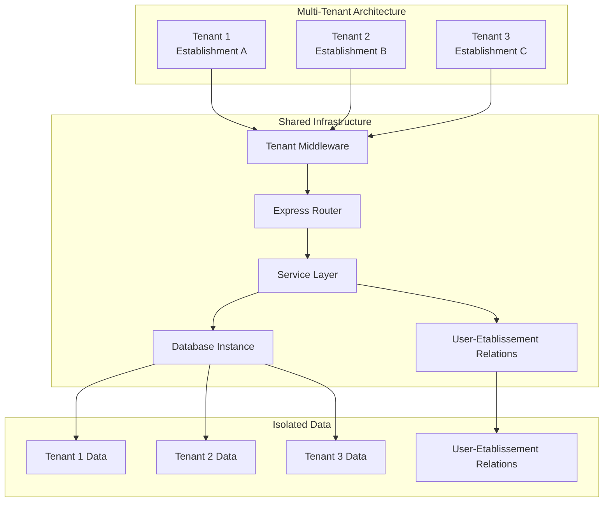

**Diagram sources**
- [tenant.middleware.ts:1-50](file://backend/src/common/middlewares/tenant.middleware.ts#L1-L50)
- [app.ts:176](file://backend/src/app.ts#L176)
- [utilisateur-etablissement.entity.ts:1-80](file://backend/src/modules/auth/entities/utilisateur-etablissement.entity.ts#L1-L80)

The architecture ensures that each tenant operates independently with its own establishment configuration, user base, and institutional data while sharing common system resources. The multi-établissements capability adds an additional layer of complexity allowing users to have relationships with multiple establishments.

**Section sources**
- [tenant.middleware.ts:1-50](file://backend/src/common/middlewares/tenant.middleware.ts#L1-L50)
- [app.ts:176](file://backend/src/app.ts#L176)
- [utilisateur-etablissement.entity.ts:1-80](file://backend/src/modules/auth/entities/utilisateur-etablissement.entity.ts#L1-L80)

## Multi-Établissements Capability

The multi-établissements feature enables sophisticated user-establishment relationship management with establishment-specific role assignments:

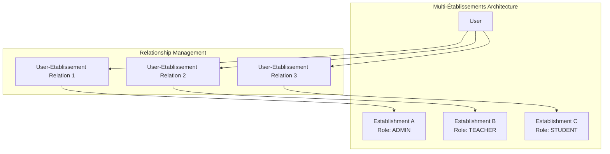

**Diagram sources**
- [utilisateur-etablissement.entity.ts:1-80](file://backend/src/modules/auth/entities/utilisateur-etablissement.entity.ts#L1-L80)
- [utilisateur-etablissement.controller.ts:1-100](file://backend/src/modules/auth/controllers/utilisateur-etablissement.controller.ts#L1-L100)

### Key Features

- **Multiple Establishment Association**: Users can be linked to multiple establishments simultaneously
- **Establishment-Specific Roles**: Different roles per establishment (ADMIN, TEACHER, STUDENT, etc.)
- **Independent Permissions**: Each establishment relationship maintains separate permission sets
- **Context Switching**: Seamless switching between establishment contexts
- **Hierarchical Access Control**: Complex role hierarchies across multiple institutions

**Section sources**
- [utilisateur-etablissement.entity.ts:1-80](file://backend/src/modules/auth/entities/utilisateur-etablissement.entity.ts#L1-L80)
- [utilisateur-etablissement.controller.ts:1-100](file://backend/src/modules/auth/controllers/utilisateur-etablissement.controller.ts#L1-L100)

## Project Structure

The Establishment Management module maintains its clean architecture pattern while adapting to multi-tenant requirements and adding multi-établissements support:

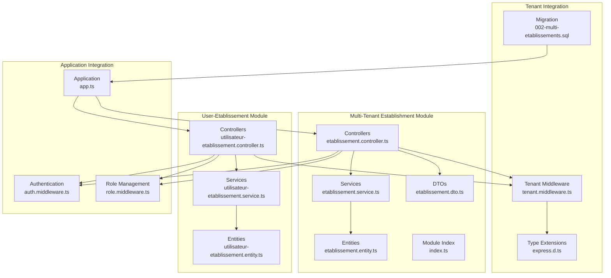

**Diagram sources**
- [etablissement.controller.ts:1-44](file://backend/src/modules/etablissement/controllers/etablissement.controller.ts#L1-L44)
- [etablissement.service.ts:1-60](file://backend/src/modules/etablissement/services/etablissement.service.ts#L1-L60)
- [etablissement.entity.ts:1-93](file://backend/src/modules/etablissement/entities/etablissement.entity.ts#L1-L93)
- [utilisateur-etablissement.controller.ts:1-100](file://backend/src/modules/auth/controllers/utilisateur-etablissement.controller.ts#L1-L100)
- [utilisateur-etablissement.service.ts:1-80](file://backend/src/modules/auth/services/utilisateur-etablissement.service.ts#L1-L80)
- [utilisateur-etablissement.entity.ts:1-80](file://backend/src/modules/auth/entities/utilisateur-etablissement.entity.ts#L1-L80)
- [tenant.middleware.ts:1-50](file://backend/src/common/middlewares/tenant.middleware.ts#L1-L50)
- [express.d.ts:1-50](file://backend/src/common/types/express.d.ts#L1-L50)
- [002-multi-etablissements.sql:1-150](file://backend/src/database/migrations/002-multi-etablissements.sql#L1-L150)
- [app.ts:176](file://backend/src/app.ts#L176)

**Section sources**
- [etablissement.controller.ts:1-44](file://backend/src/modules/etablissement/controllers/etablissement.controller.ts#L1-L44)
- [etablissement.service.ts:1-60](file://backend/src/modules/etablissement/services/etablissement.service.ts#L1-L60)
- [etablissement.entity.ts:1-93](file://backend/src/modules/etablissement/entities/etablissement.entity.ts#L1-L93)
- [utilisateur-etablissement.controller.ts:1-100](file://backend/src/modules/auth/controllers/utilisateur-etablissement.controller.ts#L1-L100)
- [utilisateur-etablissement.service.ts:1-80](file://backend/src/modules/auth/services/utilisateur-etablissement.service.ts#L1-L80)
- [utilisateur-etablissement.entity.ts:1-80](file://backend/src/modules/auth/entities/utilisateur-etablissement.entity.ts#L1-L80)
- [tenant.middleware.ts:1-50](file://backend/src/common/middlewares/tenant.middleware.ts#L1-L50)
- [express.d.ts:1-50](file://backend/src/common/types/express.d.ts#L1-L50)
- [002-multi-etablissements.sql:1-150](file://backend/src/database/migrations/002-multi-etablissements.sql#L1-L150)
- [app.ts:176](file://backend/src/app.ts#L176)

## Core Components

### Enhanced Establishment Entity Model

The establishment entity model now supports multi-tenant operations with comprehensive institutional configuration:

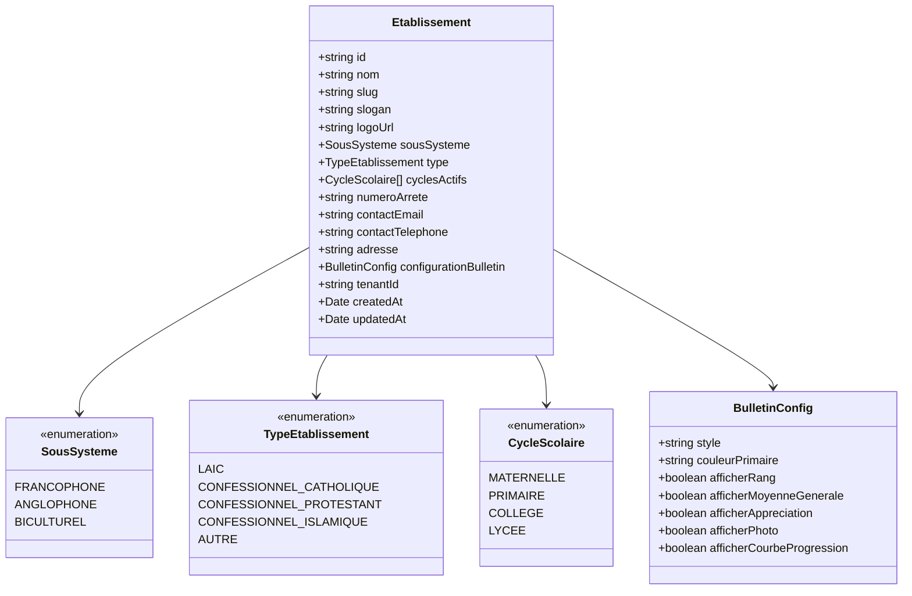

**Updated** Added tenantId field for multi-tenant isolation

**Diagram sources**
- [etablissement.entity.ts:17-36](file://backend/src/modules/etablissement/entities/etablissement.entity.ts#L17-L36)
- [etablissement.entity.ts:42-92](file://backend/src/modules/etablissement/entities/etablissement.entity.ts#L42-L92)

### User-Etablissement Relationship Entity

The new user-establishment relationship entity manages complex multi-establishment associations:

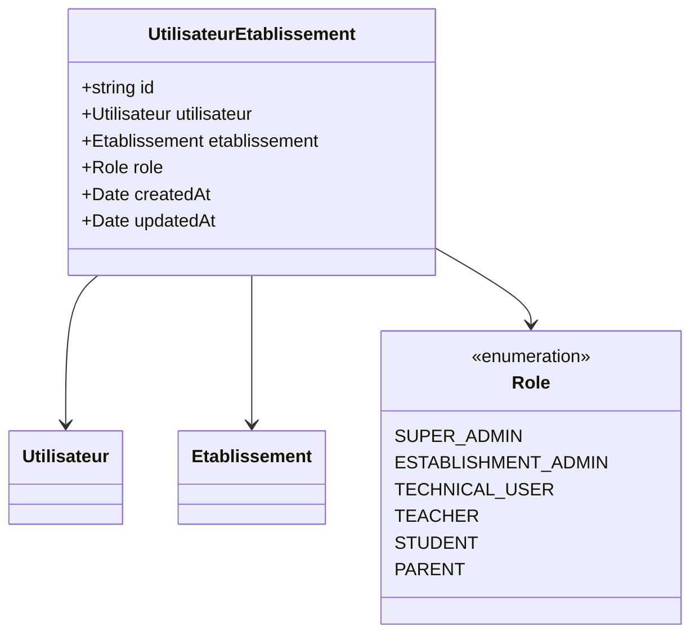

**New** Multi-établissements relationship management

**Diagram sources**
- [utilisateur-etablissement.entity.ts:1-80](file://backend/src/modules/auth/entities/utilisateur-etablissement.entity.ts#L1-L80)

### Establishment Service Operations

The establishment service now provides tenant-aware CRUD operations with comprehensive validation and business logic:

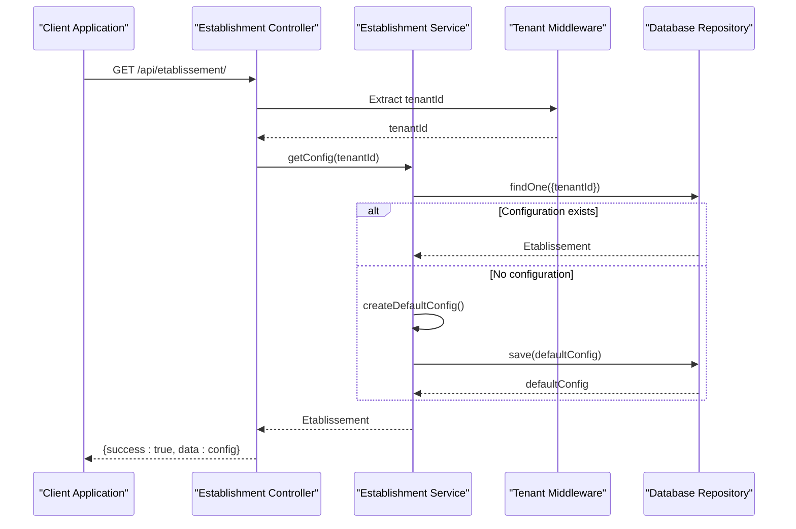

**Updated** Added tenant-aware routing and isolation

**Diagram sources**
- [etablissement.controller.ts:26-40](file://backend/src/modules/etablissement/controllers/etablissement.controller.ts#L26-L40)
- [etablissement.service.ts:24-56](file://backend/src/modules/etablissement/services/etablissement.service.ts#L24-L56)
- [tenant.middleware.ts:1-50](file://backend/src/common/middlewares/tenant.middleware.ts#L1-L50)

**Section sources**
- [etablissement.service.ts:24-56](file://backend/src/modules/etablissement/services/etablissement.service.ts#L24-L56)
- [etablissement.controller.ts:26-40](file://backend/src/modules/etablissement/controllers/etablissement.controller.ts#L26-L40)
- [tenant.middleware.ts:1-50](file://backend/src/common/middlewares/tenant.middleware.ts#L1-L50)
- [utilisateur-etablissement.entity.ts:1-80](file://backend/src/modules/auth/entities/utilisateur-etablissement.entity.ts#L1-L80)

## Tenant-Aware Routing System

The tenant middleware provides automatic tenant identification and routing for multi-establishment operations:

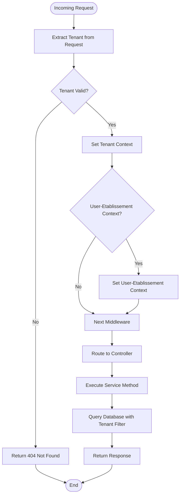

**Diagram sources**
- [tenant.middleware.ts:1-50](file://backend/src/common/middlewares/tenant.middleware.ts#L1-L50)
- [express.d.ts:1-50](file://backend/src/common/types/express.d.ts#L1-L50)

The middleware automatically extracts tenant information from request headers, URL parameters, or subdomain routing and applies appropriate data filtering. It also handles user-establishment context switching for multi-établissements scenarios.

**Section sources**
- [tenant.middleware.ts:1-50](file://backend/src/common/middlewares/tenant.middleware.ts#L1-L50)
- [express.d.ts:1-50](file://backend/src/common/types/express.d.ts#L1-L50)

## Establishment CRUD Operations

The establishment module now supports comprehensive CRUD operations with tenant isolation:

### Create Establishment

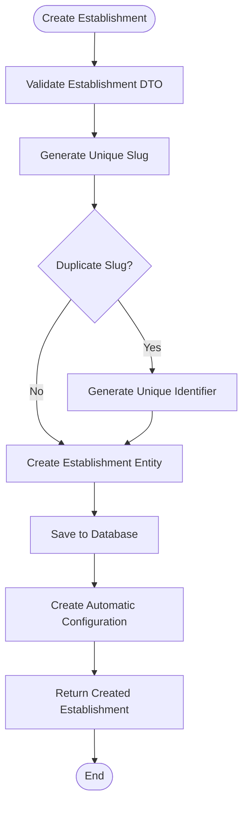

**Diagram sources**
- [etablissement.controller.ts:26-40](file://backend/src/modules/etablissement/controllers/etablissement.controller.ts#L26-L40)
- [etablissement.service.ts:24-56](file://backend/src/modules/etablissement/services/etablissement.service.ts#L24-L56)

### Read Establishment

The system supports both individual establishment retrieval and establishment listing with tenant filtering.

### Update Establishment

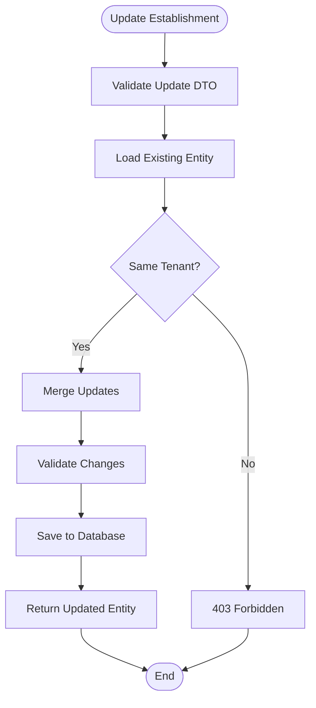

**Diagram sources**
- [etablissement.controller.ts:34-40](file://backend/src/modules/etablissement/controllers/etablissement.controller.ts#L34-L40)
- [etablissement.service.ts:39-56](file://backend/src/modules/etablissement/services/etablissement.service.ts#L39-L56)

### Delete Establishment

The delete operation includes cascade deletion of associated configurations and data with proper tenant validation.

**Section sources**
- [etablissement.controller.ts:26-40](file://backend/src/modules/etablissement/controllers/etablissement.controller.ts#L26-L40)
- [etablissement.service.ts:39-56](file://backend/src/modules/etablissement/services/etablissement.service.ts#L39-L56)

## User-Etablissement Relationship Management

The new user-establishment relationship management system provides sophisticated multi-establishment support:

### User-Etablissement Association Operations

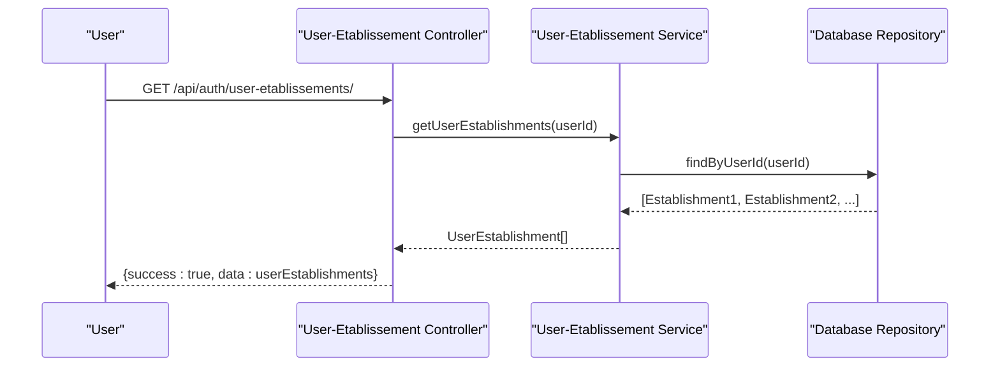

**New** Multi-establishment user relationship management

**Diagram sources**
- [utilisateur-etablissement.controller.ts:1-100](file://backend/src/modules/auth/controllers/utilisateur-etablissement.controller.ts#L1-L100)
- [utilisateur-etablissement.service.ts:1-80](file://backend/src/modules/auth/services/utilisateur-etablissement.service.ts#L1-L80)

### Establishment Role Assignment

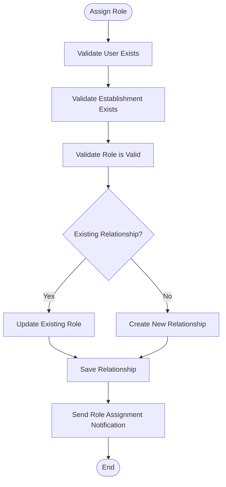

**New** Establishment-specific role assignment system

**Diagram sources**
- [utilisateur-etablissement.controller.ts:1-100](file://backend/src/modules/auth/controllers/utilisateur-etablissement.controller.ts#L1-L100)
- [utilisateur-etablissement.service.ts:1-80](file://backend/src/modules/auth/services/utilisateur-etablissement.service.ts#L1-L80)

**Section sources**
- [utilisateur-etablissement.controller.ts:1-100](file://backend/src/modules/auth/controllers/utilisateur-etablissement.controller.ts#L1-L100)
- [utilisateur-etablissement.service.ts:1-80](file://backend/src/modules/auth/services/utilisateur-etablissement.service.ts#L1-L80)
- [utilisateur-etablissement.entity.ts:1-80](file://backend/src/modules/auth/entities/utilisateur-etablissement.entity.ts#L1-L80)

## Business Logic and Data Isolation

The establishment service implements comprehensive business logic with strict tenant isolation:

### Tenant Isolation Strategy

```mermaid
stateDiagram-v2
[*] --> ValidateTenant
ValidateTenant --> CheckAccess{"User Has Access?"}
CheckAccess --> |Yes| ApplyFilter["Apply Tenant Filter"]
CheckAccess --> |No| DenyAccess["Deny Access"]
ApplyFilter --> CheckMultiEtab{"Multi-Etablissement?"}
CheckMultiEtab --> |Yes| ValidateUserEtab["Validate User-Etablissement Context"]
CheckMultiEtab --> |No| ExecuteOperation["Execute Database Operation"]
ValidateUserEtab --> ExecuteOperation
ExecuteOperation --> CheckResult{"Operation Success?"}
CheckResult --> |Yes| ReturnData["Return Tenant-Specific Data"]
CheckResult --> |No| HandleError["Handle Error"]
ReturnData --> [*]
HandleError --> [*]
DenyAccess --> [*]
```

**Diagram sources**
- [etablissement.service.ts:24-56](file://backend/src/modules/etablissement/services/etablissement.service.ts#L24-L56)
- [tenant.middleware.ts:1-50](file://backend/src/common/middlewares/tenant.middleware.ts#L1-L50)
- [utilisateur-etablissement.service.ts:1-80](file://backend/src/modules/auth/services/utilisateur-etablissement.service.ts#L1-L80)

### Automatic Configuration Management

Each establishment automatically receives default configurations upon creation, ensuring consistent institutional setup across all tenants.

### Data Validation and Sanitization

Comprehensive validation ensures data integrity while maintaining tenant-specific customizations.

**Section sources**
- [etablissement.service.ts:24-56](file://backend/src/modules/etablissement/services/etablissement.service.ts#L24-L56)
- [tenant.middleware.ts:1-50](file://backend/src/common/middlewares/tenant.middleware.ts#L1-L50)
- [utilisateur-etablissement.service.ts:1-80](file://backend/src/modules/auth/services/utilisateur-etablissement.service.ts#L1-L80)

## Security and Access Control

The multi-tenant establishment management implements robust security measures with enhanced multi-établissements support:

### Tenant-Aware Authentication

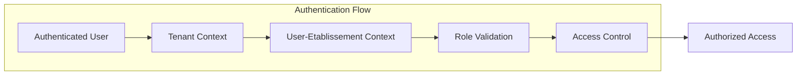

**Diagram sources**
- [auth.middleware.ts:30-60](file://backend/src/modules/auth/middlewares/auth.middleware.ts#L30-L60)
- [role.middleware.ts:20-50](file://backend/src/modules/auth/middlewares/role.middleware.ts#L20-L50)

### Enhanced Role-Based Access Control

- **SUPER_ADMIN**: Full access to all establishments and users
- **ESTABLISHMENT_ADMIN**: Access only to assigned establishment with full administrative privileges
- **TECHNICAL_USER**: Limited access based on establishment permissions
- **Multi-Établissements Roles**: Different roles per establishment (ADMIN, TEACHER, STUDENT, etc.)

### Data Protection Measures

- Automatic tenant filtering on all database queries
- Secure establishment switching between users with proper validation
- Comprehensive audit logging for all establishment operations
- User-establishment relationship validation and authorization

**Section sources**
- [auth.middleware.ts:30-60](file://backend/src/modules/auth/middlewares/auth.middleware.ts#L30-L60)
- [role.middleware.ts:20-50](file://backend/src/modules/auth/middlewares/role.middleware.ts#L20-L50)
- [roles.enum.ts:1-50](file://shared/src/enums/roles.enum.ts#L1-L50)
- [utilisateur-etablissement.entity.ts:1-80](file://backend/src/modules/auth/entities/utilisateur-etablissement.entity.ts#L1-L80)

## API Endpoints and Usage

### Establishment Management Endpoints

The establishment module provides RESTful endpoints with tenant-aware routing:

#### GET /api/etablissement/ - Retrieve Establishment Configuration

**Updated** Now returns tenant-specific establishment configuration

#### POST /api/etablissement/ - Create New Establishment

**New** Endpoint for creating establishments with automatic tenant assignment

#### PUT /api/etablissement/:id - Update Establishment

**Enhanced** Now includes tenant validation and isolation

#### DELETE /api/etablissement/:id - Delete Establishment

**New** Endpoint for establishment deletion with cascade operations

### User-Etablissement Management Endpoints

**New** Multi-établissements specific endpoints:

#### GET /api/auth/user-etablissements/ - Get User's Establishment Associations

**New** Endpoint for retrieving all establishments a user is associated with

#### POST /api/auth/user-etablissements/ - Assign User to Establishment

**New** Endpoint for assigning users to establishments with specific roles

#### PUT /api/auth/user-etablissements/:id - Update User-Etablissement Role

**New** Endpoint for updating user roles within specific establishments

#### DELETE /api/auth/user-etablissements/:id - Remove User from Establishment

**New** Endpoint for removing user associations with establishments

### Request and Response Examples

**Request Body (Create Establishment)**
```json
{
  "nom": "École Primaire de Paris",
  "slug": "ecole-primaire-paris",
  "sousSysteme": "FRANCOPHONE",
  "type": "LAIC",
  "contactEmail": "info@ecole-paris.fr",
  "adresse": "123 Rue de Paris, 75000 Paris"
}
```

**Response (Establishment Configuration)**
```json
{
  "success": true,
  "data": {
    "id": "establishment-uuid",
    "nom": "École Primaire de Paris",
    "slug": "ecole-primaire-paris",
    "tenantId": "tenant-uuid",
    "configurationBulletin": {
      "style": "classique",
      "afficherRang": true,
      "afficherMoyenneGenerale": true
    },
    "createdAt": "2024-01-15T10:30:00Z",
    "updatedAt": "2024-01-15T10:30:00Z"
  }
}
```

**Request Body (User-Etablissement Assignment)**
```json
{
  "userId": "user-uuid",
  "establishmentId": "establishment-uuid",
  "roleId": "ESTABLISHMENT_ADMIN"
}
```

**Response (User-Etablissement Association)**
```json
{
  "success": true,
  "data": {
    "id": "user-etablissement-uuid",
    "userId": "user-uuid",
    "establishmentId": "establishment-uuid",
    "roleId": "ESTABLISHMENT_ADMIN",
    "establishment": {
      "id": "establishment-uuid",
      "nom": "École Primaire de Paris",
      "slug": "ecole-primaire-paris"
    },
    "role": {
      "id": "ESTABLISHMENT_ADMIN",
      "libelle": "Establishment Administrator"
    }
  }
}
```

**Section sources**
- [etablissement.controller.ts:26-40](file://backend/src/modules/etablissement/controllers/etablissement.controller.ts#L26-L40)
- [utilisateur-etablissement.controller.ts:1-100](file://backend/src/modules/auth/controllers/utilisateur-etablissement.controller.ts#L1-L100)

## Integration Patterns

### Cross-Module Integration

The establishment module integrates seamlessly with other system modules:

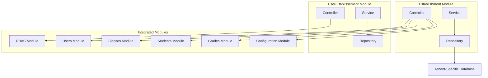

**Diagram sources**
- [etablissement.controller.ts:1-44](file://backend/src/modules/etablissement/controllers/etablissement.controller.ts#L1-L44)
- [etablissement.service.ts:1-60](file://backend/src/modules/etablissement/services/etablissement.service.ts#L1-L60)
- [utilisateur-etablissement.controller.ts:1-100](file://backend/src/modules/auth/controllers/utilisateur-etablissement.controller.ts#L1-L100)
- [utilisateur-etablissement.service.ts:1-80](file://backend/src/modules/auth/services/utilisateur-etablissement.service.ts#L1-L80)

### Data Synchronization Patterns

- Automatic establishment configuration propagation
- Tenant-aware data synchronization between modules
- Real-time establishment context updates
- User-establishment relationship synchronization across modules

**Section sources**
- [etablissement.controller.ts:1-44](file://backend/src/modules/etablissement/controllers/etablissement.controller.ts#L1-L44)
- [etablissement.service.ts:1-60](file://backend/src/modules/etablissement/services/etablissement.service.ts#L1-L60)
- [utilisateur-etablissement.controller.ts:1-100](file://backend/src/modules/auth/controllers/utilisateur-etablissement.controller.ts#L1-L100)
- [utilisateur-etablissement.service.ts:1-80](file://backend/src/modules/auth/services/utilisateur-etablissement.service.ts#L1-L80)

## Performance Considerations

### Multi-Tenant Performance Optimization

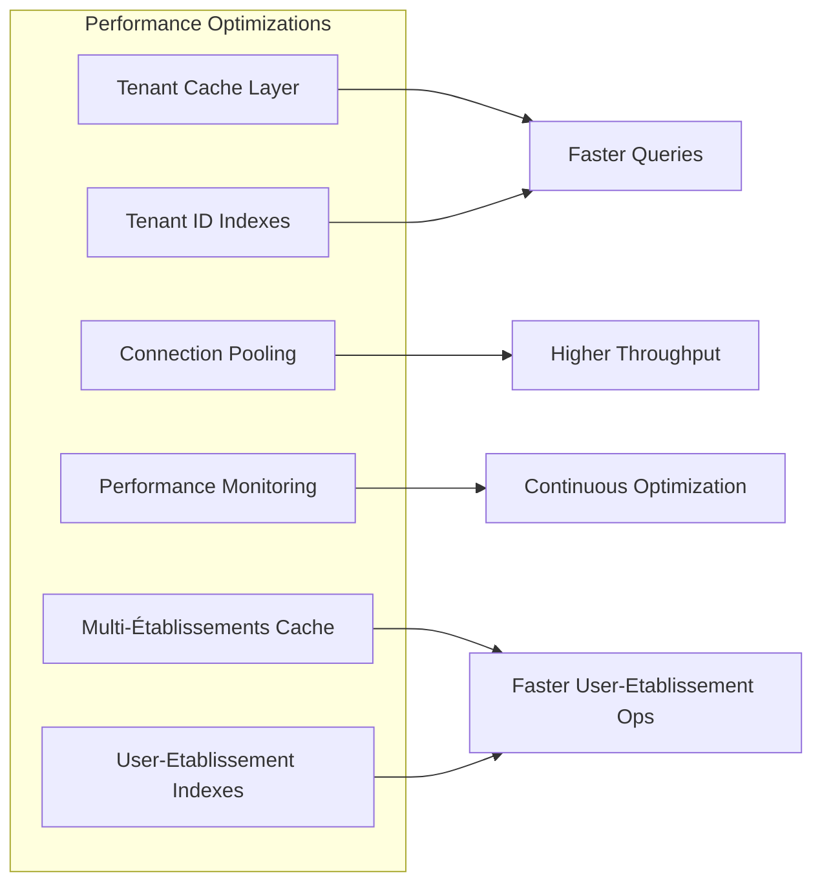

**Diagram sources**
- [etablissement.service.ts:24-56](file://backend/src/modules/etablissement/services/etablissement.service.ts#L24-L56)
- [tenant.middleware.ts:1-50](file://backend/src/common/middlewares/tenant.middleware.ts#L1-L50)
- [utilisateur-etablissement.service.ts:1-80](file://backend/src/modules/auth/services/utilisateur-etablissement.service.ts#L1-L80)

### Scalability Features

- **Horizontal Scaling**: Support for multiple tenant instances
- **Database Partitioning**: Tenant-specific database partitioning
- **Caching Strategy**: Tenant-aware caching for improved performance
- **Connection Management**: Optimized database connection pooling
- **Multi-Établissements Caching**: Specialized caching for user-establishment relationships

### Resource Management

- Automatic resource cleanup for deleted establishments
- Efficient memory management for tenant contexts
- Optimized query patterns for multi-tenant operations
- User-establishment relationship optimization

## Troubleshooting Guide

### Multi-Tenant Specific Issues

#### Tenant Context Errors
- **Issue**: Establishments not loading correctly
- **Cause**: Incorrect tenant context in request
- **Solution**: Verify tenant header or parameter in request

#### Data Isolation Problems
- **Issue**: Data from one establishment appearing in another
- **Cause**: Missing tenant filtering in queries
- **Solution**: Check tenant middleware implementation

#### Authentication Issues
- **Issue**: 403 Forbidden when accessing establishment data
- **Cause**: User lacks proper tenant permissions
- **Solution**: Verify user role and establishment assignment

#### Multi-Établissements Issues
- **Issue**: User cannot access multiple establishments
- **Cause**: Missing user-establishment relationship
- **Solution**: Verify user-establishment associations exist

#### Role Assignment Problems
- **Issue**: User role not applying correctly across establishments
- **Cause**: Invalid role assignment or missing relationship
- **Solution**: Check user-establishment role assignments

#### Performance Degradation
- **Issue**: Slow response times in multi-tenant environment
- **Cause**: Inefficient tenant queries or missing indexes
- **Solution**: Implement proper indexing and query optimization

**Section sources**
- [tenant.middleware.ts:1-50](file://backend/src/common/middlewares/tenant.middleware.ts#L1-L50)
- [auth.middleware.ts:35-46](file://backend/src/modules/auth/middlewares/auth.middleware.ts#L35-L46)
- [role.middleware.ts:29-44](file://backend/src/modules/auth/middlewares/role.middleware.ts#L29-L44)
- [utilisateur-etablissement.service.ts:1-80](file://backend/src/modules/auth/services/utilisateur-etablissement.service.ts#L1-L80)

## Conclusion

The enhanced Establishment Management module successfully transforms the eLISAschool system from a single-establishment platform to a comprehensive multi-tenant solution with advanced multi-établissements capability. This architectural evolution provides:

### Key Achievements

- **Complete Multi-Tenant Support**: Full tenant isolation with automatic data separation
- **Advanced Multi-Établissements Capability**: Users can be associated with multiple establishments with different roles per establishment
- **Enhanced Security**: Robust tenant-aware routing and access control with establishment-specific permissions
- **Scalable Architecture**: Designed for unlimited establishment growth with sophisticated user-establishment relationship management
- **Seamless Integration**: Transparent integration with existing system modules and new multi-établissements features
- **Performance Optimization**: Optimized for multi-tenant operations with specialized caching for multi-establishment scenarios

### Technical Excellence

The implementation demonstrates advanced architectural patterns including:
- Tenant-aware middleware design with multi-établissements support
- Automatic establishment configuration management
- Comprehensive validation and sanitization for multi-establishment relationships
- Efficient data isolation strategies with user-establishment relationship optimization
- Scalable performance optimizations for complex multi-tenant environments

### Future Extensibility

The multi-tenant foundation with multi-établissements capability enables future enhancements such as:
- Advanced cross-establishment reporting and analytics
- Shared resource management between establishments
- Cross-establishment user mobility and transfers
- Enhanced collaboration features between institutions
- Advanced multi-establishment administrative dashboards

This transformation positions the Establishment Management module as a cornerstone of the eLISAschool platform's scalability, enterprise readiness, and sophisticated institutional management capabilities.