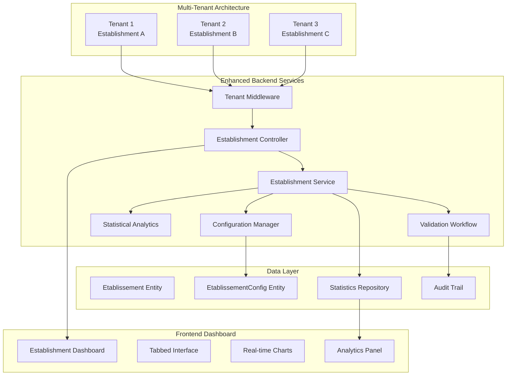
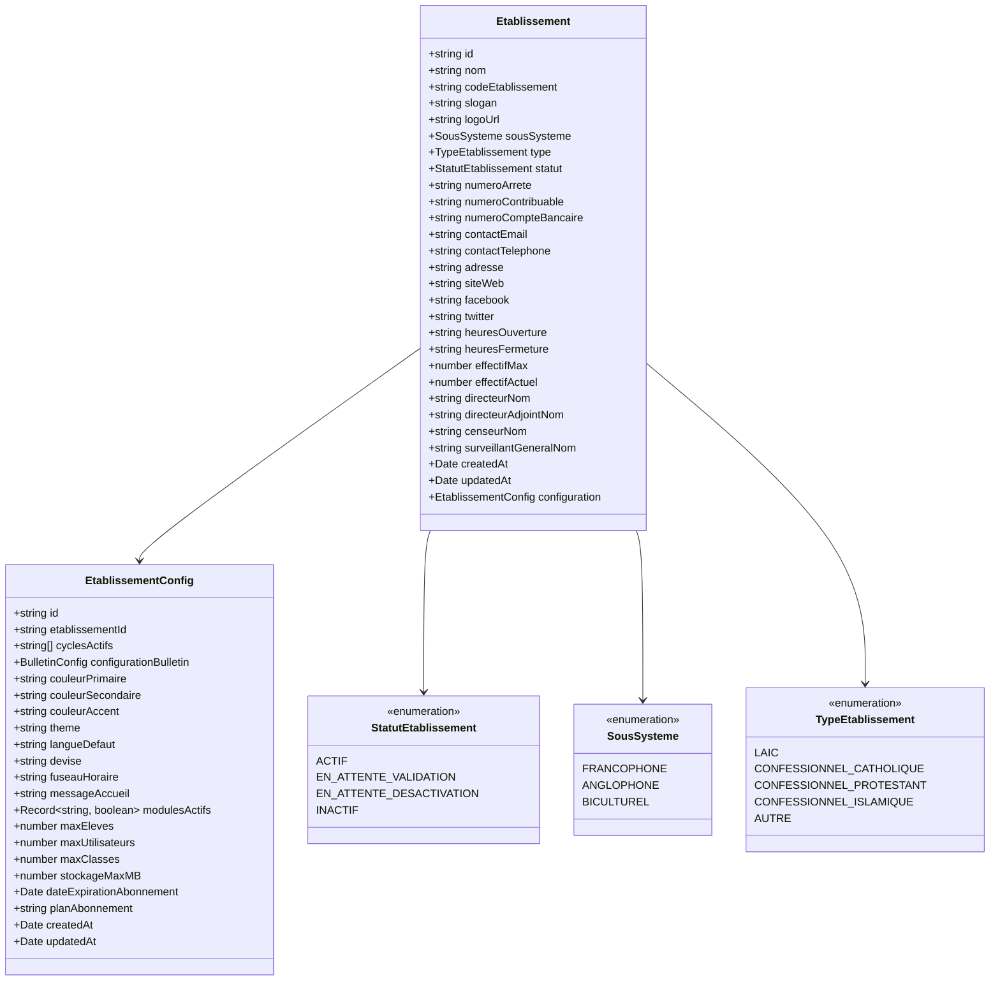
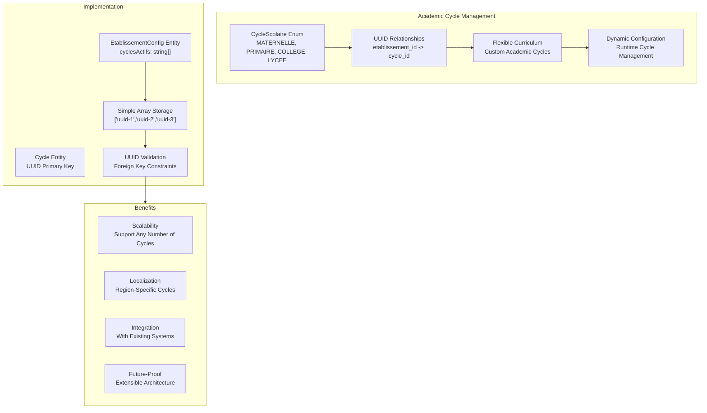
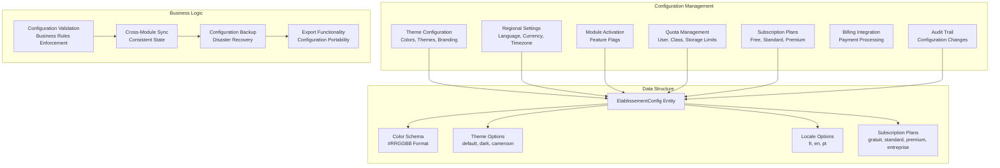
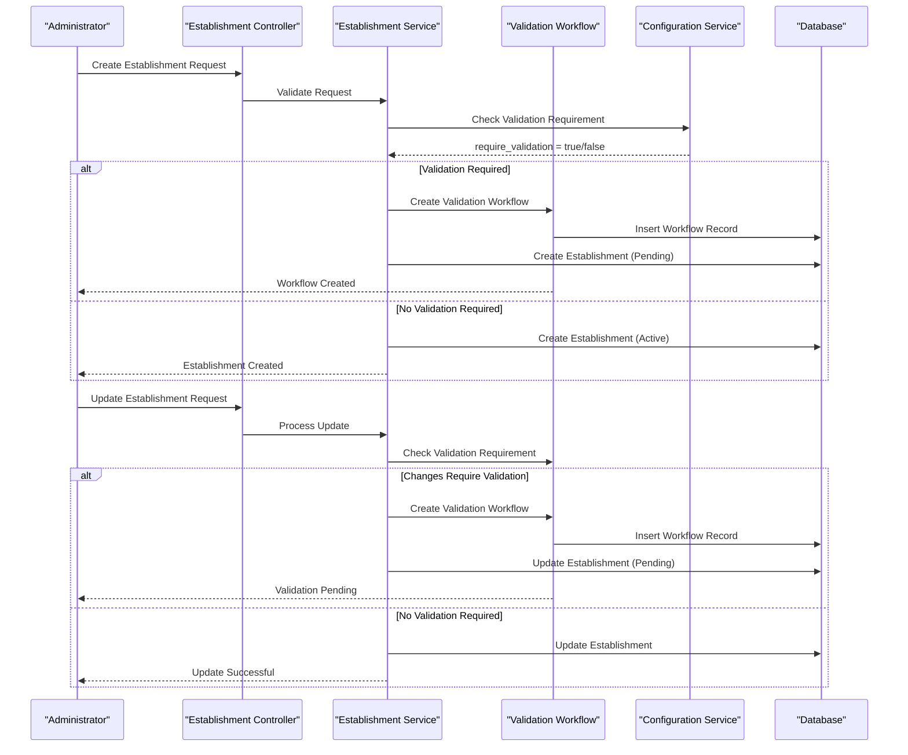
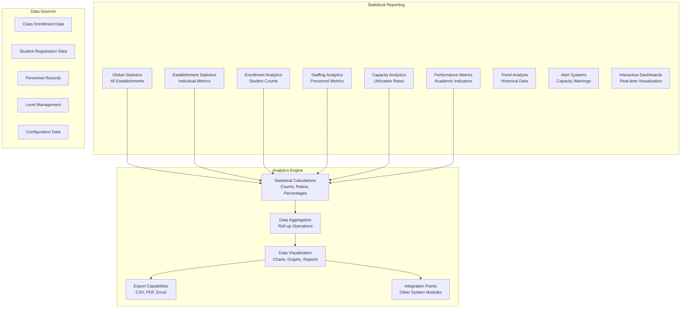
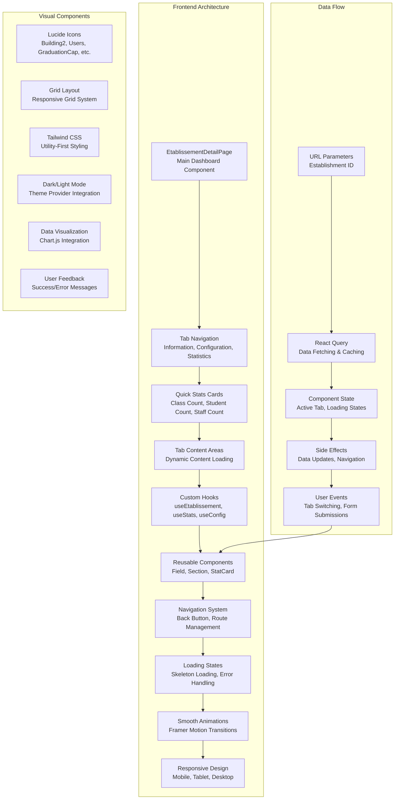
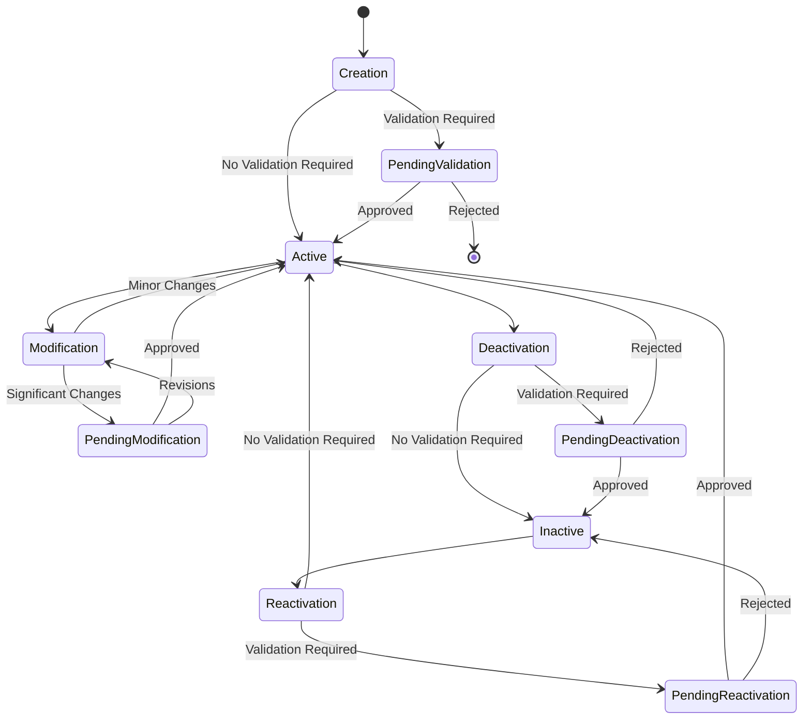
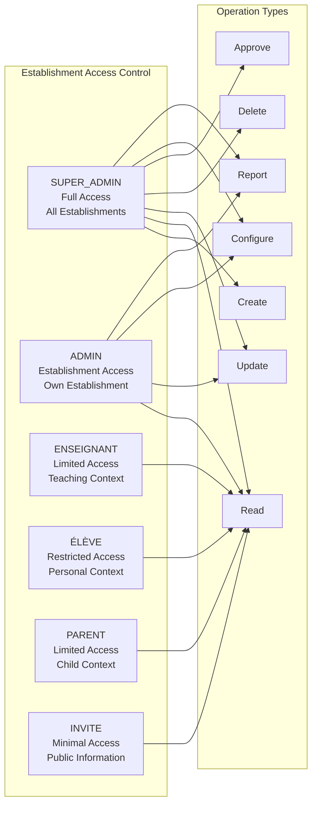

# Establishment Management

<cite>
**Referenced Files in This Document**
- [etablissement.controller.ts](file://backend/src/modules/etablissement/controllers/etablissement.controller.ts)
- [etablissement.dto.ts](file://backend/src/modules/etablissement/dto/etablissement.dto.ts)
- [etablissement-config.dto.ts](file://backend/src/modules/etablissement/dto/etablissement-config.dto.ts)
- [etablissement.entity.ts](file://backend/src/modules/etablissement/entities/etablissement.entity.ts)
- [etablissement-config.entity.ts](file://backend/src/modules/etablissement/entities/etablissement-config.entity.ts)
- [etablissement.service.ts](file://backend/src/modules/etablissement/services/etablissement.service.ts)
- [etablissement-detail-page.tsx](file://frontend/src/features/etablissement/components/etablissement-detail-page.tsx)
- [etablissement.types.ts](file://frontend/src/features/etablissement/types/etablissement.types.ts)
- [use-etablissements.ts](file://frontend/src/features/etablissement/hooks/use-etablissements.ts)
- [validation-etablissement.sql](file://backend/src/database/migrations/015-validation-etablissement.sql)
- [groupes-etablissements.sql](file://backend/src/database/migrations/016-groupes-etablissements.sql)
- [056-suppression-cycle-scolaire.sql](file://backend/database/migrations/056-suppression-cycle-scolaire.sql)
</cite>

## Update Summary
**Changes Made**
- Complete rewrite of establishment module with new frontend components and enhanced statistics
- Migration from CycleScolaire enum to UUID-based relationships for flexible academic cycle management
- Enhanced statistical reporting capabilities with establishment-specific analytics
- Comprehensive configuration management system with SaaS plan integration
- New establishment validation workflow and approval system
- Advanced frontend dashboard with tabbed interface and real-time statistics

## Table of Contents
1. [Introduction](#introduction)
2. [Multi-Tenant Architecture Overview](#multi-tenant-architecture-overview)
3. [Enhanced Establishment Entity Model](#enhanced-establishment-entity-model)
4. [UUID-Based Academic Cycle Management](#uuid-based-academic-cycle-management)
5. [Comprehensive Configuration Management](#comprehensive-configuration-management)
6. [Establishment Validation and Workflow System](#establishment-validation-and-workflow-system)
7. [Enhanced Statistical Reporting](#enhanced-statistical-reporting)
8. [Frontend Component Architecture](#frontend-component-architecture)
9. [API Endpoints and Operations](#api-endpoints-and-operations)
10. [Data Models and DTOs](#data-models-and-dtos)
11. [Business Logic and Validation](#business-logic-and-validation)
12. [Security and Access Control](#security-and-access-control)
13. [Integration Patterns](#integration-patterns)
14. [Performance Considerations](#performance-considerations)
15. [Troubleshooting Guide](#troubleshooting-guide)
16. [Conclusion](#conclusion)

## Introduction

The Establishment Management module has undergone a complete architectural transformation, evolving from a basic multi-establishment system to a comprehensive educational institution management platform. This rewrite introduces advanced frontend components, enhanced statistical analytics, comprehensive configuration management, and sophisticated validation workflows.

The new system supports UUID-based academic cycle relationships, enabling flexible curriculum management beyond traditional enum constraints. Establishment-specific statistical reporting provides real-time insights into enrollment, staffing, and operational metrics. The comprehensive configuration management system integrates SaaS subscription plans, quota management, and regional customization options.

**Updated** The module now features a complete frontend dashboard with tabbed interfaces, real-time statistics visualization, and establishment-specific analytics, providing administrators with powerful tools for institutional oversight and management.

## Multi-Tenant Architecture Overview

The establishment management system operates on a sophisticated multi-tenant architecture with enhanced establishment-specific capabilities:



**Diagram sources**
- [etablissement.controller.ts:1-192](file://backend/src/modules/etablissement/controllers/etablissement.controller.ts#L1-L192)
- [etablissement.service.ts:40-352](file://backend/src/modules/etablissement/services/etablissement.service.ts#L40-L352)
- [etablissement-detail-page.tsx:25-140](file://frontend/src/features/etablissement/components/etablissement-detail-page.tsx#L25-L140)

The architecture ensures complete data isolation between institutions while providing establishment-specific services, validation workflows, and statistical reporting. The new frontend dashboard offers administrators comprehensive oversight through real-time charts, analytics panels, and establishment-specific metrics.

**Section sources**
- [etablissement.controller.ts:1-192](file://backend/src/modules/etablissement/controllers/etablissement.controller.ts#L1-L192)
- [etablissement.service.ts:40-352](file://backend/src/modules/etablissement/services/etablissement.service.ts#L40-L352)
- [etablissement-detail-page.tsx:25-140](file://frontend/src/features/etablissement/components/etablissement-detail-page.tsx#L25-L140)

## Enhanced Establishment Entity Model

The establishment entity model has been significantly enhanced with comprehensive institutional information and establishment-specific configuration:



**Updated** Enhanced entity model with comprehensive institutional information, establishment-specific configuration, and UUID-based academic cycle relationships

**Diagram sources**
- [etablissement.entity.ts:64-160](file://backend/src/modules/etablissement/entities/etablissement.entity.ts#L64-L160)
- [etablissement-config.entity.ts:30-125](file://backend/src/modules/etablissement/entities/etablissement-config.entity.ts#L30-L125)

### Key Enhancements

- **Comprehensive Institutional Information**: Extended contact details, identification numbers, social media presence, and operational hours
- **Establishment Status Management**: Four-tier status system with validation workflows for establishment lifecycle management
- **Administrative Leadership**: Detailed information for establishment leadership including directors, inspectors, and supervisors
- **UUID-Based Academic Cycles**: Flexible academic cycle management replacing enum constraints with UUID relationships
- **SaaS Subscription Integration**: Comprehensive quota management, storage limits, and subscription plan tracking
- **Regional Customization**: Language, currency, timezone, and regional messaging configuration
- **Theme and Branding**: Color schemes, themes, and institutional branding options

**Section sources**
- [etablissement.entity.ts:64-160](file://backend/src/modules/etablissement/entities/etablissement.entity.ts#L64-L160)
- [etablissement-config.entity.ts:30-125](file://backend/src/modules/etablissement/entities/etablissement-config.entity.ts#L30-L125)

## UUID-Based Academic Cycle Management

The migration from CycleScolaire enum to UUID-based relationships represents a fundamental shift toward flexible academic cycle management:



**Updated** Complete migration from enum-based to UUID-based academic cycle management

**Diagram sources**
- [etablissement-config.entity.ts:48-49](file://backend/src/modules/etablissement/entities/etablissement-config.entity.ts#L48-L49)
- [etablissement.dto.ts:66-66](file://backend/src/modules/etablissement/dto/etablissement.dto.ts#L66-L66)

### Implementation Details

The new system replaces the fixed enum values with UUID-based relationships stored as simple arrays in the EtablissementConfig entity. This change enables:

- **Unlimited Academic Cycles**: No longer constrained by predefined enum values
- **Regional Flexibility**: Support for region-specific academic structures
- **Dynamic Configuration**: Runtime management of active academic cycles
- **Foreign Key Integrity**: Proper UUID validation and referential integrity
- **Backward Compatibility**: Seamless migration from legacy enum-based systems

**Section sources**
- [etablissement-config.entity.ts:48-49](file://backend/src/modules/etablissement/entities/etablissement-config.entity.ts#L48-L49)
- [etablissement.dto.ts:66-66](file://backend/src/modules/etablissement/dto/etablissement.dto.ts#L66-L66)
- [056-suppression-cycle-scolaire.sql](file://backend/database/migrations/056-suppression-cycle-scolaire.sql)

## Comprehensive Configuration Management

The establishment configuration system has been expanded to support comprehensive institutional customization and SaaS subscription management:



**Updated** Comprehensive configuration management system with SaaS integration and establishment-specific customization

**Diagram sources**
- [etablissement-config.entity.ts:65-117](file://backend/src/modules/etablissement/entities/etablissement-config.entity.ts#L65-L117)
- [etablissement.dto.ts:80-101](file://backend/src/modules/etablissement/dto/etablissement.dto.ts#L80-L101)

### Configuration Categories

#### Theme and Branding Configuration
- **Color Schemes**: Primary, secondary, and accent colors with hex validation
- **Themes**: Default, dark, and regional themes (cameroon)
- **Branding Elements**: Logo URLs, slogans, and institutional messaging

#### Regional and Localization Settings
- **Language Preferences**: French, English, Portuguese support
- **Currency Management**: XOF, XAF, EUR, USD currency options
- **Timezone Configuration**: IANA timezone support for accurate scheduling
- **Regional Messaging**: Custom welcome messages and local information

#### Feature and Module Management
- **Module Activation**: JSON-based module flags for feature enablement
- **Dynamic Feature Control**: Runtime activation/deactivation of system features
- **Permission Integration**: Module-specific permission management

#### Quota and Subscription Management
- **User Limits**: Maximum student and staff capacity per establishment
- **Class Capacity**: Maximum classes and classroom management
- **Storage Management**: Cloud storage allocation and monitoring
- **Subscription Plans**: Tier-based service level management
- **Billing Integration**: Payment processing and renewal management

**Section sources**
- [etablissement-config.entity.ts:65-117](file://backend/src/modules/etablissement/entities/etablissement-config.entity.ts#L65-L117)
- [etablissement.dto.ts:80-101](file://backend/src/modules/etablissement/dto/etablissement.dto.ts#L80-L101)

## Establishment Validation and Workflow System

The establishment validation system introduces comprehensive approval workflows for establishment lifecycle management:



**Updated** Comprehensive validation workflow system with approval processes and establishment lifecycle management

**Diagram sources**
- [etablissement.service.ts:56-100](file://backend/src/modules/etablissement/services/etablissement.service.ts#L56-L100)
- [etablissement.service.ts:145-207](file://backend/src/modules/etablissement/services/etablissement.service.ts#L145-L207)
- [validation-etablissement.sql](file://backend/src/database/migrations/015-validation-etablissement.sql)

### Validation Workflow Features

The system implements a two-level approval process for establishment management:

#### Establishment Creation Validation
- **Automatic Validation Trigger**: Based on configuration parameter `etablissement.require_validation`
- **Pending Status Management**: Establishments remain inactive until validation completion
- **Workflow Tracking**: Complete audit trail of validation requests and approvals
- **Creator Notification**: Automated notifications for validation workflow participants

#### Establishment Modification Validation
- **Change Impact Assessment**: Validation requirements based on modification type
- **Selective Validation**: Some changes bypass validation, others require approval
- **Status Management**: Maintains pending status during validation process
- **Approval Authority**: Hierarchical approval based on establishment type and change impact

#### Lifecycle Management
- **Activation/Deactivation Workflows**: Separate approval processes for establishment status changes
- **Status Transitions**: Controlled transitions between active, pending, and inactive states
- **Audit Trail**: Complete history of establishment lifecycle events
- **Recovery Mechanisms**: Graceful handling of validation failures and cancellations

**Section sources**
- [etablissement.service.ts:56-100](file://backend/src/modules/etablissement/services/etablissement.service.ts#L56-L100)
- [etablissement.service.ts:145-207](file://backend/src/modules/etablissement/services/etablissement.service.ts#L145-L207)
- [validation-etablissement.sql](file://backend/src/database/migrations/015-validation-etablissement.sql)

## Enhanced Statistical Reporting

The establishment module now provides comprehensive statistical reporting with establishment-specific analytics and real-time insights:



**Updated** Comprehensive statistical reporting system with establishment-specific analytics and real-time dashboards

**Diagram sources**
- [etablissement.service.ts:17-38](file://backend/src/modules/etablissement/services/etablissement.service.ts#L17-L38)
- [etablissement.service.ts:281-348](file://backend/src/modules/etablissement/services/etablissement.service.ts#L281-L348)
- [etablissement-detail-page.tsx:78-106](file://frontend/src/features/etablissement/components/etablissement-detail-page.tsx#L78-L106)

### Statistical Categories

#### Global Establishment Statistics
- **Total Establishments**: Overall count across all institutions
- **Status Distribution**: Active vs inactive establishment ratios
- **System Distribution**: Breakdown by educational subsystems
- **Type Distribution**: Religious vs secular establishment composition

#### Establishment-Specific Metrics
- **Enrollment Counts**: Current student population per establishment
- **Staffing Levels**: Total personnel count and distribution
- **Class Distribution**: Number of active classes and levels
- **Capacity Utilization**: Effectiveness and space utilization rates
- **Configuration Metrics**: Active modules and subscription plan indicators

#### Real-Time Analytics
- **Enrollment Trends**: Student registration patterns and seasonal variations
- **Staff Turnover**: Personnel changes and retention metrics
- **Capacity Planning**: Predictive analytics for enrollment forecasting
- **Performance Indicators**: Academic performance and progress metrics
- **Resource Utilization**: Classroom, laboratory, and facility usage patterns

#### Interactive Dashboard Features
- **Tabbed Interface**: Organized presentation of different statistical categories
- **Real-Time Updates**: Live data refresh and dynamic chart updates
- **Export Capabilities**: Downloadable reports in multiple formats
- **Customizable Views**: Filterable and sortable statistical presentations
- **Alert Systems**: Automated notifications for capacity thresholds and performance issues

**Section sources**
- [etablissement.service.ts:17-38](file://backend/src/modules/etablissement/services/etablissement.service.ts#L17-L38)
- [etablissement.service.ts:281-348](file://backend/src/modules/etablissement/services/etablissement.service.ts#L281-L348)
- [etablissement-detail-page.tsx:78-106](file://frontend/src/features/etablissement/components/etablissement-detail-page.tsx#L78-L106)

## Frontend Component Architecture

The frontend architecture features a comprehensive establishment management dashboard with tabbed interfaces and real-time data visualization:



**Updated** Comprehensive frontend architecture with tabbed dashboard, real-time statistics, and interactive data visualization

**Diagram sources**
- [etablissement-detail-page.tsx:25-140](file://frontend/src/features/etablissement/components/etablissement-detail-page.tsx#L25-L140)
- [etablissement.types.ts:38-104](file://frontend/src/features/etablissement/types/etablissement.types.ts#L38-L104)

### Component Structure

#### Main Dashboard Component
- **Tabbed Interface**: Three main tabs for information, configuration, and statistics
- **Header Section**: Establishment name, code, and navigation controls
- **Quick Statistics**: Four key metric cards with icons and color coding
- **Responsive Layout**: Adaptive design for different screen sizes

#### Tab Components
- **Information Tab**: Comprehensive establishment details in organized sections
- **Configuration Tab**: Establishment-specific settings and customization options
- **Statistics Tab**: Detailed analytics and performance metrics

#### Reusable Components
- **Field Components**: Consistent field rendering with labels and values
- **Section Components**: Card-based sections for logical grouping of information
- **StatCard Components**: Color-coded statistic cards with icons and animations

#### Data Management
- **Custom Hooks**: Specialized hooks for establishment data fetching and caching
- **Type Safety**: Comprehensive TypeScript interfaces for all data structures
- **Error Handling**: Robust error handling and loading state management
- **Navigation**: Seamless navigation between establishment pages and lists

**Section sources**
- [etablissement-detail-page.tsx:25-140](file://frontend/src/features/etablissement/components/etablissement-detail-page.tsx#L25-L140)
- [etablissement.types.ts:38-104](file://frontend/src/features/etablissement/types/etablissement.types.ts#L38-L104)

## API Endpoints and Operations

The establishment module provides comprehensive RESTful endpoints with enhanced CRUD operations and establishment-specific functionality:

### Establishment Management Endpoints

#### GET /api/etablissements/ - List All Establishments
**New** Enhanced endpoint with comprehensive establishment listing and filtering capabilities

#### GET /api/etablissements/:id - Get Establishment Details
**Updated** Returns establishment details with embedded configuration and status information

#### POST /api/etablissements/ - Create New Establishment
**Enhanced** Now includes validation workflow integration and automatic configuration creation

#### PATCH /api/etablissements/:id - Update Establishment
**Enhanced** Supports selective updates with validation workflow for significant changes

#### PATCH /api/etablissements/:id/desactiver - Deactivate Establishment
**New** Dedicated endpoint for establishment deactivation with approval workflow

#### PATCH /api/etablissements/:id/activer - Activate Establishment
**New** Dedicated endpoint for establishment reactivation with approval workflow

### Configuration Management Endpoints

#### GET /api/etablissements/:id/config - Get Establishment Configuration
**Enhanced** Returns comprehensive establishment configuration with all customization options

#### PATCH /api/etablissements/:id/config - Update Establishment Configuration
**Enhanced** Supports partial configuration updates with validation and audit trail

### Statistical Reporting Endpoints

#### GET /api/etablissements/stats - Global Statistics
**New** Comprehensive statistics across all establishments for administrative overview

#### GET /api/etablissements/:id/stats - Establishment Statistics
**New** Detailed statistics for individual establishment with enrollment, staffing, and capacity metrics

### Request and Response Examples

**Request Body (Create Establishment)**
```json
{
  "nom": "École Primaire de Paris",
  "codeEtablissement": "EP-001",
  "slogan": "Excellence Éducative",
  "sousSysteme": "FRANCOPHONE",
  "type": "LAIC",
  "numeroContribuable": "RC-12345",
  "contactEmail": "info@ecole-paris.fr",
  "siteWeb": "https://www.ecole-paris.fr",
  "effectifMax": 800,
  "directeurNom": "Marie Dupont",
  "statut": "EN_ATTENTE_VALIDATION"
}
```

**Response (Establishment with Configuration)**
```json
{
  "success": true,
  "data": {
    "id": "establishment-uuid",
    "nom": "École Primaire de Paris",
    "codeEtablissement": "EP-001",
    "sousSysteme": "FRANCOPHONE",
    "type": "LAIC",
    "statut": "EN_ATTENTE_VALIDATION",
    "effectifMax": 800,
    "effectifActuel": 0,
    "configuration": {
      "id": "config-uuid",
      "etablissementId": "establishment-uuid",
      "cyclesActifs": ["uuid-1", "uuid-2"],
      "langueDefaut": "fr",
      "fuseauHoraire": "Africa/Douala",
      "theme": "default",
      "modulesActifs": {
        "eleves": true,
        "personnel": true,
        "finances": false
      },
      "planAbonnement": "gratuit"
    }
  }
}
```

**Request Body (Update Configuration)**
```json
{
  "cyclesActifs": ["uuid-1", "uuid-2", "uuid-3"],
  "configurationBulletin": {
    "style": "moderne",
    "afficherRang": true,
    "afficherMoyenneGenerale": true
  },
  "modulesActifs": {
    "eleves": true,
    "personnel": true,
    "finances": true,
    "bulletins": true
  },
  "maxEleves": 1000,
  "planAbonnement": "standard"
}
```

**Response (Establishment Statistics)**
```json
{
  "success": true,
  "data": {
    "etablissementId": "establishment-uuid",
    "nomEtablissement": "École Primaire de Paris",
    "nombreClasses": 24,
    "nombreEleves": 456,
    "nombrePersonnel": 47,
    "nombreNiveaux": 8,
    "tauxOccupation": 57,
    "config": {
      "cyclesActifs": 3,
      "modulesActifs": 4,
      "planAbonnement": "standard"
    }
  }
}
```

**Section sources**
- [etablissement.controller.ts:26-192](file://backend/src/modules/etablissement/controllers/etablissement.controller.ts#L26-L192)
- [etablissement.dto.ts:14-101](file://backend/src/modules/etablissement/dto/etablissement.dto.ts#L14-L101)

## Data Models and DTOs

The establishment module implements comprehensive data models with strict validation and comprehensive type safety:

### Backend DTOs

#### Establishment Creation and Update DTOs
- **CreateEtablissementDto**: Comprehensive establishment creation with validation schemas
- **UpdateEtablissementDto**: Partial updates with optional fields and validation
- **ModifierEtablissementDto**: Frontend-compatible update interface

#### Configuration DTOs
- **UpdateEtablissementConfigDto**: Establishment configuration updates with validation
- **ConfigurationCompleteDto**: Complete establishment configuration response
- **DuplicateConfigDto**: Configuration duplication with selective inclusion options
- **CompareConfigDto**: Configuration comparison between establishments

### Frontend Types

#### Core Data Structures
- **Etablissement**: Complete establishment entity with configuration
- **EtablissementConfig**: Establishment-specific configuration settings
- **EtablissementStats**: Global establishment statistics
- **EtablissementDetailStats**: Detailed establishment performance metrics

#### Form and UI Types
- **CreerEtablissementDto**: Frontend form submission interface
- **ModifierConfigDto**: Configuration form interface
- **EtablissementFiltres**: Establishment listing filters and search criteria

### Validation Schemas

The system implements comprehensive validation at multiple levels:

#### Backend Validation
- **Zod Schemas**: Strict validation for all API requests and responses
- **Enum Validation**: Type-safe enumeration values with default fallbacks
- **Format Validation**: Email addresses, URLs, phone numbers, and date formats
- **Business Rule Validation**: Establishment-specific business logic enforcement

#### Frontend Validation
- **TypeScript Interfaces**: Compile-time type checking for all data structures
- **Form Validation**: Real-time form validation with user feedback
- **Async Validation**: Server-side validation integration for unique constraints

**Section sources**
- [etablissement.dto.ts:14-101](file://backend/src/modules/etablissement/dto/etablissement.dto.ts#L14-L101)
- [etablissement-config.dto.ts:15-95](file://backend/src/modules/etablissement/dto/etablissement-config.dto.ts#L15-L95)
- [etablissement.types.ts:38-208](file://frontend/src/features/etablissement/types/etablissement.types.ts#L38-L208)

## Business Logic and Validation

The establishment module implements sophisticated business logic with comprehensive validation and establishment-specific enforcement:

### Establishment Lifecycle Management



**Updated** Comprehensive establishment lifecycle management with validation workflows

**Diagram sources**
- [etablissement.service.ts:56-100](file://backend/src/modules/etablissement/services/etablissement.service.ts#L56-L100)
- [etablissement.service.ts:145-207](file://backend/src/modules/etablissement/services/etablissement.service.ts#L145-L207)

### Validation Workflow Integration

The system integrates with the validation workflow service for comprehensive establishment management:

#### Creation Validation
- **Automatic Detection**: Based on configuration parameter evaluation
- **Workflow Creation**: Two-level approval process for establishment creation
- **Status Management**: Pending validation status with creator notifications
- **Audit Trail**: Complete record of validation workflow activities

#### Modification Validation
- **Impact Assessment**: Evaluation of change significance and validation requirements
- **Selective Validation**: Different validation requirements for different change types
- **Status Preservation**: Maintenance of establishment status during validation
- **Approval Authority**: Hierarchical approval based on change impact assessment

#### Deactivation and Reactivation
- **Separate Workflows**: Distinct approval processes for establishment status changes
- **Risk Assessment**: Evaluation of deactivation impact on stakeholders
- **Recovery Planning**: Validation requirements for establishment reactivation

### Statistical Calculation Logic

The establishment statistics system implements comprehensive calculation logic:

#### Enrollment Metrics
- **Student Count**: Real-time enrollment counting with active student filtering
- **Class Distribution**: Level-based class counting with unique level identification
- **Capacity Utilization**: Effectiveness calculation based on maximum and current capacity

#### Staffing Analytics
- **Personnel Count**: Active personnel counting with establishment-specific filtering
- **Role Distribution**: Personnel distribution by role and department
- **Utilization Rates**: Staff-to-student ratio calculations and benchmarks

#### Configuration Metrics
- **Module Activation**: Active module counting with boolean filtering
- **Plan Analysis**: Subscription plan distribution and feature utilization
- **Cycle Management**: Academic cycle counting and configuration validation

**Section sources**
- [etablissement.service.ts:56-100](file://backend/src/modules/etablissement/services/etablissement.service.ts#L56-L100)
- [etablissement.service.ts:145-207](file://backend/src/modules/etablissement/services/etablissement.service.ts#L145-L207)
- [etablissement.service.ts:281-348](file://backend/src/modules/etablissement/services/etablissement.service.ts#L281-L348)

## Security and Access Control

The establishment module implements robust security measures with comprehensive access control and establishment-specific enforcement:

### Role-Based Access Control



**Updated** Enhanced role-based access control with establishment-specific permissions and validation workflows

**Diagram sources**
- [etablissement.controller.ts:30-192](file://backend/src/modules/etablissement/controllers/etablissement.controller.ts#L30-L192)
- [etablissement.service.ts:281-348](file://backend/src/modules/etablissement/services/etablissement.service.ts#L281-L348)

### Establishment-Specific Security

#### Data Isolation
- **Tenant Filtering**: Automatic establishment filtering for all database queries
- **Context Validation**: Establishment context validation for all operations
- **Permission Boundaries**: Strict boundary enforcement between establishments
- **Audit Logging**: Comprehensive logging of establishment-specific operations

#### Validation Integration
- **Workflow Authorization**: Role-based authorization for validation workflows
- **Approval Hierarchy**: Hierarchical approval based on establishment type and size
- **Change Impact Assessment**: Risk-based validation requirements for different changes
- **Status-Based Access**: Different access levels based on establishment status

#### Configuration Security
- **Parameter Validation**: Comprehensive validation of establishment configuration parameters
- **Type Safety**: Strict type checking for all configuration values
- **Format Validation**: Input validation for URLs, emails, phone numbers, and other formats
- **Business Rule Enforcement**: Establishment-specific business logic validation

### Frontend Security

#### Component-Level Security
- **Route Guards**: Establishment-specific route protection and authorization
- **Feature Flags**: Dynamic feature availability based on establishment configuration
- **Permission-Based Rendering**: Conditional component rendering based on user roles
- **Input Validation**: Real-time form validation with establishment-specific rules

#### Data Protection
- **Type Safety**: Comprehensive TypeScript validation for all data flows
- **Error Handling**: Robust error handling with establishment-specific messaging
- **Loading States**: Graceful loading states with establishment context
- **Cache Management**: Establishment-specific data caching and synchronization

**Section sources**
- [etablissement.controller.ts:30-192](file://backend/src/modules/etablissement/controllers/etablissement.controller.ts#L30-L192)
- [etablissement.service.ts:281-348](file://backend/src/modules/etablissement/services/etablissement.service.ts#L281-L348)

## Integration Patterns

The establishment module integrates seamlessly with other system components and provides comprehensive integration points:

### Cross-Module Integration

```mermaid
graph TB
subgraph "Establishment Module"
Controller["Establishment Controller"]
Service["Establishment Service"]
Repository["Establishment Repository"]
Validator["Validation Workflow"]
Stats["Statistical Analytics"]
Config["Configuration Manager"]
Audit["Audit Trail"]
end
subgraph "Integrated Modules"
Auth["Authentication Module"]
Users["Users Module"]
Classes["Classes Module"]
Students["Students Module"]
Personnel["Personnel Module"]
Finances["Finances Module"]
Configuration["Configuration Module"]
Validation["Validation Workflow Module"]
Reporting["Reporting Module"]
Analytics["Analytics Module"]
end
Controller --> Auth
Controller --> Users
Controller --> Classes
Controller --> Students
Controller --> Personnel
Controller --> Finances
Controller --> Configuration
Controller --> Validation
Controller --> Reporting
Controller --> Analytics
Service --> Validator
Service --> Stats
Service --> Config
Service --> Audit
Repository --> Database["Establishment Database"]
Repository --> ConfigDB["Configuration Database"]
```



**Updated** Comprehensive integration with validation workflows, statistical analytics, and establishment-specific services

**Diagram sources**
- [etablissement.controller.ts:1-192](file://backend/src/modules/etablissement/controllers/etablissement.controller.ts#L1-L192)
- [etablissement.service.ts:40-352](file://backend/src/modules/etablissement/services/etablissement.service.ts#L40-L352)

### Establishment-Specific Integrations

#### Validation Workflow Integration
- **Workflow Creation**: Automatic validation workflow creation for establishment changes
- **Approval Routing**: Intelligent approval routing based on establishment type and change impact
- **Notification System**: Comprehensive notification system for validation workflow participants
- **Audit Trail**: Complete audit trail of validation workflow activities

#### Statistical Analytics Integration
- **Real-Time Data**: Live data aggregation from multiple system modules
- **Establishment Context**: Establishment-specific data filtering and aggregation
- **Performance Metrics**: Comprehensive performance and utilization metrics
- **Trend Analysis**: Historical trend analysis and predictive modeling

#### Configuration Management Integration
- **Parameter Synchronization**: Automatic synchronization of establishment configuration parameters
- **Module Activation**: Dynamic module activation based on establishment configuration
- **Quota Management**: Automatic quota enforcement based on subscription plan
- **Regional Customization**: Establishment-specific regional and cultural adaptations

### Frontend Integration Patterns

#### Component Composition
- **Tabbed Interface**: Modular tab components for information, configuration, and statistics
- **Reusable Components**: Consistent component library for field rendering and section organization
- **State Management**: Centralized state management with establishment-specific context
- **Event Handling**: Comprehensive event handling for user interactions and data updates

#### Data Flow Patterns
- **Query Integration**: Seamless integration with React Query for data fetching and caching
- **Real-Time Updates**: WebSocket integration for live data updates and notifications
- **Form Management**: Comprehensive form management with establishment-specific validation
- **Navigation Integration**: Seamless navigation between establishment pages and system modules

**Section sources**
- [etablissement.controller.ts:1-192](file://backend/src/modules/etablissement/controllers/etablissement.controller.ts#L1-L192)
- [etablissement.service.ts:40-352](file://backend/src/modules/etablissement/services/etablissement.service.ts#L40-L352)

## Performance Considerations

The establishment module implements comprehensive performance optimizations for multi-establishment operations and real-time analytics:

### Database Optimization

```mermaid
graph LR
subgraph "Database Optimizations"
Indexes["Establishment Indexes<br/>ID, Code, Status, Type"]
Partitioning["Database Partitioning<br/>Tenant-Specific Tables"]
Caching["Multi-Level Caching<br/>Query Results, Configuration, Stats"]
Connection["Connection Pooling<br/>Establishment Context"]
Async["Asynchronous Processing<br/>Validation Workflows, Stats Generation"]
Batching["Batch Operations<br/>Configuration Updates, Stats Calculation"]
Compression["Data Compression<br/>Large Configuration Objects"]
```

**Updated** Comprehensive database optimization for establishment-specific operations and real-time analytics

**Diagram sources**
- [etablissement.service.ts:105-128](file://backend/src/modules/etablissement/services/etablissement.service.ts#L105-L128)
- [etablissement.service.ts:281-348](file://backend/src/modules/etablissement/services/etablissement.service.ts#L281-L348)

### Frontend Performance

#### Component Optimization
- **Lazy Loading**: Lazy loading of establishment-specific components and statistics
- **Virtualization**: Virtual scrolling for large establishment lists and statistics
- **Memoization**: React.memo for expensive component rendering
- **Suspense Integration**: React Suspense for better loading states and error boundaries

#### Data Management
- **Query Optimization**: Optimized React Query configuration with establishment-specific caching
- **Data Normalization**: Normalized data structures for efficient updates and rendering
- **Background Sync**: Background data synchronization with establishment context
- **Offline Support**: Basic offline support with establishment-specific data caching

### Real-Time Analytics Performance

#### Statistical Calculation Optimization
- **Pre-aggregated Data**: Pre-calculated statistics for frequently accessed metrics
- **Incremental Updates**: Incremental statistical updates based on data changes
- **Caching Strategies**: Multi-level caching for statistical data with establishment context
- **Background Processing**: Asynchronous statistical calculations for large datasets

#### Validation Workflow Performance
- **Workflow Optimization**: Optimized validation workflow processing with establishment context
- **Parallel Processing**: Parallel validation workflow execution for multiple establishments
- **Resource Management**: Efficient resource management for validation workflow operations
- **Scalability**: Horizontal scaling support for establishment validation workflows

### Scalability Features

#### Multi-Tenant Scalability
- **Horizontal Scaling**: Support for unlimited establishment growth with proper isolation
- **Database Sharding**: Potential database sharding for very large deployment scenarios
- **Load Balancing**: Load balancing across establishment-specific services
- **Microservice Architecture**: Potential microservice decomposition for large-scale deployments

#### Performance Monitoring
- **Metrics Collection**: Comprehensive performance metrics collection for establishment operations
- **Alerting System**: Performance-based alerting for establishment-specific issues
- **Profiling Tools**: Built-in profiling tools for establishment module performance analysis
- **Capacity Planning**: Automated capacity planning based on establishment growth patterns

**Section sources**
- [etablissement.service.ts:105-128](file://backend/src/modules/etablissement/services/etablissement.service.ts#L105-L128)
- [etablissement.service.ts:281-348](file://backend/src/modules/etablissement/services/etablissement.service.ts#L281-L348)

## Troubleshooting Guide

### Establishment-Specific Issues

#### Establishment Creation Failures
- **Issue**: Establishment creation fails with validation errors
- **Cause**: Invalid establishment data or configuration parameter conflicts
- **Solution**: Verify establishment data validation, check configuration parameters, review validation workflow requirements

#### Establishment Update Problems
- **Issue**: Establishment updates fail or are rejected
- **Cause**: Validation workflow requirements or establishment status restrictions
- **Solution**: Check establishment status, verify validation workflow requirements, ensure proper authorization

#### Establishment Status Issues
- **Issue**: Establishment remains in pending validation state
- **Cause**: Missing approvals or validation workflow configuration issues
- **Solution**: Review validation workflow configuration, check approval authority, verify notification system

### Configuration Management Issues

#### Configuration Parameter Validation
- **Issue**: Configuration parameter updates fail validation
- **Cause**: Invalid parameter values or type mismatches
- **Solution**: Verify parameter values match expected types, check format requirements, review business rule validation

#### Configuration Synchronization
- **Issue**: Configuration changes not reflected across system modules
- **Cause**: Caching issues or database synchronization problems
- **Solution**: Clear configuration cache, verify database synchronization, check module integration

#### SaaS Subscription Integration
- **Issue**: Subscription plan changes not applied
- **Cause**: Billing system integration issues or quota enforcement problems
- **Solution**: Verify billing system connectivity, check quota enforcement logic, review subscription plan validation

### Statistical Reporting Issues

#### Statistics Calculation Failures
- **Issue**: Statistical calculations fail or return incorrect results
- **Cause**: Data source issues or calculation logic errors
- **Solution**: Verify data sources, check calculation logic, review statistical aggregation methods

#### Real-Time Dashboard Problems
- **Issue**: Dashboard not updating or showing stale data
- **Cause**: Caching issues or real-time data synchronization problems
- **Solution**: Clear dashboard cache, verify real-time data connections, check data synchronization

#### Performance Degradation
- **Issue**: Slow response times in establishment management
- **Cause**: Database query optimization issues or excessive data processing
- **Solution**: Implement database indexing, optimize queries, implement data pagination

### Frontend Component Issues

#### Dashboard Rendering Problems
- **Issue**: Establishment dashboard not rendering properly
- **Cause**: Component loading issues or data fetching problems
- **Solution**: Check component dependencies, verify data fetching logic, review error boundaries

#### Tab Navigation Issues
- **Issue**: Tab switching not working or content not loading
- **Cause**: State management issues or component lazy loading problems
- **Solution**: Check tab state management, verify component lazy loading, review navigation logic

#### Form Validation Problems
- **Issue**: Establishment forms not validating or submitting incorrectly
- **Cause**: Form validation logic issues or establishment-specific validation rules
- **Solution**: Review form validation logic, check establishment-specific validation rules, verify error handling

**Section sources**
- [etablissement.service.ts:56-100](file://backend/src/modules/etablissement/services/etablissement.service.ts#L56-L100)
- [etablissement.service.ts:145-207](file://backend/src/modules/etablissement/services/etablissement.service.ts#L145-L207)
- [etablissement-detail-page.tsx:25-140](file://frontend/src/features/etablissement/components/etablissement-detail-page.tsx#L25-L140)

## Conclusion

The Establishment Management module represents a comprehensive transformation from a basic multi-establishment system to a sophisticated educational institution management platform. This complete rewrite introduces:

### Architectural Excellence

- **Complete Rewrite Foundation**: Modernized architecture with enhanced entity models, comprehensive validation, and establishment-specific services
- **UUID-Based Flexibility**: Migration from enum constraints to flexible UUID-based academic cycle management
- **Comprehensive Validation**: Integrated validation workflows with approval processes for establishment lifecycle management
- **Advanced Statistical Analytics**: Real-time establishment-specific reporting with comprehensive metrics and visualization
- **SaaS Integration**: Subscription-based configuration management with quota enforcement and billing integration

### Frontend Innovation

- **Dashboard Architecture**: Comprehensive establishment dashboard with tabbed interface and real-time statistics
- **Component Reusability**: Modular component library with consistent design patterns and establishment-specific customization
- **Real-Time Data**: Live data updates, interactive charts, and establishment-specific analytics
- **Responsive Design**: Mobile-first approach with adaptive layouts and establishment-specific optimizations

### Operational Excellence

- **Multi-Tenant Isolation**: Complete data separation with establishment-specific services and validation workflows
- **Business Logic Integration**: Comprehensive establishment lifecycle management with validation and approval processes
- **Performance Optimization**: Multi-level caching, database optimization, and real-time analytics performance tuning
- **Security Framework**: Role-based access control with establishment-specific permissions and comprehensive audit trails

### Future Extensibility

The established foundation supports continued evolution with:
- **Advanced Analytics**: Machine learning integration for enrollment prediction and performance optimization
- **Integration Expansion**: Enhanced integration with external systems and third-party services
- **Scalability Features**: Microservice architecture potential and horizontal scaling capabilities
- **Customization Framework**: Extensible configuration system for region-specific and institutional customization

This transformation positions the Establishment Management module as a cornerstone of the eLISAschool platform's enterprise readiness, comprehensive institutional management capabilities, and sophisticated establishment-specific operational control.